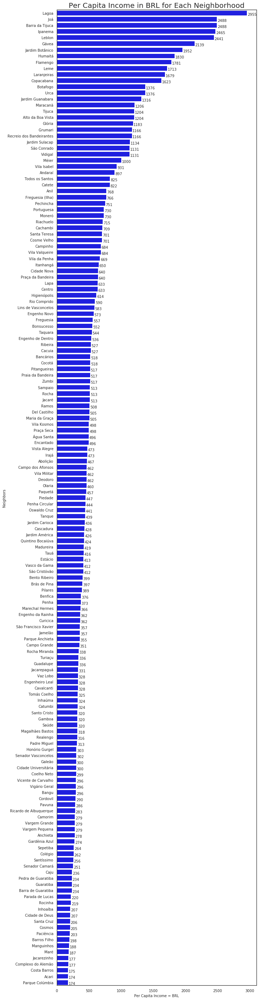
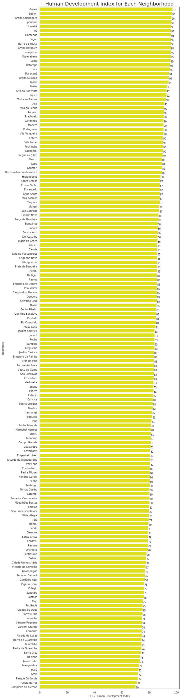
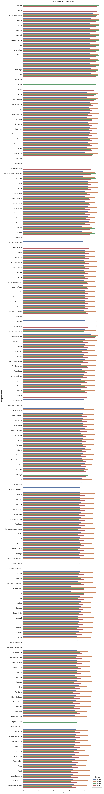
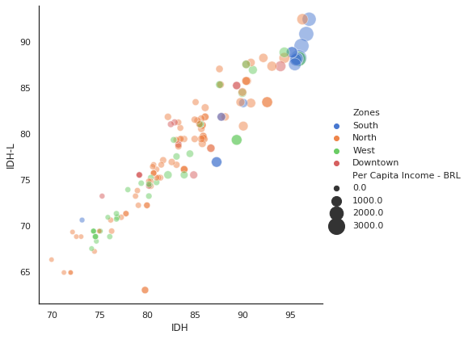
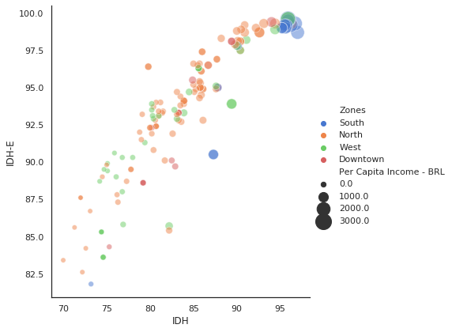
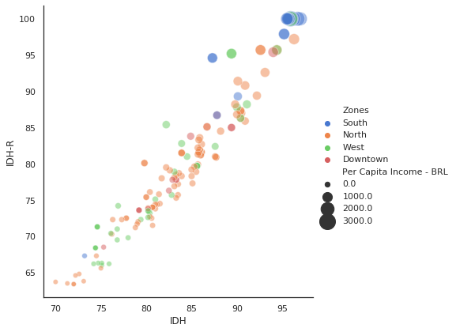
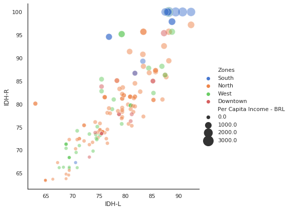
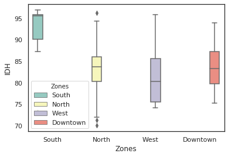
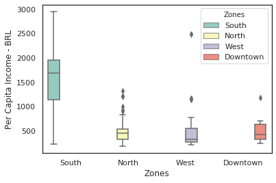
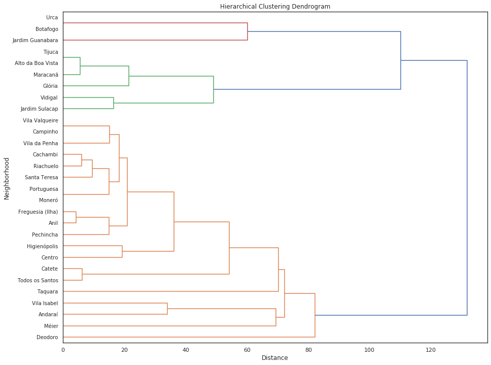

# IBM - Applied Data Science Capstone
### Week 4 - The Battle of Neighborhoods
#### Author: Rodrigo Eiras
##### [rodrigoeiras.github.io](https://rodrigoeiras.github.io)

### The present work takes place in Rio de Janeiro / Brazil


### Business Problem and Data Sources

#### The main problem here is try to answer what neighborhood in Rio de Janeiro is interesting to establish a new english school from a international franchise that not have good knowledge about the city. The present work uses data coming from the Foursquare API to locate and identify venues around the neighborhoods and census data from the city of Rio de Janeiro stored in Wikipedia.

---------------------------------------------

## Part 1: Importing and Cleaning Data from Wikipedia - Data Loading and Data Wrangling

----------------


### > Creating the data frame from Wikipedia about Rio de Janeiro census data

### >> Installing required packages


```python
!pip install beautifulsoup4
!pip install lxml
```

    Requirement already satisfied: beautifulsoup4 in /home/jupyterlab/conda/envs/python/lib/python3.6/site-packages (4.9.1)
    Requirement already satisfied: soupsieve>1.2 in /home/jupyterlab/conda/envs/python/lib/python3.6/site-packages (from beautifulsoup4) (2.0.1)
    Requirement already satisfied: lxml in /home/jupyterlab/conda/envs/python/lib/python3.6/site-packages (4.5.2)


### >> Importing libraries to manipulate data


```python
import requests
import urllib.request
import time
import pandas as pd
import numpy as np
from bs4 import BeautifulSoup
```

### >> Remove warnings output


```python
import warnings
warnings.filterwarnings('ignore')
```

### >> Downloading the wikipedia page that contains data from Rio de Janeiro neighborhoods


```python
website_url = requests.get('https://pt.wikipedia.org/wiki/Lista_de_bairros_do_Rio_de_Janeiro_por_IDH').text
```

### >> Parsing the HTML table to a DataFrame


```python
soup = BeautifulSoup(website_url,'lxml')
#print(soup.prettify()) - Used to check the HTML
```


```python
table = soup.find('table',{'class':'wikitable sortable'})
```


```python
table_str = str(table)
df = pd.read_html(table_str)[0]
```


```python
df.head()
```


<div>
<style scoped>
    .dataframe tbody tr th:only-of-type {
        vertical-align: middle;
    }

    .dataframe tbody tr th {
        vertical-align: top;
    }

    .dataframe thead tr th {
        text-align: left;
    }
</style>
<table border="1" class="dataframe">
  <thead>
    <tr>
      <th></th>
      <th>Nº</th>
      <th>Bairro ou grupo de bairros</th>
      <th>Esperançade vidaao nascer(em anos)</th>
      <th>Taxa de alfabe-tização de adultos (%)</th>
      <th>Taxa bruta defrequência escolar (%)</th>
      <th>Renda per capita (em R$ de 2000)</th>
      <th>Índice de Longe-vidade</th>
      <th>Índice de Educação</th>
      <th>Índice de Renda</th>
      <th>Índice de Desenvol-vimento Humano</th>
    </tr>
    <tr>
      <th></th>
      <th>Nº</th>
      <th>Bairro ou grupo de bairros</th>
      <th>Esperançade vidaao nascer(em anos)</th>
      <th>Taxa de alfabe-tização de adultos (%)</th>
      <th>Taxa bruta defrequência escolar (%)</th>
      <th>Renda per capita (em R$ de 2000)</th>
      <th>IDH-L</th>
      <th>IDH-E</th>
      <th>IDH-R</th>
      <th>IDH</th>
    </tr>
  </thead>
  <tbody>
    <tr>
      <th>0</th>
      <td>1</td>
      <td>Gávea</td>
      <td>8045.0</td>
      <td>9808.0</td>
      <td>118,13[a]</td>
      <td>2139,56 [b]</td>
      <td>924.0</td>
      <td>987.0</td>
      <td>1000.0</td>
      <td>0970</td>
    </tr>
    <tr>
      <th>1</th>
      <td>2</td>
      <td>Leblon</td>
      <td>7947.0</td>
      <td>9901.0</td>
      <td>105,18[a]</td>
      <td>2441,28[b]</td>
      <td>908.0</td>
      <td>993.0</td>
      <td>1000.0</td>
      <td>0967</td>
    </tr>
    <tr>
      <th>2</th>
      <td>3</td>
      <td>Jardim Guanabara</td>
      <td>8047.0</td>
      <td>9892.0</td>
      <td>111,15[a]</td>
      <td>1316,86[a]</td>
      <td>924.0</td>
      <td>993.0</td>
      <td>972.0</td>
      <td>0963</td>
    </tr>
    <tr>
      <th>3</th>
      <td>4</td>
      <td>Ipanema</td>
      <td>7868.0</td>
      <td>9878.0</td>
      <td>107,98[a]</td>
      <td>2465,45[b]</td>
      <td>895.0</td>
      <td>992.0</td>
      <td>1000.0</td>
      <td>0962</td>
    </tr>
    <tr>
      <th>4</th>
      <td>5</td>
      <td>Lagoa</td>
      <td>7791.0</td>
      <td>9946.0</td>
      <td>115,26[a]</td>
      <td>2955,29[b]</td>
      <td>882.0</td>
      <td>996.0</td>
      <td>1000.0</td>
      <td>0959</td>
    </tr>
  </tbody>
</table>
</div>


### >> Removing one level of the header as is duplicated and droping columns that will not be used


```python
df.columns = df.columns.droplevel(0)
```


```python
df = df.drop(df.columns[[2,3,4]], axis=1)
```


```python
df.head()
```


<div>
<style scoped>
    .dataframe tbody tr th:only-of-type {
        vertical-align: middle;
    }

    .dataframe tbody tr th {
        vertical-align: top;
    }

    .dataframe thead th {
        text-align: right;
    }
</style>
<table border="1" class="dataframe">
  <thead>
    <tr style="text-align: right;">
      <th></th>
      <th>Nº</th>
      <th>Bairro ou grupo de bairros</th>
      <th>Renda per capita (em R$ de 2000)</th>
      <th>IDH-L</th>
      <th>IDH-E</th>
      <th>IDH-R</th>
      <th>IDH</th>
    </tr>
  </thead>
  <tbody>
    <tr>
      <th>0</th>
      <td>1</td>
      <td>Gávea</td>
      <td>2139,56 [b]</td>
      <td>924.0</td>
      <td>987.0</td>
      <td>1000.0</td>
      <td>0970</td>
    </tr>
    <tr>
      <th>1</th>
      <td>2</td>
      <td>Leblon</td>
      <td>2441,28[b]</td>
      <td>908.0</td>
      <td>993.0</td>
      <td>1000.0</td>
      <td>0967</td>
    </tr>
    <tr>
      <th>2</th>
      <td>3</td>
      <td>Jardim Guanabara</td>
      <td>1316,86[a]</td>
      <td>924.0</td>
      <td>993.0</td>
      <td>972.0</td>
      <td>0963</td>
    </tr>
    <tr>
      <th>3</th>
      <td>4</td>
      <td>Ipanema</td>
      <td>2465,45[b]</td>
      <td>895.0</td>
      <td>992.0</td>
      <td>1000.0</td>
      <td>0962</td>
    </tr>
    <tr>
      <th>4</th>
      <td>5</td>
      <td>Lagoa</td>
      <td>2955,29[b]</td>
      <td>882.0</td>
      <td>996.0</td>
      <td>1000.0</td>
      <td>0959</td>
    </tr>
  </tbody>
</table>
</div>


### >> Removing hyperlinks boxes from the "Renda Per Capita" Column


```python
df['Renda per capita (em R$ de 2000)'] = df['Renda per capita (em R$ de 2000)'].str.replace(r"[a-z[\]]",'')
```


```python
df.head()
```


<div>
<style scoped>
    .dataframe tbody tr th:only-of-type {
        vertical-align: middle;
    }

    .dataframe tbody tr th {
        vertical-align: top;
    }

    .dataframe thead th {
        text-align: right;
    }
</style>
<table border="1" class="dataframe">
  <thead>
    <tr style="text-align: right;">
      <th></th>
      <th>Nº</th>
      <th>Bairro ou grupo de bairros</th>
      <th>Renda per capita (em R$ de 2000)</th>
      <th>IDH-L</th>
      <th>IDH-E</th>
      <th>IDH-R</th>
      <th>IDH</th>
    </tr>
  </thead>
  <tbody>
    <tr>
      <th>0</th>
      <td>1</td>
      <td>Gávea</td>
      <td>2139,56</td>
      <td>924.0</td>
      <td>987.0</td>
      <td>1000.0</td>
      <td>0970</td>
    </tr>
    <tr>
      <th>1</th>
      <td>2</td>
      <td>Leblon</td>
      <td>2441,28</td>
      <td>908.0</td>
      <td>993.0</td>
      <td>1000.0</td>
      <td>0967</td>
    </tr>
    <tr>
      <th>2</th>
      <td>3</td>
      <td>Jardim Guanabara</td>
      <td>1316,86</td>
      <td>924.0</td>
      <td>993.0</td>
      <td>972.0</td>
      <td>0963</td>
    </tr>
    <tr>
      <th>3</th>
      <td>4</td>
      <td>Ipanema</td>
      <td>2465,45</td>
      <td>895.0</td>
      <td>992.0</td>
      <td>1000.0</td>
      <td>0962</td>
    </tr>
    <tr>
      <th>4</th>
      <td>5</td>
      <td>Lagoa</td>
      <td>2955,29</td>
      <td>882.0</td>
      <td>996.0</td>
      <td>1000.0</td>
      <td>0959</td>
    </tr>
  </tbody>
</table>
</div>


### >> Removing commas and white spaces to fix the values in "Renda per Capita" column


```python
df['Renda per capita (em R$ de 2000)'] = (df['Renda per capita (em R$ de 2000)'].replace('\.','', regex=True)
                        .replace(',','', regex=True)
                        )
```


```python
df['Renda per capita (em R$ de 2000)'] = df['Renda per capita (em R$ de 2000)'].str.replace(' ', '')
```


```python
df.head()
```


<div>
<style scoped>
    .dataframe tbody tr th:only-of-type {
        vertical-align: middle;
    }

    .dataframe tbody tr th {
        vertical-align: top;
    }

    .dataframe thead th {
        text-align: right;
    }
</style>
<table border="1" class="dataframe">
  <thead>
    <tr style="text-align: right;">
      <th></th>
      <th>Nº</th>
      <th>Bairro ou grupo de bairros</th>
      <th>Renda per capita (em R$ de 2000)</th>
      <th>IDH-L</th>
      <th>IDH-E</th>
      <th>IDH-R</th>
      <th>IDH</th>
    </tr>
  </thead>
  <tbody>
    <tr>
      <th>0</th>
      <td>1</td>
      <td>Gávea</td>
      <td>213956</td>
      <td>924.0</td>
      <td>987.0</td>
      <td>1000.0</td>
      <td>0970</td>
    </tr>
    <tr>
      <th>1</th>
      <td>2</td>
      <td>Leblon</td>
      <td>244128</td>
      <td>908.0</td>
      <td>993.0</td>
      <td>1000.0</td>
      <td>0967</td>
    </tr>
    <tr>
      <th>2</th>
      <td>3</td>
      <td>Jardim Guanabara</td>
      <td>131686</td>
      <td>924.0</td>
      <td>993.0</td>
      <td>972.0</td>
      <td>0963</td>
    </tr>
    <tr>
      <th>3</th>
      <td>4</td>
      <td>Ipanema</td>
      <td>246545</td>
      <td>895.0</td>
      <td>992.0</td>
      <td>1000.0</td>
      <td>0962</td>
    </tr>
    <tr>
      <th>4</th>
      <td>5</td>
      <td>Lagoa</td>
      <td>295529</td>
      <td>882.0</td>
      <td>996.0</td>
      <td>1000.0</td>
      <td>0959</td>
    </tr>
  </tbody>
</table>
</div>


### >> Removing cents from "Renda per Capita" column to make it easier to evaluate


```python
df['Renda per capita (em R$ de 2000)'] = df['Renda per capita (em R$ de 2000)'].astype(str).str[:-2]
```


```python
df.head()
```


<div>
<style scoped>
    .dataframe tbody tr th:only-of-type {
        vertical-align: middle;
    }

    .dataframe tbody tr th {
        vertical-align: top;
    }

    .dataframe thead th {
        text-align: right;
    }
</style>
<table border="1" class="dataframe">
  <thead>
    <tr style="text-align: right;">
      <th></th>
      <th>Nº</th>
      <th>Bairro ou grupo de bairros</th>
      <th>Renda per capita (em R$ de 2000)</th>
      <th>IDH-L</th>
      <th>IDH-E</th>
      <th>IDH-R</th>
      <th>IDH</th>
    </tr>
  </thead>
  <tbody>
    <tr>
      <th>0</th>
      <td>1</td>
      <td>Gávea</td>
      <td>2139</td>
      <td>924.0</td>
      <td>987.0</td>
      <td>1000.0</td>
      <td>0970</td>
    </tr>
    <tr>
      <th>1</th>
      <td>2</td>
      <td>Leblon</td>
      <td>2441</td>
      <td>908.0</td>
      <td>993.0</td>
      <td>1000.0</td>
      <td>0967</td>
    </tr>
    <tr>
      <th>2</th>
      <td>3</td>
      <td>Jardim Guanabara</td>
      <td>1316</td>
      <td>924.0</td>
      <td>993.0</td>
      <td>972.0</td>
      <td>0963</td>
    </tr>
    <tr>
      <th>3</th>
      <td>4</td>
      <td>Ipanema</td>
      <td>2465</td>
      <td>895.0</td>
      <td>992.0</td>
      <td>1000.0</td>
      <td>0962</td>
    </tr>
    <tr>
      <th>4</th>
      <td>5</td>
      <td>Lagoa</td>
      <td>2955</td>
      <td>882.0</td>
      <td>996.0</td>
      <td>1000.0</td>
      <td>0959</td>
    </tr>
  </tbody>
</table>
</div>


```python
print(df.dtypes)
```

    Nº                                   object
    Bairro ou grupo de bairros           object
    Renda per capita (em R$ de 2000)     object
    IDH-L                               float64
    IDH-E                               float64
    IDH-R                               float64
    IDH                                  object
    dtype: object


```python
pd.set_option('display.max_rows', 200)
```

### >> Renaming Columns


```python
df = df.rename(columns={"Nº": "Number", "Bairro ou grupo de bairros": "Neighborhood", "Renda per capita (em R$ de 2000)": "Per Capita Income - BRL"})
```

### >> Spliting rows that has values separared by commas to new rows


```python
df = (df.set_index(df.columns.drop('Neighborhood',1).tolist())
   .Neighborhood.str.split(',', expand=True)
   .stack()
   .reset_index()
   .rename(columns={0:'Neighborhood'})
   .loc[:, df.columns]
   )
```

### >> Drop cells with a "-" in column "Number"


```python
df_dropna = df[df.Number != "—"].reset_index(drop=True)
```

### >> Fixing the neighborhood name for "Mangueira" to better localization on the map


```python
df_dropna["Neighborhood"] = df_dropna['Neighborhood'].replace(['Mangueira'],'Jamelão')
```

### >> Fixing "Freguesia" name that is duplicated


```python
df_dropna['Number'] = df_dropna['Number'].astype(int)
```


```python
df_dropna.loc[df_dropna['Number'] == 29, 'Neighborhood'] = "Freguesia (Ilha)"
```

### >> Casting all numeric columns to float and converting to percentages


```python
df_dropna['Per Capita Income - BRL'] = df_dropna['Per Capita Income - BRL'].astype(str).astype(float)
```


```python
print(df_dropna.dtypes)
```

    Number                       int64
    Neighborhood                object
    Per Capita Income - BRL    float64
    IDH-L                      float64
    IDH-E                      float64
    IDH-R                      float64
    IDH                         object
    dtype: object


```python
df_dropna['IDH'] = df_dropna['IDH'].astype(str).astype(float)
```


```python
df_dropna['IDH'] = df_dropna['IDH']/1000
df_dropna['IDH-R'] = df_dropna['IDH-R']/1000
df_dropna['IDH-E'] = df_dropna['IDH-E']/1000
df_dropna['IDH-L'] = df_dropna['IDH-L']/1000
```


```python
df_dropna['IDH'] = df_dropna['IDH']*100
df_dropna['IDH-R'] = df_dropna['IDH-R']*100
df_dropna['IDH-E'] = df_dropna['IDH-E']*100
df_dropna['IDH-L'] = df_dropna['IDH-L']*100
```


```python
df_dropna.head()
```


<div>
<style scoped>
    .dataframe tbody tr th:only-of-type {
        vertical-align: middle;
    }

    .dataframe tbody tr th {
        vertical-align: top;
    }

    .dataframe thead th {
        text-align: right;
    }
</style>
<table border="1" class="dataframe">
  <thead>
    <tr style="text-align: right;">
      <th></th>
      <th>Number</th>
      <th>Neighborhood</th>
      <th>Per Capita Income - BRL</th>
      <th>IDH-L</th>
      <th>IDH-E</th>
      <th>IDH-R</th>
      <th>IDH</th>
    </tr>
  </thead>
  <tbody>
    <tr>
      <th>0</th>
      <td>1</td>
      <td>Gávea</td>
      <td>2139.0</td>
      <td>92.4</td>
      <td>98.7</td>
      <td>100.0</td>
      <td>97.0</td>
    </tr>
    <tr>
      <th>1</th>
      <td>2</td>
      <td>Leblon</td>
      <td>2441.0</td>
      <td>90.8</td>
      <td>99.3</td>
      <td>100.0</td>
      <td>96.7</td>
    </tr>
    <tr>
      <th>2</th>
      <td>3</td>
      <td>Jardim Guanabara</td>
      <td>1316.0</td>
      <td>92.4</td>
      <td>99.3</td>
      <td>97.2</td>
      <td>96.3</td>
    </tr>
    <tr>
      <th>3</th>
      <td>4</td>
      <td>Ipanema</td>
      <td>2465.0</td>
      <td>89.5</td>
      <td>99.2</td>
      <td>100.0</td>
      <td>96.2</td>
    </tr>
    <tr>
      <th>4</th>
      <td>5</td>
      <td>Lagoa</td>
      <td>2955.0</td>
      <td>88.2</td>
      <td>99.6</td>
      <td>100.0</td>
      <td>95.9</td>
    </tr>
  </tbody>
</table>
</div>


### >> Finished part 1. Writing the data frame to a CSV file


```python
df.to_csv("rj_neighbors.csv", index=False)
```

_________

## Part 2: Geocoding

---------------------------


### > Geocoding Rio de Janeiro Addresses and Neighborhoods

### >> Importing libraries for geocoding


```python
!pip install geopandas
!pip install geopy
```

    Requirement already satisfied: geopandas in /home/jupyterlab/conda/envs/python/lib/python3.6/site-packages (0.8.1)
    Requirement already satisfied: shapely in /home/jupyterlab/conda/envs/python/lib/python3.6/site-packages (from geopandas) (1.7.0)
    Requirement already satisfied: fiona in /home/jupyterlab/conda/envs/python/lib/python3.6/site-packages (from geopandas) (1.8.13.post1)
    Requirement already satisfied: pyproj>=2.2.0 in /home/jupyterlab/conda/envs/python/lib/python3.6/site-packages (from geopandas) (2.6.1.post1)
    Requirement already satisfied: pandas>=0.23.0 in /home/jupyterlab/conda/envs/python/lib/python3.6/site-packages (from geopandas) (1.0.5)
    Requirement already satisfied: six>=1.7 in /home/jupyterlab/conda/envs/python/lib/python3.6/site-packages (from fiona->geopandas) (1.15.0)
    Requirement already satisfied: cligj>=0.5 in /home/jupyterlab/conda/envs/python/lib/python3.6/site-packages (from fiona->geopandas) (0.5.0)
    Requirement already satisfied: click-plugins>=1.0 in /home/jupyterlab/conda/envs/python/lib/python3.6/site-packages (from fiona->geopandas) (1.1.1)
    Requirement already satisfied: munch in /home/jupyterlab/conda/envs/python/lib/python3.6/site-packages (from fiona->geopandas) (2.5.0)
    Requirement already satisfied: click<8,>=4.0 in /home/jupyterlab/conda/envs/python/lib/python3.6/site-packages (from fiona->geopandas) (7.1.2)
    Requirement already satisfied: attrs>=17 in /home/jupyterlab/conda/envs/python/lib/python3.6/site-packages (from fiona->geopandas) (19.3.0)
    Requirement already satisfied: pytz>=2017.2 in /home/jupyterlab/conda/envs/python/lib/python3.6/site-packages (from pandas>=0.23.0->geopandas) (2020.1)
    Requirement already satisfied: python-dateutil>=2.6.1 in /home/jupyterlab/conda/envs/python/lib/python3.6/site-packages (from pandas>=0.23.0->geopandas) (2.8.1)
    Requirement already satisfied: numpy>=1.13.3 in /home/jupyterlab/conda/envs/python/lib/python3.6/site-packages (from pandas>=0.23.0->geopandas) (1.19.0)
    Requirement already satisfied: geopy in /home/jupyterlab/conda/envs/python/lib/python3.6/site-packages (2.0.0)
    Requirement already satisfied: geographiclib<2,>=1.49 in /home/jupyterlab/conda/envs/python/lib/python3.6/site-packages (from geopy) (1.50)


### >> Concatenating the Neighborhood to Rio de Janeiro and Brazil strings


```python
df_dropna["Address"] = df_dropna['Neighborhood']+", "+"Rio de Janeiro"+", "+"Brazil"
```


```python
df_dropna.head()
```


<div>
<style scoped>
    .dataframe tbody tr th:only-of-type {
        vertical-align: middle;
    }

    .dataframe tbody tr th {
        vertical-align: top;
    }

    .dataframe thead th {
        text-align: right;
    }
</style>
<table border="1" class="dataframe">
  <thead>
    <tr style="text-align: right;">
      <th></th>
      <th>Number</th>
      <th>Neighborhood</th>
      <th>Per Capita Income - BRL</th>
      <th>IDH-L</th>
      <th>IDH-E</th>
      <th>IDH-R</th>
      <th>IDH</th>
      <th>Address</th>
    </tr>
  </thead>
  <tbody>
    <tr>
      <th>0</th>
      <td>1</td>
      <td>Gávea</td>
      <td>2139.0</td>
      <td>92.4</td>
      <td>98.7</td>
      <td>100.0</td>
      <td>97.0</td>
      <td>Gávea, Rio de Janeiro, Brazil</td>
    </tr>
    <tr>
      <th>1</th>
      <td>2</td>
      <td>Leblon</td>
      <td>2441.0</td>
      <td>90.8</td>
      <td>99.3</td>
      <td>100.0</td>
      <td>96.7</td>
      <td>Leblon, Rio de Janeiro, Brazil</td>
    </tr>
    <tr>
      <th>2</th>
      <td>3</td>
      <td>Jardim Guanabara</td>
      <td>1316.0</td>
      <td>92.4</td>
      <td>99.3</td>
      <td>97.2</td>
      <td>96.3</td>
      <td>Jardim Guanabara, Rio de Janeiro, Brazil</td>
    </tr>
    <tr>
      <th>3</th>
      <td>4</td>
      <td>Ipanema</td>
      <td>2465.0</td>
      <td>89.5</td>
      <td>99.2</td>
      <td>100.0</td>
      <td>96.2</td>
      <td>Ipanema, Rio de Janeiro, Brazil</td>
    </tr>
    <tr>
      <th>4</th>
      <td>5</td>
      <td>Lagoa</td>
      <td>2955.0</td>
      <td>88.2</td>
      <td>99.6</td>
      <td>100.0</td>
      <td>95.9</td>
      <td>Lagoa, Rio de Janeiro, Brazil</td>
    </tr>
  </tbody>
</table>
</div>


### >> Geocoding the Address from Rio de Janeiro neighborhoods


```python
from geopy.extra.rate_limiter import RateLimiter
from geopy.geocoders import Nominatim

locator = Nominatim(user_agent="myGeocoder")

# 1 - conveneint function to delay between geocoding calls
geocode = RateLimiter(locator.geocode, min_delay_seconds=1)
# 2- - create location column
df_dropna['location'] = df_dropna['Address'].apply(geocode)
# 3 - create longitude, laatitude and altitude from location column (returns tuple)
df_dropna['point'] = df_dropna['location'].apply(lambda loc: tuple(loc.point) if loc else None)
# 4 - split point column into latitude, longitude and altitude columns
df_dropna[['latitude', 'longitude', 'altitude']] = pd.DataFrame(df_dropna['point'].tolist(), index=df_dropna.index)
```


```python
df_dropna.head()
```


<div>
<style scoped>
    .dataframe tbody tr th:only-of-type {
        vertical-align: middle;
    }

    .dataframe tbody tr th {
        vertical-align: top;
    }

    .dataframe thead th {
        text-align: right;
    }
</style>
<table border="1" class="dataframe">
  <thead>
    <tr style="text-align: right;">
      <th></th>
      <th>Number</th>
      <th>Neighborhood</th>
      <th>Per Capita Income - BRL</th>
      <th>IDH-L</th>
      <th>IDH-E</th>
      <th>IDH-R</th>
      <th>IDH</th>
      <th>Address</th>
      <th>location</th>
      <th>point</th>
      <th>latitude</th>
      <th>longitude</th>
      <th>altitude</th>
    </tr>
  </thead>
  <tbody>
    <tr>
      <th>0</th>
      <td>1</td>
      <td>Gávea</td>
      <td>2139.0</td>
      <td>92.4</td>
      <td>98.7</td>
      <td>100.0</td>
      <td>97.0</td>
      <td>Gávea, Rio de Janeiro, Brazil</td>
      <td>(Gávea, Zona Sul do Rio de Janeiro, Rio de Jan...</td>
      <td>(-22.9814243, -43.2383245, 0.0)</td>
      <td>-22.981424</td>
      <td>-43.238324</td>
      <td>0.0</td>
    </tr>
    <tr>
      <th>1</th>
      <td>2</td>
      <td>Leblon</td>
      <td>2441.0</td>
      <td>90.8</td>
      <td>99.3</td>
      <td>100.0</td>
      <td>96.7</td>
      <td>Leblon, Rio de Janeiro, Brazil</td>
      <td>(Leblon, Zona Sul do Rio de Janeiro, Rio de Ja...</td>
      <td>(-22.983556, -43.2249377, 0.0)</td>
      <td>-22.983556</td>
      <td>-43.224938</td>
      <td>0.0</td>
    </tr>
    <tr>
      <th>2</th>
      <td>3</td>
      <td>Jardim Guanabara</td>
      <td>1316.0</td>
      <td>92.4</td>
      <td>99.3</td>
      <td>97.2</td>
      <td>96.3</td>
      <td>Jardim Guanabara, Rio de Janeiro, Brazil</td>
      <td>(Jardim Guanabara, Zona Norte do Rio de Janeir...</td>
      <td>(-22.8128362, -43.2007792, 0.0)</td>
      <td>-22.812836</td>
      <td>-43.200779</td>
      <td>0.0</td>
    </tr>
    <tr>
      <th>3</th>
      <td>4</td>
      <td>Ipanema</td>
      <td>2465.0</td>
      <td>89.5</td>
      <td>99.2</td>
      <td>100.0</td>
      <td>96.2</td>
      <td>Ipanema, Rio de Janeiro, Brazil</td>
      <td>(Ipanema, Zona Sul do Rio de Janeiro, Rio de J...</td>
      <td>(-22.9839557, -43.2022163, 0.0)</td>
      <td>-22.983956</td>
      <td>-43.202216</td>
      <td>0.0</td>
    </tr>
    <tr>
      <th>4</th>
      <td>5</td>
      <td>Lagoa</td>
      <td>2955.0</td>
      <td>88.2</td>
      <td>99.6</td>
      <td>100.0</td>
      <td>95.9</td>
      <td>Lagoa, Rio de Janeiro, Brazil</td>
      <td>(Lagoa, Zona Sul do Rio de Janeiro, Rio de Jan...</td>
      <td>(-22.9624658, -43.2024884, 0.0)</td>
      <td>-22.962466</td>
      <td>-43.202488</td>
      <td>0.0</td>
    </tr>
  </tbody>
</table>
</div>


### >> Extracting the regions (zones) from the city

>>> Note that Rio de Janeiro doens't have "EAST" region since it is represented by the bay coast)
>>> * N = Norte
>>> * S = Sul
>>> * W = Oeste
>>> * Downtown = Central

>>> 


```python
df_zones = df_dropna["location"].apply(pd.Series)
```


```python
df_zones = df_zones[0].str.split(",").str[1]
```


```python
df_zones = df_zones.str.split(" ").str[2]
```


```python
df_dropna["Zones"] = df_zones
```


```python
df_dropna.head()
```


<div>
<style scoped>
    .dataframe tbody tr th:only-of-type {
        vertical-align: middle;
    }

    .dataframe tbody tr th {
        vertical-align: top;
    }

    .dataframe thead th {
        text-align: right;
    }
</style>
<table border="1" class="dataframe">
  <thead>
    <tr style="text-align: right;">
      <th></th>
      <th>Number</th>
      <th>Neighborhood</th>
      <th>Per Capita Income - BRL</th>
      <th>IDH-L</th>
      <th>IDH-E</th>
      <th>IDH-R</th>
      <th>IDH</th>
      <th>Address</th>
      <th>location</th>
      <th>point</th>
      <th>latitude</th>
      <th>longitude</th>
      <th>altitude</th>
      <th>Zones</th>
    </tr>
  </thead>
  <tbody>
    <tr>
      <th>0</th>
      <td>1</td>
      <td>Gávea</td>
      <td>2139.0</td>
      <td>92.4</td>
      <td>98.7</td>
      <td>100.0</td>
      <td>97.0</td>
      <td>Gávea, Rio de Janeiro, Brazil</td>
      <td>(Gávea, Zona Sul do Rio de Janeiro, Rio de Jan...</td>
      <td>(-22.9814243, -43.2383245, 0.0)</td>
      <td>-22.981424</td>
      <td>-43.238324</td>
      <td>0.0</td>
      <td>Sul</td>
    </tr>
    <tr>
      <th>1</th>
      <td>2</td>
      <td>Leblon</td>
      <td>2441.0</td>
      <td>90.8</td>
      <td>99.3</td>
      <td>100.0</td>
      <td>96.7</td>
      <td>Leblon, Rio de Janeiro, Brazil</td>
      <td>(Leblon, Zona Sul do Rio de Janeiro, Rio de Ja...</td>
      <td>(-22.983556, -43.2249377, 0.0)</td>
      <td>-22.983556</td>
      <td>-43.224938</td>
      <td>0.0</td>
      <td>Sul</td>
    </tr>
    <tr>
      <th>2</th>
      <td>3</td>
      <td>Jardim Guanabara</td>
      <td>1316.0</td>
      <td>92.4</td>
      <td>99.3</td>
      <td>97.2</td>
      <td>96.3</td>
      <td>Jardim Guanabara, Rio de Janeiro, Brazil</td>
      <td>(Jardim Guanabara, Zona Norte do Rio de Janeir...</td>
      <td>(-22.8128362, -43.2007792, 0.0)</td>
      <td>-22.812836</td>
      <td>-43.200779</td>
      <td>0.0</td>
      <td>Norte</td>
    </tr>
    <tr>
      <th>3</th>
      <td>4</td>
      <td>Ipanema</td>
      <td>2465.0</td>
      <td>89.5</td>
      <td>99.2</td>
      <td>100.0</td>
      <td>96.2</td>
      <td>Ipanema, Rio de Janeiro, Brazil</td>
      <td>(Ipanema, Zona Sul do Rio de Janeiro, Rio de J...</td>
      <td>(-22.9839557, -43.2022163, 0.0)</td>
      <td>-22.983956</td>
      <td>-43.202216</td>
      <td>0.0</td>
      <td>Sul</td>
    </tr>
    <tr>
      <th>4</th>
      <td>5</td>
      <td>Lagoa</td>
      <td>2955.0</td>
      <td>88.2</td>
      <td>99.6</td>
      <td>100.0</td>
      <td>95.9</td>
      <td>Lagoa, Rio de Janeiro, Brazil</td>
      <td>(Lagoa, Zona Sul do Rio de Janeiro, Rio de Jan...</td>
      <td>(-22.9624658, -43.2024884, 0.0)</td>
      <td>-22.962466</td>
      <td>-43.202488</td>
      <td>0.0</td>
      <td>Sul</td>
    </tr>
  </tbody>
</table>
</div>


### >> Fixing some regions incorrectly labeled


```python
df_dropna.loc[df_dropna['Number'] == 10, 'Zones'] = "Sul"
df_dropna.loc[df_dropna['Neighborhood'] == "Botafogo", 'Zones'] = "Sul"
df_dropna.loc[df_dropna['Neighborhood'] == "Maracanã", 'Zones'] = "Norte"
df_dropna.loc[df_dropna['Neighborhood'] == "Paquetá", 'Zones'] = "Norte"
df_dropna.loc[df_dropna['Neighborhood'] == "Manguinhos", 'Zones'] = "Norte"
df_dropna.loc[df_dropna['Neighborhood'] == "Jamelão", 'Zones'] = "Norte"
```

### >> Translating the regions


```python
df_dropna.loc[df_dropna['Zones'] == "Sul", 'Zones'] = "South"
df_dropna.loc[df_dropna['Zones'] == "Norte", 'Zones'] = "North"
df_dropna.loc[df_dropna['Zones'] == "Central", 'Zones'] = "Downtown"
df_dropna.loc[df_dropna['Zones'] == "Oeste", 'Zones'] = "West"
```


```python
df_dropna.head()
```


<div>
<style scoped>
    .dataframe tbody tr th:only-of-type {
        vertical-align: middle;
    }

    .dataframe tbody tr th {
        vertical-align: top;
    }

    .dataframe thead th {
        text-align: right;
    }
</style>
<table border="1" class="dataframe">
  <thead>
    <tr style="text-align: right;">
      <th></th>
      <th>Number</th>
      <th>Neighborhood</th>
      <th>Per Capita Income - BRL</th>
      <th>IDH-L</th>
      <th>IDH-E</th>
      <th>IDH-R</th>
      <th>IDH</th>
      <th>Address</th>
      <th>location</th>
      <th>point</th>
      <th>latitude</th>
      <th>longitude</th>
      <th>altitude</th>
      <th>Zones</th>
    </tr>
  </thead>
  <tbody>
    <tr>
      <th>0</th>
      <td>1</td>
      <td>Gávea</td>
      <td>2139.0</td>
      <td>92.4</td>
      <td>98.7</td>
      <td>100.0</td>
      <td>97.0</td>
      <td>Gávea, Rio de Janeiro, Brazil</td>
      <td>(Gávea, Zona Sul do Rio de Janeiro, Rio de Jan...</td>
      <td>(-22.9814243, -43.2383245, 0.0)</td>
      <td>-22.981424</td>
      <td>-43.238324</td>
      <td>0.0</td>
      <td>South</td>
    </tr>
    <tr>
      <th>1</th>
      <td>2</td>
      <td>Leblon</td>
      <td>2441.0</td>
      <td>90.8</td>
      <td>99.3</td>
      <td>100.0</td>
      <td>96.7</td>
      <td>Leblon, Rio de Janeiro, Brazil</td>
      <td>(Leblon, Zona Sul do Rio de Janeiro, Rio de Ja...</td>
      <td>(-22.983556, -43.2249377, 0.0)</td>
      <td>-22.983556</td>
      <td>-43.224938</td>
      <td>0.0</td>
      <td>South</td>
    </tr>
    <tr>
      <th>2</th>
      <td>3</td>
      <td>Jardim Guanabara</td>
      <td>1316.0</td>
      <td>92.4</td>
      <td>99.3</td>
      <td>97.2</td>
      <td>96.3</td>
      <td>Jardim Guanabara, Rio de Janeiro, Brazil</td>
      <td>(Jardim Guanabara, Zona Norte do Rio de Janeir...</td>
      <td>(-22.8128362, -43.2007792, 0.0)</td>
      <td>-22.812836</td>
      <td>-43.200779</td>
      <td>0.0</td>
      <td>North</td>
    </tr>
    <tr>
      <th>3</th>
      <td>4</td>
      <td>Ipanema</td>
      <td>2465.0</td>
      <td>89.5</td>
      <td>99.2</td>
      <td>100.0</td>
      <td>96.2</td>
      <td>Ipanema, Rio de Janeiro, Brazil</td>
      <td>(Ipanema, Zona Sul do Rio de Janeiro, Rio de J...</td>
      <td>(-22.9839557, -43.2022163, 0.0)</td>
      <td>-22.983956</td>
      <td>-43.202216</td>
      <td>0.0</td>
      <td>South</td>
    </tr>
    <tr>
      <th>4</th>
      <td>5</td>
      <td>Lagoa</td>
      <td>2955.0</td>
      <td>88.2</td>
      <td>99.6</td>
      <td>100.0</td>
      <td>95.9</td>
      <td>Lagoa, Rio de Janeiro, Brazil</td>
      <td>(Lagoa, Zona Sul do Rio de Janeiro, Rio de Jan...</td>
      <td>(-22.9624658, -43.2024884, 0.0)</td>
      <td>-22.962466</td>
      <td>-43.202488</td>
      <td>0.0</td>
      <td>South</td>
    </tr>
  </tbody>
</table>
</div>


### >> Shapping the geocoded dataframe


```python
df_dropna.shape
```


    (159, 14)


```python
df_dropna["Number"] = pd.Series(range(0,159))
```


```python
df_dropna.to_csv('rj_neighbors_geocoded.csv', index=False, encoding='UTF-8')
```

___________

## Part 3: Data Exploration and Data Visualization

-------------------------------

### > Plotting the Neighborhoods in Folium map

### >> Importing libraries for Folium


```python
from xml.etree import ElementTree
import folium
```


```python
df_geocoded = pd.read_csv("rj_neighbors_geocoded.csv", encoding='UTF-8')
```

### >> Seting up a central point


```python
locations = df_geocoded[['latitude', 'longitude']]
locationlist = locations.values.tolist()
len(locationlist)
centerpoint = locationlist[7]
```

### >> Showing the neighborhoods in Rio de Janeiro


```python
map = folium.Map(location=centerpoint, zoom_start=11)
for point in range(0, len(locationlist)):
    folium.Marker(locationlist[point], popup=folium.Popup(df_geocoded['Neighborhood'][point],parse_html=True)).add_to(map)
map
```


<div style="width:100%;"><div style="position:relative;width:100%;height:0;padding-bottom:60%;"><span style="color:#565656">Make this Notebook Trusted to load map: File -> Trust Notebook</span><iframe src="about:blank" style="position:absolute;width:100%;height:100%;left:0;top:0;border:none !important;" data-html=PCFET0NUWVBFIGh0bWw+CjxoZWFkPiAgICAKICAgIDxtZXRhIGh0dHAtZXF1aXY9ImNvbnRlbnQtdHlwZSIgY29udGVudD0idGV4dC9odG1sOyBjaGFyc2V0PVVURi04IiAvPgogICAgPHNjcmlwdD5MX1BSRUZFUl9DQU5WQVMgPSBmYWxzZTsgTF9OT19UT1VDSCA9IGZhbHNlOyBMX0RJU0FCTEVfM0QgPSBmYWxzZTs8L3NjcmlwdD4KICAgIDxzY3JpcHQgc3JjPSJodHRwczovL2Nkbi5qc2RlbGl2ci5uZXQvbnBtL2xlYWZsZXRAMS4yLjAvZGlzdC9sZWFmbGV0LmpzIj48L3NjcmlwdD4KICAgIDxzY3JpcHQgc3JjPSJodHRwczovL2FqYXguZ29vZ2xlYXBpcy5jb20vYWpheC9saWJzL2pxdWVyeS8xLjExLjEvanF1ZXJ5Lm1pbi5qcyI+PC9zY3JpcHQ+CiAgICA8c2NyaXB0IHNyYz0iaHR0cHM6Ly9tYXhjZG4uYm9vdHN0cmFwY2RuLmNvbS9ib290c3RyYXAvMy4yLjAvanMvYm9vdHN0cmFwLm1pbi5qcyI+PC9zY3JpcHQ+CiAgICA8c2NyaXB0IHNyYz0iaHR0cHM6Ly9jZG5qcy5jbG91ZGZsYXJlLmNvbS9hamF4L2xpYnMvTGVhZmxldC5hd2Vzb21lLW1hcmtlcnMvMi4wLjIvbGVhZmxldC5hd2Vzb21lLW1hcmtlcnMuanMiPjwvc2NyaXB0PgogICAgPGxpbmsgcmVsPSJzdHlsZXNoZWV0IiBocmVmPSJodHRwczovL2Nkbi5qc2RlbGl2ci5uZXQvbnBtL2xlYWZsZXRAMS4yLjAvZGlzdC9sZWFmbGV0LmNzcyIvPgogICAgPGxpbmsgcmVsPSJzdHlsZXNoZWV0IiBocmVmPSJodHRwczovL21heGNkbi5ib290c3RyYXBjZG4uY29tL2Jvb3RzdHJhcC8zLjIuMC9jc3MvYm9vdHN0cmFwLm1pbi5jc3MiLz4KICAgIDxsaW5rIHJlbD0ic3R5bGVzaGVldCIgaHJlZj0iaHR0cHM6Ly9tYXhjZG4uYm9vdHN0cmFwY2RuLmNvbS9ib290c3RyYXAvMy4yLjAvY3NzL2Jvb3RzdHJhcC10aGVtZS5taW4uY3NzIi8+CiAgICA8bGluayByZWw9InN0eWxlc2hlZXQiIGhyZWY9Imh0dHBzOi8vbWF4Y2RuLmJvb3RzdHJhcGNkbi5jb20vZm9udC1hd2Vzb21lLzQuNi4zL2Nzcy9mb250LWF3ZXNvbWUubWluLmNzcyIvPgogICAgPGxpbmsgcmVsPSJzdHlsZXNoZWV0IiBocmVmPSJodHRwczovL2NkbmpzLmNsb3VkZmxhcmUuY29tL2FqYXgvbGlicy9MZWFmbGV0LmF3ZXNvbWUtbWFya2Vycy8yLjAuMi9sZWFmbGV0LmF3ZXNvbWUtbWFya2Vycy5jc3MiLz4KICAgIDxsaW5rIHJlbD0ic3R5bGVzaGVldCIgaHJlZj0iaHR0cHM6Ly9yYXdnaXQuY29tL3B5dGhvbi12aXN1YWxpemF0aW9uL2ZvbGl1bS9tYXN0ZXIvZm9saXVtL3RlbXBsYXRlcy9sZWFmbGV0LmF3ZXNvbWUucm90YXRlLmNzcyIvPgogICAgPHN0eWxlPmh0bWwsIGJvZHkge3dpZHRoOiAxMDAlO2hlaWdodDogMTAwJTttYXJnaW46IDA7cGFkZGluZzogMDt9PC9zdHlsZT4KICAgIDxzdHlsZT4jbWFwIHtwb3NpdGlvbjphYnNvbHV0ZTt0b3A6MDtib3R0b206MDtyaWdodDowO2xlZnQ6MDt9PC9zdHlsZT4KICAgIAogICAgICAgICAgICA8c3R5bGU+ICNtYXBfZDA0MzgxMGVhNjA2NDkwMjg5NmE1NTVjYzcxMjUzNmUgewogICAgICAgICAgICAgICAgcG9zaXRpb24gOiByZWxhdGl2ZTsKICAgICAgICAgICAgICAgIHdpZHRoIDogMTAwLjAlOwogICAgICAgICAgICAgICAgaGVpZ2h0OiAxMDAuMCU7CiAgICAgICAgICAgICAgICBsZWZ0OiAwLjAlOwogICAgICAgICAgICAgICAgdG9wOiAwLjAlOwogICAgICAgICAgICAgICAgfQogICAgICAgICAgICA8L3N0eWxlPgogICAgICAgIAo8L2hlYWQ+Cjxib2R5PiAgICAKICAgIAogICAgICAgICAgICA8ZGl2IGNsYXNzPSJmb2xpdW0tbWFwIiBpZD0ibWFwX2QwNDM4MTBlYTYwNjQ5MDI4OTZhNTU1Y2M3MTI1MzZlIiA+PC9kaXY+CiAgICAgICAgCjwvYm9keT4KPHNjcmlwdD4gICAgCiAgICAKCiAgICAgICAgICAgIAogICAgICAgICAgICAgICAgdmFyIGJvdW5kcyA9IG51bGw7CiAgICAgICAgICAgIAoKICAgICAgICAgICAgdmFyIG1hcF9kMDQzODEwZWE2MDY0OTAyODk2YTU1NWNjNzEyNTM2ZSA9IEwubWFwKAogICAgICAgICAgICAgICAgICAgICAgICAgICAgICAgICAgJ21hcF9kMDQzODEwZWE2MDY0OTAyODk2YTU1NWNjNzEyNTM2ZScsCiAgICAgICAgICAgICAgICAgICAgICAgICAgICAgICAgICB7Y2VudGVyOiBbLTIyLjk5OTc0MDM5OTk5OTk5NywtNDMuMzY1OTkyOV0sCiAgICAgICAgICAgICAgICAgICAgICAgICAgICAgICAgICB6b29tOiAxMSwKICAgICAgICAgICAgICAgICAgICAgICAgICAgICAgICAgIG1heEJvdW5kczogYm91bmRzLAogICAgICAgICAgICAgICAgICAgICAgICAgICAgICAgICAgbGF5ZXJzOiBbXSwKICAgICAgICAgICAgICAgICAgICAgICAgICAgICAgICAgIHdvcmxkQ29weUp1bXA6IGZhbHNlLAogICAgICAgICAgICAgICAgICAgICAgICAgICAgICAgICAgY3JzOiBMLkNSUy5FUFNHMzg1NwogICAgICAgICAgICAgICAgICAgICAgICAgICAgICAgICB9KTsKICAgICAgICAgICAgCiAgICAgICAgCiAgICAKICAgICAgICAgICAgdmFyIHRpbGVfbGF5ZXJfOTdjMzJjODk2NTQxNGJhNWE3NTZkODhiZDE2OTUwODcgPSBMLnRpbGVMYXllcigKICAgICAgICAgICAgICAgICdodHRwczovL3tzfS50aWxlLm9wZW5zdHJlZXRtYXAub3JnL3t6fS97eH0ve3l9LnBuZycsCiAgICAgICAgICAgICAgICB7CiAgImF0dHJpYnV0aW9uIjogbnVsbCwKICAiZGV0ZWN0UmV0aW5hIjogZmFsc2UsCiAgIm1heFpvb20iOiAxOCwKICAibWluWm9vbSI6IDEsCiAgIm5vV3JhcCI6IGZhbHNlLAogICJzdWJkb21haW5zIjogImFiYyIKfQogICAgICAgICAgICAgICAgKS5hZGRUbyhtYXBfZDA0MzgxMGVhNjA2NDkwMjg5NmE1NTVjYzcxMjUzNmUpOwogICAgICAgIAogICAgCgogICAgICAgICAgICB2YXIgbWFya2VyXzQ4ZTU5MzAxYWY3ODRkMWI4ODY3Y2JhNDRlZjk3NzE3ID0gTC5tYXJrZXIoCiAgICAgICAgICAgICAgICBbLTIyLjk4MTQyNDMsLTQzLjIzODMyNDVdLAogICAgICAgICAgICAgICAgewogICAgICAgICAgICAgICAgICAgIGljb246IG5ldyBMLkljb24uRGVmYXVsdCgpCiAgICAgICAgICAgICAgICAgICAgfQogICAgICAgICAgICAgICAgKQogICAgICAgICAgICAgICAgLmFkZFRvKG1hcF9kMDQzODEwZWE2MDY0OTAyODk2YTU1NWNjNzEyNTM2ZSk7CiAgICAgICAgICAgIAogICAgCiAgICAgICAgICAgIHZhciBwb3B1cF8yMmYyMjlhYWU4Nzc0ZWM4YTE5NDNkODMzY2I3MTBhMyA9IEwucG9wdXAoe21heFdpZHRoOiAnMzAwJ30pOwoKICAgICAgICAgICAgCiAgICAgICAgICAgICAgICB2YXIgaHRtbF9mNjFjZWZlZWYyMzk0M2FjYjYxYTA3MGUzNzQ4MGU0OCA9ICQoJzxkaXYgaWQ9Imh0bWxfZjYxY2VmZWVmMjM5NDNhY2I2MWEwNzBlMzc0ODBlNDgiIHN0eWxlPSJ3aWR0aDogMTAwLjAlOyBoZWlnaHQ6IDEwMC4wJTsiPkfDoXZlYTwvZGl2PicpWzBdOwogICAgICAgICAgICAgICAgcG9wdXBfMjJmMjI5YWFlODc3NGVjOGExOTQzZDgzM2NiNzEwYTMuc2V0Q29udGVudChodG1sX2Y2MWNlZmVlZjIzOTQzYWNiNjFhMDcwZTM3NDgwZTQ4KTsKICAgICAgICAgICAgCgogICAgICAgICAgICBtYXJrZXJfNDhlNTkzMDFhZjc4NGQxYjg4NjdjYmE0NGVmOTc3MTcuYmluZFBvcHVwKHBvcHVwXzIyZjIyOWFhZTg3NzRlYzhhMTk0M2Q4MzNjYjcxMGEzKTsKCiAgICAgICAgICAgIAogICAgICAgIAogICAgCgogICAgICAgICAgICB2YXIgbWFya2VyXzZkMTNmM2UyNjEwMzRiY2E4NTQyM2JkNTE2YzIyYzkxID0gTC5tYXJrZXIoCiAgICAgICAgICAgICAgICBbLTIyLjk4MzU1NiwtNDMuMjI0OTM3NzAwMDAwMDA1XSwKICAgICAgICAgICAgICAgIHsKICAgICAgICAgICAgICAgICAgICBpY29uOiBuZXcgTC5JY29uLkRlZmF1bHQoKQogICAgICAgICAgICAgICAgICAgIH0KICAgICAgICAgICAgICAgICkKICAgICAgICAgICAgICAgIC5hZGRUbyhtYXBfZDA0MzgxMGVhNjA2NDkwMjg5NmE1NTVjYzcxMjUzNmUpOwogICAgICAgICAgICAKICAgIAogICAgICAgICAgICB2YXIgcG9wdXBfNzcxZWI4YTRjMDViNDk5OTkyNDQyMzExNTM2MGU2NDYgPSBMLnBvcHVwKHttYXhXaWR0aDogJzMwMCd9KTsKCiAgICAgICAgICAgIAogICAgICAgICAgICAgICAgdmFyIGh0bWxfYjQ2ZDMyYjFjMTg3NGU3MWE5NDA3ODAzYTQ0YjIwYWQgPSAkKCc8ZGl2IGlkPSJodG1sX2I0NmQzMmIxYzE4NzRlNzFhOTQwNzgwM2E0NGIyMGFkIiBzdHlsZT0id2lkdGg6IDEwMC4wJTsgaGVpZ2h0OiAxMDAuMCU7Ij5MZWJsb248L2Rpdj4nKVswXTsKICAgICAgICAgICAgICAgIHBvcHVwXzc3MWViOGE0YzA1YjQ5OTk5MjQ0MjMxMTUzNjBlNjQ2LnNldENvbnRlbnQoaHRtbF9iNDZkMzJiMWMxODc0ZTcxYTk0MDc4MDNhNDRiMjBhZCk7CiAgICAgICAgICAgIAoKICAgICAgICAgICAgbWFya2VyXzZkMTNmM2UyNjEwMzRiY2E4NTQyM2JkNTE2YzIyYzkxLmJpbmRQb3B1cChwb3B1cF83NzFlYjhhNGMwNWI0OTk5OTI0NDIzMTE1MzYwZTY0Nik7CgogICAgICAgICAgICAKICAgICAgICAKICAgIAoKICAgICAgICAgICAgdmFyIG1hcmtlcl9jY2ZiNjFmZWJmMDQ0ZGZhOTc3ZWM1NGU1MzUyMzM0YyA9IEwubWFya2VyKAogICAgICAgICAgICAgICAgWy0yMi44MTI4MzYyLC00My4yMDA3NzkyXSwKICAgICAgICAgICAgICAgIHsKICAgICAgICAgICAgICAgICAgICBpY29uOiBuZXcgTC5JY29uLkRlZmF1bHQoKQogICAgICAgICAgICAgICAgICAgIH0KICAgICAgICAgICAgICAgICkKICAgICAgICAgICAgICAgIC5hZGRUbyhtYXBfZDA0MzgxMGVhNjA2NDkwMjg5NmE1NTVjYzcxMjUzNmUpOwogICAgICAgICAgICAKICAgIAogICAgICAgICAgICB2YXIgcG9wdXBfYWVjY2MwZTFmYTdhNGNjODhkZTI0ZDcxODk2ODBkNTMgPSBMLnBvcHVwKHttYXhXaWR0aDogJzMwMCd9KTsKCiAgICAgICAgICAgIAogICAgICAgICAgICAgICAgdmFyIGh0bWxfMDg4OTJjNmMzZWJlNDMxZGFjZDI4M2VhMzM1NTAzYWEgPSAkKCc8ZGl2IGlkPSJodG1sXzA4ODkyYzZjM2ViZTQzMWRhY2QyODNlYTMzNTUwM2FhIiBzdHlsZT0id2lkdGg6IDEwMC4wJTsgaGVpZ2h0OiAxMDAuMCU7Ij5KYXJkaW0gR3VhbmFiYXJhPC9kaXY+JylbMF07CiAgICAgICAgICAgICAgICBwb3B1cF9hZWNjYzBlMWZhN2E0Y2M4OGRlMjRkNzE4OTY4MGQ1My5zZXRDb250ZW50KGh0bWxfMDg4OTJjNmMzZWJlNDMxZGFjZDI4M2VhMzM1NTAzYWEpOwogICAgICAgICAgICAKCiAgICAgICAgICAgIG1hcmtlcl9jY2ZiNjFmZWJmMDQ0ZGZhOTc3ZWM1NGU1MzUyMzM0Yy5iaW5kUG9wdXAocG9wdXBfYWVjY2MwZTFmYTdhNGNjODhkZTI0ZDcxODk2ODBkNTMpOwoKICAgICAgICAgICAgCiAgICAgICAgCiAgICAKCiAgICAgICAgICAgIHZhciBtYXJrZXJfZWJkMGQyNGM2OWYxNDQzZWJjN2RlNzZjOTU2MTA1ZWIgPSBMLm1hcmtlcigKICAgICAgICAgICAgICAgIFstMjIuOTgzOTU1NywtNDMuMjAyMjE2Mjk5OTk5OTk2XSwKICAgICAgICAgICAgICAgIHsKICAgICAgICAgICAgICAgICAgICBpY29uOiBuZXcgTC5JY29uLkRlZmF1bHQoKQogICAgICAgICAgICAgICAgICAgIH0KICAgICAgICAgICAgICAgICkKICAgICAgICAgICAgICAgIC5hZGRUbyhtYXBfZDA0MzgxMGVhNjA2NDkwMjg5NmE1NTVjYzcxMjUzNmUpOwogICAgICAgICAgICAKICAgIAogICAgICAgICAgICB2YXIgcG9wdXBfMTczMWZhYzI5ZTFkNDJiZGFkY2I1N2MzYjJiOGY0NDIgPSBMLnBvcHVwKHttYXhXaWR0aDogJzMwMCd9KTsKCiAgICAgICAgICAgIAogICAgICAgICAgICAgICAgdmFyIGh0bWxfZjAxZjgxYjhmYzEzNGQ1MGI3NGFhZGU5M2I3NzQzOTIgPSAkKCc8ZGl2IGlkPSJodG1sX2YwMWY4MWI4ZmMxMzRkNTBiNzRhYWRlOTNiNzc0MzkyIiBzdHlsZT0id2lkdGg6IDEwMC4wJTsgaGVpZ2h0OiAxMDAuMCU7Ij5JcGFuZW1hPC9kaXY+JylbMF07CiAgICAgICAgICAgICAgICBwb3B1cF8xNzMxZmFjMjllMWQ0MmJkYWRjYjU3YzNiMmI4ZjQ0Mi5zZXRDb250ZW50KGh0bWxfZjAxZjgxYjhmYzEzNGQ1MGI3NGFhZGU5M2I3NzQzOTIpOwogICAgICAgICAgICAKCiAgICAgICAgICAgIG1hcmtlcl9lYmQwZDI0YzY5ZjE0NDNlYmM3ZGU3NmM5NTYxMDVlYi5iaW5kUG9wdXAocG9wdXBfMTczMWZhYzI5ZTFkNDJiZGFkY2I1N2MzYjJiOGY0NDIpOwoKICAgICAgICAgICAgCiAgICAgICAgCiAgICAKCiAgICAgICAgICAgIHZhciBtYXJrZXJfN2NhNmQ2M2JjNDNlNDI4YjkwMTI2ZDJhMzE1YmM1NzcgPSBMLm1hcmtlcigKICAgICAgICAgICAgICAgIFstMjIuOTYyNDY1OCwtNDMuMjAyNDg4Mzk5OTk5OTldLAogICAgICAgICAgICAgICAgewogICAgICAgICAgICAgICAgICAgIGljb246IG5ldyBMLkljb24uRGVmYXVsdCgpCiAgICAgICAgICAgICAgICAgICAgfQogICAgICAgICAgICAgICAgKQogICAgICAgICAgICAgICAgLmFkZFRvKG1hcF9kMDQzODEwZWE2MDY0OTAyODk2YTU1NWNjNzEyNTM2ZSk7CiAgICAgICAgICAgIAogICAgCiAgICAgICAgICAgIHZhciBwb3B1cF9mMjBjYjQ2MmI0MGY0OWMzYWM3ODRlODY2ZTEzNWI2NyA9IEwucG9wdXAoe21heFdpZHRoOiAnMzAwJ30pOwoKICAgICAgICAgICAgCiAgICAgICAgICAgICAgICB2YXIgaHRtbF9jYTE1MWYxNjc0ZTE0YWMyYmYwM2Q0NTJhMzNmOWNiZiA9ICQoJzxkaXYgaWQ9Imh0bWxfY2ExNTFmMTY3NGUxNGFjMmJmMDNkNDUyYTMzZjljYmYiIHN0eWxlPSJ3aWR0aDogMTAwLjAlOyBoZWlnaHQ6IDEwMC4wJTsiPkxhZ29hPC9kaXY+JylbMF07CiAgICAgICAgICAgICAgICBwb3B1cF9mMjBjYjQ2MmI0MGY0OWMzYWM3ODRlODY2ZTEzNWI2Ny5zZXRDb250ZW50KGh0bWxfY2ExNTFmMTY3NGUxNGFjMmJmMDNkNDUyYTMzZjljYmYpOwogICAgICAgICAgICAKCiAgICAgICAgICAgIG1hcmtlcl83Y2E2ZDYzYmM0M2U0MjhiOTAxMjZkMmEzMTViYzU3Ny5iaW5kUG9wdXAocG9wdXBfZjIwY2I0NjJiNDBmNDljM2FjNzg0ZTg2NmUxMzViNjcpOwoKICAgICAgICAgICAgCiAgICAgICAgCiAgICAKCiAgICAgICAgICAgIHZhciBtYXJrZXJfNzAyNjBiZTNhZDI2NGU1MWEyNWI5MjRkZGRjNjE2MmYgPSBMLm1hcmtlcigKICAgICAgICAgICAgICAgIFstMjIuOTMzOTg0MSwtNDMuMTc0NTc0NF0sCiAgICAgICAgICAgICAgICB7CiAgICAgICAgICAgICAgICAgICAgaWNvbjogbmV3IEwuSWNvbi5EZWZhdWx0KCkKICAgICAgICAgICAgICAgICAgICB9CiAgICAgICAgICAgICAgICApCiAgICAgICAgICAgICAgICAuYWRkVG8obWFwX2QwNDM4MTBlYTYwNjQ5MDI4OTZhNTU1Y2M3MTI1MzZlKTsKICAgICAgICAgICAgCiAgICAKICAgICAgICAgICAgdmFyIHBvcHVwXzA1NmZiMTczNDU3OTRhZThiZmMzNTM4MzU0MWM2MjZlID0gTC5wb3B1cCh7bWF4V2lkdGg6ICczMDAnfSk7CgogICAgICAgICAgICAKICAgICAgICAgICAgICAgIHZhciBodG1sXzk4YzA3ZGJmZTcwNDRlZTA5OWY4ZTc3ZjRjYjc4MTAwID0gJCgnPGRpdiBpZD0iaHRtbF85OGMwN2RiZmU3MDQ0ZWUwOTlmOGU3N2Y0Y2I3ODEwMCIgc3R5bGU9IndpZHRoOiAxMDAuMCU7IGhlaWdodDogMTAwLjAlOyI+RmxhbWVuZ288L2Rpdj4nKVswXTsKICAgICAgICAgICAgICAgIHBvcHVwXzA1NmZiMTczNDU3OTRhZThiZmMzNTM4MzU0MWM2MjZlLnNldENvbnRlbnQoaHRtbF85OGMwN2RiZmU3MDQ0ZWUwOTlmOGU3N2Y0Y2I3ODEwMCk7CiAgICAgICAgICAgIAoKICAgICAgICAgICAgbWFya2VyXzcwMjYwYmUzYWQyNjRlNTFhMjViOTI0ZGRkYzYxNjJmLmJpbmRQb3B1cChwb3B1cF8wNTZmYjE3MzQ1Nzk0YWU4YmZjMzUzODM1NDFjNjI2ZSk7CgogICAgICAgICAgICAKICAgICAgICAKICAgIAoKICAgICAgICAgICAgdmFyIG1hcmtlcl85MTFkZTJiMzI2ZWY0NDRlODY4N2NkYTkyNzE5ZTM4ZCA9IEwubWFya2VyKAogICAgICAgICAgICAgICAgWy0yMi45NTQ2NDEzLC00My4yMDA0Nzk3XSwKICAgICAgICAgICAgICAgIHsKICAgICAgICAgICAgICAgICAgICBpY29uOiBuZXcgTC5JY29uLkRlZmF1bHQoKQogICAgICAgICAgICAgICAgICAgIH0KICAgICAgICAgICAgICAgICkKICAgICAgICAgICAgICAgIC5hZGRUbyhtYXBfZDA0MzgxMGVhNjA2NDkwMjg5NmE1NTVjYzcxMjUzNmUpOwogICAgICAgICAgICAKICAgIAogICAgICAgICAgICB2YXIgcG9wdXBfNzFhZDY0ODg0ZjBhNGUyODllOWEzODk4MzgzZmE0OWYgPSBMLnBvcHVwKHttYXhXaWR0aDogJzMwMCd9KTsKCiAgICAgICAgICAgIAogICAgICAgICAgICAgICAgdmFyIGh0bWxfM2FmNTgwZTA4NjJlNGRmNDk0MmZhZjRmYWI4MjNkNmQgPSAkKCc8ZGl2IGlkPSJodG1sXzNhZjU4MGUwODYyZTRkZjQ5NDJmYWY0ZmFiODIzZDZkIiBzdHlsZT0id2lkdGg6IDEwMC4wJTsgaGVpZ2h0OiAxMDAuMCU7Ij5IdW1haXTDoTwvZGl2PicpWzBdOwogICAgICAgICAgICAgICAgcG9wdXBfNzFhZDY0ODg0ZjBhNGUyODllOWEzODk4MzgzZmE0OWYuc2V0Q29udGVudChodG1sXzNhZjU4MGUwODYyZTRkZjQ5NDJmYWY0ZmFiODIzZDZkKTsKICAgICAgICAgICAgCgogICAgICAgICAgICBtYXJrZXJfOTExZGUyYjMyNmVmNDQ0ZTg2ODdjZGE5MjcxOWUzOGQuYmluZFBvcHVwKHBvcHVwXzcxYWQ2NDg4NGYwYTRlMjg5ZTlhMzg5ODM4M2ZhNDlmKTsKCiAgICAgICAgICAgIAogICAgICAgIAogICAgCgogICAgICAgICAgICB2YXIgbWFya2VyXzY5MzUwZWVmNGViMzQ3NWZiMGRkNWQxZTZiZDlmNDY1ID0gTC5tYXJrZXIoCiAgICAgICAgICAgICAgICBbLTIyLjk5OTc0MDM5OTk5OTk5NywtNDMuMzY1OTkyOV0sCiAgICAgICAgICAgICAgICB7CiAgICAgICAgICAgICAgICAgICAgaWNvbjogbmV3IEwuSWNvbi5EZWZhdWx0KCkKICAgICAgICAgICAgICAgICAgICB9CiAgICAgICAgICAgICAgICApCiAgICAgICAgICAgICAgICAuYWRkVG8obWFwX2QwNDM4MTBlYTYwNjQ5MDI4OTZhNTU1Y2M3MTI1MzZlKTsKICAgICAgICAgICAgCiAgICAKICAgICAgICAgICAgdmFyIHBvcHVwXzFmNzhmYWZiMzcxNjRhOTE4ZDMzYzE4Njk2Nzk4ZjU3ID0gTC5wb3B1cCh7bWF4V2lkdGg6ICczMDAnfSk7CgogICAgICAgICAgICAKICAgICAgICAgICAgICAgIHZhciBodG1sX2JkYzZmMzQ4MjhjZjRlMTdhYjlhY2IwZmViMzkyZjRjID0gJCgnPGRpdiBpZD0iaHRtbF9iZGM2ZjM0ODI4Y2Y0ZTE3YWI5YWNiMGZlYjM5MmY0YyIgc3R5bGU9IndpZHRoOiAxMDAuMCU7IGhlaWdodDogMTAwLjAlOyI+QmFycmEgZGEgVGlqdWNhPC9kaXY+JylbMF07CiAgICAgICAgICAgICAgICBwb3B1cF8xZjc4ZmFmYjM3MTY0YTkxOGQzM2MxODY5Njc5OGY1Ny5zZXRDb250ZW50KGh0bWxfYmRjNmYzNDgyOGNmNGUxN2FiOWFjYjBmZWIzOTJmNGMpOwogICAgICAgICAgICAKCiAgICAgICAgICAgIG1hcmtlcl82OTM1MGVlZjRlYjM0NzVmYjBkZDVkMWU2YmQ5ZjQ2NS5iaW5kUG9wdXAocG9wdXBfMWY3OGZhZmIzNzE2NGE5MThkMzNjMTg2OTY3OThmNTcpOwoKICAgICAgICAgICAgCiAgICAgICAgCiAgICAKCiAgICAgICAgICAgIHZhciBtYXJrZXJfZjdlYmZhMmJiM2Q1NGJkZmI4MGE1NDk3ZDc1MTZiM2EgPSBMLm1hcmtlcigKICAgICAgICAgICAgICAgIFstMjMuMDA3Nzc5NywtNDMuMjg3MjM0Mzk5OTk5OTk2XSwKICAgICAgICAgICAgICAgIHsKICAgICAgICAgICAgICAgICAgICBpY29uOiBuZXcgTC5JY29uLkRlZmF1bHQoKQogICAgICAgICAgICAgICAgICAgIH0KICAgICAgICAgICAgICAgICkKICAgICAgICAgICAgICAgIC5hZGRUbyhtYXBfZDA0MzgxMGVhNjA2NDkwMjg5NmE1NTVjYzcxMjUzNmUpOwogICAgICAgICAgICAKICAgIAogICAgICAgICAgICB2YXIgcG9wdXBfM2NiMWQxZTY5NTcyNDdkNmExNWU2ODdmMjlmZDg4MzcgPSBMLnBvcHVwKHttYXhXaWR0aDogJzMwMCd9KTsKCiAgICAgICAgICAgIAogICAgICAgICAgICAgICAgdmFyIGh0bWxfYWI0MDUzOWE2OGM2NDU4ZTk5MGQ2MDliMzcxYjNhYWMgPSAkKCc8ZGl2IGlkPSJodG1sX2FiNDA1MzlhNjhjNjQ1OGU5OTBkNjA5YjM3MWIzYWFjIiBzdHlsZT0id2lkdGg6IDEwMC4wJTsgaGVpZ2h0OiAxMDAuMCU7Ij4gSm/DoTwvZGl2PicpWzBdOwogICAgICAgICAgICAgICAgcG9wdXBfM2NiMWQxZTY5NTcyNDdkNmExNWU2ODdmMjlmZDg4Mzcuc2V0Q29udGVudChodG1sX2FiNDA1MzlhNjhjNjQ1OGU5OTBkNjA5YjM3MWIzYWFjKTsKICAgICAgICAgICAgCgogICAgICAgICAgICBtYXJrZXJfZjdlYmZhMmJiM2Q1NGJkZmI4MGE1NDk3ZDc1MTZiM2EuYmluZFBvcHVwKHBvcHVwXzNjYjFkMWU2OTU3MjQ3ZDZhMTVlNjg3ZjI5ZmQ4ODM3KTsKCiAgICAgICAgICAgIAogICAgICAgIAogICAgCgogICAgICAgICAgICB2YXIgbWFya2VyXzk0YTlkMTkzODdkNTRmYzc4ZDZkZDMwMzg3ODQzNmUyID0gTC5tYXJrZXIoCiAgICAgICAgICAgICAgICBbLTIyLjkzNDMxNzMsLTQzLjE4NzgxNjVdLAogICAgICAgICAgICAgICAgewogICAgICAgICAgICAgICAgICAgIGljb246IG5ldyBMLkljb24uRGVmYXVsdCgpCiAgICAgICAgICAgICAgICAgICAgfQogICAgICAgICAgICAgICAgKQogICAgICAgICAgICAgICAgLmFkZFRvKG1hcF9kMDQzODEwZWE2MDY0OTAyODk2YTU1NWNjNzEyNTM2ZSk7CiAgICAgICAgICAgIAogICAgCiAgICAgICAgICAgIHZhciBwb3B1cF8zYmIxMWJjYzVjMDY0N2I1YWVjOThlY2FmOWJhNTI0MyA9IEwucG9wdXAoe21heFdpZHRoOiAnMzAwJ30pOwoKICAgICAgICAgICAgCiAgICAgICAgICAgICAgICB2YXIgaHRtbF9iYjZlNDUwNDJhYTA0ZTliOTU2MDlmY2ExZjNmNWU3YyA9ICQoJzxkaXYgaWQ9Imh0bWxfYmI2ZTQ1MDQyYWEwNGU5Yjk1NjA5ZmNhMWYzZjVlN2MiIHN0eWxlPSJ3aWR0aDogMTAwLjAlOyBoZWlnaHQ6IDEwMC4wJTsiPkxhcmFuamVpcmFzPC9kaXY+JylbMF07CiAgICAgICAgICAgICAgICBwb3B1cF8zYmIxMWJjYzVjMDY0N2I1YWVjOThlY2FmOWJhNTI0My5zZXRDb250ZW50KGh0bWxfYmI2ZTQ1MDQyYWEwNGU5Yjk1NjA5ZmNhMWYzZjVlN2MpOwogICAgICAgICAgICAKCiAgICAgICAgICAgIG1hcmtlcl85NGE5ZDE5Mzg3ZDU0ZmM3OGQ2ZGQzMDM4Nzg0MzZlMi5iaW5kUG9wdXAocG9wdXBfM2JiMTFiY2M1YzA2NDdiNWFlYzk4ZWNhZjliYTUyNDMpOwoKICAgICAgICAgICAgCiAgICAgICAgCiAgICAKCiAgICAgICAgICAgIHZhciBtYXJrZXJfOTZmYzdiOGVjNDgzNGViYTk0ODAzMTVjNzQ3ZGViYmMgPSBMLm1hcmtlcigKICAgICAgICAgICAgICAgIFstMjIuOTY4Mzg0NTUwMDAwMDAzLC00My4yMjg2OTQ0OTg1ODEwNl0sCiAgICAgICAgICAgICAgICB7CiAgICAgICAgICAgICAgICAgICAgaWNvbjogbmV3IEwuSWNvbi5EZWZhdWx0KCkKICAgICAgICAgICAgICAgICAgICB9CiAgICAgICAgICAgICAgICApCiAgICAgICAgICAgICAgICAuYWRkVG8obWFwX2QwNDM4MTBlYTYwNjQ5MDI4OTZhNTU1Y2M3MTI1MzZlKTsKICAgICAgICAgICAgCiAgICAKICAgICAgICAgICAgdmFyIHBvcHVwXzJjMmVmMDQzMzM4NDRjOThiZmViNjA1MWMzZGExZGUwID0gTC5wb3B1cCh7bWF4V2lkdGg6ICczMDAnfSk7CgogICAgICAgICAgICAKICAgICAgICAgICAgICAgIHZhciBodG1sXzA0NzA3MzU5Y2VmYjQ4ZDk4NjU4MTc1OGYwNzk5ODdmID0gJCgnPGRpdiBpZD0iaHRtbF8wNDcwNzM1OWNlZmI0OGQ5ODY1ODE3NThmMDc5OTg3ZiIgc3R5bGU9IndpZHRoOiAxMDAuMCU7IGhlaWdodDogMTAwLjAlOyI+SmFyZGltIEJvdMOibmljbzwvZGl2PicpWzBdOwogICAgICAgICAgICAgICAgcG9wdXBfMmMyZWYwNDMzMzg0NGM5OGJmZWI2MDUxYzNkYTFkZTAuc2V0Q29udGVudChodG1sXzA0NzA3MzU5Y2VmYjQ4ZDk4NjU4MTc1OGYwNzk5ODdmKTsKICAgICAgICAgICAgCgogICAgICAgICAgICBtYXJrZXJfOTZmYzdiOGVjNDgzNGViYTk0ODAzMTVjNzQ3ZGViYmMuYmluZFBvcHVwKHBvcHVwXzJjMmVmMDQzMzM4NDRjOThiZmViNjA1MWMzZGExZGUwKTsKCiAgICAgICAgICAgIAogICAgICAgIAogICAgCgogICAgICAgICAgICB2YXIgbWFya2VyXzk0MjkyNjAwN2JkYzQ0N2NiZDM1MThiNmU5MjI0YmFkID0gTC5tYXJrZXIoCiAgICAgICAgICAgICAgICBbLTIyLjk3MTk2NDIsLTQzLjE4NDM0MzJdLAogICAgICAgICAgICAgICAgewogICAgICAgICAgICAgICAgICAgIGljb246IG5ldyBMLkljb24uRGVmYXVsdCgpCiAgICAgICAgICAgICAgICAgICAgfQogICAgICAgICAgICAgICAgKQogICAgICAgICAgICAgICAgLmFkZFRvKG1hcF9kMDQzODEwZWE2MDY0OTAyODk2YTU1NWNjNzEyNTM2ZSk7CiAgICAgICAgICAgIAogICAgCiAgICAgICAgICAgIHZhciBwb3B1cF9jNTRiNjc4ZWJlZWM0NGQ1OTYxMzMwNWMxZThiMjIzNCA9IEwucG9wdXAoe21heFdpZHRoOiAnMzAwJ30pOwoKICAgICAgICAgICAgCiAgICAgICAgICAgICAgICB2YXIgaHRtbF8yOTgxNDM0NTYwNDI0YWNmYTE2NzcyN2VhNGVkNDA2MyA9ICQoJzxkaXYgaWQ9Imh0bWxfMjk4MTQzNDU2MDQyNGFjZmExNjc3MjdlYTRlZDQwNjMiIHN0eWxlPSJ3aWR0aDogMTAwLjAlOyBoZWlnaHQ6IDEwMC4wJTsiPkNvcGFjYWJhbmE8L2Rpdj4nKVswXTsKICAgICAgICAgICAgICAgIHBvcHVwX2M1NGI2NzhlYmVlYzQ0ZDU5NjEzMzA1YzFlOGIyMjM0LnNldENvbnRlbnQoaHRtbF8yOTgxNDM0NTYwNDI0YWNmYTE2NzcyN2VhNGVkNDA2Myk7CiAgICAgICAgICAgIAoKICAgICAgICAgICAgbWFya2VyXzk0MjkyNjAwN2JkYzQ0N2NiZDM1MThiNmU5MjI0YmFkLmJpbmRQb3B1cChwb3B1cF9jNTRiNjc4ZWJlZWM0NGQ1OTYxMzMwNWMxZThiMjIzNCk7CgogICAgICAgICAgICAKICAgICAgICAKICAgIAoKICAgICAgICAgICAgdmFyIG1hcmtlcl85NWUwYzk3MzljOWU0MGI5YWYzMTFkMWY5YmM0MDY3NCA9IEwubWFya2VyKAogICAgICAgICAgICAgICAgWy0yMi45NjE3MDQsLTQzLjE2NjkwNDIwMDAwMDAwNV0sCiAgICAgICAgICAgICAgICB7CiAgICAgICAgICAgICAgICAgICAgaWNvbjogbmV3IEwuSWNvbi5EZWZhdWx0KCkKICAgICAgICAgICAgICAgICAgICB9CiAgICAgICAgICAgICAgICApCiAgICAgICAgICAgICAgICAuYWRkVG8obWFwX2QwNDM4MTBlYTYwNjQ5MDI4OTZhNTU1Y2M3MTI1MzZlKTsKICAgICAgICAgICAgCiAgICAKICAgICAgICAgICAgdmFyIHBvcHVwXzY1NDgxYTc3Y2EyYjQwODRiYjYzODRiMTE2NTE4Zjk0ID0gTC5wb3B1cCh7bWF4V2lkdGg6ICczMDAnfSk7CgogICAgICAgICAgICAKICAgICAgICAgICAgICAgIHZhciBodG1sX2Q0MDYyMDc1NDM2YzRiMDY4ZjBjMDA5YTc4NmI2MjAyID0gJCgnPGRpdiBpZD0iaHRtbF9kNDA2MjA3NTQzNmM0YjA2OGYwYzAwOWE3ODZiNjIwMiIgc3R5bGU9IndpZHRoOiAxMDAuMCU7IGhlaWdodDogMTAwLjAlOyI+TGVtZTwvZGl2PicpWzBdOwogICAgICAgICAgICAgICAgcG9wdXBfNjU0ODFhNzdjYTJiNDA4NGJiNjM4NGIxMTY1MThmOTQuc2V0Q29udGVudChodG1sX2Q0MDYyMDc1NDM2YzRiMDY4ZjBjMDA5YTc4NmI2MjAyKTsKICAgICAgICAgICAgCgogICAgICAgICAgICBtYXJrZXJfOTVlMGM5NzM5YzllNDBiOWFmMzExZDFmOWJjNDA2NzQuYmluZFBvcHVwKHBvcHVwXzY1NDgxYTc3Y2EyYjQwODRiYjYzODRiMTE2NTE4Zjk0KTsKCiAgICAgICAgICAgIAogICAgICAgIAogICAgCgogICAgICAgICAgICB2YXIgbWFya2VyXzU0ODkyMzdhOTM2OTQ2ODRiOGUyN2Y2ZGYzYWM0ZmE3ID0gTC5tYXJrZXIoCiAgICAgICAgICAgICAgICBbLTIyLjk0ODg0NDY1LC00My4xNzk4MjkwOTYyNTI5NjZdLAogICAgICAgICAgICAgICAgewogICAgICAgICAgICAgICAgICAgIGljb246IG5ldyBMLkljb24uRGVmYXVsdCgpCiAgICAgICAgICAgICAgICAgICAgfQogICAgICAgICAgICAgICAgKQogICAgICAgICAgICAgICAgLmFkZFRvKG1hcF9kMDQzODEwZWE2MDY0OTAyODk2YTU1NWNjNzEyNTM2ZSk7CiAgICAgICAgICAgIAogICAgCiAgICAgICAgICAgIHZhciBwb3B1cF9mMzZlMzVkZTNmN2E0MTA3YmIwZmE1NDUwZmMyMmE1MyA9IEwucG9wdXAoe21heFdpZHRoOiAnMzAwJ30pOwoKICAgICAgICAgICAgCiAgICAgICAgICAgICAgICB2YXIgaHRtbF8yMzljNjhkNWRiNmM0Y2Y4YTg0YjY5MmJjNjNjNDYzZiA9ICQoJzxkaXYgaWQ9Imh0bWxfMjM5YzY4ZDVkYjZjNGNmOGE4NGI2OTJiYzYzYzQ2M2YiIHN0eWxlPSJ3aWR0aDogMTAwLjAlOyBoZWlnaHQ6IDEwMC4wJTsiPkJvdGFmb2dvPC9kaXY+JylbMF07CiAgICAgICAgICAgICAgICBwb3B1cF9mMzZlMzVkZTNmN2E0MTA3YmIwZmE1NDUwZmMyMmE1My5zZXRDb250ZW50KGh0bWxfMjM5YzY4ZDVkYjZjNGNmOGE4NGI2OTJiYzYzYzQ2M2YpOwogICAgICAgICAgICAKCiAgICAgICAgICAgIG1hcmtlcl81NDg5MjM3YTkzNjk0Njg0YjhlMjdmNmRmM2FjNGZhNy5iaW5kUG9wdXAocG9wdXBfZjM2ZTM1ZGUzZjdhNDEwN2JiMGZhNTQ1MGZjMjJhNTMpOwoKICAgICAgICAgICAgCiAgICAgICAgCiAgICAKCiAgICAgICAgICAgIHZhciBtYXJrZXJfNGVlZDlkNzJiZjc4NDE0Yzg5ZWQxNjM2NzFjOGQ3ZWEgPSBMLm1hcmtlcigKICAgICAgICAgICAgICAgIFstMjIuOTU0MDc0LC00My4xNjc5NzI3XSwKICAgICAgICAgICAgICAgIHsKICAgICAgICAgICAgICAgICAgICBpY29uOiBuZXcgTC5JY29uLkRlZmF1bHQoKQogICAgICAgICAgICAgICAgICAgIH0KICAgICAgICAgICAgICAgICkKICAgICAgICAgICAgICAgIC5hZGRUbyhtYXBfZDA0MzgxMGVhNjA2NDkwMjg5NmE1NTVjYzcxMjUzNmUpOwogICAgICAgICAgICAKICAgIAogICAgICAgICAgICB2YXIgcG9wdXBfYWY0Y2E5NTc2OWFiNGM5NDhmZDFhZjFiZDc2NDkzODcgPSBMLnBvcHVwKHttYXhXaWR0aDogJzMwMCd9KTsKCiAgICAgICAgICAgIAogICAgICAgICAgICAgICAgdmFyIGh0bWxfYTliZjA3Y2E4YTgzNGJmYTgxYWRjOWI3YWEwZjBkMGIgPSAkKCc8ZGl2IGlkPSJodG1sX2E5YmYwN2NhOGE4MzRiZmE4MWFkYzliN2FhMGYwZDBiIiBzdHlsZT0id2lkdGg6IDEwMC4wJTsgaGVpZ2h0OiAxMDAuMCU7Ij4gVXJjYTwvZGl2PicpWzBdOwogICAgICAgICAgICAgICAgcG9wdXBfYWY0Y2E5NTc2OWFiNGM5NDhmZDFhZjFiZDc2NDkzODcuc2V0Q29udGVudChodG1sX2E5YmYwN2NhOGE4MzRiZmE4MWFkYzliN2FhMGYwZDBiKTsKICAgICAgICAgICAgCgogICAgICAgICAgICBtYXJrZXJfNGVlZDlkNzJiZjc4NDE0Yzg5ZWQxNjM2NzFjOGQ3ZWEuYmluZFBvcHVwKHBvcHVwX2FmNGNhOTU3NjlhYjRjOTQ4ZmQxYWYxYmQ3NjQ5Mzg3KTsKCiAgICAgICAgICAgIAogICAgICAgIAogICAgCgogICAgICAgICAgICB2YXIgbWFya2VyXzcxOGVjZDA1ZmUxNzRlYzliZTg4ZjkxMTgxOTMxZGZmID0gTC5tYXJrZXIoCiAgICAgICAgICAgICAgICBbLTIyLjkxMjA5MTk1LC00My4yMzExNDU0MDU5MDU1OV0sCiAgICAgICAgICAgICAgICB7CiAgICAgICAgICAgICAgICAgICAgaWNvbjogbmV3IEwuSWNvbi5EZWZhdWx0KCkKICAgICAgICAgICAgICAgICAgICB9CiAgICAgICAgICAgICAgICApCiAgICAgICAgICAgICAgICAuYWRkVG8obWFwX2QwNDM4MTBlYTYwNjQ5MDI4OTZhNTU1Y2M3MTI1MzZlKTsKICAgICAgICAgICAgCiAgICAKICAgICAgICAgICAgdmFyIHBvcHVwXzFlNzAwNDNmMGRmZDRlOGQ5ZWMwODQ4ZDhkN2VjYTk0ID0gTC5wb3B1cCh7bWF4V2lkdGg6ICczMDAnfSk7CgogICAgICAgICAgICAKICAgICAgICAgICAgICAgIHZhciBodG1sX2RiMTUzNWIxMGFlYzRkNDU5NjE5ZDdhZjkwMmE2YTBkID0gJCgnPGRpdiBpZD0iaHRtbF9kYjE1MzViMTBhZWM0ZDQ1OTYxOWQ3YWY5MDJhNmEwZCIgc3R5bGU9IndpZHRoOiAxMDAuMCU7IGhlaWdodDogMTAwLjAlOyI+TWFyYWNhbsOjPC9kaXY+JylbMF07CiAgICAgICAgICAgICAgICBwb3B1cF8xZTcwMDQzZjBkZmQ0ZThkOWVjMDg0OGQ4ZDdlY2E5NC5zZXRDb250ZW50KGh0bWxfZGIxNTM1YjEwYWVjNGQ0NTk2MTlkN2FmOTAyYTZhMGQpOwogICAgICAgICAgICAKCiAgICAgICAgICAgIG1hcmtlcl83MThlY2QwNWZlMTc0ZWM5YmU4OGY5MTE4MTkzMWRmZi5iaW5kUG9wdXAocG9wdXBfMWU3MDA0M2YwZGZkNGU4ZDllYzA4NDhkOGQ3ZWNhOTQpOwoKICAgICAgICAgICAgCiAgICAgICAgCiAgICAKCiAgICAgICAgICAgIHZhciBtYXJrZXJfYzgyNmNjMTFmYmMxNDRlN2JjNGQxNzJkYjZkNTlmM2YgPSBMLm1hcmtlcigKICAgICAgICAgICAgICAgIFstMjIuOTE4MzIyNTAwMDAwMDAyLC00My4xNzM5MjMyMDAwMDAwMDRdLAogICAgICAgICAgICAgICAgewogICAgICAgICAgICAgICAgICAgIGljb246IG5ldyBMLkljb24uRGVmYXVsdCgpCiAgICAgICAgICAgICAgICAgICAgfQogICAgICAgICAgICAgICAgKQogICAgICAgICAgICAgICAgLmFkZFRvKG1hcF9kMDQzODEwZWE2MDY0OTAyODk2YTU1NWNjNzEyNTM2ZSk7CiAgICAgICAgICAgIAogICAgCiAgICAgICAgICAgIHZhciBwb3B1cF8zNzBiMmE5MjcwNGM0NzcxYTc4ZTczYzAwMWRjZWIzOCA9IEwucG9wdXAoe21heFdpZHRoOiAnMzAwJ30pOwoKICAgICAgICAgICAgCiAgICAgICAgICAgICAgICB2YXIgaHRtbF84YzcyMWQ4MTRlZDQ0YTRiOTBhZjcxMjU1YTcyZmJiOSA9ICQoJzxkaXYgaWQ9Imh0bWxfOGM3MjFkODE0ZWQ0NGE0YjkwYWY3MTI1NWE3MmZiYjkiIHN0eWxlPSJ3aWR0aDogMTAwLjAlOyBoZWlnaHQ6IDEwMC4wJTsiPkdsw7NyaWE8L2Rpdj4nKVswXTsKICAgICAgICAgICAgICAgIHBvcHVwXzM3MGIyYTkyNzA0YzQ3NzFhNzhlNzNjMDAxZGNlYjM4LnNldENvbnRlbnQoaHRtbF84YzcyMWQ4MTRlZDQ0YTRiOTBhZjcxMjU1YTcyZmJiOSk7CiAgICAgICAgICAgIAoKICAgICAgICAgICAgbWFya2VyX2M4MjZjYzExZmJjMTQ0ZTdiYzRkMTcyZGI2ZDU5ZjNmLmJpbmRQb3B1cChwb3B1cF8zNzBiMmE5MjcwNGM0NzcxYTc4ZTczYzAwMWRjZWIzOCk7CgogICAgICAgICAgICAKICAgICAgICAKICAgIAoKICAgICAgICAgICAgdmFyIG1hcmtlcl8zZWZhOGFiYzNhM2M0NTgyYjMzOGNiMTZkNzBmMmNkNSA9IEwubWFya2VyKAogICAgICAgICAgICAgICAgWy0yMi45MDI2NDI1LC00My4yODE3MjYyOTk5OTk5OTVdLAogICAgICAgICAgICAgICAgewogICAgICAgICAgICAgICAgICAgIGljb246IG5ldyBMLkljb24uRGVmYXVsdCgpCiAgICAgICAgICAgICAgICAgICAgfQogICAgICAgICAgICAgICAgKQogICAgICAgICAgICAgICAgLmFkZFRvKG1hcF9kMDQzODEwZWE2MDY0OTAyODk2YTU1NWNjNzEyNTM2ZSk7CiAgICAgICAgICAgIAogICAgCiAgICAgICAgICAgIHZhciBwb3B1cF80NTg1YzEyNDRlNzA0ODQ2YjYzOTc5NjRhYTU1ODFhNiA9IEwucG9wdXAoe21heFdpZHRoOiAnMzAwJ30pOwoKICAgICAgICAgICAgCiAgICAgICAgICAgICAgICB2YXIgaHRtbF9iZWU4YTEzMzFlOTA0N2MxYTU0YmM5MWYyNTI3ZTIzOSA9ICQoJzxkaXYgaWQ9Imh0bWxfYmVlOGExMzMxZTkwNDdjMWE1NGJjOTFmMjUyN2UyMzkiIHN0eWxlPSJ3aWR0aDogMTAwLjAlOyBoZWlnaHQ6IDEwMC4wJTsiPk3DqWllcjwvZGl2PicpWzBdOwogICAgICAgICAgICAgICAgcG9wdXBfNDU4NWMxMjQ0ZTcwNDg0NmI2Mzk3OTY0YWE1NTgxYTYuc2V0Q29udGVudChodG1sX2JlZThhMTMzMWU5MDQ3YzFhNTRiYzkxZjI1MjdlMjM5KTsKICAgICAgICAgICAgCgogICAgICAgICAgICBtYXJrZXJfM2VmYThhYmMzYTNjNDU4MmIzMzhjYjE2ZDcwZjJjZDUuYmluZFBvcHVwKHBvcHVwXzQ1ODVjMTI0NGU3MDQ4NDZiNjM5Nzk2NGFhNTU4MWE2KTsKCiAgICAgICAgICAgIAogICAgICAgIAogICAgCgogICAgICAgICAgICB2YXIgbWFya2VyXzU3OWQwZTA0Yzk5NjRkNzRiMzFjNGNmZWFhNjYyODU2ID0gTC5tYXJrZXIoCiAgICAgICAgICAgICAgICBbLTIyLjkzMzIxNjQsLTQzLjIzODE0NTNdLAogICAgICAgICAgICAgICAgewogICAgICAgICAgICAgICAgICAgIGljb246IG5ldyBMLkljb24uRGVmYXVsdCgpCiAgICAgICAgICAgICAgICAgICAgfQogICAgICAgICAgICAgICAgKQogICAgICAgICAgICAgICAgLmFkZFRvKG1hcF9kMDQzODEwZWE2MDY0OTAyODk2YTU1NWNjNzEyNTM2ZSk7CiAgICAgICAgICAgIAogICAgCiAgICAgICAgICAgIHZhciBwb3B1cF8zYzFkYzI3ZTZjMjI0NWY5ODk1NTAzODNiN2I2ZDVhMSA9IEwucG9wdXAoe21heFdpZHRoOiAnMzAwJ30pOwoKICAgICAgICAgICAgCiAgICAgICAgICAgICAgICB2YXIgaHRtbF9kZTk5ODE4YmM0NjM0YWE2ODFkODI3MzI1OWQ0MzMzZCA9ICQoJzxkaXYgaWQ9Imh0bWxfZGU5OTgxOGJjNDYzNGFhNjgxZDgyNzMyNTlkNDMzM2QiIHN0eWxlPSJ3aWR0aDogMTAwLjAlOyBoZWlnaHQ6IDEwMC4wJTsiPlRpanVjYTwvZGl2PicpWzBdOwogICAgICAgICAgICAgICAgcG9wdXBfM2MxZGMyN2U2YzIyNDVmOTg5NTUwMzgzYjdiNmQ1YTEuc2V0Q29udGVudChodG1sX2RlOTk4MThiYzQ2MzRhYTY4MWQ4MjczMjU5ZDQzMzNkKTsKICAgICAgICAgICAgCgogICAgICAgICAgICBtYXJrZXJfNTc5ZDBlMDRjOTk2NGQ3NGIzMWM0Y2ZlYWE2NjI4NTYuYmluZFBvcHVwKHBvcHVwXzNjMWRjMjdlNmMyMjQ1Zjk4OTU1MDM4M2I3YjZkNWExKTsKCiAgICAgICAgICAgIAogICAgICAgIAogICAgCgogICAgICAgICAgICB2YXIgbWFya2VyXzdhZTJiZmJkZTI2MTRmNzdhYWNiNjg4ZTQ3ZmQxODIzID0gTC5tYXJrZXIoCiAgICAgICAgICAgICAgICBbLTIyLjk2MjExMjYsLTQzLjI1MzU4MTZdLAogICAgICAgICAgICAgICAgewogICAgICAgICAgICAgICAgICAgIGljb246IG5ldyBMLkljb24uRGVmYXVsdCgpCiAgICAgICAgICAgICAgICAgICAgfQogICAgICAgICAgICAgICAgKQogICAgICAgICAgICAgICAgLmFkZFRvKG1hcF9kMDQzODEwZWE2MDY0OTAyODk2YTU1NWNjNzEyNTM2ZSk7CiAgICAgICAgICAgIAogICAgCiAgICAgICAgICAgIHZhciBwb3B1cF85YWJkNWIzZDhhNDI0YmZmYjI5NTYxYjk4MzQyZGVkNSA9IEwucG9wdXAoe21heFdpZHRoOiAnMzAwJ30pOwoKICAgICAgICAgICAgCiAgICAgICAgICAgICAgICB2YXIgaHRtbF83NDdjMGVlMzAxNDQ0YTkxYmMwODlkMzAwN2ZiZDYwMyA9ICQoJzxkaXYgaWQ9Imh0bWxfNzQ3YzBlZTMwMTQ0NGE5MWJjMDg5ZDMwMDdmYmQ2MDMiIHN0eWxlPSJ3aWR0aDogMTAwLjAlOyBoZWlnaHQ6IDEwMC4wJTsiPiBBbHRvIGRhIEJvYSBWaXN0YTwvZGl2PicpWzBdOwogICAgICAgICAgICAgICAgcG9wdXBfOWFiZDViM2Q4YTQyNGJmZmIyOTU2MWI5ODM0MmRlZDUuc2V0Q29udGVudChodG1sXzc0N2MwZWUzMDE0NDRhOTFiYzA4OWQzMDA3ZmJkNjAzKTsKICAgICAgICAgICAgCgogICAgICAgICAgICBtYXJrZXJfN2FlMmJmYmRlMjYxNGY3N2FhY2I2ODhlNDdmZDE4MjMuYmluZFBvcHVwKHBvcHVwXzlhYmQ1YjNkOGE0MjRiZmZiMjk1NjFiOTgzNDJkZWQ1KTsKCiAgICAgICAgICAgIAogICAgICAgIAogICAgCgogICAgICAgICAgICB2YXIgbWFya2VyXzUyMzI3OGVjNTNkZDRhNjNiZGM4OGJlYTg0NTQ3ODYzID0gTC5tYXJrZXIoCiAgICAgICAgICAgICAgICBbLTIyLjg5NDU2MywtNDMuMjg1MDU5OTk5OTk5OTk0XSwKICAgICAgICAgICAgICAgIHsKICAgICAgICAgICAgICAgICAgICBpY29uOiBuZXcgTC5JY29uLkRlZmF1bHQoKQogICAgICAgICAgICAgICAgICAgIH0KICAgICAgICAgICAgICAgICkKICAgICAgICAgICAgICAgIC5hZGRUbyhtYXBfZDA0MzgxMGVhNjA2NDkwMjg5NmE1NTVjYzcxMjUzNmUpOwogICAgICAgICAgICAKICAgIAogICAgICAgICAgICB2YXIgcG9wdXBfZGViMzc3ZDhlODVkNDJkYjhlNGVhMDY2ZGEyYTE2OWEgPSBMLnBvcHVwKHttYXhXaWR0aDogJzMwMCd9KTsKCiAgICAgICAgICAgIAogICAgICAgICAgICAgICAgdmFyIGh0bWxfMTU0NGIyYjU5NjQ0NGZmNDk2YTlmZmJhN2M4MjQzMjIgPSAkKCc8ZGl2IGlkPSJodG1sXzE1NDRiMmI1OTY0NDRmZjQ5NmE5ZmZiYTdjODI0MzIyIiBzdHlsZT0id2lkdGg6IDEwMC4wJTsgaGVpZ2h0OiAxMDAuMCU7Ij5Ub2RvcyBvcyBTYW50b3M8L2Rpdj4nKVswXTsKICAgICAgICAgICAgICAgIHBvcHVwX2RlYjM3N2Q4ZTg1ZDQyZGI4ZTRlYTA2NmRhMmExNjlhLnNldENvbnRlbnQoaHRtbF8xNTQ0YjJiNTk2NDQ0ZmY0OTZhOWZmYmE3YzgyNDMyMik7CiAgICAgICAgICAgIAoKICAgICAgICAgICAgbWFya2VyXzUyMzI3OGVjNTNkZDRhNjNiZGM4OGJlYTg0NTQ3ODYzLmJpbmRQb3B1cChwb3B1cF9kZWIzNzdkOGU4NWQ0MmRiOGU0ZWEwNjZkYTJhMTY5YSk7CgogICAgICAgICAgICAKICAgICAgICAKICAgIAoKICAgICAgICAgICAgdmFyIG1hcmtlcl8zNDNmMjY1NDNhNDY0ZWQzYTMyYjE0YmZmOTY2NzM4NCA9IEwubWFya2VyKAogICAgICAgICAgICAgICAgWy0yMi45NTU4MTMzLC00My4zMzg0MTIyOTk5OTk5OTVdLAogICAgICAgICAgICAgICAgewogICAgICAgICAgICAgICAgICAgIGljb246IG5ldyBMLkljb24uRGVmYXVsdCgpCiAgICAgICAgICAgICAgICAgICAgfQogICAgICAgICAgICAgICAgKQogICAgICAgICAgICAgICAgLmFkZFRvKG1hcF9kMDQzODEwZWE2MDY0OTAyODk2YTU1NWNjNzEyNTM2ZSk7CiAgICAgICAgICAgIAogICAgCiAgICAgICAgICAgIHZhciBwb3B1cF8zZDg2MjdkMzVlNDI0NDZlOTg1YzMyYjg3MWRkNWFlNyA9IEwucG9wdXAoe21heFdpZHRoOiAnMzAwJ30pOwoKICAgICAgICAgICAgCiAgICAgICAgICAgICAgICB2YXIgaHRtbF9kNGE0MWZjZGNiYTk0YWQzOGMxNGI4NGU2ODNhYTA3YSA9ICQoJzxkaXYgaWQ9Imh0bWxfZDRhNDFmY2RjYmE5NGFkMzhjMTRiODRlNjgzYWEwN2EiIHN0eWxlPSJ3aWR0aDogMTAwLjAlOyBoZWlnaHQ6IDEwMC4wJTsiPkFuaWw8L2Rpdj4nKVswXTsKICAgICAgICAgICAgICAgIHBvcHVwXzNkODYyN2QzNWU0MjQ0NmU5ODVjMzJiODcxZGQ1YWU3LnNldENvbnRlbnQoaHRtbF9kNGE0MWZjZGNiYTk0YWQzOGMxNGI4NGU2ODNhYTA3YSk7CiAgICAgICAgICAgIAoKICAgICAgICAgICAgbWFya2VyXzM0M2YyNjU0M2E0NjRlZDNhMzJiMTRiZmY5NjY3Mzg0LmJpbmRQb3B1cChwb3B1cF8zZDg2MjdkMzVlNDI0NDZlOTg1YzMyYjg3MWRkNWFlNyk7CgogICAgICAgICAgICAKICAgICAgICAKICAgIAoKICAgICAgICAgICAgdmFyIG1hcmtlcl8zODUwODk5ZTBhMjI0OWI3ODNmODU3NzRmODA4YzAzOCA9IEwubWFya2VyKAogICAgICAgICAgICAgICAgWy0yMi44NDM1MDY1LC00My4zMTAwNTg1MDAwMDAwMDRdLAogICAgICAgICAgICAgICAgewogICAgICAgICAgICAgICAgICAgIGljb246IG5ldyBMLkljb24uRGVmYXVsdCgpCiAgICAgICAgICAgICAgICAgICAgfQogICAgICAgICAgICAgICAgKQogICAgICAgICAgICAgICAgLmFkZFRvKG1hcF9kMDQzODEwZWE2MDY0OTAyODk2YTU1NWNjNzEyNTM2ZSk7CiAgICAgICAgICAgIAogICAgCiAgICAgICAgICAgIHZhciBwb3B1cF82Y2ZiYzdiYzBhMzU0YjY5YWE5NDgwM2QzNzUxOTM3MCA9IEwucG9wdXAoe21heFdpZHRoOiAnMzAwJ30pOwoKICAgICAgICAgICAgCiAgICAgICAgICAgICAgICB2YXIgaHRtbF82ZTZiMGJkMDFiZDU0NmQ4OGYxNzM3Yzk2OGIzNmI3ZSA9ICQoJzxkaXYgaWQ9Imh0bWxfNmU2YjBiZDAxYmQ1NDZkODhmMTczN2M5NjhiMzZiN2UiIHN0eWxlPSJ3aWR0aDogMTAwLjAlOyBoZWlnaHQ6IDEwMC4wJTsiPlZpbGEgZGEgUGVuaGE8L2Rpdj4nKVswXTsKICAgICAgICAgICAgICAgIHBvcHVwXzZjZmJjN2JjMGEzNTRiNjlhYTk0ODAzZDM3NTE5MzcwLnNldENvbnRlbnQoaHRtbF82ZTZiMGJkMDFiZDU0NmQ4OGYxNzM3Yzk2OGIzNmI3ZSk7CiAgICAgICAgICAgIAoKICAgICAgICAgICAgbWFya2VyXzM4NTA4OTllMGEyMjQ5Yjc4M2Y4NTc3NGY4MDhjMDM4LmJpbmRQb3B1cChwb3B1cF82Y2ZiYzdiYzBhMzU0YjY5YWE5NDgwM2QzNzUxOTM3MCk7CgogICAgICAgICAgICAKICAgICAgICAKICAgIAoKICAgICAgICAgICAgdmFyIG1hcmtlcl85MDE4MmY2YWZkMzY0YjYxOTIwZTg2ZjJkNDc2YTlkZCA9IEwubWFya2VyKAogICAgICAgICAgICAgICAgWy0yMi45MjkwODQ1MDAwMDAwMDIsLTQzLjI1MzQ4NTc5OTk5OTk5XSwKICAgICAgICAgICAgICAgIHsKICAgICAgICAgICAgICAgICAgICBpY29uOiBuZXcgTC5JY29uLkRlZmF1bHQoKQogICAgICAgICAgICAgICAgICAgIH0KICAgICAgICAgICAgICAgICkKICAgICAgICAgICAgICAgIC5hZGRUbyhtYXBfZDA0MzgxMGVhNjA2NDkwMjg5NmE1NTVjYzcxMjUzNmUpOwogICAgICAgICAgICAKICAgIAogICAgICAgICAgICB2YXIgcG9wdXBfNWI1ZDdmNGEzMTUzNDdlNjgzYWY2OTg2YTUyMDBkNzAgPSBMLnBvcHVwKHttYXhXaWR0aDogJzMwMCd9KTsKCiAgICAgICAgICAgIAogICAgICAgICAgICAgICAgdmFyIGh0bWxfNzc2OGJhMDU1MmQ0NDEzYjk1YTNhMTU5MjRhNWI5ZjcgPSAkKCc8ZGl2IGlkPSJodG1sXzc3NjhiYTA1NTJkNDQxM2I5NWEzYTE1OTI0YTViOWY3IiBzdHlsZT0id2lkdGg6IDEwMC4wJTsgaGVpZ2h0OiAxMDAuMCU7Ij5BbmRhcmHDrTwvZGl2PicpWzBdOwogICAgICAgICAgICAgICAgcG9wdXBfNWI1ZDdmNGEzMTUzNDdlNjgzYWY2OTg2YTUyMDBkNzAuc2V0Q29udGVudChodG1sXzc3NjhiYTA1NTJkNDQxM2I5NWEzYTE1OTI0YTViOWY3KTsKICAgICAgICAgICAgCgogICAgICAgICAgICBtYXJrZXJfOTAxODJmNmFmZDM2NGI2MTkyMGU4NmYyZDQ3NmE5ZGQuYmluZFBvcHVwKHBvcHVwXzViNWQ3ZjRhMzE1MzQ3ZTY4M2FmNjk4NmE1MjAwZDcwKTsKCiAgICAgICAgICAgIAogICAgICAgIAogICAgCgogICAgICAgICAgICB2YXIgbWFya2VyXzQzMDM1MDRlMDhjYzQ1NjE5ODY1NzU4ZDViY2UwMjk4ID0gTC5tYXJrZXIoCiAgICAgICAgICAgICAgICBbLTIyLjkwMjY5NTMsLTQzLjI1NTE3NV0sCiAgICAgICAgICAgICAgICB7CiAgICAgICAgICAgICAgICAgICAgaWNvbjogbmV3IEwuSWNvbi5EZWZhdWx0KCkKICAgICAgICAgICAgICAgICAgICB9CiAgICAgICAgICAgICAgICApCiAgICAgICAgICAgICAgICAuYWRkVG8obWFwX2QwNDM4MTBlYTYwNjQ5MDI4OTZhNTU1Y2M3MTI1MzZlKTsKICAgICAgICAgICAgCiAgICAKICAgICAgICAgICAgdmFyIHBvcHVwX2ZjZWFkMmJlZTFlYzQ4OTNiMmI2Zjg0ZTA5ZWFhN2VlID0gTC5wb3B1cCh7bWF4V2lkdGg6ICczMDAnfSk7CgogICAgICAgICAgICAKICAgICAgICAgICAgICAgIHZhciBodG1sXzQyNTcyOTliNjc1YjQ2NDM4M2I2ZmFmZTNmODc4NTAxID0gJCgnPGRpdiBpZD0iaHRtbF80MjU3Mjk5YjY3NWI0NjQzODNiNmZhZmUzZjg3ODUwMSIgc3R5bGU9IndpZHRoOiAxMDAuMCU7IGhlaWdodDogMTAwLjAlOyI+UmlhY2h1ZWxvPC9kaXY+JylbMF07CiAgICAgICAgICAgICAgICBwb3B1cF9mY2VhZDJiZWUxZWM0ODkzYjJiNmY4NGUwOWVhYTdlZS5zZXRDb250ZW50KGh0bWxfNDI1NzI5OWI2NzViNDY0MzgzYjZmYWZlM2Y4Nzg1MDEpOwogICAgICAgICAgICAKCiAgICAgICAgICAgIG1hcmtlcl80MzAzNTA0ZTA4Y2M0NTYxOTg2NTc1OGQ1YmNlMDI5OC5iaW5kUG9wdXAocG9wdXBfZmNlYWQyYmVlMWVjNDg5M2IyYjZmODRlMDllYWE3ZWUpOwoKICAgICAgICAgICAgCiAgICAgICAgCiAgICAKCiAgICAgICAgICAgIHZhciBtYXJrZXJfOGJhZmE4ZTAyNjJlNDAwM2FlNGE5OGMwNWU1Y2MzODMgPSBMLm1hcmtlcigKICAgICAgICAgICAgICAgIFstMjIuODg1MjE4NywtNDMuMzQ3NzM4XSwKICAgICAgICAgICAgICAgIHsKICAgICAgICAgICAgICAgICAgICBpY29uOiBuZXcgTC5JY29uLkRlZmF1bHQoKQogICAgICAgICAgICAgICAgICAgIH0KICAgICAgICAgICAgICAgICkKICAgICAgICAgICAgICAgIC5hZGRUbyhtYXBfZDA0MzgxMGVhNjA2NDkwMjg5NmE1NTVjYzcxMjUzNmUpOwogICAgICAgICAgICAKICAgIAogICAgICAgICAgICB2YXIgcG9wdXBfOTg5YjZiM2FkZmM1NDU4MWI5ZmQ1OWFjMjcyNWE1ZmYgPSBMLnBvcHVwKHttYXhXaWR0aDogJzMwMCd9KTsKCiAgICAgICAgICAgIAogICAgICAgICAgICAgICAgdmFyIGh0bWxfMTcwNWM0ODI2ZjdjNGVkOTk1YmE4OGI2OTVlNDRmMDIgPSAkKCc8ZGl2IGlkPSJodG1sXzE3MDVjNDgyNmY3YzRlZDk5NWJhODhiNjk1ZTQ0ZjAyIiBzdHlsZT0id2lkdGg6IDEwMC4wJTsgaGVpZ2h0OiAxMDAuMCU7Ij5DYW1waW5obzwvZGl2PicpWzBdOwogICAgICAgICAgICAgICAgcG9wdXBfOTg5YjZiM2FkZmM1NDU4MWI5ZmQ1OWFjMjcyNWE1ZmYuc2V0Q29udGVudChodG1sXzE3MDVjNDgyNmY3YzRlZDk5NWJhODhiNjk1ZTQ0ZjAyKTsKICAgICAgICAgICAgCgogICAgICAgICAgICBtYXJrZXJfOGJhZmE4ZTAyNjJlNDAwM2FlNGE5OGMwNWU1Y2MzODMuYmluZFBvcHVwKHBvcHVwXzk4OWI2YjNhZGZjNTQ1ODFiOWZkNTlhYzI3MjVhNWZmKTsKCiAgICAgICAgICAgIAogICAgICAgIAogICAgCgogICAgICAgICAgICB2YXIgbWFya2VyX2VlYzlhZTkyMGM4NjRkNGFhMjk0OTNjMDllMmNmMWQ4ID0gTC5tYXJrZXIoCiAgICAgICAgICAgICAgICBbLTIyLjg4ODYwOTMsLTQzLjM2NTc3NTc5OTk5OTk5NF0sCiAgICAgICAgICAgICAgICB7CiAgICAgICAgICAgICAgICAgICAgaWNvbjogbmV3IEwuSWNvbi5EZWZhdWx0KCkKICAgICAgICAgICAgICAgICAgICB9CiAgICAgICAgICAgICAgICApCiAgICAgICAgICAgICAgICAuYWRkVG8obWFwX2QwNDM4MTBlYTYwNjQ5MDI4OTZhNTU1Y2M3MTI1MzZlKTsKICAgICAgICAgICAgCiAgICAKICAgICAgICAgICAgdmFyIHBvcHVwXzRhNzA0ZDcyZjcxNjQ1MWZiMWEyOGNhZTJmNjM5NTAwID0gTC5wb3B1cCh7bWF4V2lkdGg6ICczMDAnfSk7CgogICAgICAgICAgICAKICAgICAgICAgICAgICAgIHZhciBodG1sXzM0NDE1YjUxZmQwYjQ0MGNiYWEzZDJiNmQ5YjY2NTg0ID0gJCgnPGRpdiBpZD0iaHRtbF8zNDQxNWI1MWZkMGI0NDBjYmFhM2QyYjZkOWI2NjU4NCIgc3R5bGU9IndpZHRoOiAxMDAuMCU7IGhlaWdodDogMTAwLjAlOyI+IFZpbGEgVmFscXVlaXJlPC9kaXY+JylbMF07CiAgICAgICAgICAgICAgICBwb3B1cF80YTcwNGQ3MmY3MTY0NTFmYjFhMjhjYWUyZjYzOTUwMC5zZXRDb250ZW50KGh0bWxfMzQ0MTViNTFmZDBiNDQwY2JhYTNkMmI2ZDliNjY1ODQpOwogICAgICAgICAgICAKCiAgICAgICAgICAgIG1hcmtlcl9lZWM5YWU5MjBjODY0ZDRhYTI5NDkzYzA5ZTJjZjFkOC5iaW5kUG9wdXAocG9wdXBfNGE3MDRkNzJmNzE2NDUxZmIxYTI4Y2FlMmY2Mzk1MDApOwoKICAgICAgICAgICAgCiAgICAgICAgCiAgICAKCiAgICAgICAgICAgIHZhciBtYXJrZXJfYTIwZTZlM2ZkMTQ1NDNjMWFiMjcxMjIwNGI1YTg1YmIgPSBMLm1hcmtlcigKICAgICAgICAgICAgICAgIFstMjIuNzk2NDk0NywtNDMuMTk3NDA2XSwKICAgICAgICAgICAgICAgIHsKICAgICAgICAgICAgICAgICAgICBpY29uOiBuZXcgTC5JY29uLkRlZmF1bHQoKQogICAgICAgICAgICAgICAgICAgIH0KICAgICAgICAgICAgICAgICkKICAgICAgICAgICAgICAgIC5hZGRUbyhtYXBfZDA0MzgxMGVhNjA2NDkwMjg5NmE1NTVjYzcxMjUzNmUpOwogICAgICAgICAgICAKICAgIAogICAgICAgICAgICB2YXIgcG9wdXBfMTZmY2U0NmJlYjVjNDhjYWFlNTNmZjlhOWMyMmNjMTggPSBMLnBvcHVwKHttYXhXaWR0aDogJzMwMCd9KTsKCiAgICAgICAgICAgIAogICAgICAgICAgICAgICAgdmFyIGh0bWxfMDExNzAyMWQ2N2U3NDJmNzk1MWY4MmQ3NWQyNGEzNWYgPSAkKCc8ZGl2IGlkPSJodG1sXzAxMTcwMjFkNjdlNzQyZjc5NTFmODJkNzVkMjRhMzVmIiBzdHlsZT0id2lkdGg6IDEwMC4wJTsgaGVpZ2h0OiAxMDAuMCU7Ij5Nb25lcsOzPC9kaXY+JylbMF07CiAgICAgICAgICAgICAgICBwb3B1cF8xNmZjZTQ2YmViNWM0OGNhYWU1M2ZmOWE5YzIyY2MxOC5zZXRDb250ZW50KGh0bWxfMDExNzAyMWQ2N2U3NDJmNzk1MWY4MmQ3NWQyNGEzNWYpOwogICAgICAgICAgICAKCiAgICAgICAgICAgIG1hcmtlcl9hMjBlNmUzZmQxNDU0M2MxYWIyNzEyMjA0YjVhODViYi5iaW5kUG9wdXAocG9wdXBfMTZmY2U0NmJlYjVjNDhjYWFlNTNmZjlhOWMyMmNjMTgpOwoKICAgICAgICAgICAgCiAgICAgICAgCiAgICAKCiAgICAgICAgICAgIHZhciBtYXJrZXJfNDYwMDU2MjQzOTJmNDA5MjhjYzE1NDcxZmZkMTU2YTQgPSBMLm1hcmtlcigKICAgICAgICAgICAgICAgIFstMjIuNzk5OTU5NywtNDMuMjA2ODE2OV0sCiAgICAgICAgICAgICAgICB7CiAgICAgICAgICAgICAgICAgICAgaWNvbjogbmV3IEwuSWNvbi5EZWZhdWx0KCkKICAgICAgICAgICAgICAgICAgICB9CiAgICAgICAgICAgICAgICApCiAgICAgICAgICAgICAgICAuYWRkVG8obWFwX2QwNDM4MTBlYTYwNjQ5MDI4OTZhNTU1Y2M3MTI1MzZlKTsKICAgICAgICAgICAgCiAgICAKICAgICAgICAgICAgdmFyIHBvcHVwX2VkNDY1MmUyN2EzZDRmMzJiMWMxMDE5N2RmNDliNTRhID0gTC5wb3B1cCh7bWF4V2lkdGg6ICczMDAnfSk7CgogICAgICAgICAgICAKICAgICAgICAgICAgICAgIHZhciBodG1sX2M2MjRkMzBjMjNmYzRjMGQ5N2VkMjMyZTY3NWMwMGNhID0gJCgnPGRpdiBpZD0iaHRtbF9jNjI0ZDMwYzIzZmM0YzBkOTdlZDIzMmU2NzVjMDBjYSIgc3R5bGU9IndpZHRoOiAxMDAuMCU7IGhlaWdodDogMTAwLjAlOyI+IFBvcnR1Z3Vlc2E8L2Rpdj4nKVswXTsKICAgICAgICAgICAgICAgIHBvcHVwX2VkNDY1MmUyN2EzZDRmMzJiMWMxMDE5N2RmNDliNTRhLnNldENvbnRlbnQoaHRtbF9jNjI0ZDMwYzIzZmM0YzBkOTdlZDIzMmU2NzVjMDBjYSk7CiAgICAgICAgICAgIAoKICAgICAgICAgICAgbWFya2VyXzQ2MDA1NjI0MzkyZjQwOTI4Y2MxNTQ3MWZmZDE1NmE0LmJpbmRQb3B1cChwb3B1cF9lZDQ2NTJlMjdhM2Q0ZjMyYjFjMTAxOTdkZjQ5YjU0YSk7CgogICAgICAgICAgICAKICAgICAgICAKICAgIAoKICAgICAgICAgICAgdmFyIG1hcmtlcl8yMzBiNWVkMGRkYWI0MTIzODU3NDUxMzU5ZjlhOTJmOCA9IEwubWFya2VyKAogICAgICAgICAgICAgICAgWy0yMi45MjY5MTk4OTk5OTk5OTgsLTQzLjE4MDIxODU5OTk5OTk5Nl0sCiAgICAgICAgICAgICAgICB7CiAgICAgICAgICAgICAgICAgICAgaWNvbjogbmV3IEwuSWNvbi5EZWZhdWx0KCkKICAgICAgICAgICAgICAgICAgICB9CiAgICAgICAgICAgICAgICApCiAgICAgICAgICAgICAgICAuYWRkVG8obWFwX2QwNDM4MTBlYTYwNjQ5MDI4OTZhNTU1Y2M3MTI1MzZlKTsKICAgICAgICAgICAgCiAgICAKICAgICAgICAgICAgdmFyIHBvcHVwX2RiNDIxYzBjZmY4MDQxOGJhMTE3MWU2MjRkYjg5OTdhID0gTC5wb3B1cCh7bWF4V2lkdGg6ICczMDAnfSk7CgogICAgICAgICAgICAKICAgICAgICAgICAgICAgIHZhciBodG1sXzdhMzUyZDI1NDk3YTQyYmY4YjI0MjlkYTIzNmRlZmNjID0gJCgnPGRpdiBpZD0iaHRtbF83YTM1MmQyNTQ5N2E0MmJmOGIyNDI5ZGEyMzZkZWZjYyIgc3R5bGU9IndpZHRoOiAxMDAuMCU7IGhlaWdodDogMTAwLjAlOyI+Q2F0ZXRlPC9kaXY+JylbMF07CiAgICAgICAgICAgICAgICBwb3B1cF9kYjQyMWMwY2ZmODA0MThiYTExNzFlNjI0ZGI4OTk3YS5zZXRDb250ZW50KGh0bWxfN2EzNTJkMjU0OTdhNDJiZjhiMjQyOWRhMjM2ZGVmY2MpOwogICAgICAgICAgICAKCiAgICAgICAgICAgIG1hcmtlcl8yMzBiNWVkMGRkYWI0MTIzODU3NDUxMzU5ZjlhOTJmOC5iaW5kUG9wdXAocG9wdXBfZGI0MjFjMGNmZjgwNDE4YmExMTcxZTYyNGRiODk5N2EpOwoKICAgICAgICAgICAgCiAgICAgICAgCiAgICAKCiAgICAgICAgICAgIHZhciBtYXJrZXJfMDExNjVkOWIxNzIzNDdmMDliZmM0YjgzZGQ0MDg1NDkgPSBMLm1hcmtlcigKICAgICAgICAgICAgICAgIFstMjIuOTE1MjIxOSwtNDMuMjQ3MjYyN10sCiAgICAgICAgICAgICAgICB7CiAgICAgICAgICAgICAgICAgICAgaWNvbjogbmV3IEwuSWNvbi5EZWZhdWx0KCkKICAgICAgICAgICAgICAgICAgICB9CiAgICAgICAgICAgICAgICApCiAgICAgICAgICAgICAgICAuYWRkVG8obWFwX2QwNDM4MTBlYTYwNjQ5MDI4OTZhNTU1Y2M3MTI1MzZlKTsKICAgICAgICAgICAgCiAgICAKICAgICAgICAgICAgdmFyIHBvcHVwX2RhYTJhMThjOWFlNzQwZDQ5MDRjMjc1Mzk2NzkzYjVkID0gTC5wb3B1cCh7bWF4V2lkdGg6ICczMDAnfSk7CgogICAgICAgICAgICAKICAgICAgICAgICAgICAgIHZhciBodG1sXzAzNmMxNTliYzEyOTRjYTA4NjRhODIyMTE4MTIyZGMzID0gJCgnPGRpdiBpZD0iaHRtbF8wMzZjMTU5YmMxMjk0Y2EwODY0YTgyMjExODEyMmRjMyIgc3R5bGU9IndpZHRoOiAxMDAuMCU7IGhlaWdodDogMTAwLjAlOyI+VmlsYSBJc2FiZWw8L2Rpdj4nKVswXTsKICAgICAgICAgICAgICAgIHBvcHVwX2RhYTJhMThjOWFlNzQwZDQ5MDRjMjc1Mzk2NzkzYjVkLnNldENvbnRlbnQoaHRtbF8wMzZjMTU5YmMxMjk0Y2EwODY0YTgyMjExODEyMmRjMyk7CiAgICAgICAgICAgIAoKICAgICAgICAgICAgbWFya2VyXzAxMTY1ZDliMTcyMzQ3ZjA5YmZjNGI4M2RkNDA4NTQ5LmJpbmRQb3B1cChwb3B1cF9kYWEyYTE4YzlhZTc0MGQ0OTA0YzI3NTM5Njc5M2I1ZCk7CgogICAgICAgICAgICAKICAgICAgICAKICAgIAoKICAgICAgICAgICAgdmFyIG1hcmtlcl85NzcyNzNhMzgwMGM0NGQ1OGQ3MWJjZWYyNjMzMjcyYiA9IEwubWFya2VyKAogICAgICAgICAgICAgICAgWy0yMi44ODk3NjM0LC00My4yNzQ0OTUzXSwKICAgICAgICAgICAgICAgIHsKICAgICAgICAgICAgICAgICAgICBpY29uOiBuZXcgTC5JY29uLkRlZmF1bHQoKQogICAgICAgICAgICAgICAgICAgIH0KICAgICAgICAgICAgICAgICkKICAgICAgICAgICAgICAgIC5hZGRUbyhtYXBfZDA0MzgxMGVhNjA2NDkwMjg5NmE1NTVjYzcxMjUzNmUpOwogICAgICAgICAgICAKICAgIAogICAgICAgICAgICB2YXIgcG9wdXBfNGFiMDU2ZDY2ZDViNGJhZTg1MzkzYTA4YTU0YWM5ODQgPSBMLnBvcHVwKHttYXhXaWR0aDogJzMwMCd9KTsKCiAgICAgICAgICAgIAogICAgICAgICAgICAgICAgdmFyIGh0bWxfMGEwZmI5Yzk0ZTY0NDA4NTgyZWQwNzFjZWMzNGJiOTcgPSAkKCc8ZGl2IGlkPSJodG1sXzBhMGZiOWM5NGU2NDQwODU4MmVkMDcxY2VjMzRiYjk3IiBzdHlsZT0id2lkdGg6IDEwMC4wJTsgaGVpZ2h0OiAxMDAuMCU7Ij5DYWNoYW1iaTwvZGl2PicpWzBdOwogICAgICAgICAgICAgICAgcG9wdXBfNGFiMDU2ZDY2ZDViNGJhZTg1MzkzYTA4YTU0YWM5ODQuc2V0Q29udGVudChodG1sXzBhMGZiOWM5NGU2NDQwODU4MmVkMDcxY2VjMzRiYjk3KTsKICAgICAgICAgICAgCgogICAgICAgICAgICBtYXJrZXJfOTc3MjczYTM4MDBjNDRkNThkNzFiY2VmMjYzMzI3MmIuYmluZFBvcHVwKHBvcHVwXzRhYjA1NmQ2NmQ1YjRiYWU4NTM5M2EwOGE1NGFjOTg0KTsKCiAgICAgICAgICAgIAogICAgICAgIAogICAgCgogICAgICAgICAgICB2YXIgbWFya2VyX2Y5ZTRlMzcyMGVkZDRhMjI4MmExMmEyOWNkODdiMmY3ID0gTC5tYXJrZXIoCiAgICAgICAgICAgICAgICBbLTIyLjkyODk4OCwtNDMuMzUzNDE5MDk5OTk5OTk2XSwKICAgICAgICAgICAgICAgIHsKICAgICAgICAgICAgICAgICAgICBpY29uOiBuZXcgTC5JY29uLkRlZmF1bHQoKQogICAgICAgICAgICAgICAgICAgIH0KICAgICAgICAgICAgICAgICkKICAgICAgICAgICAgICAgIC5hZGRUbyhtYXBfZDA0MzgxMGVhNjA2NDkwMjg5NmE1NTVjYzcxMjUzNmUpOwogICAgICAgICAgICAKICAgIAogICAgICAgICAgICB2YXIgcG9wdXBfM2MzZDBhNWJhNTc0NGJiMWI3NjVhOWU0NWU5YTIwNGUgPSBMLnBvcHVwKHttYXhXaWR0aDogJzMwMCd9KTsKCiAgICAgICAgICAgIAogICAgICAgICAgICAgICAgdmFyIGh0bWxfYTdjNjhkMDY1NjI3NGQ2MTgzMzg5OTJlOTNmMzI3MzUgPSAkKCc8ZGl2IGlkPSJodG1sX2E3YzY4ZDA2NTYyNzRkNjE4MzM4OTkyZTkzZjMyNzM1IiBzdHlsZT0id2lkdGg6IDEwMC4wJTsgaGVpZ2h0OiAxMDAuMCU7Ij5QZWNoaW5jaGE8L2Rpdj4nKVswXTsKICAgICAgICAgICAgICAgIHBvcHVwXzNjM2QwYTViYTU3NDRiYjFiNzY1YTllNDVlOWEyMDRlLnNldENvbnRlbnQoaHRtbF9hN2M2OGQwNjU2Mjc0ZDYxODMzODk5MmU5M2YzMjczNSk7CiAgICAgICAgICAgIAoKICAgICAgICAgICAgbWFya2VyX2Y5ZTRlMzcyMGVkZDRhMjI4MmExMmEyOWNkODdiMmY3LmJpbmRQb3B1cChwb3B1cF8zYzNkMGE1YmE1NzQ0YmIxYjc2NWE5ZTQ1ZTlhMjA0ZSk7CgogICAgICAgICAgICAKICAgICAgICAKICAgIAoKICAgICAgICAgICAgdmFyIG1hcmtlcl82MWU5YjRkMjZhNWI0NGRmYjM0ODU1NGMxYzczZDgwMyA9IEwubWFya2VyKAogICAgICAgICAgICAgICAgWy0yMi43ODUwNjAyLC00My4xNjk0NTM0XSwKICAgICAgICAgICAgICAgIHsKICAgICAgICAgICAgICAgICAgICBpY29uOiBuZXcgTC5JY29uLkRlZmF1bHQoKQogICAgICAgICAgICAgICAgICAgIH0KICAgICAgICAgICAgICAgICkKICAgICAgICAgICAgICAgIC5hZGRUbyhtYXBfZDA0MzgxMGVhNjA2NDkwMjg5NmE1NTVjYzcxMjUzNmUpOwogICAgICAgICAgICAKICAgIAogICAgICAgICAgICB2YXIgcG9wdXBfYmNlNzAyMzJlNWYzNDc1N2JhNzEwZGE4ZDVhZjBkNDUgPSBMLnBvcHVwKHttYXhXaWR0aDogJzMwMCd9KTsKCiAgICAgICAgICAgIAogICAgICAgICAgICAgICAgdmFyIGh0bWxfYmQxYWRkYzVhNzcwNDkzZWIwN2RmZWRiYjRiNDhhOTcgPSAkKCc8ZGl2IGlkPSJodG1sX2JkMWFkZGM1YTc3MDQ5M2ViMDdkZmVkYmI0YjQ4YTk3IiBzdHlsZT0id2lkdGg6IDEwMC4wJTsgaGVpZ2h0OiAxMDAuMCU7Ij5GcmVndWVzaWEgKElsaGEpPC9kaXY+JylbMF07CiAgICAgICAgICAgICAgICBwb3B1cF9iY2U3MDIzMmU1ZjM0NzU3YmE3MTBkYThkNWFmMGQ0NS5zZXRDb250ZW50KGh0bWxfYmQxYWRkYzVhNzcwNDkzZWIwN2RmZWRiYjRiNDhhOTcpOwogICAgICAgICAgICAKCiAgICAgICAgICAgIG1hcmtlcl82MWU5YjRkMjZhNWI0NGRmYjM0ODU1NGMxYzczZDgwMy5iaW5kUG9wdXAocG9wdXBfYmNlNzAyMzJlNWYzNDc1N2JhNzEwZGE4ZDVhZjBkNDUpOwoKICAgICAgICAgICAgCiAgICAgICAgCiAgICAKCiAgICAgICAgICAgIHZhciBtYXJrZXJfZDBmZWI5Y2MwNGUyNDM5NTg4YjIwNGNhNDFjM2YzOTkgPSBMLm1hcmtlcigKICAgICAgICAgICAgICAgIFstMjMuMDE4NTE1MTAwMDAwMDAyLC00My40NjM0MDIxXSwKICAgICAgICAgICAgICAgIHsKICAgICAgICAgICAgICAgICAgICBpY29uOiBuZXcgTC5JY29uLkRlZmF1bHQoKQogICAgICAgICAgICAgICAgICAgIH0KICAgICAgICAgICAgICAgICkKICAgICAgICAgICAgICAgIC5hZGRUbyhtYXBfZDA0MzgxMGVhNjA2NDkwMjg5NmE1NTVjYzcxMjUzNmUpOwogICAgICAgICAgICAKICAgIAogICAgICAgICAgICB2YXIgcG9wdXBfMjY1YWIxOGRjOWRiNDY4YWJlYWRhNGI4NGE1NThjN2IgPSBMLnBvcHVwKHttYXhXaWR0aDogJzMwMCd9KTsKCiAgICAgICAgICAgIAogICAgICAgICAgICAgICAgdmFyIGh0bWxfNDE3NDA0NThiY2NiNDQ0ZThlYmRkN2NlOThlNDE0NjIgPSAkKCc8ZGl2IGlkPSJodG1sXzQxNzQwNDU4YmNjYjQ0NGU4ZWJkZDdjZTk4ZTQxNDYyIiBzdHlsZT0id2lkdGg6IDEwMC4wJTsgaGVpZ2h0OiAxMDAuMCU7Ij5SZWNyZWlvIGRvcyBCYW5kZWlyYW50ZXM8L2Rpdj4nKVswXTsKICAgICAgICAgICAgICAgIHBvcHVwXzI2NWFiMThkYzlkYjQ2OGFiZWFkYTRiODRhNTU4YzdiLnNldENvbnRlbnQoaHRtbF80MTc0MDQ1OGJjY2I0NDRlOGViZGQ3Y2U5OGU0MTQ2Mik7CiAgICAgICAgICAgIAoKICAgICAgICAgICAgbWFya2VyX2QwZmViOWNjMDRlMjQzOTU4OGIyMDRjYTQxYzNmMzk5LmJpbmRQb3B1cChwb3B1cF8yNjVhYjE4ZGM5ZGI0NjhhYmVhZGE0Yjg0YTU1OGM3Yik7CgogICAgICAgICAgICAKICAgICAgICAKICAgIAoKICAgICAgICAgICAgdmFyIG1hcmtlcl8xODFhNGZkMzBlOTA0Nzg4YTQwNGZmNGU5OGFkYmExNCA9IEwubWFya2VyKAogICAgICAgICAgICAgICAgWy0yMy4wNDcwMzg4LC00My41MzM0Nzg3XSwKICAgICAgICAgICAgICAgIHsKICAgICAgICAgICAgICAgICAgICBpY29uOiBuZXcgTC5JY29uLkRlZmF1bHQoKQogICAgICAgICAgICAgICAgICAgIH0KICAgICAgICAgICAgICAgICkKICAgICAgICAgICAgICAgIC5hZGRUbyhtYXBfZDA0MzgxMGVhNjA2NDkwMjg5NmE1NTVjYzcxMjUzNmUpOwogICAgICAgICAgICAKICAgIAogICAgICAgICAgICB2YXIgcG9wdXBfN2NlMTk0ZjllMWUwNDJiZGI4NTYwMTFiMGUzYzc5MDYgPSBMLnBvcHVwKHttYXhXaWR0aDogJzMwMCd9KTsKCiAgICAgICAgICAgIAogICAgICAgICAgICAgICAgdmFyIGh0bWxfMWZkNjdiNDg0MzBjNDIyNzlmYWM3MzNmYmE2MzJjNjcgPSAkKCc8ZGl2IGlkPSJodG1sXzFmZDY3YjQ4NDMwYzQyMjc5ZmFjNzMzZmJhNjMyYzY3IiBzdHlsZT0id2lkdGg6IDEwMC4wJTsgaGVpZ2h0OiAxMDAuMCU7Ij4gR3J1bWFyaTwvZGl2PicpWzBdOwogICAgICAgICAgICAgICAgcG9wdXBfN2NlMTk0ZjllMWUwNDJiZGI4NTYwMTFiMGUzYzc5MDYuc2V0Q29udGVudChodG1sXzFmZDY3YjQ4NDMwYzQyMjc5ZmFjNzMzZmJhNjMyYzY3KTsKICAgICAgICAgICAgCgogICAgICAgICAgICBtYXJrZXJfMTgxYTRmZDMwZTkwNDc4OGE0MDRmZjRlOThhZGJhMTQuYmluZFBvcHVwKHBvcHVwXzdjZTE5NGY5ZTFlMDQyYmRiODU2MDExYjBlM2M3OTA2KTsKCiAgICAgICAgICAgIAogICAgICAgIAogICAgCgogICAgICAgICAgICB2YXIgbWFya2VyX2FmZWE4Yzc3MDJiNzQ3NGNhY2EyZjhhN2ZkNjUyZjU2ID0gTC5tYXJrZXIoCiAgICAgICAgICAgICAgICBbLTIyLjkwNDM5MzM5OTk5OTk5NiwtNDMuMTgzMDY1M10sCiAgICAgICAgICAgICAgICB7CiAgICAgICAgICAgICAgICAgICAgaWNvbjogbmV3IEwuSWNvbi5EZWZhdWx0KCkKICAgICAgICAgICAgICAgICAgICB9CiAgICAgICAgICAgICAgICApCiAgICAgICAgICAgICAgICAuYWRkVG8obWFwX2QwNDM4MTBlYTYwNjQ5MDI4OTZhNTU1Y2M3MTI1MzZlKTsKICAgICAgICAgICAgCiAgICAKICAgICAgICAgICAgdmFyIHBvcHVwX2JlODc0YTQ3Njg0YTRlMDViOTg2ZDQzNmU1ZDBiMDk4ID0gTC5wb3B1cCh7bWF4V2lkdGg6ICczMDAnfSk7CgogICAgICAgICAgICAKICAgICAgICAgICAgICAgIHZhciBodG1sX2ZlMmIyMzk2YzMyYjRmMTFhMTQ0YTkxODlkNWEyZjFiID0gJCgnPGRpdiBpZD0iaHRtbF9mZTJiMjM5NmMzMmI0ZjExYTE0NGE5MTg5ZDVhMmYxYiIgc3R5bGU9IndpZHRoOiAxMDAuMCU7IGhlaWdodDogMTAwLjAlOyI+Q2VudHJvPC9kaXY+JylbMF07CiAgICAgICAgICAgICAgICBwb3B1cF9iZTg3NGE0NzY4NGE0ZTA1Yjk4NmQ0MzZlNWQwYjA5OC5zZXRDb250ZW50KGh0bWxfZmUyYjIzOTZjMzJiNGYxMWExNDRhOTE4OWQ1YTJmMWIpOwogICAgICAgICAgICAKCiAgICAgICAgICAgIG1hcmtlcl9hZmVhOGM3NzAyYjc0NzRjYWNhMmY4YTdmZDY1MmY1Ni5iaW5kUG9wdXAocG9wdXBfYmU4NzRhNDc2ODRhNGUwNWI5ODZkNDM2ZTVkMGIwOTgpOwoKICAgICAgICAgICAgCiAgICAgICAgCiAgICAKCiAgICAgICAgICAgIHZhciBtYXJrZXJfZTUzMzZlMjIwOTBiNGU4MWIwNGNiNDUyYzJhNjE1ZTUgPSBMLm1hcmtlcigKICAgICAgICAgICAgICAgIFstMjIuOTEzMDI1NywtNDMuMTgyMjM1Nzk5OTk5OTk0XSwKICAgICAgICAgICAgICAgIHsKICAgICAgICAgICAgICAgICAgICBpY29uOiBuZXcgTC5JY29uLkRlZmF1bHQoKQogICAgICAgICAgICAgICAgICAgIH0KICAgICAgICAgICAgICAgICkKICAgICAgICAgICAgICAgIC5hZGRUbyhtYXBfZDA0MzgxMGVhNjA2NDkwMjg5NmE1NTVjYzcxMjUzNmUpOwogICAgICAgICAgICAKICAgIAogICAgICAgICAgICB2YXIgcG9wdXBfOWQxNTcxZDZlMmVhNDc0MWI2ZDA4NWYwODRkYWUwNjAgPSBMLnBvcHVwKHttYXhXaWR0aDogJzMwMCd9KTsKCiAgICAgICAgICAgIAogICAgICAgICAgICAgICAgdmFyIGh0bWxfMGY1ZWZhMmUwMzRhNDhmYmJmYzhjMjUzOWE5YzBmMzEgPSAkKCc8ZGl2IGlkPSJodG1sXzBmNWVmYTJlMDM0YTQ4ZmJiZmM4YzI1MzlhOWMwZjMxIiBzdHlsZT0id2lkdGg6IDEwMC4wJTsgaGVpZ2h0OiAxMDAuMCU7Ij4gTGFwYTwvZGl2PicpWzBdOwogICAgICAgICAgICAgICAgcG9wdXBfOWQxNTcxZDZlMmVhNDc0MWI2ZDA4NWYwODRkYWUwNjAuc2V0Q29udGVudChodG1sXzBmNWVmYTJlMDM0YTQ4ZmJiZmM4YzI1MzlhOWMwZjMxKTsKICAgICAgICAgICAgCgogICAgICAgICAgICBtYXJrZXJfZTUzMzZlMjIwOTBiNGU4MWIwNGNiNDUyYzJhNjE1ZTUuYmluZFBvcHVwKHBvcHVwXzlkMTU3MWQ2ZTJlYTQ3NDFiNmQwODVmMDg0ZGFlMDYwKTsKCiAgICAgICAgICAgIAogICAgICAgIAogICAgCgogICAgICAgICAgICB2YXIgbWFya2VyX2RiMzZiYzhjYzhhZTQxYjA4NDk0OTc0MWU2NWMzNmFlID0gTC5tYXJrZXIoCiAgICAgICAgICAgICAgICBbLTIyLjg3Mzk5ODk5OTk5OTk5OCwtNDMuMjYxMzY4Ml0sCiAgICAgICAgICAgICAgICB7CiAgICAgICAgICAgICAgICAgICAgaWNvbjogbmV3IEwuSWNvbi5EZWZhdWx0KCkKICAgICAgICAgICAgICAgICAgICB9CiAgICAgICAgICAgICAgICApCiAgICAgICAgICAgICAgICAuYWRkVG8obWFwX2QwNDM4MTBlYTYwNjQ5MDI4OTZhNTU1Y2M3MTI1MzZlKTsKICAgICAgICAgICAgCiAgICAKICAgICAgICAgICAgdmFyIHBvcHVwX2U1MjlhMmQwZTJmYzQ5MTFiZWIzOGQ1YzVmNDAyMmZkID0gTC5wb3B1cCh7bWF4V2lkdGg6ICczMDAnfSk7CgogICAgICAgICAgICAKICAgICAgICAgICAgICAgIHZhciBodG1sXzRmMTY1MDlhMTVhZDQ2MGY5NzVhNjc0NDYwMTY0YzkxID0gJCgnPGRpdiBpZD0iaHRtbF80ZjE2NTA5YTE1YWQ0NjBmOTc1YTY3NDQ2MDE2NGM5MSIgc3R5bGU9IndpZHRoOiAxMDAuMCU7IGhlaWdodDogMTAwLjAlOyI+SGlnaWVuw7Nwb2xpczwvZGl2PicpWzBdOwogICAgICAgICAgICAgICAgcG9wdXBfZTUyOWEyZDBlMmZjNDkxMWJlYjM4ZDVjNWY0MDIyZmQuc2V0Q29udGVudChodG1sXzRmMTY1MDlhMTVhZDQ2MGY5NzVhNjc0NDYwMTY0YzkxKTsKICAgICAgICAgICAgCgogICAgICAgICAgICBtYXJrZXJfZGIzNmJjOGNjOGFlNDFiMDg0OTQ5NzQxZTY1YzM2YWUuYmluZFBvcHVwKHBvcHVwX2U1MjlhMmQwZTJmYzQ5MTFiZWIzOGQ1YzVmNDAyMmZkKTsKCiAgICAgICAgICAgIAogICAgICAgIAogICAgCgogICAgICAgICAgICB2YXIgbWFya2VyX2Q2NDNlOGU0YzY1YTRlMzk4MWYzNzNkMmM2MTIzNTIxID0gTC5tYXJrZXIoCiAgICAgICAgICAgICAgICBbLTIyLjkyMTM5OTEwMDAwMDAwMiwtNDMuMTg4MjEzOF0sCiAgICAgICAgICAgICAgICB7CiAgICAgICAgICAgICAgICAgICAgaWNvbjogbmV3IEwuSWNvbi5EZWZhdWx0KCkKICAgICAgICAgICAgICAgICAgICB9CiAgICAgICAgICAgICAgICApCiAgICAgICAgICAgICAgICAuYWRkVG8obWFwX2QwNDM4MTBlYTYwNjQ5MDI4OTZhNTU1Y2M3MTI1MzZlKTsKICAgICAgICAgICAgCiAgICAKICAgICAgICAgICAgdmFyIHBvcHVwXzlkNjgzMTA4M2M0NTRkMjJhYjIxNWY0MzdiMjJjODY1ID0gTC5wb3B1cCh7bWF4V2lkdGg6ICczMDAnfSk7CgogICAgICAgICAgICAKICAgICAgICAgICAgICAgIHZhciBodG1sXzc2NGE5MzE3Njg0MTRlZmRiMTQwMTM3NjU2YTU4MGFjID0gJCgnPGRpdiBpZD0iaHRtbF83NjRhOTMxNzY4NDE0ZWZkYjE0MDEzNzY1NmE1ODBhYyIgc3R5bGU9IndpZHRoOiAxMDAuMCU7IGhlaWdodDogMTAwLjAlOyI+U2FudGEgVGVyZXNhPC9kaXY+JylbMF07CiAgICAgICAgICAgICAgICBwb3B1cF85ZDY4MzEwODNjNDU0ZDIyYWIyMTVmNDM3YjIyYzg2NS5zZXRDb250ZW50KGh0bWxfNzY0YTkzMTc2ODQxNGVmZGIxNDAxMzc2NTZhNTgwYWMpOwogICAgICAgICAgICAKCiAgICAgICAgICAgIG1hcmtlcl9kNjQzZThlNGM2NWE0ZTM5ODFmMzczZDJjNjEyMzUyMS5iaW5kUG9wdXAocG9wdXBfOWQ2ODMxMDgzYzQ1NGQyMmFiMjE1ZjQzN2IyMmM4NjUpOwoKICAgICAgICAgICAgCiAgICAgICAgCiAgICAKCiAgICAgICAgICAgIHZhciBtYXJrZXJfMDNkYWE3MzQ4ZDM3NGI2MGFlOTU5OGVlMjM4ZWMwOGQgPSBMLm1hcmtlcigKICAgICAgICAgICAgICAgIFstMjIuOTQxNTE0MywtNDMuMjAwNjI0NF0sCiAgICAgICAgICAgICAgICB7CiAgICAgICAgICAgICAgICAgICAgaWNvbjogbmV3IEwuSWNvbi5EZWZhdWx0KCkKICAgICAgICAgICAgICAgICAgICB9CiAgICAgICAgICAgICAgICApCiAgICAgICAgICAgICAgICAuYWRkVG8obWFwX2QwNDM4MTBlYTYwNjQ5MDI4OTZhNTU1Y2M3MTI1MzZlKTsKICAgICAgICAgICAgCiAgICAKICAgICAgICAgICAgdmFyIHBvcHVwX2E0NWY3YTdjNmVlNDRiMWZiOTk4ZGVkYWYwMTY4OWZkID0gTC5wb3B1cCh7bWF4V2lkdGg6ICczMDAnfSk7CgogICAgICAgICAgICAKICAgICAgICAgICAgICAgIHZhciBodG1sX2JlN2U3MTFmMzdlNzQ4NjZiOTg0OWE4MDgwZjgyNjA4ID0gJCgnPGRpdiBpZD0iaHRtbF9iZTdlNzExZjM3ZTc0ODY2Yjk4NDlhODA4MGY4MjYwOCIgc3R5bGU9IndpZHRoOiAxMDAuMCU7IGhlaWdodDogMTAwLjAlOyI+IENvc21lIFZlbGhvPC9kaXY+JylbMF07CiAgICAgICAgICAgICAgICBwb3B1cF9hNDVmN2E3YzZlZTQ0YjFmYjk5OGRlZGFmMDE2ODlmZC5zZXRDb250ZW50KGh0bWxfYmU3ZTcxMWYzN2U3NDg2NmI5ODQ5YTgwODBmODI2MDgpOwogICAgICAgICAgICAKCiAgICAgICAgICAgIG1hcmtlcl8wM2RhYTczNDhkMzc0YjYwYWU5NTk4ZWUyMzhlYzA4ZC5iaW5kUG9wdXAocG9wdXBfYTQ1ZjdhN2M2ZWU0NGIxZmI5OThkZWRhZjAxNjg5ZmQpOwoKICAgICAgICAgICAgCiAgICAgICAgCiAgICAKCiAgICAgICAgICAgIHZhciBtYXJrZXJfODNjMWY2NWFjYzRhNGIzZDg1M2FlNDU5MTc3M2YzOWEgPSBMLm1hcmtlcigKICAgICAgICAgICAgICAgIFstMjIuOTExMTQyOCwtNDMuMzEyMTI1OF0sCiAgICAgICAgICAgICAgICB7CiAgICAgICAgICAgICAgICAgICAgaWNvbjogbmV3IEwuSWNvbi5EZWZhdWx0KCkKICAgICAgICAgICAgICAgICAgICB9CiAgICAgICAgICAgICAgICApCiAgICAgICAgICAgICAgICAuYWRkVG8obWFwX2QwNDM4MTBlYTYwNjQ5MDI4OTZhNTU1Y2M3MTI1MzZlKTsKICAgICAgICAgICAgCiAgICAKICAgICAgICAgICAgdmFyIHBvcHVwXzRmNjFjYjNmYjNlMTQwZDI4OTA1NGEzODc5MWJjZDdlID0gTC5wb3B1cCh7bWF4V2lkdGg6ICczMDAnfSk7CgogICAgICAgICAgICAKICAgICAgICAgICAgICAgIHZhciBodG1sX2VkMjFlZDBiMmY5ZTRhNjhhYzg4OWEzZDQ3NjJkZjkyID0gJCgnPGRpdiBpZD0iaHRtbF9lZDIxZWQwYjJmOWU0YTY4YWM4ODlhM2Q0NzYyZGY5MiIgc3R5bGU9IndpZHRoOiAxMDAuMCU7IGhlaWdodDogMTAwLjAlOyI+w4FndWEgU2FudGE8L2Rpdj4nKVswXTsKICAgICAgICAgICAgICAgIHBvcHVwXzRmNjFjYjNmYjNlMTQwZDI4OTA1NGEzODc5MWJjZDdlLnNldENvbnRlbnQoaHRtbF9lZDIxZWQwYjJmOWU0YTY4YWM4ODlhM2Q0NzYyZGY5Mik7CiAgICAgICAgICAgIAoKICAgICAgICAgICAgbWFya2VyXzgzYzFmNjVhY2M0YTRiM2Q4NTNhZTQ1OTE3NzNmMzlhLmJpbmRQb3B1cChwb3B1cF80ZjYxY2IzZmIzZTE0MGQyODkwNTRhMzg3OTFiY2Q3ZSk7CgogICAgICAgICAgICAKICAgICAgICAKICAgIAoKICAgICAgICAgICAgdmFyIG1hcmtlcl9lYzMzYzRhMGI4ODM0MGNlODQzN2NmYTk0MjgwZTJlMyA9IEwubWFya2VyKAogICAgICAgICAgICAgICAgWy0yMi44OTc0NzQzMDAwMDAwMDMsLTQzLjMwNDI0NjFdLAogICAgICAgICAgICAgICAgewogICAgICAgICAgICAgICAgICAgIGljb246IG5ldyBMLkljb24uRGVmYXVsdCgpCiAgICAgICAgICAgICAgICAgICAgfQogICAgICAgICAgICAgICAgKQogICAgICAgICAgICAgICAgLmFkZFRvKG1hcF9kMDQzODEwZWE2MDY0OTAyODk2YTU1NWNjNzEyNTM2ZSk7CiAgICAgICAgICAgIAogICAgCiAgICAgICAgICAgIHZhciBwb3B1cF85MDZmMDliYTA3NjI0NmM2YTFjN2VlZjkwZjRlZDA3MyA9IEwucG9wdXAoe21heFdpZHRoOiAnMzAwJ30pOwoKICAgICAgICAgICAgCiAgICAgICAgICAgICAgICB2YXIgaHRtbF82NTJiODg0MjI2Y2I0OGQ0OGMxZDNlZjljODJmNzRiYyA9ICQoJzxkaXYgaWQ9Imh0bWxfNjUyYjg4NDIyNmNiNDhkNDhjMWQzZWY5YzgyZjc0YmMiIHN0eWxlPSJ3aWR0aDogMTAwLjAlOyBoZWlnaHQ6IDEwMC4wJTsiPiBFbmNhbnRhZG88L2Rpdj4nKVswXTsKICAgICAgICAgICAgICAgIHBvcHVwXzkwNmYwOWJhMDc2MjQ2YzZhMWM3ZWVmOTBmNGVkMDczLnNldENvbnRlbnQoaHRtbF82NTJiODg0MjI2Y2I0OGQ0OGMxZDNlZjljODJmNzRiYyk7CiAgICAgICAgICAgIAoKICAgICAgICAgICAgbWFya2VyX2VjMzNjNGEwYjg4MzQwY2U4NDM3Y2ZhOTQyODBlMmUzLmJpbmRQb3B1cChwb3B1cF85MDZmMDliYTA3NjI0NmM2YTFjN2VlZjkwZjRlZDA3Myk7CgogICAgICAgICAgICAKICAgICAgICAKICAgIAoKICAgICAgICAgICAgdmFyIG1hcmtlcl80MjNkNmEzZTVjODM0Zjk1OGM5NjI5N2M4MjhjZjI4MyA9IEwubWFya2VyKAogICAgICAgICAgICAgICAgWy0yMi45MjE4ODYzOTk5OTk5OTgsLTQzLjM4NDY0NjAwMDAwMDAwNF0sCiAgICAgICAgICAgICAgICB7CiAgICAgICAgICAgICAgICAgICAgaWNvbjogbmV3IEwuSWNvbi5EZWZhdWx0KCkKICAgICAgICAgICAgICAgICAgICB9CiAgICAgICAgICAgICAgICApCiAgICAgICAgICAgICAgICAuYWRkVG8obWFwX2QwNDM4MTBlYTYwNjQ5MDI4OTZhNTU1Y2M3MTI1MzZlKTsKICAgICAgICAgICAgCiAgICAKICAgICAgICAgICAgdmFyIHBvcHVwXzM2ZWIwZjM3Y2JiMzRlMTc4YWMxOWNjYmI2Y2I4YWUyID0gTC5wb3B1cCh7bWF4V2lkdGg6ICczMDAnfSk7CgogICAgICAgICAgICAKICAgICAgICAgICAgICAgIHZhciBodG1sX2ZmNGI1OGU5ZDg3NjQzYTQ4NzdmMTdiNzVjZTliMDk0ID0gJCgnPGRpdiBpZD0iaHRtbF9mZjRiNThlOWQ4NzY0M2E0ODc3ZjE3Yjc1Y2U5YjA5NCIgc3R5bGU9IndpZHRoOiAxMDAuMCU7IGhlaWdodDogMTAwLjAlOyI+VGFxdWFyYTwvZGl2PicpWzBdOwogICAgICAgICAgICAgICAgcG9wdXBfMzZlYjBmMzdjYmIzNGUxNzhhYzE5Y2NiYjZjYjhhZTIuc2V0Q29udGVudChodG1sX2ZmNGI1OGU5ZDg3NjQzYTQ4NzdmMTdiNzVjZTliMDk0KTsKICAgICAgICAgICAgCgogICAgICAgICAgICBtYXJrZXJfNDIzZDZhM2U1YzgzNGY5NThjOTYyOTdjODI4Y2YyODMuYmluZFBvcHVwKHBvcHVwXzM2ZWIwZjM3Y2JiMzRlMTc4YWMxOWNjYmI2Y2I4YWUyKTsKCiAgICAgICAgICAgIAogICAgICAgIAogICAgCgogICAgICAgICAgICB2YXIgbWFya2VyXzU1MjFmNjk4M2ZhOTQ4NzE5MGVlMTlmZmQyZWQ0ZGM5ID0gTC5tYXJrZXIoCiAgICAgICAgICAgICAgICBbLTIyLjg1MzU5NywtNDMuMzAzMjAyMV0sCiAgICAgICAgICAgICAgICB7CiAgICAgICAgICAgICAgICAgICAgaWNvbjogbmV3IEwuSWNvbi5EZWZhdWx0KCkKICAgICAgICAgICAgICAgICAgICB9CiAgICAgICAgICAgICAgICApCiAgICAgICAgICAgICAgICAuYWRkVG8obWFwX2QwNDM4MTBlYTYwNjQ5MDI4OTZhNTU1Y2M3MTI1MzZlKTsKICAgICAgICAgICAgCiAgICAKICAgICAgICAgICAgdmFyIHBvcHVwXzk4YTYzOGI2ZjViMzRkYTg4MGFjMTMwYTI3ZTZjODdiID0gTC5wb3B1cCh7bWF4V2lkdGg6ICczMDAnfSk7CgogICAgICAgICAgICAKICAgICAgICAgICAgICAgIHZhciBodG1sXzQyMGQ5YzVhODY3YzQ2Yzk4NDk0YjlhN2NjOThmODM2ID0gJCgnPGRpdiBpZD0iaHRtbF80MjBkOWM1YTg2N2M0NmM5ODQ5NGI5YTdjYzk4ZjgzNiIgc3R5bGU9IndpZHRoOiAxMDAuMCU7IGhlaWdodDogMTAwLjAlOyI+VmlsYSBLb3Ntb3M8L2Rpdj4nKVswXTsKICAgICAgICAgICAgICAgIHBvcHVwXzk4YTYzOGI2ZjViMzRkYTg4MGFjMTMwYTI3ZTZjODdiLnNldENvbnRlbnQoaHRtbF80MjBkOWM1YTg2N2M0NmM5ODQ5NGI5YTdjYzk4ZjgzNik7CiAgICAgICAgICAgIAoKICAgICAgICAgICAgbWFya2VyXzU1MjFmNjk4M2ZhOTQ4NzE5MGVlMTlmZmQyZWQ0ZGM5LmJpbmRQb3B1cChwb3B1cF85OGE2MzhiNmY1YjM0ZGE4ODBhYzEzMGEyN2U2Yzg3Yik7CgogICAgICAgICAgICAKICAgICAgICAKICAgIAoKICAgICAgICAgICAgdmFyIG1hcmtlcl8zYjI1MzBhZDJiYzc0YWI4OTc2ZTVlOTNkZDY0NmEwOSA9IEwubWFya2VyKAogICAgICAgICAgICAgICAgWy0yMi45OTUyMDkzOTk5OTk5OTcsLTQzLjI0MDg1NTZdLAogICAgICAgICAgICAgICAgewogICAgICAgICAgICAgICAgICAgIGljb246IG5ldyBMLkljb24uRGVmYXVsdCgpCiAgICAgICAgICAgICAgICAgICAgfQogICAgICAgICAgICAgICAgKQogICAgICAgICAgICAgICAgLmFkZFRvKG1hcF9kMDQzODEwZWE2MDY0OTAyODk2YTU1NWNjNzEyNTM2ZSk7CiAgICAgICAgICAgIAogICAgCiAgICAgICAgICAgIHZhciBwb3B1cF84OTg2MzYwY2EwZjc0NmRmYjgyMzBlODFiY2M1Y2UwMSA9IEwucG9wdXAoe21heFdpZHRoOiAnMzAwJ30pOwoKICAgICAgICAgICAgCiAgICAgICAgICAgICAgICB2YXIgaHRtbF83YzA1OTUzNzQwNDM0ZTUxYjEwMDU2NzUyZGNkNTE4MCA9ICQoJzxkaXYgaWQ9Imh0bWxfN2MwNTk1Mzc0MDQzNGU1MWIxMDA1Njc1MmRjZDUxODAiIHN0eWxlPSJ3aWR0aDogMTAwLjAlOyBoZWlnaHQ6IDEwMC4wJTsiPlZpZGlnYWw8L2Rpdj4nKVswXTsKICAgICAgICAgICAgICAgIHBvcHVwXzg5ODYzNjBjYTBmNzQ2ZGZiODIzMGU4MWJjYzVjZTAxLnNldENvbnRlbnQoaHRtbF83YzA1OTUzNzQwNDM0ZTUxYjEwMDU2NzUyZGNkNTE4MCk7CiAgICAgICAgICAgIAoKICAgICAgICAgICAgbWFya2VyXzNiMjUzMGFkMmJjNzRhYjg5NzZlNWU5M2RkNjQ2YTA5LmJpbmRQb3B1cChwb3B1cF84OTg2MzYwY2EwZjc0NmRmYjgyMzBlODFiY2M1Y2UwMSk7CgogICAgICAgICAgICAKICAgICAgICAKICAgIAoKICAgICAgICAgICAgdmFyIG1hcmtlcl84YWM0OWUzYzNkYmQ0NWVkYWNjMmIyYmQ4MzhhMjcxYyA9IEwubWFya2VyKAogICAgICAgICAgICAgICAgWy0yMi45OTEzNTkyLC00My4yNjc1MzI5XSwKICAgICAgICAgICAgICAgIHsKICAgICAgICAgICAgICAgICAgICBpY29uOiBuZXcgTC5JY29uLkRlZmF1bHQoKQogICAgICAgICAgICAgICAgICAgIH0KICAgICAgICAgICAgICAgICkKICAgICAgICAgICAgICAgIC5hZGRUbyhtYXBfZDA0MzgxMGVhNjA2NDkwMjg5NmE1NTVjYzcxMjUzNmUpOwogICAgICAgICAgICAKICAgIAogICAgICAgICAgICB2YXIgcG9wdXBfMmM0MjEwODFkNjRjNDUxZWFlMTJkZDgwYmEzOGM5YmEgPSBMLnBvcHVwKHttYXhXaWR0aDogJzMwMCd9KTsKCiAgICAgICAgICAgIAogICAgICAgICAgICAgICAgdmFyIGh0bWxfYTllMWY3OWQ1NmQ3NDkyNGJkZmRjZTFlYWJkNTczZTMgPSAkKCc8ZGl2IGlkPSJodG1sX2E5ZTFmNzlkNTZkNzQ5MjRiZGZkY2UxZWFiZDU3M2UzIiBzdHlsZT0id2lkdGg6IDEwMC4wJTsgaGVpZ2h0OiAxMDAuMCU7Ij4gU8OjbyBDb25yYWRvPC9kaXY+JylbMF07CiAgICAgICAgICAgICAgICBwb3B1cF8yYzQyMTA4MWQ2NGM0NTFlYWUxMmRkODBiYTM4YzliYS5zZXRDb250ZW50KGh0bWxfYTllMWY3OWQ1NmQ3NDkyNGJkZmRjZTFlYWJkNTczZTMpOwogICAgICAgICAgICAKCiAgICAgICAgICAgIG1hcmtlcl84YWM0OWUzYzNkYmQ0NWVkYWNjMmIyYmQ4MzhhMjcxYy5iaW5kUG9wdXAocG9wdXBfMmM0MjEwODFkNjRjNDUxZWFlMTJkZDgwYmEzOGM5YmEpOwoKICAgICAgICAgICAgCiAgICAgICAgCiAgICAKCiAgICAgICAgICAgIHZhciBtYXJrZXJfZjZkMTBlMzRlNmJjNDU2MjkyNTk5ZjFhMWE1NDk3ZGQgPSBMLm1hcmtlcigKICAgICAgICAgICAgICAgIFstMjIuOTEwMDUwOCwtNDMuMjAxNzU2XSwKICAgICAgICAgICAgICAgIHsKICAgICAgICAgICAgICAgICAgICBpY29uOiBuZXcgTC5JY29uLkRlZmF1bHQoKQogICAgICAgICAgICAgICAgICAgIH0KICAgICAgICAgICAgICAgICkKICAgICAgICAgICAgICAgIC5hZGRUbyhtYXBfZDA0MzgxMGVhNjA2NDkwMjg5NmE1NTVjYzcxMjUzNmUpOwogICAgICAgICAgICAKICAgIAogICAgICAgICAgICB2YXIgcG9wdXBfMTI2NzEyN2VhM2E2NGY1ZmI4ZDJlM2IxNWViYWViZjkgPSBMLnBvcHVwKHttYXhXaWR0aDogJzMwMCd9KTsKCiAgICAgICAgICAgIAogICAgICAgICAgICAgICAgdmFyIGh0bWxfMzA0NjI5NmY5MmYyNDk2Mzg4MDJjYWM1YjQ0NGJjNGYgPSAkKCc8ZGl2IGlkPSJodG1sXzMwNDYyOTZmOTJmMjQ5NjM4ODAyY2FjNWI0NDRiYzRmIiBzdHlsZT0id2lkdGg6IDEwMC4wJTsgaGVpZ2h0OiAxMDAuMCU7Ij5DaWRhZGUgTm92YTwvZGl2PicpWzBdOwogICAgICAgICAgICAgICAgcG9wdXBfMTI2NzEyN2VhM2E2NGY1ZmI4ZDJlM2IxNWViYWViZjkuc2V0Q29udGVudChodG1sXzMwNDYyOTZmOTJmMjQ5NjM4ODAyY2FjNWI0NDRiYzRmKTsKICAgICAgICAgICAgCgogICAgICAgICAgICBtYXJrZXJfZjZkMTBlMzRlNmJjNDU2MjkyNTk5ZjFhMWE1NDk3ZGQuYmluZFBvcHVwKHBvcHVwXzEyNjcxMjdlYTNhNjRmNWZiOGQyZTNiMTVlYmFlYmY5KTsKCiAgICAgICAgICAgIAogICAgICAgIAogICAgCgogICAgICAgICAgICB2YXIgbWFya2VyX2JmYzI4MGJmNDE1NDQ0NjA5NmZjNTc5ZTU3ZDQ2NTYwID0gTC5tYXJrZXIoCiAgICAgICAgICAgICAgICBbLTIyLjkxMTIxNjIsLTQzLjIxMzE5ODI5OTk5OTk5NV0sCiAgICAgICAgICAgICAgICB7CiAgICAgICAgICAgICAgICAgICAgaWNvbjogbmV3IEwuSWNvbi5EZWZhdWx0KCkKICAgICAgICAgICAgICAgICAgICB9CiAgICAgICAgICAgICAgICApCiAgICAgICAgICAgICAgICAuYWRkVG8obWFwX2QwNDM4MTBlYTYwNjQ5MDI4OTZhNTU1Y2M3MTI1MzZlKTsKICAgICAgICAgICAgCiAgICAKICAgICAgICAgICAgdmFyIHBvcHVwX2U3MWE0NzNjNWEyMTQ2YjU4ZjgyMzFhOTk4YWFkMmU2ID0gTC5wb3B1cCh7bWF4V2lkdGg6ICczMDAnfSk7CgogICAgICAgICAgICAKICAgICAgICAgICAgICAgIHZhciBodG1sXzY0MjI3NjNiOTU2MzRlMjZhZmM4MjlmMGJiMjhmZDBlID0gJCgnPGRpdiBpZD0iaHRtbF82NDIyNzYzYjk1NjM0ZTI2YWZjODI5ZjBiYjI4ZmQwZSIgc3R5bGU9IndpZHRoOiAxMDAuMCU7IGhlaWdodDogMTAwLjAlOyI+IFByYcOnYSBkYSBCYW5kZWlyYTwvZGl2PicpWzBdOwogICAgICAgICAgICAgICAgcG9wdXBfZTcxYTQ3M2M1YTIxNDZiNThmODIzMWE5OThhYWQyZTYuc2V0Q29udGVudChodG1sXzY0MjI3NjNiOTU2MzRlMjZhZmM4MjlmMGJiMjhmZDBlKTsKICAgICAgICAgICAgCgogICAgICAgICAgICBtYXJrZXJfYmZjMjgwYmY0MTU0NDQ2MDk2ZmM1NzllNTdkNDY1NjAuYmluZFBvcHVwKHBvcHVwX2U3MWE0NzNjNWEyMTQ2YjU4ZjgyMzFhOTk4YWFkMmU2KTsKCiAgICAgICAgICAgIAogICAgICAgIAogICAgCgogICAgICAgICAgICB2YXIgbWFya2VyX2FjYTBkOTJmOGQ4ZTQ5NzZhYzQ4YTU4MmNmYmQ1Y2U5ID0gTC5tYXJrZXIoCiAgICAgICAgICAgICAgICBbLTIyLjg2NTkzMTY5OTk5OTk5NywtNDMuMjUzMzE4XSwKICAgICAgICAgICAgICAgIHsKICAgICAgICAgICAgICAgICAgICBpY29uOiBuZXcgTC5JY29uLkRlZmF1bHQoKQogICAgICAgICAgICAgICAgICAgIH0KICAgICAgICAgICAgICAgICkKICAgICAgICAgICAgICAgIC5hZGRUbyhtYXBfZDA0MzgxMGVhNjA2NDkwMjg5NmE1NTVjYzcxMjUzNmUpOwogICAgICAgICAgICAKICAgIAogICAgICAgICAgICB2YXIgcG9wdXBfMTQ0ODU3NGUxM2JlNGYyYzlkMDgwOGVmYjgwNWQ1Y2YgPSBMLnBvcHVwKHttYXhXaWR0aDogJzMwMCd9KTsKCiAgICAgICAgICAgIAogICAgICAgICAgICAgICAgdmFyIGh0bWxfYTExNzZmZmQzZTkxNDQyMmI0YjI3NWUxNGMwMWM1YjQgPSAkKCc8ZGl2IGlkPSJodG1sX2ExMTc2ZmZkM2U5MTQ0MjJiNGIyNzVlMTRjMDFjNWI0IiBzdHlsZT0id2lkdGg6IDEwMC4wJTsgaGVpZ2h0OiAxMDAuMCU7Ij5Cb25zdWNlc3NvPC9kaXY+JylbMF07CiAgICAgICAgICAgICAgICBwb3B1cF8xNDQ4NTc0ZTEzYmU0ZjJjOWQwODA4ZWZiODA1ZDVjZi5zZXRDb250ZW50KGh0bWxfYTExNzZmZmQzZTkxNDQyMmI0YjI3NWUxNGMwMWM1YjQpOwogICAgICAgICAgICAKCiAgICAgICAgICAgIG1hcmtlcl9hY2EwZDkyZjhkOGU0OTc2YWM0OGE1ODJjZmJkNWNlOS5iaW5kUG9wdXAocG9wdXBfMTQ0ODU3NGUxM2JlNGYyYzlkMDgwOGVmYjgwNWQ1Y2YpOwoKICAgICAgICAgICAgCiAgICAgICAgCiAgICAKCiAgICAgICAgICAgIHZhciBtYXJrZXJfM2FiMjBhM2NiNzhhNDAzYmI5YmE2YzRiNDlmMzZhMDAgPSBMLm1hcmtlcigKICAgICAgICAgICAgICAgIFstMjIuODA1MDA0Njk5OTk5OTk4LC00My4xODA1NDYyOTk5OTk5OTZdLAogICAgICAgICAgICAgICAgewogICAgICAgICAgICAgICAgICAgIGljb246IG5ldyBMLkljb24uRGVmYXVsdCgpCiAgICAgICAgICAgICAgICAgICAgfQogICAgICAgICAgICAgICAgKQogICAgICAgICAgICAgICAgLmFkZFRvKG1hcF9kMDQzODEwZWE2MDY0OTAyODk2YTU1NWNjNzEyNTM2ZSk7CiAgICAgICAgICAgIAogICAgCiAgICAgICAgICAgIHZhciBwb3B1cF80MjAxNmQxNjdkNDc0MDVmYWI3NTQxZmZjNzdmMDMwMSA9IEwucG9wdXAoe21heFdpZHRoOiAnMzAwJ30pOwoKICAgICAgICAgICAgCiAgICAgICAgICAgICAgICB2YXIgaHRtbF81OWRiZmMzNmNkNTY0NzY2YjQ2OTk5NzRhZGM0MDFlNiA9ICQoJzxkaXYgaWQ9Imh0bWxfNTlkYmZjMzZjZDU2NDc2NmI0Njk5OTc0YWRjNDAxZTYiIHN0eWxlPSJ3aWR0aDogMTAwLjAlOyBoZWlnaHQ6IDEwMC4wJTsiPkNvY290w6E8L2Rpdj4nKVswXTsKICAgICAgICAgICAgICAgIHBvcHVwXzQyMDE2ZDE2N2Q0NzQwNWZhYjc1NDFmZmM3N2YwMzAxLnNldENvbnRlbnQoaHRtbF81OWRiZmMzNmNkNTY0NzY2YjQ2OTk5NzRhZGM0MDFlNik7CiAgICAgICAgICAgIAoKICAgICAgICAgICAgbWFya2VyXzNhYjIwYTNjYjc4YTQwM2JiOWJhNmM0YjQ5ZjM2YTAwLmJpbmRQb3B1cChwb3B1cF80MjAxNmQxNjdkNDc0MDVmYWI3NTQxZmZjNzdmMDMwMSk7CgogICAgICAgICAgICAKICAgICAgICAKICAgIAoKICAgICAgICAgICAgdmFyIG1hcmtlcl8zNDBmNDFkZmVhZmE0Mzc3YjNjOTVjM2Q5OTA5YmE3NSA9IEwubWFya2VyKAogICAgICAgICAgICAgICAgWy0yMi43OTE3NTg4LC00My4xODA5NjZdLAogICAgICAgICAgICAgICAgewogICAgICAgICAgICAgICAgICAgIGljb246IG5ldyBMLkljb24uRGVmYXVsdCgpCiAgICAgICAgICAgICAgICAgICAgfQogICAgICAgICAgICAgICAgKQogICAgICAgICAgICAgICAgLmFkZFRvKG1hcF9kMDQzODEwZWE2MDY0OTAyODk2YTU1NWNjNzEyNTM2ZSk7CiAgICAgICAgICAgIAogICAgCiAgICAgICAgICAgIHZhciBwb3B1cF9mMTBkNTNlNDNkNmU0YWEyYTEzNDBmNDU0MjBiOGI3ZiA9IEwucG9wdXAoe21heFdpZHRoOiAnMzAwJ30pOwoKICAgICAgICAgICAgCiAgICAgICAgICAgICAgICB2YXIgaHRtbF85MGYzZTNmNDYzNDU0YmNmOTgwZWQ0YmJjYjBkZjY2ZCA9ICQoJzxkaXYgaWQ9Imh0bWxfOTBmM2UzZjQ2MzQ1NGJjZjk4MGVkNGJiY2IwZGY2NmQiIHN0eWxlPSJ3aWR0aDogMTAwLjAlOyBoZWlnaHQ6IDEwMC4wJTsiPiBCYW5jw6FyaW9zPC9kaXY+JylbMF07CiAgICAgICAgICAgICAgICBwb3B1cF9mMTBkNTNlNDNkNmU0YWEyYTEzNDBmNDU0MjBiOGI3Zi5zZXRDb250ZW50KGh0bWxfOTBmM2UzZjQ2MzQ1NGJjZjk4MGVkNGJiY2IwZGY2NmQpOwogICAgICAgICAgICAKCiAgICAgICAgICAgIG1hcmtlcl8zNDBmNDFkZmVhZmE0Mzc3YjNjOTVjM2Q5OTA5YmE3NS5iaW5kUG9wdXAocG9wdXBfZjEwZDUzZTQzZDZlNGFhMmExMzQwZjQ1NDIwYjhiN2YpOwoKICAgICAgICAgICAgCiAgICAgICAgCiAgICAKCiAgICAgICAgICAgIHZhciBtYXJrZXJfZWMwYTYzNTZmZTVhNDJhMWI2NmI3YzA1NmYyNjhhZDUgPSBMLm1hcmtlcigKICAgICAgICAgICAgICAgIFstMjIuODgzMDQwMywtNDMuMjYzODg0OV0sCiAgICAgICAgICAgICAgICB7CiAgICAgICAgICAgICAgICAgICAgaWNvbjogbmV3IEwuSWNvbi5EZWZhdWx0KCkKICAgICAgICAgICAgICAgICAgICB9CiAgICAgICAgICAgICAgICApCiAgICAgICAgICAgICAgICAuYWRkVG8obWFwX2QwNDM4MTBlYTYwNjQ5MDI4OTZhNTU1Y2M3MTI1MzZlKTsKICAgICAgICAgICAgCiAgICAKICAgICAgICAgICAgdmFyIHBvcHVwXzQxNjFiOTQ5MGRiYzRkNTQ5ZmU1Y2ZjYzkzNGY4MWVjID0gTC5wb3B1cCh7bWF4V2lkdGg6ICczMDAnfSk7CgogICAgICAgICAgICAKICAgICAgICAgICAgICAgIHZhciBodG1sXzI0Mzg1Y2QyZTNlYTQ1YWRhOTNmMzY0MjQyZTY5MjU0ID0gJCgnPGRpdiBpZD0iaHRtbF8yNDM4NWNkMmUzZWE0NWFkYTkzZjM2NDI0MmU2OTI1NCIgc3R5bGU9IndpZHRoOiAxMDAuMCU7IGhlaWdodDogMTAwLjAlOyI+TWFyaWEgZGEgR3Jhw6dhPC9kaXY+JylbMF07CiAgICAgICAgICAgICAgICBwb3B1cF80MTYxYjk0OTBkYmM0ZDU0OWZlNWNmY2M5MzRmODFlYy5zZXRDb250ZW50KGh0bWxfMjQzODVjZDJlM2VhNDVhZGE5M2YzNjQyNDJlNjkyNTQpOwogICAgICAgICAgICAKCiAgICAgICAgICAgIG1hcmtlcl9lYzBhNjM1NmZlNWE0MmExYjY2YjdjMDU2ZjI2OGFkNS5iaW5kUG9wdXAocG9wdXBfNDE2MWI5NDkwZGJjNGQ1NDlmZTVjZmNjOTM0ZjgxZWMpOwoKICAgICAgICAgICAgCiAgICAgICAgCiAgICAKCiAgICAgICAgICAgIHZhciBtYXJrZXJfZmUxZWU5ZTdjMmI3NDI1MWE2ZjA4NGYyYzlkZTg5YTEgPSBMLm1hcmtlcigKICAgICAgICAgICAgICAgIFstMjIuODc5NTYxOCwtNDMuMjcyNDIwMjAwMDAwMDA2XSwKICAgICAgICAgICAgICAgIHsKICAgICAgICAgICAgICAgICAgICBpY29uOiBuZXcgTC5JY29uLkRlZmF1bHQoKQogICAgICAgICAgICAgICAgICAgIH0KICAgICAgICAgICAgICAgICkKICAgICAgICAgICAgICAgIC5hZGRUbyhtYXBfZDA0MzgxMGVhNjA2NDkwMjg5NmE1NTVjYzcxMjUzNmUpOwogICAgICAgICAgICAKICAgIAogICAgICAgICAgICB2YXIgcG9wdXBfMzEwMjU1NzkzMWVkNDMyZmIxNWI2ZGExMTFiNGM3YjcgPSBMLnBvcHVwKHttYXhXaWR0aDogJzMwMCd9KTsKCiAgICAgICAgICAgIAogICAgICAgICAgICAgICAgdmFyIGh0bWxfODZkZTVhNGM0YzUxNDFhZTg1MzFlMmFiZTY3YzYzNzIgPSAkKCc8ZGl2IGlkPSJodG1sXzg2ZGU1YTRjNGM1MTQxYWU4NTMxZTJhYmU2N2M2MzcyIiBzdHlsZT0id2lkdGg6IDEwMC4wJTsgaGVpZ2h0OiAxMDAuMCU7Ij4gRGVsIENhc3RpbGhvPC9kaXY+JylbMF07CiAgICAgICAgICAgICAgICBwb3B1cF8zMTAyNTU3OTMxZWQ0MzJmYjE1YjZkYTExMWI0YzdiNy5zZXRDb250ZW50KGh0bWxfODZkZTVhNGM0YzUxNDFhZTg1MzFlMmFiZTY3YzYzNzIpOwogICAgICAgICAgICAKCiAgICAgICAgICAgIG1hcmtlcl9mZTFlZTllN2MyYjc0MjUxYTZmMDg0ZjJjOWRlODlhMS5iaW5kUG9wdXAocG9wdXBfMzEwMjU1NzkzMWVkNDMyZmIxNWI2ZGExMTFiNGM3YjcpOwoKICAgICAgICAgICAgCiAgICAgICAgCiAgICAKCiAgICAgICAgICAgIHZhciBtYXJrZXJfOWY3ZjBmYjQ0NThlNDM4MmI1OWVjODI5NmRjMzhlM2IgPSBMLm1hcmtlcigKICAgICAgICAgICAgICAgIFstMjIuODI1MjM5ODk5OTk5OTk2LC00My4xNzA1OTA3XSwKICAgICAgICAgICAgICAgIHsKICAgICAgICAgICAgICAgICAgICBpY29uOiBuZXcgTC5JY29uLkRlZmF1bHQoKQogICAgICAgICAgICAgICAgICAgIH0KICAgICAgICAgICAgICAgICkKICAgICAgICAgICAgICAgIC5hZGRUbyhtYXBfZDA0MzgxMGVhNjA2NDkwMjg5NmE1NTVjYzcxMjUzNmUpOwogICAgICAgICAgICAKICAgIAogICAgICAgICAgICB2YXIgcG9wdXBfZDc3ZjRmNzcyYTZhNDMxZDgzNjY3MGM0YjE2NDdjNDEgPSBMLnBvcHVwKHttYXhXaWR0aDogJzMwMCd9KTsKCiAgICAgICAgICAgIAogICAgICAgICAgICAgICAgdmFyIGh0bWxfYTllODYwZTE0YzdmNDI3YTllYjA3YWY1NzgzZDFjNmYgPSAkKCc8ZGl2IGlkPSJodG1sX2E5ZTg2MGUxNGM3ZjQyN2E5ZWIwN2FmNTc4M2QxYzZmIiBzdHlsZT0id2lkdGg6IDEwMC4wJTsgaGVpZ2h0OiAxMDAuMCU7Ij5SaWJlaXJhPC9kaXY+JylbMF07CiAgICAgICAgICAgICAgICBwb3B1cF9kNzdmNGY3NzJhNmE0MzFkODM2NjcwYzRiMTY0N2M0MS5zZXRDb250ZW50KGh0bWxfYTllODYwZTE0YzdmNDI3YTllYjA3YWY1NzgzZDFjNmYpOwogICAgICAgICAgICAKCiAgICAgICAgICAgIG1hcmtlcl85ZjdmMGZiNDQ1OGU0MzgyYjU5ZWM4Mjk2ZGMzOGUzYi5iaW5kUG9wdXAocG9wdXBfZDc3ZjRmNzcyYTZhNDMxZDgzNjY3MGM0YjE2NDdjNDEpOwoKICAgICAgICAgICAgCiAgICAgICAgCiAgICAKCiAgICAgICAgICAgIHZhciBtYXJrZXJfNGMyODE0OWUwYmNhNDk2MmIyZGY0MjEzNmJjNzA2MDcgPSBMLm1hcmtlcigKICAgICAgICAgICAgICAgIFstMjIuODIxNzAyOCwtNDMuMTgzNzkxN10sCiAgICAgICAgICAgICAgICB7CiAgICAgICAgICAgICAgICAgICAgaWNvbjogbmV3IEwuSWNvbi5EZWZhdWx0KCkKICAgICAgICAgICAgICAgICAgICB9CiAgICAgICAgICAgICAgICApCiAgICAgICAgICAgICAgICAuYWRkVG8obWFwX2QwNDM4MTBlYTYwNjQ5MDI4OTZhNTU1Y2M3MTI1MzZlKTsKICAgICAgICAgICAgCiAgICAKICAgICAgICAgICAgdmFyIHBvcHVwX2RmNThjMjlhYzgxNzQxN2FiODE2ODk3NDdhMzI1ZjViID0gTC5wb3B1cCh7bWF4V2lkdGg6ICczMDAnfSk7CgogICAgICAgICAgICAKICAgICAgICAgICAgICAgIHZhciBodG1sX2IxMzU3MDM1ODM3YjQwYWE5NWZiOTE5M2QyNzU3YWJhID0gJCgnPGRpdiBpZD0iaHRtbF9iMTM1NzAzNTgzN2I0MGFhOTVmYjkxOTNkMjc1N2FiYSIgc3R5bGU9IndpZHRoOiAxMDAuMCU7IGhlaWdodDogMTAwLjAlOyI+IENhY3VpYTwvZGl2PicpWzBdOwogICAgICAgICAgICAgICAgcG9wdXBfZGY1OGMyOWFjODE3NDE3YWI4MTY4OTc0N2EzMjVmNWIuc2V0Q29udGVudChodG1sX2IxMzU3MDM1ODM3YjQwYWE5NWZiOTE5M2QyNzU3YWJhKTsKICAgICAgICAgICAgCgogICAgICAgICAgICBtYXJrZXJfNGMyODE0OWUwYmNhNDk2MmIyZGY0MjEzNmJjNzA2MDcuYmluZFBvcHVwKHBvcHVwX2RmNThjMjlhYzgxNzQxN2FiODE2ODk3NDdhMzI1ZjViKTsKCiAgICAgICAgICAgIAogICAgICAgIAogICAgCgogICAgICAgICAgICB2YXIgbWFya2VyXzg0MmU0MGY2ZTEyMDRjOTliMjZhYjBkNGZiMzJjMzAyID0gTC5tYXJrZXIoCiAgICAgICAgICAgICAgICBbLTIyLjkxNDA1MTIsLTQzLjI4NDM1MjhdLAogICAgICAgICAgICAgICAgewogICAgICAgICAgICAgICAgICAgIGljb246IG5ldyBMLkljb24uRGVmYXVsdCgpCiAgICAgICAgICAgICAgICAgICAgfQogICAgICAgICAgICAgICAgKQogICAgICAgICAgICAgICAgLmFkZFRvKG1hcF9kMDQzODEwZWE2MDY0OTAyODk2YTU1NWNjNzEyNTM2ZSk7CiAgICAgICAgICAgIAogICAgCiAgICAgICAgICAgIHZhciBwb3B1cF9kZTczYzAxYWE2Y2E0YjkwYWFmZDI5Mzg2YjkxNGEzMCA9IEwucG9wdXAoe21heFdpZHRoOiAnMzAwJ30pOwoKICAgICAgICAgICAgCiAgICAgICAgICAgICAgICB2YXIgaHRtbF8wOTU1YWY4YmM0NjA0ZjA3OTRkNTIwYzEwNzVmYmFiNCA9ICQoJzxkaXYgaWQ9Imh0bWxfMDk1NWFmOGJjNDYwNGYwNzk0ZDUyMGMxMDc1ZmJhYjQiIHN0eWxlPSJ3aWR0aDogMTAwLjAlOyBoZWlnaHQ6IDEwMC4wJTsiPkxpbnMgZGUgVmFzY29uY2Vsb3M8L2Rpdj4nKVswXTsKICAgICAgICAgICAgICAgIHBvcHVwX2RlNzNjMDFhYTZjYTRiOTBhYWZkMjkzODZiOTE0YTMwLnNldENvbnRlbnQoaHRtbF8wOTU1YWY4YmM0NjA0ZjA3OTRkNTIwYzEwNzVmYmFiNCk7CiAgICAgICAgICAgIAoKICAgICAgICAgICAgbWFya2VyXzg0MmU0MGY2ZTEyMDRjOTliMjZhYjBkNGZiMzJjMzAyLmJpbmRQb3B1cChwb3B1cF9kZTczYzAxYWE2Y2E0YjkwYWFmZDI5Mzg2YjkxNGEzMCk7CgogICAgICAgICAgICAKICAgICAgICAKICAgIAoKICAgICAgICAgICAgdmFyIG1hcmtlcl9jZDEyYmQ1YjcxOGU0NjNjOWM3NDI1NWIxYTlkN2FhZCA9IEwubWFya2VyKAogICAgICAgICAgICAgICAgWy0yMi45MDkwOTQyLC00My4yNjc4MzgxXSwKICAgICAgICAgICAgICAgIHsKICAgICAgICAgICAgICAgICAgICBpY29uOiBuZXcgTC5JY29uLkRlZmF1bHQoKQogICAgICAgICAgICAgICAgICAgIH0KICAgICAgICAgICAgICAgICkKICAgICAgICAgICAgICAgIC5hZGRUbyhtYXBfZDA0MzgxMGVhNjA2NDkwMjg5NmE1NTVjYzcxMjUzNmUpOwogICAgICAgICAgICAKICAgIAogICAgICAgICAgICB2YXIgcG9wdXBfYTI5NzU5YjU5ZDBjNDNiYWE5ZDdkNTk2MGUxMzRjMmMgPSBMLnBvcHVwKHttYXhXaWR0aDogJzMwMCd9KTsKCiAgICAgICAgICAgIAogICAgICAgICAgICAgICAgdmFyIGh0bWxfYTM2MWM2MGZkMjI3NDY1MTgwNzAyNjk3OTFmMzk2ZjQgPSAkKCc8ZGl2IGlkPSJodG1sX2EzNjFjNjBmZDIyNzQ2NTE4MDcwMjY5NzkxZjM5NmY0IiBzdHlsZT0id2lkdGg6IDEwMC4wJTsgaGVpZ2h0OiAxMDAuMCU7Ij5FbmdlbmhvIE5vdm88L2Rpdj4nKVswXTsKICAgICAgICAgICAgICAgIHBvcHVwX2EyOTc1OWI1OWQwYzQzYmFhOWQ3ZDU5NjBlMTM0YzJjLnNldENvbnRlbnQoaHRtbF9hMzYxYzYwZmQyMjc0NjUxODA3MDI2OTc5MWYzOTZmNCk7CiAgICAgICAgICAgIAoKICAgICAgICAgICAgbWFya2VyX2NkMTJiZDViNzE4ZTQ2M2M5Yzc0MjU1YjFhOWQ3YWFkLmJpbmRQb3B1cChwb3B1cF9hMjk3NTliNTlkMGM0M2JhYTlkN2Q1OTYwZTEzNGMyYyk7CgogICAgICAgICAgICAKICAgICAgICAKICAgIAoKICAgICAgICAgICAgdmFyIG1hcmtlcl9jOGFjNTI0YTE0OGI0YTU0YTc0ZGI1ZTJkM2FhZTAzYyA9IEwubWFya2VyKAogICAgICAgICAgICAgICAgWy0yMi44MjEyNzgzOTk5OTk5OTcsLTQzLjE3NTg2MDg5OTk5OTk5Nl0sCiAgICAgICAgICAgICAgICB7CiAgICAgICAgICAgICAgICAgICAgaWNvbjogbmV3IEwuSWNvbi5EZWZhdWx0KCkKICAgICAgICAgICAgICAgICAgICB9CiAgICAgICAgICAgICAgICApCiAgICAgICAgICAgICAgICAuYWRkVG8obWFwX2QwNDM4MTBlYTYwNjQ5MDI4OTZhNTU1Y2M3MTI1MzZlKTsKICAgICAgICAgICAgCiAgICAKICAgICAgICAgICAgdmFyIHBvcHVwX2Y3NjE4NjAwMmRhYjRjZTVhZTk1OGI5Mjk3OGQxYjZkID0gTC5wb3B1cCh7bWF4V2lkdGg6ICczMDAnfSk7CgogICAgICAgICAgICAKICAgICAgICAgICAgICAgIHZhciBodG1sXzM1N2U4MjI1MGUxNDQ4MmU5NDg0OTQyNDRjMTM4MGRjID0gJCgnPGRpdiBpZD0iaHRtbF8zNTdlODIyNTBlMTQ0ODJlOTQ4NDk0MjQ0YzEzODBkYyIgc3R5bGU9IndpZHRoOiAxMDAuMCU7IGhlaWdodDogMTAwLjAlOyI+WnVtYmk8L2Rpdj4nKVswXTsKICAgICAgICAgICAgICAgIHBvcHVwX2Y3NjE4NjAwMmRhYjRjZTVhZTk1OGI5Mjk3OGQxYjZkLnNldENvbnRlbnQoaHRtbF8zNTdlODIyNTBlMTQ0ODJlOTQ4NDk0MjQ0YzEzODBkYyk7CiAgICAgICAgICAgIAoKICAgICAgICAgICAgbWFya2VyX2M4YWM1MjRhMTQ4YjRhNTRhNzRkYjVlMmQzYWFlMDNjLmJpbmRQb3B1cChwb3B1cF9mNzYxODYwMDJkYWI0Y2U1YWU5NThiOTI5NzhkMWI2ZCk7CgogICAgICAgICAgICAKICAgICAgICAKICAgIAoKICAgICAgICAgICAgdmFyIG1hcmtlcl80NmExZGQ5OTVhM2E0MzY4YWZmN2NkMDBiM2Q2MTY2YyA9IEwubWFya2VyKAogICAgICAgICAgICAgICAgWy0yMi44MTcxMjgxLC00My4xNzk5NTQyMDAwMDAwMDVdLAogICAgICAgICAgICAgICAgewogICAgICAgICAgICAgICAgICAgIGljb246IG5ldyBMLkljb24uRGVmYXVsdCgpCiAgICAgICAgICAgICAgICAgICAgfQogICAgICAgICAgICAgICAgKQogICAgICAgICAgICAgICAgLmFkZFRvKG1hcF9kMDQzODEwZWE2MDY0OTAyODk2YTU1NWNjNzEyNTM2ZSk7CiAgICAgICAgICAgIAogICAgCiAgICAgICAgICAgIHZhciBwb3B1cF9hNjYzM2I4YTQ2MTc0NGI2YTU2MGVlODE0OTMyZGZlZSA9IEwucG9wdXAoe21heFdpZHRoOiAnMzAwJ30pOwoKICAgICAgICAgICAgCiAgICAgICAgICAgICAgICB2YXIgaHRtbF9kMmM0YWIwNjdhNzY0MjdmYjEyNGU4NTQ1MjI0NjA0OCA9ICQoJzxkaXYgaWQ9Imh0bWxfZDJjNGFiMDY3YTc2NDI3ZmIxMjRlODU0NTIyNDYwNDgiIHN0eWxlPSJ3aWR0aDogMTAwLjAlOyBoZWlnaHQ6IDEwMC4wJTsiPiBQaXRhbmd1ZWlyYXM8L2Rpdj4nKVswXTsKICAgICAgICAgICAgICAgIHBvcHVwX2E2NjMzYjhhNDYxNzQ0YjZhNTYwZWU4MTQ5MzJkZmVlLnNldENvbnRlbnQoaHRtbF9kMmM0YWIwNjdhNzY0MjdmYjEyNGU4NTQ1MjI0NjA0OCk7CiAgICAgICAgICAgIAoKICAgICAgICAgICAgbWFya2VyXzQ2YTFkZDk5NWEzYTQzNjhhZmY3Y2QwMGIzZDYxNjZjLmJpbmRQb3B1cChwb3B1cF9hNjYzM2I4YTQ2MTc0NGI2YTU2MGVlODE0OTMyZGZlZSk7CgogICAgICAgICAgICAKICAgICAgICAKICAgIAoKICAgICAgICAgICAgdmFyIG1hcmtlcl8zY2YzMTM3YzE1YTA0NjEzYTRmYzU0NTYwZDU4ZTJhYyA9IEwubWFya2VyKAogICAgICAgICAgICAgICAgWy0yMi44MTA0MDc3LC00My4xNzk4OTVdLAogICAgICAgICAgICAgICAgewogICAgICAgICAgICAgICAgICAgIGljb246IG5ldyBMLkljb24uRGVmYXVsdCgpCiAgICAgICAgICAgICAgICAgICAgfQogICAgICAgICAgICAgICAgKQogICAgICAgICAgICAgICAgLmFkZFRvKG1hcF9kMDQzODEwZWE2MDY0OTAyODk2YTU1NWNjNzEyNTM2ZSk7CiAgICAgICAgICAgIAogICAgCiAgICAgICAgICAgIHZhciBwb3B1cF82OWQ2MDljODk3OTk0Y2U2OGZmZDVjYTQ1YjkwNjliYiA9IEwucG9wdXAoe21heFdpZHRoOiAnMzAwJ30pOwoKICAgICAgICAgICAgCiAgICAgICAgICAgICAgICB2YXIgaHRtbF9kZGViNzc4Yzk1MDE0YTRhYWFlOTVjYWQ1NWE5OTIxNSA9ICQoJzxkaXYgaWQ9Imh0bWxfZGRlYjc3OGM5NTAxNGE0YWFhZTk1Y2FkNTVhOTkyMTUiIHN0eWxlPSJ3aWR0aDogMTAwLjAlOyBoZWlnaHQ6IDEwMC4wJTsiPiBQcmFpYSBkYSBCYW5kZWlyYTwvZGl2PicpWzBdOwogICAgICAgICAgICAgICAgcG9wdXBfNjlkNjA5Yzg5Nzk5NGNlNjhmZmQ1Y2E0NWI5MDY5YmIuc2V0Q29udGVudChodG1sX2RkZWI3NzhjOTUwMTRhNGFhYWU5NWNhZDU1YTk5MjE1KTsKICAgICAgICAgICAgCgogICAgICAgICAgICBtYXJrZXJfM2NmMzEzN2MxNWEwNDYxM2E0ZmM1NDU2MGQ1OGUyYWMuYmluZFBvcHVwKHBvcHVwXzY5ZDYwOWM4OTc5OTRjZTY4ZmZkNWNhNDViOTA2OWJiKTsKCiAgICAgICAgICAgIAogICAgICAgIAogICAgCgogICAgICAgICAgICB2YXIgbWFya2VyXzY4YWM4NTkyYjRmNzQ3MjA4MDdhMTg5YTk5ODI3ZWMxID0gTC5tYXJrZXIoCiAgICAgICAgICAgICAgICBbLTIyLjg1MTk3NTgsLTQzLjI1NTU2OTNdLAogICAgICAgICAgICAgICAgewogICAgICAgICAgICAgICAgICAgIGljb246IG5ldyBMLkljb24uRGVmYXVsdCgpCiAgICAgICAgICAgICAgICAgICAgfQogICAgICAgICAgICAgICAgKQogICAgICAgICAgICAgICAgLmFkZFRvKG1hcF9kMDQzODEwZWE2MDY0OTAyODk2YTU1NWNjNzEyNTM2ZSk7CiAgICAgICAgICAgIAogICAgCiAgICAgICAgICAgIHZhciBwb3B1cF82ZWVmMTg4OWIwODk0NGMwODI5YWQyYmU1NmYyMDc5YyA9IEwucG9wdXAoe21heFdpZHRoOiAnMzAwJ30pOwoKICAgICAgICAgICAgCiAgICAgICAgICAgICAgICB2YXIgaHRtbF9hZTY0NzlhYTM1MzI0NGZmOWI3NGVlOTNiNTJkNGI4ZSA9ICQoJzxkaXYgaWQ9Imh0bWxfYWU2NDc5YWEzNTMyNDRmZjliNzRlZTkzYjUyZDRiOGUiIHN0eWxlPSJ3aWR0aDogMTAwLjAlOyBoZWlnaHQ6IDEwMC4wJTsiPlJhbW9zPC9kaXY+JylbMF07CiAgICAgICAgICAgICAgICBwb3B1cF82ZWVmMTg4OWIwODk0NGMwODI5YWQyYmU1NmYyMDc5Yy5zZXRDb250ZW50KGh0bWxfYWU2NDc5YWEzNTMyNDRmZjliNzRlZTkzYjUyZDRiOGUpOwogICAgICAgICAgICAKCiAgICAgICAgICAgIG1hcmtlcl82OGFjODU5MmI0Zjc0NzIwODA3YTE4OWE5OTgyN2VjMS5iaW5kUG9wdXAocG9wdXBfNmVlZjE4ODliMDg5NDRjMDgyOWFkMmJlNTZmMjA3OWMpOwoKICAgICAgICAgICAgCiAgICAgICAgCiAgICAKCiAgICAgICAgICAgIHZhciBtYXJrZXJfODJmZDNkODEzNDUwNGIwYjlkYmMwMzMwZGNkOWUyOWUgPSBMLm1hcmtlcigKICAgICAgICAgICAgICAgIFstMjIuOTAyNjU5MSwtNDMuMjk2Nzc1NzAwMDAwMDA1XSwKICAgICAgICAgICAgICAgIHsKICAgICAgICAgICAgICAgICAgICBpY29uOiBuZXcgTC5JY29uLkRlZmF1bHQoKQogICAgICAgICAgICAgICAgICAgIH0KICAgICAgICAgICAgICAgICkKICAgICAgICAgICAgICAgIC5hZGRUbyhtYXBfZDA0MzgxMGVhNjA2NDkwMjg5NmE1NTVjYzcxMjUzNmUpOwogICAgICAgICAgICAKICAgIAogICAgICAgICAgICB2YXIgcG9wdXBfMTVkYjZlNTEzODZiNGNjOThjYTA1YjMyMDcwZjUxZDQgPSBMLnBvcHVwKHttYXhXaWR0aDogJzMwMCd9KTsKCiAgICAgICAgICAgIAogICAgICAgICAgICAgICAgdmFyIGh0bWxfOGY1NThiNTIyN2RlNGJmYzkyYzk1Mjg5ODNlNTlmNzcgPSAkKCc8ZGl2IGlkPSJodG1sXzhmNTU4YjUyMjdkZTRiZmM5MmM5NTI4OTgzZTU5Zjc3IiBzdHlsZT0id2lkdGg6IDEwMC4wJTsgaGVpZ2h0OiAxMDAuMCU7Ij5FbmdlbmhvIGRlIERlbnRybzwvZGl2PicpWzBdOwogICAgICAgICAgICAgICAgcG9wdXBfMTVkYjZlNTEzODZiNGNjOThjYTA1YjMyMDcwZjUxZDQuc2V0Q29udGVudChodG1sXzhmNTU4YjUyMjdkZTRiZmM5MmM5NTI4OTgzZTU5Zjc3KTsKICAgICAgICAgICAgCgogICAgICAgICAgICBtYXJrZXJfODJmZDNkODEzNDUwNGIwYjlkYmMwMzMwZGNkOWUyOWUuYmluZFBvcHVwKHBvcHVwXzE1ZGI2ZTUxMzg2YjRjYzk4Y2EwNWIzMjA3MGY1MWQ0KTsKCiAgICAgICAgICAgIAogICAgICAgIAogICAgCgogICAgICAgICAgICB2YXIgbWFya2VyXzM5NGVhODgzYmMxNzRiZWViODQ4NTIwNjA3NDA1MjdiID0gTC5tYXJrZXIoCiAgICAgICAgICAgICAgICBbLTIyLjg4NjE2MTQsLTQzLjI5OTg0NTcwMDAwMDAwNl0sCiAgICAgICAgICAgICAgICB7CiAgICAgICAgICAgICAgICAgICAgaWNvbjogbmV3IEwuSWNvbi5EZWZhdWx0KCkKICAgICAgICAgICAgICAgICAgICB9CiAgICAgICAgICAgICAgICApCiAgICAgICAgICAgICAgICAuYWRkVG8obWFwX2QwNDM4MTBlYTYwNjQ5MDI4OTZhNTU1Y2M3MTI1MzZlKTsKICAgICAgICAgICAgCiAgICAKICAgICAgICAgICAgdmFyIHBvcHVwX2Y4ZTNiOGIxN2RlZTQ1NGZiN2QyMGE1Y2FmYjZmYjZiID0gTC5wb3B1cCh7bWF4V2lkdGg6ICczMDAnfSk7CgogICAgICAgICAgICAKICAgICAgICAgICAgICAgIHZhciBodG1sXzM2NmI3ZmYzNzUzNjRhOWM4OWMyNDhhMzY5ZmI3ODAzID0gJCgnPGRpdiBpZD0iaHRtbF8zNjZiN2ZmMzc1MzY0YTljODljMjQ4YTM2OWZiNzgwMyIgc3R5bGU9IndpZHRoOiAxMDAuMCU7IGhlaWdodDogMTAwLjAlOyI+QWJvbGnDp8OjbzwvZGl2PicpWzBdOwogICAgICAgICAgICAgICAgcG9wdXBfZjhlM2I4YjE3ZGVlNDU0ZmI3ZDIwYTVjYWZiNmZiNmIuc2V0Q29udGVudChodG1sXzM2NmI3ZmYzNzUzNjRhOWM4OWMyNDhhMzY5ZmI3ODAzKTsKICAgICAgICAgICAgCgogICAgICAgICAgICBtYXJrZXJfMzk0ZWE4ODNiYzE3NGJlZWI4NDg1MjA2MDc0MDUyN2IuYmluZFBvcHVwKHBvcHVwX2Y4ZTNiOGIxN2RlZTQ1NGZiN2QyMGE1Y2FmYjZmYjZiKTsKCiAgICAgICAgICAgIAogICAgICAgIAogICAgCgogICAgICAgICAgICB2YXIgbWFya2VyXzVmMWI3NTNlMTgxNDQzYmZhOTRmYjk1ODc0NmNkNzZhID0gTC5tYXJrZXIoCiAgICAgICAgICAgICAgICBbLTIyLjg1MTIwMSwtNDMuMzg3MDMxNV0sCiAgICAgICAgICAgICAgICB7CiAgICAgICAgICAgICAgICAgICAgaWNvbjogbmV3IEwuSWNvbi5EZWZhdWx0KCkKICAgICAgICAgICAgICAgICAgICB9CiAgICAgICAgICAgICAgICApCiAgICAgICAgICAgICAgICAuYWRkVG8obWFwX2QwNDM4MTBlYTYwNjQ5MDI4OTZhNTU1Y2M3MTI1MzZlKTsKICAgICAgICAgICAgCiAgICAKICAgICAgICAgICAgdmFyIHBvcHVwX2Y3Y2Q1NzlhMjA0NTQyMDdiZWE0MTYzMzZkMTZhNjc1ID0gTC5wb3B1cCh7bWF4V2lkdGg6ICczMDAnfSk7CgogICAgICAgICAgICAKICAgICAgICAgICAgICAgIHZhciBodG1sXzE0MDA2MWYyYjBiNjRlN2FhMWJjOGM0NmIzMDA1ODMyID0gJCgnPGRpdiBpZD0iaHRtbF8xNDAwNjFmMmIwYjY0ZTdhYTFiYzhjNDZiMzAwNTgzMiIgc3R5bGU9IndpZHRoOiAxMDAuMCU7IGhlaWdodDogMTAwLjAlOyI+RGVvZG9ybzwvZGl2PicpWzBdOwogICAgICAgICAgICAgICAgcG9wdXBfZjdjZDU3OWEyMDQ1NDIwN2JlYTQxNjMzNmQxNmE2NzUuc2V0Q29udGVudChodG1sXzE0MDA2MWYyYjBiNjRlN2FhMWJjOGM0NmIzMDA1ODMyKTsKICAgICAgICAgICAgCgogICAgICAgICAgICBtYXJrZXJfNWYxYjc1M2UxODE0NDNiZmE5NGZiOTU4NzQ2Y2Q3NmEuYmluZFBvcHVwKHBvcHVwX2Y3Y2Q1NzlhMjA0NTQyMDdiZWE0MTYzMzZkMTZhNjc1KTsKCiAgICAgICAgICAgIAogICAgICAgIAogICAgCgogICAgICAgICAgICB2YXIgbWFya2VyXzhhYjBiOTE2OGIwNjQyODg4NmEyNjU2YWI5NTg0ZGVlID0gTC5tYXJrZXIoCiAgICAgICAgICAgICAgICBbLTIyLjg2MDM0ODAwMDAwMDAwMiwtNDMuNDAyODkzMjk5OTk5OTk1XSwKICAgICAgICAgICAgICAgIHsKICAgICAgICAgICAgICAgICAgICBpY29uOiBuZXcgTC5JY29uLkRlZmF1bHQoKQogICAgICAgICAgICAgICAgICAgIH0KICAgICAgICAgICAgICAgICkKICAgICAgICAgICAgICAgIC5hZGRUbyhtYXBfZDA0MzgxMGVhNjA2NDkwMjg5NmE1NTVjYzcxMjUzNmUpOwogICAgICAgICAgICAKICAgIAogICAgICAgICAgICB2YXIgcG9wdXBfZGU2N2U1NGNlODYxNDU0NDgzNDlmZDM5MjY2YzAzYzIgPSBMLnBvcHVwKHttYXhXaWR0aDogJzMwMCd9KTsKCiAgICAgICAgICAgIAogICAgICAgICAgICAgICAgdmFyIGh0bWxfOGM0NGJhY2Q3OTA2NGJkNzhjYzJhYzAxMWUzOWE5M2MgPSAkKCc8ZGl2IGlkPSJodG1sXzhjNDRiYWNkNzkwNjRiZDc4Y2MyYWMwMTFlMzlhOTNjIiBzdHlsZT0id2lkdGg6IDEwMC4wJTsgaGVpZ2h0OiAxMDAuMCU7Ij4gVmlsYSBNaWxpdGFyPC9kaXY+JylbMF07CiAgICAgICAgICAgICAgICBwb3B1cF9kZTY3ZTU0Y2U4NjE0NTQ0ODM0OWZkMzkyNjZjMDNjMi5zZXRDb250ZW50KGh0bWxfOGM0NGJhY2Q3OTA2NGJkNzhjYzJhYzAxMWUzOWE5M2MpOwogICAgICAgICAgICAKCiAgICAgICAgICAgIG1hcmtlcl84YWIwYjkxNjhiMDY0Mjg4ODZhMjY1NmFiOTU4NGRlZS5iaW5kUG9wdXAocG9wdXBfZGU2N2U1NGNlODYxNDU0NDgzNDlmZDM5MjY2YzAzYzIpOwoKICAgICAgICAgICAgCiAgICAgICAgCiAgICAKCiAgICAgICAgICAgIHZhciBtYXJrZXJfOTIzYmVkNjRlMGU4NDk1Njk4ODEzZjM4N2M5ZTRmNTQgPSBMLm1hcmtlcigKICAgICAgICAgICAgICAgIFstMjIuODc5NTE4NiwtNDMuMzgwMzYzNl0sCiAgICAgICAgICAgICAgICB7CiAgICAgICAgICAgICAgICAgICAgaWNvbjogbmV3IEwuSWNvbi5EZWZhdWx0KCkKICAgICAgICAgICAgICAgICAgICB9CiAgICAgICAgICAgICAgICApCiAgICAgICAgICAgICAgICAuYWRkVG8obWFwX2QwNDM4MTBlYTYwNjQ5MDI4OTZhNTU1Y2M3MTI1MzZlKTsKICAgICAgICAgICAgCiAgICAKICAgICAgICAgICAgdmFyIHBvcHVwXzcxZWZkMDE3MTkyNjRjNzZiYTAxYjllYzgwN2U2OWU1ID0gTC5wb3B1cCh7bWF4V2lkdGg6ICczMDAnfSk7CgogICAgICAgICAgICAKICAgICAgICAgICAgICAgIHZhciBodG1sXzViM2NkODVhOGNiNDQyY2M4NzE5Y2U1YmFjNzJlNzc0ID0gJCgnPGRpdiBpZD0iaHRtbF81YjNjZDg1YThjYjQ0MmNjODcxOWNlNWJhYzcyZTc3NCIgc3R5bGU9IndpZHRoOiAxMDAuMCU7IGhlaWdodDogMTAwLjAlOyI+IENhbXBvIGRvcyBBZm9uc29zPC9kaXY+JylbMF07CiAgICAgICAgICAgICAgICBwb3B1cF83MWVmZDAxNzE5MjY0Yzc2YmEwMWI5ZWM4MDdlNjllNS5zZXRDb250ZW50KGh0bWxfNWIzY2Q4NWE4Y2I0NDJjYzg3MTljZTViYWM3MmU3NzQpOwogICAgICAgICAgICAKCiAgICAgICAgICAgIG1hcmtlcl85MjNiZWQ2NGUwZTg0OTU2OTg4MTNmMzg3YzllNGY1NC5iaW5kUG9wdXAocG9wdXBfNzFlZmQwMTcxOTI2NGM3NmJhMDFiOWVjODA3ZTY5ZTUpOwoKICAgICAgICAgICAgCiAgICAgICAgCiAgICAKCiAgICAgICAgICAgIHZhciBtYXJrZXJfOGY3YmZiYmU3NTE2NDRmMmFmOWIzYjk1YWQzMjUzMmQgPSBMLm1hcmtlcigKICAgICAgICAgICAgICAgIFstMjIuODk1Njc5OSwtNDMuMzkyOTk2N10sCiAgICAgICAgICAgICAgICB7CiAgICAgICAgICAgICAgICAgICAgaWNvbjogbmV3IEwuSWNvbi5EZWZhdWx0KCkKICAgICAgICAgICAgICAgICAgICB9CiAgICAgICAgICAgICAgICApCiAgICAgICAgICAgICAgICAuYWRkVG8obWFwX2QwNDM4MTBlYTYwNjQ5MDI4OTZhNTU1Y2M3MTI1MzZlKTsKICAgICAgICAgICAgCiAgICAKICAgICAgICAgICAgdmFyIHBvcHVwXzFlYTE0OTgxYjNiYjRiODk5ZGNjZjZmMzQ2Mzc5NzNkID0gTC5wb3B1cCh7bWF4V2lkdGg6ICczMDAnfSk7CgogICAgICAgICAgICAKICAgICAgICAgICAgICAgIHZhciBodG1sXzJlMWZlMDRjZDQyYTRjNDM5YWU2MGQ5YTUxMmY0MWUyID0gJCgnPGRpdiBpZD0iaHRtbF8yZTFmZTA0Y2Q0MmE0YzQzOWFlNjBkOWE1MTJmNDFlMiIgc3R5bGU9IndpZHRoOiAxMDAuMCU7IGhlaWdodDogMTAwLjAlOyI+SmFyZGltIFN1bGFjYXA8L2Rpdj4nKVswXTsKICAgICAgICAgICAgICAgIHBvcHVwXzFlYTE0OTgxYjNiYjRiODk5ZGNjZjZmMzQ2Mzc5NzNkLnNldENvbnRlbnQoaHRtbF8yZTFmZTA0Y2Q0MmE0YzQzOWFlNjBkOWE1MTJmNDFlMik7CiAgICAgICAgICAgIAoKICAgICAgICAgICAgbWFya2VyXzhmN2JmYmJlNzUxNjQ0ZjJhZjliM2I5NWFkMzI1MzJkLmJpbmRQb3B1cChwb3B1cF8xZWExNDk4MWIzYmI0Yjg5OWRjY2Y2ZjM0NjM3OTczZCk7CgogICAgICAgICAgICAKICAgICAgICAKICAgIAoKICAgICAgICAgICAgdmFyIG1hcmtlcl9kM2I0Njg3OTZkYWQ0YWMwYmQyZDU0NzFiNWI0MWM5NSA9IEwubWFya2VyKAogICAgICAgICAgICAgICAgWy0yMi44NzA1MjY2LC00My4zNTAxOTRdLAogICAgICAgICAgICAgICAgewogICAgICAgICAgICAgICAgICAgIGljb246IG5ldyBMLkljb24uRGVmYXVsdCgpCiAgICAgICAgICAgICAgICAgICAgfQogICAgICAgICAgICAgICAgKQogICAgICAgICAgICAgICAgLmFkZFRvKG1hcF9kMDQzODEwZWE2MDY0OTAyODk2YTU1NWNjNzEyNTM2ZSk7CiAgICAgICAgICAgIAogICAgCiAgICAgICAgICAgIHZhciBwb3B1cF9mMjdmNDA2YTIwMTQ0NGFmODQ2Njk2NzZkM2QzOGM2NCA9IEwucG9wdXAoe21heFdpZHRoOiAnMzAwJ30pOwoKICAgICAgICAgICAgCiAgICAgICAgICAgICAgICB2YXIgaHRtbF8zMmM5NjZiNDhmMzg0ODc2YjU1OGRkZmNiNjY3YWVlMCA9ICQoJzxkaXYgaWQ9Imh0bWxfMzJjOTY2YjQ4ZjM4NDg3NmI1NThkZGZjYjY2N2FlZTAiIHN0eWxlPSJ3aWR0aDogMTAwLjAlOyBoZWlnaHQ6IDEwMC4wJTsiPk9zd2FsZG8gQ3J1ejwvZGl2PicpWzBdOwogICAgICAgICAgICAgICAgcG9wdXBfZjI3ZjQwNmEyMDE0NDRhZjg0NjY5Njc2ZDNkMzhjNjQuc2V0Q29udGVudChodG1sXzMyYzk2NmI0OGYzODQ4NzZiNTU4ZGRmY2I2NjdhZWUwKTsKICAgICAgICAgICAgCgogICAgICAgICAgICBtYXJrZXJfZDNiNDY4Nzk2ZGFkNGFjMGJkMmQ1NDcxYjViNDFjOTUuYmluZFBvcHVwKHBvcHVwX2YyN2Y0MDZhMjAxNDQ0YWY4NDY2OTY3NmQzZDM4YzY0KTsKCiAgICAgICAgICAgIAogICAgICAgIAogICAgCgogICAgICAgICAgICB2YXIgbWFya2VyXzc4NmVmN2UxYjEyZTRiZGRiNTNmNGI3NDM1ZGJiZWI0ID0gTC5tYXJrZXIoCiAgICAgICAgICAgICAgICBbLTIyLjg0ODQ4NjYsLTQzLjI3MDYxMjQwMDAwMDAwNV0sCiAgICAgICAgICAgICAgICB7CiAgICAgICAgICAgICAgICAgICAgaWNvbjogbmV3IEwuSWNvbi5EZWZhdWx0KCkKICAgICAgICAgICAgICAgICAgICB9CiAgICAgICAgICAgICAgICApCiAgICAgICAgICAgICAgICAuYWRkVG8obWFwX2QwNDM4MTBlYTYwNjQ5MDI4OTZhNTU1Y2M3MTI1MzZlKTsKICAgICAgICAgICAgCiAgICAKICAgICAgICAgICAgdmFyIHBvcHVwXzA1NWM0YzRlYzUyYjQ2YmFiNjhhODk1MGMzYjc0NTcyID0gTC5wb3B1cCh7bWF4V2lkdGg6ICczMDAnfSk7CgogICAgICAgICAgICAKICAgICAgICAgICAgICAgIHZhciBodG1sX2Y4OWIwZjJhYjhmZDRmNzhiNmE5OWQzNjUwMGM5OWFhID0gJCgnPGRpdiBpZD0iaHRtbF9mODliMGYyYWI4ZmQ0Zjc4YjZhOTlkMzY1MDBjOTlhYSIgc3R5bGU9IndpZHRoOiAxMDAuMCU7IGhlaWdodDogMTAwLjAlOyI+T2xhcmlhPC9kaXY+JylbMF07CiAgICAgICAgICAgICAgICBwb3B1cF8wNTVjNGM0ZWM1MmI0NmJhYjY4YTg5NTBjM2I3NDU3Mi5zZXRDb250ZW50KGh0bWxfZjg5YjBmMmFiOGZkNGY3OGI2YTk5ZDM2NTAwYzk5YWEpOwogICAgICAgICAgICAKCiAgICAgICAgICAgIG1hcmtlcl83ODZlZjdlMWIxMmU0YmRkYjUzZjRiNzQzNWRiYmViNC5iaW5kUG9wdXAocG9wdXBfMDU1YzRjNGVjNTJiNDZiYWI2OGE4OTUwYzNiNzQ1NzIpOwoKICAgICAgICAgICAgCiAgICAgICAgCiAgICAKCiAgICAgICAgICAgIHZhciBtYXJrZXJfYjUyM2ZhNWY0NDU4NDZlNzhkOTYyMTMzN2UzMDdkOWEgPSBMLm1hcmtlcigKICAgICAgICAgICAgICAgIFstMjIuODY2NjYwNywtNDMuMzYwODM2N10sCiAgICAgICAgICAgICAgICB7CiAgICAgICAgICAgICAgICAgICAgaWNvbjogbmV3IEwuSWNvbi5EZWZhdWx0KCkKICAgICAgICAgICAgICAgICAgICB9CiAgICAgICAgICAgICAgICApCiAgICAgICAgICAgICAgICAuYWRkVG8obWFwX2QwNDM4MTBlYTYwNjQ5MDI4OTZhNTU1Y2M3MTI1MzZlKTsKICAgICAgICAgICAgCiAgICAKICAgICAgICAgICAgdmFyIHBvcHVwXzA1ZWM1MmQzYmU4NjRjM2JhYjczMzQxMTg0YzZmNTQ5ID0gTC5wb3B1cCh7bWF4V2lkdGg6ICczMDAnfSk7CgogICAgICAgICAgICAKICAgICAgICAgICAgICAgIHZhciBodG1sXzQ1MGJhN2ZiMTM2ZDRmM2Q5MDY4YTVkOWFiOTNkYTc5ID0gJCgnPGRpdiBpZD0iaHRtbF80NTBiYTdmYjEzNmQ0ZjNkOTA2OGE1ZDlhYjkzZGE3OSIgc3R5bGU9IndpZHRoOiAxMDAuMCU7IGhlaWdodDogMTAwLjAlOyI+QmVudG8gUmliZWlybzwvZGl2PicpWzBdOwogICAgICAgICAgICAgICAgcG9wdXBfMDVlYzUyZDNiZTg2NGMzYmFiNzMzNDExODRjNmY1NDkuc2V0Q29udGVudChodG1sXzQ1MGJhN2ZiMTM2ZDRmM2Q5MDY4YTVkOWFiOTNkYTc5KTsKICAgICAgICAgICAgCgogICAgICAgICAgICBtYXJrZXJfYjUyM2ZhNWY0NDU4NDZlNzhkOTYyMTMzN2UzMDdkOWEuYmluZFBvcHVwKHBvcHVwXzA1ZWM1MmQzYmU4NjRjM2JhYjczMzQxMTg0YzZmNTQ5KTsKCiAgICAgICAgICAgIAogICAgICAgIAogICAgCgogICAgICAgICAgICB2YXIgbWFya2VyXzE5NTlkZjBjYjc5YTRlMTdiYWNmZjg3YWNkNzhjYTYxID0gTC5tYXJrZXIoCiAgICAgICAgICAgICAgICBbLTIyLjg5MjY2NjUsLTQzLjMxMTAwMDFdLAogICAgICAgICAgICAgICAgewogICAgICAgICAgICAgICAgICAgIGljb246IG5ldyBMLkljb24uRGVmYXVsdCgpCiAgICAgICAgICAgICAgICAgICAgfQogICAgICAgICAgICAgICAgKQogICAgICAgICAgICAgICAgLmFkZFRvKG1hcF9kMDQzODEwZWE2MDY0OTAyODk2YTU1NWNjNzEyNTM2ZSk7CiAgICAgICAgICAgIAogICAgCiAgICAgICAgICAgIHZhciBwb3B1cF81OTlkYzdlOTM0YzM0MjA4YTA4M2E4NGFlYmM4ZTEwZSA9IEwucG9wdXAoe21heFdpZHRoOiAnMzAwJ30pOwoKICAgICAgICAgICAgCiAgICAgICAgICAgICAgICB2YXIgaHRtbF80MGFlMDc3YmJjMWY0OGIyYmFjNjNjY2MxOWE1YjU4NiA9ICQoJzxkaXYgaWQ9Imh0bWxfNDBhZTA3N2JiYzFmNDhiMmJhYzYzY2NjMTlhNWI1ODYiIHN0eWxlPSJ3aWR0aDogMTAwLjAlOyBoZWlnaHQ6IDEwMC4wJTsiPlBpZWRhZGU8L2Rpdj4nKVswXTsKICAgICAgICAgICAgICAgIHBvcHVwXzU5OWRjN2U5MzRjMzQyMDhhMDgzYTg0YWViYzhlMTBlLnNldENvbnRlbnQoaHRtbF80MGFlMDc3YmJjMWY0OGIyYmFjNjNjY2MxOWE1YjU4Nik7CiAgICAgICAgICAgIAoKICAgICAgICAgICAgbWFya2VyXzE5NTlkZjBjYjc5YTRlMTdiYWNmZjg3YWNkNzhjYTYxLmJpbmRQb3B1cChwb3B1cF81OTlkYzdlOTM0YzM0MjA4YTA4M2E4NGFlYmM4ZTEwZSk7CgogICAgICAgICAgICAKICAgICAgICAKICAgIAoKICAgICAgICAgICAgdmFyIG1hcmtlcl9iYTYwOTFlZmU3NDU0MzBkYjNmZmRhNTEzMzk5NjFjMCA9IEwubWFya2VyKAogICAgICAgICAgICAgICAgWy0yMi44OTU1ODg5LC00My4zMjUzMjY5XSwKICAgICAgICAgICAgICAgIHsKICAgICAgICAgICAgICAgICAgICBpY29uOiBuZXcgTC5JY29uLkRlZmF1bHQoKQogICAgICAgICAgICAgICAgICAgIH0KICAgICAgICAgICAgICAgICkKICAgICAgICAgICAgICAgIC5hZGRUbyhtYXBfZDA0MzgxMGVhNjA2NDkwMjg5NmE1NTVjYzcxMjUzNmUpOwogICAgICAgICAgICAKICAgIAogICAgICAgICAgICB2YXIgcG9wdXBfZTQwZjk2ZjQzZmY3NDFmMmIxYjkyNmYyNjE2NmY5OWYgPSBMLnBvcHVwKHttYXhXaWR0aDogJzMwMCd9KTsKCiAgICAgICAgICAgIAogICAgICAgICAgICAgICAgdmFyIGh0bWxfMzUyNzM1ZTJjZDE5NDAyNThmMzcyZjhiMTM4ODVlMmUgPSAkKCc8ZGl2IGlkPSJodG1sXzM1MjczNWUyY2QxOTQwMjU4ZjM3MmY4YjEzODg1ZTJlIiBzdHlsZT0id2lkdGg6IDEwMC4wJTsgaGVpZ2h0OiAxMDAuMCU7Ij5RdWludGlubyBCb2NhacO6dmE8L2Rpdj4nKVswXTsKICAgICAgICAgICAgICAgIHBvcHVwX2U0MGY5NmY0M2ZmNzQxZjJiMWI5MjZmMjYxNjZmOTlmLnNldENvbnRlbnQoaHRtbF8zNTI3MzVlMmNkMTk0MDI1OGYzNzJmOGIxMzg4NWUyZSk7CiAgICAgICAgICAgIAoKICAgICAgICAgICAgbWFya2VyX2JhNjA5MWVmZTc0NTQzMGRiM2ZmZGE1MTMzOTk2MWMwLmJpbmRQb3B1cChwb3B1cF9lNDBmOTZmNDNmZjc0MWYyYjFiOTI2ZjI2MTY2Zjk5Zik7CgogICAgICAgICAgICAKICAgICAgICAKICAgIAoKICAgICAgICAgICAgdmFyIG1hcmtlcl81ZGU3ZjVkY2E5ZjQ0MjlmOTExZTk1ZTk0Mzc2OGZiNCA9IEwubWFya2VyKAogICAgICAgICAgICAgICAgWy0yMi45Mjc5NDQ5LC00My4yMDg4NTY2XSwKICAgICAgICAgICAgICAgIHsKICAgICAgICAgICAgICAgICAgICBpY29uOiBuZXcgTC5JY29uLkRlZmF1bHQoKQogICAgICAgICAgICAgICAgICAgIH0KICAgICAgICAgICAgICAgICkKICAgICAgICAgICAgICAgIC5hZGRUbyhtYXBfZDA0MzgxMGVhNjA2NDkwMjg5NmE1NTVjYzcxMjUzNmUpOwogICAgICAgICAgICAKICAgIAogICAgICAgICAgICB2YXIgcG9wdXBfMDI2NDUwM2NmOTU3NGY0ZDhmNGI5YWM3MjFkNTdkYzcgPSBMLnBvcHVwKHttYXhXaWR0aDogJzMwMCd9KTsKCiAgICAgICAgICAgIAogICAgICAgICAgICAgICAgdmFyIGh0bWxfZGNhODk5OTgwYzVjNGMzYmFiZjI3ZTQyMDE1M2JjZDUgPSAkKCc8ZGl2IGlkPSJodG1sX2RjYTg5OTk4MGM1YzRjM2JhYmYyN2U0MjAxNTNiY2Q1IiBzdHlsZT0id2lkdGg6IDEwMC4wJTsgaGVpZ2h0OiAxMDAuMCU7Ij5SaW8gQ29tcHJpZG88L2Rpdj4nKVswXTsKICAgICAgICAgICAgICAgIHBvcHVwXzAyNjQ1MDNjZjk1NzRmNGQ4ZjRiOWFjNzIxZDU3ZGM3LnNldENvbnRlbnQoaHRtbF9kY2E4OTk5ODBjNWM0YzNiYWJmMjdlNDIwMTUzYmNkNSk7CiAgICAgICAgICAgIAoKICAgICAgICAgICAgbWFya2VyXzVkZTdmNWRjYTlmNDQyOWY5MTFlOTVlOTQzNzY4ZmI0LmJpbmRQb3B1cChwb3B1cF8wMjY0NTAzY2Y5NTc0ZjRkOGY0YjlhYzcyMWQ1N2RjNyk7CgogICAgICAgICAgICAKICAgICAgICAKICAgIAoKICAgICAgICAgICAgdmFyIG1hcmtlcl9iMjZlODhhYmVmYzg0MDk4OGQ3MDNiNjRlZjJmMGZlNyA9IEwubWFya2VyKAogICAgICAgICAgICAgICAgWy0yMi44OTkyNjIxLC00My4zNTI3Nzk0XSwKICAgICAgICAgICAgICAgIHsKICAgICAgICAgICAgICAgICAgICBpY29uOiBuZXcgTC5JY29uLkRlZmF1bHQoKQogICAgICAgICAgICAgICAgICAgIH0KICAgICAgICAgICAgICAgICkKICAgICAgICAgICAgICAgIC5hZGRUbyhtYXBfZDA0MzgxMGVhNjA2NDkwMjg5NmE1NTVjYzcxMjUzNmUpOwogICAgICAgICAgICAKICAgIAogICAgICAgICAgICB2YXIgcG9wdXBfYzY5YzJkZDI2NTVhNGJkM2IyNzQ5ZTY5MmNiYTk2OGYgPSBMLnBvcHVwKHttYXhXaWR0aDogJzMwMCd9KTsKCiAgICAgICAgICAgIAogICAgICAgICAgICAgICAgdmFyIGh0bWxfMjIyYzUwYjNmYzZkNDE3YmI4ODQ1ZDUxZGZhZjU0MjEgPSAkKCc8ZGl2IGlkPSJodG1sXzIyMmM1MGIzZmM2ZDQxN2JiODg0NWQ1MWRmYWY1NDIxIiBzdHlsZT0id2lkdGg6IDEwMC4wJTsgaGVpZ2h0OiAxMDAuMCU7Ij5QcmHDp2EgU2VjYTwvZGl2PicpWzBdOwogICAgICAgICAgICAgICAgcG9wdXBfYzY5YzJkZDI2NTVhNGJkM2IyNzQ5ZTY5MmNiYTk2OGYuc2V0Q29udGVudChodG1sXzIyMmM1MGIzZmM2ZDQxN2JiODg0NWQ1MWRmYWY1NDIxKTsKICAgICAgICAgICAgCgogICAgICAgICAgICBtYXJrZXJfYjI2ZTg4YWJlZmM4NDA5ODhkNzAzYjY0ZWYyZjBmZTcuYmluZFBvcHVwKHBvcHVwX2M2OWMyZGQyNjU1YTRiZDNiMjc0OWU2OTJjYmE5NjhmKTsKCiAgICAgICAgICAgIAogICAgICAgIAogICAgCgogICAgICAgICAgICB2YXIgbWFya2VyX2JhM2Q0YjJkZDExMzQxMGQ5ZmEyOTI3OWJjOTZkODFiID0gTC5tYXJrZXIoCiAgICAgICAgICAgICAgICBbLTIyLjgxMDAwNSwtNDMuMzIzMjEyXSwKICAgICAgICAgICAgICAgIHsKICAgICAgICAgICAgICAgICAgICBpY29uOiBuZXcgTC5JY29uLkRlZmF1bHQoKQogICAgICAgICAgICAgICAgICAgIH0KICAgICAgICAgICAgICAgICkKICAgICAgICAgICAgICAgIC5hZGRUbyhtYXBfZDA0MzgxMGVhNjA2NDkwMjg5NmE1NTVjYzcxMjUzNmUpOwogICAgICAgICAgICAKICAgIAogICAgICAgICAgICB2YXIgcG9wdXBfZDExNTM3NTY1ZWY0NGIyMjg1MTJjYmY5YzI4NDY0N2IgPSBMLnBvcHVwKHttYXhXaWR0aDogJzMwMCd9KTsKCiAgICAgICAgICAgIAogICAgICAgICAgICAgICAgdmFyIGh0bWxfZjdiYTM5ZWYxMDY3NDYzNThiNTc0ZDQ2MmY3ZjBhMTYgPSAkKCc8ZGl2IGlkPSJodG1sX2Y3YmEzOWVmMTA2NzQ2MzU4YjU3NGQ0NjJmN2YwYTE2IiBzdHlsZT0id2lkdGg6IDEwMC4wJTsgaGVpZ2h0OiAxMDAuMCU7Ij5KYXJkaW0gQW3DqXJpY2E8L2Rpdj4nKVswXTsKICAgICAgICAgICAgICAgIHBvcHVwX2QxMTUzNzU2NWVmNDRiMjI4NTEyY2JmOWMyODQ2NDdiLnNldENvbnRlbnQoaHRtbF9mN2JhMzllZjEwNjc0NjM1OGI1NzRkNDYyZjdmMGExNik7CiAgICAgICAgICAgIAoKICAgICAgICAgICAgbWFya2VyX2JhM2Q0YjJkZDExMzQxMGQ5ZmEyOTI3OWJjOTZkODFiLmJpbmRQb3B1cChwb3B1cF9kMTE1Mzc1NjVlZjQ0YjIyODUxMmNiZjljMjg0NjQ3Yik7CgogICAgICAgICAgICAKICAgICAgICAKICAgIAoKICAgICAgICAgICAgdmFyIG1hcmtlcl9lOWRkYzRmYzFlMjI0YWJmYjc2MTc5OTI5MGZjNmJjYyA9IEwubWFya2VyKAogICAgICAgICAgICAgICAgWy0yMi44OTMxMTc0LC00My4yNTcxOTk3OTk5OTk5OTVdLAogICAgICAgICAgICAgICAgewogICAgICAgICAgICAgICAgICAgIGljb246IG5ldyBMLkljb24uRGVmYXVsdCgpCiAgICAgICAgICAgICAgICAgICAgfQogICAgICAgICAgICAgICAgKQogICAgICAgICAgICAgICAgLmFkZFRvKG1hcF9kMDQzODEwZWE2MDY0OTAyODk2YTU1NWNjNzEyNTM2ZSk7CiAgICAgICAgICAgIAogICAgCiAgICAgICAgICAgIHZhciBwb3B1cF82NDdkYmYzNmJjOTU0ZTkyOTQ2MTk3MDI2NzJkYWVhMyA9IEwucG9wdXAoe21heFdpZHRoOiAnMzAwJ30pOwoKICAgICAgICAgICAgCiAgICAgICAgICAgICAgICB2YXIgaHRtbF84ZjRhNzQ5NTRlNWE0NzdhODgwOTFkYTQ3NTg3ZmZkMSA9ICQoJzxkaXYgaWQ9Imh0bWxfOGY0YTc0OTU0ZTVhNDc3YTg4MDkxZGE0NzU4N2ZmZDEiIHN0eWxlPSJ3aWR0aDogMTAwLjAlOyBoZWlnaHQ6IDEwMC4wJTsiPkphY2Fyw6k8L2Rpdj4nKVswXTsKICAgICAgICAgICAgICAgIHBvcHVwXzY0N2RiZjM2YmM5NTRlOTI5NDYxOTcwMjY3MmRhZWEzLnNldENvbnRlbnQoaHRtbF84ZjRhNzQ5NTRlNWE0NzdhODgwOTFkYTQ3NTg3ZmZkMSk7CiAgICAgICAgICAgIAoKICAgICAgICAgICAgbWFya2VyX2U5ZGRjNGZjMWUyMjRhYmZiNzYxNzk5MjkwZmM2YmNjLmJpbmRQb3B1cChwb3B1cF82NDdkYmYzNmJjOTU0ZTkyOTQ2MTk3MDI2NzJkYWVhMyk7CgogICAgICAgICAgICAKICAgICAgICAKICAgIAoKICAgICAgICAgICAgdmFyIG1hcmtlcl80NGI5OGExMjFlYmM0OTViOTg4YWExMmFiOTBhZGI3NCA9IEwubWFya2VyKAogICAgICAgICAgICAgICAgWy0yMi44OTk1NjIzOTk5OTk5OTcsLTQzLjI0ODgwNzJdLAogICAgICAgICAgICAgICAgewogICAgICAgICAgICAgICAgICAgIGljb246IG5ldyBMLkljb24uRGVmYXVsdCgpCiAgICAgICAgICAgICAgICAgICAgfQogICAgICAgICAgICAgICAgKQogICAgICAgICAgICAgICAgLmFkZFRvKG1hcF9kMDQzODEwZWE2MDY0OTAyODk2YTU1NWNjNzEyNTM2ZSk7CiAgICAgICAgICAgIAogICAgCiAgICAgICAgICAgIHZhciBwb3B1cF8wNTc0M2UxN2JiMTU0ODVhOWVkMjc1MzdkNGI0YjRkNSA9IEwucG9wdXAoe21heFdpZHRoOiAnMzAwJ30pOwoKICAgICAgICAgICAgCiAgICAgICAgICAgICAgICB2YXIgaHRtbF9kMjZiNTRiZTJiMmY0Yzg2YmJkNWMyZWQ4NTQ4MWZhNyA9ICQoJzxkaXYgaWQ9Imh0bWxfZDI2YjU0YmUyYjJmNGM4NmJiZDVjMmVkODU0ODFmYTciIHN0eWxlPSJ3aWR0aDogMTAwLjAlOyBoZWlnaHQ6IDEwMC4wJTsiPiBSb2NoYTwvZGl2PicpWzBdOwogICAgICAgICAgICAgICAgcG9wdXBfMDU3NDNlMTdiYjE1NDg1YTllZDI3NTM3ZDRiNGI0ZDUuc2V0Q29udGVudChodG1sX2QyNmI1NGJlMmIyZjRjODZiYmQ1YzJlZDg1NDgxZmE3KTsKICAgICAgICAgICAgCgogICAgICAgICAgICBtYXJrZXJfNDRiOThhMTIxZWJjNDk1Yjk4OGFhMTJhYjkwYWRiNzQuYmluZFBvcHVwKHBvcHVwXzA1NzQzZTE3YmIxNTQ4NWE5ZWQyNzUzN2Q0YjRiNGQ1KTsKCiAgICAgICAgICAgIAogICAgICAgIAogICAgCgogICAgICAgICAgICB2YXIgbWFya2VyX2IxYzA3NjZhM2M4MzQyNDU5N2Q2YjJhYWNkNTVkMmEwID0gTC5tYXJrZXIoCiAgICAgICAgICAgICAgICBbLTIyLjkwMjIyODcsLTQzLjI2MDI0MDJdLAogICAgICAgICAgICAgICAgewogICAgICAgICAgICAgICAgICAgIGljb246IG5ldyBMLkljb24uRGVmYXVsdCgpCiAgICAgICAgICAgICAgICAgICAgfQogICAgICAgICAgICAgICAgKQogICAgICAgICAgICAgICAgLmFkZFRvKG1hcF9kMDQzODEwZWE2MDY0OTAyODk2YTU1NWNjNzEyNTM2ZSk7CiAgICAgICAgICAgIAogICAgCiAgICAgICAgICAgIHZhciBwb3B1cF9mZTEzMDUwMmNjY2Q0NDYyOTY0YjVhM2Q0ZjVkZTc0MyA9IEwucG9wdXAoe21heFdpZHRoOiAnMzAwJ30pOwoKICAgICAgICAgICAgCiAgICAgICAgICAgICAgICB2YXIgaHRtbF9iY2Q2OTIxZDg5YmE0NDk4YjQ5MDhlNDhjOGVmYWRkOSA9ICQoJzxkaXYgaWQ9Imh0bWxfYmNkNjkyMWQ4OWJhNDQ5OGI0OTA4ZTQ4YzhlZmFkZDkiIHN0eWxlPSJ3aWR0aDogMTAwLjAlOyBoZWlnaHQ6IDEwMC4wJTsiPiBTYW1wYWlvPC9kaXY+JylbMF07CiAgICAgICAgICAgICAgICBwb3B1cF9mZTEzMDUwMmNjY2Q0NDYyOTY0YjVhM2Q0ZjVkZTc0My5zZXRDb250ZW50KGh0bWxfYmNkNjkyMWQ4OWJhNDQ5OGI0OTA4ZTQ4YzhlZmFkZDkpOwogICAgICAgICAgICAKCiAgICAgICAgICAgIG1hcmtlcl9iMWMwNzY2YTNjODM0MjQ1OTdkNmIyYWFjZDU1ZDJhMC5iaW5kUG9wdXAocG9wdXBfZmUxMzA1MDJjY2NkNDQ2Mjk2NGI1YTNkNGY1ZGU3NDMpOwoKICAgICAgICAgICAgCiAgICAgICAgCiAgICAKCiAgICAgICAgICAgIHZhciBtYXJrZXJfMTU3ZWIxNDdiNjYzNDZmMGIyMzFkYmExMmNmOGIyYjYgPSBMLm1hcmtlcigKICAgICAgICAgICAgICAgIFstMjIuOTQwODg5OSwtNDMuMzQyMjU2NDAwMDAwMDA0XSwKICAgICAgICAgICAgICAgIHsKICAgICAgICAgICAgICAgICAgICBpY29uOiBuZXcgTC5JY29uLkRlZmF1bHQoKQogICAgICAgICAgICAgICAgICAgIH0KICAgICAgICAgICAgICAgICkKICAgICAgICAgICAgICAgIC5hZGRUbyhtYXBfZDA0MzgxMGVhNjA2NDkwMjg5NmE1NTVjYzcxMjUzNmUpOwogICAgICAgICAgICAKICAgIAogICAgICAgICAgICB2YXIgcG9wdXBfNDE2MTU5MGYzOWI1NDE0YTkyMmExYzMzNzlmZTgxMzkgPSBMLnBvcHVwKHttYXhXaWR0aDogJzMwMCd9KTsKCiAgICAgICAgICAgIAogICAgICAgICAgICAgICAgdmFyIGh0bWxfNTBjMThlMDk3NTBkNDQ5YzgyNzQyZWZjN2IyYTVmZTggPSAkKCc8ZGl2IGlkPSJodG1sXzUwYzE4ZTA5NzUwZDQ0OWM4Mjc0MmVmYzdiMmE1ZmU4IiBzdHlsZT0id2lkdGg6IDEwMC4wJTsgaGVpZ2h0OiAxMDAuMCU7Ij5GcmVndWVzaWE8L2Rpdj4nKVswXTsKICAgICAgICAgICAgICAgIHBvcHVwXzQxNjE1OTBmMzliNTQxNGE5MjJhMWMzMzc5ZmU4MTM5LnNldENvbnRlbnQoaHRtbF81MGMxOGUwOTc1MGQ0NDljODI3NDJlZmM3YjJhNWZlOCk7CiAgICAgICAgICAgIAoKICAgICAgICAgICAgbWFya2VyXzE1N2ViMTQ3YjY2MzQ2ZjBiMjMxZGJhMTJjZjhiMmI2LmJpbmRQb3B1cChwb3B1cF80MTYxNTkwZjM5YjU0MTRhOTIyYTFjMzM3OWZlODEzOSk7CgogICAgICAgICAgICAKICAgICAgICAKICAgIAoKICAgICAgICAgICAgdmFyIG1hcmtlcl9jNDlkMDI0NWQ1NWY0MjIyYWZkNmQzMGIzNzFiYzY4MiA9IEwubWFya2VyKAogICAgICAgICAgICAgICAgWy0yMi44MDUyNDkzMDAwMDAwMDMsLTQzLjE5MzE5NDg5OTk5OTk5NV0sCiAgICAgICAgICAgICAgICB7CiAgICAgICAgICAgICAgICAgICAgaWNvbjogbmV3IEwuSWNvbi5EZWZhdWx0KCkKICAgICAgICAgICAgICAgICAgICB9CiAgICAgICAgICAgICAgICApCiAgICAgICAgICAgICAgICAuYWRkVG8obWFwX2QwNDM4MTBlYTYwNjQ5MDI4OTZhNTU1Y2M3MTI1MzZlKTsKICAgICAgICAgICAgCiAgICAKICAgICAgICAgICAgdmFyIHBvcHVwX2U0OGYyZDlkODc5YjRjN2NhOTFlYTYyNDdhMTk1YTY4ID0gTC5wb3B1cCh7bWF4V2lkdGg6ICczMDAnfSk7CgogICAgICAgICAgICAKICAgICAgICAgICAgICAgIHZhciBodG1sXzYwYmZlMzU5NTQxMjRlYWU5Y2UyYTIyNjQ3ZjkxMmZmID0gJCgnPGRpdiBpZD0iaHRtbF82MGJmZTM1OTU0MTI0ZWFlOWNlMmEyMjY0N2Y5MTJmZiIgc3R5bGU9IndpZHRoOiAxMDAuMCU7IGhlaWdodDogMTAwLjAlOyI+SmFyZGltIENhcmlvY2E8L2Rpdj4nKVswXTsKICAgICAgICAgICAgICAgIHBvcHVwX2U0OGYyZDlkODc5YjRjN2NhOTFlYTYyNDdhMTk1YTY4LnNldENvbnRlbnQoaHRtbF82MGJmZTM1OTU0MTI0ZWFlOWNlMmEyMjY0N2Y5MTJmZik7CiAgICAgICAgICAgIAoKICAgICAgICAgICAgbWFya2VyX2M0OWQwMjQ1ZDU1ZjQyMjJhZmQ2ZDMwYjM3MWJjNjgyLmJpbmRQb3B1cChwb3B1cF9lNDhmMmQ5ZDg3OWI0YzdjYTkxZWE2MjQ3YTE5NWE2OCk7CgogICAgICAgICAgICAKICAgICAgICAKICAgIAoKICAgICAgICAgICAgdmFyIG1hcmtlcl80NTMxM2ZlMTlmNzc0ZDFiODk5ODUwZDFhNTZmNWUzNyA9IEwubWFya2VyKAogICAgICAgICAgICAgICAgWy0yMi44NjI2NDk2LC00My4yOTM3ODc0XSwKICAgICAgICAgICAgICAgIHsKICAgICAgICAgICAgICAgICAgICBpY29uOiBuZXcgTC5JY29uLkRlZmF1bHQoKQogICAgICAgICAgICAgICAgICAgIH0KICAgICAgICAgICAgICAgICkKICAgICAgICAgICAgICAgIC5hZGRUbyhtYXBfZDA0MzgxMGVhNjA2NDkwMjg5NmE1NTVjYzcxMjUzNmUpOwogICAgICAgICAgICAKICAgIAogICAgICAgICAgICB2YXIgcG9wdXBfNDllMWM5ZDU3MzcyNDAwYmE5ZWViYmUxMDZiYmQ1NDEgPSBMLnBvcHVwKHttYXhXaWR0aDogJzMwMCd9KTsKCiAgICAgICAgICAgIAogICAgICAgICAgICAgICAgdmFyIGh0bWxfZjVkYzUzNmUzMDMxNDA0ZmJlMWUzZGZmMzE2YTgzOWEgPSAkKCc8ZGl2IGlkPSJodG1sX2Y1ZGM1MzZlMzAzMTQwNGZiZTFlM2RmZjMxNmE4MzlhIiBzdHlsZT0id2lkdGg6IDEwMC4wJTsgaGVpZ2h0OiAxMDAuMCU7Ij5FbmdlbmhvIGRhIFJhaW5oYTwvZGl2PicpWzBdOwogICAgICAgICAgICAgICAgcG9wdXBfNDllMWM5ZDU3MzcyNDAwYmE5ZWViYmUxMDZiYmQ1NDEuc2V0Q29udGVudChodG1sX2Y1ZGM1MzZlMzAzMTQwNGZiZTFlM2RmZjMxNmE4MzlhKTsKICAgICAgICAgICAgCgogICAgICAgICAgICBtYXJrZXJfNDUzMTNmZTE5Zjc3NGQxYjg5OTg1MGQxYTU2ZjVlMzcuYmluZFBvcHVwKHBvcHVwXzQ5ZTFjOWQ1NzM3MjQwMGJhOWVlYmJlMTA2YmJkNTQxKTsKCiAgICAgICAgICAgIAogICAgICAgIAogICAgCgogICAgICAgICAgICB2YXIgbWFya2VyXzlkOTkzMzU5ZTBmODQ4MzNhMjQxNTMyYTQ5YTI4ZWIzID0gTC5tYXJrZXIoCiAgICAgICAgICAgICAgICBbLTIyLjgzMTg4OCwtNDMuMjk3NzMwOV0sCiAgICAgICAgICAgICAgICB7CiAgICAgICAgICAgICAgICAgICAgaWNvbjogbmV3IEwuSWNvbi5EZWZhdWx0KCkKICAgICAgICAgICAgICAgICAgICB9CiAgICAgICAgICAgICAgICApCiAgICAgICAgICAgICAgICAuYWRkVG8obWFwX2QwNDM4MTBlYTYwNjQ5MDI4OTZhNTU1Y2M3MTI1MzZlKTsKICAgICAgICAgICAgCiAgICAKICAgICAgICAgICAgdmFyIHBvcHVwXzBiY2FiOWRlMWIwMDQ5ZjBhZmRjMWVmMDMzZGYyY2NhID0gTC5wb3B1cCh7bWF4V2lkdGg6ICczMDAnfSk7CgogICAgICAgICAgICAKICAgICAgICAgICAgICAgIHZhciBodG1sX2ExNmNlZmI5ZTA2MDRiNDM5MDAxMDk4ZDNjODIyYWI0ID0gJCgnPGRpdiBpZD0iaHRtbF9hMTZjZWZiOWUwNjA0YjQzOTAwMTA5OGQzYzgyMmFiNCIgc3R5bGU9IndpZHRoOiAxMDAuMCU7IGhlaWdodDogMTAwLjAlOyI+QnLDoXMgZGUgUGluYTwvZGl2PicpWzBdOwogICAgICAgICAgICAgICAgcG9wdXBfMGJjYWI5ZGUxYjAwNDlmMGFmZGMxZWYwMzNkZjJjY2Euc2V0Q29udGVudChodG1sX2ExNmNlZmI5ZTA2MDRiNDM5MDAxMDk4ZDNjODIyYWI0KTsKICAgICAgICAgICAgCgogICAgICAgICAgICBtYXJrZXJfOWQ5OTMzNTllMGY4NDgzM2EyNDE1MzJhNDlhMjhlYjMuYmluZFBvcHVwKHBvcHVwXzBiY2FiOWRlMWIwMDQ5ZjBhZmRjMWVmMDMzZGYyY2NhKTsKCiAgICAgICAgICAgIAogICAgICAgIAogICAgCgogICAgICAgICAgICB2YXIgbWFya2VyXzlmYmMzM2VkODA2MTQwNjFhNmZlZWExMDAwNzk3ZmE4ID0gTC5tYXJrZXIoCiAgICAgICAgICAgICAgICBbLTIyLjg5OTMxOCwtNDMuMjIxOTM0NjAwMDAwMDA0XSwKICAgICAgICAgICAgICAgIHsKICAgICAgICAgICAgICAgICAgICBpY29uOiBuZXcgTC5JY29uLkRlZmF1bHQoKQogICAgICAgICAgICAgICAgICAgIH0KICAgICAgICAgICAgICAgICkKICAgICAgICAgICAgICAgIC5hZGRUbyhtYXBfZDA0MzgxMGVhNjA2NDkwMjg5NmE1NTVjYzcxMjUzNmUpOwogICAgICAgICAgICAKICAgIAogICAgICAgICAgICB2YXIgcG9wdXBfYWIyMjY0MTJjYTFlNDIzYmI4NjIxYTdkMWUwZGNiYjEgPSBMLnBvcHVwKHttYXhXaWR0aDogJzMwMCd9KTsKCiAgICAgICAgICAgIAogICAgICAgICAgICAgICAgdmFyIGh0bWxfMjFlNTJlMWVkZjY1NDMwYWIyNWYyYWZiNjZhM2E3YTEgPSAkKCc8ZGl2IGlkPSJodG1sXzIxZTUyZTFlZGY2NTQzMGFiMjVmMmFmYjY2YTNhN2ExIiBzdHlsZT0id2lkdGg6IDEwMC4wJTsgaGVpZ2h0OiAxMDAuMCU7Ij5Tw6NvIENyaXN0w7N2w6NvPC9kaXY+JylbMF07CiAgICAgICAgICAgICAgICBwb3B1cF9hYjIyNjQxMmNhMWU0MjNiYjg2MjFhN2QxZTBkY2JiMS5zZXRDb250ZW50KGh0bWxfMjFlNTJlMWVkZjY1NDMwYWIyNWYyYWZiNjZhM2E3YTEpOwogICAgICAgICAgICAKCiAgICAgICAgICAgIG1hcmtlcl85ZmJjMzNlZDgwNjE0MDYxYTZmZWVhMTAwMDc5N2ZhOC5iaW5kUG9wdXAocG9wdXBfYWIyMjY0MTJjYTFlNDIzYmI4NjIxYTdkMWUwZGNiYjEpOwoKICAgICAgICAgICAgCiAgICAgICAgCiAgICAKCiAgICAgICAgICAgIHZhciBtYXJrZXJfNTM1OWUyZjdkNjZhNDRkZjgyZGU4MWUzZDgzM2RlZTggPSBMLm1hcmtlcigKICAgICAgICAgICAgICAgIFstMjIuODkxNTIxODk5OTk5OTk3LC00My4yMjY3MTk1XSwKICAgICAgICAgICAgICAgIHsKICAgICAgICAgICAgICAgICAgICBpY29uOiBuZXcgTC5JY29uLkRlZmF1bHQoKQogICAgICAgICAgICAgICAgICAgIH0KICAgICAgICAgICAgICAgICkKICAgICAgICAgICAgICAgIC5hZGRUbyhtYXBfZDA0MzgxMGVhNjA2NDkwMjg5NmE1NTVjYzcxMjUzNmUpOwogICAgICAgICAgICAKICAgIAogICAgICAgICAgICB2YXIgcG9wdXBfNDZhOTc1MmM0ZDBhNGRiMGE0ZjM5MTkzYzIyMTRhMjEgPSBMLnBvcHVwKHttYXhXaWR0aDogJzMwMCd9KTsKCiAgICAgICAgICAgIAogICAgICAgICAgICAgICAgdmFyIGh0bWxfZjg4MDFiOGY0ZTk2NDIyOTk4NjU3Yjk5MDQ3ZWZkYzggPSAkKCc8ZGl2IGlkPSJodG1sX2Y4ODAxYjhmNGU5NjQyMjk5ODY1N2I5OTA0N2VmZGM4IiBzdHlsZT0id2lkdGg6IDEwMC4wJTsgaGVpZ2h0OiAxMDAuMCU7Ij4gVmFzY28gZGEgR2FtYTwvZGl2PicpWzBdOwogICAgICAgICAgICAgICAgcG9wdXBfNDZhOTc1MmM0ZDBhNGRiMGE0ZjM5MTkzYzIyMTRhMjEuc2V0Q29udGVudChodG1sX2Y4ODAxYjhmNGU5NjQyMjk5ODY1N2I5OTA0N2VmZGM4KTsKICAgICAgICAgICAgCgogICAgICAgICAgICBtYXJrZXJfNTM1OWUyZjdkNjZhNDRkZjgyZGU4MWUzZDgzM2RlZTguYmluZFBvcHVwKHBvcHVwXzQ2YTk3NTJjNGQwYTRkYjBhNGYzOTE5M2MyMjE0YTIxKTsKCiAgICAgICAgICAgIAogICAgICAgIAogICAgCgogICAgICAgICAgICB2YXIgbWFya2VyX2EzN2Y4NmIyNjAyODQxMWU4YTQ0YTQzOTAzODRlZTNmID0gTC5tYXJrZXIoCiAgICAgICAgICAgICAgICBbLTIyLjg4NDE4MTYsLTQzLjMyODM5NjldLAogICAgICAgICAgICAgICAgewogICAgICAgICAgICAgICAgICAgIGljb246IG5ldyBMLkljb24uRGVmYXVsdCgpCiAgICAgICAgICAgICAgICAgICAgfQogICAgICAgICAgICAgICAgKQogICAgICAgICAgICAgICAgLmFkZFRvKG1hcF9kMDQzODEwZWE2MDY0OTAyODk2YTU1NWNjNzEyNTM2ZSk7CiAgICAgICAgICAgIAogICAgCiAgICAgICAgICAgIHZhciBwb3B1cF9jYjZjZjMxNTFlYjU0YTI3YmQwYWQ3YTU2NmQ4OTNhZCA9IEwucG9wdXAoe21heFdpZHRoOiAnMzAwJ30pOwoKICAgICAgICAgICAgCiAgICAgICAgICAgICAgICB2YXIgaHRtbF81NDBjOTg4MmRjM2E0MGVmOTBiNDNiNTBiMWM0ZDdhNiA9ICQoJzxkaXYgaWQ9Imh0bWxfNTQwYzk4ODJkYzNhNDBlZjkwYjQzYjUwYjFjNGQ3YTYiIHN0eWxlPSJ3aWR0aDogMTAwLjAlOyBoZWlnaHQ6IDEwMC4wJTsiPkNhc2NhZHVyYTwvZGl2PicpWzBdOwogICAgICAgICAgICAgICAgcG9wdXBfY2I2Y2YzMTUxZWI1NGEyN2JkMGFkN2E1NjZkODkzYWQuc2V0Q29udGVudChodG1sXzU0MGM5ODgyZGMzYTQwZWY5MGI0M2I1MGIxYzRkN2E2KTsKICAgICAgICAgICAgCgogICAgICAgICAgICBtYXJrZXJfYTM3Zjg2YjI2MDI4NDExZThhNDRhNDM5MDM4NGVlM2YuYmluZFBvcHVwKHBvcHVwX2NiNmNmMzE1MWViNTRhMjdiZDBhZDdhNTY2ZDg5M2FkKTsKCiAgICAgICAgICAgIAogICAgICAgIAogICAgCgogICAgICAgICAgICB2YXIgbWFya2VyX2U0NDJhZWQ2OGQ2ZDRhNWRhYmU3ZTg0MzM0NzFkNjk2ID0gTC5tYXJrZXIoCiAgICAgICAgICAgICAgICBbLTIyLjgzNTE2ODcsLTQzLjQxNTU4MjddLAogICAgICAgICAgICAgICAgewogICAgICAgICAgICAgICAgICAgIGljb246IG5ldyBMLkljb24uRGVmYXVsdCgpCiAgICAgICAgICAgICAgICAgICAgfQogICAgICAgICAgICAgICAgKQogICAgICAgICAgICAgICAgLmFkZFRvKG1hcF9kMDQzODEwZWE2MDY0OTAyODk2YTU1NWNjNzEyNTM2ZSk7CiAgICAgICAgICAgIAogICAgCiAgICAgICAgICAgIHZhciBwb3B1cF9hNmExZmY0ODg0OTE0OTdhYjBiODUwMDEwMTU4YjdhOCA9IEwucG9wdXAoe21heFdpZHRoOiAnMzAwJ30pOwoKICAgICAgICAgICAgCiAgICAgICAgICAgICAgICB2YXIgaHRtbF9jNzY0ODMxMWM2OTU0NDNkYTM3NjMxYjQ4OTJlYTg3MSA9ICQoJzxkaXYgaWQ9Imh0bWxfYzc2NDgzMTFjNjk1NDQzZGEzNzYzMWI0ODkyZWE4NzEiIHN0eWxlPSJ3aWR0aDogMTAwLjAlOyBoZWlnaHQ6IDEwMC4wJTsiPlBhcnF1ZSBBbmNoaWV0YTwvZGl2PicpWzBdOwogICAgICAgICAgICAgICAgcG9wdXBfYTZhMWZmNDg4NDkxNDk3YWIwYjg1MDAxMDE1OGI3YTguc2V0Q29udGVudChodG1sX2M3NjQ4MzExYzY5NTQ0M2RhMzc2MzFiNDg5MmVhODcxKTsKICAgICAgICAgICAgCgogICAgICAgICAgICBtYXJrZXJfZTQ0MmFlZDY4ZDZkNGE1ZGFiZTdlODQzMzQ3MWQ2OTYuYmluZFBvcHVwKHBvcHVwX2E2YTFmZjQ4ODQ5MTQ5N2FiMGI4NTAwMTAxNThiN2E4KTsKCiAgICAgICAgICAgIAogICAgICAgIAogICAgCgogICAgICAgICAgICB2YXIgbWFya2VyXzlmNTgxZDc0ZDM1NzRjMWRiMzE1ZmMxYWEwN2ZiOTdiID0gTC5tYXJrZXIoCiAgICAgICAgICAgICAgICBbLTIyLjg3MTY1OCwtNDMuMzM3MTk3Nl0sCiAgICAgICAgICAgICAgICB7CiAgICAgICAgICAgICAgICAgICAgaWNvbjogbmV3IEwuSWNvbi5EZWZhdWx0KCkKICAgICAgICAgICAgICAgICAgICB9CiAgICAgICAgICAgICAgICApCiAgICAgICAgICAgICAgICAuYWRkVG8obWFwX2QwNDM4MTBlYTYwNjQ5MDI4OTZhNTU1Y2M3MTI1MzZlKTsKICAgICAgICAgICAgCiAgICAKICAgICAgICAgICAgdmFyIHBvcHVwX2M2YzBlNjY4ZWM3ZjQxODg4NmQzZWU1NzY0MTg5ZjJhID0gTC5wb3B1cCh7bWF4V2lkdGg6ICczMDAnfSk7CgogICAgICAgICAgICAKICAgICAgICAgICAgICAgIHZhciBodG1sXzRlOWU5N2Q5NmFiNTRhODM4MzMzYWE0ZGZjYjBjMmU3ID0gJCgnPGRpdiBpZD0iaHRtbF80ZTllOTdkOTZhYjU0YTgzODMzM2FhNGRmY2IwYzJlNyIgc3R5bGU9IndpZHRoOiAxMDAuMCU7IGhlaWdodDogMTAwLjAlOyI+TWFkdXJlaXJhPC9kaXY+JylbMF07CiAgICAgICAgICAgICAgICBwb3B1cF9jNmMwZTY2OGVjN2Y0MTg4ODZkM2VlNTc2NDE4OWYyYS5zZXRDb250ZW50KGh0bWxfNGU5ZTk3ZDk2YWI1NGE4MzgzMzNhYTRkZmNiMGMyZTcpOwogICAgICAgICAgICAKCiAgICAgICAgICAgIG1hcmtlcl85ZjU4MWQ3NGQzNTc0YzFkYjMxNWZjMWFhMDdmYjk3Yi5iaW5kUG9wdXAocG9wdXBfYzZjMGU2NjhlYzdmNDE4ODg2ZDNlZTU3NjQxODlmMmEpOwoKICAgICAgICAgICAgCiAgICAgICAgCiAgICAKCiAgICAgICAgICAgIHZhciBtYXJrZXJfMWY3MjU2MGNkNGM4NDQxZjg4NWZiMWI5NTgzMDY3ZTYgPSBMLm1hcmtlcigKICAgICAgICAgICAgICAgIFstMjIuODc5MDkwNCwtNDMuMjk1NTQ3N10sCiAgICAgICAgICAgICAgICB7CiAgICAgICAgICAgICAgICAgICAgaWNvbjogbmV3IEwuSWNvbi5EZWZhdWx0KCkKICAgICAgICAgICAgICAgICAgICB9CiAgICAgICAgICAgICAgICApCiAgICAgICAgICAgICAgICAuYWRkVG8obWFwX2QwNDM4MTBlYTYwNjQ5MDI4OTZhNTU1Y2M3MTI1MzZlKTsKICAgICAgICAgICAgCiAgICAKICAgICAgICAgICAgdmFyIHBvcHVwX2EyMzQwMDlhOTI5OTQzNWNiZmIzMWIwMDY4ZTg2MWY2ID0gTC5wb3B1cCh7bWF4V2lkdGg6ICczMDAnfSk7CgogICAgICAgICAgICAKICAgICAgICAgICAgICAgIHZhciBodG1sXzlkYzk5ZjU4OGY0ZjQ4MzJiN2RkMDE1NzI3NzgwNjJhID0gJCgnPGRpdiBpZD0iaHRtbF85ZGM5OWY1ODhmNGY0ODMyYjdkZDAxNTcyNzc4MDYyYSIgc3R5bGU9IndpZHRoOiAxMDAuMCU7IGhlaWdodDogMTAwLjAlOyI+UGlsYXJlczwvZGl2PicpWzBdOwogICAgICAgICAgICAgICAgcG9wdXBfYTIzNDAwOWE5Mjk5NDM1Y2JmYjMxYjAwNjhlODYxZjYuc2V0Q29udGVudChodG1sXzlkYzk5ZjU4OGY0ZjQ4MzJiN2RkMDE1NzI3NzgwNjJhKTsKICAgICAgICAgICAgCgogICAgICAgICAgICBtYXJrZXJfMWY3MjU2MGNkNGM4NDQxZjg4NWZiMWI5NTgzMDY3ZTYuYmluZFBvcHVwKHBvcHVwX2EyMzQwMDlhOTI5OTQzNWNiZmIzMWIwMDY4ZTg2MWY2KTsKCiAgICAgICAgICAgIAogICAgICAgIAogICAgCgogICAgICAgICAgICB2YXIgbWFya2VyX2U5MmU5M2M0ODgxMDQ2ZWM4OTFiY2I3Y2YwN2I3ZDM5ID0gTC5tYXJrZXIoCiAgICAgICAgICAgICAgICBbLTIyLjkxNTE5MjcsLTQzLjM1NTc0NzFdLAogICAgICAgICAgICAgICAgewogICAgICAgICAgICAgICAgICAgIGljb246IG5ldyBMLkljb24uRGVmYXVsdCgpCiAgICAgICAgICAgICAgICAgICAgfQogICAgICAgICAgICAgICAgKQogICAgICAgICAgICAgICAgLmFkZFRvKG1hcF9kMDQzODEwZWE2MDY0OTAyODk2YTU1NWNjNzEyNTM2ZSk7CiAgICAgICAgICAgIAogICAgCiAgICAgICAgICAgIHZhciBwb3B1cF8zMTlkMDFlM2U0NjQ0OWZkYTcxZDQzZTY3YjUyY2IzMyA9IEwucG9wdXAoe21heFdpZHRoOiAnMzAwJ30pOwoKICAgICAgICAgICAgCiAgICAgICAgICAgICAgICB2YXIgaHRtbF81ZTg5NTIwOGRlYjc0YjAyODUwMGQ2NmIyN2RjOGZiMSA9ICQoJzxkaXYgaWQ9Imh0bWxfNWU4OTUyMDhkZWI3NGIwMjg1MDBkNjZiMjdkYzhmYjEiIHN0eWxlPSJ3aWR0aDogMTAwLjAlOyBoZWlnaHQ6IDEwMC4wJTsiPlRhbnF1ZTwvZGl2PicpWzBdOwogICAgICAgICAgICAgICAgcG9wdXBfMzE5ZDAxZTNlNDY0NDlmZGE3MWQ0M2U2N2I1MmNiMzMuc2V0Q29udGVudChodG1sXzVlODk1MjA4ZGViNzRiMDI4NTAwZDY2YjI3ZGM4ZmIxKTsKICAgICAgICAgICAgCgogICAgICAgICAgICBtYXJrZXJfZTkyZTkzYzQ4ODEwNDZlYzg5MWJjYjdjZjA3YjdkMzkuYmluZFBvcHVwKHBvcHVwXzMxOWQwMWUzZTQ2NDQ5ZmRhNzFkNDNlNjdiNTJjYjMzKTsKCiAgICAgICAgICAgIAogICAgICAgIAogICAgCgogICAgICAgICAgICB2YXIgbWFya2VyXzdhZmE4MThhMzdmOTQ2ZTI4YjBhMmFmM2RiMjdlNzgyID0gTC5tYXJrZXIoCiAgICAgICAgICAgICAgICBbLTIyLjkxNjYyNjUwMDAwMDAwMywtNDMuMjAzNjNdLAogICAgICAgICAgICAgICAgewogICAgICAgICAgICAgICAgICAgIGljb246IG5ldyBMLkljb24uRGVmYXVsdCgpCiAgICAgICAgICAgICAgICAgICAgfQogICAgICAgICAgICAgICAgKQogICAgICAgICAgICAgICAgLmFkZFRvKG1hcF9kMDQzODEwZWE2MDY0OTAyODk2YTU1NWNjNzEyNTM2ZSk7CiAgICAgICAgICAgIAogICAgCiAgICAgICAgICAgIHZhciBwb3B1cF84NjViYzQzZTZhZGE0YmNhYmU5ZDVjYmJkYjMxZjdhNyA9IEwucG9wdXAoe21heFdpZHRoOiAnMzAwJ30pOwoKICAgICAgICAgICAgCiAgICAgICAgICAgICAgICB2YXIgaHRtbF82YzdkNWNiMDFkMTI0NzNlODE2NDhiMzk2ZWFhNzkwNCA9ICQoJzxkaXYgaWQ9Imh0bWxfNmM3ZDVjYjAxZDEyNDczZTgxNjQ4YjM5NmVhYTc5MDQiIHN0eWxlPSJ3aWR0aDogMTAwLjAlOyBoZWlnaHQ6IDEwMC4wJTsiPkVzdMOhY2lvPC9kaXY+JylbMF07CiAgICAgICAgICAgICAgICBwb3B1cF84NjViYzQzZTZhZGE0YmNhYmU5ZDVjYmJkYjMxZjdhNy5zZXRDb250ZW50KGh0bWxfNmM3ZDVjYjAxZDEyNDczZTgxNjQ4YjM5NmVhYTc5MDQpOwogICAgICAgICAgICAKCiAgICAgICAgICAgIG1hcmtlcl83YWZhODE4YTM3Zjk0NmUyOGIwYTJhZjNkYjI3ZTc4Mi5iaW5kUG9wdXAocG9wdXBfODY1YmM0M2U2YWRhNGJjYWJlOWQ1Y2JiZGIzMWY3YTcpOwoKICAgICAgICAgICAgCiAgICAgICAgCiAgICAKCiAgICAgICAgICAgIHZhciBtYXJrZXJfMDVmMzlmMjgyMjQyNDYwMmI3Y2ZkNDhiMjliODUxM2UgPSBMLm1hcmtlcigKICAgICAgICAgICAgICAgIFstMjIuOTUxOTkwOSwtNDMuMzg3MjkwMV0sCiAgICAgICAgICAgICAgICB7CiAgICAgICAgICAgICAgICAgICAgaWNvbjogbmV3IEwuSWNvbi5EZWZhdWx0KCkKICAgICAgICAgICAgICAgICAgICB9CiAgICAgICAgICAgICAgICApCiAgICAgICAgICAgICAgICAuYWRkVG8obWFwX2QwNDM4MTBlYTYwNjQ5MDI4OTZhNTU1Y2M3MTI1MzZlKTsKICAgICAgICAgICAgCiAgICAKICAgICAgICAgICAgdmFyIHBvcHVwXzU5ZmI1Y2YwYzE5NDQzM2U5NjEyYTVhMDIyYTkyZGEyID0gTC5wb3B1cCh7bWF4V2lkdGg6ICczMDAnfSk7CgogICAgICAgICAgICAKICAgICAgICAgICAgICAgIHZhciBodG1sXzg0ZTlhOTc3ZmQxYjRmNWE4NWNiZGM2Yjg0YjE3ZjA0ID0gJCgnPGRpdiBpZD0iaHRtbF84NGU5YTk3N2ZkMWI0ZjVhODVjYmRjNmI4NGIxN2YwNCIgc3R5bGU9IndpZHRoOiAxMDAuMCU7IGhlaWdodDogMTAwLjAlOyI+Q3VyaWNpY2E8L2Rpdj4nKVswXTsKICAgICAgICAgICAgICAgIHBvcHVwXzU5ZmI1Y2YwYzE5NDQzM2U5NjEyYTVhMDIyYTkyZGEyLnNldENvbnRlbnQoaHRtbF84NGU5YTk3N2ZkMWI0ZjVhODVjYmRjNmI4NGIxN2YwNCk7CiAgICAgICAgICAgIAoKICAgICAgICAgICAgbWFya2VyXzA1ZjM5ZjI4MjI0MjQ2MDJiN2NmZDQ4YjI5Yjg1MTNlLmJpbmRQb3B1cChwb3B1cF81OWZiNWNmMGMxOTQ0MzNlOTYxMmE1YTAyMmE5MmRhMik7CgogICAgICAgICAgICAKICAgICAgICAKICAgIAoKICAgICAgICAgICAgdmFyIG1hcmtlcl80NmYxY2UzN2I1MDM0NjdlYjFkOGQxOTQ2MjM2MTA5YyA9IEwubWFya2VyKAogICAgICAgICAgICAgICAgWy0yMi44MzI2NDI1LC00My4yODQyMjI3OTk5OTk5OTVdLAogICAgICAgICAgICAgICAgewogICAgICAgICAgICAgICAgICAgIGljb246IG5ldyBMLkljb24uRGVmYXVsdCgpCiAgICAgICAgICAgICAgICAgICAgfQogICAgICAgICAgICAgICAgKQogICAgICAgICAgICAgICAgLmFkZFRvKG1hcF9kMDQzODEwZWE2MDY0OTAyODk2YTU1NWNjNzEyNTM2ZSk7CiAgICAgICAgICAgIAogICAgCiAgICAgICAgICAgIHZhciBwb3B1cF83ZTk5YzU3Zjk1Njk0ZDg0OTIxMGZkZWVkNDNmYTE5NSA9IEwucG9wdXAoe21heFdpZHRoOiAnMzAwJ30pOwoKICAgICAgICAgICAgCiAgICAgICAgICAgICAgICB2YXIgaHRtbF9hOTg4ODFjZTdhYWM0Mzg1ODY4Yzg4NjFjMjYwNmVmZCA9ICQoJzxkaXYgaWQ9Imh0bWxfYTk4ODgxY2U3YWFjNDM4NTg2OGM4ODYxYzI2MDZlZmQiIHN0eWxlPSJ3aWR0aDogMTAwLjAlOyBoZWlnaHQ6IDEwMC4wJTsiPlBlbmhhIENpcmN1bGFyPC9kaXY+JylbMF07CiAgICAgICAgICAgICAgICBwb3B1cF83ZTk5YzU3Zjk1Njk0ZDg0OTIxMGZkZWVkNDNmYTE5NS5zZXRDb250ZW50KGh0bWxfYTk4ODgxY2U3YWFjNDM4NTg2OGM4ODYxYzI2MDZlZmQpOwogICAgICAgICAgICAKCiAgICAgICAgICAgIG1hcmtlcl80NmYxY2UzN2I1MDM0NjdlYjFkOGQxOTQ2MjM2MTA5Yy5iaW5kUG9wdXAocG9wdXBfN2U5OWM1N2Y5NTY5NGQ4NDkyMTBmZGVlZDQzZmExOTUpOwoKICAgICAgICAgICAgCiAgICAgICAgCiAgICAKCiAgICAgICAgICAgIHZhciBtYXJrZXJfZmRmNDYxNjdhMGZhNDI5M2FjODA3OTc2ZThlZDBjNWMgPSBMLm1hcmtlcigKICAgICAgICAgICAgICAgIFstMjIuODkyMjk2NSwtNDMuMjQwMzQxXSwKICAgICAgICAgICAgICAgIHsKICAgICAgICAgICAgICAgICAgICBpY29uOiBuZXcgTC5JY29uLkRlZmF1bHQoKQogICAgICAgICAgICAgICAgICAgIH0KICAgICAgICAgICAgICAgICkKICAgICAgICAgICAgICAgIC5hZGRUbyhtYXBfZDA0MzgxMGVhNjA2NDkwMjg5NmE1NTVjYzcxMjUzNmUpOwogICAgICAgICAgICAKICAgIAogICAgICAgICAgICB2YXIgcG9wdXBfNjc1MTI2YzZkNmUzNDNmZjk4ODFmOWM5YzMwZGQxMGMgPSBMLnBvcHVwKHttYXhXaWR0aDogJzMwMCd9KTsKCiAgICAgICAgICAgIAogICAgICAgICAgICAgICAgdmFyIGh0bWxfMjU4Yzg1NDU1YWQzNDM4NzllNWExNmViYTkwYWViOTcgPSAkKCc8ZGl2IGlkPSJodG1sXzI1OGM4NTQ1NWFkMzQzODc5ZTVhMTZlYmE5MGFlYjk3IiBzdHlsZT0id2lkdGg6IDEwMC4wJTsgaGVpZ2h0OiAxMDAuMCU7Ij5CZW5maWNhPC9kaXY+JylbMF07CiAgICAgICAgICAgICAgICBwb3B1cF82NzUxMjZjNmQ2ZTM0M2ZmOTg4MWY5YzljMzBkZDEwYy5zZXRDb250ZW50KGh0bWxfMjU4Yzg1NDU1YWQzNDM4NzllNWExNmViYTkwYWViOTcpOwogICAgICAgICAgICAKCiAgICAgICAgICAgIG1hcmtlcl9mZGY0NjE2N2EwZmE0MjkzYWM4MDc5NzZlOGVkMGM1Yy5iaW5kUG9wdXAocG9wdXBfNjc1MTI2YzZkNmUzNDNmZjk4ODFmOWM5YzMwZGQxMGMpOwoKICAgICAgICAgICAgCiAgICAgICAgCiAgICAKCiAgICAgICAgICAgIHZhciBtYXJrZXJfYmIyMThlYTdmYTdiNGZiMGFhMDNjMmI4YThiYWNjMzUgPSBMLm1hcmtlcigKICAgICAgICAgICAgICAgIFstMjIuNzU4OTI2MTAwMDAwMDA0LC00My4xMDkxOTkyMDAwMDAwMDZdLAogICAgICAgICAgICAgICAgewogICAgICAgICAgICAgICAgICAgIGljb246IG5ldyBMLkljb24uRGVmYXVsdCgpCiAgICAgICAgICAgICAgICAgICAgfQogICAgICAgICAgICAgICAgKQogICAgICAgICAgICAgICAgLmFkZFRvKG1hcF9kMDQzODEwZWE2MDY0OTAyODk2YTU1NWNjNzEyNTM2ZSk7CiAgICAgICAgICAgIAogICAgCiAgICAgICAgICAgIHZhciBwb3B1cF85MWI0Yjc2MmZiMDc0NmVmYmIxMGI5OGQ2ZmIxZjRhZiA9IEwucG9wdXAoe21heFdpZHRoOiAnMzAwJ30pOwoKICAgICAgICAgICAgCiAgICAgICAgICAgICAgICB2YXIgaHRtbF84YjYxODM5NDcxZGQ0OThjOTRlNDE2NWZmODIyZDAzNyA9ICQoJzxkaXYgaWQ9Imh0bWxfOGI2MTgzOTQ3MWRkNDk4Yzk0ZTQxNjVmZjgyMmQwMzciIHN0eWxlPSJ3aWR0aDogMTAwLjAlOyBoZWlnaHQ6IDEwMC4wJTsiPlBhcXVldMOhPC9kaXY+JylbMF07CiAgICAgICAgICAgICAgICBwb3B1cF85MWI0Yjc2MmZiMDc0NmVmYmIxMGI5OGQ2ZmIxZjRhZi5zZXRDb250ZW50KGh0bWxfOGI2MTgzOTQ3MWRkNDk4Yzk0ZTQxNjVmZjgyMmQwMzcpOwogICAgICAgICAgICAKCiAgICAgICAgICAgIG1hcmtlcl9iYjIxOGVhN2ZhN2I0ZmIwYWEwM2MyYjhhOGJhY2MzNS5iaW5kUG9wdXAocG9wdXBfOTFiNGI3NjJmYjA3NDZlZmJiMTBiOThkNmZiMWY0YWYpOwoKICAgICAgICAgICAgCiAgICAgICAgCiAgICAKCiAgICAgICAgICAgIHZhciBtYXJrZXJfMTgzYjg0OGNlZjI4NDRmY2IyOTZkZGM3ZGE3YjhhN2UgPSBMLm1hcmtlcigKICAgICAgICAgICAgICAgIFstMjIuOTg3MDkxMSwtNDMuMzA0OTM3OV0sCiAgICAgICAgICAgICAgICB7CiAgICAgICAgICAgICAgICAgICAgaWNvbjogbmV3IEwuSWNvbi5EZWZhdWx0KCkKICAgICAgICAgICAgICAgICAgICB9CiAgICAgICAgICAgICAgICApCiAgICAgICAgICAgICAgICAuYWRkVG8obWFwX2QwNDM4MTBlYTYwNjQ5MDI4OTZhNTU1Y2M3MTI1MzZlKTsKICAgICAgICAgICAgCiAgICAKICAgICAgICAgICAgdmFyIHBvcHVwXzhjNzQ2OGUyMWMyNTQ0YTE4MTc0N2M5ODk4ZGM5MTE5ID0gTC5wb3B1cCh7bWF4V2lkdGg6ICczMDAnfSk7CgogICAgICAgICAgICAKICAgICAgICAgICAgICAgIHZhciBodG1sX2NiNTcxMzBkODk0NzRhMzNiMTM3NWQ0MzAxM2M2ODhmID0gJCgnPGRpdiBpZD0iaHRtbF9jYjU3MTMwZDg5NDc0YTMzYjEzNzVkNDMwMTNjNjg4ZiIgc3R5bGU9IndpZHRoOiAxMDAuMCU7IGhlaWdodDogMTAwLjAlOyI+SXRhbmhhbmfDoTwvZGl2PicpWzBdOwogICAgICAgICAgICAgICAgcG9wdXBfOGM3NDY4ZTIxYzI1NDRhMTgxNzQ3Yzk4OThkYzkxMTkuc2V0Q29udGVudChodG1sX2NiNTcxMzBkODk0NzRhMzNiMTM3NWQ0MzAxM2M2ODhmKTsKICAgICAgICAgICAgCgogICAgICAgICAgICBtYXJrZXJfMTgzYjg0OGNlZjI4NDRmY2IyOTZkZGM3ZGE3YjhhN2UuYmluZFBvcHVwKHBvcHVwXzhjNzQ2OGUyMWMyNTQ0YTE4MTc0N2M5ODk4ZGM5MTE5KTsKCiAgICAgICAgICAgIAogICAgICAgIAogICAgCgogICAgICAgICAgICB2YXIgbWFya2VyXzIwY2U5MjMwZjU3NTQ4NDM4YmYyNWQ2Mjc5NTU4ZWQzID0gTC5tYXJrZXIoCiAgICAgICAgICAgICAgICBbLTIyLjc5Nzc0OTUsLTQzLjE4Njc0Nzc5OTk5OTk5XSwKICAgICAgICAgICAgICAgIHsKICAgICAgICAgICAgICAgICAgICBpY29uOiBuZXcgTC5JY29uLkRlZmF1bHQoKQogICAgICAgICAgICAgICAgICAgIH0KICAgICAgICAgICAgICAgICkKICAgICAgICAgICAgICAgIC5hZGRUbyhtYXBfZDA0MzgxMGVhNjA2NDkwMjg5NmE1NTVjYzcxMjUzNmUpOwogICAgICAgICAgICAKICAgIAogICAgICAgICAgICB2YXIgcG9wdXBfNjBjYjNmNWM3YzE1NDY2MmIzZGQ2ZGRkY2FkYmY3ZjMgPSBMLnBvcHVwKHttYXhXaWR0aDogJzMwMCd9KTsKCiAgICAgICAgICAgIAogICAgICAgICAgICAgICAgdmFyIGh0bWxfNDNhMWY5ODQ1NjQ3NGE4NmFlZmEyYzc0MDllOGM4ZjUgPSAkKCc8ZGl2IGlkPSJodG1sXzQzYTFmOTg0NTY0NzRhODZhZWZhMmM3NDA5ZThjOGY1IiBzdHlsZT0id2lkdGg6IDEwMC4wJTsgaGVpZ2h0OiAxMDAuMCU7Ij5UYXXDoTwvZGl2PicpWzBdOwogICAgICAgICAgICAgICAgcG9wdXBfNjBjYjNmNWM3YzE1NDY2MmIzZGQ2ZGRkY2FkYmY3ZjMuc2V0Q29udGVudChodG1sXzQzYTFmOTg0NTY0NzRhODZhZWZhMmM3NDA5ZThjOGY1KTsKICAgICAgICAgICAgCgogICAgICAgICAgICBtYXJrZXJfMjBjZTkyMzBmNTc1NDg0MzhiZjI1ZDYyNzk1NThlZDMuYmluZFBvcHVwKHBvcHVwXzYwY2IzZjVjN2MxNTQ2NjJiM2RkNmRkZGNhZGJmN2YzKTsKCiAgICAgICAgICAgIAogICAgICAgIAogICAgCgogICAgICAgICAgICB2YXIgbWFya2VyXzI3NTJhMzBiMmUxNTQ0OTA4NzU0N2MyZTY4OGI4OTM2ID0gTC5tYXJrZXIoCiAgICAgICAgICAgICAgICBbLTIyLjg1MDM0NzE5OTk5OTk5OCwtNDMuMzQ2MzA1M10sCiAgICAgICAgICAgICAgICB7CiAgICAgICAgICAgICAgICAgICAgaWNvbjogbmV3IEwuSWNvbi5EZWZhdWx0KCkKICAgICAgICAgICAgICAgICAgICB9CiAgICAgICAgICAgICAgICApCiAgICAgICAgICAgICAgICAuYWRkVG8obWFwX2QwNDM4MTBlYTYwNjQ5MDI4OTZhNTU1Y2M3MTI1MzZlKTsKICAgICAgICAgICAgCiAgICAKICAgICAgICAgICAgdmFyIHBvcHVwX2ZkYjgzMmMzYzFkMzQyMzRhMjk5ZGZjZTU0MGI2NTAyID0gTC5wb3B1cCh7bWF4V2lkdGg6ICczMDAnfSk7CgogICAgICAgICAgICAKICAgICAgICAgICAgICAgIHZhciBodG1sX2I0Y2RiOTM0YTJlZTRhNjViMWI2ZGRmYzhhMzQzYThlID0gJCgnPGRpdiBpZD0iaHRtbF9iNGNkYjkzNGEyZWU0YTY1YjFiNmRkZmM4YTM0M2E4ZSIgc3R5bGU9IndpZHRoOiAxMDAuMCU7IGhlaWdodDogMTAwLjAlOyI+Um9jaGEgTWlyYW5kYTwvZGl2PicpWzBdOwogICAgICAgICAgICAgICAgcG9wdXBfZmRiODMyYzNjMWQzNDIzNGEyOTlkZmNlNTQwYjY1MDIuc2V0Q29udGVudChodG1sX2I0Y2RiOTM0YTJlZTRhNjViMWI2ZGRmYzhhMzQzYThlKTsKICAgICAgICAgICAgCgogICAgICAgICAgICBtYXJrZXJfMjc1MmEzMGIyZTE1NDQ5MDg3NTQ3YzJlNjg4Yjg5MzYuYmluZFBvcHVwKHBvcHVwX2ZkYjgzMmMzYzFkMzQyMzRhMjk5ZGZjZTU0MGI2NTAyKTsKCiAgICAgICAgICAgIAogICAgICAgIAogICAgCgogICAgICAgICAgICB2YXIgbWFya2VyX2M0MTE1MTU1Mzc0MTQ0ZTc5ODBkNzJlZWQ1ZGZkMGNlID0gTC5tYXJrZXIoCiAgICAgICAgICAgICAgICBbLTIyLjg1OTk2NTgsLTQzLjM3MDQ1NjFdLAogICAgICAgICAgICAgICAgewogICAgICAgICAgICAgICAgICAgIGljb246IG5ldyBMLkljb24uRGVmYXVsdCgpCiAgICAgICAgICAgICAgICAgICAgfQogICAgICAgICAgICAgICAgKQogICAgICAgICAgICAgICAgLmFkZFRvKG1hcF9kMDQzODEwZWE2MDY0OTAyODk2YTU1NWNjNzEyNTM2ZSk7CiAgICAgICAgICAgIAogICAgCiAgICAgICAgICAgIHZhciBwb3B1cF8zZDNmMDkyYmU2NWU0NmJkYTI3NDM1OTExMWM2YjgzOCA9IEwucG9wdXAoe21heFdpZHRoOiAnMzAwJ30pOwoKICAgICAgICAgICAgCiAgICAgICAgICAgICAgICB2YXIgaHRtbF9hYWU3MGI2YTEzNzQ0OTUyOWYyNDA4ZGE4NjY4YmM5YyA9ICQoJzxkaXYgaWQ9Imh0bWxfYWFlNzBiNmExMzc0NDk1MjlmMjQwOGRhODY2OGJjOWMiIHN0eWxlPSJ3aWR0aDogMTAwLjAlOyBoZWlnaHQ6IDEwMC4wJTsiPk1hcmVjaGFsIEhlcm1lczwvZGl2PicpWzBdOwogICAgICAgICAgICAgICAgcG9wdXBfM2QzZjA5MmJlNjVlNDZiZGEyNzQzNTkxMTFjNmI4Mzguc2V0Q29udGVudChodG1sX2FhZTcwYjZhMTM3NDQ5NTI5ZjI0MDhkYTg2NjhiYzljKTsKICAgICAgICAgICAgCgogICAgICAgICAgICBtYXJrZXJfYzQxMTUxNTUzNzQxNDRlNzk4MGQ3MmVlZDVkZmQwY2UuYmluZFBvcHVwKHBvcHVwXzNkM2YwOTJiZTY1ZTQ2YmRhMjc0MzU5MTExYzZiODM4KTsKCiAgICAgICAgICAgIAogICAgICAgIAogICAgCgogICAgICAgICAgICB2YXIgbWFya2VyX2VhZjAzZWI4ZThlMTQzZTZiMGRiZGRmNGVjODk4MGQ4ID0gTC5tYXJrZXIoCiAgICAgICAgICAgICAgICBbLTIyLjg2MTY2MzEsLTQzLjM0MTgwMjZdLAogICAgICAgICAgICAgICAgewogICAgICAgICAgICAgICAgICAgIGljb246IG5ldyBMLkljb24uRGVmYXVsdCgpCiAgICAgICAgICAgICAgICAgICAgfQogICAgICAgICAgICAgICAgKQogICAgICAgICAgICAgICAgLmFkZFRvKG1hcF9kMDQzODEwZWE2MDY0OTAyODk2YTU1NWNjNzEyNTM2ZSk7CiAgICAgICAgICAgIAogICAgCiAgICAgICAgICAgIHZhciBwb3B1cF9mZDA4MWE4YjM5ZjY0OWRlYjE0NzE4YjM2OWIxZWJkOSA9IEwucG9wdXAoe21heFdpZHRoOiAnMzAwJ30pOwoKICAgICAgICAgICAgCiAgICAgICAgICAgICAgICB2YXIgaHRtbF8yNjUwM2JhODk4YjU0ODFjYjE3ODMyZjFmZTg1NWZlYiA9ICQoJzxkaXYgaWQ9Imh0bWxfMjY1MDNiYTg5OGI1NDgxY2IxNzgzMmYxZmU4NTVmZWIiIHN0eWxlPSJ3aWR0aDogMTAwLjAlOyBoZWlnaHQ6IDEwMC4wJTsiPlR1cmlhw6d1PC9kaXY+JylbMF07CiAgICAgICAgICAgICAgICBwb3B1cF9mZDA4MWE4YjM5ZjY0OWRlYjE0NzE4YjM2OWIxZWJkOS5zZXRDb250ZW50KGh0bWxfMjY1MDNiYTg5OGI1NDgxY2IxNzgzMmYxZmU4NTVmZWIpOwogICAgICAgICAgICAKCiAgICAgICAgICAgIG1hcmtlcl9lYWYwM2ViOGU4ZTE0M2U2YjBkYmRkZjRlYzg5ODBkOC5iaW5kUG9wdXAocG9wdXBfZmQwODFhOGIzOWY2NDlkZWIxNDcxOGIzNjliMWViZDkpOwoKICAgICAgICAgICAgCiAgICAgICAgCiAgICAKCiAgICAgICAgICAgIHZhciBtYXJrZXJfMDc2MmY2MzU2N2VmNGE5OTg1NTkzZWY3ZjlmYzZiMWQgPSBMLm1hcmtlcigKICAgICAgICAgICAgICAgIFstMjIuODM3NjIwOCwtNDMuMzc1MTYwNzk5OTk5OTk2XSwKICAgICAgICAgICAgICAgIHsKICAgICAgICAgICAgICAgICAgICBpY29uOiBuZXcgTC5JY29uLkRlZmF1bHQoKQogICAgICAgICAgICAgICAgICAgIH0KICAgICAgICAgICAgICAgICkKICAgICAgICAgICAgICAgIC5hZGRUbyhtYXBfZDA0MzgxMGVhNjA2NDkwMjg5NmE1NTVjYzcxMjUzNmUpOwogICAgICAgICAgICAKICAgIAogICAgICAgICAgICB2YXIgcG9wdXBfNDU3ZWE5NzA1MDQ1NDA1MWEwODQyNDYyMjQ3ZWFmMzUgPSBMLnBvcHVwKHttYXhXaWR0aDogJzMwMCd9KTsKCiAgICAgICAgICAgIAogICAgICAgICAgICAgICAgdmFyIGh0bWxfODkxMjUzMDVjNmE5NGZiZjg4YjA4ODU3ZjJjNzVlNGQgPSAkKCc8ZGl2IGlkPSJodG1sXzg5MTI1MzA1YzZhOTRmYmY4OGIwODg1N2YyYzc1ZTRkIiBzdHlsZT0id2lkdGg6IDEwMC4wJTsgaGVpZ2h0OiAxMDAuMCU7Ij5HdWFkYWx1cGU8L2Rpdj4nKVswXTsKICAgICAgICAgICAgICAgIHBvcHVwXzQ1N2VhOTcwNTA0NTQwNTFhMDg0MjQ2MjI0N2VhZjM1LnNldENvbnRlbnQoaHRtbF84OTEyNTMwNWM2YTk0ZmJmODhiMDg4NTdmMmM3NWU0ZCk7CiAgICAgICAgICAgIAoKICAgICAgICAgICAgbWFya2VyXzA3NjJmNjM1NjdlZjRhOTk4NTU5M2VmN2Y5ZmM2YjFkLmJpbmRQb3B1cChwb3B1cF80NTdlYTk3MDUwNDU0MDUxYTA4NDI0NjIyNDdlYWYzNSk7CgogICAgICAgICAgICAKICAgICAgICAKICAgIAoKICAgICAgICAgICAgdmFyIG1hcmtlcl83Y2ZhYjcwMmIyZDA0M2IxOTAxZjJlYTc1OTcxZTI3ZSA9IEwubWFya2VyKAogICAgICAgICAgICAgICAgWy0yMi44NzE1NDc2MDAwMDAwMDMsLTQzLjI4MjM0NjYwMDAwMDAwNF0sCiAgICAgICAgICAgICAgICB7CiAgICAgICAgICAgICAgICAgICAgaWNvbjogbmV3IEwuSWNvbi5EZWZhdWx0KCkKICAgICAgICAgICAgICAgICAgICB9CiAgICAgICAgICAgICAgICApCiAgICAgICAgICAgICAgICAuYWRkVG8obWFwX2QwNDM4MTBlYTYwNjQ5MDI4OTZhNTU1Y2M3MTI1MzZlKTsKICAgICAgICAgICAgCiAgICAKICAgICAgICAgICAgdmFyIHBvcHVwXzkzODZhZDkzNWQwYTQ5YmU5NTY0NWE1ZTFmM2FhMDU2ID0gTC5wb3B1cCh7bWF4V2lkdGg6ICczMDAnfSk7CgogICAgICAgICAgICAKICAgICAgICAgICAgICAgIHZhciBodG1sX2E1OTQ0OTgxNjg3NTRjZTlhMGZjZWFhNThmNGVkY2JjID0gJCgnPGRpdiBpZD0iaHRtbF9hNTk0NDk4MTY4NzU0Y2U5YTBmY2VhYTU4ZjRlZGNiYyIgc3R5bGU9IndpZHRoOiAxMDAuMCU7IGhlaWdodDogMTAwLjAlOyI+SW5oYcO6bWE8L2Rpdj4nKVswXTsKICAgICAgICAgICAgICAgIHBvcHVwXzkzODZhZDkzNWQwYTQ5YmU5NTY0NWE1ZTFmM2FhMDU2LnNldENvbnRlbnQoaHRtbF9hNTk0NDk4MTY4NzU0Y2U5YTBmY2VhYTU4ZjRlZGNiYyk7CiAgICAgICAgICAgIAoKICAgICAgICAgICAgbWFya2VyXzdjZmFiNzAyYjJkMDQzYjE5MDFmMmVhNzU5NzFlMjdlLmJpbmRQb3B1cChwb3B1cF85Mzg2YWQ5MzVkMGE0OWJlOTU2NDVhNWUxZjNhYTA1Nik7CgogICAgICAgICAgICAKICAgICAgICAKICAgIAoKICAgICAgICAgICAgdmFyIG1hcmtlcl82YWM3YjY4YWUxZjQ0ODNjODcwMTc3M2RiNDBlM2UzZSA9IEwubWFya2VyKAogICAgICAgICAgICAgICAgWy0yMi45MDI5NTMsLTQzLjU1OTEyOTVdLAogICAgICAgICAgICAgICAgewogICAgICAgICAgICAgICAgICAgIGljb246IG5ldyBMLkljb24uRGVmYXVsdCgpCiAgICAgICAgICAgICAgICAgICAgfQogICAgICAgICAgICAgICAgKQogICAgICAgICAgICAgICAgLmFkZFRvKG1hcF9kMDQzODEwZWE2MDY0OTAyODk2YTU1NWNjNzEyNTM2ZSk7CiAgICAgICAgICAgIAogICAgCiAgICAgICAgICAgIHZhciBwb3B1cF9kZGNlYzhiMjIxODM0NjAxOWQwMmZhZDBjYTVmYTdhOCA9IEwucG9wdXAoe21heFdpZHRoOiAnMzAwJ30pOwoKICAgICAgICAgICAgCiAgICAgICAgICAgICAgICB2YXIgaHRtbF85ZTY5N2VhN2ZkZDI0Njc1ODRlNWMwZTAyYzYzZTI2OSA9ICQoJzxkaXYgaWQ9Imh0bWxfOWU2OTdlYTdmZGQyNDY3NTg0ZTVjMGUwMmM2M2UyNjkiIHN0eWxlPSJ3aWR0aDogMTAwLjAlOyBoZWlnaHQ6IDEwMC4wJTsiPkNhbXBvIEdyYW5kZTwvZGl2PicpWzBdOwogICAgICAgICAgICAgICAgcG9wdXBfZGRjZWM4YjIyMTgzNDYwMTlkMDJmYWQwY2E1ZmE3YTguc2V0Q29udGVudChodG1sXzllNjk3ZWE3ZmRkMjQ2NzU4NGU1YzBlMDJjNjNlMjY5KTsKICAgICAgICAgICAgCgogICAgICAgICAgICBtYXJrZXJfNmFjN2I2OGFlMWY0NDgzYzg3MDE3NzNkYjQwZTNlM2UuYmluZFBvcHVwKHBvcHVwX2RkY2VjOGIyMjE4MzQ2MDE5ZDAyZmFkMGNhNWZhN2E4KTsKCiAgICAgICAgICAgIAogICAgICAgIAogICAgCgogICAgICAgICAgICB2YXIgbWFya2VyXzQzOWRiMmM5ZTg4OTQ4MTJhNmFmMWM3MmM3Y2RiMTA2ID0gTC5tYXJrZXIoCiAgICAgICAgICAgICAgICBbLTIyLjg3MDUyNjYsLTQzLjMxNjUyNjFdLAogICAgICAgICAgICAgICAgewogICAgICAgICAgICAgICAgICAgIGljb246IG5ldyBMLkljb24uRGVmYXVsdCgpCiAgICAgICAgICAgICAgICAgICAgfQogICAgICAgICAgICAgICAgKQogICAgICAgICAgICAgICAgLmFkZFRvKG1hcF9kMDQzODEwZWE2MDY0OTAyODk2YTU1NWNjNzEyNTM2ZSk7CiAgICAgICAgICAgIAogICAgCiAgICAgICAgICAgIHZhciBwb3B1cF8xMTA2ZTJjMTc5MTU0ZjU5OGYxYjYxZDBhN2I3ZmRiNSA9IEwucG9wdXAoe21heFdpZHRoOiAnMzAwJ30pOwoKICAgICAgICAgICAgCiAgICAgICAgICAgICAgICB2YXIgaHRtbF9mZWU3ZjU0N2UyOTI0NTA1YWMyZDkxYmU1MTI5YTU0ZSA9ICQoJzxkaXYgaWQ9Imh0bWxfZmVlN2Y1NDdlMjkyNDUwNWFjMmQ5MWJlNTEyOWE1NGUiIHN0eWxlPSJ3aWR0aDogMTAwLjAlOyBoZWlnaHQ6IDEwMC4wJTsiPkNhdmFsY2FudGk8L2Rpdj4nKVswXTsKICAgICAgICAgICAgICAgIHBvcHVwXzExMDZlMmMxNzkxNTRmNTk4ZjFiNjFkMGE3YjdmZGI1LnNldENvbnRlbnQoaHRtbF9mZWU3ZjU0N2UyOTI0NTA1YWMyZDkxYmU1MTI5YTU0ZSk7CiAgICAgICAgICAgIAoKICAgICAgICAgICAgbWFya2VyXzQzOWRiMmM5ZTg4OTQ4MTJhNmFmMWM3MmM3Y2RiMTA2LmJpbmRQb3B1cChwb3B1cF8xMTA2ZTJjMTc5MTU0ZjU5OGYxYjYxZDBhN2I3ZmRiNSk7CgogICAgICAgICAgICAKICAgICAgICAKICAgIAoKICAgICAgICAgICAgdmFyIG1hcmtlcl8zNWYyNzk3MjJhNzA0Yzc3ODNkODAxNmQ1MjFiOTI0MCA9IEwubWFya2VyKAogICAgICAgICAgICAgICAgWy0yMi44NzQzOTIzLC00My4zMjU1MzE1XSwKICAgICAgICAgICAgICAgIHsKICAgICAgICAgICAgICAgICAgICBpY29uOiBuZXcgTC5JY29uLkRlZmF1bHQoKQogICAgICAgICAgICAgICAgICAgIH0KICAgICAgICAgICAgICAgICkKICAgICAgICAgICAgICAgIC5hZGRUbyhtYXBfZDA0MzgxMGVhNjA2NDkwMjg5NmE1NTVjYzcxMjUzNmUpOwogICAgICAgICAgICAKICAgIAogICAgICAgICAgICB2YXIgcG9wdXBfYzYwZWNjNzUwNGZiNDJlYjkzMzdlNzAyNzlkNTFmNDggPSBMLnBvcHVwKHttYXhXaWR0aDogJzMwMCd9KTsKCiAgICAgICAgICAgIAogICAgICAgICAgICAgICAgdmFyIGh0bWxfOWFjYjU4MWJmYzJlNGI1ZWJlM2E3YWE1ZGU4OWJhZTkgPSAkKCc8ZGl2IGlkPSJodG1sXzlhY2I1ODFiZmMyZTRiNWViZTNhN2FhNWRlODliYWU5IiBzdHlsZT0id2lkdGg6IDEwMC4wJTsgaGVpZ2h0OiAxMDAuMCU7Ij4gRW5nZW5oZWlybyBMZWFsPC9kaXY+JylbMF07CiAgICAgICAgICAgICAgICBwb3B1cF9jNjBlY2M3NTA0ZmI0MmViOTMzN2U3MDI3OWQ1MWY0OC5zZXRDb250ZW50KGh0bWxfOWFjYjU4MWJmYzJlNGI1ZWJlM2E3YWE1ZGU4OWJhZTkpOwogICAgICAgICAgICAKCiAgICAgICAgICAgIG1hcmtlcl8zNWYyNzk3MjJhNzA0Yzc3ODNkODAxNmQ1MjFiOTI0MC5iaW5kUG9wdXAocG9wdXBfYzYwZWNjNzUwNGZiNDJlYjkzMzdlNzAyNzlkNTFmNDgpOwoKICAgICAgICAgICAgCiAgICAgICAgCiAgICAKCiAgICAgICAgICAgIHZhciBtYXJrZXJfYmY5ZjljMWIyNDk1NDIwNmIyMGI4MmUwY2VkMjA2ZTcgPSBMLm1hcmtlcigKICAgICAgICAgICAgICAgIFstMjIuODU4OTcyMTAwMDAwMDAzLC00My4zMjc4NjQ2XSwKICAgICAgICAgICAgICAgIHsKICAgICAgICAgICAgICAgICAgICBpY29uOiBuZXcgTC5JY29uLkRlZmF1bHQoKQogICAgICAgICAgICAgICAgICAgIH0KICAgICAgICAgICAgICAgICkKICAgICAgICAgICAgICAgIC5hZGRUbyhtYXBfZDA0MzgxMGVhNjA2NDkwMjg5NmE1NTVjYzcxMjUzNmUpOwogICAgICAgICAgICAKICAgIAogICAgICAgICAgICB2YXIgcG9wdXBfMGVkMjk3NGQyMmI0NDBjNTljYTMxYzg1NzFlMDA0N2YgPSBMLnBvcHVwKHttYXhXaWR0aDogJzMwMCd9KTsKCiAgICAgICAgICAgIAogICAgICAgICAgICAgICAgdmFyIGh0bWxfZDE4Zjc1YzkxZWM5NDQ0MWFhOWZiNGZkMTRkZjE1YWQgPSAkKCc8ZGl2IGlkPSJodG1sX2QxOGY3NWM5MWVjOTQ0NDFhYTlmYjRmZDE0ZGYxNWFkIiBzdHlsZT0id2lkdGg6IDEwMC4wJTsgaGVpZ2h0OiAxMDAuMCU7Ij4gVmF6IExvYm88L2Rpdj4nKVswXTsKICAgICAgICAgICAgICAgIHBvcHVwXzBlZDI5NzRkMjJiNDQwYzU5Y2EzMWM4NTcxZTAwNDdmLnNldENvbnRlbnQoaHRtbF9kMThmNzVjOTFlYzk0NDQxYWE5ZmI0ZmQxNGRmMTVhZCk7CiAgICAgICAgICAgIAoKICAgICAgICAgICAgbWFya2VyX2JmOWY5YzFiMjQ5NTQyMDZiMjBiODJlMGNlZDIwNmU3LmJpbmRQb3B1cChwb3B1cF8wZWQyOTc0ZDIyYjQ0MGM1OWNhMzFjODU3MWUwMDQ3Zik7CgogICAgICAgICAgICAKICAgICAgICAKICAgIAoKICAgICAgICAgICAgdmFyIG1hcmtlcl82YzI4NzA2NGNkYTU0ZDA4YjkxMzUzMDg2NTZkYzc4NiA9IEwubWFya2VyKAogICAgICAgICAgICAgICAgWy0yMi44MzgwOTI0LC00My4zOTYzNDM5XSwKICAgICAgICAgICAgICAgIHsKICAgICAgICAgICAgICAgICAgICBpY29uOiBuZXcgTC5JY29uLkRlZmF1bHQoKQogICAgICAgICAgICAgICAgICAgIH0KICAgICAgICAgICAgICAgICkKICAgICAgICAgICAgICAgIC5hZGRUbyhtYXBfZDA0MzgxMGVhNjA2NDkwMjg5NmE1NTVjYzcxMjUzNmUpOwogICAgICAgICAgICAKICAgIAogICAgICAgICAgICB2YXIgcG9wdXBfM2VhNTY5ZTE3M2QxNGEyZGEzZjU3ZjllZWFmNzQ2MDggPSBMLnBvcHVwKHttYXhXaWR0aDogJzMwMCd9KTsKCiAgICAgICAgICAgIAogICAgICAgICAgICAgICAgdmFyIGh0bWxfODIyZTBlZjYzYzVlNDExNDhmOTJjNzY3MTY2NjFiMGQgPSAkKCc8ZGl2IGlkPSJodG1sXzgyMmUwZWY2M2M1ZTQxMTQ4ZjkyYzc2NzE2NjYxYjBkIiBzdHlsZT0id2lkdGg6IDEwMC4wJTsgaGVpZ2h0OiAxMDAuMCU7Ij5SaWNhcmRvIGRlIEFsYnVxdWVycXVlPC9kaXY+JylbMF07CiAgICAgICAgICAgICAgICBwb3B1cF8zZWE1NjllMTczZDE0YTJkYTNmNTdmOWVlYWY3NDYwOC5zZXRDb250ZW50KGh0bWxfODIyZTBlZjYzYzVlNDExNDhmOTJjNzY3MTY2NjFiMGQpOwogICAgICAgICAgICAKCiAgICAgICAgICAgIG1hcmtlcl82YzI4NzA2NGNkYTU0ZDA4YjkxMzUzMDg2NTZkYzc4Ni5iaW5kUG9wdXAocG9wdXBfM2VhNTY5ZTE3M2QxNGEyZGEzZjU3ZjllZWFmNzQ2MDgpOwoKICAgICAgICAgICAgCiAgICAgICAgCiAgICAKCiAgICAgICAgICAgIHZhciBtYXJrZXJfNDFjZmI1ODY5NTFmNDgyMmFmN2QzZDdmYzcwMTI5NGYgPSBMLm1hcmtlcigKICAgICAgICAgICAgICAgIFstMjIuODMyMjQ0OSwtNDMuMzUwMTkxMjk5OTk5OTldLAogICAgICAgICAgICAgICAgewogICAgICAgICAgICAgICAgICAgIGljb246IG5ldyBMLkljb24uRGVmYXVsdCgpCiAgICAgICAgICAgICAgICAgICAgfQogICAgICAgICAgICAgICAgKQogICAgICAgICAgICAgICAgLmFkZFRvKG1hcF9kMDQzODEwZWE2MDY0OTAyODk2YTU1NWNjNzEyNTM2ZSk7CiAgICAgICAgICAgIAogICAgCiAgICAgICAgICAgIHZhciBwb3B1cF8yZWYxNzlkYTBkN2Q0YjM1YTg0NjRkYWJmMTgwNzdiYSA9IEwucG9wdXAoe21heFdpZHRoOiAnMzAwJ30pOwoKICAgICAgICAgICAgCiAgICAgICAgICAgICAgICB2YXIgaHRtbF84YmUwODBhMjdjZTA0OTI2YTc2YjY0NjNmNjYxOGUwNSA9ICQoJzxkaXYgaWQ9Imh0bWxfOGJlMDgwYTI3Y2UwNDkyNmE3NmI2NDYzZjY2MThlMDUiIHN0eWxlPSJ3aWR0aDogMTAwLjAlOyBoZWlnaHQ6IDEwMC4wJTsiPkNvZWxobyBOZXRvPC9kaXY+JylbMF07CiAgICAgICAgICAgICAgICBwb3B1cF8yZWYxNzlkYTBkN2Q0YjM1YTg0NjRkYWJmMTgwNzdiYS5zZXRDb250ZW50KGh0bWxfOGJlMDgwYTI3Y2UwNDkyNmE3NmI2NDYzZjY2MThlMDUpOwogICAgICAgICAgICAKCiAgICAgICAgICAgIG1hcmtlcl80MWNmYjU4Njk1MWY0ODIyYWY3ZDNkN2ZjNzAxMjk0Zi5iaW5kUG9wdXAocG9wdXBfMmVmMTc5ZGEwZDdkNGIzNWE4NDY0ZGFiZjE4MDc3YmEpOwoKICAgICAgICAgICAgCiAgICAgICAgCiAgICAKCiAgICAgICAgICAgIHZhciBtYXJrZXJfYTM4MmI5YTk3NGM3NDc1M2FhYmQ1YWEyZDVkMTc3NmYgPSBMLm1hcmtlcigKICAgICAgICAgICAgICAgIFstMjIuODc4ODEzNSwtNDMuNDQ4NTU2ODk5OTk5OTldLAogICAgICAgICAgICAgICAgewogICAgICAgICAgICAgICAgICAgIGljb246IG5ldyBMLkljb24uRGVmYXVsdCgpCiAgICAgICAgICAgICAgICAgICAgfQogICAgICAgICAgICAgICAgKQogICAgICAgICAgICAgICAgLmFkZFRvKG1hcF9kMDQzODEwZWE2MDY0OTAyODk2YTU1NWNjNzEyNTM2ZSk7CiAgICAgICAgICAgIAogICAgCiAgICAgICAgICAgIHZhciBwb3B1cF84NWYxN2JmMWY3NDk0ZTgzYWQ5ODY3NTdmMGE5ZTIxNyA9IEwucG9wdXAoe21heFdpZHRoOiAnMzAwJ30pOwoKICAgICAgICAgICAgCiAgICAgICAgICAgICAgICB2YXIgaHRtbF9lOTY3MTViYTMzZGI0YzdjYmMyODk4ZDg5MTMxYmFkNiA9ICQoJzxkaXYgaWQ9Imh0bWxfZTk2NzE1YmEzM2RiNGM3Y2JjMjg5OGQ4OTEzMWJhZDYiIHN0eWxlPSJ3aWR0aDogMTAwLjAlOyBoZWlnaHQ6IDEwMC4wJTsiPlBhZHJlIE1pZ3VlbDwvZGl2PicpWzBdOwogICAgICAgICAgICAgICAgcG9wdXBfODVmMTdiZjFmNzQ5NGU4M2FkOTg2NzU3ZjBhOWUyMTcuc2V0Q29udGVudChodG1sX2U5NjcxNWJhMzNkYjRjN2NiYzI4OThkODkxMzFiYWQ2KTsKICAgICAgICAgICAgCgogICAgICAgICAgICBtYXJrZXJfYTM4MmI5YTk3NGM3NDc1M2FhYmQ1YWEyZDVkMTc3NmYuYmluZFBvcHVwKHBvcHVwXzg1ZjE3YmYxZjc0OTRlODNhZDk4Njc1N2YwYTllMjE3KTsKCiAgICAgICAgICAgIAogICAgICAgIAogICAgCgogICAgICAgICAgICB2YXIgbWFya2VyXzI0YTI4YzM4NjJmMDRkMDlhNDE3M2UxYzJhN2FlY2M1ID0gTC5tYXJrZXIoCiAgICAgICAgICAgICAgICBbLTIyLjgzODExMjY5OTk5OTk5NiwtNDMuMjc2NDQ1NF0sCiAgICAgICAgICAgICAgICB7CiAgICAgICAgICAgICAgICAgICAgaWNvbjogbmV3IEwuSWNvbi5EZWZhdWx0KCkKICAgICAgICAgICAgICAgICAgICB9CiAgICAgICAgICAgICAgICApCiAgICAgICAgICAgICAgICAuYWRkVG8obWFwX2QwNDM4MTBlYTYwNjQ5MDI4OTZhNTU1Y2M3MTI1MzZlKTsKICAgICAgICAgICAgCiAgICAKICAgICAgICAgICAgdmFyIHBvcHVwXzFkZTEzNGE2MWE3OTQyNjdiOWIyMzVjNDdiOWNmNmU4ID0gTC5wb3B1cCh7bWF4V2lkdGg6ICczMDAnfSk7CgogICAgICAgICAgICAKICAgICAgICAgICAgICAgIHZhciBodG1sXzNhOWJjNzYxMzkyNjQ2MGM5MDBlZjgxMTcxMzNjYTEwID0gJCgnPGRpdiBpZD0iaHRtbF8zYTliYzc2MTM5MjY0NjBjOTAwZWY4MTE3MTMzY2ExMCIgc3R5bGU9IndpZHRoOiAxMDAuMCU7IGhlaWdodDogMTAwLjAlOyI+UGVuaGE8L2Rpdj4nKVswXTsKICAgICAgICAgICAgICAgIHBvcHVwXzFkZTEzNGE2MWE3OTQyNjdiOWIyMzVjNDdiOWNmNmU4LnNldENvbnRlbnQoaHRtbF8zYTliYzc2MTM5MjY0NjBjOTAwZWY4MTE3MTMzY2ExMCk7CiAgICAgICAgICAgIAoKICAgICAgICAgICAgbWFya2VyXzI0YTI4YzM4NjJmMDRkMDlhNDE3M2UxYzJhN2FlY2M1LmJpbmRQb3B1cChwb3B1cF8xZGUxMzRhNjFhNzk0MjY3YjliMjM1YzQ3YjljZjZlOCk7CgogICAgICAgICAgICAKICAgICAgICAKICAgIAoKICAgICAgICAgICAgdmFyIG1hcmtlcl8xMGI3NzY1MzJmM2M0ZTFkODkwZGM1NmUxMTA5ZGViZiA9IEwubWFya2VyKAogICAgICAgICAgICAgICAgWy0yMi44NDY1NzUxMDAwMDAwMDMsLTQzLjM1NjEyOTRdLAogICAgICAgICAgICAgICAgewogICAgICAgICAgICAgICAgICAgIGljb246IG5ldyBMLkljb24uRGVmYXVsdCgpCiAgICAgICAgICAgICAgICAgICAgfQogICAgICAgICAgICAgICAgKQogICAgICAgICAgICAgICAgLmFkZFRvKG1hcF9kMDQzODEwZWE2MDY0OTAyODk2YTU1NWNjNzEyNTM2ZSk7CiAgICAgICAgICAgIAogICAgCiAgICAgICAgICAgIHZhciBwb3B1cF9iNTE1ODAzYzVhMjY0MGNhYTRjMmI5YTk3NDc2ODU4NSA9IEwucG9wdXAoe21heFdpZHRoOiAnMzAwJ30pOwoKICAgICAgICAgICAgCiAgICAgICAgICAgICAgICB2YXIgaHRtbF9lM2QzMjk1NDc1OTc0NThhYTAwN2M0NmJlZjlkMDU4NCA9ICQoJzxkaXYgaWQ9Imh0bWxfZTNkMzI5NTQ3NTk3NDU4YWEwMDdjNDZiZWY5ZDA1ODQiIHN0eWxlPSJ3aWR0aDogMTAwLjAlOyBoZWlnaHQ6IDEwMC4wJTsiPkhvbsOzcmlvIEd1cmdlbDwvZGl2PicpWzBdOwogICAgICAgICAgICAgICAgcG9wdXBfYjUxNTgwM2M1YTI2NDBjYWE0YzJiOWE5NzQ3Njg1ODUuc2V0Q29udGVudChodG1sX2UzZDMyOTU0NzU5NzQ1OGFhMDA3YzQ2YmVmOWQwNTg0KTsKICAgICAgICAgICAgCgogICAgICAgICAgICBtYXJrZXJfMTBiNzc2NTMyZjNjNGUxZDg5MGRjNTZlMTEwOWRlYmYuYmluZFBvcHVwKHBvcHVwX2I1MTU4MDNjNWEyNjQwY2FhNGMyYjlhOTc0NzY4NTg1KTsKCiAgICAgICAgICAgIAogICAgICAgIAogICAgCgogICAgICAgICAgICB2YXIgbWFya2VyXzRmZTgwZDJkODYxZjQxZGE5MDJhNDE5ZGZkMmI0ZjljID0gTC5tYXJrZXIoCiAgICAgICAgICAgICAgICBbLTIyLjg3NzI3NDMwMDAwMDAwMywtNDMuNDMwMTAzMl0sCiAgICAgICAgICAgICAgICB7CiAgICAgICAgICAgICAgICAgICAgaWNvbjogbmV3IEwuSWNvbi5EZWZhdWx0KCkKICAgICAgICAgICAgICAgICAgICB9CiAgICAgICAgICAgICAgICApCiAgICAgICAgICAgICAgICAuYWRkVG8obWFwX2QwNDM4MTBlYTYwNjQ5MDI4OTZhNTU1Y2M3MTI1MzZlKTsKICAgICAgICAgICAgCiAgICAKICAgICAgICAgICAgdmFyIHBvcHVwXzRkODA0OGZmMzYzMTQ5NmRiZWJmMmZkYzQzNDQ0NmQ1ID0gTC5wb3B1cCh7bWF4V2lkdGg6ICczMDAnfSk7CgogICAgICAgICAgICAKICAgICAgICAgICAgICAgIHZhciBodG1sX2NiOGMxMTRjNzM1YTRjNjY5MmZlZDVlZDRiMTU1ZjJmID0gJCgnPGRpdiBpZD0iaHRtbF9jYjhjMTE0YzczNWE0YzY2OTJmZWQ1ZWQ0YjE1NWYyZiIgc3R5bGU9IndpZHRoOiAxMDAuMCU7IGhlaWdodDogMTAwLjAlOyI+UmVhbGVuZ288L2Rpdj4nKVswXTsKICAgICAgICAgICAgICAgIHBvcHVwXzRkODA0OGZmMzYzMTQ5NmRiZWJmMmZkYzQzNDQ0NmQ1LnNldENvbnRlbnQoaHRtbF9jYjhjMTE0YzczNWE0YzY2OTJmZWQ1ZWQ0YjE1NWYyZik7CiAgICAgICAgICAgIAoKICAgICAgICAgICAgbWFya2VyXzRmZTgwZDJkODYxZjQxZGE5MDJhNDE5ZGZkMmI0ZjljLmJpbmRQb3B1cChwb3B1cF80ZDgwNDhmZjM2MzE0OTZkYmViZjJmZGM0MzQ0NDZkNSk7CgogICAgICAgICAgICAKICAgICAgICAKICAgIAoKICAgICAgICAgICAgdmFyIG1hcmtlcl8yMDc1NDI3MWEwZjc0YWIwOGNmMDNiODAyODc5NTAzOSA9IEwubWFya2VyKAogICAgICAgICAgICAgICAgWy0yMi44OTUzNjg0LC00My41Mjg4NTY2XSwKICAgICAgICAgICAgICAgIHsKICAgICAgICAgICAgICAgICAgICBpY29uOiBuZXcgTC5JY29uLkRlZmF1bHQoKQogICAgICAgICAgICAgICAgICAgIH0KICAgICAgICAgICAgICAgICkKICAgICAgICAgICAgICAgIC5hZGRUbyhtYXBfZDA0MzgxMGVhNjA2NDkwMjg5NmE1NTVjYzcxMjUzNmUpOwogICAgICAgICAgICAKICAgIAogICAgICAgICAgICB2YXIgcG9wdXBfZDZhYTQ5NzU0ZjUyNDhkODhkMTcwYjZhMTczZDU3ZTEgPSBMLnBvcHVwKHttYXhXaWR0aDogJzMwMCd9KTsKCiAgICAgICAgICAgIAogICAgICAgICAgICAgICAgdmFyIGh0bWxfYjNlMmM2MDUyMzM2NDFhOGJmZmRlZGU2NjAxYTdjNDAgPSAkKCc8ZGl2IGlkPSJodG1sX2IzZTJjNjA1MjMzNjQxYThiZmZkZWRlNjYwMWE3YzQwIiBzdHlsZT0id2lkdGg6IDEwMC4wJTsgaGVpZ2h0OiAxMDAuMCU7Ij5TZW5hZG9yIFZhc2NvbmNlbG9zPC9kaXY+JylbMF07CiAgICAgICAgICAgICAgICBwb3B1cF9kNmFhNDk3NTRmNTI0OGQ4OGQxNzBiNmExNzNkNTdlMS5zZXRDb250ZW50KGh0bWxfYjNlMmM2MDUyMzM2NDFhOGJmZmRlZGU2NjAxYTdjNDApOwogICAgICAgICAgICAKCiAgICAgICAgICAgIG1hcmtlcl8yMDc1NDI3MWEwZjc0YWIwOGNmMDNiODAyODc5NTAzOS5iaW5kUG9wdXAocG9wdXBfZDZhYTQ5NzU0ZjUyNDhkODhkMTcwYjZhMTczZDU3ZTEpOwoKICAgICAgICAgICAgCiAgICAgICAgCiAgICAKCiAgICAgICAgICAgIHZhciBtYXJrZXJfYzk2NmY4Nzk0NzBmNDRlNTk4NmM4OTRjZDhhNjYzODcgPSBMLm1hcmtlcigKICAgICAgICAgICAgICAgIFstMjIuODY3Njk3OSwtNDMuMzA2MDg4MV0sCiAgICAgICAgICAgICAgICB7CiAgICAgICAgICAgICAgICAgICAgaWNvbjogbmV3IEwuSWNvbi5EZWZhdWx0KCkKICAgICAgICAgICAgICAgICAgICB9CiAgICAgICAgICAgICAgICApCiAgICAgICAgICAgICAgICAuYWRkVG8obWFwX2QwNDM4MTBlYTYwNjQ5MDI4OTZhNTU1Y2M3MTI1MzZlKTsKICAgICAgICAgICAgCiAgICAKICAgICAgICAgICAgdmFyIHBvcHVwXzA0NGI2NWY3YjY5ODQ0NGJiNzUzM2UzZDgxMTc1OTBhID0gTC5wb3B1cCh7bWF4V2lkdGg6ICczMDAnfSk7CgogICAgICAgICAgICAKICAgICAgICAgICAgICAgIHZhciBodG1sX2Q5YjU5NGM5MTNhZTQyMmVhZDkzNDBiOTFjMjMxODFlID0gJCgnPGRpdiBpZD0iaHRtbF9kOWI1OTRjOTEzYWU0MjJlYWQ5MzQwYjkxYzIzMTgxZSIgc3R5bGU9IndpZHRoOiAxMDAuMCU7IGhlaWdodDogMTAwLjAlOyI+VG9tw6FzIENvZWxobzwvZGl2PicpWzBdOwogICAgICAgICAgICAgICAgcG9wdXBfMDQ0YjY1ZjdiNjk4NDQ0YmI3NTMzZTNkODExNzU5MGEuc2V0Q29udGVudChodG1sX2Q5YjU5NGM5MTNhZTQyMmVhZDkzNDBiOTFjMjMxODFlKTsKICAgICAgICAgICAgCgogICAgICAgICAgICBtYXJrZXJfYzk2NmY4Nzk0NzBmNDRlNTk4NmM4OTRjZDhhNjYzODcuYmluZFBvcHVwKHBvcHVwXzA0NGI2NWY3YjY5ODQ0NGJiNzUzM2UzZDgxMTc1OTBhKTsKCiAgICAgICAgICAgIAogICAgICAgIAogICAgCgogICAgICAgICAgICB2YXIgbWFya2VyXzRkMDM1MGQwYjg3YjQ3NTViMDk0MmMwNDBlNGUzOWI5ID0gTC5tYXJrZXIoCiAgICAgICAgICAgICAgICBbLTIyLjg3MjUxMTcsLTQzLjQxMzYzODM5OTk5OTk5Nl0sCiAgICAgICAgICAgICAgICB7CiAgICAgICAgICAgICAgICAgICAgaWNvbjogbmV3IEwuSWNvbi5EZWZhdWx0KCkKICAgICAgICAgICAgICAgICAgICB9CiAgICAgICAgICAgICAgICApCiAgICAgICAgICAgICAgICAuYWRkVG8obWFwX2QwNDM4MTBlYTYwNjQ5MDI4OTZhNTU1Y2M3MTI1MzZlKTsKICAgICAgICAgICAgCiAgICAKICAgICAgICAgICAgdmFyIHBvcHVwX2NlMDM1NWRiOTE0MzQ2ZjhhMzViOWYzNWNhODUxMmM4ID0gTC5wb3B1cCh7bWF4V2lkdGg6ICczMDAnfSk7CgogICAgICAgICAgICAKICAgICAgICAgICAgICAgIHZhciBodG1sX2E5MTAwNjY5MWVmZDQ3MTg5NDdiOTg1MzZmMDlmYTM0ID0gJCgnPGRpdiBpZD0iaHRtbF9hOTEwMDY2OTFlZmQ0NzE4OTQ3Yjk4NTM2ZjA5ZmEzNCIgc3R5bGU9IndpZHRoOiAxMDAuMCU7IGhlaWdodDogMTAwLjAlOyI+TWFnYWxow6NlcyBCYXN0b3M8L2Rpdj4nKVswXTsKICAgICAgICAgICAgICAgIHBvcHVwX2NlMDM1NWRiOTE0MzQ2ZjhhMzViOWYzNWNhODUxMmM4LnNldENvbnRlbnQoaHRtbF9hOTEwMDY2OTFlZmQ0NzE4OTQ3Yjk4NTM2ZjA5ZmEzNCk7CiAgICAgICAgICAgIAoKICAgICAgICAgICAgbWFya2VyXzRkMDM1MGQwYjg3YjQ3NTViMDk0MmMwNDBlNGUzOWI5LmJpbmRQb3B1cChwb3B1cF9jZTAzNTVkYjkxNDM0NmY4YTM1YjlmMzVjYTg1MTJjOCk7CgogICAgICAgICAgICAKICAgICAgICAKICAgIAoKICAgICAgICAgICAgdmFyIG1hcmtlcl80OGY4YTY5M2Q5ODU0YTkyODg1NzgzYzMxMGI2Y2ZiYiA9IEwubWFya2VyKAogICAgICAgICAgICAgICAgWy0yMi45MTk0NTQxOTk5OTk5OTcsLTQzLjE5NzA4MDYwMDAwMDAxXSwKICAgICAgICAgICAgICAgIHsKICAgICAgICAgICAgICAgICAgICBpY29uOiBuZXcgTC5JY29uLkRlZmF1bHQoKQogICAgICAgICAgICAgICAgICAgIH0KICAgICAgICAgICAgICAgICkKICAgICAgICAgICAgICAgIC5hZGRUbyhtYXBfZDA0MzgxMGVhNjA2NDkwMjg5NmE1NTVjYzcxMjUzNmUpOwogICAgICAgICAgICAKICAgIAogICAgICAgICAgICB2YXIgcG9wdXBfN2QzNjMxMmMyNzg2NDE0OThlZGUyMzc5Mzc5NDNhYjUgPSBMLnBvcHVwKHttYXhXaWR0aDogJzMwMCd9KTsKCiAgICAgICAgICAgIAogICAgICAgICAgICAgICAgdmFyIGh0bWxfYzc1M2I2M2JiMTJkNDcwNzhjNmY2MzA2NDVmZjQwZmUgPSAkKCc8ZGl2IGlkPSJodG1sX2M3NTNiNjNiYjEyZDQ3MDc4YzZmNjMwNjQ1ZmY0MGZlIiBzdHlsZT0id2lkdGg6IDEwMC4wJTsgaGVpZ2h0OiAxMDAuMCU7Ij5DYXR1bWJpPC9kaXY+JylbMF07CiAgICAgICAgICAgICAgICBwb3B1cF83ZDM2MzEyYzI3ODY0MTQ5OGVkZTIzNzkzNzk0M2FiNS5zZXRDb250ZW50KGh0bWxfYzc1M2I2M2JiMTJkNDcwNzhjNmY2MzA2NDVmZjQwZmUpOwogICAgICAgICAgICAKCiAgICAgICAgICAgIG1hcmtlcl80OGY4YTY5M2Q5ODU0YTkyODg1NzgzYzMxMGI2Y2ZiYi5iaW5kUG9wdXAocG9wdXBfN2QzNjMxMmMyNzg2NDE0OThlZGUyMzc5Mzc5NDNhYjUpOwoKICAgICAgICAgICAgCiAgICAgICAgCiAgICAKCiAgICAgICAgICAgIHZhciBtYXJrZXJfMDA4YzIwMDJhZjg5NDEwMjlmZTJhMjlhNmNmYjZhNWUgPSBMLm1hcmtlcigKICAgICAgICAgICAgICAgIFstMjIuOTMzNTY0MzUsLTQzLjI2MTc4NDAyODAwMjk1XSwKICAgICAgICAgICAgICAgIHsKICAgICAgICAgICAgICAgICAgICBpY29uOiBuZXcgTC5JY29uLkRlZmF1bHQoKQogICAgICAgICAgICAgICAgICAgIH0KICAgICAgICAgICAgICAgICkKICAgICAgICAgICAgICAgIC5hZGRUbyhtYXBfZDA0MzgxMGVhNjA2NDkwMjg5NmE1NTVjYzcxMjUzNmUpOwogICAgICAgICAgICAKICAgIAogICAgICAgICAgICB2YXIgcG9wdXBfZTYyMmZlNDlmNjVhNDVjZGIxNjg5YmY4MDcyNTVjZjkgPSBMLnBvcHVwKHttYXhXaWR0aDogJzMwMCd9KTsKCiAgICAgICAgICAgIAogICAgICAgICAgICAgICAgdmFyIGh0bWxfMmI2ZTJmOTAzZjBmNDA2YThlOGY5ZDIwNWUwZjNmYjUgPSAkKCc8ZGl2IGlkPSJodG1sXzJiNmUyZjkwM2YwZjQwNmE4ZThmOWQyMDVlMGYzZmI1IiBzdHlsZT0id2lkdGg6IDEwMC4wJTsgaGVpZ2h0OiAxMDAuMCU7Ij5KYW1lbMOjbzwvZGl2PicpWzBdOwogICAgICAgICAgICAgICAgcG9wdXBfZTYyMmZlNDlmNjVhNDVjZGIxNjg5YmY4MDcyNTVjZjkuc2V0Q29udGVudChodG1sXzJiNmUyZjkwM2YwZjQwNmE4ZThmOWQyMDVlMGYzZmI1KTsKICAgICAgICAgICAgCgogICAgICAgICAgICBtYXJrZXJfMDA4YzIwMDJhZjg5NDEwMjlmZTJhMjlhNmNmYjZhNWUuYmluZFBvcHVwKHBvcHVwX2U2MjJmZTQ5ZjY1YTQ1Y2RiMTY4OWJmODA3MjU1Y2Y5KTsKCiAgICAgICAgICAgIAogICAgICAgIAogICAgCgogICAgICAgICAgICB2YXIgbWFya2VyX2EzYjdlOTNjMWEwYTQ4YTA4MWU2ZDM3ZWNhMWJhOTI2ID0gTC5tYXJrZXIoCiAgICAgICAgICAgICAgICBbLTIyLjkwNDc2MTY5OTk5OTk5OCwtNDMuMjQ0MDMxNDAwMDAwMDA0XSwKICAgICAgICAgICAgICAgIHsKICAgICAgICAgICAgICAgICAgICBpY29uOiBuZXcgTC5JY29uLkRlZmF1bHQoKQogICAgICAgICAgICAgICAgICAgIH0KICAgICAgICAgICAgICAgICkKICAgICAgICAgICAgICAgIC5hZGRUbyhtYXBfZDA0MzgxMGVhNjA2NDkwMjg5NmE1NTVjYzcxMjUzNmUpOwogICAgICAgICAgICAKICAgIAogICAgICAgICAgICB2YXIgcG9wdXBfMWE1N2ZhOWM4NDM4NDA5N2IyZjFhNzMyY2RiY2I3YmQgPSBMLnBvcHVwKHttYXhXaWR0aDogJzMwMCd9KTsKCiAgICAgICAgICAgIAogICAgICAgICAgICAgICAgdmFyIGh0bWxfNmE0NzExMDJkNzBmNGY1ODg3YTBlMWIwNzgwYjc5NDkgPSAkKCc8ZGl2IGlkPSJodG1sXzZhNDcxMTAyZDcwZjRmNTg4N2EwZTFiMDc4MGI3OTQ5IiBzdHlsZT0id2lkdGg6IDEwMC4wJTsgaGVpZ2h0OiAxMDAuMCU7Ij4gU8OjbyBGcmFuY2lzY28gWGF2aWVyPC9kaXY+JylbMF07CiAgICAgICAgICAgICAgICBwb3B1cF8xYTU3ZmE5Yzg0Mzg0MDk3YjJmMWE3MzJjZGJjYjdiZC5zZXRDb250ZW50KGh0bWxfNmE0NzExMDJkNzBmNGY1ODg3YTBlMWIwNzgwYjc5NDkpOwogICAgICAgICAgICAKCiAgICAgICAgICAgIG1hcmtlcl9hM2I3ZTkzYzFhMGE0OGEwODFlNmQzN2VjYTFiYTkyNi5iaW5kUG9wdXAocG9wdXBfMWE1N2ZhOWM4NDM4NDA5N2IyZjFhNzMyY2RiY2I3YmQpOwoKICAgICAgICAgICAgCiAgICAgICAgCiAgICAKCiAgICAgICAgICAgIHZhciBtYXJrZXJfZDlkMjJiZDBmMTAwNDc0N2I2ZGNmNzk0YTY0MmVjNGUgPSBMLm1hcmtlcigKICAgICAgICAgICAgICAgIFstMjIuODI5NjI0Mzk5OTk5OTk3LC00My4zMTUxMjc2MDAwMDAwMDRdLAogICAgICAgICAgICAgICAgewogICAgICAgICAgICAgICAgICAgIGljb246IG5ldyBMLkljb24uRGVmYXVsdCgpCiAgICAgICAgICAgICAgICAgICAgfQogICAgICAgICAgICAgICAgKQogICAgICAgICAgICAgICAgLmFkZFRvKG1hcF9kMDQzODEwZWE2MDY0OTAyODk2YTU1NWNjNzEyNTM2ZSk7CiAgICAgICAgICAgIAogICAgCiAgICAgICAgICAgIHZhciBwb3B1cF8xMjk4YjVhMmQzYWQ0NGVjOTdjODM5ZjY4ODAzNmE5MCA9IEwucG9wdXAoe21heFdpZHRoOiAnMzAwJ30pOwoKICAgICAgICAgICAgCiAgICAgICAgICAgICAgICB2YXIgaHRtbF8zYjY0MzE0MWJlZjk0MTNkYTZiYzhlZjY0NGJlMzdhOCA9ICQoJzxkaXYgaWQ9Imh0bWxfM2I2NDMxNDFiZWY5NDEzZGE2YmM4ZWY2NDRiZTM3YTgiIHN0eWxlPSJ3aWR0aDogMTAwLjAlOyBoZWlnaHQ6IDEwMC4wJTsiPlZpc3RhIEFsZWdyZTwvZGl2PicpWzBdOwogICAgICAgICAgICAgICAgcG9wdXBfMTI5OGI1YTJkM2FkNDRlYzk3YzgzOWY2ODgwMzZhOTAuc2V0Q29udGVudChodG1sXzNiNjQzMTQxYmVmOTQxM2RhNmJjOGVmNjQ0YmUzN2E4KTsKICAgICAgICAgICAgCgogICAgICAgICAgICBtYXJrZXJfZDlkMjJiZDBmMTAwNDc0N2I2ZGNmNzk0YTY0MmVjNGUuYmluZFBvcHVwKHBvcHVwXzEyOThiNWEyZDNhZDQ0ZWM5N2M4MzlmNjg4MDM2YTkwKTsKCiAgICAgICAgICAgIAogICAgICAgIAogICAgCgogICAgICAgICAgICB2YXIgbWFya2VyXzE5ZDdlZDZmNTUxODQ4NjM5ODdiMDJkNDljMWZiMDEyID0gTC5tYXJrZXIoCiAgICAgICAgICAgICAgICBbLTIyLjgzNTExMjksLTQzLjMyMzM2MTldLAogICAgICAgICAgICAgICAgewogICAgICAgICAgICAgICAgICAgIGljb246IG5ldyBMLkljb24uRGVmYXVsdCgpCiAgICAgICAgICAgICAgICAgICAgfQogICAgICAgICAgICAgICAgKQogICAgICAgICAgICAgICAgLmFkZFRvKG1hcF9kMDQzODEwZWE2MDY0OTAyODk2YTU1NWNjNzEyNTM2ZSk7CiAgICAgICAgICAgIAogICAgCiAgICAgICAgICAgIHZhciBwb3B1cF85MzE4YzdiZTVkN2E0YTBmYWU0NWM2NzZkNGYxMGJkMiA9IEwucG9wdXAoe21heFdpZHRoOiAnMzAwJ30pOwoKICAgICAgICAgICAgCiAgICAgICAgICAgICAgICB2YXIgaHRtbF81MzIyNGRmMWQzMjA0MGRiYWIxMTEzM2Y3NzY4YjBkOSA9ICQoJzxkaXYgaWQ9Imh0bWxfNTMyMjRkZjFkMzIwNDBkYmFiMTExMzNmNzc2OGIwZDkiIHN0eWxlPSJ3aWR0aDogMTAwLjAlOyBoZWlnaHQ6IDEwMC4wJTsiPiBJcmFqw6E8L2Rpdj4nKVswXTsKICAgICAgICAgICAgICAgIHBvcHVwXzkzMThjN2JlNWQ3YTRhMGZhZTQ1YzY3NmQ0ZjEwYmQyLnNldENvbnRlbnQoaHRtbF81MzIyNGRmMWQzMjA0MGRiYWIxMTEzM2Y3NzY4YjBkOSk7CiAgICAgICAgICAgIAoKICAgICAgICAgICAgbWFya2VyXzE5ZDdlZDZmNTUxODQ4NjM5ODdiMDJkNDljMWZiMDEyLmJpbmRQb3B1cChwb3B1cF85MzE4YzdiZTVkN2E0YTBmYWU0NWM2NzZkNGYxMGJkMik7CgogICAgICAgICAgICAKICAgICAgICAKICAgIAoKICAgICAgICAgICAgdmFyIG1hcmtlcl80OWQ4ZTc0Y2FlZWI0YzMyYWE2MzNiZjNmY2I5OGQyYiA9IEwubWFya2VyKAogICAgICAgICAgICAgICAgWy0yMi44NzUzMDUzLC00My40NjQ4ODA1XSwKICAgICAgICAgICAgICAgIHsKICAgICAgICAgICAgICAgICAgICBpY29uOiBuZXcgTC5JY29uLkRlZmF1bHQoKQogICAgICAgICAgICAgICAgICAgIH0KICAgICAgICAgICAgICAgICkKICAgICAgICAgICAgICAgIC5hZGRUbyhtYXBfZDA0MzgxMGVhNjA2NDkwMjg5NmE1NTVjYzcxMjUzNmUpOwogICAgICAgICAgICAKICAgIAogICAgICAgICAgICB2YXIgcG9wdXBfYzU4OWVjMjAyYjNmNGM0ZjhlYTMyYmM0N2ZmY2VmOGIgPSBMLnBvcHVwKHttYXhXaWR0aDogJzMwMCd9KTsKCiAgICAgICAgICAgIAogICAgICAgICAgICAgICAgdmFyIGh0bWxfNGRlMTQ5NDAwMmJkNDNhOTg2MGY0YzA0YThiMGUwNGQgPSAkKCc8ZGl2IGlkPSJodG1sXzRkZTE0OTQwMDJiZDQzYTk4NjBmNGMwNGE4YjBlMDRkIiBzdHlsZT0id2lkdGg6IDEwMC4wJTsgaGVpZ2h0OiAxMDAuMCU7Ij5CYW5ndTwvZGl2PicpWzBdOwogICAgICAgICAgICAgICAgcG9wdXBfYzU4OWVjMjAyYjNmNGM0ZjhlYTMyYmM0N2ZmY2VmOGIuc2V0Q29udGVudChodG1sXzRkZTE0OTQwMDJiZDQzYTk4NjBmNGMwNGE4YjBlMDRkKTsKICAgICAgICAgICAgCgogICAgICAgICAgICBtYXJrZXJfNDlkOGU3NGNhZWViNGMzMmFhNjMzYmYzZmNiOThkMmIuYmluZFBvcHVwKHBvcHVwX2M1ODllYzIwMmIzZjRjNGY4ZWEzMmJjNDdmZmNlZjhiKTsKCiAgICAgICAgICAgIAogICAgICAgIAogICAgCgogICAgICAgICAgICB2YXIgbWFya2VyXzVmZWEyYzdlZjVjYTQ5NTM4ZWE0NmFhZjU1NzIyZmFjID0gTC5tYXJrZXIoCiAgICAgICAgICAgICAgICBbLTIyLjg5NzE4MzUsLTQzLjE4NDE1NDVdLAogICAgICAgICAgICAgICAgewogICAgICAgICAgICAgICAgICAgIGljb246IG5ldyBMLkljb24uRGVmYXVsdCgpCiAgICAgICAgICAgICAgICAgICAgfQogICAgICAgICAgICAgICAgKQogICAgICAgICAgICAgICAgLmFkZFRvKG1hcF9kMDQzODEwZWE2MDY0OTAyODk2YTU1NWNjNzEyNTM2ZSk7CiAgICAgICAgICAgIAogICAgCiAgICAgICAgICAgIHZhciBwb3B1cF8wNjIyOWE2NjBmM2Q0Y2JiYTc4YjI5NjU5ODdhNjMxYSA9IEwucG9wdXAoe21heFdpZHRoOiAnMzAwJ30pOwoKICAgICAgICAgICAgCiAgICAgICAgICAgICAgICB2YXIgaHRtbF8zYzMxYTE5OGEyNDg0YTljOGQyOGJmMzJmNGI1ZWE1MyA9ICQoJzxkaXYgaWQ9Imh0bWxfM2MzMWExOThhMjQ4NGE5YzhkMjhiZjMyZjRiNWVhNTMiIHN0eWxlPSJ3aWR0aDogMTAwLjAlOyBoZWlnaHQ6IDEwMC4wJTsiPlNhw7pkZTwvZGl2PicpWzBdOwogICAgICAgICAgICAgICAgcG9wdXBfMDYyMjlhNjYwZjNkNGNiYmE3OGIyOTY1OTg3YTYzMWEuc2V0Q29udGVudChodG1sXzNjMzFhMTk4YTI0ODRhOWM4ZDI4YmYzMmY0YjVlYTUzKTsKICAgICAgICAgICAgCgogICAgICAgICAgICBtYXJrZXJfNWZlYTJjN2VmNWNhNDk1MzhlYTQ2YWFmNTU3MjJmYWMuYmluZFBvcHVwKHBvcHVwXzA2MjI5YTY2MGYzZDRjYmJhNzhiMjk2NTk4N2E2MzFhKTsKCiAgICAgICAgICAgIAogICAgICAgIAogICAgCgogICAgICAgICAgICB2YXIgbWFya2VyXzg2OWFkMjhkZjhkYjQyYWZiZDhjYjM4YjhjMDk4OTgzID0gTC5tYXJrZXIoCiAgICAgICAgICAgICAgICBbLTIyLjg5Nzc0OTEwMDAwMDAwMiwtNDMuMTkyOTA0MV0sCiAgICAgICAgICAgICAgICB7CiAgICAgICAgICAgICAgICAgICAgaWNvbjogbmV3IEwuSWNvbi5EZWZhdWx0KCkKICAgICAgICAgICAgICAgICAgICB9CiAgICAgICAgICAgICAgICApCiAgICAgICAgICAgICAgICAuYWRkVG8obWFwX2QwNDM4MTBlYTYwNjQ5MDI4OTZhNTU1Y2M3MTI1MzZlKTsKICAgICAgICAgICAgCiAgICAKICAgICAgICAgICAgdmFyIHBvcHVwX2I2NmRmY2RhMjI0MDRjZjBiOTJlZWZhZTFlOTAxYjE5ID0gTC5wb3B1cCh7bWF4V2lkdGg6ICczMDAnfSk7CgogICAgICAgICAgICAKICAgICAgICAgICAgICAgIHZhciBodG1sXzA5YTY4YTdlOWIwYjQ2Yzk5ODRlMmRiZWUyZjM5N2U4ID0gJCgnPGRpdiBpZD0iaHRtbF8wOWE2OGE3ZTliMGI0NmM5OTg0ZTJkYmVlMmYzOTdlOCIgc3R5bGU9IndpZHRoOiAxMDAuMCU7IGhlaWdodDogMTAwLjAlOyI+IEdhbWJvYTwvZGl2PicpWzBdOwogICAgICAgICAgICAgICAgcG9wdXBfYjY2ZGZjZGEyMjQwNGNmMGI5MmVlZmFlMWU5MDFiMTkuc2V0Q29udGVudChodG1sXzA5YTY4YTdlOWIwYjQ2Yzk5ODRlMmRiZWUyZjM5N2U4KTsKICAgICAgICAgICAgCgogICAgICAgICAgICBtYXJrZXJfODY5YWQyOGRmOGRiNDJhZmJkOGNiMzhiOGMwOTg5ODMuYmluZFBvcHVwKHBvcHVwX2I2NmRmY2RhMjI0MDRjZjBiOTJlZWZhZTFlOTAxYjE5KTsKCiAgICAgICAgICAgIAogICAgICAgIAogICAgCgogICAgICAgICAgICB2YXIgbWFya2VyX2E4MDE1YmUwNmIzMDQ2ZmVhNGE0MTE5N2IyNjE2MTIwID0gTC5tYXJrZXIoCiAgICAgICAgICAgICAgICBbLTIyLjkwMDc2NTcsLTQzLjIwMzM5MzI5OTk5OTk5NV0sCiAgICAgICAgICAgICAgICB7CiAgICAgICAgICAgICAgICAgICAgaWNvbjogbmV3IEwuSWNvbi5EZWZhdWx0KCkKICAgICAgICAgICAgICAgICAgICB9CiAgICAgICAgICAgICAgICApCiAgICAgICAgICAgICAgICAuYWRkVG8obWFwX2QwNDM4MTBlYTYwNjQ5MDI4OTZhNTU1Y2M3MTI1MzZlKTsKICAgICAgICAgICAgCiAgICAKICAgICAgICAgICAgdmFyIHBvcHVwXzA1MWI3YzRiMzY2NTQ0MTZhZjI1OWY3MTlhNGQ1MzBiID0gTC5wb3B1cCh7bWF4V2lkdGg6ICczMDAnfSk7CgogICAgICAgICAgICAKICAgICAgICAgICAgICAgIHZhciBodG1sX2NkMTVhNjNjYmJiOTRiZjc5ZGY1OTc1ZmExMWY5MWIzID0gJCgnPGRpdiBpZD0iaHRtbF9jZDE1YTYzY2JiYjk0YmY3OWRmNTk3NWZhMTFmOTFiMyIgc3R5bGU9IndpZHRoOiAxMDAuMCU7IGhlaWdodDogMTAwLjAlOyI+IFNhbnRvIENyaXN0bzwvZGl2PicpWzBdOwogICAgICAgICAgICAgICAgcG9wdXBfMDUxYjdjNGIzNjY1NDQxNmFmMjU5ZjcxOWE0ZDUzMGIuc2V0Q29udGVudChodG1sX2NkMTVhNjNjYmJiOTRiZjc5ZGY1OTc1ZmExMWY5MWIzKTsKICAgICAgICAgICAgCgogICAgICAgICAgICBtYXJrZXJfYTgwMTViZTA2YjMwNDZmZWE0YTQxMTk3YjI2MTYxMjAuYmluZFBvcHVwKHBvcHVwXzA1MWI3YzRiMzY2NTQ0MTZhZjI1OWY3MTlhNGQ1MzBiKTsKCiAgICAgICAgICAgIAogICAgICAgIAogICAgCgogICAgICAgICAgICB2YXIgbWFya2VyXzFlZDQzYTk5ZjExMTQwMDA5ZDA2NjRlMDdhZTc2OWFjID0gTC5tYXJrZXIoCiAgICAgICAgICAgICAgICBbLTIyLjgxOTQzNzgsLTQzLjI5MTU5MDhdLAogICAgICAgICAgICAgICAgewogICAgICAgICAgICAgICAgICAgIGljb246IG5ldyBMLkljb24uRGVmYXVsdCgpCiAgICAgICAgICAgICAgICAgICAgfQogICAgICAgICAgICAgICAgKQogICAgICAgICAgICAgICAgLmFkZFRvKG1hcF9kMDQzODEwZWE2MDY0OTAyODk2YTU1NWNjNzEyNTM2ZSk7CiAgICAgICAgICAgIAogICAgCiAgICAgICAgICAgIHZhciBwb3B1cF9lNTQwNGU1MzVkMTQ0MGZiODUyMDEyNTM3MzhlY2Q0NyA9IEwucG9wdXAoe21heFdpZHRoOiAnMzAwJ30pOwoKICAgICAgICAgICAgCiAgICAgICAgICAgICAgICB2YXIgaHRtbF9hMWIzOWM5N2MyMmY0NTU2ODdiODA2MWNmNjg1NTkzNCA9ICQoJzxkaXYgaWQ9Imh0bWxfYTFiMzljOTdjMjJmNDU1Njg3YjgwNjFjZjY4NTU5MzQiIHN0eWxlPSJ3aWR0aDogMTAwLjAlOyBoZWlnaHQ6IDEwMC4wJTsiPkNvcmRvdmlsPC9kaXY+JylbMF07CiAgICAgICAgICAgICAgICBwb3B1cF9lNTQwNGU1MzVkMTQ0MGZiODUyMDEyNTM3MzhlY2Q0Ny5zZXRDb250ZW50KGh0bWxfYTFiMzljOTdjMjJmNDU1Njg3YjgwNjFjZjY4NTU5MzQpOwogICAgICAgICAgICAKCiAgICAgICAgICAgIG1hcmtlcl8xZWQ0M2E5OWYxMTE0MDAwOWQwNjY0ZTA3YWU3NjlhYy5iaW5kUG9wdXAocG9wdXBfZTU0MDRlNTM1ZDE0NDBmYjg1MjAxMjUzNzM4ZWNkNDcpOwoKICAgICAgICAgICAgCiAgICAgICAgCiAgICAKCiAgICAgICAgICAgIHZhciBtYXJrZXJfMGU2YmUwODdmY2ZkNGQzNjg0NjFhZGQ5M2I1NTE4NjggPSBMLm1hcmtlcigKICAgICAgICAgICAgICAgIFstMjIuODEyMTkyNywtNDMuMzU5MjgxMV0sCiAgICAgICAgICAgICAgICB7CiAgICAgICAgICAgICAgICAgICAgaWNvbjogbmV3IEwuSWNvbi5EZWZhdWx0KCkKICAgICAgICAgICAgICAgICAgICB9CiAgICAgICAgICAgICAgICApCiAgICAgICAgICAgICAgICAuYWRkVG8obWFwX2QwNDM4MTBlYTYwNjQ5MDI4OTZhNTU1Y2M3MTI1MzZlKTsKICAgICAgICAgICAgCiAgICAKICAgICAgICAgICAgdmFyIHBvcHVwXzZkMWFmZGFlOGU3NjQ2NmFiZWQ0NWIwNTgzM2RiY2FkID0gTC5wb3B1cCh7bWF4V2lkdGg6ICczMDAnfSk7CgogICAgICAgICAgICAKICAgICAgICAgICAgICAgIHZhciBodG1sXzU0OGFlM2Y4YWE1YTQ5NjNiZDFjZmMxOGEyZjdkYzYxID0gJCgnPGRpdiBpZD0iaHRtbF81NDhhZTNmOGFhNWE0OTYzYmQxY2ZjMThhMmY3ZGM2MSIgc3R5bGU9IndpZHRoOiAxMDAuMCU7IGhlaWdodDogMTAwLjAlOyI+UGF2dW5hPC9kaXY+JylbMF07CiAgICAgICAgICAgICAgICBwb3B1cF82ZDFhZmRhZThlNzY0NjZhYmVkNDViMDU4MzNkYmNhZC5zZXRDb250ZW50KGh0bWxfNTQ4YWUzZjhhYTVhNDk2M2JkMWNmYzE4YTJmN2RjNjEpOwogICAgICAgICAgICAKCiAgICAgICAgICAgIG1hcmtlcl8wZTZiZTA4N2ZjZmQ0ZDM2ODQ2MWFkZDkzYjU1MTg2OC5iaW5kUG9wdXAocG9wdXBfNmQxYWZkYWU4ZTc2NDY2YWJlZDQ1YjA1ODMzZGJjYWQpOwoKICAgICAgICAgICAgCiAgICAgICAgCiAgICAKCiAgICAgICAgICAgIHZhciBtYXJrZXJfODk3M2MyMDc0MDM1NDMzMWEwZDAzYjAwZTkxM2JjNDYgPSBMLm1hcmtlcigKICAgICAgICAgICAgICAgIFstMjIuODIzMTkwMywtNDMuMzk5MTA2ODk5OTk5OTldLAogICAgICAgICAgICAgICAgewogICAgICAgICAgICAgICAgICAgIGljb246IG5ldyBMLkljb24uRGVmYXVsdCgpCiAgICAgICAgICAgICAgICAgICAgfQogICAgICAgICAgICAgICAgKQogICAgICAgICAgICAgICAgLmFkZFRvKG1hcF9kMDQzODEwZWE2MDY0OTAyODk2YTU1NWNjNzEyNTM2ZSk7CiAgICAgICAgICAgIAogICAgCiAgICAgICAgICAgIHZhciBwb3B1cF9lZTJhNWJhYWRhYTY0MmE5OWRjYTgzODlkODAwMzcyYiA9IEwucG9wdXAoe21heFdpZHRoOiAnMzAwJ30pOwoKICAgICAgICAgICAgCiAgICAgICAgICAgICAgICB2YXIgaHRtbF82NzU4ZDk1ODlkN2I0M2ZmYTFkMmY0OTk4ZWUyMGMyMSA9ICQoJzxkaXYgaWQ9Imh0bWxfNjc1OGQ5NTg5ZDdiNDNmZmExZDJmNDk5OGVlMjBjMjEiIHN0eWxlPSJ3aWR0aDogMTAwLjAlOyBoZWlnaHQ6IDEwMC4wJTsiPkFuY2hpZXRhPC9kaXY+JylbMF07CiAgICAgICAgICAgICAgICBwb3B1cF9lZTJhNWJhYWRhYTY0MmE5OWRjYTgzODlkODAwMzcyYi5zZXRDb250ZW50KGh0bWxfNjc1OGQ5NTg5ZDdiNDNmZmExZDJmNDk5OGVlMjBjMjEpOwogICAgICAgICAgICAKCiAgICAgICAgICAgIG1hcmtlcl84OTczYzIwNzQwMzU0MzMxYTBkMDNiMDBlOTEzYmM0Ni5iaW5kUG9wdXAocG9wdXBfZWUyYTViYWFkYWE2NDJhOTlkY2E4Mzg5ZDgwMDM3MmIpOwoKICAgICAgICAgICAgCiAgICAgICAgCiAgICAKCiAgICAgICAgICAgIHZhciBtYXJrZXJfODc1ZjA0NTA5OWIyNDVhNWJiNzFjMDU2OTQxMzI0NzYgPSBMLm1hcmtlcigKICAgICAgICAgICAgICAgIFstMjIuODc1MTkyOCwtNDMuNTE5ODUxMjAwMDAwMDA1XSwKICAgICAgICAgICAgICAgIHsKICAgICAgICAgICAgICAgICAgICBpY29uOiBuZXcgTC5JY29uLkRlZmF1bHQoKQogICAgICAgICAgICAgICAgICAgIH0KICAgICAgICAgICAgICAgICkKICAgICAgICAgICAgICAgIC5hZGRUbyhtYXBfZDA0MzgxMGVhNjA2NDkwMjg5NmE1NTVjYzcxMjUzNmUpOwogICAgICAgICAgICAKICAgIAogICAgICAgICAgICB2YXIgcG9wdXBfYzFlOGU3MGU3MDllNDVhOWJmZjZlN2U4MzI3ZjZmYTQgPSBMLnBvcHVwKHttYXhXaWR0aDogJzMwMCd9KTsKCiAgICAgICAgICAgIAogICAgICAgICAgICAgICAgdmFyIGh0bWxfOWQ1NGM5YmNjYjVmNGY2ZGIzNWY4N2Y2NjA2YTNhYjMgPSAkKCc8ZGl2IGlkPSJodG1sXzlkNTRjOWJjY2I1ZjRmNmRiMzVmODdmNjYwNmEzYWIzIiBzdHlsZT0id2lkdGg6IDEwMC4wJTsgaGVpZ2h0OiAxMDAuMCU7Ij5TYW50w61zc2ltbzwvZGl2PicpWzBdOwogICAgICAgICAgICAgICAgcG9wdXBfYzFlOGU3MGU3MDllNDVhOWJmZjZlN2U4MzI3ZjZmYTQuc2V0Q29udGVudChodG1sXzlkNTRjOWJjY2I1ZjRmNmRiMzVmODdmNjYwNmEzYWIzKTsKICAgICAgICAgICAgCgogICAgICAgICAgICBtYXJrZXJfODc1ZjA0NTA5OWIyNDVhNWJiNzFjMDU2OTQxMzI0NzYuYmluZFBvcHVwKHBvcHVwX2MxZThlNzBlNzA5ZTQ1YTliZmY2ZTdlODMyN2Y2ZmE0KTsKCiAgICAgICAgICAgIAogICAgICAgIAogICAgCgogICAgICAgICAgICB2YXIgbWFya2VyXzFjY2E0Yzk2ZDEyODQzMWQ4ZDVhMWUyNTRjNzhhNTQyID0gTC5tYXJrZXIoCiAgICAgICAgICAgICAgICBbLTIyLjgwNzUwNjUsLTQzLjIzNTUyMTUwMDAwMDAwNF0sCiAgICAgICAgICAgICAgICB7CiAgICAgICAgICAgICAgICAgICAgaWNvbjogbmV3IEwuSWNvbi5EZWZhdWx0KCkKICAgICAgICAgICAgICAgICAgICB9CiAgICAgICAgICAgICAgICApCiAgICAgICAgICAgICAgICAuYWRkVG8obWFwX2QwNDM4MTBlYTYwNjQ5MDI4OTZhNTU1Y2M3MTI1MzZlKTsKICAgICAgICAgICAgCiAgICAKICAgICAgICAgICAgdmFyIHBvcHVwXzc4YzYyNWUxNDBkMDQxOWM5Yzk1MzRjY2NhZWNjMzg2ID0gTC5wb3B1cCh7bWF4V2lkdGg6ICczMDAnfSk7CgogICAgICAgICAgICAKICAgICAgICAgICAgICAgIHZhciBodG1sXzJmYTliZDU4MmY4ODRmZDRhOTM2ODE1NzQ0ODIyYTFhID0gJCgnPGRpdiBpZD0iaHRtbF8yZmE5YmQ1ODJmODg0ZmQ0YTkzNjgxNTc0NDgyMmExYSIgc3R5bGU9IndpZHRoOiAxMDAuMCU7IGhlaWdodDogMTAwLjAlOyI+R2FsZcOjbzwvZGl2PicpWzBdOwogICAgICAgICAgICAgICAgcG9wdXBfNzhjNjI1ZTE0MGQwNDE5YzljOTUzNGNjY2FlY2MzODYuc2V0Q29udGVudChodG1sXzJmYTliZDU4MmY4ODRmZDRhOTM2ODE1NzQ0ODIyYTFhKTsKICAgICAgICAgICAgCgogICAgICAgICAgICBtYXJrZXJfMWNjYTRjOTZkMTI4NDMxZDhkNWExZTI1NGM3OGE1NDIuYmluZFBvcHVwKHBvcHVwXzc4YzYyNWUxNDBkMDQxOWM5Yzk1MzRjY2NhZWNjMzg2KTsKCiAgICAgICAgICAgIAogICAgICAgIAogICAgCgogICAgICAgICAgICB2YXIgbWFya2VyXzc1OGIxMDAyMzdjNDQ1MTY4NmQyOWJmYzcxMDkwYjEyID0gTC5tYXJrZXIoCiAgICAgICAgICAgICAgICBbLTIyLjg1NTgyMzMsLTQzLjIzMDk1ODNdLAogICAgICAgICAgICAgICAgewogICAgICAgICAgICAgICAgICAgIGljb246IG5ldyBMLkljb24uRGVmYXVsdCgpCiAgICAgICAgICAgICAgICAgICAgfQogICAgICAgICAgICAgICAgKQogICAgICAgICAgICAgICAgLmFkZFRvKG1hcF9kMDQzODEwZWE2MDY0OTAyODk2YTU1NWNjNzEyNTM2ZSk7CiAgICAgICAgICAgIAogICAgCiAgICAgICAgICAgIHZhciBwb3B1cF8xMzhlODg5ZDFiNmE0NmU2ODJlMTU2ZTE5NGI1MmI4NyA9IEwucG9wdXAoe21heFdpZHRoOiAnMzAwJ30pOwoKICAgICAgICAgICAgCiAgICAgICAgICAgICAgICB2YXIgaHRtbF84YWZlZGU0NTFmOTY0NTU1YTNmYzRjOTUxMzBmYzMxZSA9ICQoJzxkaXYgaWQ9Imh0bWxfOGFmZWRlNDUxZjk2NDU1NWEzZmM0Yzk1MTMwZmMzMWUiIHN0eWxlPSJ3aWR0aDogMTAwLjAlOyBoZWlnaHQ6IDEwMC4wJTsiPiBDaWRhZGUgVW5pdmVyc2l0w6FyaWE8L2Rpdj4nKVswXTsKICAgICAgICAgICAgICAgIHBvcHVwXzEzOGU4ODlkMWI2YTQ2ZTY4MmUxNTZlMTk0YjUyYjg3LnNldENvbnRlbnQoaHRtbF84YWZlZGU0NTFmOTY0NTU1YTNmYzRjOTUxMzBmYzMxZSk7CiAgICAgICAgICAgIAoKICAgICAgICAgICAgbWFya2VyXzc1OGIxMDAyMzdjNDQ1MTY4NmQyOWJmYzcxMDkwYjEyLmJpbmRQb3B1cChwb3B1cF8xMzhlODg5ZDFiNmE0NmU2ODJlMTU2ZTE5NGI1MmI4Nyk7CgogICAgICAgICAgICAKICAgICAgICAKICAgIAoKICAgICAgICAgICAgdmFyIG1hcmtlcl81YTI0MDA2YTI1ZWQ0YjBiYmY0OTJkMGMyNTQxOTU3MSA9IEwubWFya2VyKAogICAgICAgICAgICAgICAgWy0yMi44NTcxODAzOTk5OTk5OTcsLTQzLjMxNTc4OTIwMDAwMDAwNV0sCiAgICAgICAgICAgICAgICB7CiAgICAgICAgICAgICAgICAgICAgaWNvbjogbmV3IEwuSWNvbi5EZWZhdWx0KCkKICAgICAgICAgICAgICAgICAgICB9CiAgICAgICAgICAgICAgICApCiAgICAgICAgICAgICAgICAuYWRkVG8obWFwX2QwNDM4MTBlYTYwNjQ5MDI4OTZhNTU1Y2M3MTI1MzZlKTsKICAgICAgICAgICAgCiAgICAKICAgICAgICAgICAgdmFyIHBvcHVwXzdlMmVjM2FjYjExNTQ2MzJiYzAxZGY1NWU3YzM4ZDE5ID0gTC5wb3B1cCh7bWF4V2lkdGg6ICczMDAnfSk7CgogICAgICAgICAgICAKICAgICAgICAgICAgICAgIHZhciBodG1sX2Q0ZDA2Mzk2OGEzMzQwMzNiMDZjOGM5NTE1YmViZDhkID0gJCgnPGRpdiBpZD0iaHRtbF9kNGQwNjM5NjhhMzM0MDMzYjA2YzhjOTUxNWJlYmQ4ZCIgc3R5bGU9IndpZHRoOiAxMDAuMCU7IGhlaWdodDogMTAwLjAlOyI+VmljZW50ZSBkZSBDYXJ2YWxobzwvZGl2PicpWzBdOwogICAgICAgICAgICAgICAgcG9wdXBfN2UyZWMzYWNiMTE1NDYzMmJjMDFkZjU1ZTdjMzhkMTkuc2V0Q29udGVudChodG1sX2Q0ZDA2Mzk2OGEzMzQwMzNiMDZjOGM5NTE1YmViZDhkKTsKICAgICAgICAgICAgCgogICAgICAgICAgICBtYXJrZXJfNWEyNDAwNmEyNWVkNGIwYmJmNDkyZDBjMjU0MTk1NzEuYmluZFBvcHVwKHBvcHVwXzdlMmVjM2FjYjExNTQ2MzJiYzAxZGY1NWU3YzM4ZDE5KTsKCiAgICAgICAgICAgIAogICAgICAgIAogICAgCgogICAgICAgICAgICB2YXIgbWFya2VyXzg1NTAzZTU2NmZkMjRmYzE5MzIzOTI1NWI5MGI3MjY4ID0gTC5tYXJrZXIoCiAgICAgICAgICAgICAgICBbLTIyLjk2NjUwMzgsLTQzLjM3MTMxOTI5OTk5OTk5Nl0sCiAgICAgICAgICAgICAgICB7CiAgICAgICAgICAgICAgICAgICAgaWNvbjogbmV3IEwuSWNvbi5EZWZhdWx0KCkKICAgICAgICAgICAgICAgICAgICB9CiAgICAgICAgICAgICAgICApCiAgICAgICAgICAgICAgICAuYWRkVG8obWFwX2QwNDM4MTBlYTYwNjQ5MDI4OTZhNTU1Y2M3MTI1MzZlKTsKICAgICAgICAgICAgCiAgICAKICAgICAgICAgICAgdmFyIHBvcHVwXzAyZGQ1MzExNDQwNzQyYTZiZWVmZTY4YmQyZTc1Y2Q5ID0gTC5wb3B1cCh7bWF4V2lkdGg6ICczMDAnfSk7CgogICAgICAgICAgICAKICAgICAgICAgICAgICAgIHZhciBodG1sX2RkMDljMGE1ZDQ1MjQyZWI4NzZhYzUxODRkOThlZjFhID0gJCgnPGRpdiBpZD0iaHRtbF9kZDA5YzBhNWQ0NTI0MmViODc2YWM1MTg0ZDk4ZWYxYSIgc3R5bGU9IndpZHRoOiAxMDAuMCU7IGhlaWdodDogMTAwLjAlOyI+SmFjYXJlcGFndcOhPC9kaXY+JylbMF07CiAgICAgICAgICAgICAgICBwb3B1cF8wMmRkNTMxMTQ0MDc0MmE2YmVlZmU2OGJkMmU3NWNkOS5zZXRDb250ZW50KGh0bWxfZGQwOWMwYTVkNDUyNDJlYjg3NmFjNTE4NGQ5OGVmMWEpOwogICAgICAgICAgICAKCiAgICAgICAgICAgIG1hcmtlcl84NTUwM2U1NjZmZDI0ZmMxOTMyMzkyNTViOTBiNzI2OC5iaW5kUG9wdXAocG9wdXBfMDJkZDUzMTE0NDA3NDJhNmJlZWZlNjhiZDJlNzVjZDkpOwoKICAgICAgICAgICAgCiAgICAgICAgCiAgICAKCiAgICAgICAgICAgIHZhciBtYXJrZXJfNjU3YmFiNzE0OWUwNDI1ZGI4OGM1ZTQwYjg1NzlkMGQgPSBMLm1hcmtlcigKICAgICAgICAgICAgICAgIFstMjIuODk4Mzk4NSwtNDMuNDg5MTU3MV0sCiAgICAgICAgICAgICAgICB7CiAgICAgICAgICAgICAgICAgICAgaWNvbjogbmV3IEwuSWNvbi5EZWZhdWx0KCkKICAgICAgICAgICAgICAgICAgICB9CiAgICAgICAgICAgICAgICApCiAgICAgICAgICAgICAgICAuYWRkVG8obWFwX2QwNDM4MTBlYTYwNjQ5MDI4OTZhNTU1Y2M3MTI1MzZlKTsKICAgICAgICAgICAgCiAgICAKICAgICAgICAgICAgdmFyIHBvcHVwXzFkOGM2MWEyYjJiYzRhMjM5NGJkYTQ1NTlmZWE1NjlhID0gTC5wb3B1cCh7bWF4V2lkdGg6ICczMDAnfSk7CgogICAgICAgICAgICAKICAgICAgICAgICAgICAgIHZhciBodG1sX2FiOGUyMTY4YzI2YjQ3M2RiZmZlMDhjNjU3NGMyOTc0ID0gJCgnPGRpdiBpZD0iaHRtbF9hYjhlMjE2OGMyNmI0NzNkYmZmZTA4YzY1NzRjMjk3NCIgc3R5bGU9IndpZHRoOiAxMDAuMCU7IGhlaWdodDogMTAwLjAlOyI+U2VuYWRvciBDYW1hcsOhPC9kaXY+JylbMF07CiAgICAgICAgICAgICAgICBwb3B1cF8xZDhjNjFhMmIyYmM0YTIzOTRiZGE0NTU5ZmVhNTY5YS5zZXRDb250ZW50KGh0bWxfYWI4ZTIxNjhjMjZiNDczZGJmZmUwOGM2NTc0YzI5NzQpOwogICAgICAgICAgICAKCiAgICAgICAgICAgIG1hcmtlcl82NTdiYWI3MTQ5ZTA0MjVkYjg4YzVlNDBiODU3OWQwZC5iaW5kUG9wdXAocG9wdXBfMWQ4YzYxYTJiMmJjNGEyMzk0YmRhNDU1OWZlYTU2OWEpOwoKICAgICAgICAgICAgCiAgICAgICAgCiAgICAKCiAgICAgICAgICAgIHZhciBtYXJrZXJfZmQ2NTZkMzI1NWQ2NDlkOWExMzRkM2ZmM2JiNzU5MzggPSBMLm1hcmtlcigKICAgICAgICAgICAgICAgIFstMjIuOTU4Mjg2NiwtNDMuMzUxMjI0MV0sCiAgICAgICAgICAgICAgICB7CiAgICAgICAgICAgICAgICAgICAgaWNvbjogbmV3IEwuSWNvbi5EZWZhdWx0KCkKICAgICAgICAgICAgICAgICAgICB9CiAgICAgICAgICAgICAgICApCiAgICAgICAgICAgICAgICAuYWRkVG8obWFwX2QwNDM4MTBlYTYwNjQ5MDI4OTZhNTU1Y2M3MTI1MzZlKTsKICAgICAgICAgICAgCiAgICAKICAgICAgICAgICAgdmFyIHBvcHVwXzJkYTFlYjVjZDgyMzQ2ODBiYmI4NGQzNmY0OGNmOTE2ID0gTC5wb3B1cCh7bWF4V2lkdGg6ICczMDAnfSk7CgogICAgICAgICAgICAKICAgICAgICAgICAgICAgIHZhciBodG1sXzM4OGNmZmI5YWIyMTQ4YjQ4ZDVkNWIwMjhiMGYzNGJhID0gJCgnPGRpdiBpZD0iaHRtbF8zODhjZmZiOWFiMjE0OGI0OGQ1ZDViMDI4YjBmMzRiYSIgc3R5bGU9IndpZHRoOiAxMDAuMCU7IGhlaWdodDogMTAwLjAlOyI+R2FyZMOqbmlhIEF6dWw8L2Rpdj4nKVswXTsKICAgICAgICAgICAgICAgIHBvcHVwXzJkYTFlYjVjZDgyMzQ2ODBiYmI4NGQzNmY0OGNmOTE2LnNldENvbnRlbnQoaHRtbF8zODhjZmZiOWFiMjE0OGI0OGQ1ZDViMDI4YjBmMzRiYSk7CiAgICAgICAgICAgIAoKICAgICAgICAgICAgbWFya2VyX2ZkNjU2ZDMyNTVkNjQ5ZDlhMTM0ZDNmZjNiYjc1OTM4LmJpbmRQb3B1cChwb3B1cF8yZGExZWI1Y2Q4MjM0NjgwYmJiODRkMzZmNDhjZjkxNik7CgogICAgICAgICAgICAKICAgICAgICAKICAgIAoKICAgICAgICAgICAgdmFyIG1hcmtlcl8yNTllN2M2MmNhZTY0Yjk0ODk5ZTgzYWI0NGZkNjEzNCA9IEwubWFya2VyKAogICAgICAgICAgICAgICAgWy0yMi44MDk1MzMzMDAwMDAwMDIsLTQzLjMwOTcwMzldLAogICAgICAgICAgICAgICAgewogICAgICAgICAgICAgICAgICAgIGljb246IG5ldyBMLkljb24uRGVmYXVsdCgpCiAgICAgICAgICAgICAgICAgICAgfQogICAgICAgICAgICAgICAgKQogICAgICAgICAgICAgICAgLmFkZFRvKG1hcF9kMDQzODEwZWE2MDY0OTAyODk2YTU1NWNjNzEyNTM2ZSk7CiAgICAgICAgICAgIAogICAgCiAgICAgICAgICAgIHZhciBwb3B1cF9lMWRjOGViOWVjY2E0ZDlkODA1ZWQ5YzJkMGYyYWE4ZSA9IEwucG9wdXAoe21heFdpZHRoOiAnMzAwJ30pOwoKICAgICAgICAgICAgCiAgICAgICAgICAgICAgICB2YXIgaHRtbF84YjNlOTQ0NGJiYzc0YzdlYjYxODI3YjNmYWZkZjYwNSA9ICQoJzxkaXYgaWQ9Imh0bWxfOGIzZTk0NDRiYmM3NGM3ZWI2MTgyN2IzZmFmZGY2MDUiIHN0eWxlPSJ3aWR0aDogMTAwLjAlOyBoZWlnaHQ6IDEwMC4wJTsiPlZpZ8OhcmlvIEdlcmFsPC9kaXY+JylbMF07CiAgICAgICAgICAgICAgICBwb3B1cF9lMWRjOGViOWVjY2E0ZDlkODA1ZWQ5YzJkMGYyYWE4ZS5zZXRDb250ZW50KGh0bWxfOGIzZTk0NDRiYmM3NGM3ZWI2MTgyN2IzZmFmZGY2MDUpOwogICAgICAgICAgICAKCiAgICAgICAgICAgIG1hcmtlcl8yNTllN2M2MmNhZTY0Yjk0ODk5ZTgzYWI0NGZkNjEzNC5iaW5kUG9wdXAocG9wdXBfZTFkYzhlYjllY2NhNGQ5ZDgwNWVkOWMyZDBmMmFhOGUpOwoKICAgICAgICAgICAgCiAgICAgICAgCiAgICAKCiAgICAgICAgICAgIHZhciBtYXJrZXJfODQ5MWQ2NzJkZjM5NGYwMzkzZWQwZjNhMzdiMmE3Y2YgPSBMLm1hcmtlcigKICAgICAgICAgICAgICAgIFstMjIuODM5NzksLTQzLjMzNTc2MjNdLAogICAgICAgICAgICAgICAgewogICAgICAgICAgICAgICAgICAgIGljb246IG5ldyBMLkljb24uRGVmYXVsdCgpCiAgICAgICAgICAgICAgICAgICAgfQogICAgICAgICAgICAgICAgKQogICAgICAgICAgICAgICAgLmFkZFRvKG1hcF9kMDQzODEwZWE2MDY0OTAyODk2YTU1NWNjNzEyNTM2ZSk7CiAgICAgICAgICAgIAogICAgCiAgICAgICAgICAgIHZhciBwb3B1cF84ODIwMzE1YjQ4Y2U0NzhjYWUzZmIwMGI4NzgzMDU0YiA9IEwucG9wdXAoe21heFdpZHRoOiAnMzAwJ30pOwoKICAgICAgICAgICAgCiAgICAgICAgICAgICAgICB2YXIgaHRtbF8xMjMzOTNiYmIwOWM0NmJiOTIzYWYyZTc1ZTE0YTc4NyA9ICQoJzxkaXYgaWQ9Imh0bWxfMTIzMzkzYmJiMDljNDZiYjkyM2FmMmU3NWUxNGE3ODciIHN0eWxlPSJ3aWR0aDogMTAwLjAlOyBoZWlnaHQ6IDEwMC4wJTsiPkNvbMOpZ2lvPC9kaXY+JylbMF07CiAgICAgICAgICAgICAgICBwb3B1cF84ODIwMzE1YjQ4Y2U0NzhjYWUzZmIwMGI4NzgzMDU0Yi5zZXRDb250ZW50KGh0bWxfMTIzMzkzYmJiMDljNDZiYjkyM2FmMmU3NWUxNGE3ODcpOwogICAgICAgICAgICAKCiAgICAgICAgICAgIG1hcmtlcl84NDkxZDY3MmRmMzk0ZjAzOTNlZDBmM2EzN2IyYTdjZi5iaW5kUG9wdXAocG9wdXBfODgyMDMxNWI0OGNlNDc4Y2FlM2ZiMDBiODc4MzA1NGIpOwoKICAgICAgICAgICAgCiAgICAgICAgCiAgICAKCiAgICAgICAgICAgIHZhciBtYXJrZXJfNGY1N2E4ODkzOWFiNDlmMTk0OWJjZjViNGJiOGUwYjIgPSBMLm1hcmtlcigKICAgICAgICAgICAgICAgIFstMjIuOTY3OTgwMywtNDMuNjk0MDg3MjAwMDAwMDA2XSwKICAgICAgICAgICAgICAgIHsKICAgICAgICAgICAgICAgICAgICBpY29uOiBuZXcgTC5JY29uLkRlZmF1bHQoKQogICAgICAgICAgICAgICAgICAgIH0KICAgICAgICAgICAgICAgICkKICAgICAgICAgICAgICAgIC5hZGRUbyhtYXBfZDA0MzgxMGVhNjA2NDkwMjg5NmE1NTVjYzcxMjUzNmUpOwogICAgICAgICAgICAKICAgIAogICAgICAgICAgICB2YXIgcG9wdXBfOTU2N2M2NmQ4ZjI4NDc1NzhkYzYwZjhiNjVhMjRjOTkgPSBMLnBvcHVwKHttYXhXaWR0aDogJzMwMCd9KTsKCiAgICAgICAgICAgIAogICAgICAgICAgICAgICAgdmFyIGh0bWxfMTNkZDBjNWY0NjcyNGNlYmJlOWQxOWY4YTRhMTg2NmMgPSAkKCc8ZGl2IGlkPSJodG1sXzEzZGQwYzVmNDY3MjRjZWJiZTlkMTlmOGE0YTE4NjZjIiBzdHlsZT0id2lkdGg6IDEwMC4wJTsgaGVpZ2h0OiAxMDAuMCU7Ij5TZXBldGliYTwvZGl2PicpWzBdOwogICAgICAgICAgICAgICAgcG9wdXBfOTU2N2M2NmQ4ZjI4NDc1NzhkYzYwZjhiNjVhMjRjOTkuc2V0Q29udGVudChodG1sXzEzZGQwYzVmNDY3MjRjZWJiZTlkMTlmOGE0YTE4NjZjKTsKICAgICAgICAgICAgCgogICAgICAgICAgICBtYXJrZXJfNGY1N2E4ODkzOWFiNDlmMTk0OWJjZjViNGJiOGUwYjIuYmluZFBvcHVwKHBvcHVwXzk1NjdjNjZkOGYyODQ3NTc4ZGM2MGY4YjY1YTI0Yzk5KTsKCiAgICAgICAgICAgIAogICAgICAgIAogICAgCgogICAgICAgICAgICB2YXIgbWFya2VyXzUzYjVkMmU3MGZkYTRkZDk5MzNmYzY3ZTk0MTgxYzdmID0gTC5tYXJrZXIoCiAgICAgICAgICAgICAgICBbLTIyLjkwNzgwNTEsLTQzLjYxNDQ5MTVdLAogICAgICAgICAgICAgICAgewogICAgICAgICAgICAgICAgICAgIGljb246IG5ldyBMLkljb24uRGVmYXVsdCgpCiAgICAgICAgICAgICAgICAgICAgfQogICAgICAgICAgICAgICAgKQogICAgICAgICAgICAgICAgLmFkZFRvKG1hcF9kMDQzODEwZWE2MDY0OTAyODk2YTU1NWNjNzEyNTM2ZSk7CiAgICAgICAgICAgIAogICAgCiAgICAgICAgICAgIHZhciBwb3B1cF82MzRhM2EyN2Y1M2U0NTE3OGRlZjg4N2JmN2FhYzhmMiA9IEwucG9wdXAoe21heFdpZHRoOiAnMzAwJ30pOwoKICAgICAgICAgICAgCiAgICAgICAgICAgICAgICB2YXIgaHRtbF80ZjcxNjNmMWY5MTQ0ZTM2YmIyMzE3NDVhNjZhM2ExZiA9ICQoJzxkaXYgaWQ9Imh0bWxfNGY3MTYzZjFmOTE0NGUzNmJiMjMxNzQ1YTY2YTNhMWYiIHN0eWxlPSJ3aWR0aDogMTAwLjAlOyBoZWlnaHQ6IDEwMC4wJTsiPkNvc21vczwvZGl2PicpWzBdOwogICAgICAgICAgICAgICAgcG9wdXBfNjM0YTNhMjdmNTNlNDUxNzhkZWY4ODdiZjdhYWM4ZjIuc2V0Q29udGVudChodG1sXzRmNzE2M2YxZjkxNDRlMzZiYjIzMTc0NWE2NmEzYTFmKTsKICAgICAgICAgICAgCgogICAgICAgICAgICBtYXJrZXJfNTNiNWQyZTcwZmRhNGRkOTkzM2ZjNjdlOTQxODFjN2YuYmluZFBvcHVwKHBvcHVwXzYzNGEzYTI3ZjUzZTQ1MTc4ZGVmODg3YmY3YWFjOGYyKTsKCiAgICAgICAgICAgIAogICAgICAgIAogICAgCgogICAgICAgICAgICB2YXIgbWFya2VyX2MyYTk3OGI2N2ZjNDRlNDI5OWM3ZDYzYWJkN2NlYmY1ID0gTC5tYXJrZXIoCiAgICAgICAgICAgICAgICBbLTIyLjg4MDMwNjMsLTQzLjIyMTQ5MzU5OTk5OTk5NV0sCiAgICAgICAgICAgICAgICB7CiAgICAgICAgICAgICAgICAgICAgaWNvbjogbmV3IEwuSWNvbi5EZWZhdWx0KCkKICAgICAgICAgICAgICAgICAgICB9CiAgICAgICAgICAgICAgICApCiAgICAgICAgICAgICAgICAuYWRkVG8obWFwX2QwNDM4MTBlYTYwNjQ5MDI4OTZhNTU1Y2M3MTI1MzZlKTsKICAgICAgICAgICAgCiAgICAKICAgICAgICAgICAgdmFyIHBvcHVwX2JmMTQ1Y2U0NzgyZjQ5ZjY5NjU2ODRmZWY0NGM1NDY5ID0gTC5wb3B1cCh7bWF4V2lkdGg6ICczMDAnfSk7CgogICAgICAgICAgICAKICAgICAgICAgICAgICAgIHZhciBodG1sXzQxMzYwMTdjMmRmZDRhNTI4NmExODg2NzgyMGY4MjYwID0gJCgnPGRpdiBpZD0iaHRtbF80MTM2MDE3YzJkZmQ0YTUyODZhMTg4Njc4MjBmODI2MCIgc3R5bGU9IndpZHRoOiAxMDAuMCU7IGhlaWdodDogMTAwLjAlOyI+Q2FqdTwvZGl2PicpWzBdOwogICAgICAgICAgICAgICAgcG9wdXBfYmYxNDVjZTQ3ODJmNDlmNjk2NTY4NGZlZjQ0YzU0Njkuc2V0Q29udGVudChodG1sXzQxMzYwMTdjMmRmZDRhNTI4NmExODg2NzgyMGY4MjYwKTsKICAgICAgICAgICAgCgogICAgICAgICAgICBtYXJrZXJfYzJhOTc4YjY3ZmM0NGU0Mjk5YzdkNjNhYmQ3Y2ViZjUuYmluZFBvcHVwKHBvcHVwX2JmMTQ1Y2U0NzgyZjQ5ZjY5NjU2ODRmZWY0NGM1NDY5KTsKCiAgICAgICAgICAgIAogICAgICAgIAogICAgCgogICAgICAgICAgICB2YXIgbWFya2VyXzcwMzNlMTBlNzYyYjQ1NGViNzc1MTYzYTQzM2E1ZWE5ID0gTC5tYXJrZXIoCiAgICAgICAgICAgICAgICBbLTIyLjg5ODcsLTQzLjYzNjk1NTYwMDAwMDAxXSwKICAgICAgICAgICAgICAgIHsKICAgICAgICAgICAgICAgICAgICBpY29uOiBuZXcgTC5JY29uLkRlZmF1bHQoKQogICAgICAgICAgICAgICAgICAgIH0KICAgICAgICAgICAgICAgICkKICAgICAgICAgICAgICAgIC5hZGRUbyhtYXBfZDA0MzgxMGVhNjA2NDkwMjg5NmE1NTVjYzcxMjUzNmUpOwogICAgICAgICAgICAKICAgIAogICAgICAgICAgICB2YXIgcG9wdXBfZDgxNGFmZGNjMTEwNDg3MDg5ZGM2ZDlhMjQ3MGFkMjggPSBMLnBvcHVwKHttYXhXaWR0aDogJzMwMCd9KTsKCiAgICAgICAgICAgIAogICAgICAgICAgICAgICAgdmFyIGh0bWxfM2YxYzA4YjNkMWQwNGE5NjkwZjMzOTMyMzU2OWYwMmIgPSAkKCc8ZGl2IGlkPSJodG1sXzNmMWMwOGIzZDFkMDRhOTY5MGYzMzkzMjM1NjlmMDJiIiBzdHlsZT0id2lkdGg6IDEwMC4wJTsgaGVpZ2h0OiAxMDAuMCU7Ij5QYWNpw6puY2lhPC9kaXY+JylbMF07CiAgICAgICAgICAgICAgICBwb3B1cF9kODE0YWZkY2MxMTA0ODcwODlkYzZkOWEyNDcwYWQyOC5zZXRDb250ZW50KGh0bWxfM2YxYzA4YjNkMWQwNGE5NjkwZjMzOTMyMzU2OWYwMmIpOwogICAgICAgICAgICAKCiAgICAgICAgICAgIG1hcmtlcl83MDMzZTEwZTc2MmI0NTRlYjc3NTE2M2E0MzNhNWVhOS5iaW5kUG9wdXAocG9wdXBfZDgxNGFmZGNjMTEwNDg3MDg5ZGM2ZDlhMjQ3MGFkMjgpOwoKICAgICAgICAgICAgCiAgICAgICAgCiAgICAKCiAgICAgICAgICAgIHZhciBtYXJrZXJfZWI3YTk4ZWQ0NTc4NDRkYzlkMWMzZWZmMDM4MWUwZDcgPSBMLm1hcmtlcigKICAgICAgICAgICAgICAgIFstMjIuOTQ4MDMsLTQzLjM2MjkwM10sCiAgICAgICAgICAgICAgICB7CiAgICAgICAgICAgICAgICAgICAgaWNvbjogbmV3IEwuSWNvbi5EZWZhdWx0KCkKICAgICAgICAgICAgICAgICAgICB9CiAgICAgICAgICAgICAgICApCiAgICAgICAgICAgICAgICAuYWRkVG8obWFwX2QwNDM4MTBlYTYwNjQ5MDI4OTZhNTU1Y2M3MTI1MzZlKTsKICAgICAgICAgICAgCiAgICAKICAgICAgICAgICAgdmFyIHBvcHVwX2YwYmEwMTY4MzE4NzRmOWI5YWMzYjdkNzhkMjlkMmE0ID0gTC5wb3B1cCh7bWF4V2lkdGg6ICczMDAnfSk7CgogICAgICAgICAgICAKICAgICAgICAgICAgICAgIHZhciBodG1sXzFhNWM0MWY3NGM5MzRhMDI4ZTg0Y2MxNThjNjVjYTk5ID0gJCgnPGRpdiBpZD0iaHRtbF8xYTVjNDFmNzRjOTM0YTAyOGU4NGNjMTU4YzY1Y2E5OSIgc3R5bGU9IndpZHRoOiAxMDAuMCU7IGhlaWdodDogMTAwLjAlOyI+Q2lkYWRlIGRlIERldXM8L2Rpdj4nKVswXTsKICAgICAgICAgICAgICAgIHBvcHVwX2YwYmEwMTY4MzE4NzRmOWI5YWMzYjdkNzhkMjlkMmE0LnNldENvbnRlbnQoaHRtbF8xYTVjNDFmNzRjOTM0YTAyOGU4NGNjMTU4YzY1Y2E5OSk7CiAgICAgICAgICAgIAoKICAgICAgICAgICAgbWFya2VyX2ViN2E5OGVkNDU3ODQ0ZGM5ZDFjM2VmZjAzODFlMGQ3LmJpbmRQb3B1cChwb3B1cF9mMGJhMDE2ODMxODc0ZjliOWFjM2I3ZDc4ZDI5ZDJhNCk7CgogICAgICAgICAgICAKICAgICAgICAKICAgIAoKICAgICAgICAgICAgdmFyIG1hcmtlcl84MWYwNTM5YmI4ODc0NGI4YTJjZTg4ZjY4NWM3ODg4ZCA9IEwubWFya2VyKAogICAgICAgICAgICAgICAgWy0yMi44MzQ4ODU2OTk5OTk5OTcsLTQzLjM2MzE4NzhdLAogICAgICAgICAgICAgICAgewogICAgICAgICAgICAgICAgICAgIGljb246IG5ldyBMLkljb24uRGVmYXVsdCgpCiAgICAgICAgICAgICAgICAgICAgfQogICAgICAgICAgICAgICAgKQogICAgICAgICAgICAgICAgLmFkZFRvKG1hcF9kMDQzODEwZWE2MDY0OTAyODk2YTU1NWNjNzEyNTM2ZSk7CiAgICAgICAgICAgIAogICAgCiAgICAgICAgICAgIHZhciBwb3B1cF8yZjJlMTg2MTk5MWI0OTU5ODM5OWY5YTgzNTI1OWYzNyA9IEwucG9wdXAoe21heFdpZHRoOiAnMzAwJ30pOwoKICAgICAgICAgICAgCiAgICAgICAgICAgICAgICB2YXIgaHRtbF8zNTRmMjRhYzFiYjk0ZDg0YWYxZGFkMzkxOTQ5YzllNCA9ICQoJzxkaXYgaWQ9Imh0bWxfMzU0ZjI0YWMxYmI5NGQ4NGFmMWRhZDM5MTk0OWM5ZTQiIHN0eWxlPSJ3aWR0aDogMTAwLjAlOyBoZWlnaHQ6IDEwMC4wJTsiPkJhcnJvcyBGaWxobzwvZGl2PicpWzBdOwogICAgICAgICAgICAgICAgcG9wdXBfMmYyZTE4NjE5OTFiNDk1OTgzOTlmOWE4MzUyNTlmMzcuc2V0Q29udGVudChodG1sXzM1NGYyNGFjMWJiOTRkODRhZjFkYWQzOTE5NDljOWU0KTsKICAgICAgICAgICAgCgogICAgICAgICAgICBtYXJrZXJfODFmMDUzOWJiODg3NDRiOGEyY2U4OGY2ODVjNzg4OGQuYmluZFBvcHVwKHBvcHVwXzJmMmUxODYxOTkxYjQ5NTk4Mzk5ZjlhODM1MjU5ZjM3KTsKCiAgICAgICAgICAgIAogICAgICAgIAogICAgCgogICAgICAgICAgICB2YXIgbWFya2VyX2UzOWFiYmQ1OGZjNjQwNjE5MTU5MDc5Njc1OWY1Nzc4ID0gTC5tYXJrZXIoCiAgICAgICAgICAgICAgICBbLTIyLjkxMzE3NzUsLTQzLjU5MzI5NzVdLAogICAgICAgICAgICAgICAgewogICAgICAgICAgICAgICAgICAgIGljb246IG5ldyBMLkljb24uRGVmYXVsdCgpCiAgICAgICAgICAgICAgICAgICAgfQogICAgICAgICAgICAgICAgKQogICAgICAgICAgICAgICAgLmFkZFRvKG1hcF9kMDQzODEwZWE2MDY0OTAyODk2YTU1NWNjNzEyNTM2ZSk7CiAgICAgICAgICAgIAogICAgCiAgICAgICAgICAgIHZhciBwb3B1cF8zODY2NzM2YjUzZTM0YThiOTJiZjAzM2YwNTdkZGYwMyA9IEwucG9wdXAoe21heFdpZHRoOiAnMzAwJ30pOwoKICAgICAgICAgICAgCiAgICAgICAgICAgICAgICB2YXIgaHRtbF9hM2VjZDY3N2NjYmU0YTE5OTcxZGY0ZDhiYTBhZWVmNiA9ICQoJzxkaXYgaWQ9Imh0bWxfYTNlY2Q2NzdjY2JlNGExOTk3MWRmNGQ4YmEwYWVlZjYiIHN0eWxlPSJ3aWR0aDogMTAwLjAlOyBoZWlnaHQ6IDEwMC4wJTsiPkluaG9hw61iYTwvZGl2PicpWzBdOwogICAgICAgICAgICAgICAgcG9wdXBfMzg2NjczNmI1M2UzNGE4YjkyYmYwMzNmMDU3ZGRmMDMuc2V0Q29udGVudChodG1sX2EzZWNkNjc3Y2NiZTRhMTk5NzFkZjRkOGJhMGFlZWY2KTsKICAgICAgICAgICAgCgogICAgICAgICAgICBtYXJrZXJfZTM5YWJiZDU4ZmM2NDA2MTkxNTkwNzk2NzU5ZjU3NzguYmluZFBvcHVwKHBvcHVwXzM4NjY3MzZiNTNlMzRhOGI5MmJmMDMzZjA1N2RkZjAzKTsKCiAgICAgICAgICAgIAogICAgICAgIAogICAgCgogICAgICAgICAgICB2YXIgbWFya2VyXzEwYTkxMGFmMGY0ZjQ1YjViMDMxYTc3ZjkyODA1MTc1ID0gTC5tYXJrZXIoCiAgICAgICAgICAgICAgICBbLTIyLjk3MTEzOTQsLTQzLjQzMTE4MzYwMDAwMDAwNF0sCiAgICAgICAgICAgICAgICB7CiAgICAgICAgICAgICAgICAgICAgaWNvbjogbmV3IEwuSWNvbi5EZWZhdWx0KCkKICAgICAgICAgICAgICAgICAgICB9CiAgICAgICAgICAgICAgICApCiAgICAgICAgICAgICAgICAuYWRkVG8obWFwX2QwNDM4MTBlYTYwNjQ5MDI4OTZhNTU1Y2M3MTI1MzZlKTsKICAgICAgICAgICAgCiAgICAKICAgICAgICAgICAgdmFyIHBvcHVwXzVkYmY0NTExN2U4MjRlZjA5ZjBmYjk1YmU0YjIxM2Q3ID0gTC5wb3B1cCh7bWF4V2lkdGg6ICczMDAnfSk7CgogICAgICAgICAgICAKICAgICAgICAgICAgICAgIHZhciBodG1sX2FhYmNjMDU2ZTU2MTQxZjJhOTRhMWY4N2QyYWIxYWRkID0gJCgnPGRpdiBpZD0iaHRtbF9hYWJjYzA1NmU1NjE0MWYyYTk0YTFmODdkMmFiMWFkZCIgc3R5bGU9IndpZHRoOiAxMDAuMCU7IGhlaWdodDogMTAwLjAlOyI+Q2Ftb3JpbTwvZGl2PicpWzBdOwogICAgICAgICAgICAgICAgcG9wdXBfNWRiZjQ1MTE3ZTgyNGVmMDlmMGZiOTViZTRiMjEzZDcuc2V0Q29udGVudChodG1sX2FhYmNjMDU2ZTU2MTQxZjJhOTRhMWY4N2QyYWIxYWRkKTsKICAgICAgICAgICAgCgogICAgICAgICAgICBtYXJrZXJfMTBhOTEwYWYwZjRmNDViNWIwMzFhNzdmOTI4MDUxNzUuYmluZFBvcHVwKHBvcHVwXzVkYmY0NTExN2U4MjRlZjA5ZjBmYjk1YmU0YjIxM2Q3KTsKCiAgICAgICAgICAgIAogICAgICAgIAogICAgCgogICAgICAgICAgICB2YXIgbWFya2VyX2U0NzFjMDI4YjNjNDQzNDM4ZjZjMjdiOTY4NmRjZjRkID0gTC5tYXJrZXIoCiAgICAgICAgICAgICAgICBbLTIyLjk4MTgxODcsLTQzLjQ1NzgxMTddLAogICAgICAgICAgICAgICAgewogICAgICAgICAgICAgICAgICAgIGljb246IG5ldyBMLkljb24uRGVmYXVsdCgpCiAgICAgICAgICAgICAgICAgICAgfQogICAgICAgICAgICAgICAgKQogICAgICAgICAgICAgICAgLmFkZFRvKG1hcF9kMDQzODEwZWE2MDY0OTAyODk2YTU1NWNjNzEyNTM2ZSk7CiAgICAgICAgICAgIAogICAgCiAgICAgICAgICAgIHZhciBwb3B1cF9hNWVjNGZjZmNiZWU0OTUxYTM0MDkyMGJlMjY1MDMyMyA9IEwucG9wdXAoe21heFdpZHRoOiAnMzAwJ30pOwoKICAgICAgICAgICAgCiAgICAgICAgICAgICAgICB2YXIgaHRtbF8zNzE1M2M1Mzk3MDY0YTczOGEwZTI1NmVkODE4ODMzYiA9ICQoJzxkaXYgaWQ9Imh0bWxfMzcxNTNjNTM5NzA2NGE3MzhhMGUyNTZlZDgxODgzM2IiIHN0eWxlPSJ3aWR0aDogMTAwLjAlOyBoZWlnaHQ6IDEwMC4wJTsiPiBWYXJnZW0gUGVxdWVuYTwvZGl2PicpWzBdOwogICAgICAgICAgICAgICAgcG9wdXBfYTVlYzRmY2ZjYmVlNDk1MWEzNDA5MjBiZTI2NTAzMjMuc2V0Q29udGVudChodG1sXzM3MTUzYzUzOTcwNjRhNzM4YTBlMjU2ZWQ4MTg4MzNiKTsKICAgICAgICAgICAgCgogICAgICAgICAgICBtYXJrZXJfZTQ3MWMwMjhiM2M0NDM0MzhmNmMyN2I5Njg2ZGNmNGQuYmluZFBvcHVwKHBvcHVwX2E1ZWM0ZmNmY2JlZTQ5NTFhMzQwOTIwYmUyNjUwMzIzKTsKCiAgICAgICAgICAgIAogICAgICAgIAogICAgCgogICAgICAgICAgICB2YXIgbWFya2VyX2I3MTVjNTRhNmEzMzQ1YTQ4M2FmMTMzNTI1YjRiMjcyID0gTC5tYXJrZXIoCiAgICAgICAgICAgICAgICBbLTIyLjk3MDc5MTEwMDAwMDAwMywtNDMuNDk2ODkxMzk5OTk5OTk2XSwKICAgICAgICAgICAgICAgIHsKICAgICAgICAgICAgICAgICAgICBpY29uOiBuZXcgTC5JY29uLkRlZmF1bHQoKQogICAgICAgICAgICAgICAgICAgIH0KICAgICAgICAgICAgICAgICkKICAgICAgICAgICAgICAgIC5hZGRUbyhtYXBfZDA0MzgxMGVhNjA2NDkwMjg5NmE1NTVjYzcxMjUzNmUpOwogICAgICAgICAgICAKICAgIAogICAgICAgICAgICB2YXIgcG9wdXBfMGU4Mzc3Y2Y1MTFlNDAyMzlhZDA0NDVlZjgzYjg3MzggPSBMLnBvcHVwKHttYXhXaWR0aDogJzMwMCd9KTsKCiAgICAgICAgICAgIAogICAgICAgICAgICAgICAgdmFyIGh0bWxfNDdiZjRlODAxY2VlNDJhYTgwOWIwYmM5YWI0YmU0YjEgPSAkKCc8ZGl2IGlkPSJodG1sXzQ3YmY0ZTgwMWNlZTQyYWE4MDliMGJjOWFiNGJlNGIxIiBzdHlsZT0id2lkdGg6IDEwMC4wJTsgaGVpZ2h0OiAxMDAuMCU7Ij4gVmFyZ2VtIEdyYW5kZTwvZGl2PicpWzBdOwogICAgICAgICAgICAgICAgcG9wdXBfMGU4Mzc3Y2Y1MTFlNDAyMzlhZDA0NDVlZjgzYjg3Mzguc2V0Q29udGVudChodG1sXzQ3YmY0ZTgwMWNlZTQyYWE4MDliMGJjOWFiNGJlNGIxKTsKICAgICAgICAgICAgCgogICAgICAgICAgICBtYXJrZXJfYjcxNWM1NGE2YTMzNDVhNDgzYWYxMzM1MjViNGIyNzIuYmluZFBvcHVwKHBvcHVwXzBlODM3N2NmNTExZTQwMjM5YWQwNDQ1ZWY4M2I4NzM4KTsKCiAgICAgICAgICAgIAogICAgICAgIAogICAgCgogICAgICAgICAgICB2YXIgbWFya2VyX2MzOWNhMzgzMjBjYjQyZTg4OTg1ZDNmZDllMDc2OTBhID0gTC5tYXJrZXIoCiAgICAgICAgICAgICAgICBbLTIyLjgxNjcwMjMwMDAwMDAwMywtNDMuMzAxMjEwMl0sCiAgICAgICAgICAgICAgICB7CiAgICAgICAgICAgICAgICAgICAgaWNvbjogbmV3IEwuSWNvbi5EZWZhdWx0KCkKICAgICAgICAgICAgICAgICAgICB9CiAgICAgICAgICAgICAgICApCiAgICAgICAgICAgICAgICAuYWRkVG8obWFwX2QwNDM4MTBlYTYwNjQ5MDI4OTZhNTU1Y2M3MTI1MzZlKTsKICAgICAgICAgICAgCiAgICAKICAgICAgICAgICAgdmFyIHBvcHVwX2RmOTc2ZDFiY2M4YTRmMjA5NTJmMmRjZTEyY2EyYmQ3ID0gTC5wb3B1cCh7bWF4V2lkdGg6ICczMDAnfSk7CgogICAgICAgICAgICAKICAgICAgICAgICAgICAgIHZhciBodG1sXzEyNDdkY2I5YzY5MzRkYzc5NDg4MzY0ZDU1NWJmZDM1ID0gJCgnPGRpdiBpZD0iaHRtbF8xMjQ3ZGNiOWM2OTM0ZGM3OTQ4ODM2NGQ1NTViZmQzNSIgc3R5bGU9IndpZHRoOiAxMDAuMCU7IGhlaWdodDogMTAwLjAlOyI+UGFyYWRhIGRlIEx1Y2FzPC9kaXY+JylbMF07CiAgICAgICAgICAgICAgICBwb3B1cF9kZjk3NmQxYmNjOGE0ZjIwOTUyZjJkY2UxMmNhMmJkNy5zZXRDb250ZW50KGh0bWxfMTI0N2RjYjljNjkzNGRjNzk0ODgzNjRkNTU1YmZkMzUpOwogICAgICAgICAgICAKCiAgICAgICAgICAgIG1hcmtlcl9jMzljYTM4MzIwY2I0MmU4ODk4NWQzZmQ5ZTA3NjkwYS5iaW5kUG9wdXAocG9wdXBfZGY5NzZkMWJjYzhhNGYyMDk1MmYyZGNlMTJjYTJiZDcpOwoKICAgICAgICAgICAgCiAgICAgICAgCiAgICAKCiAgICAgICAgICAgIHZhciBtYXJrZXJfNDgwZmFkYTM5MTU2NDc1Y2FjYThjNjZmMzA5MTE5MDUgPSBMLm1hcmtlcigKICAgICAgICAgICAgICAgIFstMjIuOTkwNTgzODk5OTk5OTk3LC00My41ODQ5MjI5OTk5OTk5OTZdLAogICAgICAgICAgICAgICAgewogICAgICAgICAgICAgICAgICAgIGljb246IG5ldyBMLkljb24uRGVmYXVsdCgpCiAgICAgICAgICAgICAgICAgICAgfQogICAgICAgICAgICAgICAgKQogICAgICAgICAgICAgICAgLmFkZFRvKG1hcF9kMDQzODEwZWE2MDY0OTAyODk2YTU1NWNjNzEyNTM2ZSk7CiAgICAgICAgICAgIAogICAgCiAgICAgICAgICAgIHZhciBwb3B1cF8wYjYwOGVjNDczZjA0ZDNhYjFjNDZlNGNhODk3Mzk3MiA9IEwucG9wdXAoe21heFdpZHRoOiAnMzAwJ30pOwoKICAgICAgICAgICAgCiAgICAgICAgICAgICAgICB2YXIgaHRtbF80YWNmN2RiYjM0ODY0MDk1ODk2YTk4ZWI1NTRlZGFjZCA9ICQoJzxkaXYgaWQ9Imh0bWxfNGFjZjdkYmIzNDg2NDA5NTg5NmE5OGViNTU0ZWRhY2QiIHN0eWxlPSJ3aWR0aDogMTAwLjAlOyBoZWlnaHQ6IDEwMC4wJTsiPkd1YXJhdGliYTwvZGl2PicpWzBdOwogICAgICAgICAgICAgICAgcG9wdXBfMGI2MDhlYzQ3M2YwNGQzYWIxYzQ2ZTRjYTg5NzM5NzIuc2V0Q29udGVudChodG1sXzRhY2Y3ZGJiMzQ4NjQwOTU4OTZhOThlYjU1NGVkYWNkKTsKICAgICAgICAgICAgCgogICAgICAgICAgICBtYXJrZXJfNDgwZmFkYTM5MTU2NDc1Y2FjYThjNjZmMzA5MTE5MDUuYmluZFBvcHVwKHBvcHVwXzBiNjA4ZWM0NzNmMDRkM2FiMWM0NmU0Y2E4OTczOTcyKTsKCiAgICAgICAgICAgIAogICAgICAgIAogICAgCgogICAgICAgICAgICB2YXIgbWFya2VyXzViMTgyZTE4OTkyNjQ0ZDU4NTAyMDk1NGU2Zjg4YmI0ID0gTC5tYXJrZXIoCiAgICAgICAgICAgICAgICBbLTIzLjAzNjAwMzYsLTQzLjU1MjEzOTVdLAogICAgICAgICAgICAgICAgewogICAgICAgICAgICAgICAgICAgIGljb246IG5ldyBMLkljb24uRGVmYXVsdCgpCiAgICAgICAgICAgICAgICAgICAgfQogICAgICAgICAgICAgICAgKQogICAgICAgICAgICAgICAgLmFkZFRvKG1hcF9kMDQzODEwZWE2MDY0OTAyODk2YTU1NWNjNzEyNTM2ZSk7CiAgICAgICAgICAgIAogICAgCiAgICAgICAgICAgIHZhciBwb3B1cF8xYTU1YzNjNzk1YTk0OTE5OGYxMGJmYjY0YmM2M2FkNSA9IEwucG9wdXAoe21heFdpZHRoOiAnMzAwJ30pOwoKICAgICAgICAgICAgCiAgICAgICAgICAgICAgICB2YXIgaHRtbF9lOTU5ZDc4ODk5OTk0ZjU4YjZhNmI0MWM0YmRkNGM2OCA9ICQoJzxkaXYgaWQ9Imh0bWxfZTk1OWQ3ODg5OTk5NGY1OGI2YTZiNDFjNGJkZDRjNjgiIHN0eWxlPSJ3aWR0aDogMTAwLjAlOyBoZWlnaHQ6IDEwMC4wJTsiPiBCYXJyYSBkZSBHdWFyYXRpYmE8L2Rpdj4nKVswXTsKICAgICAgICAgICAgICAgIHBvcHVwXzFhNTVjM2M3OTVhOTQ5MTk4ZjEwYmZiNjRiYzYzYWQ1LnNldENvbnRlbnQoaHRtbF9lOTU5ZDc4ODk5OTk0ZjU4YjZhNmI0MWM0YmRkNGM2OCk7CiAgICAgICAgICAgIAoKICAgICAgICAgICAgbWFya2VyXzViMTgyZTE4OTkyNjQ0ZDU4NTAyMDk1NGU2Zjg4YmI0LmJpbmRQb3B1cChwb3B1cF8xYTU1YzNjNzk1YTk0OTE5OGYxMGJmYjY0YmM2M2FkNSk7CgogICAgICAgICAgICAKICAgICAgICAKICAgIAoKICAgICAgICAgICAgdmFyIG1hcmtlcl9kMTFjOTgyYzRmODA0OGEzODU1OWU5OTA0ODcxNDAxMCA9IEwubWFya2VyKAogICAgICAgICAgICAgICAgWy0yMi45OTgzNTQ2LC00My42Mzg4NjY2XSwKICAgICAgICAgICAgICAgIHsKICAgICAgICAgICAgICAgICAgICBpY29uOiBuZXcgTC5JY29uLkRlZmF1bHQoKQogICAgICAgICAgICAgICAgICAgIH0KICAgICAgICAgICAgICAgICkKICAgICAgICAgICAgICAgIC5hZGRUbyhtYXBfZDA0MzgxMGVhNjA2NDkwMjg5NmE1NTVjYzcxMjUzNmUpOwogICAgICAgICAgICAKICAgIAogICAgICAgICAgICB2YXIgcG9wdXBfZjg5MTA0YmZhMTM5NDFjYjkxZjA1YjA1YzlmMGYwOTUgPSBMLnBvcHVwKHttYXhXaWR0aDogJzMwMCd9KTsKCiAgICAgICAgICAgIAogICAgICAgICAgICAgICAgdmFyIGh0bWxfMmZjNjMxNDlkNDAwNDY2NWEyNjY5NmUzNDhmNDE5YWQgPSAkKCc8ZGl2IGlkPSJodG1sXzJmYzYzMTQ5ZDQwMDQ2NjVhMjY2OTZlMzQ4ZjQxOWFkIiBzdHlsZT0id2lkdGg6IDEwMC4wJTsgaGVpZ2h0OiAxMDAuMCU7Ij4gUGVkcmEgZGUgR3VhcmF0aWJhPC9kaXY+JylbMF07CiAgICAgICAgICAgICAgICBwb3B1cF9mODkxMDRiZmExMzk0MWNiOTFmMDViMDVjOWYwZjA5NS5zZXRDb250ZW50KGh0bWxfMmZjNjMxNDlkNDAwNDY2NWEyNjY5NmUzNDhmNDE5YWQpOwogICAgICAgICAgICAKCiAgICAgICAgICAgIG1hcmtlcl9kMTFjOTgyYzRmODA0OGEzODU1OWU5OTA0ODcxNDAxMC5iaW5kUG9wdXAocG9wdXBfZjg5MTA0YmZhMTM5NDFjYjkxZjA1YjA1YzlmMGYwOTUpOwoKICAgICAgICAgICAgCiAgICAgICAgCiAgICAKCiAgICAgICAgICAgIHZhciBtYXJrZXJfYzU4MmI3NmJjOTVmNGYxOTlhYmZiM2FjZmY1YWExMTMgPSBMLm1hcmtlcigKICAgICAgICAgICAgICAgIFstMjIuOTE3NjI0ODAwMDAwMDAyLC00My42ODM0OTA3XSwKICAgICAgICAgICAgICAgIHsKICAgICAgICAgICAgICAgICAgICBpY29uOiBuZXcgTC5JY29uLkRlZmF1bHQoKQogICAgICAgICAgICAgICAgICAgIH0KICAgICAgICAgICAgICAgICkKICAgICAgICAgICAgICAgIC5hZGRUbyhtYXBfZDA0MzgxMGVhNjA2NDkwMjg5NmE1NTVjYzcxMjUzNmUpOwogICAgICAgICAgICAKICAgIAogICAgICAgICAgICB2YXIgcG9wdXBfOGIwMTcwMGMzZDU3NDBmZThmMjkxZDdhYmIwYmMyZDkgPSBMLnBvcHVwKHttYXhXaWR0aDogJzMwMCd9KTsKCiAgICAgICAgICAgIAogICAgICAgICAgICAgICAgdmFyIGh0bWxfMjYwMjhjYjM3YjhiNGZjYzg2YTEyODMyNGI1MzA3ODcgPSAkKCc8ZGl2IGlkPSJodG1sXzI2MDI4Y2IzN2I4YjRmY2M4NmExMjgzMjRiNTMwNzg3IiBzdHlsZT0id2lkdGg6IDEwMC4wJTsgaGVpZ2h0OiAxMDAuMCU7Ij5TYW50YSBDcnV6PC9kaXY+JylbMF07CiAgICAgICAgICAgICAgICBwb3B1cF84YjAxNzAwYzNkNTc0MGZlOGYyOTFkN2FiYjBiYzJkOS5zZXRDb250ZW50KGh0bWxfMjYwMjhjYjM3YjhiNGZjYzg2YTEyODMyNGI1MzA3ODcpOwogICAgICAgICAgICAKCiAgICAgICAgICAgIG1hcmtlcl9jNTgyYjc2YmM5NWY0ZjE5OWFiZmIzYWNmZjVhYTExMy5iaW5kUG9wdXAocG9wdXBfOGIwMTcwMGMzZDU3NDBmZThmMjkxZDdhYmIwYmMyZDkpOwoKICAgICAgICAgICAgCiAgICAgICAgCiAgICAKCiAgICAgICAgICAgIHZhciBtYXJrZXJfMzEwNGMyZDYyZmRjNDY2MGEyMWViZmNiZjc5YWMwOWMgPSBMLm1hcmtlcigKICAgICAgICAgICAgICAgIFstMjIuOTg4NTIwNCwtNDMuMjQ4MjA1Nzk5OTk5OTk0XSwKICAgICAgICAgICAgICAgIHsKICAgICAgICAgICAgICAgICAgICBpY29uOiBuZXcgTC5JY29uLkRlZmF1bHQoKQogICAgICAgICAgICAgICAgICAgIH0KICAgICAgICAgICAgICAgICkKICAgICAgICAgICAgICAgIC5hZGRUbyhtYXBfZDA0MzgxMGVhNjA2NDkwMjg5NmE1NTVjYzcxMjUzNmUpOwogICAgICAgICAgICAKICAgIAogICAgICAgICAgICB2YXIgcG9wdXBfMjBkNWUxODgxNWU1NDM4MWExODU5MzM4NWM4YjEwOTEgPSBMLnBvcHVwKHttYXhXaWR0aDogJzMwMCd9KTsKCiAgICAgICAgICAgIAogICAgICAgICAgICAgICAgdmFyIGh0bWxfZmRjNjM5YTIzMWRkNGRhMDk0MjEwOTMzYmFhOGFlYjAgPSAkKCc8ZGl2IGlkPSJodG1sX2ZkYzYzOWEyMzFkZDRkYTA5NDIxMDkzM2JhYThhZWIwIiBzdHlsZT0id2lkdGg6IDEwMC4wJTsgaGVpZ2h0OiAxMDAuMCU7Ij5Sb2NpbmhhPC9kaXY+JylbMF07CiAgICAgICAgICAgICAgICBwb3B1cF8yMGQ1ZTE4ODE1ZTU0MzgxYTE4NTkzMzg1YzhiMTA5MS5zZXRDb250ZW50KGh0bWxfZmRjNjM5YTIzMWRkNGRhMDk0MjEwOTMzYmFhOGFlYjApOwogICAgICAgICAgICAKCiAgICAgICAgICAgIG1hcmtlcl8zMTA0YzJkNjJmZGM0NjYwYTIxZWJmY2JmNzlhYzA5Yy5iaW5kUG9wdXAocG9wdXBfMjBkNWUxODgxNWU1NDM4MWExODU5MzM4NWM4YjEwOTEpOwoKICAgICAgICAgICAgCiAgICAgICAgCiAgICAKCiAgICAgICAgICAgIHZhciBtYXJrZXJfODNjODkyYjc4MWNhNGM3ZTllZjg0NjdjZmViNWRlZjYgPSBMLm1hcmtlcigKICAgICAgICAgICAgICAgIFstMjIuODg3NTA2OCwtNDMuMjU3ODc4OV0sCiAgICAgICAgICAgICAgICB7CiAgICAgICAgICAgICAgICAgICAgaWNvbjogbmV3IEwuSWNvbi5EZWZhdWx0KCkKICAgICAgICAgICAgICAgICAgICB9CiAgICAgICAgICAgICAgICApCiAgICAgICAgICAgICAgICAuYWRkVG8obWFwX2QwNDM4MTBlYTYwNjQ5MDI4OTZhNTU1Y2M3MTI1MzZlKTsKICAgICAgICAgICAgCiAgICAKICAgICAgICAgICAgdmFyIHBvcHVwXzAyMGFiYjQ2YmU1YTRjODVhM2NiZGFhNjUxMmFjYjY5ID0gTC5wb3B1cCh7bWF4V2lkdGg6ICczMDAnfSk7CgogICAgICAgICAgICAKICAgICAgICAgICAgICAgIHZhciBodG1sXzEyNzFlYTYyZjA1NDQwNjlhNTczYWM3ZjgxMTEwMWViID0gJCgnPGRpdiBpZD0iaHRtbF8xMjcxZWE2MmYwNTQ0MDY5YTU3M2FjN2Y4MTExMDFlYiIgc3R5bGU9IndpZHRoOiAxMDAuMCU7IGhlaWdodDogMTAwLjAlOyI+SmFjYXJlemluaG88L2Rpdj4nKVswXTsKICAgICAgICAgICAgICAgIHBvcHVwXzAyMGFiYjQ2YmU1YTRjODVhM2NiZGFhNjUxMmFjYjY5LnNldENvbnRlbnQoaHRtbF8xMjcxZWE2MmYwNTQ0MDY5YTU3M2FjN2Y4MTExMDFlYik7CiAgICAgICAgICAgIAoKICAgICAgICAgICAgbWFya2VyXzgzYzg5MmI3ODFjYTRjN2U5ZWY4NDY3Y2ZlYjVkZWY2LmJpbmRQb3B1cChwb3B1cF8wMjBhYmI0NmJlNWE0Yzg1YTNjYmRhYTY1MTJhY2I2OSk7CgogICAgICAgICAgICAKICAgICAgICAKICAgIAoKICAgICAgICAgICAgdmFyIG1hcmtlcl9mOGYwOTE2OTFkYjE0MzY4YjExMjFjNTg5NGZmY2E4OCA9IEwubWFya2VyKAogICAgICAgICAgICAgICAgWy0yMi44Nzk2NzU1LC00My4yNTA4ODgxXSwKICAgICAgICAgICAgICAgIHsKICAgICAgICAgICAgICAgICAgICBpY29uOiBuZXcgTC5JY29uLkRlZmF1bHQoKQogICAgICAgICAgICAgICAgICAgIH0KICAgICAgICAgICAgICAgICkKICAgICAgICAgICAgICAgIC5hZGRUbyhtYXBfZDA0MzgxMGVhNjA2NDkwMjg5NmE1NTVjYzcxMjUzNmUpOwogICAgICAgICAgICAKICAgIAogICAgICAgICAgICB2YXIgcG9wdXBfMjAwOGNiZjE3N2RkNDhjMjk4MjRiNWQ3ZmZmNjBkODcgPSBMLnBvcHVwKHttYXhXaWR0aDogJzMwMCd9KTsKCiAgICAgICAgICAgIAogICAgICAgICAgICAgICAgdmFyIGh0bWxfNTViMmJjYWU2ZTUwNDBjZmIzNjMwN2ZiMWI0NmJlNjAgPSAkKCc8ZGl2IGlkPSJodG1sXzU1YjJiY2FlNmU1MDQwY2ZiMzYzMDdmYjFiNDZiZTYwIiBzdHlsZT0id2lkdGg6IDEwMC4wJTsgaGVpZ2h0OiAxMDAuMCU7Ij5NYW5ndWluaG9zPC9kaXY+JylbMF07CiAgICAgICAgICAgICAgICBwb3B1cF8yMDA4Y2JmMTc3ZGQ0OGMyOTgyNGI1ZDdmZmY2MGQ4Ny5zZXRDb250ZW50KGh0bWxfNTViMmJjYWU2ZTUwNDBjZmIzNjMwN2ZiMWI0NmJlNjApOwogICAgICAgICAgICAKCiAgICAgICAgICAgIG1hcmtlcl9mOGYwOTE2OTFkYjE0MzY4YjExMjFjNTg5NGZmY2E4OC5iaW5kUG9wdXAocG9wdXBfMjAwOGNiZjE3N2RkNDhjMjk4MjRiNWQ3ZmZmNjBkODcpOwoKICAgICAgICAgICAgCiAgICAgICAgCiAgICAKCiAgICAgICAgICAgIHZhciBtYXJrZXJfOTQ2MTQ3MWJlMDA5NGVjYmI1ZDM2YzdkZWRmMDEwYWUgPSBMLm1hcmtlcigKICAgICAgICAgICAgICAgIFstMjIuODU5MjM2OCwtNDMuMjQyNTcyOV0sCiAgICAgICAgICAgICAgICB7CiAgICAgICAgICAgICAgICAgICAgaWNvbjogbmV3IEwuSWNvbi5EZWZhdWx0KCkKICAgICAgICAgICAgICAgICAgICB9CiAgICAgICAgICAgICAgICApCiAgICAgICAgICAgICAgICAuYWRkVG8obWFwX2QwNDM4MTBlYTYwNjQ5MDI4OTZhNTU1Y2M3MTI1MzZlKTsKICAgICAgICAgICAgCiAgICAKICAgICAgICAgICAgdmFyIHBvcHVwXzYzMmIzMDQ3MTNmZTRhYTRhNmMwZTI1MmFmODllN2M3ID0gTC5wb3B1cCh7bWF4V2lkdGg6ICczMDAnfSk7CgogICAgICAgICAgICAKICAgICAgICAgICAgICAgIHZhciBodG1sXzljMGZkMjMyZmU4YjRiMTQ5ZjFiNjg2NWM2MWIzZjA4ID0gJCgnPGRpdiBpZD0iaHRtbF85YzBmZDIzMmZlOGI0YjE0OWYxYjY4NjVjNjFiM2YwOCIgc3R5bGU9IndpZHRoOiAxMDAuMCU7IGhlaWdodDogMTAwLjAlOyI+TWFyw6k8L2Rpdj4nKVswXTsKICAgICAgICAgICAgICAgIHBvcHVwXzYzMmIzMDQ3MTNmZTRhYTRhNmMwZTI1MmFmODllN2M3LnNldENvbnRlbnQoaHRtbF85YzBmZDIzMmZlOGI0YjE0OWYxYjY4NjVjNjFiM2YwOCk7CiAgICAgICAgICAgIAoKICAgICAgICAgICAgbWFya2VyXzk0NjE0NzFiZTAwOTRlY2JiNWQzNmM3ZGVkZjAxMGFlLmJpbmRQb3B1cChwb3B1cF82MzJiMzA0NzEzZmU0YWE0YTZjMGUyNTJhZjg5ZTdjNyk7CgogICAgICAgICAgICAKICAgICAgICAKICAgIAoKICAgICAgICAgICAgdmFyIG1hcmtlcl85YmJlMjM4ZmE5MDk0ZjAyOTNmYzEzZDQxZWJkZjE0ZCA9IEwubWFya2VyKAogICAgICAgICAgICAgICAgWy0yMi44MjIxNTI4LC00My4zNDA2NzQyOTk5OTk5OTZdLAogICAgICAgICAgICAgICAgewogICAgICAgICAgICAgICAgICAgIGljb246IG5ldyBMLkljb24uRGVmYXVsdCgpCiAgICAgICAgICAgICAgICAgICAgfQogICAgICAgICAgICAgICAgKQogICAgICAgICAgICAgICAgLmFkZFRvKG1hcF9kMDQzODEwZWE2MDY0OTAyODk2YTU1NWNjNzEyNTM2ZSk7CiAgICAgICAgICAgIAogICAgCiAgICAgICAgICAgIHZhciBwb3B1cF8zZmVkNWUzZTVkOWQ0ZWUzOTY1M2E2NmVhYThlZTBkZCA9IEwucG9wdXAoe21heFdpZHRoOiAnMzAwJ30pOwoKICAgICAgICAgICAgCiAgICAgICAgICAgICAgICB2YXIgaHRtbF9jNzE0NmU0NjBhZWI0YjMxYTQ4NmY2YTE3ZjBhNmU4MSA9ICQoJzxkaXYgaWQ9Imh0bWxfYzcxNDZlNDYwYWViNGIzMWE0ODZmNmExN2YwYTZlODEiIHN0eWxlPSJ3aWR0aDogMTAwLjAlOyBoZWlnaHQ6IDEwMC4wJTsiPkFjYXJpPC9kaXY+JylbMF07CiAgICAgICAgICAgICAgICBwb3B1cF8zZmVkNWUzZTVkOWQ0ZWUzOTY1M2E2NmVhYThlZTBkZC5zZXRDb250ZW50KGh0bWxfYzcxNDZlNDYwYWViNGIzMWE0ODZmNmExN2YwYTZlODEpOwogICAgICAgICAgICAKCiAgICAgICAgICAgIG1hcmtlcl85YmJlMjM4ZmE5MDk0ZjAyOTNmYzEzZDQxZWJkZjE0ZC5iaW5kUG9wdXAocG9wdXBfM2ZlZDVlM2U1ZDlkNGVlMzk2NTNhNjZlYWE4ZWUwZGQpOwoKICAgICAgICAgICAgCiAgICAgICAgCiAgICAKCiAgICAgICAgICAgIHZhciBtYXJrZXJfZTNkYjc1Nzg1NjU3NGU3Y2FhNzkxOWQ5YWFkNjFjZDEgPSBMLm1hcmtlcigKICAgICAgICAgICAgICAgIFstMjIuODEzODkwNywtNDMuMzQyNDk4Mjk5OTk5OTk1XSwKICAgICAgICAgICAgICAgIHsKICAgICAgICAgICAgICAgICAgICBpY29uOiBuZXcgTC5JY29uLkRlZmF1bHQoKQogICAgICAgICAgICAgICAgICAgIH0KICAgICAgICAgICAgICAgICkKICAgICAgICAgICAgICAgIC5hZGRUbyhtYXBfZDA0MzgxMGVhNjA2NDkwMjg5NmE1NTVjYzcxMjUzNmUpOwogICAgICAgICAgICAKICAgIAogICAgICAgICAgICB2YXIgcG9wdXBfNGNiNzI3ZGQ4ODlmNDRlZGEyZmRiNDM3ZjY4MThkNWYgPSBMLnBvcHVwKHttYXhXaWR0aDogJzMwMCd9KTsKCiAgICAgICAgICAgIAogICAgICAgICAgICAgICAgdmFyIGh0bWxfNGFhMTgxYjE3NGExNDUwZWI4ZDc0Zjk0OGRjNTc5NTEgPSAkKCc8ZGl2IGlkPSJodG1sXzRhYTE4MWIxNzRhMTQ1MGViOGQ3NGY5NDhkYzU3OTUxIiBzdHlsZT0id2lkdGg6IDEwMC4wJTsgaGVpZ2h0OiAxMDAuMCU7Ij4gUGFycXVlIENvbMO6bWJpYTwvZGl2PicpWzBdOwogICAgICAgICAgICAgICAgcG9wdXBfNGNiNzI3ZGQ4ODlmNDRlZGEyZmRiNDM3ZjY4MThkNWYuc2V0Q29udGVudChodG1sXzRhYTE4MWIxNzRhMTQ1MGViOGQ3NGY5NDhkYzU3OTUxKTsKICAgICAgICAgICAgCgogICAgICAgICAgICBtYXJrZXJfZTNkYjc1Nzg1NjU3NGU3Y2FhNzkxOWQ5YWFkNjFjZDEuYmluZFBvcHVwKHBvcHVwXzRjYjcyN2RkODg5ZjQ0ZWRhMmZkYjQzN2Y2ODE4ZDVmKTsKCiAgICAgICAgICAgIAogICAgICAgIAogICAgCgogICAgICAgICAgICB2YXIgbWFya2VyXzhmN2M3YjE1M2EyYzQ0OGJhMjVkZDY5ZGExYWNjYWU5ID0gTC5tYXJrZXIoCiAgICAgICAgICAgICAgICBbLTIyLjgyNDY5OTUsLTQzLjM2OTgzOTUwMDAwMDAwNV0sCiAgICAgICAgICAgICAgICB7CiAgICAgICAgICAgICAgICAgICAgaWNvbjogbmV3IEwuSWNvbi5EZWZhdWx0KCkKICAgICAgICAgICAgICAgICAgICB9CiAgICAgICAgICAgICAgICApCiAgICAgICAgICAgICAgICAuYWRkVG8obWFwX2QwNDM4MTBlYTYwNjQ5MDI4OTZhNTU1Y2M3MTI1MzZlKTsKICAgICAgICAgICAgCiAgICAKICAgICAgICAgICAgdmFyIHBvcHVwX2EyNDJkY2E1ZjlhNTRlMWI4MjVmNmJlYzI2ODM4ZTM4ID0gTC5wb3B1cCh7bWF4V2lkdGg6ICczMDAnfSk7CgogICAgICAgICAgICAKICAgICAgICAgICAgICAgIHZhciBodG1sXzZjZTBkZDYyNmI2MjRlZGRiNjBiZmFlYjA3YjBhNDY1ID0gJCgnPGRpdiBpZD0iaHRtbF82Y2UwZGQ2MjZiNjI0ZWRkYjYwYmZhZWIwN2IwYTQ2NSIgc3R5bGU9IndpZHRoOiAxMDAuMCU7IGhlaWdodDogMTAwLjAlOyI+Q29zdGEgQmFycm9zPC9kaXY+JylbMF07CiAgICAgICAgICAgICAgICBwb3B1cF9hMjQyZGNhNWY5YTU0ZTFiODI1ZjZiZWMyNjgzOGUzOC5zZXRDb250ZW50KGh0bWxfNmNlMGRkNjI2YjYyNGVkZGI2MGJmYWViMDdiMGE0NjUpOwogICAgICAgICAgICAKCiAgICAgICAgICAgIG1hcmtlcl84ZjdjN2IxNTNhMmM0NDhiYTI1ZGQ2OWRhMWFjY2FlOS5iaW5kUG9wdXAocG9wdXBfYTI0MmRjYTVmOWE1NGUxYjgyNWY2YmVjMjY4MzhlMzgpOwoKICAgICAgICAgICAgCiAgICAgICAgCiAgICAKCiAgICAgICAgICAgIHZhciBtYXJrZXJfMDdjYTViNzE4NzU4NGNlZmI1Y2M0ZmIzZmNkNDQzYmYgPSBMLm1hcmtlcigKICAgICAgICAgICAgICAgIFstMjIuODYwNjA5Njk5OTk5OTk4LC00My4yNzM3NTA2XSwKICAgICAgICAgICAgICAgIHsKICAgICAgICAgICAgICAgICAgICBpY29uOiBuZXcgTC5JY29uLkRlZmF1bHQoKQogICAgICAgICAgICAgICAgICAgIH0KICAgICAgICAgICAgICAgICkKICAgICAgICAgICAgICAgIC5hZGRUbyhtYXBfZDA0MzgxMGVhNjA2NDkwMjg5NmE1NTVjYzcxMjUzNmUpOwogICAgICAgICAgICAKICAgIAogICAgICAgICAgICB2YXIgcG9wdXBfNTU5YzhkZTQ2MjQ2NDgxNzllMGY4NmMyMDNjZTEzMjEgPSBMLnBvcHVwKHttYXhXaWR0aDogJzMwMCd9KTsKCiAgICAgICAgICAgIAogICAgICAgICAgICAgICAgdmFyIGh0bWxfYTgxYWVjNGZhNGI5NDk3ZmJmYzMyZjZhNDZhMDRhNjIgPSAkKCc8ZGl2IGlkPSJodG1sX2E4MWFlYzRmYTRiOTQ5N2ZiZmMzMmY2YTQ2YTA0YTYyIiBzdHlsZT0id2lkdGg6IDEwMC4wJTsgaGVpZ2h0OiAxMDAuMCU7Ij5Db21wbGV4byBkbyBBbGVtw6NvPC9kaXY+JylbMF07CiAgICAgICAgICAgICAgICBwb3B1cF81NTljOGRlNDYyNDY0ODE3OWUwZjg2YzIwM2NlMTMyMS5zZXRDb250ZW50KGh0bWxfYTgxYWVjNGZhNGI5NDk3ZmJmYzMyZjZhNDZhMDRhNjIpOwogICAgICAgICAgICAKCiAgICAgICAgICAgIG1hcmtlcl8wN2NhNWI3MTg3NTg0Y2VmYjVjYzRmYjNmY2Q0NDNiZi5iaW5kUG9wdXAocG9wdXBfNTU5YzhkZTQ2MjQ2NDgxNzllMGY4NmMyMDNjZTEzMjEpOwoKICAgICAgICAgICAgCiAgICAgICAgCjwvc2NyaXB0Pg== onload="this.contentDocument.open();this.contentDocument.write(atob(this.getAttribute('data-html')));this.contentDocument.close();" allowfullscreen webkitallowfullscreen mozallowfullscreen></iframe></div></div>


### >> Importing data viz libraries


```python
import seaborn as sns
import matplotlib.pyplot as plt
```


```python
sns.set()
```

### >> Defining a function to anotate values in the bar chart


```python
def show_values_on_bars(axs, h_v="v", space=0.4):
    def _show_on_single_plot(ax):
        if h_v == "v":
            for p in ax.patches:
                _x = p.get_x() + p.get_width() / 2
                _y = p.get_y() + p.get_height()
                value = int(p.get_height())
                ax.text(_x, _y, value, ha="center", fontsize=10) 
        elif h_v == "h":
            for p in ax.patches:
                _x = p.get_x() + p.get_width() + float(space)
                _y = p.get_y() + p.get_height()
                value = int(p.get_width())
                ax.text(_x, _y, value, ha="left", fontsize=10)

    if isinstance(axs, np.ndarray):
        for idx, ax in np.ndenumerate(axs):
            _show_on_single_plot(ax)
    else:
        _show_on_single_plot(axs)
```

### >> Sorting the data frame by Per Capita Income


```python
df_geocoded = df_geocoded.sort_values(['Per Capita Income - BRL'],ascending=False).reset_index(drop=True)
```


```python
df_geocoded.head()
```


<div>
<style scoped>
    .dataframe tbody tr th:only-of-type {
        vertical-align: middle;
    }

    .dataframe tbody tr th {
        vertical-align: top;
    }

    .dataframe thead th {
        text-align: right;
    }
</style>
<table border="1" class="dataframe">
  <thead>
    <tr style="text-align: right;">
      <th></th>
      <th>Number</th>
      <th>Neighborhood</th>
      <th>Per Capita Income - BRL</th>
      <th>IDH-L</th>
      <th>IDH-E</th>
      <th>IDH-R</th>
      <th>IDH</th>
      <th>Address</th>
      <th>location</th>
      <th>point</th>
      <th>latitude</th>
      <th>longitude</th>
      <th>altitude</th>
      <th>Zones</th>
    </tr>
  </thead>
  <tbody>
    <tr>
      <th>0</th>
      <td>4</td>
      <td>Lagoa</td>
      <td>2955.0</td>
      <td>88.2</td>
      <td>99.6</td>
      <td>100.0</td>
      <td>95.9</td>
      <td>Lagoa, Rio de Janeiro, Brazil</td>
      <td>Lagoa, Zona Sul do Rio de Janeiro, Rio de Jane...</td>
      <td>(-22.9624658, -43.2024884, 0.0)</td>
      <td>-22.962466</td>
      <td>-43.202488</td>
      <td>0.0</td>
      <td>South</td>
    </tr>
    <tr>
      <th>1</th>
      <td>8</td>
      <td>Joá</td>
      <td>2488.0</td>
      <td>88.1</td>
      <td>99.6</td>
      <td>100.0</td>
      <td>95.9</td>
      <td>Joá, Rio de Janeiro, Brazil</td>
      <td>Joá, Zona Oeste do Rio de Janeiro, Rio de Jane...</td>
      <td>(-23.0077797, -43.2872344, 0.0)</td>
      <td>-23.007780</td>
      <td>-43.287234</td>
      <td>0.0</td>
      <td>West</td>
    </tr>
    <tr>
      <th>2</th>
      <td>7</td>
      <td>Barra da Tijuca</td>
      <td>2488.0</td>
      <td>88.1</td>
      <td>99.6</td>
      <td>100.0</td>
      <td>95.9</td>
      <td>Barra da Tijuca, Rio de Janeiro, Brazil</td>
      <td>Barra da Tijuca, Zona Oeste do Rio de Janeiro,...</td>
      <td>(-22.9997404, -43.3659929, 0.0)</td>
      <td>-22.999740</td>
      <td>-43.365993</td>
      <td>0.0</td>
      <td>West</td>
    </tr>
    <tr>
      <th>3</th>
      <td>3</td>
      <td>Ipanema</td>
      <td>2465.0</td>
      <td>89.5</td>
      <td>99.2</td>
      <td>100.0</td>
      <td>96.2</td>
      <td>Ipanema, Rio de Janeiro, Brazil</td>
      <td>Ipanema, Zona Sul do Rio de Janeiro, Rio de Ja...</td>
      <td>(-22.9839557, -43.2022163, 0.0)</td>
      <td>-22.983956</td>
      <td>-43.202216</td>
      <td>0.0</td>
      <td>South</td>
    </tr>
    <tr>
      <th>4</th>
      <td>1</td>
      <td>Leblon</td>
      <td>2441.0</td>
      <td>90.8</td>
      <td>99.3</td>
      <td>100.0</td>
      <td>96.7</td>
      <td>Leblon, Rio de Janeiro, Brazil</td>
      <td>Leblon, Zona Sul do Rio de Janeiro, Rio de Jan...</td>
      <td>(-22.983556, -43.2249377, 0.0)</td>
      <td>-22.983556</td>
      <td>-43.224938</td>
      <td>0.0</td>
      <td>South</td>
    </tr>
  </tbody>
</table>
</div>


### > Ploting a bar chart showing the neighborhoods in Rio de Janeiro by per capita income in BRL
#### >> How bigger is the number more expensive to live in that neighborhood


```python
sns.set(style="white")
plt.figure(figsize=(10,50))
plot1 = sns.barplot(data = df_geocoded
            ,y = 'Neighborhood'
            ,x = 'Per Capita Income - BRL'
            ,color = 'blue'
            )
plot1.axes.set_title("Per Capita Income in BRL for Each Neighborhood",fontsize=20)
plot1.set_xlabel("Per Capita Income = BRL",fontsize=10)
plot1.set_ylabel("Neighbors",fontsize=10)
plot1.tick_params(labelsize=10)
show_values_on_bars(plot1, "h", 10)
```





> __1st Discussion:__ In Rio de Janeiro, most of the people that has higher per capita income lives in the south area of the city and closer to the beach. That explains a lot for example why Copacabana, Ipanema and Leblon are neighborhoods highly looked for tourists to stay when they are in the city. Off course, crime rates in those areas are lower compared to other areas, like the suburb for example.


```python
df_geocoded.head()
```


<div>
<style scoped>
    .dataframe tbody tr th:only-of-type {
        vertical-align: middle;
    }

    .dataframe tbody tr th {
        vertical-align: top;
    }

    .dataframe thead th {
        text-align: right;
    }
</style>
<table border="1" class="dataframe">
  <thead>
    <tr style="text-align: right;">
      <th></th>
      <th>Number</th>
      <th>Neighborhood</th>
      <th>Per Capita Income - BRL</th>
      <th>IDH-L</th>
      <th>IDH-E</th>
      <th>IDH-R</th>
      <th>IDH</th>
      <th>Address</th>
      <th>location</th>
      <th>point</th>
      <th>latitude</th>
      <th>longitude</th>
      <th>altitude</th>
      <th>Zones</th>
    </tr>
  </thead>
  <tbody>
    <tr>
      <th>0</th>
      <td>4</td>
      <td>Lagoa</td>
      <td>2955.0</td>
      <td>88.2</td>
      <td>99.6</td>
      <td>100.0</td>
      <td>95.9</td>
      <td>Lagoa, Rio de Janeiro, Brazil</td>
      <td>Lagoa, Zona Sul do Rio de Janeiro, Rio de Jane...</td>
      <td>(-22.9624658, -43.2024884, 0.0)</td>
      <td>-22.962466</td>
      <td>-43.202488</td>
      <td>0.0</td>
      <td>South</td>
    </tr>
    <tr>
      <th>1</th>
      <td>8</td>
      <td>Joá</td>
      <td>2488.0</td>
      <td>88.1</td>
      <td>99.6</td>
      <td>100.0</td>
      <td>95.9</td>
      <td>Joá, Rio de Janeiro, Brazil</td>
      <td>Joá, Zona Oeste do Rio de Janeiro, Rio de Jane...</td>
      <td>(-23.0077797, -43.2872344, 0.0)</td>
      <td>-23.007780</td>
      <td>-43.287234</td>
      <td>0.0</td>
      <td>West</td>
    </tr>
    <tr>
      <th>2</th>
      <td>7</td>
      <td>Barra da Tijuca</td>
      <td>2488.0</td>
      <td>88.1</td>
      <td>99.6</td>
      <td>100.0</td>
      <td>95.9</td>
      <td>Barra da Tijuca, Rio de Janeiro, Brazil</td>
      <td>Barra da Tijuca, Zona Oeste do Rio de Janeiro,...</td>
      <td>(-22.9997404, -43.3659929, 0.0)</td>
      <td>-22.999740</td>
      <td>-43.365993</td>
      <td>0.0</td>
      <td>West</td>
    </tr>
    <tr>
      <th>3</th>
      <td>3</td>
      <td>Ipanema</td>
      <td>2465.0</td>
      <td>89.5</td>
      <td>99.2</td>
      <td>100.0</td>
      <td>96.2</td>
      <td>Ipanema, Rio de Janeiro, Brazil</td>
      <td>Ipanema, Zona Sul do Rio de Janeiro, Rio de Ja...</td>
      <td>(-22.9839557, -43.2022163, 0.0)</td>
      <td>-22.983956</td>
      <td>-43.202216</td>
      <td>0.0</td>
      <td>South</td>
    </tr>
    <tr>
      <th>4</th>
      <td>1</td>
      <td>Leblon</td>
      <td>2441.0</td>
      <td>90.8</td>
      <td>99.3</td>
      <td>100.0</td>
      <td>96.7</td>
      <td>Leblon, Rio de Janeiro, Brazil</td>
      <td>Leblon, Zona Sul do Rio de Janeiro, Rio de Jan...</td>
      <td>(-22.983556, -43.2249377, 0.0)</td>
      <td>-22.983556</td>
      <td>-43.224938</td>
      <td>0.0</td>
      <td>South</td>
    </tr>
  </tbody>
</table>
</div>


### >> Sorting the data frame by "HDI" and  ploting


```python
df_geocoded = df_geocoded.sort_values(['IDH'],ascending=False).reset_index(drop=True)
```


```python
sns.set(style="white")
plt.figure(figsize=(10,50))
plot2 = sns.barplot(data = df_geocoded
            ,y = 'Neighborhood'
            ,x = 'IDH'
            ,color = 'yellow'
            )
plot2.axes.set_title("Human Development Index for Each Neighborhood",fontsize=20)
plot2.set_xlabel("HDI - Human Development Index",fontsize=10)
plot2.set_ylabel("Neighbors",fontsize=10)
plot2.tick_params(labelsize=10)
show_values_on_bars(plot2, "h", 0)
```





> __2nd Discussion:__ Even with a big difference in per capita income in most of the neighborhoods, the city of Rio de Janeiro has a good Human Development Index and I think some reasons can explain that, two of them are:
>> * 1) The city is not too big, that means most of activities are accessible by most of the people living in the city,
>> * 2) As we can see in the other metrics (figure 3), the education rate and life longevity rate are very good even in areas where the per capita income are low. That values raises the average of the HDI (that is the calculated rate)


```python
df_geocoded.head()
```


<div>
<style scoped>
    .dataframe tbody tr th:only-of-type {
        vertical-align: middle;
    }

    .dataframe tbody tr th {
        vertical-align: top;
    }

    .dataframe thead th {
        text-align: right;
    }
</style>
<table border="1" class="dataframe">
  <thead>
    <tr style="text-align: right;">
      <th></th>
      <th>Number</th>
      <th>Neighborhood</th>
      <th>Per Capita Income - BRL</th>
      <th>IDH-L</th>
      <th>IDH-E</th>
      <th>IDH-R</th>
      <th>IDH</th>
      <th>Address</th>
      <th>location</th>
      <th>point</th>
      <th>latitude</th>
      <th>longitude</th>
      <th>altitude</th>
      <th>Zones</th>
    </tr>
  </thead>
  <tbody>
    <tr>
      <th>0</th>
      <td>0</td>
      <td>Gávea</td>
      <td>2139.0</td>
      <td>92.4</td>
      <td>98.7</td>
      <td>100.0</td>
      <td>97.0</td>
      <td>Gávea, Rio de Janeiro, Brazil</td>
      <td>Gávea, Zona Sul do Rio de Janeiro, Rio de Jane...</td>
      <td>(-22.9814243, -43.2383245, 0.0)</td>
      <td>-22.981424</td>
      <td>-43.238324</td>
      <td>0.0</td>
      <td>South</td>
    </tr>
    <tr>
      <th>1</th>
      <td>1</td>
      <td>Leblon</td>
      <td>2441.0</td>
      <td>90.8</td>
      <td>99.3</td>
      <td>100.0</td>
      <td>96.7</td>
      <td>Leblon, Rio de Janeiro, Brazil</td>
      <td>Leblon, Zona Sul do Rio de Janeiro, Rio de Jan...</td>
      <td>(-22.983556, -43.2249377, 0.0)</td>
      <td>-22.983556</td>
      <td>-43.224938</td>
      <td>0.0</td>
      <td>South</td>
    </tr>
    <tr>
      <th>2</th>
      <td>2</td>
      <td>Jardim Guanabara</td>
      <td>1316.0</td>
      <td>92.4</td>
      <td>99.3</td>
      <td>97.2</td>
      <td>96.3</td>
      <td>Jardim Guanabara, Rio de Janeiro, Brazil</td>
      <td>Jardim Guanabara, Zona Norte do Rio de Janeiro...</td>
      <td>(-22.8128362, -43.2007792, 0.0)</td>
      <td>-22.812836</td>
      <td>-43.200779</td>
      <td>0.0</td>
      <td>North</td>
    </tr>
    <tr>
      <th>3</th>
      <td>3</td>
      <td>Ipanema</td>
      <td>2465.0</td>
      <td>89.5</td>
      <td>99.2</td>
      <td>100.0</td>
      <td>96.2</td>
      <td>Ipanema, Rio de Janeiro, Brazil</td>
      <td>Ipanema, Zona Sul do Rio de Janeiro, Rio de Ja...</td>
      <td>(-22.9839557, -43.2022163, 0.0)</td>
      <td>-22.983956</td>
      <td>-43.202216</td>
      <td>0.0</td>
      <td>South</td>
    </tr>
    <tr>
      <th>4</th>
      <td>6</td>
      <td>Humaitá</td>
      <td>1830.0</td>
      <td>88.2</td>
      <td>99.5</td>
      <td>100.0</td>
      <td>95.9</td>
      <td>Humaitá, Rio de Janeiro, Brazil</td>
      <td>Humaitá, Zona Sul do Rio de Janeiro, Rio de Ja...</td>
      <td>(-22.9546413, -43.2004797, 0.0)</td>
      <td>-22.954641</td>
      <td>-43.200480</td>
      <td>0.0</td>
      <td>South</td>
    </tr>
  </tbody>
</table>
</div>


### >> Creating a data frame to plot and compare the main metrics that compose the HDI rate


```python
df_4plot = df_dropna.drop('Number', 1)
df_4plot = df_4plot.drop('Address', 1)
df_4plot = df_4plot.drop('location', 1)
df_4plot = df_4plot.drop('point', 1)
df_4plot = df_4plot.drop('latitude', 1)
df_4plot = df_4plot.drop('longitude', 1)
df_4plot = df_4plot.drop('altitude', 1)
df_4plot = df_4plot.drop('Per Capita Income - BRL', 1)
df_4plot = df_4plot.drop('Zones', 1)
```


```python
df_4plot.head()
```


<div>
<style scoped>
    .dataframe tbody tr th:only-of-type {
        vertical-align: middle;
    }

    .dataframe tbody tr th {
        vertical-align: top;
    }

    .dataframe thead th {
        text-align: right;
    }
</style>
<table border="1" class="dataframe">
  <thead>
    <tr style="text-align: right;">
      <th></th>
      <th>Neighborhood</th>
      <th>IDH-L</th>
      <th>IDH-E</th>
      <th>IDH-R</th>
      <th>IDH</th>
    </tr>
  </thead>
  <tbody>
    <tr>
      <th>0</th>
      <td>Gávea</td>
      <td>92.4</td>
      <td>98.7</td>
      <td>100.0</td>
      <td>97.0</td>
    </tr>
    <tr>
      <th>1</th>
      <td>Leblon</td>
      <td>90.8</td>
      <td>99.3</td>
      <td>100.0</td>
      <td>96.7</td>
    </tr>
    <tr>
      <th>2</th>
      <td>Jardim Guanabara</td>
      <td>92.4</td>
      <td>99.3</td>
      <td>97.2</td>
      <td>96.3</td>
    </tr>
    <tr>
      <th>3</th>
      <td>Ipanema</td>
      <td>89.5</td>
      <td>99.2</td>
      <td>100.0</td>
      <td>96.2</td>
    </tr>
    <tr>
      <th>4</th>
      <td>Lagoa</td>
      <td>88.2</td>
      <td>99.6</td>
      <td>100.0</td>
      <td>95.9</td>
    </tr>
  </tbody>
</table>
</div>


```python
df_transposed = pd.melt(df_4plot, id_vars="Neighborhood", var_name="Metrics", value_name="Metrics Value")
df_transposed
```


<div>
<style scoped>
    .dataframe tbody tr th:only-of-type {
        vertical-align: middle;
    }

    .dataframe tbody tr th {
        vertical-align: top;
    }

    .dataframe thead th {
        text-align: right;
    }
</style>
<table border="1" class="dataframe">
  <thead>
    <tr style="text-align: right;">
      <th></th>
      <th>Neighborhood</th>
      <th>Metrics</th>
      <th>Metrics Value</th>
    </tr>
  </thead>
  <tbody>
    <tr>
      <th>0</th>
      <td>Gávea</td>
      <td>IDH-L</td>
      <td>92.4</td>
    </tr>
    <tr>
      <th>1</th>
      <td>Leblon</td>
      <td>IDH-L</td>
      <td>90.8</td>
    </tr>
    <tr>
      <th>2</th>
      <td>Jardim Guanabara</td>
      <td>IDH-L</td>
      <td>92.4</td>
    </tr>
    <tr>
      <th>3</th>
      <td>Ipanema</td>
      <td>IDH-L</td>
      <td>89.5</td>
    </tr>
    <tr>
      <th>4</th>
      <td>Lagoa</td>
      <td>IDH-L</td>
      <td>88.2</td>
    </tr>
    <tr>
      <th>...</th>
      <td>...</td>
      <td>...</td>
      <td>...</td>
    </tr>
    <tr>
      <th>631</th>
      <td>Maré</td>
      <td>IDH</td>
      <td>72.2</td>
    </tr>
    <tr>
      <th>632</th>
      <td>Acari</td>
      <td>IDH</td>
      <td>72.0</td>
    </tr>
    <tr>
      <th>633</th>
      <td>Parque Colúmbia</td>
      <td>IDH</td>
      <td>72.0</td>
    </tr>
    <tr>
      <th>634</th>
      <td>Costa Barros</td>
      <td>IDH</td>
      <td>71.3</td>
    </tr>
    <tr>
      <th>635</th>
      <td>Complexo do Alemão</td>
      <td>IDH</td>
      <td>70.0</td>
    </tr>
  </tbody>
</table>
<p>636 rows × 3 columns</p>
</div>


### >> Ploting the HDI metrics to compare


```python
sns.set(style="white")
plt.figure(figsize=(10,100))
plot2 = sns.barplot(data = df_transposed
            ,y = 'Neighborhood'
            ,x = 'Metrics Value'
            ,hue = "Metrics"
            )
plot2.axes.set_title("Census Metrics by Neighborhoods",fontsize=10)
plot2.set_xlabel("%",fontsize=10)
plot2.tick_params(labelsize=10)
```





> __3rd Discussion:__ As said in the 2nd discussion, the HDI rate (IDH) is heavily influenced by the education rate (IDH-E) that raises the IDH rate average making the neighborhoods having not much difference in HDI. Because the city is not that big, the inequality rate is very high with slums present in almost every neighborhood of the city. In fact, I can conclude the problems that has in the city are not easily saw only looking to HDI metrics but the data is enough to see where people with more acquisition power lives.
>> To a company that is looking to know where to open an english school in Rio de Janeiro, the data is good enough.


```python
df_geocoded.head()
```


<div>
<style scoped>
    .dataframe tbody tr th:only-of-type {
        vertical-align: middle;
    }

    .dataframe tbody tr th {
        vertical-align: top;
    }

    .dataframe thead th {
        text-align: right;
    }
</style>
<table border="1" class="dataframe">
  <thead>
    <tr style="text-align: right;">
      <th></th>
      <th>Number</th>
      <th>Neighborhood</th>
      <th>Per Capita Income - BRL</th>
      <th>IDH-L</th>
      <th>IDH-E</th>
      <th>IDH-R</th>
      <th>IDH</th>
      <th>Address</th>
      <th>location</th>
      <th>point</th>
      <th>latitude</th>
      <th>longitude</th>
      <th>altitude</th>
      <th>Zones</th>
    </tr>
  </thead>
  <tbody>
    <tr>
      <th>0</th>
      <td>0</td>
      <td>Gávea</td>
      <td>2139.0</td>
      <td>92.4</td>
      <td>98.7</td>
      <td>100.0</td>
      <td>97.0</td>
      <td>Gávea, Rio de Janeiro, Brazil</td>
      <td>Gávea, Zona Sul do Rio de Janeiro, Rio de Jane...</td>
      <td>(-22.9814243, -43.2383245, 0.0)</td>
      <td>-22.981424</td>
      <td>-43.238324</td>
      <td>0.0</td>
      <td>South</td>
    </tr>
    <tr>
      <th>1</th>
      <td>1</td>
      <td>Leblon</td>
      <td>2441.0</td>
      <td>90.8</td>
      <td>99.3</td>
      <td>100.0</td>
      <td>96.7</td>
      <td>Leblon, Rio de Janeiro, Brazil</td>
      <td>Leblon, Zona Sul do Rio de Janeiro, Rio de Jan...</td>
      <td>(-22.983556, -43.2249377, 0.0)</td>
      <td>-22.983556</td>
      <td>-43.224938</td>
      <td>0.0</td>
      <td>South</td>
    </tr>
    <tr>
      <th>2</th>
      <td>2</td>
      <td>Jardim Guanabara</td>
      <td>1316.0</td>
      <td>92.4</td>
      <td>99.3</td>
      <td>97.2</td>
      <td>96.3</td>
      <td>Jardim Guanabara, Rio de Janeiro, Brazil</td>
      <td>Jardim Guanabara, Zona Norte do Rio de Janeiro...</td>
      <td>(-22.8128362, -43.2007792, 0.0)</td>
      <td>-22.812836</td>
      <td>-43.200779</td>
      <td>0.0</td>
      <td>North</td>
    </tr>
    <tr>
      <th>3</th>
      <td>3</td>
      <td>Ipanema</td>
      <td>2465.0</td>
      <td>89.5</td>
      <td>99.2</td>
      <td>100.0</td>
      <td>96.2</td>
      <td>Ipanema, Rio de Janeiro, Brazil</td>
      <td>Ipanema, Zona Sul do Rio de Janeiro, Rio de Ja...</td>
      <td>(-22.9839557, -43.2022163, 0.0)</td>
      <td>-22.983956</td>
      <td>-43.202216</td>
      <td>0.0</td>
      <td>South</td>
    </tr>
    <tr>
      <th>4</th>
      <td>6</td>
      <td>Humaitá</td>
      <td>1830.0</td>
      <td>88.2</td>
      <td>99.5</td>
      <td>100.0</td>
      <td>95.9</td>
      <td>Humaitá, Rio de Janeiro, Brazil</td>
      <td>Humaitá, Zona Sul do Rio de Janeiro, Rio de Ja...</td>
      <td>(-22.9546413, -43.2004797, 0.0)</td>
      <td>-22.954641</td>
      <td>-43.200480</td>
      <td>0.0</td>
      <td>South</td>
    </tr>
  </tbody>
</table>
</div>


### > Scatter plots to compare the metrics that compose the HDI rate

### >> IDH (Human Development Index) versus IDH-L (Longevity Life Rate)


```python
sns.set(style="white")

sns.relplot(x="IDH", y="IDH-L", hue="Zones", size="Per Capita Income - BRL",
            sizes=(40, 400), alpha=.5, palette="muted",
            height=6, data=df_geocoded)
```


    <seaborn.axisgrid.FacetGrid at 0x7f57cb228e48>





### >> IDH (Human Development Index) versus IDH-E (Education Rate)


```python
sns.relplot(x="IDH", y="IDH-E", hue="Zones", size="Per Capita Income - BRL",
            sizes=(40, 400), alpha=.5, palette="muted",
            height=6, data=df_geocoded)
```


    <seaborn.axisgrid.FacetGrid at 0x7f57ccaf0278>





### >> IDH (Human Development Index) versus IDH-R (Income Rate)


```python
sns.relplot(x="IDH", y="IDH-R", hue="Zones", size="Per Capita Income - BRL",
            sizes=(40, 400), alpha=.5, palette="muted",
            height=6, data=df_geocoded)
```


    <seaborn.axisgrid.FacetGrid at 0x7f57ccaf0048>





### >> IDH-R (Income Rate) versus IDH-E (Education Rate)


```python
sns.relplot(x="IDH-E", y="IDH-R", hue="Zones", size="Per Capita Income - BRL",
            sizes=(40, 400), alpha=.5, palette="muted",
            height=6, data=df_geocoded)
```


    <seaborn.axisgrid.FacetGrid at 0x7f57ccb19e48>


### >> IDH-R (Income Rate) versus IDH-L (Longevity Life Rate)


```python
sns.relplot(x="IDH-L", y="IDH-R", hue="Zones", size="Per Capita Income - BRL",
            sizes=(40, 400), alpha=.5, palette="muted",
            height=6, data=df_geocoded)
```


    <seaborn.axisgrid.FacetGrid at 0x7f57cc78f470>





### >> IDH-E (Education Rate) versus IDH-L (Longevity Life Rate)


```python
sns.relplot(x="IDH-L", y="IDH-E", hue="Zones", size="Per Capita Income - BRL",
            sizes=(40, 400), alpha=.5, palette="muted",
            height=6, data=df_geocoded)
```


    <seaborn.axisgrid.FacetGrid at 0x7f57cc766cc0>


> __4th Discussion:__ If we look to those plots searching for inequality we can see the south area is more linear on that. In general, people that lives in the south area have better results in every metrics available and discussed here. The North area has some difference depending on the localization. How far north, worst is the conditions. The Downtown area usualy only have commercial buildings, few people lives there compared to others area. The West zone is similar to the south area only around "Barra da Tijuca". The rest of the west area is more similar to the north area.

### > Boxplots to evaluate how our data is distributed

### >> IDH by Zones


```python
sns.boxplot(x="Zones", y="IDH", hue="Zones",
                 data=df_geocoded, palette="Set3")
```


    <matplotlib.axes._subplots.AxesSubplot at 0x7f57cc887c88>





### >> Per Capita Income by Zones


```python
sns.boxplot(x="Zones", y="Per Capita Income - BRL", hue="Zones",
                 data=df_geocoded, palette="Set3")
```


    <matplotlib.axes._subplots.AxesSubplot at 0x7f57cc988f28>





> __5th Discussion:__ As I suspected before, the distribution of south area is more linear when compared to the other areas. That means the inequality there is concentrated in some small slums around the neighborhoods. The others areas, such West and North has some outliers that comproves they are more unequal. There are some regions (outliers) that maybe have some opportunity there to establish an english school as some neighborhood has the same Per Capita Income and HDI from south area. Off course we will need to set a range for the price of the monthly subscription.

### >> Saving the data frames into csv


```python
df_geocoded.shape
```


    (159, 14)


```python
df_geocoded.to_csv('rj_neighbors_geocoded2.csv', index=False, encoding='UTF-8')
```


```python
df_4plot.to_csv('rj_neighbors_4plots.csv', index=False, encoding='UTF-8')
```


```python
df_transposed.to_csv('rj_neighbors_transposed.csv', index=False, encoding='UTF-8')
```

### >> Finished the data exploration section. The plots above gives some good understood about the regions. From now, we will try to discover where to set up ou first english school from  the English4You franchise in Rio de Janeiro!

___________

## Part 4: Machine Learning - Clustering

______________

### > Will use K-Means to cluster the neighborhoods and try to discover with one has more similarities between them. The focus here is look for neighborhoods that offer good conditions to open an english school. Later, will use the Foursquare API to see if there are any other language school competitor around that can compromise our plan.

### >> Creating our data frame  that will be  used  in  K-Means algorithm. Every categorical column must be droped.


```python
df_4kmeans = df_dropna.drop('Neighborhood', 1)
df_4kmeans = df_4kmeans.drop('Address', 1)
df_4kmeans = df_4kmeans.drop('location', 1)
df_4kmeans = df_4kmeans.drop('point', 1)
df_4kmeans = df_4kmeans.drop('latitude', 1)
df_4kmeans = df_4kmeans.drop('longitude', 1)
df_4kmeans = df_4kmeans.drop('altitude', 1)
df_4kmeans = df_4kmeans.drop('Zones', 1)
df_4kmeans = df_4kmeans.drop('Number', 1)
df_4kmeans.head()
```


<div>
<style scoped>
    .dataframe tbody tr th:only-of-type {
        vertical-align: middle;
    }

    .dataframe tbody tr th {
        vertical-align: top;
    }

    .dataframe thead th {
        text-align: right;
    }
</style>
<table border="1" class="dataframe">
  <thead>
    <tr style="text-align: right;">
      <th></th>
      <th>Per Capita Income - BRL</th>
      <th>IDH-L</th>
      <th>IDH-E</th>
      <th>IDH-R</th>
      <th>IDH</th>
    </tr>
  </thead>
  <tbody>
    <tr>
      <th>0</th>
      <td>2139.0</td>
      <td>92.4</td>
      <td>98.7</td>
      <td>100.0</td>
      <td>97.0</td>
    </tr>
    <tr>
      <th>1</th>
      <td>2441.0</td>
      <td>90.8</td>
      <td>99.3</td>
      <td>100.0</td>
      <td>96.7</td>
    </tr>
    <tr>
      <th>2</th>
      <td>1316.0</td>
      <td>92.4</td>
      <td>99.3</td>
      <td>97.2</td>
      <td>96.3</td>
    </tr>
    <tr>
      <th>3</th>
      <td>2465.0</td>
      <td>89.5</td>
      <td>99.2</td>
      <td>100.0</td>
      <td>96.2</td>
    </tr>
    <tr>
      <th>4</th>
      <td>2955.0</td>
      <td>88.2</td>
      <td>99.6</td>
      <td>100.0</td>
      <td>95.9</td>
    </tr>
  </tbody>
</table>
</div>


### >> Modeling K-Means clustering

#### >>> I will use only 3 clusters to reproduce the city zones, excluding downtown.


```python
from sklearn.cluster import KMeans 
# set number of clusters
kclusters = 3

# run k-means clustering
kmeans = KMeans(n_clusters=kclusters, random_state=0).fit(df_4kmeans)

# check cluster labels generated for each row in the dataframe
kmeans.labels_
```


    array([1, 1, 0, 1, 1, 1, 1, 1, 1, 1, 1, 1, 1, 0, 0, 0, 0, 0, 0, 0, 0, 0,
           0, 0, 0, 0, 0, 0, 0, 0, 0, 0, 0, 0, 0, 0, 2, 2, 2, 0, 0, 2, 2, 2,
           2, 0, 0, 2, 2, 2, 2, 2, 2, 2, 2, 2, 2, 2, 2, 2, 2, 2, 2, 2, 2, 2,
           2, 0, 2, 2, 2, 2, 2, 2, 2, 2, 2, 2, 2, 2, 2, 2, 2, 2, 2, 2, 2, 2,
           2, 2, 2, 2, 2, 2, 2, 2, 2, 2, 2, 2, 2, 2, 2, 2, 2, 2, 2, 2, 2, 2,
           2, 2, 2, 2, 2, 2, 2, 2, 2, 2, 2, 2, 2, 2, 2, 2, 2, 2, 2, 2, 2, 2,
           2, 2, 2, 2, 2, 2, 2, 2, 2, 2, 2, 2, 2, 2, 2, 2, 2, 2, 2, 2, 2, 2,
           2, 2, 2, 2, 2], dtype=int32)


### >> Joining the cluster labels to the main data frame


```python
df_geocoded['Cluster Labels'] = kmeans.labels_
```


```python
df_geocoded.head()
```


<div>
<style scoped>
    .dataframe tbody tr th:only-of-type {
        vertical-align: middle;
    }

    .dataframe tbody tr th {
        vertical-align: top;
    }

    .dataframe thead th {
        text-align: right;
    }
</style>
<table border="1" class="dataframe">
  <thead>
    <tr style="text-align: right;">
      <th></th>
      <th>Number</th>
      <th>Neighborhood</th>
      <th>Per Capita Income - BRL</th>
      <th>IDH-L</th>
      <th>IDH-E</th>
      <th>IDH-R</th>
      <th>IDH</th>
      <th>Address</th>
      <th>location</th>
      <th>point</th>
      <th>latitude</th>
      <th>longitude</th>
      <th>altitude</th>
      <th>Zones</th>
      <th>Cluster Labels</th>
    </tr>
  </thead>
  <tbody>
    <tr>
      <th>0</th>
      <td>0</td>
      <td>Gávea</td>
      <td>2139.0</td>
      <td>92.4</td>
      <td>98.7</td>
      <td>100.0</td>
      <td>97.0</td>
      <td>Gávea, Rio de Janeiro, Brazil</td>
      <td>Gávea, Zona Sul do Rio de Janeiro, Rio de Jane...</td>
      <td>(-22.9814243, -43.2383245, 0.0)</td>
      <td>-22.981424</td>
      <td>-43.238324</td>
      <td>0.0</td>
      <td>South</td>
      <td>1</td>
    </tr>
    <tr>
      <th>1</th>
      <td>1</td>
      <td>Leblon</td>
      <td>2441.0</td>
      <td>90.8</td>
      <td>99.3</td>
      <td>100.0</td>
      <td>96.7</td>
      <td>Leblon, Rio de Janeiro, Brazil</td>
      <td>Leblon, Zona Sul do Rio de Janeiro, Rio de Jan...</td>
      <td>(-22.983556, -43.2249377, 0.0)</td>
      <td>-22.983556</td>
      <td>-43.224938</td>
      <td>0.0</td>
      <td>South</td>
      <td>1</td>
    </tr>
    <tr>
      <th>2</th>
      <td>2</td>
      <td>Jardim Guanabara</td>
      <td>1316.0</td>
      <td>92.4</td>
      <td>99.3</td>
      <td>97.2</td>
      <td>96.3</td>
      <td>Jardim Guanabara, Rio de Janeiro, Brazil</td>
      <td>Jardim Guanabara, Zona Norte do Rio de Janeiro...</td>
      <td>(-22.8128362, -43.2007792, 0.0)</td>
      <td>-22.812836</td>
      <td>-43.200779</td>
      <td>0.0</td>
      <td>North</td>
      <td>0</td>
    </tr>
    <tr>
      <th>3</th>
      <td>3</td>
      <td>Ipanema</td>
      <td>2465.0</td>
      <td>89.5</td>
      <td>99.2</td>
      <td>100.0</td>
      <td>96.2</td>
      <td>Ipanema, Rio de Janeiro, Brazil</td>
      <td>Ipanema, Zona Sul do Rio de Janeiro, Rio de Ja...</td>
      <td>(-22.9839557, -43.2022163, 0.0)</td>
      <td>-22.983956</td>
      <td>-43.202216</td>
      <td>0.0</td>
      <td>South</td>
      <td>1</td>
    </tr>
    <tr>
      <th>4</th>
      <td>6</td>
      <td>Humaitá</td>
      <td>1830.0</td>
      <td>88.2</td>
      <td>99.5</td>
      <td>100.0</td>
      <td>95.9</td>
      <td>Humaitá, Rio de Janeiro, Brazil</td>
      <td>Humaitá, Zona Sul do Rio de Janeiro, Rio de Ja...</td>
      <td>(-22.9546413, -43.2004797, 0.0)</td>
      <td>-22.954641</td>
      <td>-43.200480</td>
      <td>0.0</td>
      <td>South</td>
      <td>1</td>
    </tr>
  </tbody>
</table>
</div>


### >> Visualizing the cluster on the folium map


```python
# Visualize the resulting clusters

# create map
map_clusters = folium.Map(location=centerpoint, zoom_start=12)

# set color scheme for the clusters
cluster_color = {}
for cluster in range(kclusters):
    cluster_color[cluster]= '#%02X%02X%02X' % tuple(np.random.choice(range(256), size=3)) #Random color

# add markers to the map
markers_colors = []
for lat, lon, poi, cluster in zip(df_geocoded['latitude'], 
                                  df_geocoded['longitude'], 
                                  df_geocoded['Neighborhood'], 
                                  df_geocoded['Cluster Labels']):
    label_text = 'Cluster ' + str(cluster) + ' / ' + str(poi)
    label = folium.Popup(label_text, parse_html=True)
    folium.CircleMarker(
        [lat, lon],
        tooltip = label_text,
        radius=6,
        popup=label,
        color=cluster_color[cluster],
        fill=True,
        fill_color=cluster_color[cluster],
        fill_opacity=0.7).add_to(map_clusters)
       
map_clusters
```


<div style="width:100%;"><div style="position:relative;width:100%;height:0;padding-bottom:60%;"><span style="color:#565656">Make this Notebook Trusted to load map: File -> Trust Notebook</span><iframe src="about:blank" style="position:absolute;width:100%;height:100%;left:0;top:0;border:none !important;" data-html=PCFET0NUWVBFIGh0bWw+CjxoZWFkPiAgICAKICAgIDxtZXRhIGh0dHAtZXF1aXY9ImNvbnRlbnQtdHlwZSIgY29udGVudD0idGV4dC9odG1sOyBjaGFyc2V0PVVURi04IiAvPgogICAgPHNjcmlwdD5MX1BSRUZFUl9DQU5WQVMgPSBmYWxzZTsgTF9OT19UT1VDSCA9IGZhbHNlOyBMX0RJU0FCTEVfM0QgPSBmYWxzZTs8L3NjcmlwdD4KICAgIDxzY3JpcHQgc3JjPSJodHRwczovL2Nkbi5qc2RlbGl2ci5uZXQvbnBtL2xlYWZsZXRAMS4yLjAvZGlzdC9sZWFmbGV0LmpzIj48L3NjcmlwdD4KICAgIDxzY3JpcHQgc3JjPSJodHRwczovL2FqYXguZ29vZ2xlYXBpcy5jb20vYWpheC9saWJzL2pxdWVyeS8xLjExLjEvanF1ZXJ5Lm1pbi5qcyI+PC9zY3JpcHQ+CiAgICA8c2NyaXB0IHNyYz0iaHR0cHM6Ly9tYXhjZG4uYm9vdHN0cmFwY2RuLmNvbS9ib290c3RyYXAvMy4yLjAvanMvYm9vdHN0cmFwLm1pbi5qcyI+PC9zY3JpcHQ+CiAgICA8c2NyaXB0IHNyYz0iaHR0cHM6Ly9jZG5qcy5jbG91ZGZsYXJlLmNvbS9hamF4L2xpYnMvTGVhZmxldC5hd2Vzb21lLW1hcmtlcnMvMi4wLjIvbGVhZmxldC5hd2Vzb21lLW1hcmtlcnMuanMiPjwvc2NyaXB0PgogICAgPGxpbmsgcmVsPSJzdHlsZXNoZWV0IiBocmVmPSJodHRwczovL2Nkbi5qc2RlbGl2ci5uZXQvbnBtL2xlYWZsZXRAMS4yLjAvZGlzdC9sZWFmbGV0LmNzcyIvPgogICAgPGxpbmsgcmVsPSJzdHlsZXNoZWV0IiBocmVmPSJodHRwczovL21heGNkbi5ib290c3RyYXBjZG4uY29tL2Jvb3RzdHJhcC8zLjIuMC9jc3MvYm9vdHN0cmFwLm1pbi5jc3MiLz4KICAgIDxsaW5rIHJlbD0ic3R5bGVzaGVldCIgaHJlZj0iaHR0cHM6Ly9tYXhjZG4uYm9vdHN0cmFwY2RuLmNvbS9ib290c3RyYXAvMy4yLjAvY3NzL2Jvb3RzdHJhcC10aGVtZS5taW4uY3NzIi8+CiAgICA8bGluayByZWw9InN0eWxlc2hlZXQiIGhyZWY9Imh0dHBzOi8vbWF4Y2RuLmJvb3RzdHJhcGNkbi5jb20vZm9udC1hd2Vzb21lLzQuNi4zL2Nzcy9mb250LWF3ZXNvbWUubWluLmNzcyIvPgogICAgPGxpbmsgcmVsPSJzdHlsZXNoZWV0IiBocmVmPSJodHRwczovL2NkbmpzLmNsb3VkZmxhcmUuY29tL2FqYXgvbGlicy9MZWFmbGV0LmF3ZXNvbWUtbWFya2Vycy8yLjAuMi9sZWFmbGV0LmF3ZXNvbWUtbWFya2Vycy5jc3MiLz4KICAgIDxsaW5rIHJlbD0ic3R5bGVzaGVldCIgaHJlZj0iaHR0cHM6Ly9yYXdnaXQuY29tL3B5dGhvbi12aXN1YWxpemF0aW9uL2ZvbGl1bS9tYXN0ZXIvZm9saXVtL3RlbXBsYXRlcy9sZWFmbGV0LmF3ZXNvbWUucm90YXRlLmNzcyIvPgogICAgPHN0eWxlPmh0bWwsIGJvZHkge3dpZHRoOiAxMDAlO2hlaWdodDogMTAwJTttYXJnaW46IDA7cGFkZGluZzogMDt9PC9zdHlsZT4KICAgIDxzdHlsZT4jbWFwIHtwb3NpdGlvbjphYnNvbHV0ZTt0b3A6MDtib3R0b206MDtyaWdodDowO2xlZnQ6MDt9PC9zdHlsZT4KICAgIAogICAgICAgICAgICA8c3R5bGU+ICNtYXBfMDNiMDc4ODkzOTZhNGU1ODkxYmFjYzdlNDNiNmY1ZTkgewogICAgICAgICAgICAgICAgcG9zaXRpb24gOiByZWxhdGl2ZTsKICAgICAgICAgICAgICAgIHdpZHRoIDogMTAwLjAlOwogICAgICAgICAgICAgICAgaGVpZ2h0OiAxMDAuMCU7CiAgICAgICAgICAgICAgICBsZWZ0OiAwLjAlOwogICAgICAgICAgICAgICAgdG9wOiAwLjAlOwogICAgICAgICAgICAgICAgfQogICAgICAgICAgICA8L3N0eWxlPgogICAgICAgIAo8L2hlYWQ+Cjxib2R5PiAgICAKICAgIAogICAgICAgICAgICA8ZGl2IGNsYXNzPSJmb2xpdW0tbWFwIiBpZD0ibWFwXzAzYjA3ODg5Mzk2YTRlNTg5MWJhY2M3ZTQzYjZmNWU5IiA+PC9kaXY+CiAgICAgICAgCjwvYm9keT4KPHNjcmlwdD4gICAgCiAgICAKCiAgICAgICAgICAgIAogICAgICAgICAgICAgICAgdmFyIGJvdW5kcyA9IG51bGw7CiAgICAgICAgICAgIAoKICAgICAgICAgICAgdmFyIG1hcF8wM2IwNzg4OTM5NmE0ZTU4OTFiYWNjN2U0M2I2ZjVlOSA9IEwubWFwKAogICAgICAgICAgICAgICAgICAgICAgICAgICAgICAgICAgJ21hcF8wM2IwNzg4OTM5NmE0ZTU4OTFiYWNjN2U0M2I2ZjVlOScsCiAgICAgICAgICAgICAgICAgICAgICAgICAgICAgICAgICB7Y2VudGVyOiBbLTIyLjk5OTc0MDM5OTk5OTk5NywtNDMuMzY1OTkyOV0sCiAgICAgICAgICAgICAgICAgICAgICAgICAgICAgICAgICB6b29tOiAxMiwKICAgICAgICAgICAgICAgICAgICAgICAgICAgICAgICAgIG1heEJvdW5kczogYm91bmRzLAogICAgICAgICAgICAgICAgICAgICAgICAgICAgICAgICAgbGF5ZXJzOiBbXSwKICAgICAgICAgICAgICAgICAgICAgICAgICAgICAgICAgIHdvcmxkQ29weUp1bXA6IGZhbHNlLAogICAgICAgICAgICAgICAgICAgICAgICAgICAgICAgICAgY3JzOiBMLkNSUy5FUFNHMzg1NwogICAgICAgICAgICAgICAgICAgICAgICAgICAgICAgICB9KTsKICAgICAgICAgICAgCiAgICAgICAgCiAgICAKICAgICAgICAgICAgdmFyIHRpbGVfbGF5ZXJfMDBlZmY1Nzc5MmNkNDQzY2JmYzQwNWVjZmM4MzY5OGEgPSBMLnRpbGVMYXllcigKICAgICAgICAgICAgICAgICdodHRwczovL3tzfS50aWxlLm9wZW5zdHJlZXRtYXAub3JnL3t6fS97eH0ve3l9LnBuZycsCiAgICAgICAgICAgICAgICB7CiAgImF0dHJpYnV0aW9uIjogbnVsbCwKICAiZGV0ZWN0UmV0aW5hIjogZmFsc2UsCiAgIm1heFpvb20iOiAxOCwKICAibWluWm9vbSI6IDEsCiAgIm5vV3JhcCI6IGZhbHNlLAogICJzdWJkb21haW5zIjogImFiYyIKfQogICAgICAgICAgICAgICAgKS5hZGRUbyhtYXBfMDNiMDc4ODkzOTZhNGU1ODkxYmFjYzdlNDNiNmY1ZTkpOwogICAgICAgIAogICAgCiAgICAgICAgICAgIHZhciBjaXJjbGVfbWFya2VyXzM0YTcwNGMyYjA4ODRhOTE4NGRiNzJlMjRiNjM1YzI0ID0gTC5jaXJjbGVNYXJrZXIoCiAgICAgICAgICAgICAgICBbLTIyLjk4MTQyNDMsLTQzLjIzODMyNDVdLAogICAgICAgICAgICAgICAgewogICJidWJibGluZ01vdXNlRXZlbnRzIjogdHJ1ZSwKICAiY29sb3IiOiAiIzMzRjhBQSIsCiAgImRhc2hBcnJheSI6IG51bGwsCiAgImRhc2hPZmZzZXQiOiBudWxsLAogICJmaWxsIjogdHJ1ZSwKICAiZmlsbENvbG9yIjogIiMzM0Y4QUEiLAogICJmaWxsT3BhY2l0eSI6IDAuNywKICAiZmlsbFJ1bGUiOiAiZXZlbm9kZCIsCiAgImxpbmVDYXAiOiAicm91bmQiLAogICJsaW5lSm9pbiI6ICJyb3VuZCIsCiAgIm9wYWNpdHkiOiAxLjAsCiAgInJhZGl1cyI6IDYsCiAgInN0cm9rZSI6IHRydWUsCiAgIndlaWdodCI6IDMKfQogICAgICAgICAgICAgICAgKS5hZGRUbyhtYXBfMDNiMDc4ODkzOTZhNGU1ODkxYmFjYzdlNDNiNmY1ZTkpOwogICAgICAgICAgICAKICAgIAogICAgICAgICAgICB2YXIgcG9wdXBfMmNhNzkxYzJiMDI1NDQ4M2FmOTE4NDhkZTVmYTljZGMgPSBMLnBvcHVwKHttYXhXaWR0aDogJzMwMCd9KTsKCiAgICAgICAgICAgIAogICAgICAgICAgICAgICAgdmFyIGh0bWxfNGY2ZjY4OGY5NTdkNGVlZGI0NGJlODA0YTRkM2IxMWMgPSAkKCc8ZGl2IGlkPSJodG1sXzRmNmY2ODhmOTU3ZDRlZWRiNDRiZTgwNGE0ZDNiMTFjIiBzdHlsZT0id2lkdGg6IDEwMC4wJTsgaGVpZ2h0OiAxMDAuMCU7Ij5DbHVzdGVyIDEgLyBHw6F2ZWE8L2Rpdj4nKVswXTsKICAgICAgICAgICAgICAgIHBvcHVwXzJjYTc5MWMyYjAyNTQ0ODNhZjkxODQ4ZGU1ZmE5Y2RjLnNldENvbnRlbnQoaHRtbF80ZjZmNjg4Zjk1N2Q0ZWVkYjQ0YmU4MDRhNGQzYjExYyk7CiAgICAgICAgICAgIAoKICAgICAgICAgICAgY2lyY2xlX21hcmtlcl8zNGE3MDRjMmIwODg0YTkxODRkYjcyZTI0YjYzNWMyNC5iaW5kUG9wdXAocG9wdXBfMmNhNzkxYzJiMDI1NDQ4M2FmOTE4NDhkZTVmYTljZGMpOwoKICAgICAgICAgICAgCiAgICAgICAgCiAgICAKICAgICAgICAgICAgdmFyIGNpcmNsZV9tYXJrZXJfNTU4ODJmZTgxYjU2NDI4Y2I4Y2FlY2IzMDc3MDY5ODkgPSBMLmNpcmNsZU1hcmtlcigKICAgICAgICAgICAgICAgIFstMjIuOTgzNTU2LC00My4yMjQ5Mzc3MDAwMDAwMDVdLAogICAgICAgICAgICAgICAgewogICJidWJibGluZ01vdXNlRXZlbnRzIjogdHJ1ZSwKICAiY29sb3IiOiAiIzMzRjhBQSIsCiAgImRhc2hBcnJheSI6IG51bGwsCiAgImRhc2hPZmZzZXQiOiBudWxsLAogICJmaWxsIjogdHJ1ZSwKICAiZmlsbENvbG9yIjogIiMzM0Y4QUEiLAogICJmaWxsT3BhY2l0eSI6IDAuNywKICAiZmlsbFJ1bGUiOiAiZXZlbm9kZCIsCiAgImxpbmVDYXAiOiAicm91bmQiLAogICJsaW5lSm9pbiI6ICJyb3VuZCIsCiAgIm9wYWNpdHkiOiAxLjAsCiAgInJhZGl1cyI6IDYsCiAgInN0cm9rZSI6IHRydWUsCiAgIndlaWdodCI6IDMKfQogICAgICAgICAgICAgICAgKS5hZGRUbyhtYXBfMDNiMDc4ODkzOTZhNGU1ODkxYmFjYzdlNDNiNmY1ZTkpOwogICAgICAgICAgICAKICAgIAogICAgICAgICAgICB2YXIgcG9wdXBfMWEyMDM4NjFhYjZkNDYwMzgyMWRjNzVmYjVkYTE4ODEgPSBMLnBvcHVwKHttYXhXaWR0aDogJzMwMCd9KTsKCiAgICAgICAgICAgIAogICAgICAgICAgICAgICAgdmFyIGh0bWxfOGY3ZDA1ZjU2NTU0NDliOGI1ZTljODE2YmNmY2MwYTMgPSAkKCc8ZGl2IGlkPSJodG1sXzhmN2QwNWY1NjU1NDQ5YjhiNWU5YzgxNmJjZmNjMGEzIiBzdHlsZT0id2lkdGg6IDEwMC4wJTsgaGVpZ2h0OiAxMDAuMCU7Ij5DbHVzdGVyIDEgLyBMZWJsb248L2Rpdj4nKVswXTsKICAgICAgICAgICAgICAgIHBvcHVwXzFhMjAzODYxYWI2ZDQ2MDM4MjFkYzc1ZmI1ZGExODgxLnNldENvbnRlbnQoaHRtbF84ZjdkMDVmNTY1NTQ0OWI4YjVlOWM4MTZiY2ZjYzBhMyk7CiAgICAgICAgICAgIAoKICAgICAgICAgICAgY2lyY2xlX21hcmtlcl81NTg4MmZlODFiNTY0MjhjYjhjYWVjYjMwNzcwNjk4OS5iaW5kUG9wdXAocG9wdXBfMWEyMDM4NjFhYjZkNDYwMzgyMWRjNzVmYjVkYTE4ODEpOwoKICAgICAgICAgICAgCiAgICAgICAgCiAgICAKICAgICAgICAgICAgdmFyIGNpcmNsZV9tYXJrZXJfOTliNWEyODE5NDMwNDc2MDg5MTRiNDc5OTE0OWI5ZjMgPSBMLmNpcmNsZU1hcmtlcigKICAgICAgICAgICAgICAgIFstMjIuODEyODM2MiwtNDMuMjAwNzc5Ml0sCiAgICAgICAgICAgICAgICB7CiAgImJ1YmJsaW5nTW91c2VFdmVudHMiOiB0cnVlLAogICJjb2xvciI6ICIjNjg0OEMzIiwKICAiZGFzaEFycmF5IjogbnVsbCwKICAiZGFzaE9mZnNldCI6IG51bGwsCiAgImZpbGwiOiB0cnVlLAogICJmaWxsQ29sb3IiOiAiIzY4NDhDMyIsCiAgImZpbGxPcGFjaXR5IjogMC43LAogICJmaWxsUnVsZSI6ICJldmVub2RkIiwKICAibGluZUNhcCI6ICJyb3VuZCIsCiAgImxpbmVKb2luIjogInJvdW5kIiwKICAib3BhY2l0eSI6IDEuMCwKICAicmFkaXVzIjogNiwKICAic3Ryb2tlIjogdHJ1ZSwKICAid2VpZ2h0IjogMwp9CiAgICAgICAgICAgICAgICApLmFkZFRvKG1hcF8wM2IwNzg4OTM5NmE0ZTU4OTFiYWNjN2U0M2I2ZjVlOSk7CiAgICAgICAgICAgIAogICAgCiAgICAgICAgICAgIHZhciBwb3B1cF9lOTc3NzY1MWY5N2E0NGJiYmJjYTg3OTgxM2I4Y2FhMyA9IEwucG9wdXAoe21heFdpZHRoOiAnMzAwJ30pOwoKICAgICAgICAgICAgCiAgICAgICAgICAgICAgICB2YXIgaHRtbF8wODBiOTFmNDMwNWE0ZmJmOTFlM2VlNzgyZTYzYzk1NSA9ICQoJzxkaXYgaWQ9Imh0bWxfMDgwYjkxZjQzMDVhNGZiZjkxZTNlZTc4MmU2M2M5NTUiIHN0eWxlPSJ3aWR0aDogMTAwLjAlOyBoZWlnaHQ6IDEwMC4wJTsiPkNsdXN0ZXIgMCAvIEphcmRpbSBHdWFuYWJhcmE8L2Rpdj4nKVswXTsKICAgICAgICAgICAgICAgIHBvcHVwX2U5Nzc3NjUxZjk3YTQ0YmJiYmNhODc5ODEzYjhjYWEzLnNldENvbnRlbnQoaHRtbF8wODBiOTFmNDMwNWE0ZmJmOTFlM2VlNzgyZTYzYzk1NSk7CiAgICAgICAgICAgIAoKICAgICAgICAgICAgY2lyY2xlX21hcmtlcl85OWI1YTI4MTk0MzA0NzYwODkxNGI0Nzk5MTQ5YjlmMy5iaW5kUG9wdXAocG9wdXBfZTk3Nzc2NTFmOTdhNDRiYmJiY2E4Nzk4MTNiOGNhYTMpOwoKICAgICAgICAgICAgCiAgICAgICAgCiAgICAKICAgICAgICAgICAgdmFyIGNpcmNsZV9tYXJrZXJfMDRjOGViN2I3NDYzNDBiMDg2MjgyYjFlZGU1M2M4NmIgPSBMLmNpcmNsZU1hcmtlcigKICAgICAgICAgICAgICAgIFstMjIuOTgzOTU1NywtNDMuMjAyMjE2Mjk5OTk5OTk2XSwKICAgICAgICAgICAgICAgIHsKICAiYnViYmxpbmdNb3VzZUV2ZW50cyI6IHRydWUsCiAgImNvbG9yIjogIiMzM0Y4QUEiLAogICJkYXNoQXJyYXkiOiBudWxsLAogICJkYXNoT2Zmc2V0IjogbnVsbCwKICAiZmlsbCI6IHRydWUsCiAgImZpbGxDb2xvciI6ICIjMzNGOEFBIiwKICAiZmlsbE9wYWNpdHkiOiAwLjcsCiAgImZpbGxSdWxlIjogImV2ZW5vZGQiLAogICJsaW5lQ2FwIjogInJvdW5kIiwKICAibGluZUpvaW4iOiAicm91bmQiLAogICJvcGFjaXR5IjogMS4wLAogICJyYWRpdXMiOiA2LAogICJzdHJva2UiOiB0cnVlLAogICJ3ZWlnaHQiOiAzCn0KICAgICAgICAgICAgICAgICkuYWRkVG8obWFwXzAzYjA3ODg5Mzk2YTRlNTg5MWJhY2M3ZTQzYjZmNWU5KTsKICAgICAgICAgICAgCiAgICAKICAgICAgICAgICAgdmFyIHBvcHVwXzk2ODZlNjE2NTZmYTQ4YjM5MWFmNTI3YTkxMDRmZmI5ID0gTC5wb3B1cCh7bWF4V2lkdGg6ICczMDAnfSk7CgogICAgICAgICAgICAKICAgICAgICAgICAgICAgIHZhciBodG1sX2M3NWZhNzBiMjdhYzRkNjFiODBjMzhhZjUyM2Y2NWZmID0gJCgnPGRpdiBpZD0iaHRtbF9jNzVmYTcwYjI3YWM0ZDYxYjgwYzM4YWY1MjNmNjVmZiIgc3R5bGU9IndpZHRoOiAxMDAuMCU7IGhlaWdodDogMTAwLjAlOyI+Q2x1c3RlciAxIC8gSXBhbmVtYTwvZGl2PicpWzBdOwogICAgICAgICAgICAgICAgcG9wdXBfOTY4NmU2MTY1NmZhNDhiMzkxYWY1MjdhOTEwNGZmYjkuc2V0Q29udGVudChodG1sX2M3NWZhNzBiMjdhYzRkNjFiODBjMzhhZjUyM2Y2NWZmKTsKICAgICAgICAgICAgCgogICAgICAgICAgICBjaXJjbGVfbWFya2VyXzA0YzhlYjdiNzQ2MzQwYjA4NjI4MmIxZWRlNTNjODZiLmJpbmRQb3B1cChwb3B1cF85Njg2ZTYxNjU2ZmE0OGIzOTFhZjUyN2E5MTA0ZmZiOSk7CgogICAgICAgICAgICAKICAgICAgICAKICAgIAogICAgICAgICAgICB2YXIgY2lyY2xlX21hcmtlcl9lYjk2ZDFmMGY5YWU0YjQzYTI5OWMyOGY4OTBmOThmNCA9IEwuY2lyY2xlTWFya2VyKAogICAgICAgICAgICAgICAgWy0yMi45NTQ2NDEzLC00My4yMDA0Nzk3XSwKICAgICAgICAgICAgICAgIHsKICAiYnViYmxpbmdNb3VzZUV2ZW50cyI6IHRydWUsCiAgImNvbG9yIjogIiMzM0Y4QUEiLAogICJkYXNoQXJyYXkiOiBudWxsLAogICJkYXNoT2Zmc2V0IjogbnVsbCwKICAiZmlsbCI6IHRydWUsCiAgImZpbGxDb2xvciI6ICIjMzNGOEFBIiwKICAiZmlsbE9wYWNpdHkiOiAwLjcsCiAgImZpbGxSdWxlIjogImV2ZW5vZGQiLAogICJsaW5lQ2FwIjogInJvdW5kIiwKICAibGluZUpvaW4iOiAicm91bmQiLAogICJvcGFjaXR5IjogMS4wLAogICJyYWRpdXMiOiA2LAogICJzdHJva2UiOiB0cnVlLAogICJ3ZWlnaHQiOiAzCn0KICAgICAgICAgICAgICAgICkuYWRkVG8obWFwXzAzYjA3ODg5Mzk2YTRlNTg5MWJhY2M3ZTQzYjZmNWU5KTsKICAgICAgICAgICAgCiAgICAKICAgICAgICAgICAgdmFyIHBvcHVwX2NiZDNiNjQxYjE0ZTQwZDViNzQ1ZDUwZWRjMmQyODg4ID0gTC5wb3B1cCh7bWF4V2lkdGg6ICczMDAnfSk7CgogICAgICAgICAgICAKICAgICAgICAgICAgICAgIHZhciBodG1sXzZiNzI3YjhiZTIwMDRlNTU5MDljZTQ4OGJkZDJjN2UwID0gJCgnPGRpdiBpZD0iaHRtbF82YjcyN2I4YmUyMDA0ZTU1OTA5Y2U0ODhiZGQyYzdlMCIgc3R5bGU9IndpZHRoOiAxMDAuMCU7IGhlaWdodDogMTAwLjAlOyI+Q2x1c3RlciAxIC8gSHVtYWl0w6E8L2Rpdj4nKVswXTsKICAgICAgICAgICAgICAgIHBvcHVwX2NiZDNiNjQxYjE0ZTQwZDViNzQ1ZDUwZWRjMmQyODg4LnNldENvbnRlbnQoaHRtbF82YjcyN2I4YmUyMDA0ZTU1OTA5Y2U0ODhiZGQyYzdlMCk7CiAgICAgICAgICAgIAoKICAgICAgICAgICAgY2lyY2xlX21hcmtlcl9lYjk2ZDFmMGY5YWU0YjQzYTI5OWMyOGY4OTBmOThmNC5iaW5kUG9wdXAocG9wdXBfY2JkM2I2NDFiMTRlNDBkNWI3NDVkNTBlZGMyZDI4ODgpOwoKICAgICAgICAgICAgCiAgICAgICAgCiAgICAKICAgICAgICAgICAgdmFyIGNpcmNsZV9tYXJrZXJfZDg0MmNjZDA3NjQ4NGQ5YmE4NWVkMTZhYTIzOGZjNzYgPSBMLmNpcmNsZU1hcmtlcigKICAgICAgICAgICAgICAgIFstMjMuMDA3Nzc5NywtNDMuMjg3MjM0Mzk5OTk5OTk2XSwKICAgICAgICAgICAgICAgIHsKICAiYnViYmxpbmdNb3VzZUV2ZW50cyI6IHRydWUsCiAgImNvbG9yIjogIiMzM0Y4QUEiLAogICJkYXNoQXJyYXkiOiBudWxsLAogICJkYXNoT2Zmc2V0IjogbnVsbCwKICAiZmlsbCI6IHRydWUsCiAgImZpbGxDb2xvciI6ICIjMzNGOEFBIiwKICAiZmlsbE9wYWNpdHkiOiAwLjcsCiAgImZpbGxSdWxlIjogImV2ZW5vZGQiLAogICJsaW5lQ2FwIjogInJvdW5kIiwKICAibGluZUpvaW4iOiAicm91bmQiLAogICJvcGFjaXR5IjogMS4wLAogICJyYWRpdXMiOiA2LAogICJzdHJva2UiOiB0cnVlLAogICJ3ZWlnaHQiOiAzCn0KICAgICAgICAgICAgICAgICkuYWRkVG8obWFwXzAzYjA3ODg5Mzk2YTRlNTg5MWJhY2M3ZTQzYjZmNWU5KTsKICAgICAgICAgICAgCiAgICAKICAgICAgICAgICAgdmFyIHBvcHVwX2EyZWY3ZjhkMGM2OTQ3ZTg4MDQ3MTcyMGI4NWQyOGJhID0gTC5wb3B1cCh7bWF4V2lkdGg6ICczMDAnfSk7CgogICAgICAgICAgICAKICAgICAgICAgICAgICAgIHZhciBodG1sXzM5OWZmZjc3Y2JjYzQyYTY5ZjNjYjdjNjEzZGQ5ZmFiID0gJCgnPGRpdiBpZD0iaHRtbF8zOTlmZmY3N2NiY2M0MmE2OWYzY2I3YzYxM2RkOWZhYiIgc3R5bGU9IndpZHRoOiAxMDAuMCU7IGhlaWdodDogMTAwLjAlOyI+Q2x1c3RlciAxIC8gIEpvw6E8L2Rpdj4nKVswXTsKICAgICAgICAgICAgICAgIHBvcHVwX2EyZWY3ZjhkMGM2OTQ3ZTg4MDQ3MTcyMGI4NWQyOGJhLnNldENvbnRlbnQoaHRtbF8zOTlmZmY3N2NiY2M0MmE2OWYzY2I3YzYxM2RkOWZhYik7CiAgICAgICAgICAgIAoKICAgICAgICAgICAgY2lyY2xlX21hcmtlcl9kODQyY2NkMDc2NDg0ZDliYTg1ZWQxNmFhMjM4ZmM3Ni5iaW5kUG9wdXAocG9wdXBfYTJlZjdmOGQwYzY5NDdlODgwNDcxNzIwYjg1ZDI4YmEpOwoKICAgICAgICAgICAgCiAgICAgICAgCiAgICAKICAgICAgICAgICAgdmFyIGNpcmNsZV9tYXJrZXJfZTQxYmUyNjdhNWU2NDdmODg5ZDg3YWQ5M2U1ZmIyYjggPSBMLmNpcmNsZU1hcmtlcigKICAgICAgICAgICAgICAgIFstMjIuOTMzOTg0MSwtNDMuMTc0NTc0NF0sCiAgICAgICAgICAgICAgICB7CiAgImJ1YmJsaW5nTW91c2VFdmVudHMiOiB0cnVlLAogICJjb2xvciI6ICIjMzNGOEFBIiwKICAiZGFzaEFycmF5IjogbnVsbCwKICAiZGFzaE9mZnNldCI6IG51bGwsCiAgImZpbGwiOiB0cnVlLAogICJmaWxsQ29sb3IiOiAiIzMzRjhBQSIsCiAgImZpbGxPcGFjaXR5IjogMC43LAogICJmaWxsUnVsZSI6ICJldmVub2RkIiwKICAibGluZUNhcCI6ICJyb3VuZCIsCiAgImxpbmVKb2luIjogInJvdW5kIiwKICAib3BhY2l0eSI6IDEuMCwKICAicmFkaXVzIjogNiwKICAic3Ryb2tlIjogdHJ1ZSwKICAid2VpZ2h0IjogMwp9CiAgICAgICAgICAgICAgICApLmFkZFRvKG1hcF8wM2IwNzg4OTM5NmE0ZTU4OTFiYWNjN2U0M2I2ZjVlOSk7CiAgICAgICAgICAgIAogICAgCiAgICAgICAgICAgIHZhciBwb3B1cF9kOWRlNzQ5Y2RiZWI0ODEwODAzN2NkZGNjNzUwYjg0ZCA9IEwucG9wdXAoe21heFdpZHRoOiAnMzAwJ30pOwoKICAgICAgICAgICAgCiAgICAgICAgICAgICAgICB2YXIgaHRtbF9hY2IwMmEzZjE0Mzc0N2Q3OTdjYzNhYTM1YmIzMmIwMCA9ICQoJzxkaXYgaWQ9Imh0bWxfYWNiMDJhM2YxNDM3NDdkNzk3Y2MzYWEzNWJiMzJiMDAiIHN0eWxlPSJ3aWR0aDogMTAwLjAlOyBoZWlnaHQ6IDEwMC4wJTsiPkNsdXN0ZXIgMSAvIEZsYW1lbmdvPC9kaXY+JylbMF07CiAgICAgICAgICAgICAgICBwb3B1cF9kOWRlNzQ5Y2RiZWI0ODEwODAzN2NkZGNjNzUwYjg0ZC5zZXRDb250ZW50KGh0bWxfYWNiMDJhM2YxNDM3NDdkNzk3Y2MzYWEzNWJiMzJiMDApOwogICAgICAgICAgICAKCiAgICAgICAgICAgIGNpcmNsZV9tYXJrZXJfZTQxYmUyNjdhNWU2NDdmODg5ZDg3YWQ5M2U1ZmIyYjguYmluZFBvcHVwKHBvcHVwX2Q5ZGU3NDljZGJlYjQ4MTA4MDM3Y2RkY2M3NTBiODRkKTsKCiAgICAgICAgICAgIAogICAgICAgIAogICAgCiAgICAgICAgICAgIHZhciBjaXJjbGVfbWFya2VyX2ZjMzc3NzZiYTc1YTRlNTJiNGMxOTY0ZTRkOWM2ZWQyID0gTC5jaXJjbGVNYXJrZXIoCiAgICAgICAgICAgICAgICBbLTIyLjk2MjQ2NTgsLTQzLjIwMjQ4ODM5OTk5OTk5XSwKICAgICAgICAgICAgICAgIHsKICAiYnViYmxpbmdNb3VzZUV2ZW50cyI6IHRydWUsCiAgImNvbG9yIjogIiMzM0Y4QUEiLAogICJkYXNoQXJyYXkiOiBudWxsLAogICJkYXNoT2Zmc2V0IjogbnVsbCwKICAiZmlsbCI6IHRydWUsCiAgImZpbGxDb2xvciI6ICIjMzNGOEFBIiwKICAiZmlsbE9wYWNpdHkiOiAwLjcsCiAgImZpbGxSdWxlIjogImV2ZW5vZGQiLAogICJsaW5lQ2FwIjogInJvdW5kIiwKICAibGluZUpvaW4iOiAicm91bmQiLAogICJvcGFjaXR5IjogMS4wLAogICJyYWRpdXMiOiA2LAogICJzdHJva2UiOiB0cnVlLAogICJ3ZWlnaHQiOiAzCn0KICAgICAgICAgICAgICAgICkuYWRkVG8obWFwXzAzYjA3ODg5Mzk2YTRlNTg5MWJhY2M3ZTQzYjZmNWU5KTsKICAgICAgICAgICAgCiAgICAKICAgICAgICAgICAgdmFyIHBvcHVwX2M5M2Y4ODI3YTU5MTQwZmE4M2U3Y2U4YThhNjA5YWQ0ID0gTC5wb3B1cCh7bWF4V2lkdGg6ICczMDAnfSk7CgogICAgICAgICAgICAKICAgICAgICAgICAgICAgIHZhciBodG1sX2Q5ZDUwYWFiNTUwNzRlMTViNTE5MzBjMmQ5NzU3ZmIxID0gJCgnPGRpdiBpZD0iaHRtbF9kOWQ1MGFhYjU1MDc0ZTE1YjUxOTMwYzJkOTc1N2ZiMSIgc3R5bGU9IndpZHRoOiAxMDAuMCU7IGhlaWdodDogMTAwLjAlOyI+Q2x1c3RlciAxIC8gTGFnb2E8L2Rpdj4nKVswXTsKICAgICAgICAgICAgICAgIHBvcHVwX2M5M2Y4ODI3YTU5MTQwZmE4M2U3Y2U4YThhNjA5YWQ0LnNldENvbnRlbnQoaHRtbF9kOWQ1MGFhYjU1MDc0ZTE1YjUxOTMwYzJkOTc1N2ZiMSk7CiAgICAgICAgICAgIAoKICAgICAgICAgICAgY2lyY2xlX21hcmtlcl9mYzM3Nzc2YmE3NWE0ZTUyYjRjMTk2NGU0ZDljNmVkMi5iaW5kUG9wdXAocG9wdXBfYzkzZjg4MjdhNTkxNDBmYTgzZTdjZThhOGE2MDlhZDQpOwoKICAgICAgICAgICAgCiAgICAgICAgCiAgICAKICAgICAgICAgICAgdmFyIGNpcmNsZV9tYXJrZXJfOTYyNzVkNDg5MGE2NGU2ZDhlYTI4NTZhYmUwMmM0MDggPSBMLmNpcmNsZU1hcmtlcigKICAgICAgICAgICAgICAgIFstMjIuOTk5NzQwMzk5OTk5OTk3LC00My4zNjU5OTI5XSwKICAgICAgICAgICAgICAgIHsKICAiYnViYmxpbmdNb3VzZUV2ZW50cyI6IHRydWUsCiAgImNvbG9yIjogIiMzM0Y4QUEiLAogICJkYXNoQXJyYXkiOiBudWxsLAogICJkYXNoT2Zmc2V0IjogbnVsbCwKICAiZmlsbCI6IHRydWUsCiAgImZpbGxDb2xvciI6ICIjMzNGOEFBIiwKICAiZmlsbE9wYWNpdHkiOiAwLjcsCiAgImZpbGxSdWxlIjogImV2ZW5vZGQiLAogICJsaW5lQ2FwIjogInJvdW5kIiwKICAibGluZUpvaW4iOiAicm91bmQiLAogICJvcGFjaXR5IjogMS4wLAogICJyYWRpdXMiOiA2LAogICJzdHJva2UiOiB0cnVlLAogICJ3ZWlnaHQiOiAzCn0KICAgICAgICAgICAgICAgICkuYWRkVG8obWFwXzAzYjA3ODg5Mzk2YTRlNTg5MWJhY2M3ZTQzYjZmNWU5KTsKICAgICAgICAgICAgCiAgICAKICAgICAgICAgICAgdmFyIHBvcHVwXzA3YTU4Y2YxYzU5MDQ0YTk5OGRmNGMyMDZiNjkxOWM5ID0gTC5wb3B1cCh7bWF4V2lkdGg6ICczMDAnfSk7CgogICAgICAgICAgICAKICAgICAgICAgICAgICAgIHZhciBodG1sX2ViZGViNWMzYWRmMTRhMzNiOTg0NWRiNjMwZjkzNDExID0gJCgnPGRpdiBpZD0iaHRtbF9lYmRlYjVjM2FkZjE0YTMzYjk4NDVkYjYzMGY5MzQxMSIgc3R5bGU9IndpZHRoOiAxMDAuMCU7IGhlaWdodDogMTAwLjAlOyI+Q2x1c3RlciAxIC8gQmFycmEgZGEgVGlqdWNhPC9kaXY+JylbMF07CiAgICAgICAgICAgICAgICBwb3B1cF8wN2E1OGNmMWM1OTA0NGE5OThkZjRjMjA2YjY5MTljOS5zZXRDb250ZW50KGh0bWxfZWJkZWI1YzNhZGYxNGEzM2I5ODQ1ZGI2MzBmOTM0MTEpOwogICAgICAgICAgICAKCiAgICAgICAgICAgIGNpcmNsZV9tYXJrZXJfOTYyNzVkNDg5MGE2NGU2ZDhlYTI4NTZhYmUwMmM0MDguYmluZFBvcHVwKHBvcHVwXzA3YTU4Y2YxYzU5MDQ0YTk5OGRmNGMyMDZiNjkxOWM5KTsKCiAgICAgICAgICAgIAogICAgICAgIAogICAgCiAgICAgICAgICAgIHZhciBjaXJjbGVfbWFya2VyXzI1OTEzZmNjYThlNDRkN2ViNTUwODYyMTJlNDUzYmUxID0gTC5jaXJjbGVNYXJrZXIoCiAgICAgICAgICAgICAgICBbLTIyLjk2ODM4NDU1MDAwMDAwMywtNDMuMjI4Njk0NDk4NTgxMDZdLAogICAgICAgICAgICAgICAgewogICJidWJibGluZ01vdXNlRXZlbnRzIjogdHJ1ZSwKICAiY29sb3IiOiAiIzMzRjhBQSIsCiAgImRhc2hBcnJheSI6IG51bGwsCiAgImRhc2hPZmZzZXQiOiBudWxsLAogICJmaWxsIjogdHJ1ZSwKICAiZmlsbENvbG9yIjogIiMzM0Y4QUEiLAogICJmaWxsT3BhY2l0eSI6IDAuNywKICAiZmlsbFJ1bGUiOiAiZXZlbm9kZCIsCiAgImxpbmVDYXAiOiAicm91bmQiLAogICJsaW5lSm9pbiI6ICJyb3VuZCIsCiAgIm9wYWNpdHkiOiAxLjAsCiAgInJhZGl1cyI6IDYsCiAgInN0cm9rZSI6IHRydWUsCiAgIndlaWdodCI6IDMKfQogICAgICAgICAgICAgICAgKS5hZGRUbyhtYXBfMDNiMDc4ODkzOTZhNGU1ODkxYmFjYzdlNDNiNmY1ZTkpOwogICAgICAgICAgICAKICAgIAogICAgICAgICAgICB2YXIgcG9wdXBfZWIxYTNiZmE0YzYyNGM1ZGFhNTQ3ZTA5MzRiYmM0NTIgPSBMLnBvcHVwKHttYXhXaWR0aDogJzMwMCd9KTsKCiAgICAgICAgICAgIAogICAgICAgICAgICAgICAgdmFyIGh0bWxfOTEyM2EyOTNhOGZlNDc3ZmJiOTM5ZjNlMWE1MzNkMTYgPSAkKCc8ZGl2IGlkPSJodG1sXzkxMjNhMjkzYThmZTQ3N2ZiYjkzOWYzZTFhNTMzZDE2IiBzdHlsZT0id2lkdGg6IDEwMC4wJTsgaGVpZ2h0OiAxMDAuMCU7Ij5DbHVzdGVyIDEgLyBKYXJkaW0gQm90w6JuaWNvPC9kaXY+JylbMF07CiAgICAgICAgICAgICAgICBwb3B1cF9lYjFhM2JmYTRjNjI0YzVkYWE1NDdlMDkzNGJiYzQ1Mi5zZXRDb250ZW50KGh0bWxfOTEyM2EyOTNhOGZlNDc3ZmJiOTM5ZjNlMWE1MzNkMTYpOwogICAgICAgICAgICAKCiAgICAgICAgICAgIGNpcmNsZV9tYXJrZXJfMjU5MTNmY2NhOGU0NGQ3ZWI1NTA4NjIxMmU0NTNiZTEuYmluZFBvcHVwKHBvcHVwX2ViMWEzYmZhNGM2MjRjNWRhYTU0N2UwOTM0YmJjNDUyKTsKCiAgICAgICAgICAgIAogICAgICAgIAogICAgCiAgICAgICAgICAgIHZhciBjaXJjbGVfbWFya2VyXzlkOWQ3YzhjMjIyNjQyNzA5MTBhNzU1YmMxYTBjZWVkID0gTC5jaXJjbGVNYXJrZXIoCiAgICAgICAgICAgICAgICBbLTIyLjkzNDMxNzMsLTQzLjE4NzgxNjVdLAogICAgICAgICAgICAgICAgewogICJidWJibGluZ01vdXNlRXZlbnRzIjogdHJ1ZSwKICAiY29sb3IiOiAiIzMzRjhBQSIsCiAgImRhc2hBcnJheSI6IG51bGwsCiAgImRhc2hPZmZzZXQiOiBudWxsLAogICJmaWxsIjogdHJ1ZSwKICAiZmlsbENvbG9yIjogIiMzM0Y4QUEiLAogICJmaWxsT3BhY2l0eSI6IDAuNywKICAiZmlsbFJ1bGUiOiAiZXZlbm9kZCIsCiAgImxpbmVDYXAiOiAicm91bmQiLAogICJsaW5lSm9pbiI6ICJyb3VuZCIsCiAgIm9wYWNpdHkiOiAxLjAsCiAgInJhZGl1cyI6IDYsCiAgInN0cm9rZSI6IHRydWUsCiAgIndlaWdodCI6IDMKfQogICAgICAgICAgICAgICAgKS5hZGRUbyhtYXBfMDNiMDc4ODkzOTZhNGU1ODkxYmFjYzdlNDNiNmY1ZTkpOwogICAgICAgICAgICAKICAgIAogICAgICAgICAgICB2YXIgcG9wdXBfOTNhMWZjYjdhYmJlNDgyY2I2YzdiNzgzZWM4ZDRiZmEgPSBMLnBvcHVwKHttYXhXaWR0aDogJzMwMCd9KTsKCiAgICAgICAgICAgIAogICAgICAgICAgICAgICAgdmFyIGh0bWxfYzUyYWIzMmEyOWM5NDZkMjk3Y2RiOWU0MjA0NzI4NDAgPSAkKCc8ZGl2IGlkPSJodG1sX2M1MmFiMzJhMjljOTQ2ZDI5N2NkYjllNDIwNDcyODQwIiBzdHlsZT0id2lkdGg6IDEwMC4wJTsgaGVpZ2h0OiAxMDAuMCU7Ij5DbHVzdGVyIDEgLyBMYXJhbmplaXJhczwvZGl2PicpWzBdOwogICAgICAgICAgICAgICAgcG9wdXBfOTNhMWZjYjdhYmJlNDgyY2I2YzdiNzgzZWM4ZDRiZmEuc2V0Q29udGVudChodG1sX2M1MmFiMzJhMjljOTQ2ZDI5N2NkYjllNDIwNDcyODQwKTsKICAgICAgICAgICAgCgogICAgICAgICAgICBjaXJjbGVfbWFya2VyXzlkOWQ3YzhjMjIyNjQyNzA5MTBhNzU1YmMxYTBjZWVkLmJpbmRQb3B1cChwb3B1cF85M2ExZmNiN2FiYmU0ODJjYjZjN2I3ODNlYzhkNGJmYSk7CgogICAgICAgICAgICAKICAgICAgICAKICAgIAogICAgICAgICAgICB2YXIgY2lyY2xlX21hcmtlcl9hNTRjNzkyMjUzODM0MWY1OWRmZGEyNzJjMjhhMDY4ZCA9IEwuY2lyY2xlTWFya2VyKAogICAgICAgICAgICAgICAgWy0yMi45NzE5NjQyLC00My4xODQzNDMyXSwKICAgICAgICAgICAgICAgIHsKICAiYnViYmxpbmdNb3VzZUV2ZW50cyI6IHRydWUsCiAgImNvbG9yIjogIiMzM0Y4QUEiLAogICJkYXNoQXJyYXkiOiBudWxsLAogICJkYXNoT2Zmc2V0IjogbnVsbCwKICAiZmlsbCI6IHRydWUsCiAgImZpbGxDb2xvciI6ICIjMzNGOEFBIiwKICAiZmlsbE9wYWNpdHkiOiAwLjcsCiAgImZpbGxSdWxlIjogImV2ZW5vZGQiLAogICJsaW5lQ2FwIjogInJvdW5kIiwKICAibGluZUpvaW4iOiAicm91bmQiLAogICJvcGFjaXR5IjogMS4wLAogICJyYWRpdXMiOiA2LAogICJzdHJva2UiOiB0cnVlLAogICJ3ZWlnaHQiOiAzCn0KICAgICAgICAgICAgICAgICkuYWRkVG8obWFwXzAzYjA3ODg5Mzk2YTRlNTg5MWJhY2M3ZTQzYjZmNWU5KTsKICAgICAgICAgICAgCiAgICAKICAgICAgICAgICAgdmFyIHBvcHVwXzZkN2FkNTdmZDM1ZTQ5NGI4ZTZjZTMzOTg1ZjNiMGQ1ID0gTC5wb3B1cCh7bWF4V2lkdGg6ICczMDAnfSk7CgogICAgICAgICAgICAKICAgICAgICAgICAgICAgIHZhciBodG1sXzU0NmI3NWU2ZjFjZDRhNmQ5YTE0Y2RmYmZkZjA5Y2FjID0gJCgnPGRpdiBpZD0iaHRtbF81NDZiNzVlNmYxY2Q0YTZkOWExNGNkZmJmZGYwOWNhYyIgc3R5bGU9IndpZHRoOiAxMDAuMCU7IGhlaWdodDogMTAwLjAlOyI+Q2x1c3RlciAxIC8gQ29wYWNhYmFuYTwvZGl2PicpWzBdOwogICAgICAgICAgICAgICAgcG9wdXBfNmQ3YWQ1N2ZkMzVlNDk0YjhlNmNlMzM5ODVmM2IwZDUuc2V0Q29udGVudChodG1sXzU0NmI3NWU2ZjFjZDRhNmQ5YTE0Y2RmYmZkZjA5Y2FjKTsKICAgICAgICAgICAgCgogICAgICAgICAgICBjaXJjbGVfbWFya2VyX2E1NGM3OTIyNTM4MzQxZjU5ZGZkYTI3MmMyOGEwNjhkLmJpbmRQb3B1cChwb3B1cF82ZDdhZDU3ZmQzNWU0OTRiOGU2Y2UzMzk4NWYzYjBkNSk7CgogICAgICAgICAgICAKICAgICAgICAKICAgIAogICAgICAgICAgICB2YXIgY2lyY2xlX21hcmtlcl9mMGI0YTc4MWZhODY0Y2U5OGU4Zjg2OWI5MDZlMTM2OCA9IEwuY2lyY2xlTWFya2VyKAogICAgICAgICAgICAgICAgWy0yMi45NjE3MDQsLTQzLjE2NjkwNDIwMDAwMDAwNV0sCiAgICAgICAgICAgICAgICB7CiAgImJ1YmJsaW5nTW91c2VFdmVudHMiOiB0cnVlLAogICJjb2xvciI6ICIjMzNGOEFBIiwKICAiZGFzaEFycmF5IjogbnVsbCwKICAiZGFzaE9mZnNldCI6IG51bGwsCiAgImZpbGwiOiB0cnVlLAogICJmaWxsQ29sb3IiOiAiIzMzRjhBQSIsCiAgImZpbGxPcGFjaXR5IjogMC43LAogICJmaWxsUnVsZSI6ICJldmVub2RkIiwKICAibGluZUNhcCI6ICJyb3VuZCIsCiAgImxpbmVKb2luIjogInJvdW5kIiwKICAib3BhY2l0eSI6IDEuMCwKICAicmFkaXVzIjogNiwKICAic3Ryb2tlIjogdHJ1ZSwKICAid2VpZ2h0IjogMwp9CiAgICAgICAgICAgICAgICApLmFkZFRvKG1hcF8wM2IwNzg4OTM5NmE0ZTU4OTFiYWNjN2U0M2I2ZjVlOSk7CiAgICAgICAgICAgIAogICAgCiAgICAgICAgICAgIHZhciBwb3B1cF8xOWM1YjI5MDRkZGU0MjU0OTM0N2FkYzJhNWI2NmY1ZSA9IEwucG9wdXAoe21heFdpZHRoOiAnMzAwJ30pOwoKICAgICAgICAgICAgCiAgICAgICAgICAgICAgICB2YXIgaHRtbF82ZThiYjQ1ZGU4N2U0OTM2OWQ0ZjAzZjJiMTIzMDhjNCA9ICQoJzxkaXYgaWQ9Imh0bWxfNmU4YmI0NWRlODdlNDkzNjlkNGYwM2YyYjEyMzA4YzQiIHN0eWxlPSJ3aWR0aDogMTAwLjAlOyBoZWlnaHQ6IDEwMC4wJTsiPkNsdXN0ZXIgMSAvIExlbWU8L2Rpdj4nKVswXTsKICAgICAgICAgICAgICAgIHBvcHVwXzE5YzViMjkwNGRkZTQyNTQ5MzQ3YWRjMmE1YjY2ZjVlLnNldENvbnRlbnQoaHRtbF82ZThiYjQ1ZGU4N2U0OTM2OWQ0ZjAzZjJiMTIzMDhjNCk7CiAgICAgICAgICAgIAoKICAgICAgICAgICAgY2lyY2xlX21hcmtlcl9mMGI0YTc4MWZhODY0Y2U5OGU4Zjg2OWI5MDZlMTM2OC5iaW5kUG9wdXAocG9wdXBfMTljNWIyOTA0ZGRlNDI1NDkzNDdhZGMyYTViNjZmNWUpOwoKICAgICAgICAgICAgCiAgICAgICAgCiAgICAKICAgICAgICAgICAgdmFyIGNpcmNsZV9tYXJrZXJfYjk4MWMyOGEzZWJiNDE3OTgwZTkyMTYyMWZjMTdlN2MgPSBMLmNpcmNsZU1hcmtlcigKICAgICAgICAgICAgICAgIFstMjIuOTQ4ODQ0NjUsLTQzLjE3OTgyOTA5NjI1Mjk2Nl0sCiAgICAgICAgICAgICAgICB7CiAgImJ1YmJsaW5nTW91c2VFdmVudHMiOiB0cnVlLAogICJjb2xvciI6ICIjNjg0OEMzIiwKICAiZGFzaEFycmF5IjogbnVsbCwKICAiZGFzaE9mZnNldCI6IG51bGwsCiAgImZpbGwiOiB0cnVlLAogICJmaWxsQ29sb3IiOiAiIzY4NDhDMyIsCiAgImZpbGxPcGFjaXR5IjogMC43LAogICJmaWxsUnVsZSI6ICJldmVub2RkIiwKICAibGluZUNhcCI6ICJyb3VuZCIsCiAgImxpbmVKb2luIjogInJvdW5kIiwKICAib3BhY2l0eSI6IDEuMCwKICAicmFkaXVzIjogNiwKICAic3Ryb2tlIjogdHJ1ZSwKICAid2VpZ2h0IjogMwp9CiAgICAgICAgICAgICAgICApLmFkZFRvKG1hcF8wM2IwNzg4OTM5NmE0ZTU4OTFiYWNjN2U0M2I2ZjVlOSk7CiAgICAgICAgICAgIAogICAgCiAgICAgICAgICAgIHZhciBwb3B1cF9kNmVkYTRhMmU3MmI0NjMwYmQyOGYyZThhYjBhMDg5MiA9IEwucG9wdXAoe21heFdpZHRoOiAnMzAwJ30pOwoKICAgICAgICAgICAgCiAgICAgICAgICAgICAgICB2YXIgaHRtbF9kZmU2YmMzMDAzNjE0NDc5YTAxYmRhOTQ5NjBjN2Q0ZiA9ICQoJzxkaXYgaWQ9Imh0bWxfZGZlNmJjMzAwMzYxNDQ3OWEwMWJkYTk0OTYwYzdkNGYiIHN0eWxlPSJ3aWR0aDogMTAwLjAlOyBoZWlnaHQ6IDEwMC4wJTsiPkNsdXN0ZXIgMCAvIEJvdGFmb2dvPC9kaXY+JylbMF07CiAgICAgICAgICAgICAgICBwb3B1cF9kNmVkYTRhMmU3MmI0NjMwYmQyOGYyZThhYjBhMDg5Mi5zZXRDb250ZW50KGh0bWxfZGZlNmJjMzAwMzYxNDQ3OWEwMWJkYTk0OTYwYzdkNGYpOwogICAgICAgICAgICAKCiAgICAgICAgICAgIGNpcmNsZV9tYXJrZXJfYjk4MWMyOGEzZWJiNDE3OTgwZTkyMTYyMWZjMTdlN2MuYmluZFBvcHVwKHBvcHVwX2Q2ZWRhNGEyZTcyYjQ2MzBiZDI4ZjJlOGFiMGEwODkyKTsKCiAgICAgICAgICAgIAogICAgICAgIAogICAgCiAgICAgICAgICAgIHZhciBjaXJjbGVfbWFya2VyXzhmZjZjYjEyZDUzMjQ0NDA5NDlkZmU3MTk5MmUzNTZmID0gTC5jaXJjbGVNYXJrZXIoCiAgICAgICAgICAgICAgICBbLTIyLjk1NDA3NCwtNDMuMTY3OTcyN10sCiAgICAgICAgICAgICAgICB7CiAgImJ1YmJsaW5nTW91c2VFdmVudHMiOiB0cnVlLAogICJjb2xvciI6ICIjNjg0OEMzIiwKICAiZGFzaEFycmF5IjogbnVsbCwKICAiZGFzaE9mZnNldCI6IG51bGwsCiAgImZpbGwiOiB0cnVlLAogICJmaWxsQ29sb3IiOiAiIzY4NDhDMyIsCiAgImZpbGxPcGFjaXR5IjogMC43LAogICJmaWxsUnVsZSI6ICJldmVub2RkIiwKICAibGluZUNhcCI6ICJyb3VuZCIsCiAgImxpbmVKb2luIjogInJvdW5kIiwKICAib3BhY2l0eSI6IDEuMCwKICAicmFkaXVzIjogNiwKICAic3Ryb2tlIjogdHJ1ZSwKICAid2VpZ2h0IjogMwp9CiAgICAgICAgICAgICAgICApLmFkZFRvKG1hcF8wM2IwNzg4OTM5NmE0ZTU4OTFiYWNjN2U0M2I2ZjVlOSk7CiAgICAgICAgICAgIAogICAgCiAgICAgICAgICAgIHZhciBwb3B1cF82OTE3Yzk0ZGI1ZTY0NDAyOGQ2YWIzOTAzNGZkZTA5ZiA9IEwucG9wdXAoe21heFdpZHRoOiAnMzAwJ30pOwoKICAgICAgICAgICAgCiAgICAgICAgICAgICAgICB2YXIgaHRtbF8xYjA3ZTljMjBlNjk0NjY4YmZiZTViZDgzYTA5MTcxYyA9ICQoJzxkaXYgaWQ9Imh0bWxfMWIwN2U5YzIwZTY5NDY2OGJmYmU1YmQ4M2EwOTE3MWMiIHN0eWxlPSJ3aWR0aDogMTAwLjAlOyBoZWlnaHQ6IDEwMC4wJTsiPkNsdXN0ZXIgMCAvICBVcmNhPC9kaXY+JylbMF07CiAgICAgICAgICAgICAgICBwb3B1cF82OTE3Yzk0ZGI1ZTY0NDAyOGQ2YWIzOTAzNGZkZTA5Zi5zZXRDb250ZW50KGh0bWxfMWIwN2U5YzIwZTY5NDY2OGJmYmU1YmQ4M2EwOTE3MWMpOwogICAgICAgICAgICAKCiAgICAgICAgICAgIGNpcmNsZV9tYXJrZXJfOGZmNmNiMTJkNTMyNDQ0MDk0OWRmZTcxOTkyZTM1NmYuYmluZFBvcHVwKHBvcHVwXzY5MTdjOTRkYjVlNjQ0MDI4ZDZhYjM5MDM0ZmRlMDlmKTsKCiAgICAgICAgICAgIAogICAgICAgIAogICAgCiAgICAgICAgICAgIHZhciBjaXJjbGVfbWFya2VyXzYwMzhjZmUxOTY4NzQyYjRiNjBhNGY0OWIxZDg3NmU0ID0gTC5jaXJjbGVNYXJrZXIoCiAgICAgICAgICAgICAgICBbLTIyLjkxMjA5MTk1LC00My4yMzExNDU0MDU5MDU1OV0sCiAgICAgICAgICAgICAgICB7CiAgImJ1YmJsaW5nTW91c2VFdmVudHMiOiB0cnVlLAogICJjb2xvciI6ICIjNjg0OEMzIiwKICAiZGFzaEFycmF5IjogbnVsbCwKICAiZGFzaE9mZnNldCI6IG51bGwsCiAgImZpbGwiOiB0cnVlLAogICJmaWxsQ29sb3IiOiAiIzY4NDhDMyIsCiAgImZpbGxPcGFjaXR5IjogMC43LAogICJmaWxsUnVsZSI6ICJldmVub2RkIiwKICAibGluZUNhcCI6ICJyb3VuZCIsCiAgImxpbmVKb2luIjogInJvdW5kIiwKICAib3BhY2l0eSI6IDEuMCwKICAicmFkaXVzIjogNiwKICAic3Ryb2tlIjogdHJ1ZSwKICAid2VpZ2h0IjogMwp9CiAgICAgICAgICAgICAgICApLmFkZFRvKG1hcF8wM2IwNzg4OTM5NmE0ZTU4OTFiYWNjN2U0M2I2ZjVlOSk7CiAgICAgICAgICAgIAogICAgCiAgICAgICAgICAgIHZhciBwb3B1cF8zY2FjNzEyMzMyOTY0Njk3OGQxNThhNjNhNDJlOTUyZCA9IEwucG9wdXAoe21heFdpZHRoOiAnMzAwJ30pOwoKICAgICAgICAgICAgCiAgICAgICAgICAgICAgICB2YXIgaHRtbF80MTE2YjMzMzFiYjc0Yjk3YTZiN2RjYWE1ODE5ZWY2MSA9ICQoJzxkaXYgaWQ9Imh0bWxfNDExNmIzMzMxYmI3NGI5N2E2YjdkY2FhNTgxOWVmNjEiIHN0eWxlPSJ3aWR0aDogMTAwLjAlOyBoZWlnaHQ6IDEwMC4wJTsiPkNsdXN0ZXIgMCAvIE1hcmFjYW7DozwvZGl2PicpWzBdOwogICAgICAgICAgICAgICAgcG9wdXBfM2NhYzcxMjMzMjk2NDY5NzhkMTU4YTYzYTQyZTk1MmQuc2V0Q29udGVudChodG1sXzQxMTZiMzMzMWJiNzRiOTdhNmI3ZGNhYTU4MTllZjYxKTsKICAgICAgICAgICAgCgogICAgICAgICAgICBjaXJjbGVfbWFya2VyXzYwMzhjZmUxOTY4NzQyYjRiNjBhNGY0OWIxZDg3NmU0LmJpbmRQb3B1cChwb3B1cF8zY2FjNzEyMzMyOTY0Njk3OGQxNThhNjNhNDJlOTUyZCk7CgogICAgICAgICAgICAKICAgICAgICAKICAgIAogICAgICAgICAgICB2YXIgY2lyY2xlX21hcmtlcl85OGNkNzUwMzgyZmI0M2YwYWZjY2UwZWM1NGVmMTQ5ZiA9IEwuY2lyY2xlTWFya2VyKAogICAgICAgICAgICAgICAgWy0yMi44OTU2Nzk5LC00My4zOTI5OTY3XSwKICAgICAgICAgICAgICAgIHsKICAiYnViYmxpbmdNb3VzZUV2ZW50cyI6IHRydWUsCiAgImNvbG9yIjogIiM2ODQ4QzMiLAogICJkYXNoQXJyYXkiOiBudWxsLAogICJkYXNoT2Zmc2V0IjogbnVsbCwKICAiZmlsbCI6IHRydWUsCiAgImZpbGxDb2xvciI6ICIjNjg0OEMzIiwKICAiZmlsbE9wYWNpdHkiOiAwLjcsCiAgImZpbGxSdWxlIjogImV2ZW5vZGQiLAogICJsaW5lQ2FwIjogInJvdW5kIiwKICAibGluZUpvaW4iOiAicm91bmQiLAogICJvcGFjaXR5IjogMS4wLAogICJyYWRpdXMiOiA2LAogICJzdHJva2UiOiB0cnVlLAogICJ3ZWlnaHQiOiAzCn0KICAgICAgICAgICAgICAgICkuYWRkVG8obWFwXzAzYjA3ODg5Mzk2YTRlNTg5MWJhY2M3ZTQzYjZmNWU5KTsKICAgICAgICAgICAgCiAgICAKICAgICAgICAgICAgdmFyIHBvcHVwX2QzY2M2ODk5OWY3ODRlMWJiYTRlYzc3ZDVkNTA3Mjk4ID0gTC5wb3B1cCh7bWF4V2lkdGg6ICczMDAnfSk7CgogICAgICAgICAgICAKICAgICAgICAgICAgICAgIHZhciBodG1sXzY4ZTU0ZThmYzJmMjQ5MGY5ZDJmOWQzMGNjNzUwYzFjID0gJCgnPGRpdiBpZD0iaHRtbF82OGU1NGU4ZmMyZjI0OTBmOWQyZjlkMzBjYzc1MGMxYyIgc3R5bGU9IndpZHRoOiAxMDAuMCU7IGhlaWdodDogMTAwLjAlOyI+Q2x1c3RlciAwIC8gSmFyZGltIFN1bGFjYXA8L2Rpdj4nKVswXTsKICAgICAgICAgICAgICAgIHBvcHVwX2QzY2M2ODk5OWY3ODRlMWJiYTRlYzc3ZDVkNTA3Mjk4LnNldENvbnRlbnQoaHRtbF82OGU1NGU4ZmMyZjI0OTBmOWQyZjlkMzBjYzc1MGMxYyk7CiAgICAgICAgICAgIAoKICAgICAgICAgICAgY2lyY2xlX21hcmtlcl85OGNkNzUwMzgyZmI0M2YwYWZjY2UwZWM1NGVmMTQ5Zi5iaW5kUG9wdXAocG9wdXBfZDNjYzY4OTk5Zjc4NGUxYmJhNGVjNzdkNWQ1MDcyOTgpOwoKICAgICAgICAgICAgCiAgICAgICAgCiAgICAKICAgICAgICAgICAgdmFyIGNpcmNsZV9tYXJrZXJfNGZlMDMyODUxZTY4NGRhMGI3MmNjZGFlYjA5NGViYTYgPSBMLmNpcmNsZU1hcmtlcigKICAgICAgICAgICAgICAgIFstMjIuOTE4MzIyNTAwMDAwMDAyLC00My4xNzM5MjMyMDAwMDAwMDRdLAogICAgICAgICAgICAgICAgewogICJidWJibGluZ01vdXNlRXZlbnRzIjogdHJ1ZSwKICAiY29sb3IiOiAiIzY4NDhDMyIsCiAgImRhc2hBcnJheSI6IG51bGwsCiAgImRhc2hPZmZzZXQiOiBudWxsLAogICJmaWxsIjogdHJ1ZSwKICAiZmlsbENvbG9yIjogIiM2ODQ4QzMiLAogICJmaWxsT3BhY2l0eSI6IDAuNywKICAiZmlsbFJ1bGUiOiAiZXZlbm9kZCIsCiAgImxpbmVDYXAiOiAicm91bmQiLAogICJsaW5lSm9pbiI6ICJyb3VuZCIsCiAgIm9wYWNpdHkiOiAxLjAsCiAgInJhZGl1cyI6IDYsCiAgInN0cm9rZSI6IHRydWUsCiAgIndlaWdodCI6IDMKfQogICAgICAgICAgICAgICAgKS5hZGRUbyhtYXBfMDNiMDc4ODkzOTZhNGU1ODkxYmFjYzdlNDNiNmY1ZTkpOwogICAgICAgICAgICAKICAgIAogICAgICAgICAgICB2YXIgcG9wdXBfNmZhYzYwYzFjNzA5NDE3OWI3YzQwOGU0NjE2N2I3MjMgPSBMLnBvcHVwKHttYXhXaWR0aDogJzMwMCd9KTsKCiAgICAgICAgICAgIAogICAgICAgICAgICAgICAgdmFyIGh0bWxfMjBiYTgxYTM1M2Y4NGFmNWJhN2QxYmQ0OTlmYzg1N2IgPSAkKCc8ZGl2IGlkPSJodG1sXzIwYmE4MWEzNTNmODRhZjViYTdkMWJkNDk5ZmM4NTdiIiBzdHlsZT0id2lkdGg6IDEwMC4wJTsgaGVpZ2h0OiAxMDAuMCU7Ij5DbHVzdGVyIDAgLyBHbMOzcmlhPC9kaXY+JylbMF07CiAgICAgICAgICAgICAgICBwb3B1cF82ZmFjNjBjMWM3MDk0MTc5YjdjNDA4ZTQ2MTY3YjcyMy5zZXRDb250ZW50KGh0bWxfMjBiYTgxYTM1M2Y4NGFmNWJhN2QxYmQ0OTlmYzg1N2IpOwogICAgICAgICAgICAKCiAgICAgICAgICAgIGNpcmNsZV9tYXJrZXJfNGZlMDMyODUxZTY4NGRhMGI3MmNjZGFlYjA5NGViYTYuYmluZFBvcHVwKHBvcHVwXzZmYWM2MGMxYzcwOTQxNzliN2M0MDhlNDYxNjdiNzIzKTsKCiAgICAgICAgICAgIAogICAgICAgIAogICAgCiAgICAgICAgICAgIHZhciBjaXJjbGVfbWFya2VyX2YyYTU4NmIyZDBkZTQ2Y2NhZDAzZWE3NzlkMjllMWE2ID0gTC5jaXJjbGVNYXJrZXIoCiAgICAgICAgICAgICAgICBbLTIyLjkwMjY0MjUsLTQzLjI4MTcyNjI5OTk5OTk5NV0sCiAgICAgICAgICAgICAgICB7CiAgImJ1YmJsaW5nTW91c2VFdmVudHMiOiB0cnVlLAogICJjb2xvciI6ICIjNjg0OEMzIiwKICAiZGFzaEFycmF5IjogbnVsbCwKICAiZGFzaE9mZnNldCI6IG51bGwsCiAgImZpbGwiOiB0cnVlLAogICJmaWxsQ29sb3IiOiAiIzY4NDhDMyIsCiAgImZpbGxPcGFjaXR5IjogMC43LAogICJmaWxsUnVsZSI6ICJldmVub2RkIiwKICAibGluZUNhcCI6ICJyb3VuZCIsCiAgImxpbmVKb2luIjogInJvdW5kIiwKICAib3BhY2l0eSI6IDEuMCwKICAicmFkaXVzIjogNiwKICAic3Ryb2tlIjogdHJ1ZSwKICAid2VpZ2h0IjogMwp9CiAgICAgICAgICAgICAgICApLmFkZFRvKG1hcF8wM2IwNzg4OTM5NmE0ZTU4OTFiYWNjN2U0M2I2ZjVlOSk7CiAgICAgICAgICAgIAogICAgCiAgICAgICAgICAgIHZhciBwb3B1cF81NzVjYzJiZDUxYmE0NTMwOGIzZDcxMGRkOGRhM2U1YiA9IEwucG9wdXAoe21heFdpZHRoOiAnMzAwJ30pOwoKICAgICAgICAgICAgCiAgICAgICAgICAgICAgICB2YXIgaHRtbF81ZDk2YTkxMTY3ODU0NWEyOGRhNWM1MmIxY2I1NjYwOCA9ICQoJzxkaXYgaWQ9Imh0bWxfNWQ5NmE5MTE2Nzg1NDVhMjhkYTVjNTJiMWNiNTY2MDgiIHN0eWxlPSJ3aWR0aDogMTAwLjAlOyBoZWlnaHQ6IDEwMC4wJTsiPkNsdXN0ZXIgMCAvIE3DqWllcjwvZGl2PicpWzBdOwogICAgICAgICAgICAgICAgcG9wdXBfNTc1Y2MyYmQ1MWJhNDUzMDhiM2Q3MTBkZDhkYTNlNWIuc2V0Q29udGVudChodG1sXzVkOTZhOTExNjc4NTQ1YTI4ZGE1YzUyYjFjYjU2NjA4KTsKICAgICAgICAgICAgCgogICAgICAgICAgICBjaXJjbGVfbWFya2VyX2YyYTU4NmIyZDBkZTQ2Y2NhZDAzZWE3NzlkMjllMWE2LmJpbmRQb3B1cChwb3B1cF81NzVjYzJiZDUxYmE0NTMwOGIzZDcxMGRkOGRhM2U1Yik7CgogICAgICAgICAgICAKICAgICAgICAKICAgIAogICAgICAgICAgICB2YXIgY2lyY2xlX21hcmtlcl9lOWNmNDY0ODY4NTQ0ODJlODhkZWE4NDQ4MmYyYTFjYiA9IEwuY2lyY2xlTWFya2VyKAogICAgICAgICAgICAgICAgWy0yMi45NjIxMTI2LC00My4yNTM1ODE2XSwKICAgICAgICAgICAgICAgIHsKICAiYnViYmxpbmdNb3VzZUV2ZW50cyI6IHRydWUsCiAgImNvbG9yIjogIiM2ODQ4QzMiLAogICJkYXNoQXJyYXkiOiBudWxsLAogICJkYXNoT2Zmc2V0IjogbnVsbCwKICAiZmlsbCI6IHRydWUsCiAgImZpbGxDb2xvciI6ICIjNjg0OEMzIiwKICAiZmlsbE9wYWNpdHkiOiAwLjcsCiAgImZpbGxSdWxlIjogImV2ZW5vZGQiLAogICJsaW5lQ2FwIjogInJvdW5kIiwKICAibGluZUpvaW4iOiAicm91bmQiLAogICJvcGFjaXR5IjogMS4wLAogICJyYWRpdXMiOiA2LAogICJzdHJva2UiOiB0cnVlLAogICJ3ZWlnaHQiOiAzCn0KICAgICAgICAgICAgICAgICkuYWRkVG8obWFwXzAzYjA3ODg5Mzk2YTRlNTg5MWJhY2M3ZTQzYjZmNWU5KTsKICAgICAgICAgICAgCiAgICAKICAgICAgICAgICAgdmFyIHBvcHVwX2I0ZjA0ZDMzMTRhNjQ0NDM4MTVlZmRjYjNmY2UyM2IzID0gTC5wb3B1cCh7bWF4V2lkdGg6ICczMDAnfSk7CgogICAgICAgICAgICAKICAgICAgICAgICAgICAgIHZhciBodG1sXzQ3YWIwOTE2MWQ2YjQ3MTg5NDgxODg2ODRhYWI0MGVkID0gJCgnPGRpdiBpZD0iaHRtbF80N2FiMDkxNjFkNmI0NzE4OTQ4MTg4Njg0YWFiNDBlZCIgc3R5bGU9IndpZHRoOiAxMDAuMCU7IGhlaWdodDogMTAwLjAlOyI+Q2x1c3RlciAwIC8gIEFsdG8gZGEgQm9hIFZpc3RhPC9kaXY+JylbMF07CiAgICAgICAgICAgICAgICBwb3B1cF9iNGYwNGQzMzE0YTY0NDQzODE1ZWZkY2IzZmNlMjNiMy5zZXRDb250ZW50KGh0bWxfNDdhYjA5MTYxZDZiNDcxODk0ODE4ODY4NGFhYjQwZWQpOwogICAgICAgICAgICAKCiAgICAgICAgICAgIGNpcmNsZV9tYXJrZXJfZTljZjQ2NDg2ODU0NDgyZTg4ZGVhODQ0ODJmMmExY2IuYmluZFBvcHVwKHBvcHVwX2I0ZjA0ZDMzMTRhNjQ0NDM4MTVlZmRjYjNmY2UyM2IzKTsKCiAgICAgICAgICAgIAogICAgICAgIAogICAgCiAgICAgICAgICAgIHZhciBjaXJjbGVfbWFya2VyXzI3NThmNDc0ZjU3YjQxNjU4MDlhNDgyZTYxZWNjNWIyID0gTC5jaXJjbGVNYXJrZXIoCiAgICAgICAgICAgICAgICBbLTIyLjkzMzIxNjQsLTQzLjIzODE0NTNdLAogICAgICAgICAgICAgICAgewogICJidWJibGluZ01vdXNlRXZlbnRzIjogdHJ1ZSwKICAiY29sb3IiOiAiIzY4NDhDMyIsCiAgImRhc2hBcnJheSI6IG51bGwsCiAgImRhc2hPZmZzZXQiOiBudWxsLAogICJmaWxsIjogdHJ1ZSwKICAiZmlsbENvbG9yIjogIiM2ODQ4QzMiLAogICJmaWxsT3BhY2l0eSI6IDAuNywKICAiZmlsbFJ1bGUiOiAiZXZlbm9kZCIsCiAgImxpbmVDYXAiOiAicm91bmQiLAogICJsaW5lSm9pbiI6ICJyb3VuZCIsCiAgIm9wYWNpdHkiOiAxLjAsCiAgInJhZGl1cyI6IDYsCiAgInN0cm9rZSI6IHRydWUsCiAgIndlaWdodCI6IDMKfQogICAgICAgICAgICAgICAgKS5hZGRUbyhtYXBfMDNiMDc4ODkzOTZhNGU1ODkxYmFjYzdlNDNiNmY1ZTkpOwogICAgICAgICAgICAKICAgIAogICAgICAgICAgICB2YXIgcG9wdXBfYzRiYjE2ZGFjY2MwNDUxODk2Y2QxM2VmMWVkMDBkMzggPSBMLnBvcHVwKHttYXhXaWR0aDogJzMwMCd9KTsKCiAgICAgICAgICAgIAogICAgICAgICAgICAgICAgdmFyIGh0bWxfYTNkMzcwZmQ2YWQ5NGFiY2JiNDkwMjEzZjgwNmQwNTggPSAkKCc8ZGl2IGlkPSJodG1sX2EzZDM3MGZkNmFkOTRhYmNiYjQ5MDIxM2Y4MDZkMDU4IiBzdHlsZT0id2lkdGg6IDEwMC4wJTsgaGVpZ2h0OiAxMDAuMCU7Ij5DbHVzdGVyIDAgLyBUaWp1Y2E8L2Rpdj4nKVswXTsKICAgICAgICAgICAgICAgIHBvcHVwX2M0YmIxNmRhY2NjMDQ1MTg5NmNkMTNlZjFlZDAwZDM4LnNldENvbnRlbnQoaHRtbF9hM2QzNzBmZDZhZDk0YWJjYmI0OTAyMTNmODA2ZDA1OCk7CiAgICAgICAgICAgIAoKICAgICAgICAgICAgY2lyY2xlX21hcmtlcl8yNzU4ZjQ3NGY1N2I0MTY1ODA5YTQ4MmU2MWVjYzViMi5iaW5kUG9wdXAocG9wdXBfYzRiYjE2ZGFjY2MwNDUxODk2Y2QxM2VmMWVkMDBkMzgpOwoKICAgICAgICAgICAgCiAgICAgICAgCiAgICAKICAgICAgICAgICAgdmFyIGNpcmNsZV9tYXJrZXJfNDc5ZmEwYzc0YTY2NGM3YmFkN2UyODg0YzBkOTNjNDkgPSBMLmNpcmNsZU1hcmtlcigKICAgICAgICAgICAgICAgIFstMjIuODk0NTYzLC00My4yODUwNTk5OTk5OTk5OTRdLAogICAgICAgICAgICAgICAgewogICJidWJibGluZ01vdXNlRXZlbnRzIjogdHJ1ZSwKICAiY29sb3IiOiAiIzY4NDhDMyIsCiAgImRhc2hBcnJheSI6IG51bGwsCiAgImRhc2hPZmZzZXQiOiBudWxsLAogICJmaWxsIjogdHJ1ZSwKICAiZmlsbENvbG9yIjogIiM2ODQ4QzMiLAogICJmaWxsT3BhY2l0eSI6IDAuNywKICAiZmlsbFJ1bGUiOiAiZXZlbm9kZCIsCiAgImxpbmVDYXAiOiAicm91bmQiLAogICJsaW5lSm9pbiI6ICJyb3VuZCIsCiAgIm9wYWNpdHkiOiAxLjAsCiAgInJhZGl1cyI6IDYsCiAgInN0cm9rZSI6IHRydWUsCiAgIndlaWdodCI6IDMKfQogICAgICAgICAgICAgICAgKS5hZGRUbyhtYXBfMDNiMDc4ODkzOTZhNGU1ODkxYmFjYzdlNDNiNmY1ZTkpOwogICAgICAgICAgICAKICAgIAogICAgICAgICAgICB2YXIgcG9wdXBfMjE4M2RmNTQwODRkNDkxYWE3M2Q0ZWRmMWRmM2RiMTcgPSBMLnBvcHVwKHttYXhXaWR0aDogJzMwMCd9KTsKCiAgICAgICAgICAgIAogICAgICAgICAgICAgICAgdmFyIGh0bWxfM2Y0OTg0NjlkMzg2NGQ5YTliZTU2ZmYwZjVhZTgwNWQgPSAkKCc8ZGl2IGlkPSJodG1sXzNmNDk4NDY5ZDM4NjRkOWE5YmU1NmZmMGY1YWU4MDVkIiBzdHlsZT0id2lkdGg6IDEwMC4wJTsgaGVpZ2h0OiAxMDAuMCU7Ij5DbHVzdGVyIDAgLyBUb2RvcyBvcyBTYW50b3M8L2Rpdj4nKVswXTsKICAgICAgICAgICAgICAgIHBvcHVwXzIxODNkZjU0MDg0ZDQ5MWFhNzNkNGVkZjFkZjNkYjE3LnNldENvbnRlbnQoaHRtbF8zZjQ5ODQ2OWQzODY0ZDlhOWJlNTZmZjBmNWFlODA1ZCk7CiAgICAgICAgICAgIAoKICAgICAgICAgICAgY2lyY2xlX21hcmtlcl80NzlmYTBjNzRhNjY0YzdiYWQ3ZTI4ODRjMGQ5M2M0OS5iaW5kUG9wdXAocG9wdXBfMjE4M2RmNTQwODRkNDkxYWE3M2Q0ZWRmMWRmM2RiMTcpOwoKICAgICAgICAgICAgCiAgICAgICAgCiAgICAKICAgICAgICAgICAgdmFyIGNpcmNsZV9tYXJrZXJfYWFmMmUzZGI1MDQ0NDA4NzgzOTlkZjRjN2E0MzNjODcgPSBMLmNpcmNsZU1hcmtlcigKICAgICAgICAgICAgICAgIFstMjIuOTU1ODEzMywtNDMuMzM4NDEyMjk5OTk5OTk1XSwKICAgICAgICAgICAgICAgIHsKICAiYnViYmxpbmdNb3VzZUV2ZW50cyI6IHRydWUsCiAgImNvbG9yIjogIiM2ODQ4QzMiLAogICJkYXNoQXJyYXkiOiBudWxsLAogICJkYXNoT2Zmc2V0IjogbnVsbCwKICAiZmlsbCI6IHRydWUsCiAgImZpbGxDb2xvciI6ICIjNjg0OEMzIiwKICAiZmlsbE9wYWNpdHkiOiAwLjcsCiAgImZpbGxSdWxlIjogImV2ZW5vZGQiLAogICJsaW5lQ2FwIjogInJvdW5kIiwKICAibGluZUpvaW4iOiAicm91bmQiLAogICJvcGFjaXR5IjogMS4wLAogICJyYWRpdXMiOiA2LAogICJzdHJva2UiOiB0cnVlLAogICJ3ZWlnaHQiOiAzCn0KICAgICAgICAgICAgICAgICkuYWRkVG8obWFwXzAzYjA3ODg5Mzk2YTRlNTg5MWJhY2M3ZTQzYjZmNWU5KTsKICAgICAgICAgICAgCiAgICAKICAgICAgICAgICAgdmFyIHBvcHVwXzIyMTg0MWI0YzI0ODRhNmE5M2IxMTg1Y2E5M2U4ODUwID0gTC5wb3B1cCh7bWF4V2lkdGg6ICczMDAnfSk7CgogICAgICAgICAgICAKICAgICAgICAgICAgICAgIHZhciBodG1sXzJjZTVkN2YzNDMzOTRiOWNhMTBjNGQ0Y2JjMzhjODc2ID0gJCgnPGRpdiBpZD0iaHRtbF8yY2U1ZDdmMzQzMzk0YjljYTEwYzRkNGNiYzM4Yzg3NiIgc3R5bGU9IndpZHRoOiAxMDAuMCU7IGhlaWdodDogMTAwLjAlOyI+Q2x1c3RlciAwIC8gQW5pbDwvZGl2PicpWzBdOwogICAgICAgICAgICAgICAgcG9wdXBfMjIxODQxYjRjMjQ4NGE2YTkzYjExODVjYTkzZTg4NTAuc2V0Q29udGVudChodG1sXzJjZTVkN2YzNDMzOTRiOWNhMTBjNGQ0Y2JjMzhjODc2KTsKICAgICAgICAgICAgCgogICAgICAgICAgICBjaXJjbGVfbWFya2VyX2FhZjJlM2RiNTA0NDQwODc4Mzk5ZGY0YzdhNDMzYzg3LmJpbmRQb3B1cChwb3B1cF8yMjE4NDFiNGMyNDg0YTZhOTNiMTE4NWNhOTNlODg1MCk7CgogICAgICAgICAgICAKICAgICAgICAKICAgIAogICAgICAgICAgICB2YXIgY2lyY2xlX21hcmtlcl8xMWNmOWEyYThiNjU0YTk0ODgxMGEwNjE1YTk3ZDZkNyA9IEwuY2lyY2xlTWFya2VyKAogICAgICAgICAgICAgICAgWy0yMi44NDM1MDY1LC00My4zMTAwNTg1MDAwMDAwMDRdLAogICAgICAgICAgICAgICAgewogICJidWJibGluZ01vdXNlRXZlbnRzIjogdHJ1ZSwKICAiY29sb3IiOiAiIzY4NDhDMyIsCiAgImRhc2hBcnJheSI6IG51bGwsCiAgImRhc2hPZmZzZXQiOiBudWxsLAogICJmaWxsIjogdHJ1ZSwKICAiZmlsbENvbG9yIjogIiM2ODQ4QzMiLAogICJmaWxsT3BhY2l0eSI6IDAuNywKICAiZmlsbFJ1bGUiOiAiZXZlbm9kZCIsCiAgImxpbmVDYXAiOiAicm91bmQiLAogICJsaW5lSm9pbiI6ICJyb3VuZCIsCiAgIm9wYWNpdHkiOiAxLjAsCiAgInJhZGl1cyI6IDYsCiAgInN0cm9rZSI6IHRydWUsCiAgIndlaWdodCI6IDMKfQogICAgICAgICAgICAgICAgKS5hZGRUbyhtYXBfMDNiMDc4ODkzOTZhNGU1ODkxYmFjYzdlNDNiNmY1ZTkpOwogICAgICAgICAgICAKICAgIAogICAgICAgICAgICB2YXIgcG9wdXBfZmNjNDlmZDI1NzVkNDI2YWJiNzQxNzQ1NTcwYTFlZjEgPSBMLnBvcHVwKHttYXhXaWR0aDogJzMwMCd9KTsKCiAgICAgICAgICAgIAogICAgICAgICAgICAgICAgdmFyIGh0bWxfYmRkNDY2YzFmNTI1NDA0Yjk3ZDU3YmMyNGQ0MmRiYjcgPSAkKCc8ZGl2IGlkPSJodG1sX2JkZDQ2NmMxZjUyNTQwNGI5N2Q1N2JjMjRkNDJkYmI3IiBzdHlsZT0id2lkdGg6IDEwMC4wJTsgaGVpZ2h0OiAxMDAuMCU7Ij5DbHVzdGVyIDAgLyBWaWxhIGRhIFBlbmhhPC9kaXY+JylbMF07CiAgICAgICAgICAgICAgICBwb3B1cF9mY2M0OWZkMjU3NWQ0MjZhYmI3NDE3NDU1NzBhMWVmMS5zZXRDb250ZW50KGh0bWxfYmRkNDY2YzFmNTI1NDA0Yjk3ZDU3YmMyNGQ0MmRiYjcpOwogICAgICAgICAgICAKCiAgICAgICAgICAgIGNpcmNsZV9tYXJrZXJfMTFjZjlhMmE4YjY1NGE5NDg4MTBhMDYxNWE5N2Q2ZDcuYmluZFBvcHVwKHBvcHVwX2ZjYzQ5ZmQyNTc1ZDQyNmFiYjc0MTc0NTU3MGExZWYxKTsKCiAgICAgICAgICAgIAogICAgICAgIAogICAgCiAgICAgICAgICAgIHZhciBjaXJjbGVfbWFya2VyX2U1MTM4OTZmZWUxOTRhNDRhYjkwODI3ZjJjY2VlZmVhID0gTC5jaXJjbGVNYXJrZXIoCiAgICAgICAgICAgICAgICBbLTIyLjkyOTA4NDUwMDAwMDAwMiwtNDMuMjUzNDg1Nzk5OTk5OTldLAogICAgICAgICAgICAgICAgewogICJidWJibGluZ01vdXNlRXZlbnRzIjogdHJ1ZSwKICAiY29sb3IiOiAiIzY4NDhDMyIsCiAgImRhc2hBcnJheSI6IG51bGwsCiAgImRhc2hPZmZzZXQiOiBudWxsLAogICJmaWxsIjogdHJ1ZSwKICAiZmlsbENvbG9yIjogIiM2ODQ4QzMiLAogICJmaWxsT3BhY2l0eSI6IDAuNywKICAiZmlsbFJ1bGUiOiAiZXZlbm9kZCIsCiAgImxpbmVDYXAiOiAicm91bmQiLAogICJsaW5lSm9pbiI6ICJyb3VuZCIsCiAgIm9wYWNpdHkiOiAxLjAsCiAgInJhZGl1cyI6IDYsCiAgInN0cm9rZSI6IHRydWUsCiAgIndlaWdodCI6IDMKfQogICAgICAgICAgICAgICAgKS5hZGRUbyhtYXBfMDNiMDc4ODkzOTZhNGU1ODkxYmFjYzdlNDNiNmY1ZTkpOwogICAgICAgICAgICAKICAgIAogICAgICAgICAgICB2YXIgcG9wdXBfMjE3ZjZjODg0MDQ2NGExODg4ZWVlMDAxMDczNTdlNjYgPSBMLnBvcHVwKHttYXhXaWR0aDogJzMwMCd9KTsKCiAgICAgICAgICAgIAogICAgICAgICAgICAgICAgdmFyIGh0bWxfNTZhMzEzZmM1ODM5NDBiYmI4OTE1ZGQ3OGNmZTUyNDQgPSAkKCc8ZGl2IGlkPSJodG1sXzU2YTMxM2ZjNTgzOTQwYmJiODkxNWRkNzhjZmU1MjQ0IiBzdHlsZT0id2lkdGg6IDEwMC4wJTsgaGVpZ2h0OiAxMDAuMCU7Ij5DbHVzdGVyIDAgLyBBbmRhcmHDrTwvZGl2PicpWzBdOwogICAgICAgICAgICAgICAgcG9wdXBfMjE3ZjZjODg0MDQ2NGExODg4ZWVlMDAxMDczNTdlNjYuc2V0Q29udGVudChodG1sXzU2YTMxM2ZjNTgzOTQwYmJiODkxNWRkNzhjZmU1MjQ0KTsKICAgICAgICAgICAgCgogICAgICAgICAgICBjaXJjbGVfbWFya2VyX2U1MTM4OTZmZWUxOTRhNDRhYjkwODI3ZjJjY2VlZmVhLmJpbmRQb3B1cChwb3B1cF8yMTdmNmM4ODQwNDY0YTE4ODhlZWUwMDEwNzM1N2U2Nik7CgogICAgICAgICAgICAKICAgICAgICAKICAgIAogICAgICAgICAgICB2YXIgY2lyY2xlX21hcmtlcl8yN2QxNmVlOWQ3M2M0ZTIwYWJhOGRmOGY0Yzk4MmFjNCA9IEwuY2lyY2xlTWFya2VyKAogICAgICAgICAgICAgICAgWy0yMi45MDI2OTUzLC00My4yNTUxNzVdLAogICAgICAgICAgICAgICAgewogICJidWJibGluZ01vdXNlRXZlbnRzIjogdHJ1ZSwKICAiY29sb3IiOiAiIzY4NDhDMyIsCiAgImRhc2hBcnJheSI6IG51bGwsCiAgImRhc2hPZmZzZXQiOiBudWxsLAogICJmaWxsIjogdHJ1ZSwKICAiZmlsbENvbG9yIjogIiM2ODQ4QzMiLAogICJmaWxsT3BhY2l0eSI6IDAuNywKICAiZmlsbFJ1bGUiOiAiZXZlbm9kZCIsCiAgImxpbmVDYXAiOiAicm91bmQiLAogICJsaW5lSm9pbiI6ICJyb3VuZCIsCiAgIm9wYWNpdHkiOiAxLjAsCiAgInJhZGl1cyI6IDYsCiAgInN0cm9rZSI6IHRydWUsCiAgIndlaWdodCI6IDMKfQogICAgICAgICAgICAgICAgKS5hZGRUbyhtYXBfMDNiMDc4ODkzOTZhNGU1ODkxYmFjYzdlNDNiNmY1ZTkpOwogICAgICAgICAgICAKICAgIAogICAgICAgICAgICB2YXIgcG9wdXBfNDg0M2E3ZTFlZTAwNGFlOGI2NjlkYzQ2NmI1MGMyNDUgPSBMLnBvcHVwKHttYXhXaWR0aDogJzMwMCd9KTsKCiAgICAgICAgICAgIAogICAgICAgICAgICAgICAgdmFyIGh0bWxfYTczMTFiZjViYzY3NDkzM2I3MjgwYTU4MmM2OTY3ODIgPSAkKCc8ZGl2IGlkPSJodG1sX2E3MzExYmY1YmM2NzQ5MzNiNzI4MGE1ODJjNjk2NzgyIiBzdHlsZT0id2lkdGg6IDEwMC4wJTsgaGVpZ2h0OiAxMDAuMCU7Ij5DbHVzdGVyIDAgLyBSaWFjaHVlbG88L2Rpdj4nKVswXTsKICAgICAgICAgICAgICAgIHBvcHVwXzQ4NDNhN2UxZWUwMDRhZThiNjY5ZGM0NjZiNTBjMjQ1LnNldENvbnRlbnQoaHRtbF9hNzMxMWJmNWJjNjc0OTMzYjcyODBhNTgyYzY5Njc4Mik7CiAgICAgICAgICAgIAoKICAgICAgICAgICAgY2lyY2xlX21hcmtlcl8yN2QxNmVlOWQ3M2M0ZTIwYWJhOGRmOGY0Yzk4MmFjNC5iaW5kUG9wdXAocG9wdXBfNDg0M2E3ZTFlZTAwNGFlOGI2NjlkYzQ2NmI1MGMyNDUpOwoKICAgICAgICAgICAgCiAgICAgICAgCiAgICAKICAgICAgICAgICAgdmFyIGNpcmNsZV9tYXJrZXJfODIwOWJhMTlhMWQ2NDI0Mjg5NWQwNTNiMDdhMjNkMzUgPSBMLmNpcmNsZU1hcmtlcigKICAgICAgICAgICAgICAgIFstMjIuODg1MjE4NywtNDMuMzQ3NzM4XSwKICAgICAgICAgICAgICAgIHsKICAiYnViYmxpbmdNb3VzZUV2ZW50cyI6IHRydWUsCiAgImNvbG9yIjogIiM2ODQ4QzMiLAogICJkYXNoQXJyYXkiOiBudWxsLAogICJkYXNoT2Zmc2V0IjogbnVsbCwKICAiZmlsbCI6IHRydWUsCiAgImZpbGxDb2xvciI6ICIjNjg0OEMzIiwKICAiZmlsbE9wYWNpdHkiOiAwLjcsCiAgImZpbGxSdWxlIjogImV2ZW5vZGQiLAogICJsaW5lQ2FwIjogInJvdW5kIiwKICAibGluZUpvaW4iOiAicm91bmQiLAogICJvcGFjaXR5IjogMS4wLAogICJyYWRpdXMiOiA2LAogICJzdHJva2UiOiB0cnVlLAogICJ3ZWlnaHQiOiAzCn0KICAgICAgICAgICAgICAgICkuYWRkVG8obWFwXzAzYjA3ODg5Mzk2YTRlNTg5MWJhY2M3ZTQzYjZmNWU5KTsKICAgICAgICAgICAgCiAgICAKICAgICAgICAgICAgdmFyIHBvcHVwX2QxNDU5MTU2YTE4NTQ1ODU5NzQyZDAzMGYyOGExYzJmID0gTC5wb3B1cCh7bWF4V2lkdGg6ICczMDAnfSk7CgogICAgICAgICAgICAKICAgICAgICAgICAgICAgIHZhciBodG1sX2EyZDkxNTMwYTg4MDQ0MWVhYjQwMzM1MzVhMjc5ZjhlID0gJCgnPGRpdiBpZD0iaHRtbF9hMmQ5MTUzMGE4ODA0NDFlYWI0MDMzNTM1YTI3OWY4ZSIgc3R5bGU9IndpZHRoOiAxMDAuMCU7IGhlaWdodDogMTAwLjAlOyI+Q2x1c3RlciAwIC8gQ2FtcGluaG88L2Rpdj4nKVswXTsKICAgICAgICAgICAgICAgIHBvcHVwX2QxNDU5MTU2YTE4NTQ1ODU5NzQyZDAzMGYyOGExYzJmLnNldENvbnRlbnQoaHRtbF9hMmQ5MTUzMGE4ODA0NDFlYWI0MDMzNTM1YTI3OWY4ZSk7CiAgICAgICAgICAgIAoKICAgICAgICAgICAgY2lyY2xlX21hcmtlcl84MjA5YmExOWExZDY0MjQyODk1ZDA1M2IwN2EyM2QzNS5iaW5kUG9wdXAocG9wdXBfZDE0NTkxNTZhMTg1NDU4NTk3NDJkMDMwZjI4YTFjMmYpOwoKICAgICAgICAgICAgCiAgICAgICAgCiAgICAKICAgICAgICAgICAgdmFyIGNpcmNsZV9tYXJrZXJfZWRhMGY1MWUyOWYwNGEyZDliZTUyNjQwMTNkOTY5MzQgPSBMLmNpcmNsZU1hcmtlcigKICAgICAgICAgICAgICAgIFstMjIuNzk2NDk0NywtNDMuMTk3NDA2XSwKICAgICAgICAgICAgICAgIHsKICAiYnViYmxpbmdNb3VzZUV2ZW50cyI6IHRydWUsCiAgImNvbG9yIjogIiM2ODQ4QzMiLAogICJkYXNoQXJyYXkiOiBudWxsLAogICJkYXNoT2Zmc2V0IjogbnVsbCwKICAiZmlsbCI6IHRydWUsCiAgImZpbGxDb2xvciI6ICIjNjg0OEMzIiwKICAiZmlsbE9wYWNpdHkiOiAwLjcsCiAgImZpbGxSdWxlIjogImV2ZW5vZGQiLAogICJsaW5lQ2FwIjogInJvdW5kIiwKICAibGluZUpvaW4iOiAicm91bmQiLAogICJvcGFjaXR5IjogMS4wLAogICJyYWRpdXMiOiA2LAogICJzdHJva2UiOiB0cnVlLAogICJ3ZWlnaHQiOiAzCn0KICAgICAgICAgICAgICAgICkuYWRkVG8obWFwXzAzYjA3ODg5Mzk2YTRlNTg5MWJhY2M3ZTQzYjZmNWU5KTsKICAgICAgICAgICAgCiAgICAKICAgICAgICAgICAgdmFyIHBvcHVwXzMyZWQwNGFlNjg5YTQzNWJhMjhlZTQ1NDNjOTNiZjBhID0gTC5wb3B1cCh7bWF4V2lkdGg6ICczMDAnfSk7CgogICAgICAgICAgICAKICAgICAgICAgICAgICAgIHZhciBodG1sXzk3ZTUyNGMwYWQxYTQ0NzdhYmEwZDk0ZjUyY2FlNjdhID0gJCgnPGRpdiBpZD0iaHRtbF85N2U1MjRjMGFkMWE0NDc3YWJhMGQ5NGY1MmNhZTY3YSIgc3R5bGU9IndpZHRoOiAxMDAuMCU7IGhlaWdodDogMTAwLjAlOyI+Q2x1c3RlciAwIC8gTW9uZXLDszwvZGl2PicpWzBdOwogICAgICAgICAgICAgICAgcG9wdXBfMzJlZDA0YWU2ODlhNDM1YmEyOGVlNDU0M2M5M2JmMGEuc2V0Q29udGVudChodG1sXzk3ZTUyNGMwYWQxYTQ0NzdhYmEwZDk0ZjUyY2FlNjdhKTsKICAgICAgICAgICAgCgogICAgICAgICAgICBjaXJjbGVfbWFya2VyX2VkYTBmNTFlMjlmMDRhMmQ5YmU1MjY0MDEzZDk2OTM0LmJpbmRQb3B1cChwb3B1cF8zMmVkMDRhZTY4OWE0MzViYTI4ZWU0NTQzYzkzYmYwYSk7CgogICAgICAgICAgICAKICAgICAgICAKICAgIAogICAgICAgICAgICB2YXIgY2lyY2xlX21hcmtlcl9mMGQ4NDdmMTY1Y2Q0YThhYjY3MTRjYWQwYjYwOWUyYSA9IEwuY2lyY2xlTWFya2VyKAogICAgICAgICAgICAgICAgWy0yMi43OTk5NTk3LC00My4yMDY4MTY5XSwKICAgICAgICAgICAgICAgIHsKICAiYnViYmxpbmdNb3VzZUV2ZW50cyI6IHRydWUsCiAgImNvbG9yIjogIiM2ODQ4QzMiLAogICJkYXNoQXJyYXkiOiBudWxsLAogICJkYXNoT2Zmc2V0IjogbnVsbCwKICAiZmlsbCI6IHRydWUsCiAgImZpbGxDb2xvciI6ICIjNjg0OEMzIiwKICAiZmlsbE9wYWNpdHkiOiAwLjcsCiAgImZpbGxSdWxlIjogImV2ZW5vZGQiLAogICJsaW5lQ2FwIjogInJvdW5kIiwKICAibGluZUpvaW4iOiAicm91bmQiLAogICJvcGFjaXR5IjogMS4wLAogICJyYWRpdXMiOiA2LAogICJzdHJva2UiOiB0cnVlLAogICJ3ZWlnaHQiOiAzCn0KICAgICAgICAgICAgICAgICkuYWRkVG8obWFwXzAzYjA3ODg5Mzk2YTRlNTg5MWJhY2M3ZTQzYjZmNWU5KTsKICAgICAgICAgICAgCiAgICAKICAgICAgICAgICAgdmFyIHBvcHVwXzFmYTc1YzQ5NjI4NjQ1MDFiMjAwNWVkMmM1NzVjNjYzID0gTC5wb3B1cCh7bWF4V2lkdGg6ICczMDAnfSk7CgogICAgICAgICAgICAKICAgICAgICAgICAgICAgIHZhciBodG1sXzAyZDM1MmNmN2ViYTQ4YTQ4NDQxYzcxYTZmM2JjMTU0ID0gJCgnPGRpdiBpZD0iaHRtbF8wMmQzNTJjZjdlYmE0OGE0ODQ0MWM3MWE2ZjNiYzE1NCIgc3R5bGU9IndpZHRoOiAxMDAuMCU7IGhlaWdodDogMTAwLjAlOyI+Q2x1c3RlciAwIC8gIFBvcnR1Z3Vlc2E8L2Rpdj4nKVswXTsKICAgICAgICAgICAgICAgIHBvcHVwXzFmYTc1YzQ5NjI4NjQ1MDFiMjAwNWVkMmM1NzVjNjYzLnNldENvbnRlbnQoaHRtbF8wMmQzNTJjZjdlYmE0OGE0ODQ0MWM3MWE2ZjNiYzE1NCk7CiAgICAgICAgICAgIAoKICAgICAgICAgICAgY2lyY2xlX21hcmtlcl9mMGQ4NDdmMTY1Y2Q0YThhYjY3MTRjYWQwYjYwOWUyYS5iaW5kUG9wdXAocG9wdXBfMWZhNzVjNDk2Mjg2NDUwMWIyMDA1ZWQyYzU3NWM2NjMpOwoKICAgICAgICAgICAgCiAgICAgICAgCiAgICAKICAgICAgICAgICAgdmFyIGNpcmNsZV9tYXJrZXJfYWQzMjA1MzhkYTliNDc3YWFjNGYyNzk5M2NlN2I3MTcgPSBMLmNpcmNsZU1hcmtlcigKICAgICAgICAgICAgICAgIFstMjIuODg4NjA5MywtNDMuMzY1Nzc1Nzk5OTk5OTk0XSwKICAgICAgICAgICAgICAgIHsKICAiYnViYmxpbmdNb3VzZUV2ZW50cyI6IHRydWUsCiAgImNvbG9yIjogIiM2ODQ4QzMiLAogICJkYXNoQXJyYXkiOiBudWxsLAogICJkYXNoT2Zmc2V0IjogbnVsbCwKICAiZmlsbCI6IHRydWUsCiAgImZpbGxDb2xvciI6ICIjNjg0OEMzIiwKICAiZmlsbE9wYWNpdHkiOiAwLjcsCiAgImZpbGxSdWxlIjogImV2ZW5vZGQiLAogICJsaW5lQ2FwIjogInJvdW5kIiwKICAibGluZUpvaW4iOiAicm91bmQiLAogICJvcGFjaXR5IjogMS4wLAogICJyYWRpdXMiOiA2LAogICJzdHJva2UiOiB0cnVlLAogICJ3ZWlnaHQiOiAzCn0KICAgICAgICAgICAgICAgICkuYWRkVG8obWFwXzAzYjA3ODg5Mzk2YTRlNTg5MWJhY2M3ZTQzYjZmNWU5KTsKICAgICAgICAgICAgCiAgICAKICAgICAgICAgICAgdmFyIHBvcHVwXzlkMTdiZWY5OWE1MjQ4YzdhNmI0OGVjN2YwNzVmYTdmID0gTC5wb3B1cCh7bWF4V2lkdGg6ICczMDAnfSk7CgogICAgICAgICAgICAKICAgICAgICAgICAgICAgIHZhciBodG1sXzM4NWZlYTQ1N2MxZDRjMmViMzI1NzBkYmZiZjU4ZmUyID0gJCgnPGRpdiBpZD0iaHRtbF8zODVmZWE0NTdjMWQ0YzJlYjMyNTcwZGJmYmY1OGZlMiIgc3R5bGU9IndpZHRoOiAxMDAuMCU7IGhlaWdodDogMTAwLjAlOyI+Q2x1c3RlciAwIC8gIFZpbGEgVmFscXVlaXJlPC9kaXY+JylbMF07CiAgICAgICAgICAgICAgICBwb3B1cF85ZDE3YmVmOTlhNTI0OGM3YTZiNDhlYzdmMDc1ZmE3Zi5zZXRDb250ZW50KGh0bWxfMzg1ZmVhNDU3YzFkNGMyZWIzMjU3MGRiZmJmNThmZTIpOwogICAgICAgICAgICAKCiAgICAgICAgICAgIGNpcmNsZV9tYXJrZXJfYWQzMjA1MzhkYTliNDc3YWFjNGYyNzk5M2NlN2I3MTcuYmluZFBvcHVwKHBvcHVwXzlkMTdiZWY5OWE1MjQ4YzdhNmI0OGVjN2YwNzVmYTdmKTsKCiAgICAgICAgICAgIAogICAgICAgIAogICAgCiAgICAgICAgICAgIHZhciBjaXJjbGVfbWFya2VyXzUxNjM3NmEwMWVkYjQyOTA5MmFmODlhMjEzMmYyNjY3ID0gTC5jaXJjbGVNYXJrZXIoCiAgICAgICAgICAgICAgICBbLTIyLjkyNjkxOTg5OTk5OTk5OCwtNDMuMTgwMjE4NTk5OTk5OTk2XSwKICAgICAgICAgICAgICAgIHsKICAiYnViYmxpbmdNb3VzZUV2ZW50cyI6IHRydWUsCiAgImNvbG9yIjogIiM2ODQ4QzMiLAogICJkYXNoQXJyYXkiOiBudWxsLAogICJkYXNoT2Zmc2V0IjogbnVsbCwKICAiZmlsbCI6IHRydWUsCiAgImZpbGxDb2xvciI6ICIjNjg0OEMzIiwKICAiZmlsbE9wYWNpdHkiOiAwLjcsCiAgImZpbGxSdWxlIjogImV2ZW5vZGQiLAogICJsaW5lQ2FwIjogInJvdW5kIiwKICAibGluZUpvaW4iOiAicm91bmQiLAogICJvcGFjaXR5IjogMS4wLAogICJyYWRpdXMiOiA2LAogICJzdHJva2UiOiB0cnVlLAogICJ3ZWlnaHQiOiAzCn0KICAgICAgICAgICAgICAgICkuYWRkVG8obWFwXzAzYjA3ODg5Mzk2YTRlNTg5MWJhY2M3ZTQzYjZmNWU5KTsKICAgICAgICAgICAgCiAgICAKICAgICAgICAgICAgdmFyIHBvcHVwXzY1YmQxZTFjNmYyNTQ2ZWZiNjA0ZTY0NTRkY2U1MGJlID0gTC5wb3B1cCh7bWF4V2lkdGg6ICczMDAnfSk7CgogICAgICAgICAgICAKICAgICAgICAgICAgICAgIHZhciBodG1sXzM5NjlmN2EyOTNkZjQxNzE5YWZiNjIyOWYzNjc0MTFlID0gJCgnPGRpdiBpZD0iaHRtbF8zOTY5ZjdhMjkzZGY0MTcxOWFmYjYyMjlmMzY3NDExZSIgc3R5bGU9IndpZHRoOiAxMDAuMCU7IGhlaWdodDogMTAwLjAlOyI+Q2x1c3RlciAwIC8gQ2F0ZXRlPC9kaXY+JylbMF07CiAgICAgICAgICAgICAgICBwb3B1cF82NWJkMWUxYzZmMjU0NmVmYjYwNGU2NDU0ZGNlNTBiZS5zZXRDb250ZW50KGh0bWxfMzk2OWY3YTI5M2RmNDE3MTlhZmI2MjI5ZjM2NzQxMWUpOwogICAgICAgICAgICAKCiAgICAgICAgICAgIGNpcmNsZV9tYXJrZXJfNTE2Mzc2YTAxZWRiNDI5MDkyYWY4OWEyMTMyZjI2NjcuYmluZFBvcHVwKHBvcHVwXzY1YmQxZTFjNmYyNTQ2ZWZiNjA0ZTY0NTRkY2U1MGJlKTsKCiAgICAgICAgICAgIAogICAgICAgIAogICAgCiAgICAgICAgICAgIHZhciBjaXJjbGVfbWFya2VyX2M2NjAxYjBjZTI2YjRkN2I4M2ZiOWQyYzBiNzZhMmRmID0gTC5jaXJjbGVNYXJrZXIoCiAgICAgICAgICAgICAgICBbLTIyLjkxNTIyMTksLTQzLjI0NzI2MjddLAogICAgICAgICAgICAgICAgewogICJidWJibGluZ01vdXNlRXZlbnRzIjogdHJ1ZSwKICAiY29sb3IiOiAiIzY4NDhDMyIsCiAgImRhc2hBcnJheSI6IG51bGwsCiAgImRhc2hPZmZzZXQiOiBudWxsLAogICJmaWxsIjogdHJ1ZSwKICAiZmlsbENvbG9yIjogIiM2ODQ4QzMiLAogICJmaWxsT3BhY2l0eSI6IDAuNywKICAiZmlsbFJ1bGUiOiAiZXZlbm9kZCIsCiAgImxpbmVDYXAiOiAicm91bmQiLAogICJsaW5lSm9pbiI6ICJyb3VuZCIsCiAgIm9wYWNpdHkiOiAxLjAsCiAgInJhZGl1cyI6IDYsCiAgInN0cm9rZSI6IHRydWUsCiAgIndlaWdodCI6IDMKfQogICAgICAgICAgICAgICAgKS5hZGRUbyhtYXBfMDNiMDc4ODkzOTZhNGU1ODkxYmFjYzdlNDNiNmY1ZTkpOwogICAgICAgICAgICAKICAgIAogICAgICAgICAgICB2YXIgcG9wdXBfYzk4MzcyZWU5ZDVmNDU0OWE3MmRlNDBhNTdlNDVkZWYgPSBMLnBvcHVwKHttYXhXaWR0aDogJzMwMCd9KTsKCiAgICAgICAgICAgIAogICAgICAgICAgICAgICAgdmFyIGh0bWxfOWE2NTYyYjA0ZTM4NDZlMGE2MDEzMmU0ZTQ2MGEzM2YgPSAkKCc8ZGl2IGlkPSJodG1sXzlhNjU2MmIwNGUzODQ2ZTBhNjAxMzJlNGU0NjBhMzNmIiBzdHlsZT0id2lkdGg6IDEwMC4wJTsgaGVpZ2h0OiAxMDAuMCU7Ij5DbHVzdGVyIDAgLyBWaWxhIElzYWJlbDwvZGl2PicpWzBdOwogICAgICAgICAgICAgICAgcG9wdXBfYzk4MzcyZWU5ZDVmNDU0OWE3MmRlNDBhNTdlNDVkZWYuc2V0Q29udGVudChodG1sXzlhNjU2MmIwNGUzODQ2ZTBhNjAxMzJlNGU0NjBhMzNmKTsKICAgICAgICAgICAgCgogICAgICAgICAgICBjaXJjbGVfbWFya2VyX2M2NjAxYjBjZTI2YjRkN2I4M2ZiOWQyYzBiNzZhMmRmLmJpbmRQb3B1cChwb3B1cF9jOTgzNzJlZTlkNWY0NTQ5YTcyZGU0MGE1N2U0NWRlZik7CgogICAgICAgICAgICAKICAgICAgICAKICAgIAogICAgICAgICAgICB2YXIgY2lyY2xlX21hcmtlcl9mZjY5YmU4MjQ4ODE0YTM3YWYwZmM4MDlhNTA0MjlhMiA9IEwuY2lyY2xlTWFya2VyKAogICAgICAgICAgICAgICAgWy0yMi45Mjg5ODgsLTQzLjM1MzQxOTA5OTk5OTk5Nl0sCiAgICAgICAgICAgICAgICB7CiAgImJ1YmJsaW5nTW91c2VFdmVudHMiOiB0cnVlLAogICJjb2xvciI6ICIjNjg0OEMzIiwKICAiZGFzaEFycmF5IjogbnVsbCwKICAiZGFzaE9mZnNldCI6IG51bGwsCiAgImZpbGwiOiB0cnVlLAogICJmaWxsQ29sb3IiOiAiIzY4NDhDMyIsCiAgImZpbGxPcGFjaXR5IjogMC43LAogICJmaWxsUnVsZSI6ICJldmVub2RkIiwKICAibGluZUNhcCI6ICJyb3VuZCIsCiAgImxpbmVKb2luIjogInJvdW5kIiwKICAib3BhY2l0eSI6IDEuMCwKICAicmFkaXVzIjogNiwKICAic3Ryb2tlIjogdHJ1ZSwKICAid2VpZ2h0IjogMwp9CiAgICAgICAgICAgICAgICApLmFkZFRvKG1hcF8wM2IwNzg4OTM5NmE0ZTU4OTFiYWNjN2U0M2I2ZjVlOSk7CiAgICAgICAgICAgIAogICAgCiAgICAgICAgICAgIHZhciBwb3B1cF9jMGY3MGY1MzZhN2M0ZDc3YTQ2NWE3MmViZGIzOGVmYyA9IEwucG9wdXAoe21heFdpZHRoOiAnMzAwJ30pOwoKICAgICAgICAgICAgCiAgICAgICAgICAgICAgICB2YXIgaHRtbF8yMGIxNzBkYWMyY2U0YmQ5YTFjNTVkOTk1NzUzODk4MyA9ICQoJzxkaXYgaWQ9Imh0bWxfMjBiMTcwZGFjMmNlNGJkOWExYzU1ZDk5NTc1Mzg5ODMiIHN0eWxlPSJ3aWR0aDogMTAwLjAlOyBoZWlnaHQ6IDEwMC4wJTsiPkNsdXN0ZXIgMCAvIFBlY2hpbmNoYTwvZGl2PicpWzBdOwogICAgICAgICAgICAgICAgcG9wdXBfYzBmNzBmNTM2YTdjNGQ3N2E0NjVhNzJlYmRiMzhlZmMuc2V0Q29udGVudChodG1sXzIwYjE3MGRhYzJjZTRiZDlhMWM1NWQ5OTU3NTM4OTgzKTsKICAgICAgICAgICAgCgogICAgICAgICAgICBjaXJjbGVfbWFya2VyX2ZmNjliZTgyNDg4MTRhMzdhZjBmYzgwOWE1MDQyOWEyLmJpbmRQb3B1cChwb3B1cF9jMGY3MGY1MzZhN2M0ZDc3YTQ2NWE3MmViZGIzOGVmYyk7CgogICAgICAgICAgICAKICAgICAgICAKICAgIAogICAgICAgICAgICB2YXIgY2lyY2xlX21hcmtlcl9hODBkM2U0MDM5ZjA0MGU5ODgxYzdkYWUwZjU2Y2I3MiA9IEwuY2lyY2xlTWFya2VyKAogICAgICAgICAgICAgICAgWy0yMi44ODk3NjM0LC00My4yNzQ0OTUzXSwKICAgICAgICAgICAgICAgIHsKICAiYnViYmxpbmdNb3VzZUV2ZW50cyI6IHRydWUsCiAgImNvbG9yIjogIiM2ODQ4QzMiLAogICJkYXNoQXJyYXkiOiBudWxsLAogICJkYXNoT2Zmc2V0IjogbnVsbCwKICAiZmlsbCI6IHRydWUsCiAgImZpbGxDb2xvciI6ICIjNjg0OEMzIiwKICAiZmlsbE9wYWNpdHkiOiAwLjcsCiAgImZpbGxSdWxlIjogImV2ZW5vZGQiLAogICJsaW5lQ2FwIjogInJvdW5kIiwKICAibGluZUpvaW4iOiAicm91bmQiLAogICJvcGFjaXR5IjogMS4wLAogICJyYWRpdXMiOiA2LAogICJzdHJva2UiOiB0cnVlLAogICJ3ZWlnaHQiOiAzCn0KICAgICAgICAgICAgICAgICkuYWRkVG8obWFwXzAzYjA3ODg5Mzk2YTRlNTg5MWJhY2M3ZTQzYjZmNWU5KTsKICAgICAgICAgICAgCiAgICAKICAgICAgICAgICAgdmFyIHBvcHVwX2E2NzFmYzFmODBmYzRiZDc5ZDk1M2JmZTU0MzZlNjRlID0gTC5wb3B1cCh7bWF4V2lkdGg6ICczMDAnfSk7CgogICAgICAgICAgICAKICAgICAgICAgICAgICAgIHZhciBodG1sXzI2NWU3ZTAyZjI5YjQ3Zjc4NGM0NTAxMGMwNzNlYzJkID0gJCgnPGRpdiBpZD0iaHRtbF8yNjVlN2UwMmYyOWI0N2Y3ODRjNDUwMTBjMDczZWMyZCIgc3R5bGU9IndpZHRoOiAxMDAuMCU7IGhlaWdodDogMTAwLjAlOyI+Q2x1c3RlciAwIC8gQ2FjaGFtYmk8L2Rpdj4nKVswXTsKICAgICAgICAgICAgICAgIHBvcHVwX2E2NzFmYzFmODBmYzRiZDc5ZDk1M2JmZTU0MzZlNjRlLnNldENvbnRlbnQoaHRtbF8yNjVlN2UwMmYyOWI0N2Y3ODRjNDUwMTBjMDczZWMyZCk7CiAgICAgICAgICAgIAoKICAgICAgICAgICAgY2lyY2xlX21hcmtlcl9hODBkM2U0MDM5ZjA0MGU5ODgxYzdkYWUwZjU2Y2I3Mi5iaW5kUG9wdXAocG9wdXBfYTY3MWZjMWY4MGZjNGJkNzlkOTUzYmZlNTQzNmU2NGUpOwoKICAgICAgICAgICAgCiAgICAgICAgCiAgICAKICAgICAgICAgICAgdmFyIGNpcmNsZV9tYXJrZXJfNzgyMjE5N2IxOWVjNGE1Mzk0NWZmYzkwYWIwZjExZDIgPSBMLmNpcmNsZU1hcmtlcigKICAgICAgICAgICAgICAgIFstMjIuNzg1MDYwMiwtNDMuMTY5NDUzNF0sCiAgICAgICAgICAgICAgICB7CiAgImJ1YmJsaW5nTW91c2VFdmVudHMiOiB0cnVlLAogICJjb2xvciI6ICIjNjg0OEMzIiwKICAiZGFzaEFycmF5IjogbnVsbCwKICAiZGFzaE9mZnNldCI6IG51bGwsCiAgImZpbGwiOiB0cnVlLAogICJmaWxsQ29sb3IiOiAiIzY4NDhDMyIsCiAgImZpbGxPcGFjaXR5IjogMC43LAogICJmaWxsUnVsZSI6ICJldmVub2RkIiwKICAibGluZUNhcCI6ICJyb3VuZCIsCiAgImxpbmVKb2luIjogInJvdW5kIiwKICAib3BhY2l0eSI6IDEuMCwKICAicmFkaXVzIjogNiwKICAic3Ryb2tlIjogdHJ1ZSwKICAid2VpZ2h0IjogMwp9CiAgICAgICAgICAgICAgICApLmFkZFRvKG1hcF8wM2IwNzg4OTM5NmE0ZTU4OTFiYWNjN2U0M2I2ZjVlOSk7CiAgICAgICAgICAgIAogICAgCiAgICAgICAgICAgIHZhciBwb3B1cF9mMmQ4YjAxNTcwNzY0NmZmODYzNDg2MGRhNTNiZmIxNSA9IEwucG9wdXAoe21heFdpZHRoOiAnMzAwJ30pOwoKICAgICAgICAgICAgCiAgICAgICAgICAgICAgICB2YXIgaHRtbF9lZGEzMTkxZTQ3NmQ0YjdmYmJjY2ZkZGRiNDg2ZWVmYyA9ICQoJzxkaXYgaWQ9Imh0bWxfZWRhMzE5MWU0NzZkNGI3ZmJiY2NmZGRkYjQ4NmVlZmMiIHN0eWxlPSJ3aWR0aDogMTAwLjAlOyBoZWlnaHQ6IDEwMC4wJTsiPkNsdXN0ZXIgMCAvIEZyZWd1ZXNpYSAoSWxoYSk8L2Rpdj4nKVswXTsKICAgICAgICAgICAgICAgIHBvcHVwX2YyZDhiMDE1NzA3NjQ2ZmY4NjM0ODYwZGE1M2JmYjE1LnNldENvbnRlbnQoaHRtbF9lZGEzMTkxZTQ3NmQ0YjdmYmJjY2ZkZGRiNDg2ZWVmYyk7CiAgICAgICAgICAgIAoKICAgICAgICAgICAgY2lyY2xlX21hcmtlcl83ODIyMTk3YjE5ZWM0YTUzOTQ1ZmZjOTBhYjBmMTFkMi5iaW5kUG9wdXAocG9wdXBfZjJkOGIwMTU3MDc2NDZmZjg2MzQ4NjBkYTUzYmZiMTUpOwoKICAgICAgICAgICAgCiAgICAgICAgCiAgICAKICAgICAgICAgICAgdmFyIGNpcmNsZV9tYXJrZXJfMTVkZjg4NmFlZWMyNGZmNGE4ZTgyZDgzZjA0NDBhOTQgPSBMLmNpcmNsZU1hcmtlcigKICAgICAgICAgICAgICAgIFstMjIuOTA0MzkzMzk5OTk5OTk2LC00My4xODMwNjUzXSwKICAgICAgICAgICAgICAgIHsKICAiYnViYmxpbmdNb3VzZUV2ZW50cyI6IHRydWUsCiAgImNvbG9yIjogIiM2ODQ4QzMiLAogICJkYXNoQXJyYXkiOiBudWxsLAogICJkYXNoT2Zmc2V0IjogbnVsbCwKICAiZmlsbCI6IHRydWUsCiAgImZpbGxDb2xvciI6ICIjNjg0OEMzIiwKICAiZmlsbE9wYWNpdHkiOiAwLjcsCiAgImZpbGxSdWxlIjogImV2ZW5vZGQiLAogICJsaW5lQ2FwIjogInJvdW5kIiwKICAibGluZUpvaW4iOiAicm91bmQiLAogICJvcGFjaXR5IjogMS4wLAogICJyYWRpdXMiOiA2LAogICJzdHJva2UiOiB0cnVlLAogICJ3ZWlnaHQiOiAzCn0KICAgICAgICAgICAgICAgICkuYWRkVG8obWFwXzAzYjA3ODg5Mzk2YTRlNTg5MWJhY2M3ZTQzYjZmNWU5KTsKICAgICAgICAgICAgCiAgICAKICAgICAgICAgICAgdmFyIHBvcHVwXzg3NTk2ZjAxZWIwYjQyZDdhM2UzM2I1YTMyNmVkMGEyID0gTC5wb3B1cCh7bWF4V2lkdGg6ICczMDAnfSk7CgogICAgICAgICAgICAKICAgICAgICAgICAgICAgIHZhciBodG1sXzMzZjM5MzQ3YWJjNzRiZGRiN2YxYTJjOWYwNjU0MzEzID0gJCgnPGRpdiBpZD0iaHRtbF8zM2YzOTM0N2FiYzc0YmRkYjdmMWEyYzlmMDY1NDMxMyIgc3R5bGU9IndpZHRoOiAxMDAuMCU7IGhlaWdodDogMTAwLjAlOyI+Q2x1c3RlciAwIC8gQ2VudHJvPC9kaXY+JylbMF07CiAgICAgICAgICAgICAgICBwb3B1cF84NzU5NmYwMWViMGI0MmQ3YTNlMzNiNWEzMjZlZDBhMi5zZXRDb250ZW50KGh0bWxfMzNmMzkzNDdhYmM3NGJkZGI3ZjFhMmM5ZjA2NTQzMTMpOwogICAgICAgICAgICAKCiAgICAgICAgICAgIGNpcmNsZV9tYXJrZXJfMTVkZjg4NmFlZWMyNGZmNGE4ZTgyZDgzZjA0NDBhOTQuYmluZFBvcHVwKHBvcHVwXzg3NTk2ZjAxZWIwYjQyZDdhM2UzM2I1YTMyNmVkMGEyKTsKCiAgICAgICAgICAgIAogICAgICAgIAogICAgCiAgICAgICAgICAgIHZhciBjaXJjbGVfbWFya2VyX2U5NWUyN2NhYjcwNDQ5MzA4MmQ2M2QyZGNkODEzN2RmID0gTC5jaXJjbGVNYXJrZXIoCiAgICAgICAgICAgICAgICBbLTIyLjkxMzAyNTcsLTQzLjE4MjIzNTc5OTk5OTk5NF0sCiAgICAgICAgICAgICAgICB7CiAgImJ1YmJsaW5nTW91c2VFdmVudHMiOiB0cnVlLAogICJjb2xvciI6ICIjQzlDMjQ1IiwKICAiZGFzaEFycmF5IjogbnVsbCwKICAiZGFzaE9mZnNldCI6IG51bGwsCiAgImZpbGwiOiB0cnVlLAogICJmaWxsQ29sb3IiOiAiI0M5QzI0NSIsCiAgImZpbGxPcGFjaXR5IjogMC43LAogICJmaWxsUnVsZSI6ICJldmVub2RkIiwKICAibGluZUNhcCI6ICJyb3VuZCIsCiAgImxpbmVKb2luIjogInJvdW5kIiwKICAib3BhY2l0eSI6IDEuMCwKICAicmFkaXVzIjogNiwKICAic3Ryb2tlIjogdHJ1ZSwKICAid2VpZ2h0IjogMwp9CiAgICAgICAgICAgICAgICApLmFkZFRvKG1hcF8wM2IwNzg4OTM5NmE0ZTU4OTFiYWNjN2U0M2I2ZjVlOSk7CiAgICAgICAgICAgIAogICAgCiAgICAgICAgICAgIHZhciBwb3B1cF8wM2I1NjU1YTNmOTg0MTg3YjYyMzFkY2UxNWJmNmI3YiA9IEwucG9wdXAoe21heFdpZHRoOiAnMzAwJ30pOwoKICAgICAgICAgICAgCiAgICAgICAgICAgICAgICB2YXIgaHRtbF82NzZhYjM0MzRiOTQ0NGRkYTkwNmFkMTQ4YTMzODU5ZCA9ICQoJzxkaXYgaWQ9Imh0bWxfNjc2YWIzNDM0Yjk0NDRkZGE5MDZhZDE0OGEzMzg1OWQiIHN0eWxlPSJ3aWR0aDogMTAwLjAlOyBoZWlnaHQ6IDEwMC4wJTsiPkNsdXN0ZXIgMiAvICBMYXBhPC9kaXY+JylbMF07CiAgICAgICAgICAgICAgICBwb3B1cF8wM2I1NjU1YTNmOTg0MTg3YjYyMzFkY2UxNWJmNmI3Yi5zZXRDb250ZW50KGh0bWxfNjc2YWIzNDM0Yjk0NDRkZGE5MDZhZDE0OGEzMzg1OWQpOwogICAgICAgICAgICAKCiAgICAgICAgICAgIGNpcmNsZV9tYXJrZXJfZTk1ZTI3Y2FiNzA0NDkzMDgyZDYzZDJkY2Q4MTM3ZGYuYmluZFBvcHVwKHBvcHVwXzAzYjU2NTVhM2Y5ODQxODdiNjIzMWRjZTE1YmY2YjdiKTsKCiAgICAgICAgICAgIAogICAgICAgIAogICAgCiAgICAgICAgICAgIHZhciBjaXJjbGVfbWFya2VyX2I3YmI3OTM5YTlmNzRkYTU4ODJhYjkyMWVhYmZmYjBiID0gTC5jaXJjbGVNYXJrZXIoCiAgICAgICAgICAgICAgICBbLTIzLjA0NzAzODgsLTQzLjUzMzQ3ODddLAogICAgICAgICAgICAgICAgewogICJidWJibGluZ01vdXNlRXZlbnRzIjogdHJ1ZSwKICAiY29sb3IiOiAiI0M5QzI0NSIsCiAgImRhc2hBcnJheSI6IG51bGwsCiAgImRhc2hPZmZzZXQiOiBudWxsLAogICJmaWxsIjogdHJ1ZSwKICAiZmlsbENvbG9yIjogIiNDOUMyNDUiLAogICJmaWxsT3BhY2l0eSI6IDAuNywKICAiZmlsbFJ1bGUiOiAiZXZlbm9kZCIsCiAgImxpbmVDYXAiOiAicm91bmQiLAogICJsaW5lSm9pbiI6ICJyb3VuZCIsCiAgIm9wYWNpdHkiOiAxLjAsCiAgInJhZGl1cyI6IDYsCiAgInN0cm9rZSI6IHRydWUsCiAgIndlaWdodCI6IDMKfQogICAgICAgICAgICAgICAgKS5hZGRUbyhtYXBfMDNiMDc4ODkzOTZhNGU1ODkxYmFjYzdlNDNiNmY1ZTkpOwogICAgICAgICAgICAKICAgIAogICAgICAgICAgICB2YXIgcG9wdXBfNWY2ZDQxZjZlMTc1NDFhNDgzYTg1N2VkZjQ4MzA5MWUgPSBMLnBvcHVwKHttYXhXaWR0aDogJzMwMCd9KTsKCiAgICAgICAgICAgIAogICAgICAgICAgICAgICAgdmFyIGh0bWxfYTIwN2MxM2MzMTcyNGQ0YmFkZjU2YTFjNTg4NmRhNTEgPSAkKCc8ZGl2IGlkPSJodG1sX2EyMDdjMTNjMzE3MjRkNGJhZGY1NmExYzU4ODZkYTUxIiBzdHlsZT0id2lkdGg6IDEwMC4wJTsgaGVpZ2h0OiAxMDAuMCU7Ij5DbHVzdGVyIDIgLyAgR3J1bWFyaTwvZGl2PicpWzBdOwogICAgICAgICAgICAgICAgcG9wdXBfNWY2ZDQxZjZlMTc1NDFhNDgzYTg1N2VkZjQ4MzA5MWUuc2V0Q29udGVudChodG1sX2EyMDdjMTNjMzE3MjRkNGJhZGY1NmExYzU4ODZkYTUxKTsKICAgICAgICAgICAgCgogICAgICAgICAgICBjaXJjbGVfbWFya2VyX2I3YmI3OTM5YTlmNzRkYTU4ODJhYjkyMWVhYmZmYjBiLmJpbmRQb3B1cChwb3B1cF81ZjZkNDFmNmUxNzU0MWE0ODNhODU3ZWRmNDgzMDkxZSk7CgogICAgICAgICAgICAKICAgICAgICAKICAgIAogICAgICAgICAgICB2YXIgY2lyY2xlX21hcmtlcl9mZWQ0Mjc4MjllOTY0ZGE4ODdkZDdhY2M2OWQ3ZDkzYiA9IEwuY2lyY2xlTWFya2VyKAogICAgICAgICAgICAgICAgWy0yMy4wMTg1MTUxMDAwMDAwMDIsLTQzLjQ2MzQwMjFdLAogICAgICAgICAgICAgICAgewogICJidWJibGluZ01vdXNlRXZlbnRzIjogdHJ1ZSwKICAiY29sb3IiOiAiI0M5QzI0NSIsCiAgImRhc2hBcnJheSI6IG51bGwsCiAgImRhc2hPZmZzZXQiOiBudWxsLAogICJmaWxsIjogdHJ1ZSwKICAiZmlsbENvbG9yIjogIiNDOUMyNDUiLAogICJmaWxsT3BhY2l0eSI6IDAuNywKICAiZmlsbFJ1bGUiOiAiZXZlbm9kZCIsCiAgImxpbmVDYXAiOiAicm91bmQiLAogICJsaW5lSm9pbiI6ICJyb3VuZCIsCiAgIm9wYWNpdHkiOiAxLjAsCiAgInJhZGl1cyI6IDYsCiAgInN0cm9rZSI6IHRydWUsCiAgIndlaWdodCI6IDMKfQogICAgICAgICAgICAgICAgKS5hZGRUbyhtYXBfMDNiMDc4ODkzOTZhNGU1ODkxYmFjYzdlNDNiNmY1ZTkpOwogICAgICAgICAgICAKICAgIAogICAgICAgICAgICB2YXIgcG9wdXBfMDViNWNiODg1YWI5NDljYWI0OGY2N2RhZDdiMzJhY2MgPSBMLnBvcHVwKHttYXhXaWR0aDogJzMwMCd9KTsKCiAgICAgICAgICAgIAogICAgICAgICAgICAgICAgdmFyIGh0bWxfYmRlZDRjYzZjY2I5NDk3MTllMzFhN2Y1M2NhMzQ1MzUgPSAkKCc8ZGl2IGlkPSJodG1sX2JkZWQ0Y2M2Y2NiOTQ5NzE5ZTMxYTdmNTNjYTM0NTM1IiBzdHlsZT0id2lkdGg6IDEwMC4wJTsgaGVpZ2h0OiAxMDAuMCU7Ij5DbHVzdGVyIDIgLyBSZWNyZWlvIGRvcyBCYW5kZWlyYW50ZXM8L2Rpdj4nKVswXTsKICAgICAgICAgICAgICAgIHBvcHVwXzA1YjVjYjg4NWFiOTQ5Y2FiNDhmNjdkYWQ3YjMyYWNjLnNldENvbnRlbnQoaHRtbF9iZGVkNGNjNmNjYjk0OTcxOWUzMWE3ZjUzY2EzNDUzNSk7CiAgICAgICAgICAgIAoKICAgICAgICAgICAgY2lyY2xlX21hcmtlcl9mZWQ0Mjc4MjllOTY0ZGE4ODdkZDdhY2M2OWQ3ZDkzYi5iaW5kUG9wdXAocG9wdXBfMDViNWNiODg1YWI5NDljYWI0OGY2N2RhZDdiMzJhY2MpOwoKICAgICAgICAgICAgCiAgICAgICAgCiAgICAKICAgICAgICAgICAgdmFyIGNpcmNsZV9tYXJrZXJfZjdhMWZiOWNiYzRmNDgzNzk2YjZiYzAzNDZiNzliZDcgPSBMLmNpcmNsZU1hcmtlcigKICAgICAgICAgICAgICAgIFstMjIuODczOTk4OTk5OTk5OTk4LC00My4yNjEzNjgyXSwKICAgICAgICAgICAgICAgIHsKICAiYnViYmxpbmdNb3VzZUV2ZW50cyI6IHRydWUsCiAgImNvbG9yIjogIiM2ODQ4QzMiLAogICJkYXNoQXJyYXkiOiBudWxsLAogICJkYXNoT2Zmc2V0IjogbnVsbCwKICAiZmlsbCI6IHRydWUsCiAgImZpbGxDb2xvciI6ICIjNjg0OEMzIiwKICAiZmlsbE9wYWNpdHkiOiAwLjcsCiAgImZpbGxSdWxlIjogImV2ZW5vZGQiLAogICJsaW5lQ2FwIjogInJvdW5kIiwKICAibGluZUpvaW4iOiAicm91bmQiLAogICJvcGFjaXR5IjogMS4wLAogICJyYWRpdXMiOiA2LAogICJzdHJva2UiOiB0cnVlLAogICJ3ZWlnaHQiOiAzCn0KICAgICAgICAgICAgICAgICkuYWRkVG8obWFwXzAzYjA3ODg5Mzk2YTRlNTg5MWJhY2M3ZTQzYjZmNWU5KTsKICAgICAgICAgICAgCiAgICAKICAgICAgICAgICAgdmFyIHBvcHVwX2YxMWFlZjY0YmY5ODQ4NjU4YzQ2YzBjY2UzMTJmMDBhID0gTC5wb3B1cCh7bWF4V2lkdGg6ICczMDAnfSk7CgogICAgICAgICAgICAKICAgICAgICAgICAgICAgIHZhciBodG1sXzQwZThmYzc3NjFlOTRhZTY4MmM2MGQzZmE0NTRjOGE4ID0gJCgnPGRpdiBpZD0iaHRtbF80MGU4ZmM3NzYxZTk0YWU2ODJjNjBkM2ZhNDU0YzhhOCIgc3R5bGU9IndpZHRoOiAxMDAuMCU7IGhlaWdodDogMTAwLjAlOyI+Q2x1c3RlciAwIC8gSGlnaWVuw7Nwb2xpczwvZGl2PicpWzBdOwogICAgICAgICAgICAgICAgcG9wdXBfZjExYWVmNjRiZjk4NDg2NThjNDZjMGNjZTMxMmYwMGEuc2V0Q29udGVudChodG1sXzQwZThmYzc3NjFlOTRhZTY4MmM2MGQzZmE0NTRjOGE4KTsKICAgICAgICAgICAgCgogICAgICAgICAgICBjaXJjbGVfbWFya2VyX2Y3YTFmYjljYmM0ZjQ4Mzc5NmI2YmMwMzQ2Yjc5YmQ3LmJpbmRQb3B1cChwb3B1cF9mMTFhZWY2NGJmOTg0ODY1OGM0NmMwY2NlMzEyZjAwYSk7CgogICAgICAgICAgICAKICAgICAgICAKICAgIAogICAgICAgICAgICB2YXIgY2lyY2xlX21hcmtlcl82OWRjNjAzZmEzYjQ0ZmFkYjMxZTU2Zjg3M2ZlMzFiNSA9IEwuY2lyY2xlTWFya2VyKAogICAgICAgICAgICAgICAgWy0yMi45MjEzOTkxMDAwMDAwMDIsLTQzLjE4ODIxMzhdLAogICAgICAgICAgICAgICAgewogICJidWJibGluZ01vdXNlRXZlbnRzIjogdHJ1ZSwKICAiY29sb3IiOiAiIzY4NDhDMyIsCiAgImRhc2hBcnJheSI6IG51bGwsCiAgImRhc2hPZmZzZXQiOiBudWxsLAogICJmaWxsIjogdHJ1ZSwKICAiZmlsbENvbG9yIjogIiM2ODQ4QzMiLAogICJmaWxsT3BhY2l0eSI6IDAuNywKICAiZmlsbFJ1bGUiOiAiZXZlbm9kZCIsCiAgImxpbmVDYXAiOiAicm91bmQiLAogICJsaW5lSm9pbiI6ICJyb3VuZCIsCiAgIm9wYWNpdHkiOiAxLjAsCiAgInJhZGl1cyI6IDYsCiAgInN0cm9rZSI6IHRydWUsCiAgIndlaWdodCI6IDMKfQogICAgICAgICAgICAgICAgKS5hZGRUbyhtYXBfMDNiMDc4ODkzOTZhNGU1ODkxYmFjYzdlNDNiNmY1ZTkpOwogICAgICAgICAgICAKICAgIAogICAgICAgICAgICB2YXIgcG9wdXBfN2RjYmZlOWI4OGU2NDgzZGJmZGQxMDBhMTVhZGIyOTIgPSBMLnBvcHVwKHttYXhXaWR0aDogJzMwMCd9KTsKCiAgICAgICAgICAgIAogICAgICAgICAgICAgICAgdmFyIGh0bWxfZTNhMTA4NGM5M2FhNDZmNGJhNzBkYjg2YzQ5MGRkMzMgPSAkKCc8ZGl2IGlkPSJodG1sX2UzYTEwODRjOTNhYTQ2ZjRiYTcwZGI4NmM0OTBkZDMzIiBzdHlsZT0id2lkdGg6IDEwMC4wJTsgaGVpZ2h0OiAxMDAuMCU7Ij5DbHVzdGVyIDAgLyBTYW50YSBUZXJlc2E8L2Rpdj4nKVswXTsKICAgICAgICAgICAgICAgIHBvcHVwXzdkY2JmZTliODhlNjQ4M2RiZmRkMTAwYTE1YWRiMjkyLnNldENvbnRlbnQoaHRtbF9lM2ExMDg0YzkzYWE0NmY0YmE3MGRiODZjNDkwZGQzMyk7CiAgICAgICAgICAgIAoKICAgICAgICAgICAgY2lyY2xlX21hcmtlcl82OWRjNjAzZmEzYjQ0ZmFkYjMxZTU2Zjg3M2ZlMzFiNS5iaW5kUG9wdXAocG9wdXBfN2RjYmZlOWI4OGU2NDgzZGJmZGQxMDBhMTVhZGIyOTIpOwoKICAgICAgICAgICAgCiAgICAgICAgCiAgICAKICAgICAgICAgICAgdmFyIGNpcmNsZV9tYXJrZXJfZmExODhmZDI5YThiNDc5M2IyNjE3OTU5YTEzMTllMmIgPSBMLmNpcmNsZU1hcmtlcigKICAgICAgICAgICAgICAgIFstMjIuOTQxNTE0MywtNDMuMjAwNjI0NF0sCiAgICAgICAgICAgICAgICB7CiAgImJ1YmJsaW5nTW91c2VFdmVudHMiOiB0cnVlLAogICJjb2xvciI6ICIjQzlDMjQ1IiwKICAiZGFzaEFycmF5IjogbnVsbCwKICAiZGFzaE9mZnNldCI6IG51bGwsCiAgImZpbGwiOiB0cnVlLAogICJmaWxsQ29sb3IiOiAiI0M5QzI0NSIsCiAgImZpbGxPcGFjaXR5IjogMC43LAogICJmaWxsUnVsZSI6ICJldmVub2RkIiwKICAibGluZUNhcCI6ICJyb3VuZCIsCiAgImxpbmVKb2luIjogInJvdW5kIiwKICAib3BhY2l0eSI6IDEuMCwKICAicmFkaXVzIjogNiwKICAic3Ryb2tlIjogdHJ1ZSwKICAid2VpZ2h0IjogMwp9CiAgICAgICAgICAgICAgICApLmFkZFRvKG1hcF8wM2IwNzg4OTM5NmE0ZTU4OTFiYWNjN2U0M2I2ZjVlOSk7CiAgICAgICAgICAgIAogICAgCiAgICAgICAgICAgIHZhciBwb3B1cF9lZTc2ODFkZDMxZmQ0MWNlOGIyNjIyOTRlNTY2MTU1ZiA9IEwucG9wdXAoe21heFdpZHRoOiAnMzAwJ30pOwoKICAgICAgICAgICAgCiAgICAgICAgICAgICAgICB2YXIgaHRtbF83OGFiMTUwZWU4NDI0ZDZjYWQ5M2FkNTI2ODU0MjRmOSA9ICQoJzxkaXYgaWQ9Imh0bWxfNzhhYjE1MGVlODQyNGQ2Y2FkOTNhZDUyNjg1NDI0ZjkiIHN0eWxlPSJ3aWR0aDogMTAwLjAlOyBoZWlnaHQ6IDEwMC4wJTsiPkNsdXN0ZXIgMiAvICBDb3NtZSBWZWxobzwvZGl2PicpWzBdOwogICAgICAgICAgICAgICAgcG9wdXBfZWU3NjgxZGQzMWZkNDFjZThiMjYyMjk0ZTU2NjE1NWYuc2V0Q29udGVudChodG1sXzc4YWIxNTBlZTg0MjRkNmNhZDkzYWQ1MjY4NTQyNGY5KTsKICAgICAgICAgICAgCgogICAgICAgICAgICBjaXJjbGVfbWFya2VyX2ZhMTg4ZmQyOWE4YjQ3OTNiMjYxNzk1OWExMzE5ZTJiLmJpbmRQb3B1cChwb3B1cF9lZTc2ODFkZDMxZmQ0MWNlOGIyNjIyOTRlNTY2MTU1Zik7CgogICAgICAgICAgICAKICAgICAgICAKICAgIAogICAgICAgICAgICB2YXIgY2lyY2xlX21hcmtlcl9hYjFhMWUzMWZlYjQ0YmE3ODRiOTc2NGVmM2UzYmMyNiA9IEwuY2lyY2xlTWFya2VyKAogICAgICAgICAgICAgICAgWy0yMi44OTc0NzQzMDAwMDAwMDMsLTQzLjMwNDI0NjFdLAogICAgICAgICAgICAgICAgewogICJidWJibGluZ01vdXNlRXZlbnRzIjogdHJ1ZSwKICAiY29sb3IiOiAiI0M5QzI0NSIsCiAgImRhc2hBcnJheSI6IG51bGwsCiAgImRhc2hPZmZzZXQiOiBudWxsLAogICJmaWxsIjogdHJ1ZSwKICAiZmlsbENvbG9yIjogIiNDOUMyNDUiLAogICJmaWxsT3BhY2l0eSI6IDAuNywKICAiZmlsbFJ1bGUiOiAiZXZlbm9kZCIsCiAgImxpbmVDYXAiOiAicm91bmQiLAogICJsaW5lSm9pbiI6ICJyb3VuZCIsCiAgIm9wYWNpdHkiOiAxLjAsCiAgInJhZGl1cyI6IDYsCiAgInN0cm9rZSI6IHRydWUsCiAgIndlaWdodCI6IDMKfQogICAgICAgICAgICAgICAgKS5hZGRUbyhtYXBfMDNiMDc4ODkzOTZhNGU1ODkxYmFjYzdlNDNiNmY1ZTkpOwogICAgICAgICAgICAKICAgIAogICAgICAgICAgICB2YXIgcG9wdXBfZDFjNWU0Y2IxNmY0NDZkNmE1OGJjNWM4MTdhYzc2YzEgPSBMLnBvcHVwKHttYXhXaWR0aDogJzMwMCd9KTsKCiAgICAgICAgICAgIAogICAgICAgICAgICAgICAgdmFyIGh0bWxfNWMyMDdhYmM3ZTQ2NDQwNTlhZDg3ZWJlOTY4NjZhNmYgPSAkKCc8ZGl2IGlkPSJodG1sXzVjMjA3YWJjN2U0NjQ0MDU5YWQ4N2ViZTk2ODY2YTZmIiBzdHlsZT0id2lkdGg6IDEwMC4wJTsgaGVpZ2h0OiAxMDAuMCU7Ij5DbHVzdGVyIDIgLyAgRW5jYW50YWRvPC9kaXY+JylbMF07CiAgICAgICAgICAgICAgICBwb3B1cF9kMWM1ZTRjYjE2ZjQ0NmQ2YTU4YmM1YzgxN2FjNzZjMS5zZXRDb250ZW50KGh0bWxfNWMyMDdhYmM3ZTQ2NDQwNTlhZDg3ZWJlOTY4NjZhNmYpOwogICAgICAgICAgICAKCiAgICAgICAgICAgIGNpcmNsZV9tYXJrZXJfYWIxYTFlMzFmZWI0NGJhNzg0Yjk3NjRlZjNlM2JjMjYuYmluZFBvcHVwKHBvcHVwX2QxYzVlNGNiMTZmNDQ2ZDZhNThiYzVjODE3YWM3NmMxKTsKCiAgICAgICAgICAgIAogICAgICAgIAogICAgCiAgICAgICAgICAgIHZhciBjaXJjbGVfbWFya2VyXzFlOGJlMDcxNDI3MjQ4ZmFiNTkzOTQ2NTcwYzY5YTQwID0gTC5jaXJjbGVNYXJrZXIoCiAgICAgICAgICAgICAgICBbLTIyLjkxMTE0MjgsLTQzLjMxMjEyNThdLAogICAgICAgICAgICAgICAgewogICJidWJibGluZ01vdXNlRXZlbnRzIjogdHJ1ZSwKICAiY29sb3IiOiAiI0M5QzI0NSIsCiAgImRhc2hBcnJheSI6IG51bGwsCiAgImRhc2hPZmZzZXQiOiBudWxsLAogICJmaWxsIjogdHJ1ZSwKICAiZmlsbENvbG9yIjogIiNDOUMyNDUiLAogICJmaWxsT3BhY2l0eSI6IDAuNywKICAiZmlsbFJ1bGUiOiAiZXZlbm9kZCIsCiAgImxpbmVDYXAiOiAicm91bmQiLAogICJsaW5lSm9pbiI6ICJyb3VuZCIsCiAgIm9wYWNpdHkiOiAxLjAsCiAgInJhZGl1cyI6IDYsCiAgInN0cm9rZSI6IHRydWUsCiAgIndlaWdodCI6IDMKfQogICAgICAgICAgICAgICAgKS5hZGRUbyhtYXBfMDNiMDc4ODkzOTZhNGU1ODkxYmFjYzdlNDNiNmY1ZTkpOwogICAgICAgICAgICAKICAgIAogICAgICAgICAgICB2YXIgcG9wdXBfOWMxYmJkYmY2NmI0NDVkNWIwODhmNmU4YTM4NmY4MzYgPSBMLnBvcHVwKHttYXhXaWR0aDogJzMwMCd9KTsKCiAgICAgICAgICAgIAogICAgICAgICAgICAgICAgdmFyIGh0bWxfYTJkMDI0NzlmZjg4NDNmNTg4ZmU5MGZiOTBiOTA2MmIgPSAkKCc8ZGl2IGlkPSJodG1sX2EyZDAyNDc5ZmY4ODQzZjU4OGZlOTBmYjkwYjkwNjJiIiBzdHlsZT0id2lkdGg6IDEwMC4wJTsgaGVpZ2h0OiAxMDAuMCU7Ij5DbHVzdGVyIDIgLyDDgWd1YSBTYW50YTwvZGl2PicpWzBdOwogICAgICAgICAgICAgICAgcG9wdXBfOWMxYmJkYmY2NmI0NDVkNWIwODhmNmU4YTM4NmY4MzYuc2V0Q29udGVudChodG1sX2EyZDAyNDc5ZmY4ODQzZjU4OGZlOTBmYjkwYjkwNjJiKTsKICAgICAgICAgICAgCgogICAgICAgICAgICBjaXJjbGVfbWFya2VyXzFlOGJlMDcxNDI3MjQ4ZmFiNTkzOTQ2NTcwYzY5YTQwLmJpbmRQb3B1cChwb3B1cF85YzFiYmRiZjY2YjQ0NWQ1YjA4OGY2ZThhMzg2ZjgzNik7CgogICAgICAgICAgICAKICAgICAgICAKICAgIAogICAgICAgICAgICB2YXIgY2lyY2xlX21hcmtlcl82MGM4YjRmMzQ3Y2I0MDQxOWI5YTdlMmFjMTU2NTllMCA9IEwuY2lyY2xlTWFya2VyKAogICAgICAgICAgICAgICAgWy0yMi44NTM1OTcsLTQzLjMwMzIwMjFdLAogICAgICAgICAgICAgICAgewogICJidWJibGluZ01vdXNlRXZlbnRzIjogdHJ1ZSwKICAiY29sb3IiOiAiI0M5QzI0NSIsCiAgImRhc2hBcnJheSI6IG51bGwsCiAgImRhc2hPZmZzZXQiOiBudWxsLAogICJmaWxsIjogdHJ1ZSwKICAiZmlsbENvbG9yIjogIiNDOUMyNDUiLAogICJmaWxsT3BhY2l0eSI6IDAuNywKICAiZmlsbFJ1bGUiOiAiZXZlbm9kZCIsCiAgImxpbmVDYXAiOiAicm91bmQiLAogICJsaW5lSm9pbiI6ICJyb3VuZCIsCiAgIm9wYWNpdHkiOiAxLjAsCiAgInJhZGl1cyI6IDYsCiAgInN0cm9rZSI6IHRydWUsCiAgIndlaWdodCI6IDMKfQogICAgICAgICAgICAgICAgKS5hZGRUbyhtYXBfMDNiMDc4ODkzOTZhNGU1ODkxYmFjYzdlNDNiNmY1ZTkpOwogICAgICAgICAgICAKICAgIAogICAgICAgICAgICB2YXIgcG9wdXBfNTdjNmEzZGIyNTNjNDA4YThmMDBlZTVmZTZiNGYzODIgPSBMLnBvcHVwKHttYXhXaWR0aDogJzMwMCd9KTsKCiAgICAgICAgICAgIAogICAgICAgICAgICAgICAgdmFyIGh0bWxfNWVkOGIzYjE5M2Q0NDA5OTljNzAxODBiNDczYmZkYWQgPSAkKCc8ZGl2IGlkPSJodG1sXzVlZDhiM2IxOTNkNDQwOTk5YzcwMTgwYjQ3M2JmZGFkIiBzdHlsZT0id2lkdGg6IDEwMC4wJTsgaGVpZ2h0OiAxMDAuMCU7Ij5DbHVzdGVyIDIgLyBWaWxhIEtvc21vczwvZGl2PicpWzBdOwogICAgICAgICAgICAgICAgcG9wdXBfNTdjNmEzZGIyNTNjNDA4YThmMDBlZTVmZTZiNGYzODIuc2V0Q29udGVudChodG1sXzVlZDhiM2IxOTNkNDQwOTk5YzcwMTgwYjQ3M2JmZGFkKTsKICAgICAgICAgICAgCgogICAgICAgICAgICBjaXJjbGVfbWFya2VyXzYwYzhiNGYzNDdjYjQwNDE5YjlhN2UyYWMxNTY1OWUwLmJpbmRQb3B1cChwb3B1cF81N2M2YTNkYjI1M2M0MDhhOGYwMGVlNWZlNmI0ZjM4Mik7CgogICAgICAgICAgICAKICAgICAgICAKICAgIAogICAgICAgICAgICB2YXIgY2lyY2xlX21hcmtlcl9jYjkwMjFjMjVhMGE0NzQ1YWY5MzYwMjYzZTQ3NDFlOSA9IEwuY2lyY2xlTWFya2VyKAogICAgICAgICAgICAgICAgWy0yMi45MjE4ODYzOTk5OTk5OTgsLTQzLjM4NDY0NjAwMDAwMDAwNF0sCiAgICAgICAgICAgICAgICB7CiAgImJ1YmJsaW5nTW91c2VFdmVudHMiOiB0cnVlLAogICJjb2xvciI6ICIjNjg0OEMzIiwKICAiZGFzaEFycmF5IjogbnVsbCwKICAiZGFzaE9mZnNldCI6IG51bGwsCiAgImZpbGwiOiB0cnVlLAogICJmaWxsQ29sb3IiOiAiIzY4NDhDMyIsCiAgImZpbGxPcGFjaXR5IjogMC43LAogICJmaWxsUnVsZSI6ICJldmVub2RkIiwKICAibGluZUNhcCI6ICJyb3VuZCIsCiAgImxpbmVKb2luIjogInJvdW5kIiwKICAib3BhY2l0eSI6IDEuMCwKICAicmFkaXVzIjogNiwKICAic3Ryb2tlIjogdHJ1ZSwKICAid2VpZ2h0IjogMwp9CiAgICAgICAgICAgICAgICApLmFkZFRvKG1hcF8wM2IwNzg4OTM5NmE0ZTU4OTFiYWNjN2U0M2I2ZjVlOSk7CiAgICAgICAgICAgIAogICAgCiAgICAgICAgICAgIHZhciBwb3B1cF8xYTUwODM3MmViN2U0OTI2OTFiZGVhZmQ4NTExYmI4ZCA9IEwucG9wdXAoe21heFdpZHRoOiAnMzAwJ30pOwoKICAgICAgICAgICAgCiAgICAgICAgICAgICAgICB2YXIgaHRtbF83ZmQwZTljYzg5MmM0YjI1YWNjNDU4YzQ2ZWU2OGM0MCA9ICQoJzxkaXYgaWQ9Imh0bWxfN2ZkMGU5Y2M4OTJjNGIyNWFjYzQ1OGM0NmVlNjhjNDAiIHN0eWxlPSJ3aWR0aDogMTAwLjAlOyBoZWlnaHQ6IDEwMC4wJTsiPkNsdXN0ZXIgMCAvIFRhcXVhcmE8L2Rpdj4nKVswXTsKICAgICAgICAgICAgICAgIHBvcHVwXzFhNTA4MzcyZWI3ZTQ5MjY5MWJkZWFmZDg1MTFiYjhkLnNldENvbnRlbnQoaHRtbF83ZmQwZTljYzg5MmM0YjI1YWNjNDU4YzQ2ZWU2OGM0MCk7CiAgICAgICAgICAgIAoKICAgICAgICAgICAgY2lyY2xlX21hcmtlcl9jYjkwMjFjMjVhMGE0NzQ1YWY5MzYwMjYzZTQ3NDFlOS5iaW5kUG9wdXAocG9wdXBfMWE1MDgzNzJlYjdlNDkyNjkxYmRlYWZkODUxMWJiOGQpOwoKICAgICAgICAgICAgCiAgICAgICAgCiAgICAKICAgICAgICAgICAgdmFyIGNpcmNsZV9tYXJrZXJfNzI0ZTk3MmI4ZTg3NGI1ZWE2MzdkMGYwNjQ3YWVkM2YgPSBMLmNpcmNsZU1hcmtlcigKICAgICAgICAgICAgICAgIFstMjIuOTk1MjA5Mzk5OTk5OTk3LC00My4yNDA4NTU2XSwKICAgICAgICAgICAgICAgIHsKICAiYnViYmxpbmdNb3VzZUV2ZW50cyI6IHRydWUsCiAgImNvbG9yIjogIiM2ODQ4QzMiLAogICJkYXNoQXJyYXkiOiBudWxsLAogICJkYXNoT2Zmc2V0IjogbnVsbCwKICAiZmlsbCI6IHRydWUsCiAgImZpbGxDb2xvciI6ICIjNjg0OEMzIiwKICAiZmlsbE9wYWNpdHkiOiAwLjcsCiAgImZpbGxSdWxlIjogImV2ZW5vZGQiLAogICJsaW5lQ2FwIjogInJvdW5kIiwKICAibGluZUpvaW4iOiAicm91bmQiLAogICJvcGFjaXR5IjogMS4wLAogICJyYWRpdXMiOiA2LAogICJzdHJva2UiOiB0cnVlLAogICJ3ZWlnaHQiOiAzCn0KICAgICAgICAgICAgICAgICkuYWRkVG8obWFwXzAzYjA3ODg5Mzk2YTRlNTg5MWJhY2M3ZTQzYjZmNWU5KTsKICAgICAgICAgICAgCiAgICAKICAgICAgICAgICAgdmFyIHBvcHVwXzczMjFlMDVkOTNiMDRmMzRhNTc0NGJjMzVlZTExNjNiID0gTC5wb3B1cCh7bWF4V2lkdGg6ICczMDAnfSk7CgogICAgICAgICAgICAKICAgICAgICAgICAgICAgIHZhciBodG1sXzZmNzhmODQ4YTRjODRkMjZhYjcxMDVkY2I4OTY4OTkxID0gJCgnPGRpdiBpZD0iaHRtbF82Zjc4Zjg0OGE0Yzg0ZDI2YWI3MTA1ZGNiODk2ODk5MSIgc3R5bGU9IndpZHRoOiAxMDAuMCU7IGhlaWdodDogMTAwLjAlOyI+Q2x1c3RlciAwIC8gVmlkaWdhbDwvZGl2PicpWzBdOwogICAgICAgICAgICAgICAgcG9wdXBfNzMyMWUwNWQ5M2IwNGYzNGE1NzQ0YmMzNWVlMTE2M2Iuc2V0Q29udGVudChodG1sXzZmNzhmODQ4YTRjODRkMjZhYjcxMDVkY2I4OTY4OTkxKTsKICAgICAgICAgICAgCgogICAgICAgICAgICBjaXJjbGVfbWFya2VyXzcyNGU5NzJiOGU4NzRiNWVhNjM3ZDBmMDY0N2FlZDNmLmJpbmRQb3B1cChwb3B1cF83MzIxZTA1ZDkzYjA0ZjM0YTU3NDRiYzM1ZWUxMTYzYik7CgogICAgICAgICAgICAKICAgICAgICAKICAgIAogICAgICAgICAgICB2YXIgY2lyY2xlX21hcmtlcl82YWRiOGExYzM1NjM0NDgwYTNlYWM2MjU0YmIwMzFlZiA9IEwuY2lyY2xlTWFya2VyKAogICAgICAgICAgICAgICAgWy0yMi45OTEzNTkyLC00My4yNjc1MzI5XSwKICAgICAgICAgICAgICAgIHsKICAiYnViYmxpbmdNb3VzZUV2ZW50cyI6IHRydWUsCiAgImNvbG9yIjogIiNDOUMyNDUiLAogICJkYXNoQXJyYXkiOiBudWxsLAogICJkYXNoT2Zmc2V0IjogbnVsbCwKICAiZmlsbCI6IHRydWUsCiAgImZpbGxDb2xvciI6ICIjQzlDMjQ1IiwKICAiZmlsbE9wYWNpdHkiOiAwLjcsCiAgImZpbGxSdWxlIjogImV2ZW5vZGQiLAogICJsaW5lQ2FwIjogInJvdW5kIiwKICAibGluZUpvaW4iOiAicm91bmQiLAogICJvcGFjaXR5IjogMS4wLAogICJyYWRpdXMiOiA2LAogICJzdHJva2UiOiB0cnVlLAogICJ3ZWlnaHQiOiAzCn0KICAgICAgICAgICAgICAgICkuYWRkVG8obWFwXzAzYjA3ODg5Mzk2YTRlNTg5MWJhY2M3ZTQzYjZmNWU5KTsKICAgICAgICAgICAgCiAgICAKICAgICAgICAgICAgdmFyIHBvcHVwX2I3ODVhMmI2MGI1MTRmY2Y5ZTQ4NWU4N2JhMTFjOGUyID0gTC5wb3B1cCh7bWF4V2lkdGg6ICczMDAnfSk7CgogICAgICAgICAgICAKICAgICAgICAgICAgICAgIHZhciBodG1sX2U2YzJkOTQxOTFmZTRmMjA4ZGI3M2JmOGMyNmFhNzQwID0gJCgnPGRpdiBpZD0iaHRtbF9lNmMyZDk0MTkxZmU0ZjIwOGRiNzNiZjhjMjZhYTc0MCIgc3R5bGU9IndpZHRoOiAxMDAuMCU7IGhlaWdodDogMTAwLjAlOyI+Q2x1c3RlciAyIC8gIFPDo28gQ29ucmFkbzwvZGl2PicpWzBdOwogICAgICAgICAgICAgICAgcG9wdXBfYjc4NWEyYjYwYjUxNGZjZjllNDg1ZTg3YmExMWM4ZTIuc2V0Q29udGVudChodG1sX2U2YzJkOTQxOTFmZTRmMjA4ZGI3M2JmOGMyNmFhNzQwKTsKICAgICAgICAgICAgCgogICAgICAgICAgICBjaXJjbGVfbWFya2VyXzZhZGI4YTFjMzU2MzQ0ODBhM2VhYzYyNTRiYjAzMWVmLmJpbmRQb3B1cChwb3B1cF9iNzg1YTJiNjBiNTE0ZmNmOWU0ODVlODdiYTExYzhlMik7CgogICAgICAgICAgICAKICAgICAgICAKICAgIAogICAgICAgICAgICB2YXIgY2lyY2xlX21hcmtlcl8zMjE3MjFlMTI5ZGI0ZTU4YWQzNWE3NGNjNTUzZjRlOSA9IEwuY2lyY2xlTWFya2VyKAogICAgICAgICAgICAgICAgWy0yMi45MTAwNTA4LC00My4yMDE3NTZdLAogICAgICAgICAgICAgICAgewogICJidWJibGluZ01vdXNlRXZlbnRzIjogdHJ1ZSwKICAiY29sb3IiOiAiI0M5QzI0NSIsCiAgImRhc2hBcnJheSI6IG51bGwsCiAgImRhc2hPZmZzZXQiOiBudWxsLAogICJmaWxsIjogdHJ1ZSwKICAiZmlsbENvbG9yIjogIiNDOUMyNDUiLAogICJmaWxsT3BhY2l0eSI6IDAuNywKICAiZmlsbFJ1bGUiOiAiZXZlbm9kZCIsCiAgImxpbmVDYXAiOiAicm91bmQiLAogICJsaW5lSm9pbiI6ICJyb3VuZCIsCiAgIm9wYWNpdHkiOiAxLjAsCiAgInJhZGl1cyI6IDYsCiAgInN0cm9rZSI6IHRydWUsCiAgIndlaWdodCI6IDMKfQogICAgICAgICAgICAgICAgKS5hZGRUbyhtYXBfMDNiMDc4ODkzOTZhNGU1ODkxYmFjYzdlNDNiNmY1ZTkpOwogICAgICAgICAgICAKICAgIAogICAgICAgICAgICB2YXIgcG9wdXBfODFkZjk3OWRiODA4NDQyOTg5MGZjYjJkMTI5NGM5MWIgPSBMLnBvcHVwKHttYXhXaWR0aDogJzMwMCd9KTsKCiAgICAgICAgICAgIAogICAgICAgICAgICAgICAgdmFyIGh0bWxfZDE4OTFmNjdlYmYzNGQ0Y2I4YTU0ZmQzOTNiNTAzZjcgPSAkKCc8ZGl2IGlkPSJodG1sX2QxODkxZjY3ZWJmMzRkNGNiOGE1NGZkMzkzYjUwM2Y3IiBzdHlsZT0id2lkdGg6IDEwMC4wJTsgaGVpZ2h0OiAxMDAuMCU7Ij5DbHVzdGVyIDIgLyBDaWRhZGUgTm92YTwvZGl2PicpWzBdOwogICAgICAgICAgICAgICAgcG9wdXBfODFkZjk3OWRiODA4NDQyOTg5MGZjYjJkMTI5NGM5MWIuc2V0Q29udGVudChodG1sX2QxODkxZjY3ZWJmMzRkNGNiOGE1NGZkMzkzYjUwM2Y3KTsKICAgICAgICAgICAgCgogICAgICAgICAgICBjaXJjbGVfbWFya2VyXzMyMTcyMWUxMjlkYjRlNThhZDM1YTc0Y2M1NTNmNGU5LmJpbmRQb3B1cChwb3B1cF84MWRmOTc5ZGI4MDg0NDI5ODkwZmNiMmQxMjk0YzkxYik7CgogICAgICAgICAgICAKICAgICAgICAKICAgIAogICAgICAgICAgICB2YXIgY2lyY2xlX21hcmtlcl83MDUzMGIyNmQ4M2Y0ZWYwOGQ4MGFhOWQzNzRhZWNhZiA9IEwuY2lyY2xlTWFya2VyKAogICAgICAgICAgICAgICAgWy0yMi45MTEyMTYyLC00My4yMTMxOTgyOTk5OTk5OTVdLAogICAgICAgICAgICAgICAgewogICJidWJibGluZ01vdXNlRXZlbnRzIjogdHJ1ZSwKICAiY29sb3IiOiAiI0M5QzI0NSIsCiAgImRhc2hBcnJheSI6IG51bGwsCiAgImRhc2hPZmZzZXQiOiBudWxsLAogICJmaWxsIjogdHJ1ZSwKICAiZmlsbENvbG9yIjogIiNDOUMyNDUiLAogICJmaWxsT3BhY2l0eSI6IDAuNywKICAiZmlsbFJ1bGUiOiAiZXZlbm9kZCIsCiAgImxpbmVDYXAiOiAicm91bmQiLAogICJsaW5lSm9pbiI6ICJyb3VuZCIsCiAgIm9wYWNpdHkiOiAxLjAsCiAgInJhZGl1cyI6IDYsCiAgInN0cm9rZSI6IHRydWUsCiAgIndlaWdodCI6IDMKfQogICAgICAgICAgICAgICAgKS5hZGRUbyhtYXBfMDNiMDc4ODkzOTZhNGU1ODkxYmFjYzdlNDNiNmY1ZTkpOwogICAgICAgICAgICAKICAgIAogICAgICAgICAgICB2YXIgcG9wdXBfMTUzMGY3Y2ZlYWQ1NGI4ZDhjYzBiMDZlNjNmNDM1NmMgPSBMLnBvcHVwKHttYXhXaWR0aDogJzMwMCd9KTsKCiAgICAgICAgICAgIAogICAgICAgICAgICAgICAgdmFyIGh0bWxfMzNiOTNmOWViZmZlNDU2N2I5NGVjZDE2MWEyNWMyNDUgPSAkKCc8ZGl2IGlkPSJodG1sXzMzYjkzZjllYmZmZTQ1NjdiOTRlY2QxNjFhMjVjMjQ1IiBzdHlsZT0id2lkdGg6IDEwMC4wJTsgaGVpZ2h0OiAxMDAuMCU7Ij5DbHVzdGVyIDIgLyAgUHJhw6dhIGRhIEJhbmRlaXJhPC9kaXY+JylbMF07CiAgICAgICAgICAgICAgICBwb3B1cF8xNTMwZjdjZmVhZDU0YjhkOGNjMGIwNmU2M2Y0MzU2Yy5zZXRDb250ZW50KGh0bWxfMzNiOTNmOWViZmZlNDU2N2I5NGVjZDE2MWEyNWMyNDUpOwogICAgICAgICAgICAKCiAgICAgICAgICAgIGNpcmNsZV9tYXJrZXJfNzA1MzBiMjZkODNmNGVmMDhkODBhYTlkMzc0YWVjYWYuYmluZFBvcHVwKHBvcHVwXzE1MzBmN2NmZWFkNTRiOGQ4Y2MwYjA2ZTYzZjQzNTZjKTsKCiAgICAgICAgICAgIAogICAgICAgIAogICAgCiAgICAgICAgICAgIHZhciBjaXJjbGVfbWFya2VyXzI3ZDM5YTg2NTIzMTQzNmRhMTIzYzIzNzU4ODI4ZGJkID0gTC5jaXJjbGVNYXJrZXIoCiAgICAgICAgICAgICAgICBbLTIyLjc5MTc1ODgsLTQzLjE4MDk2Nl0sCiAgICAgICAgICAgICAgICB7CiAgImJ1YmJsaW5nTW91c2VFdmVudHMiOiB0cnVlLAogICJjb2xvciI6ICIjQzlDMjQ1IiwKICAiZGFzaEFycmF5IjogbnVsbCwKICAiZGFzaE9mZnNldCI6IG51bGwsCiAgImZpbGwiOiB0cnVlLAogICJmaWxsQ29sb3IiOiAiI0M5QzI0NSIsCiAgImZpbGxPcGFjaXR5IjogMC43LAogICJmaWxsUnVsZSI6ICJldmVub2RkIiwKICAibGluZUNhcCI6ICJyb3VuZCIsCiAgImxpbmVKb2luIjogInJvdW5kIiwKICAib3BhY2l0eSI6IDEuMCwKICAicmFkaXVzIjogNiwKICAic3Ryb2tlIjogdHJ1ZSwKICAid2VpZ2h0IjogMwp9CiAgICAgICAgICAgICAgICApLmFkZFRvKG1hcF8wM2IwNzg4OTM5NmE0ZTU4OTFiYWNjN2U0M2I2ZjVlOSk7CiAgICAgICAgICAgIAogICAgCiAgICAgICAgICAgIHZhciBwb3B1cF82OTU4MmQ0MGI0NGM0ZjBlYTQxZDM5ZmI0NzY1NGUxOCA9IEwucG9wdXAoe21heFdpZHRoOiAnMzAwJ30pOwoKICAgICAgICAgICAgCiAgICAgICAgICAgICAgICB2YXIgaHRtbF85MjEzNzQ3NWZiNTI0NzhjYjgxODU3NjI0MjBkZGIyZSA9ICQoJzxkaXYgaWQ9Imh0bWxfOTIxMzc0NzVmYjUyNDc4Y2I4MTg1NzYyNDIwZGRiMmUiIHN0eWxlPSJ3aWR0aDogMTAwLjAlOyBoZWlnaHQ6IDEwMC4wJTsiPkNsdXN0ZXIgMiAvICBCYW5jw6FyaW9zPC9kaXY+JylbMF07CiAgICAgICAgICAgICAgICBwb3B1cF82OTU4MmQ0MGI0NGM0ZjBlYTQxZDM5ZmI0NzY1NGUxOC5zZXRDb250ZW50KGh0bWxfOTIxMzc0NzVmYjUyNDc4Y2I4MTg1NzYyNDIwZGRiMmUpOwogICAgICAgICAgICAKCiAgICAgICAgICAgIGNpcmNsZV9tYXJrZXJfMjdkMzlhODY1MjMxNDM2ZGExMjNjMjM3NTg4MjhkYmQuYmluZFBvcHVwKHBvcHVwXzY5NTgyZDQwYjQ0YzRmMGVhNDFkMzlmYjQ3NjU0ZTE4KTsKCiAgICAgICAgICAgIAogICAgICAgIAogICAgCiAgICAgICAgICAgIHZhciBjaXJjbGVfbWFya2VyXzQxYWNkZmU4NGU1NTQ4NzU5YjU5NTMzYTU1ZGVlZWIyID0gTC5jaXJjbGVNYXJrZXIoCiAgICAgICAgICAgICAgICBbLTIyLjgwNTAwNDY5OTk5OTk5OCwtNDMuMTgwNTQ2Mjk5OTk5OTk2XSwKICAgICAgICAgICAgICAgIHsKICAiYnViYmxpbmdNb3VzZUV2ZW50cyI6IHRydWUsCiAgImNvbG9yIjogIiNDOUMyNDUiLAogICJkYXNoQXJyYXkiOiBudWxsLAogICJkYXNoT2Zmc2V0IjogbnVsbCwKICAiZmlsbCI6IHRydWUsCiAgImZpbGxDb2xvciI6ICIjQzlDMjQ1IiwKICAiZmlsbE9wYWNpdHkiOiAwLjcsCiAgImZpbGxSdWxlIjogImV2ZW5vZGQiLAogICJsaW5lQ2FwIjogInJvdW5kIiwKICAibGluZUpvaW4iOiAicm91bmQiLAogICJvcGFjaXR5IjogMS4wLAogICJyYWRpdXMiOiA2LAogICJzdHJva2UiOiB0cnVlLAogICJ3ZWlnaHQiOiAzCn0KICAgICAgICAgICAgICAgICkuYWRkVG8obWFwXzAzYjA3ODg5Mzk2YTRlNTg5MWJhY2M3ZTQzYjZmNWU5KTsKICAgICAgICAgICAgCiAgICAKICAgICAgICAgICAgdmFyIHBvcHVwXzE3Y2Q1NzIwMDhmZjQwNTA5YzA4MTZhNmZkMTZiNGQxID0gTC5wb3B1cCh7bWF4V2lkdGg6ICczMDAnfSk7CgogICAgICAgICAgICAKICAgICAgICAgICAgICAgIHZhciBodG1sXzBiNTIyMGZiMWRlMjQwZDU4ODY0MzQ1OGI4ODY0MzUwID0gJCgnPGRpdiBpZD0iaHRtbF8wYjUyMjBmYjFkZTI0MGQ1ODg2NDM0NThiODg2NDM1MCIgc3R5bGU9IndpZHRoOiAxMDAuMCU7IGhlaWdodDogMTAwLjAlOyI+Q2x1c3RlciAyIC8gQ29jb3TDoTwvZGl2PicpWzBdOwogICAgICAgICAgICAgICAgcG9wdXBfMTdjZDU3MjAwOGZmNDA1MDljMDgxNmE2ZmQxNmI0ZDEuc2V0Q29udGVudChodG1sXzBiNTIyMGZiMWRlMjQwZDU4ODY0MzQ1OGI4ODY0MzUwKTsKICAgICAgICAgICAgCgogICAgICAgICAgICBjaXJjbGVfbWFya2VyXzQxYWNkZmU4NGU1NTQ4NzU5YjU5NTMzYTU1ZGVlZWIyLmJpbmRQb3B1cChwb3B1cF8xN2NkNTcyMDA4ZmY0MDUwOWMwODE2YTZmZDE2YjRkMSk7CgogICAgICAgICAgICAKICAgICAgICAKICAgIAogICAgICAgICAgICB2YXIgY2lyY2xlX21hcmtlcl80YTY1MWVmN2RlMjI0ZmQ2YmRiOGE1ZTFiYmI4MDU3ZSA9IEwuY2lyY2xlTWFya2VyKAogICAgICAgICAgICAgICAgWy0yMi44NjU5MzE2OTk5OTk5OTcsLTQzLjI1MzMxOF0sCiAgICAgICAgICAgICAgICB7CiAgImJ1YmJsaW5nTW91c2VFdmVudHMiOiB0cnVlLAogICJjb2xvciI6ICIjQzlDMjQ1IiwKICAiZGFzaEFycmF5IjogbnVsbCwKICAiZGFzaE9mZnNldCI6IG51bGwsCiAgImZpbGwiOiB0cnVlLAogICJmaWxsQ29sb3IiOiAiI0M5QzI0NSIsCiAgImZpbGxPcGFjaXR5IjogMC43LAogICJmaWxsUnVsZSI6ICJldmVub2RkIiwKICAibGluZUNhcCI6ICJyb3VuZCIsCiAgImxpbmVKb2luIjogInJvdW5kIiwKICAib3BhY2l0eSI6IDEuMCwKICAicmFkaXVzIjogNiwKICAic3Ryb2tlIjogdHJ1ZSwKICAid2VpZ2h0IjogMwp9CiAgICAgICAgICAgICAgICApLmFkZFRvKG1hcF8wM2IwNzg4OTM5NmE0ZTU4OTFiYWNjN2U0M2I2ZjVlOSk7CiAgICAgICAgICAgIAogICAgCiAgICAgICAgICAgIHZhciBwb3B1cF9kNTFjZWQxNzZkZDM0YTM5YTllYWIxNGI1MTUwYzNmZiA9IEwucG9wdXAoe21heFdpZHRoOiAnMzAwJ30pOwoKICAgICAgICAgICAgCiAgICAgICAgICAgICAgICB2YXIgaHRtbF9lNGNjMTA3OTQ0ZDE0YmFjODQ5MjZiN2M0OGIyNGMzOCA9ICQoJzxkaXYgaWQ9Imh0bWxfZTRjYzEwNzk0NGQxNGJhYzg0OTI2YjdjNDhiMjRjMzgiIHN0eWxlPSJ3aWR0aDogMTAwLjAlOyBoZWlnaHQ6IDEwMC4wJTsiPkNsdXN0ZXIgMiAvIEJvbnN1Y2Vzc288L2Rpdj4nKVswXTsKICAgICAgICAgICAgICAgIHBvcHVwX2Q1MWNlZDE3NmRkMzRhMzlhOWVhYjE0YjUxNTBjM2ZmLnNldENvbnRlbnQoaHRtbF9lNGNjMTA3OTQ0ZDE0YmFjODQ5MjZiN2M0OGIyNGMzOCk7CiAgICAgICAgICAgIAoKICAgICAgICAgICAgY2lyY2xlX21hcmtlcl80YTY1MWVmN2RlMjI0ZmQ2YmRiOGE1ZTFiYmI4MDU3ZS5iaW5kUG9wdXAocG9wdXBfZDUxY2VkMTc2ZGQzNGEzOWE5ZWFiMTRiNTE1MGMzZmYpOwoKICAgICAgICAgICAgCiAgICAgICAgCiAgICAKICAgICAgICAgICAgdmFyIGNpcmNsZV9tYXJrZXJfNGMyMjA0YTA3MTQ3NDk1Njg5NDc2ZTg1OTE1NjQzYWIgPSBMLmNpcmNsZU1hcmtlcigKICAgICAgICAgICAgICAgIFstMjIuODc5NTYxOCwtNDMuMjcyNDIwMjAwMDAwMDA2XSwKICAgICAgICAgICAgICAgIHsKICAiYnViYmxpbmdNb3VzZUV2ZW50cyI6IHRydWUsCiAgImNvbG9yIjogIiNDOUMyNDUiLAogICJkYXNoQXJyYXkiOiBudWxsLAogICJkYXNoT2Zmc2V0IjogbnVsbCwKICAiZmlsbCI6IHRydWUsCiAgImZpbGxDb2xvciI6ICIjQzlDMjQ1IiwKICAiZmlsbE9wYWNpdHkiOiAwLjcsCiAgImZpbGxSdWxlIjogImV2ZW5vZGQiLAogICJsaW5lQ2FwIjogInJvdW5kIiwKICAibGluZUpvaW4iOiAicm91bmQiLAogICJvcGFjaXR5IjogMS4wLAogICJyYWRpdXMiOiA2LAogICJzdHJva2UiOiB0cnVlLAogICJ3ZWlnaHQiOiAzCn0KICAgICAgICAgICAgICAgICkuYWRkVG8obWFwXzAzYjA3ODg5Mzk2YTRlNTg5MWJhY2M3ZTQzYjZmNWU5KTsKICAgICAgICAgICAgCiAgICAKICAgICAgICAgICAgdmFyIHBvcHVwXzgyMTA2MDFjNDFmZjQ4Y2JiODA1N2MwZmRiYTY4OTY5ID0gTC5wb3B1cCh7bWF4V2lkdGg6ICczMDAnfSk7CgogICAgICAgICAgICAKICAgICAgICAgICAgICAgIHZhciBodG1sXzA2NDcwNzEwMWYxNDQ0N2RiMDA0MDc3OTRlODhlY2YwID0gJCgnPGRpdiBpZD0iaHRtbF8wNjQ3MDcxMDFmMTQ0NDdkYjAwNDA3Nzk0ZTg4ZWNmMCIgc3R5bGU9IndpZHRoOiAxMDAuMCU7IGhlaWdodDogMTAwLjAlOyI+Q2x1c3RlciAyIC8gIERlbCBDYXN0aWxobzwvZGl2PicpWzBdOwogICAgICAgICAgICAgICAgcG9wdXBfODIxMDYwMWM0MWZmNDhjYmI4MDU3YzBmZGJhNjg5Njkuc2V0Q29udGVudChodG1sXzA2NDcwNzEwMWYxNDQ0N2RiMDA0MDc3OTRlODhlY2YwKTsKICAgICAgICAgICAgCgogICAgICAgICAgICBjaXJjbGVfbWFya2VyXzRjMjIwNGEwNzE0NzQ5NTY4OTQ3NmU4NTkxNTY0M2FiLmJpbmRQb3B1cChwb3B1cF84MjEwNjAxYzQxZmY0OGNiYjgwNTdjMGZkYmE2ODk2OSk7CgogICAgICAgICAgICAKICAgICAgICAKICAgIAogICAgICAgICAgICB2YXIgY2lyY2xlX21hcmtlcl81ZDVjODU1ZDJhNjg0YTVkOWUzZTljYjdlOGZlMGQ1MCA9IEwuY2lyY2xlTWFya2VyKAogICAgICAgICAgICAgICAgWy0yMi44ODMwNDAzLC00My4yNjM4ODQ5XSwKICAgICAgICAgICAgICAgIHsKICAiYnViYmxpbmdNb3VzZUV2ZW50cyI6IHRydWUsCiAgImNvbG9yIjogIiNDOUMyNDUiLAogICJkYXNoQXJyYXkiOiBudWxsLAogICJkYXNoT2Zmc2V0IjogbnVsbCwKICAiZmlsbCI6IHRydWUsCiAgImZpbGxDb2xvciI6ICIjQzlDMjQ1IiwKICAiZmlsbE9wYWNpdHkiOiAwLjcsCiAgImZpbGxSdWxlIjogImV2ZW5vZGQiLAogICJsaW5lQ2FwIjogInJvdW5kIiwKICAibGluZUpvaW4iOiAicm91bmQiLAogICJvcGFjaXR5IjogMS4wLAogICJyYWRpdXMiOiA2LAogICJzdHJva2UiOiB0cnVlLAogICJ3ZWlnaHQiOiAzCn0KICAgICAgICAgICAgICAgICkuYWRkVG8obWFwXzAzYjA3ODg5Mzk2YTRlNTg5MWJhY2M3ZTQzYjZmNWU5KTsKICAgICAgICAgICAgCiAgICAKICAgICAgICAgICAgdmFyIHBvcHVwXzdkMmFlZDdmYzFjYzQyNDk4NWIwOWM2ZWVmNWE4ODQ1ID0gTC5wb3B1cCh7bWF4V2lkdGg6ICczMDAnfSk7CgogICAgICAgICAgICAKICAgICAgICAgICAgICAgIHZhciBodG1sX2ZjMzE3MTVjZTA4MjQzNGI5YjA3MTEyYmM2ZTRhOTFiID0gJCgnPGRpdiBpZD0iaHRtbF9mYzMxNzE1Y2UwODI0MzRiOWIwNzExMmJjNmU0YTkxYiIgc3R5bGU9IndpZHRoOiAxMDAuMCU7IGhlaWdodDogMTAwLjAlOyI+Q2x1c3RlciAyIC8gTWFyaWEgZGEgR3Jhw6dhPC9kaXY+JylbMF07CiAgICAgICAgICAgICAgICBwb3B1cF83ZDJhZWQ3ZmMxY2M0MjQ5ODViMDljNmVlZjVhODg0NS5zZXRDb250ZW50KGh0bWxfZmMzMTcxNWNlMDgyNDM0YjliMDcxMTJiYzZlNGE5MWIpOwogICAgICAgICAgICAKCiAgICAgICAgICAgIGNpcmNsZV9tYXJrZXJfNWQ1Yzg1NWQyYTY4NGE1ZDllM2U5Y2I3ZThmZTBkNTAuYmluZFBvcHVwKHBvcHVwXzdkMmFlZDdmYzFjYzQyNDk4NWIwOWM2ZWVmNWE4ODQ1KTsKCiAgICAgICAgICAgIAogICAgICAgIAogICAgCiAgICAgICAgICAgIHZhciBjaXJjbGVfbWFya2VyX2ZjNDY4MTkwZDBmNDRiMThiNzJjZDM0Mjk2MTk1ODU5ID0gTC5jaXJjbGVNYXJrZXIoCiAgICAgICAgICAgICAgICBbLTIyLjgyNTIzOTg5OTk5OTk5NiwtNDMuMTcwNTkwN10sCiAgICAgICAgICAgICAgICB7CiAgImJ1YmJsaW5nTW91c2VFdmVudHMiOiB0cnVlLAogICJjb2xvciI6ICIjQzlDMjQ1IiwKICAiZGFzaEFycmF5IjogbnVsbCwKICAiZGFzaE9mZnNldCI6IG51bGwsCiAgImZpbGwiOiB0cnVlLAogICJmaWxsQ29sb3IiOiAiI0M5QzI0NSIsCiAgImZpbGxPcGFjaXR5IjogMC43LAogICJmaWxsUnVsZSI6ICJldmVub2RkIiwKICAibGluZUNhcCI6ICJyb3VuZCIsCiAgImxpbmVKb2luIjogInJvdW5kIiwKICAib3BhY2l0eSI6IDEuMCwKICAicmFkaXVzIjogNiwKICAic3Ryb2tlIjogdHJ1ZSwKICAid2VpZ2h0IjogMwp9CiAgICAgICAgICAgICAgICApLmFkZFRvKG1hcF8wM2IwNzg4OTM5NmE0ZTU4OTFiYWNjN2U0M2I2ZjVlOSk7CiAgICAgICAgICAgIAogICAgCiAgICAgICAgICAgIHZhciBwb3B1cF8xMmZmNWM4ZTg4MTc0ODgxOTUzOTljYzk0YmFiYjVmYSA9IEwucG9wdXAoe21heFdpZHRoOiAnMzAwJ30pOwoKICAgICAgICAgICAgCiAgICAgICAgICAgICAgICB2YXIgaHRtbF8yODAwMTZhMTMwOGY0ZTQ5YTY4NGI3ZGEwNGYwZjUzZCA9ICQoJzxkaXYgaWQ9Imh0bWxfMjgwMDE2YTEzMDhmNGU0OWE2ODRiN2RhMDRmMGY1M2QiIHN0eWxlPSJ3aWR0aDogMTAwLjAlOyBoZWlnaHQ6IDEwMC4wJTsiPkNsdXN0ZXIgMiAvIFJpYmVpcmE8L2Rpdj4nKVswXTsKICAgICAgICAgICAgICAgIHBvcHVwXzEyZmY1YzhlODgxNzQ4ODE5NTM5OWNjOTRiYWJiNWZhLnNldENvbnRlbnQoaHRtbF8yODAwMTZhMTMwOGY0ZTQ5YTY4NGI3ZGEwNGYwZjUzZCk7CiAgICAgICAgICAgIAoKICAgICAgICAgICAgY2lyY2xlX21hcmtlcl9mYzQ2ODE5MGQwZjQ0YjE4YjcyY2QzNDI5NjE5NTg1OS5iaW5kUG9wdXAocG9wdXBfMTJmZjVjOGU4ODE3NDg4MTk1Mzk5Y2M5NGJhYmI1ZmEpOwoKICAgICAgICAgICAgCiAgICAgICAgCiAgICAKICAgICAgICAgICAgdmFyIGNpcmNsZV9tYXJrZXJfYTljNGZjYWYyZGRjNGJkZWJhMzk5MTA2OGE4NGM3OWYgPSBMLmNpcmNsZU1hcmtlcigKICAgICAgICAgICAgICAgIFstMjIuODIxNzAyOCwtNDMuMTgzNzkxN10sCiAgICAgICAgICAgICAgICB7CiAgImJ1YmJsaW5nTW91c2VFdmVudHMiOiB0cnVlLAogICJjb2xvciI6ICIjQzlDMjQ1IiwKICAiZGFzaEFycmF5IjogbnVsbCwKICAiZGFzaE9mZnNldCI6IG51bGwsCiAgImZpbGwiOiB0cnVlLAogICJmaWxsQ29sb3IiOiAiI0M5QzI0NSIsCiAgImZpbGxPcGFjaXR5IjogMC43LAogICJmaWxsUnVsZSI6ICJldmVub2RkIiwKICAibGluZUNhcCI6ICJyb3VuZCIsCiAgImxpbmVKb2luIjogInJvdW5kIiwKICAib3BhY2l0eSI6IDEuMCwKICAicmFkaXVzIjogNiwKICAic3Ryb2tlIjogdHJ1ZSwKICAid2VpZ2h0IjogMwp9CiAgICAgICAgICAgICAgICApLmFkZFRvKG1hcF8wM2IwNzg4OTM5NmE0ZTU4OTFiYWNjN2U0M2I2ZjVlOSk7CiAgICAgICAgICAgIAogICAgCiAgICAgICAgICAgIHZhciBwb3B1cF9lMWI5ZmU3OTM0NjM0ZGE2YmQxMTRjMzkwYTI3NmMzMCA9IEwucG9wdXAoe21heFdpZHRoOiAnMzAwJ30pOwoKICAgICAgICAgICAgCiAgICAgICAgICAgICAgICB2YXIgaHRtbF9mODc0MmIxZDhiNjM0YjJiYTdmMzdlY2ZmOTIyM2EyZSA9ICQoJzxkaXYgaWQ9Imh0bWxfZjg3NDJiMWQ4YjYzNGIyYmE3ZjM3ZWNmZjkyMjNhMmUiIHN0eWxlPSJ3aWR0aDogMTAwLjAlOyBoZWlnaHQ6IDEwMC4wJTsiPkNsdXN0ZXIgMiAvICBDYWN1aWE8L2Rpdj4nKVswXTsKICAgICAgICAgICAgICAgIHBvcHVwX2UxYjlmZTc5MzQ2MzRkYTZiZDExNGMzOTBhMjc2YzMwLnNldENvbnRlbnQoaHRtbF9mODc0MmIxZDhiNjM0YjJiYTdmMzdlY2ZmOTIyM2EyZSk7CiAgICAgICAgICAgIAoKICAgICAgICAgICAgY2lyY2xlX21hcmtlcl9hOWM0ZmNhZjJkZGM0YmRlYmEzOTkxMDY4YTg0Yzc5Zi5iaW5kUG9wdXAocG9wdXBfZTFiOWZlNzkzNDYzNGRhNmJkMTE0YzM5MGEyNzZjMzApOwoKICAgICAgICAgICAgCiAgICAgICAgCiAgICAKICAgICAgICAgICAgdmFyIGNpcmNsZV9tYXJrZXJfMjMyNzliODNhMTA1NGJkMTg1MjZlYjBlM2NmZWNlNzcgPSBMLmNpcmNsZU1hcmtlcigKICAgICAgICAgICAgICAgIFstMjIuOTE0MDUxMiwtNDMuMjg0MzUyOF0sCiAgICAgICAgICAgICAgICB7CiAgImJ1YmJsaW5nTW91c2VFdmVudHMiOiB0cnVlLAogICJjb2xvciI6ICIjQzlDMjQ1IiwKICAiZGFzaEFycmF5IjogbnVsbCwKICAiZGFzaE9mZnNldCI6IG51bGwsCiAgImZpbGwiOiB0cnVlLAogICJmaWxsQ29sb3IiOiAiI0M5QzI0NSIsCiAgImZpbGxPcGFjaXR5IjogMC43LAogICJmaWxsUnVsZSI6ICJldmVub2RkIiwKICAibGluZUNhcCI6ICJyb3VuZCIsCiAgImxpbmVKb2luIjogInJvdW5kIiwKICAib3BhY2l0eSI6IDEuMCwKICAicmFkaXVzIjogNiwKICAic3Ryb2tlIjogdHJ1ZSwKICAid2VpZ2h0IjogMwp9CiAgICAgICAgICAgICAgICApLmFkZFRvKG1hcF8wM2IwNzg4OTM5NmE0ZTU4OTFiYWNjN2U0M2I2ZjVlOSk7CiAgICAgICAgICAgIAogICAgCiAgICAgICAgICAgIHZhciBwb3B1cF9iY2YxMzA2NjUyY2I0MDE4OWNkYWE2MmQyN2JlMDhkYSA9IEwucG9wdXAoe21heFdpZHRoOiAnMzAwJ30pOwoKICAgICAgICAgICAgCiAgICAgICAgICAgICAgICB2YXIgaHRtbF80NjU0MmUxNzc4ZTM0NGMxODUwMmM2NTRiOTYxZTE5NCA9ICQoJzxkaXYgaWQ9Imh0bWxfNDY1NDJlMTc3OGUzNDRjMTg1MDJjNjU0Yjk2MWUxOTQiIHN0eWxlPSJ3aWR0aDogMTAwLjAlOyBoZWlnaHQ6IDEwMC4wJTsiPkNsdXN0ZXIgMiAvIExpbnMgZGUgVmFzY29uY2Vsb3M8L2Rpdj4nKVswXTsKICAgICAgICAgICAgICAgIHBvcHVwX2JjZjEzMDY2NTJjYjQwMTg5Y2RhYTYyZDI3YmUwOGRhLnNldENvbnRlbnQoaHRtbF80NjU0MmUxNzc4ZTM0NGMxODUwMmM2NTRiOTYxZTE5NCk7CiAgICAgICAgICAgIAoKICAgICAgICAgICAgY2lyY2xlX21hcmtlcl8yMzI3OWI4M2ExMDU0YmQxODUyNmViMGUzY2ZlY2U3Ny5iaW5kUG9wdXAocG9wdXBfYmNmMTMwNjY1MmNiNDAxODljZGFhNjJkMjdiZTA4ZGEpOwoKICAgICAgICAgICAgCiAgICAgICAgCiAgICAKICAgICAgICAgICAgdmFyIGNpcmNsZV9tYXJrZXJfYjg2ZTc3NmFkMmY1NGE5Yzk0NTRkNmQyNDJhOWFkN2YgPSBMLmNpcmNsZU1hcmtlcigKICAgICAgICAgICAgICAgIFstMjIuOTA5MDk0MiwtNDMuMjY3ODM4MV0sCiAgICAgICAgICAgICAgICB7CiAgImJ1YmJsaW5nTW91c2VFdmVudHMiOiB0cnVlLAogICJjb2xvciI6ICIjQzlDMjQ1IiwKICAiZGFzaEFycmF5IjogbnVsbCwKICAiZGFzaE9mZnNldCI6IG51bGwsCiAgImZpbGwiOiB0cnVlLAogICJmaWxsQ29sb3IiOiAiI0M5QzI0NSIsCiAgImZpbGxPcGFjaXR5IjogMC43LAogICJmaWxsUnVsZSI6ICJldmVub2RkIiwKICAibGluZUNhcCI6ICJyb3VuZCIsCiAgImxpbmVKb2luIjogInJvdW5kIiwKICAib3BhY2l0eSI6IDEuMCwKICAicmFkaXVzIjogNiwKICAic3Ryb2tlIjogdHJ1ZSwKICAid2VpZ2h0IjogMwp9CiAgICAgICAgICAgICAgICApLmFkZFRvKG1hcF8wM2IwNzg4OTM5NmE0ZTU4OTFiYWNjN2U0M2I2ZjVlOSk7CiAgICAgICAgICAgIAogICAgCiAgICAgICAgICAgIHZhciBwb3B1cF81YTg5ODA4OGEwNzA0ZTBjYjk1M2M5MjVkODQ5NTczNCA9IEwucG9wdXAoe21heFdpZHRoOiAnMzAwJ30pOwoKICAgICAgICAgICAgCiAgICAgICAgICAgICAgICB2YXIgaHRtbF80OTAxMDllYzMwMjk0ZmJjYTk1Y2FmYmEyOTZjMTc4ZiA9ICQoJzxkaXYgaWQ9Imh0bWxfNDkwMTA5ZWMzMDI5NGZiY2E5NWNhZmJhMjk2YzE3OGYiIHN0eWxlPSJ3aWR0aDogMTAwLjAlOyBoZWlnaHQ6IDEwMC4wJTsiPkNsdXN0ZXIgMiAvIEVuZ2VuaG8gTm92bzwvZGl2PicpWzBdOwogICAgICAgICAgICAgICAgcG9wdXBfNWE4OTgwODhhMDcwNGUwY2I5NTNjOTI1ZDg0OTU3MzQuc2V0Q29udGVudChodG1sXzQ5MDEwOWVjMzAyOTRmYmNhOTVjYWZiYTI5NmMxNzhmKTsKICAgICAgICAgICAgCgogICAgICAgICAgICBjaXJjbGVfbWFya2VyX2I4NmU3NzZhZDJmNTRhOWM5NDU0ZDZkMjQyYTlhZDdmLmJpbmRQb3B1cChwb3B1cF81YTg5ODA4OGEwNzA0ZTBjYjk1M2M5MjVkODQ5NTczNCk7CgogICAgICAgICAgICAKICAgICAgICAKICAgIAogICAgICAgICAgICB2YXIgY2lyY2xlX21hcmtlcl83MTRjNzUyYjFlOWY0OTkzYmI5NzYyMGY4ZTg1OWMwNiA9IEwuY2lyY2xlTWFya2VyKAogICAgICAgICAgICAgICAgWy0yMi44MTcxMjgxLC00My4xNzk5NTQyMDAwMDAwMDVdLAogICAgICAgICAgICAgICAgewogICJidWJibGluZ01vdXNlRXZlbnRzIjogdHJ1ZSwKICAiY29sb3IiOiAiI0M5QzI0NSIsCiAgImRhc2hBcnJheSI6IG51bGwsCiAgImRhc2hPZmZzZXQiOiBudWxsLAogICJmaWxsIjogdHJ1ZSwKICAiZmlsbENvbG9yIjogIiNDOUMyNDUiLAogICJmaWxsT3BhY2l0eSI6IDAuNywKICAiZmlsbFJ1bGUiOiAiZXZlbm9kZCIsCiAgImxpbmVDYXAiOiAicm91bmQiLAogICJsaW5lSm9pbiI6ICJyb3VuZCIsCiAgIm9wYWNpdHkiOiAxLjAsCiAgInJhZGl1cyI6IDYsCiAgInN0cm9rZSI6IHRydWUsCiAgIndlaWdodCI6IDMKfQogICAgICAgICAgICAgICAgKS5hZGRUbyhtYXBfMDNiMDc4ODkzOTZhNGU1ODkxYmFjYzdlNDNiNmY1ZTkpOwogICAgICAgICAgICAKICAgIAogICAgICAgICAgICB2YXIgcG9wdXBfYzMzMjRjZGUxMDU1NDYxMmFhNzI3M2M2YzA5M2UyNzYgPSBMLnBvcHVwKHttYXhXaWR0aDogJzMwMCd9KTsKCiAgICAgICAgICAgIAogICAgICAgICAgICAgICAgdmFyIGh0bWxfYTZmMmUzODNhNDJjNGUzZjkxYjRiNTZhNjViMjU2NWUgPSAkKCc8ZGl2IGlkPSJodG1sX2E2ZjJlMzgzYTQyYzRlM2Y5MWI0YjU2YTY1YjI1NjVlIiBzdHlsZT0id2lkdGg6IDEwMC4wJTsgaGVpZ2h0OiAxMDAuMCU7Ij5DbHVzdGVyIDIgLyAgUGl0YW5ndWVpcmFzPC9kaXY+JylbMF07CiAgICAgICAgICAgICAgICBwb3B1cF9jMzMyNGNkZTEwNTU0NjEyYWE3MjczYzZjMDkzZTI3Ni5zZXRDb250ZW50KGh0bWxfYTZmMmUzODNhNDJjNGUzZjkxYjRiNTZhNjViMjU2NWUpOwogICAgICAgICAgICAKCiAgICAgICAgICAgIGNpcmNsZV9tYXJrZXJfNzE0Yzc1MmIxZTlmNDk5M2JiOTc2MjBmOGU4NTljMDYuYmluZFBvcHVwKHBvcHVwX2MzMzI0Y2RlMTA1NTQ2MTJhYTcyNzNjNmMwOTNlMjc2KTsKCiAgICAgICAgICAgIAogICAgICAgIAogICAgCiAgICAgICAgICAgIHZhciBjaXJjbGVfbWFya2VyXzMwMThjYzJiMGMzYzQyNGFiMjg0YTMyNjkyNzQ3OTdiID0gTC5jaXJjbGVNYXJrZXIoCiAgICAgICAgICAgICAgICBbLTIyLjgxMDQwNzcsLTQzLjE3OTg5NV0sCiAgICAgICAgICAgICAgICB7CiAgImJ1YmJsaW5nTW91c2VFdmVudHMiOiB0cnVlLAogICJjb2xvciI6ICIjQzlDMjQ1IiwKICAiZGFzaEFycmF5IjogbnVsbCwKICAiZGFzaE9mZnNldCI6IG51bGwsCiAgImZpbGwiOiB0cnVlLAogICJmaWxsQ29sb3IiOiAiI0M5QzI0NSIsCiAgImZpbGxPcGFjaXR5IjogMC43LAogICJmaWxsUnVsZSI6ICJldmVub2RkIiwKICAibGluZUNhcCI6ICJyb3VuZCIsCiAgImxpbmVKb2luIjogInJvdW5kIiwKICAib3BhY2l0eSI6IDEuMCwKICAicmFkaXVzIjogNiwKICAic3Ryb2tlIjogdHJ1ZSwKICAid2VpZ2h0IjogMwp9CiAgICAgICAgICAgICAgICApLmFkZFRvKG1hcF8wM2IwNzg4OTM5NmE0ZTU4OTFiYWNjN2U0M2I2ZjVlOSk7CiAgICAgICAgICAgIAogICAgCiAgICAgICAgICAgIHZhciBwb3B1cF8wNmViZWU0MGIyMDU0ZmVjYTQ5MzkxZDk1NGY5ZTBiMSA9IEwucG9wdXAoe21heFdpZHRoOiAnMzAwJ30pOwoKICAgICAgICAgICAgCiAgICAgICAgICAgICAgICB2YXIgaHRtbF9iMmYyNTQyZmYxMWI0MGE3YjUxOWU4YWEzY2NmNDE4NiA9ICQoJzxkaXYgaWQ9Imh0bWxfYjJmMjU0MmZmMTFiNDBhN2I1MTllOGFhM2NjZjQxODYiIHN0eWxlPSJ3aWR0aDogMTAwLjAlOyBoZWlnaHQ6IDEwMC4wJTsiPkNsdXN0ZXIgMiAvICBQcmFpYSBkYSBCYW5kZWlyYTwvZGl2PicpWzBdOwogICAgICAgICAgICAgICAgcG9wdXBfMDZlYmVlNDBiMjA1NGZlY2E0OTM5MWQ5NTRmOWUwYjEuc2V0Q29udGVudChodG1sX2IyZjI1NDJmZjExYjQwYTdiNTE5ZThhYTNjY2Y0MTg2KTsKICAgICAgICAgICAgCgogICAgICAgICAgICBjaXJjbGVfbWFya2VyXzMwMThjYzJiMGMzYzQyNGFiMjg0YTMyNjkyNzQ3OTdiLmJpbmRQb3B1cChwb3B1cF8wNmViZWU0MGIyMDU0ZmVjYTQ5MzkxZDk1NGY5ZTBiMSk7CgogICAgICAgICAgICAKICAgICAgICAKICAgIAogICAgICAgICAgICB2YXIgY2lyY2xlX21hcmtlcl9hZGQ2YzM1M2ZlNWE0NTEyODIyOTVhMjY4MzlmOTQ5YiA9IEwuY2lyY2xlTWFya2VyKAogICAgICAgICAgICAgICAgWy0yMi44MjEyNzgzOTk5OTk5OTcsLTQzLjE3NTg2MDg5OTk5OTk5Nl0sCiAgICAgICAgICAgICAgICB7CiAgImJ1YmJsaW5nTW91c2VFdmVudHMiOiB0cnVlLAogICJjb2xvciI6ICIjQzlDMjQ1IiwKICAiZGFzaEFycmF5IjogbnVsbCwKICAiZGFzaE9mZnNldCI6IG51bGwsCiAgImZpbGwiOiB0cnVlLAogICJmaWxsQ29sb3IiOiAiI0M5QzI0NSIsCiAgImZpbGxPcGFjaXR5IjogMC43LAogICJmaWxsUnVsZSI6ICJldmVub2RkIiwKICAibGluZUNhcCI6ICJyb3VuZCIsCiAgImxpbmVKb2luIjogInJvdW5kIiwKICAib3BhY2l0eSI6IDEuMCwKICAicmFkaXVzIjogNiwKICAic3Ryb2tlIjogdHJ1ZSwKICAid2VpZ2h0IjogMwp9CiAgICAgICAgICAgICAgICApLmFkZFRvKG1hcF8wM2IwNzg4OTM5NmE0ZTU4OTFiYWNjN2U0M2I2ZjVlOSk7CiAgICAgICAgICAgIAogICAgCiAgICAgICAgICAgIHZhciBwb3B1cF81OGJlODkxZDM4ZWI0MzhmODQ3N2QzN2I2Y2Y0YTQzZCA9IEwucG9wdXAoe21heFdpZHRoOiAnMzAwJ30pOwoKICAgICAgICAgICAgCiAgICAgICAgICAgICAgICB2YXIgaHRtbF8yOWM0OTgxODVjNDU0NDg2OWU5OWU2NWQ1N2Q0ODU5YSA9ICQoJzxkaXYgaWQ9Imh0bWxfMjljNDk4MTg1YzQ1NDQ4NjllOTllNjVkNTdkNDg1OWEiIHN0eWxlPSJ3aWR0aDogMTAwLjAlOyBoZWlnaHQ6IDEwMC4wJTsiPkNsdXN0ZXIgMiAvIFp1bWJpPC9kaXY+JylbMF07CiAgICAgICAgICAgICAgICBwb3B1cF81OGJlODkxZDM4ZWI0MzhmODQ3N2QzN2I2Y2Y0YTQzZC5zZXRDb250ZW50KGh0bWxfMjljNDk4MTg1YzQ1NDQ4NjllOTllNjVkNTdkNDg1OWEpOwogICAgICAgICAgICAKCiAgICAgICAgICAgIGNpcmNsZV9tYXJrZXJfYWRkNmMzNTNmZTVhNDUxMjgyMjk1YTI2ODM5Zjk0OWIuYmluZFBvcHVwKHBvcHVwXzU4YmU4OTFkMzhlYjQzOGY4NDc3ZDM3YjZjZjRhNDNkKTsKCiAgICAgICAgICAgIAogICAgICAgIAogICAgCiAgICAgICAgICAgIHZhciBjaXJjbGVfbWFya2VyXzA5MTU1YWNlZGU0MjRhNTdiZDM4YTQ0YWIzYjQ5ZjM4ID0gTC5jaXJjbGVNYXJrZXIoCiAgICAgICAgICAgICAgICBbLTIyLjg4NjE2MTQsLTQzLjI5OTg0NTcwMDAwMDAwNl0sCiAgICAgICAgICAgICAgICB7CiAgImJ1YmJsaW5nTW91c2VFdmVudHMiOiB0cnVlLAogICJjb2xvciI6ICIjQzlDMjQ1IiwKICAiZGFzaEFycmF5IjogbnVsbCwKICAiZGFzaE9mZnNldCI6IG51bGwsCiAgImZpbGwiOiB0cnVlLAogICJmaWxsQ29sb3IiOiAiI0M5QzI0NSIsCiAgImZpbGxPcGFjaXR5IjogMC43LAogICJmaWxsUnVsZSI6ICJldmVub2RkIiwKICAibGluZUNhcCI6ICJyb3VuZCIsCiAgImxpbmVKb2luIjogInJvdW5kIiwKICAib3BhY2l0eSI6IDEuMCwKICAicmFkaXVzIjogNiwKICAic3Ryb2tlIjogdHJ1ZSwKICAid2VpZ2h0IjogMwp9CiAgICAgICAgICAgICAgICApLmFkZFRvKG1hcF8wM2IwNzg4OTM5NmE0ZTU4OTFiYWNjN2U0M2I2ZjVlOSk7CiAgICAgICAgICAgIAogICAgCiAgICAgICAgICAgIHZhciBwb3B1cF9hMDkzMDFiN2I0ZDI0ZGI4YjMxN2U1ZjUyMjUwMWY2ZiA9IEwucG9wdXAoe21heFdpZHRoOiAnMzAwJ30pOwoKICAgICAgICAgICAgCiAgICAgICAgICAgICAgICB2YXIgaHRtbF81MTY4MDAwOGI3NWE0NzNiOWQxMjZkNjEwZTE5Zjk2NSA9ICQoJzxkaXYgaWQ9Imh0bWxfNTE2ODAwMDhiNzVhNDczYjlkMTI2ZDYxMGUxOWY5NjUiIHN0eWxlPSJ3aWR0aDogMTAwLjAlOyBoZWlnaHQ6IDEwMC4wJTsiPkNsdXN0ZXIgMiAvIEFib2xpw6fDo288L2Rpdj4nKVswXTsKICAgICAgICAgICAgICAgIHBvcHVwX2EwOTMwMWI3YjRkMjRkYjhiMzE3ZTVmNTIyNTAxZjZmLnNldENvbnRlbnQoaHRtbF81MTY4MDAwOGI3NWE0NzNiOWQxMjZkNjEwZTE5Zjk2NSk7CiAgICAgICAgICAgIAoKICAgICAgICAgICAgY2lyY2xlX21hcmtlcl8wOTE1NWFjZWRlNDI0YTU3YmQzOGE0NGFiM2I0OWYzOC5iaW5kUG9wdXAocG9wdXBfYTA5MzAxYjdiNGQyNGRiOGIzMTdlNWY1MjI1MDFmNmYpOwoKICAgICAgICAgICAgCiAgICAgICAgCiAgICAKICAgICAgICAgICAgdmFyIGNpcmNsZV9tYXJrZXJfYTJjNTg0ODAyZWQ3NDcyMmJkMGQ3OWNjZTkzNjBjZmYgPSBMLmNpcmNsZU1hcmtlcigKICAgICAgICAgICAgICAgIFstMjIuODUxOTc1OCwtNDMuMjU1NTY5M10sCiAgICAgICAgICAgICAgICB7CiAgImJ1YmJsaW5nTW91c2VFdmVudHMiOiB0cnVlLAogICJjb2xvciI6ICIjQzlDMjQ1IiwKICAiZGFzaEFycmF5IjogbnVsbCwKICAiZGFzaE9mZnNldCI6IG51bGwsCiAgImZpbGwiOiB0cnVlLAogICJmaWxsQ29sb3IiOiAiI0M5QzI0NSIsCiAgImZpbGxPcGFjaXR5IjogMC43LAogICJmaWxsUnVsZSI6ICJldmVub2RkIiwKICAibGluZUNhcCI6ICJyb3VuZCIsCiAgImxpbmVKb2luIjogInJvdW5kIiwKICAib3BhY2l0eSI6IDEuMCwKICAicmFkaXVzIjogNiwKICAic3Ryb2tlIjogdHJ1ZSwKICAid2VpZ2h0IjogMwp9CiAgICAgICAgICAgICAgICApLmFkZFRvKG1hcF8wM2IwNzg4OTM5NmE0ZTU4OTFiYWNjN2U0M2I2ZjVlOSk7CiAgICAgICAgICAgIAogICAgCiAgICAgICAgICAgIHZhciBwb3B1cF80MjE3YTc0OGI1YWI0ZjZkYjkwMjIyMTEzYmEwZDBlYSA9IEwucG9wdXAoe21heFdpZHRoOiAnMzAwJ30pOwoKICAgICAgICAgICAgCiAgICAgICAgICAgICAgICB2YXIgaHRtbF9hMDlhYTA5NjEwNTA0NDIzOTUzNmNjMzU4Yjc0Y2JjZSA9ICQoJzxkaXYgaWQ9Imh0bWxfYTA5YWEwOTYxMDUwNDQyMzk1MzZjYzM1OGI3NGNiY2UiIHN0eWxlPSJ3aWR0aDogMTAwLjAlOyBoZWlnaHQ6IDEwMC4wJTsiPkNsdXN0ZXIgMiAvIFJhbW9zPC9kaXY+JylbMF07CiAgICAgICAgICAgICAgICBwb3B1cF80MjE3YTc0OGI1YWI0ZjZkYjkwMjIyMTEzYmEwZDBlYS5zZXRDb250ZW50KGh0bWxfYTA5YWEwOTYxMDUwNDQyMzk1MzZjYzM1OGI3NGNiY2UpOwogICAgICAgICAgICAKCiAgICAgICAgICAgIGNpcmNsZV9tYXJrZXJfYTJjNTg0ODAyZWQ3NDcyMmJkMGQ3OWNjZTkzNjBjZmYuYmluZFBvcHVwKHBvcHVwXzQyMTdhNzQ4YjVhYjRmNmRiOTAyMjIxMTNiYTBkMGVhKTsKCiAgICAgICAgICAgIAogICAgICAgIAogICAgCiAgICAgICAgICAgIHZhciBjaXJjbGVfbWFya2VyXzExNTA5MmZjM2MxMDRlNjViNGNjOGY0MzU2YzlkZTExID0gTC5jaXJjbGVNYXJrZXIoCiAgICAgICAgICAgICAgICBbLTIyLjkwMjY1OTEsLTQzLjI5Njc3NTcwMDAwMDAwNV0sCiAgICAgICAgICAgICAgICB7CiAgImJ1YmJsaW5nTW91c2VFdmVudHMiOiB0cnVlLAogICJjb2xvciI6ICIjQzlDMjQ1IiwKICAiZGFzaEFycmF5IjogbnVsbCwKICAiZGFzaE9mZnNldCI6IG51bGwsCiAgImZpbGwiOiB0cnVlLAogICJmaWxsQ29sb3IiOiAiI0M5QzI0NSIsCiAgImZpbGxPcGFjaXR5IjogMC43LAogICJmaWxsUnVsZSI6ICJldmVub2RkIiwKICAibGluZUNhcCI6ICJyb3VuZCIsCiAgImxpbmVKb2luIjogInJvdW5kIiwKICAib3BhY2l0eSI6IDEuMCwKICAicmFkaXVzIjogNiwKICAic3Ryb2tlIjogdHJ1ZSwKICAid2VpZ2h0IjogMwp9CiAgICAgICAgICAgICAgICApLmFkZFRvKG1hcF8wM2IwNzg4OTM5NmE0ZTU4OTFiYWNjN2U0M2I2ZjVlOSk7CiAgICAgICAgICAgIAogICAgCiAgICAgICAgICAgIHZhciBwb3B1cF9iYjZlZTAzNDNkNDk0MzcwYmEzODQ4ZDVkMDc4Y2ViOCA9IEwucG9wdXAoe21heFdpZHRoOiAnMzAwJ30pOwoKICAgICAgICAgICAgCiAgICAgICAgICAgICAgICB2YXIgaHRtbF80Nzk0YmRmM2UyNGY0NDAyODRkMDU0YjU0NjU5NWM1OSA9ICQoJzxkaXYgaWQ9Imh0bWxfNDc5NGJkZjNlMjRmNDQwMjg0ZDA1NGI1NDY1OTVjNTkiIHN0eWxlPSJ3aWR0aDogMTAwLjAlOyBoZWlnaHQ6IDEwMC4wJTsiPkNsdXN0ZXIgMiAvIEVuZ2VuaG8gZGUgRGVudHJvPC9kaXY+JylbMF07CiAgICAgICAgICAgICAgICBwb3B1cF9iYjZlZTAzNDNkNDk0MzcwYmEzODQ4ZDVkMDc4Y2ViOC5zZXRDb250ZW50KGh0bWxfNDc5NGJkZjNlMjRmNDQwMjg0ZDA1NGI1NDY1OTVjNTkpOwogICAgICAgICAgICAKCiAgICAgICAgICAgIGNpcmNsZV9tYXJrZXJfMTE1MDkyZmMzYzEwNGU2NWI0Y2M4ZjQzNTZjOWRlMTEuYmluZFBvcHVwKHBvcHVwX2JiNmVlMDM0M2Q0OTQzNzBiYTM4NDhkNWQwNzhjZWI4KTsKCiAgICAgICAgICAgIAogICAgICAgIAogICAgCiAgICAgICAgICAgIHZhciBjaXJjbGVfbWFya2VyX2JkMjQ5ODBiZWRjNjQ1MzliOWRlYmMyZmViYTMxZGY5ID0gTC5jaXJjbGVNYXJrZXIoCiAgICAgICAgICAgICAgICBbLTIyLjg2MDM0ODAwMDAwMDAwMiwtNDMuNDAyODkzMjk5OTk5OTk1XSwKICAgICAgICAgICAgICAgIHsKICAiYnViYmxpbmdNb3VzZUV2ZW50cyI6IHRydWUsCiAgImNvbG9yIjogIiNDOUMyNDUiLAogICJkYXNoQXJyYXkiOiBudWxsLAogICJkYXNoT2Zmc2V0IjogbnVsbCwKICAiZmlsbCI6IHRydWUsCiAgImZpbGxDb2xvciI6ICIjQzlDMjQ1IiwKICAiZmlsbE9wYWNpdHkiOiAwLjcsCiAgImZpbGxSdWxlIjogImV2ZW5vZGQiLAogICJsaW5lQ2FwIjogInJvdW5kIiwKICAibGluZUpvaW4iOiAicm91bmQiLAogICJvcGFjaXR5IjogMS4wLAogICJyYWRpdXMiOiA2LAogICJzdHJva2UiOiB0cnVlLAogICJ3ZWlnaHQiOiAzCn0KICAgICAgICAgICAgICAgICkuYWRkVG8obWFwXzAzYjA3ODg5Mzk2YTRlNTg5MWJhY2M3ZTQzYjZmNWU5KTsKICAgICAgICAgICAgCiAgICAKICAgICAgICAgICAgdmFyIHBvcHVwX2I3ZGI4ZWQ5MDA3MzQ3MmU4YjA5MTRlN2IwOGQ0ZTNkID0gTC5wb3B1cCh7bWF4V2lkdGg6ICczMDAnfSk7CgogICAgICAgICAgICAKICAgICAgICAgICAgICAgIHZhciBodG1sX2EwZjFlNWE1YzIzNjQxNDZhOGVhZDdkNTJiMGZjNGJlID0gJCgnPGRpdiBpZD0iaHRtbF9hMGYxZTVhNWMyMzY0MTQ2YThlYWQ3ZDUyYjBmYzRiZSIgc3R5bGU9IndpZHRoOiAxMDAuMCU7IGhlaWdodDogMTAwLjAlOyI+Q2x1c3RlciAyIC8gIFZpbGEgTWlsaXRhcjwvZGl2PicpWzBdOwogICAgICAgICAgICAgICAgcG9wdXBfYjdkYjhlZDkwMDczNDcyZThiMDkxNGU3YjA4ZDRlM2Quc2V0Q29udGVudChodG1sX2EwZjFlNWE1YzIzNjQxNDZhOGVhZDdkNTJiMGZjNGJlKTsKICAgICAgICAgICAgCgogICAgICAgICAgICBjaXJjbGVfbWFya2VyX2JkMjQ5ODBiZWRjNjQ1MzliOWRlYmMyZmViYTMxZGY5LmJpbmRQb3B1cChwb3B1cF9iN2RiOGVkOTAwNzM0NzJlOGIwOTE0ZTdiMDhkNGUzZCk7CgogICAgICAgICAgICAKICAgICAgICAKICAgIAogICAgICAgICAgICB2YXIgY2lyY2xlX21hcmtlcl9hOWIyNjEzZmNkZGQ0YWY1OWM2ODBkMGYwYmFmNmQxMyA9IEwuY2lyY2xlTWFya2VyKAogICAgICAgICAgICAgICAgWy0yMi44Nzk1MTg2LC00My4zODAzNjM2XSwKICAgICAgICAgICAgICAgIHsKICAiYnViYmxpbmdNb3VzZUV2ZW50cyI6IHRydWUsCiAgImNvbG9yIjogIiNDOUMyNDUiLAogICJkYXNoQXJyYXkiOiBudWxsLAogICJkYXNoT2Zmc2V0IjogbnVsbCwKICAiZmlsbCI6IHRydWUsCiAgImZpbGxDb2xvciI6ICIjQzlDMjQ1IiwKICAiZmlsbE9wYWNpdHkiOiAwLjcsCiAgImZpbGxSdWxlIjogImV2ZW5vZGQiLAogICJsaW5lQ2FwIjogInJvdW5kIiwKICAibGluZUpvaW4iOiAicm91bmQiLAogICJvcGFjaXR5IjogMS4wLAogICJyYWRpdXMiOiA2LAogICJzdHJva2UiOiB0cnVlLAogICJ3ZWlnaHQiOiAzCn0KICAgICAgICAgICAgICAgICkuYWRkVG8obWFwXzAzYjA3ODg5Mzk2YTRlNTg5MWJhY2M3ZTQzYjZmNWU5KTsKICAgICAgICAgICAgCiAgICAKICAgICAgICAgICAgdmFyIHBvcHVwXzE3OTMzZTFmMGMyOTQxYmJhNWQ1NGE4NjNmZTZjYzg1ID0gTC5wb3B1cCh7bWF4V2lkdGg6ICczMDAnfSk7CgogICAgICAgICAgICAKICAgICAgICAgICAgICAgIHZhciBodG1sXzJjYzRkZDkzMjllMzQwMGE5OWE2MTE3Y2Y1YTk5NjQyID0gJCgnPGRpdiBpZD0iaHRtbF8yY2M0ZGQ5MzI5ZTM0MDBhOTlhNjExN2NmNWE5OTY0MiIgc3R5bGU9IndpZHRoOiAxMDAuMCU7IGhlaWdodDogMTAwLjAlOyI+Q2x1c3RlciAyIC8gIENhbXBvIGRvcyBBZm9uc29zPC9kaXY+JylbMF07CiAgICAgICAgICAgICAgICBwb3B1cF8xNzkzM2UxZjBjMjk0MWJiYTVkNTRhODYzZmU2Y2M4NS5zZXRDb250ZW50KGh0bWxfMmNjNGRkOTMyOWUzNDAwYTk5YTYxMTdjZjVhOTk2NDIpOwogICAgICAgICAgICAKCiAgICAgICAgICAgIGNpcmNsZV9tYXJrZXJfYTliMjYxM2ZjZGRkNGFmNTljNjgwZDBmMGJhZjZkMTMuYmluZFBvcHVwKHBvcHVwXzE3OTMzZTFmMGMyOTQxYmJhNWQ1NGE4NjNmZTZjYzg1KTsKCiAgICAgICAgICAgIAogICAgICAgIAogICAgCiAgICAgICAgICAgIHZhciBjaXJjbGVfbWFya2VyXzliMjQyOWI3ODdlYzQ1NjJhNTNmM2M1NzExNTlmOTRmID0gTC5jaXJjbGVNYXJrZXIoCiAgICAgICAgICAgICAgICBbLTIyLjg1MTIwMSwtNDMuMzg3MDMxNV0sCiAgICAgICAgICAgICAgICB7CiAgImJ1YmJsaW5nTW91c2VFdmVudHMiOiB0cnVlLAogICJjb2xvciI6ICIjNjg0OEMzIiwKICAiZGFzaEFycmF5IjogbnVsbCwKICAiZGFzaE9mZnNldCI6IG51bGwsCiAgImZpbGwiOiB0cnVlLAogICJmaWxsQ29sb3IiOiAiIzY4NDhDMyIsCiAgImZpbGxPcGFjaXR5IjogMC43LAogICJmaWxsUnVsZSI6ICJldmVub2RkIiwKICAibGluZUNhcCI6ICJyb3VuZCIsCiAgImxpbmVKb2luIjogInJvdW5kIiwKICAib3BhY2l0eSI6IDEuMCwKICAicmFkaXVzIjogNiwKICAic3Ryb2tlIjogdHJ1ZSwKICAid2VpZ2h0IjogMwp9CiAgICAgICAgICAgICAgICApLmFkZFRvKG1hcF8wM2IwNzg4OTM5NmE0ZTU4OTFiYWNjN2U0M2I2ZjVlOSk7CiAgICAgICAgICAgIAogICAgCiAgICAgICAgICAgIHZhciBwb3B1cF8wY2JiZjU3Zjk3Mzg0MzI1OTcwMDZiMTdkM2M4NzllMiA9IEwucG9wdXAoe21heFdpZHRoOiAnMzAwJ30pOwoKICAgICAgICAgICAgCiAgICAgICAgICAgICAgICB2YXIgaHRtbF9iMTdjZWEyNjQ4ZmQ0ZjJiODA5MDc2NWM2NWJiY2FjMiA9ICQoJzxkaXYgaWQ9Imh0bWxfYjE3Y2VhMjY0OGZkNGYyYjgwOTA3NjVjNjViYmNhYzIiIHN0eWxlPSJ3aWR0aDogMTAwLjAlOyBoZWlnaHQ6IDEwMC4wJTsiPkNsdXN0ZXIgMCAvIERlb2Rvcm88L2Rpdj4nKVswXTsKICAgICAgICAgICAgICAgIHBvcHVwXzBjYmJmNTdmOTczODQzMjU5NzAwNmIxN2QzYzg3OWUyLnNldENvbnRlbnQoaHRtbF9iMTdjZWEyNjQ4ZmQ0ZjJiODA5MDc2NWM2NWJiY2FjMik7CiAgICAgICAgICAgIAoKICAgICAgICAgICAgY2lyY2xlX21hcmtlcl85YjI0MjliNzg3ZWM0NTYyYTUzZjNjNTcxMTU5Zjk0Zi5iaW5kUG9wdXAocG9wdXBfMGNiYmY1N2Y5NzM4NDMyNTk3MDA2YjE3ZDNjODc5ZTIpOwoKICAgICAgICAgICAgCiAgICAgICAgCiAgICAKICAgICAgICAgICAgdmFyIGNpcmNsZV9tYXJrZXJfMjgyNTYxMDFiNGU0NDE3ZWE1MGYyNWQzM2Y2ODYxMGMgPSBMLmNpcmNsZU1hcmtlcigKICAgICAgICAgICAgICAgIFstMjIuODcwNTI2NiwtNDMuMzUwMTk0XSwKICAgICAgICAgICAgICAgIHsKICAiYnViYmxpbmdNb3VzZUV2ZW50cyI6IHRydWUsCiAgImNvbG9yIjogIiNDOUMyNDUiLAogICJkYXNoQXJyYXkiOiBudWxsLAogICJkYXNoT2Zmc2V0IjogbnVsbCwKICAiZmlsbCI6IHRydWUsCiAgImZpbGxDb2xvciI6ICIjQzlDMjQ1IiwKICAiZmlsbE9wYWNpdHkiOiAwLjcsCiAgImZpbGxSdWxlIjogImV2ZW5vZGQiLAogICJsaW5lQ2FwIjogInJvdW5kIiwKICAibGluZUpvaW4iOiAicm91bmQiLAogICJvcGFjaXR5IjogMS4wLAogICJyYWRpdXMiOiA2LAogICJzdHJva2UiOiB0cnVlLAogICJ3ZWlnaHQiOiAzCn0KICAgICAgICAgICAgICAgICkuYWRkVG8obWFwXzAzYjA3ODg5Mzk2YTRlNTg5MWJhY2M3ZTQzYjZmNWU5KTsKICAgICAgICAgICAgCiAgICAKICAgICAgICAgICAgdmFyIHBvcHVwX2U4ZmVhNGYzMTllNTQyZTZiNjRkMzRkYzIwOTkzM2U4ID0gTC5wb3B1cCh7bWF4V2lkdGg6ICczMDAnfSk7CgogICAgICAgICAgICAKICAgICAgICAgICAgICAgIHZhciBodG1sXzQyNTc1Yjg1NWNkYTQ1ZGRiNTc0MzJjNWU4ZmU5N2VkID0gJCgnPGRpdiBpZD0iaHRtbF80MjU3NWI4NTVjZGE0NWRkYjU3NDMyYzVlOGZlOTdlZCIgc3R5bGU9IndpZHRoOiAxMDAuMCU7IGhlaWdodDogMTAwLjAlOyI+Q2x1c3RlciAyIC8gT3N3YWxkbyBDcnV6PC9kaXY+JylbMF07CiAgICAgICAgICAgICAgICBwb3B1cF9lOGZlYTRmMzE5ZTU0MmU2YjY0ZDM0ZGMyMDk5MzNlOC5zZXRDb250ZW50KGh0bWxfNDI1NzViODU1Y2RhNDVkZGI1NzQzMmM1ZThmZTk3ZWQpOwogICAgICAgICAgICAKCiAgICAgICAgICAgIGNpcmNsZV9tYXJrZXJfMjgyNTYxMDFiNGU0NDE3ZWE1MGYyNWQzM2Y2ODYxMGMuYmluZFBvcHVwKHBvcHVwX2U4ZmVhNGYzMTllNTQyZTZiNjRkMzRkYzIwOTkzM2U4KTsKCiAgICAgICAgICAgIAogICAgICAgIAogICAgCiAgICAgICAgICAgIHZhciBjaXJjbGVfbWFya2VyXzk1YzFlZDNkYzYxNDQ4ZTA5ODkwMGIxYjhjMDQ2ODhlID0gTC5jaXJjbGVNYXJrZXIoCiAgICAgICAgICAgICAgICBbLTIyLjg0ODQ4NjYsLTQzLjI3MDYxMjQwMDAwMDAwNV0sCiAgICAgICAgICAgICAgICB7CiAgImJ1YmJsaW5nTW91c2VFdmVudHMiOiB0cnVlLAogICJjb2xvciI6ICIjQzlDMjQ1IiwKICAiZGFzaEFycmF5IjogbnVsbCwKICAiZGFzaE9mZnNldCI6IG51bGwsCiAgImZpbGwiOiB0cnVlLAogICJmaWxsQ29sb3IiOiAiI0M5QzI0NSIsCiAgImZpbGxPcGFjaXR5IjogMC43LAogICJmaWxsUnVsZSI6ICJldmVub2RkIiwKICAibGluZUNhcCI6ICJyb3VuZCIsCiAgImxpbmVKb2luIjogInJvdW5kIiwKICAib3BhY2l0eSI6IDEuMCwKICAicmFkaXVzIjogNiwKICAic3Ryb2tlIjogdHJ1ZSwKICAid2VpZ2h0IjogMwp9CiAgICAgICAgICAgICAgICApLmFkZFRvKG1hcF8wM2IwNzg4OTM5NmE0ZTU4OTFiYWNjN2U0M2I2ZjVlOSk7CiAgICAgICAgICAgIAogICAgCiAgICAgICAgICAgIHZhciBwb3B1cF8yZGU2M2Q2ODg3YjQ0NjQwOWI1YTE1NmJjMWIwNjIxNyA9IEwucG9wdXAoe21heFdpZHRoOiAnMzAwJ30pOwoKICAgICAgICAgICAgCiAgICAgICAgICAgICAgICB2YXIgaHRtbF9lODI4YzcyNmZjM2Y0NDQyODZjNjg3ZjA3M2VkMGYyZSA9ICQoJzxkaXYgaWQ9Imh0bWxfZTgyOGM3MjZmYzNmNDQ0Mjg2YzY4N2YwNzNlZDBmMmUiIHN0eWxlPSJ3aWR0aDogMTAwLjAlOyBoZWlnaHQ6IDEwMC4wJTsiPkNsdXN0ZXIgMiAvIE9sYXJpYTwvZGl2PicpWzBdOwogICAgICAgICAgICAgICAgcG9wdXBfMmRlNjNkNjg4N2I0NDY0MDliNWExNTZiYzFiMDYyMTcuc2V0Q29udGVudChodG1sX2U4MjhjNzI2ZmMzZjQ0NDI4NmM2ODdmMDczZWQwZjJlKTsKICAgICAgICAgICAgCgogICAgICAgICAgICBjaXJjbGVfbWFya2VyXzk1YzFlZDNkYzYxNDQ4ZTA5ODkwMGIxYjhjMDQ2ODhlLmJpbmRQb3B1cChwb3B1cF8yZGU2M2Q2ODg3YjQ0NjQwOWI1YTE1NmJjMWIwNjIxNyk7CgogICAgICAgICAgICAKICAgICAgICAKICAgIAogICAgICAgICAgICB2YXIgY2lyY2xlX21hcmtlcl9mN2E4Yjc3NzRjM2M0ZWVmOTY4ODUyNTE5YTI2YTczNSA9IEwuY2lyY2xlTWFya2VyKAogICAgICAgICAgICAgICAgWy0yMi44NjY2NjA3LC00My4zNjA4MzY3XSwKICAgICAgICAgICAgICAgIHsKICAiYnViYmxpbmdNb3VzZUV2ZW50cyI6IHRydWUsCiAgImNvbG9yIjogIiNDOUMyNDUiLAogICJkYXNoQXJyYXkiOiBudWxsLAogICJkYXNoT2Zmc2V0IjogbnVsbCwKICAiZmlsbCI6IHRydWUsCiAgImZpbGxDb2xvciI6ICIjQzlDMjQ1IiwKICAiZmlsbE9wYWNpdHkiOiAwLjcsCiAgImZpbGxSdWxlIjogImV2ZW5vZGQiLAogICJsaW5lQ2FwIjogInJvdW5kIiwKICAibGluZUpvaW4iOiAicm91bmQiLAogICJvcGFjaXR5IjogMS4wLAogICJyYWRpdXMiOiA2LAogICJzdHJva2UiOiB0cnVlLAogICJ3ZWlnaHQiOiAzCn0KICAgICAgICAgICAgICAgICkuYWRkVG8obWFwXzAzYjA3ODg5Mzk2YTRlNTg5MWJhY2M3ZTQzYjZmNWU5KTsKICAgICAgICAgICAgCiAgICAKICAgICAgICAgICAgdmFyIHBvcHVwXzliNWFjYTA0N2EwMDQ3ZWNiNzEyZTNmODEwZjRmNzRiID0gTC5wb3B1cCh7bWF4V2lkdGg6ICczMDAnfSk7CgogICAgICAgICAgICAKICAgICAgICAgICAgICAgIHZhciBodG1sXzUzYzc1ODZhY2NjNjRjMDJhNWY3MTQxYzczZDc5ZGE4ID0gJCgnPGRpdiBpZD0iaHRtbF81M2M3NTg2YWNjYzY0YzAyYTVmNzE0MWM3M2Q3OWRhOCIgc3R5bGU9IndpZHRoOiAxMDAuMCU7IGhlaWdodDogMTAwLjAlOyI+Q2x1c3RlciAyIC8gQmVudG8gUmliZWlybzwvZGl2PicpWzBdOwogICAgICAgICAgICAgICAgcG9wdXBfOWI1YWNhMDQ3YTAwNDdlY2I3MTJlM2Y4MTBmNGY3NGIuc2V0Q29udGVudChodG1sXzUzYzc1ODZhY2NjNjRjMDJhNWY3MTQxYzczZDc5ZGE4KTsKICAgICAgICAgICAgCgogICAgICAgICAgICBjaXJjbGVfbWFya2VyX2Y3YThiNzc3NGMzYzRlZWY5Njg4NTI1MTlhMjZhNzM1LmJpbmRQb3B1cChwb3B1cF85YjVhY2EwNDdhMDA0N2VjYjcxMmUzZjgxMGY0Zjc0Yik7CgogICAgICAgICAgICAKICAgICAgICAKICAgIAogICAgICAgICAgICB2YXIgY2lyY2xlX21hcmtlcl82YzAxZTVhMjZiNmU0ODk0YTcyN2UwODYyOTBiMjVmYiA9IEwuY2lyY2xlTWFya2VyKAogICAgICAgICAgICAgICAgWy0yMi44OTU1ODg5LC00My4zMjUzMjY5XSwKICAgICAgICAgICAgICAgIHsKICAiYnViYmxpbmdNb3VzZUV2ZW50cyI6IHRydWUsCiAgImNvbG9yIjogIiNDOUMyNDUiLAogICJkYXNoQXJyYXkiOiBudWxsLAogICJkYXNoT2Zmc2V0IjogbnVsbCwKICAiZmlsbCI6IHRydWUsCiAgImZpbGxDb2xvciI6ICIjQzlDMjQ1IiwKICAiZmlsbE9wYWNpdHkiOiAwLjcsCiAgImZpbGxSdWxlIjogImV2ZW5vZGQiLAogICJsaW5lQ2FwIjogInJvdW5kIiwKICAibGluZUpvaW4iOiAicm91bmQiLAogICJvcGFjaXR5IjogMS4wLAogICJyYWRpdXMiOiA2LAogICJzdHJva2UiOiB0cnVlLAogICJ3ZWlnaHQiOiAzCn0KICAgICAgICAgICAgICAgICkuYWRkVG8obWFwXzAzYjA3ODg5Mzk2YTRlNTg5MWJhY2M3ZTQzYjZmNWU5KTsKICAgICAgICAgICAgCiAgICAKICAgICAgICAgICAgdmFyIHBvcHVwXzU4YWUxMmI5YjZmMjRkOGU4YzFiNjFlOWEzYzY4ZjE3ID0gTC5wb3B1cCh7bWF4V2lkdGg6ICczMDAnfSk7CgogICAgICAgICAgICAKICAgICAgICAgICAgICAgIHZhciBodG1sX2FmY2FkODZlNmYzNzQ3NzJiODU5NmU0MWYzODliNjg5ID0gJCgnPGRpdiBpZD0iaHRtbF9hZmNhZDg2ZTZmMzc0NzcyYjg1OTZlNDFmMzg5YjY4OSIgc3R5bGU9IndpZHRoOiAxMDAuMCU7IGhlaWdodDogMTAwLjAlOyI+Q2x1c3RlciAyIC8gUXVpbnRpbm8gQm9jYWnDunZhPC9kaXY+JylbMF07CiAgICAgICAgICAgICAgICBwb3B1cF81OGFlMTJiOWI2ZjI0ZDhlOGMxYjYxZTlhM2M2OGYxNy5zZXRDb250ZW50KGh0bWxfYWZjYWQ4NmU2ZjM3NDc3MmI4NTk2ZTQxZjM4OWI2ODkpOwogICAgICAgICAgICAKCiAgICAgICAgICAgIGNpcmNsZV9tYXJrZXJfNmMwMWU1YTI2YjZlNDg5NGE3MjdlMDg2MjkwYjI1ZmIuYmluZFBvcHVwKHBvcHVwXzU4YWUxMmI5YjZmMjRkOGU4YzFiNjFlOWEzYzY4ZjE3KTsKCiAgICAgICAgICAgIAogICAgICAgIAogICAgCiAgICAgICAgICAgIHZhciBjaXJjbGVfbWFya2VyX2QwZDFmOTA3NzNjMTQ0Y2Y4M2M1ZjI1ZThkOGUyNDBkID0gTC5jaXJjbGVNYXJrZXIoCiAgICAgICAgICAgICAgICBbLTIyLjg5MjY2NjUsLTQzLjMxMTAwMDFdLAogICAgICAgICAgICAgICAgewogICJidWJibGluZ01vdXNlRXZlbnRzIjogdHJ1ZSwKICAiY29sb3IiOiAiI0M5QzI0NSIsCiAgImRhc2hBcnJheSI6IG51bGwsCiAgImRhc2hPZmZzZXQiOiBudWxsLAogICJmaWxsIjogdHJ1ZSwKICAiZmlsbENvbG9yIjogIiNDOUMyNDUiLAogICJmaWxsT3BhY2l0eSI6IDAuNywKICAiZmlsbFJ1bGUiOiAiZXZlbm9kZCIsCiAgImxpbmVDYXAiOiAicm91bmQiLAogICJsaW5lSm9pbiI6ICJyb3VuZCIsCiAgIm9wYWNpdHkiOiAxLjAsCiAgInJhZGl1cyI6IDYsCiAgInN0cm9rZSI6IHRydWUsCiAgIndlaWdodCI6IDMKfQogICAgICAgICAgICAgICAgKS5hZGRUbyhtYXBfMDNiMDc4ODkzOTZhNGU1ODkxYmFjYzdlNDNiNmY1ZTkpOwogICAgICAgICAgICAKICAgIAogICAgICAgICAgICB2YXIgcG9wdXBfMzIyYTBmMDY1N2IzNDQyODhiN2Q5N2U2YThjYWYzZDQgPSBMLnBvcHVwKHttYXhXaWR0aDogJzMwMCd9KTsKCiAgICAgICAgICAgIAogICAgICAgICAgICAgICAgdmFyIGh0bWxfODljY2YwOWZiY2RkNDkyMGIyNWMwODRjNDJkOGFhZmIgPSAkKCc8ZGl2IGlkPSJodG1sXzg5Y2NmMDlmYmNkZDQ5MjBiMjVjMDg0YzQyZDhhYWZiIiBzdHlsZT0id2lkdGg6IDEwMC4wJTsgaGVpZ2h0OiAxMDAuMCU7Ij5DbHVzdGVyIDIgLyBQaWVkYWRlPC9kaXY+JylbMF07CiAgICAgICAgICAgICAgICBwb3B1cF8zMjJhMGYwNjU3YjM0NDI4OGI3ZDk3ZTZhOGNhZjNkNC5zZXRDb250ZW50KGh0bWxfODljY2YwOWZiY2RkNDkyMGIyNWMwODRjNDJkOGFhZmIpOwogICAgICAgICAgICAKCiAgICAgICAgICAgIGNpcmNsZV9tYXJrZXJfZDBkMWY5MDc3M2MxNDRjZjgzYzVmMjVlOGQ4ZTI0MGQuYmluZFBvcHVwKHBvcHVwXzMyMmEwZjA2NTdiMzQ0Mjg4YjdkOTdlNmE4Y2FmM2Q0KTsKCiAgICAgICAgICAgIAogICAgICAgIAogICAgCiAgICAgICAgICAgIHZhciBjaXJjbGVfbWFya2VyXzBhODI2YTE3MGRhNjRlYjNiMGVjMjY1ZjFjN2ZiOTZmID0gTC5jaXJjbGVNYXJrZXIoCiAgICAgICAgICAgICAgICBbLTIyLjkyNzk0NDksLTQzLjIwODg1NjZdLAogICAgICAgICAgICAgICAgewogICJidWJibGluZ01vdXNlRXZlbnRzIjogdHJ1ZSwKICAiY29sb3IiOiAiI0M5QzI0NSIsCiAgImRhc2hBcnJheSI6IG51bGwsCiAgImRhc2hPZmZzZXQiOiBudWxsLAogICJmaWxsIjogdHJ1ZSwKICAiZmlsbENvbG9yIjogIiNDOUMyNDUiLAogICJmaWxsT3BhY2l0eSI6IDAuNywKICAiZmlsbFJ1bGUiOiAiZXZlbm9kZCIsCiAgImxpbmVDYXAiOiAicm91bmQiLAogICJsaW5lSm9pbiI6ICJyb3VuZCIsCiAgIm9wYWNpdHkiOiAxLjAsCiAgInJhZGl1cyI6IDYsCiAgInN0cm9rZSI6IHRydWUsCiAgIndlaWdodCI6IDMKfQogICAgICAgICAgICAgICAgKS5hZGRUbyhtYXBfMDNiMDc4ODkzOTZhNGU1ODkxYmFjYzdlNDNiNmY1ZTkpOwogICAgICAgICAgICAKICAgIAogICAgICAgICAgICB2YXIgcG9wdXBfNGVkNjRiZGQyOTI3NDk1ZGFiNzFjNmI2Y2FhYmY1YWIgPSBMLnBvcHVwKHttYXhXaWR0aDogJzMwMCd9KTsKCiAgICAgICAgICAgIAogICAgICAgICAgICAgICAgdmFyIGh0bWxfMjQ1NDkwOGJhZWZjNDAzZTg1MTc4NGFhODMzZDA1ZjcgPSAkKCc8ZGl2IGlkPSJodG1sXzI0NTQ5MDhiYWVmYzQwM2U4NTE3ODRhYTgzM2QwNWY3IiBzdHlsZT0id2lkdGg6IDEwMC4wJTsgaGVpZ2h0OiAxMDAuMCU7Ij5DbHVzdGVyIDIgLyBSaW8gQ29tcHJpZG88L2Rpdj4nKVswXTsKICAgICAgICAgICAgICAgIHBvcHVwXzRlZDY0YmRkMjkyNzQ5NWRhYjcxYzZiNmNhYWJmNWFiLnNldENvbnRlbnQoaHRtbF8yNDU0OTA4YmFlZmM0MDNlODUxNzg0YWE4MzNkMDVmNyk7CiAgICAgICAgICAgIAoKICAgICAgICAgICAgY2lyY2xlX21hcmtlcl8wYTgyNmExNzBkYTY0ZWIzYjBlYzI2NWYxYzdmYjk2Zi5iaW5kUG9wdXAocG9wdXBfNGVkNjRiZGQyOTI3NDk1ZGFiNzFjNmI2Y2FhYmY1YWIpOwoKICAgICAgICAgICAgCiAgICAgICAgCiAgICAKICAgICAgICAgICAgdmFyIGNpcmNsZV9tYXJrZXJfNDRiNTQzYzQ1ZDEyNDFiNTk3NzQ0MDNiZjBiOTYxMDggPSBMLmNpcmNsZU1hcmtlcigKICAgICAgICAgICAgICAgIFstMjIuODk5MjYyMSwtNDMuMzUyNzc5NF0sCiAgICAgICAgICAgICAgICB7CiAgImJ1YmJsaW5nTW91c2VFdmVudHMiOiB0cnVlLAogICJjb2xvciI6ICIjQzlDMjQ1IiwKICAiZGFzaEFycmF5IjogbnVsbCwKICAiZGFzaE9mZnNldCI6IG51bGwsCiAgImZpbGwiOiB0cnVlLAogICJmaWxsQ29sb3IiOiAiI0M5QzI0NSIsCiAgImZpbGxPcGFjaXR5IjogMC43LAogICJmaWxsUnVsZSI6ICJldmVub2RkIiwKICAibGluZUNhcCI6ICJyb3VuZCIsCiAgImxpbmVKb2luIjogInJvdW5kIiwKICAib3BhY2l0eSI6IDEuMCwKICAicmFkaXVzIjogNiwKICAic3Ryb2tlIjogdHJ1ZSwKICAid2VpZ2h0IjogMwp9CiAgICAgICAgICAgICAgICApLmFkZFRvKG1hcF8wM2IwNzg4OTM5NmE0ZTU4OTFiYWNjN2U0M2I2ZjVlOSk7CiAgICAgICAgICAgIAogICAgCiAgICAgICAgICAgIHZhciBwb3B1cF8xOGI2ZjdmNGI4ZjQ0NTZiYjVhMDZjY2U0M2MwYjZiNyA9IEwucG9wdXAoe21heFdpZHRoOiAnMzAwJ30pOwoKICAgICAgICAgICAgCiAgICAgICAgICAgICAgICB2YXIgaHRtbF83ODllMWQwOGM0ZGQ0OTM1YTdlNDQxOWFiMTljNGZlYSA9ICQoJzxkaXYgaWQ9Imh0bWxfNzg5ZTFkMDhjNGRkNDkzNWE3ZTQ0MTlhYjE5YzRmZWEiIHN0eWxlPSJ3aWR0aDogMTAwLjAlOyBoZWlnaHQ6IDEwMC4wJTsiPkNsdXN0ZXIgMiAvIFByYcOnYSBTZWNhPC9kaXY+JylbMF07CiAgICAgICAgICAgICAgICBwb3B1cF8xOGI2ZjdmNGI4ZjQ0NTZiYjVhMDZjY2U0M2MwYjZiNy5zZXRDb250ZW50KGh0bWxfNzg5ZTFkMDhjNGRkNDkzNWE3ZTQ0MTlhYjE5YzRmZWEpOwogICAgICAgICAgICAKCiAgICAgICAgICAgIGNpcmNsZV9tYXJrZXJfNDRiNTQzYzQ1ZDEyNDFiNTk3NzQ0MDNiZjBiOTYxMDguYmluZFBvcHVwKHBvcHVwXzE4YjZmN2Y0YjhmNDQ1NmJiNWEwNmNjZTQzYzBiNmI3KTsKCiAgICAgICAgICAgIAogICAgICAgIAogICAgCiAgICAgICAgICAgIHZhciBjaXJjbGVfbWFya2VyX2JmYjdlZWJmOWZmNzQ2NTA5NjQ2YzhkMjNhYmRmOTUwID0gTC5jaXJjbGVNYXJrZXIoCiAgICAgICAgICAgICAgICBbLTIyLjgxMDAwNSwtNDMuMzIzMjEyXSwKICAgICAgICAgICAgICAgIHsKICAiYnViYmxpbmdNb3VzZUV2ZW50cyI6IHRydWUsCiAgImNvbG9yIjogIiNDOUMyNDUiLAogICJkYXNoQXJyYXkiOiBudWxsLAogICJkYXNoT2Zmc2V0IjogbnVsbCwKICAiZmlsbCI6IHRydWUsCiAgImZpbGxDb2xvciI6ICIjQzlDMjQ1IiwKICAiZmlsbE9wYWNpdHkiOiAwLjcsCiAgImZpbGxSdWxlIjogImV2ZW5vZGQiLAogICJsaW5lQ2FwIjogInJvdW5kIiwKICAibGluZUpvaW4iOiAicm91bmQiLAogICJvcGFjaXR5IjogMS4wLAogICJyYWRpdXMiOiA2LAogICJzdHJva2UiOiB0cnVlLAogICJ3ZWlnaHQiOiAzCn0KICAgICAgICAgICAgICAgICkuYWRkVG8obWFwXzAzYjA3ODg5Mzk2YTRlNTg5MWJhY2M3ZTQzYjZmNWU5KTsKICAgICAgICAgICAgCiAgICAKICAgICAgICAgICAgdmFyIHBvcHVwXzljNmYxOGRmZGViMzQwNzliN2I2YjRkMGM5YTBmNTFlID0gTC5wb3B1cCh7bWF4V2lkdGg6ICczMDAnfSk7CgogICAgICAgICAgICAKICAgICAgICAgICAgICAgIHZhciBodG1sXzQ0YzA0MjAyM2RmNTQ4OTNiNGEzODgyZjMzZmFmMmIxID0gJCgnPGRpdiBpZD0iaHRtbF80NGMwNDIwMjNkZjU0ODkzYjRhMzg4MmYzM2ZhZjJiMSIgc3R5bGU9IndpZHRoOiAxMDAuMCU7IGhlaWdodDogMTAwLjAlOyI+Q2x1c3RlciAyIC8gSmFyZGltIEFtw6lyaWNhPC9kaXY+JylbMF07CiAgICAgICAgICAgICAgICBwb3B1cF85YzZmMThkZmRlYjM0MDc5YjdiNmI0ZDBjOWEwZjUxZS5zZXRDb250ZW50KGh0bWxfNDRjMDQyMDIzZGY1NDg5M2I0YTM4ODJmMzNmYWYyYjEpOwogICAgICAgICAgICAKCiAgICAgICAgICAgIGNpcmNsZV9tYXJrZXJfYmZiN2VlYmY5ZmY3NDY1MDk2NDZjOGQyM2FiZGY5NTAuYmluZFBvcHVwKHBvcHVwXzljNmYxOGRmZGViMzQwNzliN2I2YjRkMGM5YTBmNTFlKTsKCiAgICAgICAgICAgIAogICAgICAgIAogICAgCiAgICAgICAgICAgIHZhciBjaXJjbGVfbWFya2VyXzQ0YjRhNWZlOGIyMTQyOTI4NTRlYjZmNDhkNGU0MjQ4ID0gTC5jaXJjbGVNYXJrZXIoCiAgICAgICAgICAgICAgICBbLTIyLjg5MzExNzQsLTQzLjI1NzE5OTc5OTk5OTk5NV0sCiAgICAgICAgICAgICAgICB7CiAgImJ1YmJsaW5nTW91c2VFdmVudHMiOiB0cnVlLAogICJjb2xvciI6ICIjQzlDMjQ1IiwKICAiZGFzaEFycmF5IjogbnVsbCwKICAiZGFzaE9mZnNldCI6IG51bGwsCiAgImZpbGwiOiB0cnVlLAogICJmaWxsQ29sb3IiOiAiI0M5QzI0NSIsCiAgImZpbGxPcGFjaXR5IjogMC43LAogICJmaWxsUnVsZSI6ICJldmVub2RkIiwKICAibGluZUNhcCI6ICJyb3VuZCIsCiAgImxpbmVKb2luIjogInJvdW5kIiwKICAib3BhY2l0eSI6IDEuMCwKICAicmFkaXVzIjogNiwKICAic3Ryb2tlIjogdHJ1ZSwKICAid2VpZ2h0IjogMwp9CiAgICAgICAgICAgICAgICApLmFkZFRvKG1hcF8wM2IwNzg4OTM5NmE0ZTU4OTFiYWNjN2U0M2I2ZjVlOSk7CiAgICAgICAgICAgIAogICAgCiAgICAgICAgICAgIHZhciBwb3B1cF82NjRjMGU5NWNiNWY0ZGVmYTM2ZjljZjE5NWM3MWI3MiA9IEwucG9wdXAoe21heFdpZHRoOiAnMzAwJ30pOwoKICAgICAgICAgICAgCiAgICAgICAgICAgICAgICB2YXIgaHRtbF9lMzdkYTU4YjlhOWQ0MmFjYmU2NWI4NDc1ZGRiNGE5YiA9ICQoJzxkaXYgaWQ9Imh0bWxfZTM3ZGE1OGI5YTlkNDJhY2JlNjViODQ3NWRkYjRhOWIiIHN0eWxlPSJ3aWR0aDogMTAwLjAlOyBoZWlnaHQ6IDEwMC4wJTsiPkNsdXN0ZXIgMiAvIEphY2Fyw6k8L2Rpdj4nKVswXTsKICAgICAgICAgICAgICAgIHBvcHVwXzY2NGMwZTk1Y2I1ZjRkZWZhMzZmOWNmMTk1YzcxYjcyLnNldENvbnRlbnQoaHRtbF9lMzdkYTU4YjlhOWQ0MmFjYmU2NWI4NDc1ZGRiNGE5Yik7CiAgICAgICAgICAgIAoKICAgICAgICAgICAgY2lyY2xlX21hcmtlcl80NGI0YTVmZThiMjE0MjkyODU0ZWI2ZjQ4ZDRlNDI0OC5iaW5kUG9wdXAocG9wdXBfNjY0YzBlOTVjYjVmNGRlZmEzNmY5Y2YxOTVjNzFiNzIpOwoKICAgICAgICAgICAgCiAgICAgICAgCiAgICAKICAgICAgICAgICAgdmFyIGNpcmNsZV9tYXJrZXJfZjI4MTUzYWQwN2FhNDRiMThlZWQ2MTIwNzQ5ZDVhZWMgPSBMLmNpcmNsZU1hcmtlcigKICAgICAgICAgICAgICAgIFstMjIuODk5NTYyMzk5OTk5OTk3LC00My4yNDg4MDcyXSwKICAgICAgICAgICAgICAgIHsKICAiYnViYmxpbmdNb3VzZUV2ZW50cyI6IHRydWUsCiAgImNvbG9yIjogIiNDOUMyNDUiLAogICJkYXNoQXJyYXkiOiBudWxsLAogICJkYXNoT2Zmc2V0IjogbnVsbCwKICAiZmlsbCI6IHRydWUsCiAgImZpbGxDb2xvciI6ICIjQzlDMjQ1IiwKICAiZmlsbE9wYWNpdHkiOiAwLjcsCiAgImZpbGxSdWxlIjogImV2ZW5vZGQiLAogICJsaW5lQ2FwIjogInJvdW5kIiwKICAibGluZUpvaW4iOiAicm91bmQiLAogICJvcGFjaXR5IjogMS4wLAogICJyYWRpdXMiOiA2LAogICJzdHJva2UiOiB0cnVlLAogICJ3ZWlnaHQiOiAzCn0KICAgICAgICAgICAgICAgICkuYWRkVG8obWFwXzAzYjA3ODg5Mzk2YTRlNTg5MWJhY2M3ZTQzYjZmNWU5KTsKICAgICAgICAgICAgCiAgICAKICAgICAgICAgICAgdmFyIHBvcHVwX2NhYjVkOWY5YTQ5YjQ1YzM4MjYwOWE3OTIwZjM0MmRiID0gTC5wb3B1cCh7bWF4V2lkdGg6ICczMDAnfSk7CgogICAgICAgICAgICAKICAgICAgICAgICAgICAgIHZhciBodG1sXzUxMzViZGRlNTcyYTRmZDg5MTRhNGMzNmMwZDdhNzZjID0gJCgnPGRpdiBpZD0iaHRtbF81MTM1YmRkZTU3MmE0ZmQ4OTE0YTRjMzZjMGQ3YTc2YyIgc3R5bGU9IndpZHRoOiAxMDAuMCU7IGhlaWdodDogMTAwLjAlOyI+Q2x1c3RlciAyIC8gIFJvY2hhPC9kaXY+JylbMF07CiAgICAgICAgICAgICAgICBwb3B1cF9jYWI1ZDlmOWE0OWI0NWMzODI2MDlhNzkyMGYzNDJkYi5zZXRDb250ZW50KGh0bWxfNTEzNWJkZGU1NzJhNGZkODkxNGE0YzM2YzBkN2E3NmMpOwogICAgICAgICAgICAKCiAgICAgICAgICAgIGNpcmNsZV9tYXJrZXJfZjI4MTUzYWQwN2FhNDRiMThlZWQ2MTIwNzQ5ZDVhZWMuYmluZFBvcHVwKHBvcHVwX2NhYjVkOWY5YTQ5YjQ1YzM4MjYwOWE3OTIwZjM0MmRiKTsKCiAgICAgICAgICAgIAogICAgICAgIAogICAgCiAgICAgICAgICAgIHZhciBjaXJjbGVfbWFya2VyX2RmN2RlMzI3NTkzMzRjYjBiZjExNGRhNTQyOGU5YmI1ID0gTC5jaXJjbGVNYXJrZXIoCiAgICAgICAgICAgICAgICBbLTIyLjkwMjIyODcsLTQzLjI2MDI0MDJdLAogICAgICAgICAgICAgICAgewogICJidWJibGluZ01vdXNlRXZlbnRzIjogdHJ1ZSwKICAiY29sb3IiOiAiI0M5QzI0NSIsCiAgImRhc2hBcnJheSI6IG51bGwsCiAgImRhc2hPZmZzZXQiOiBudWxsLAogICJmaWxsIjogdHJ1ZSwKICAiZmlsbENvbG9yIjogIiNDOUMyNDUiLAogICJmaWxsT3BhY2l0eSI6IDAuNywKICAiZmlsbFJ1bGUiOiAiZXZlbm9kZCIsCiAgImxpbmVDYXAiOiAicm91bmQiLAogICJsaW5lSm9pbiI6ICJyb3VuZCIsCiAgIm9wYWNpdHkiOiAxLjAsCiAgInJhZGl1cyI6IDYsCiAgInN0cm9rZSI6IHRydWUsCiAgIndlaWdodCI6IDMKfQogICAgICAgICAgICAgICAgKS5hZGRUbyhtYXBfMDNiMDc4ODkzOTZhNGU1ODkxYmFjYzdlNDNiNmY1ZTkpOwogICAgICAgICAgICAKICAgIAogICAgICAgICAgICB2YXIgcG9wdXBfMjNhZTBlNzdhOWYyNGVmYjhkMjQwMDY3OTY5ZWYzYTggPSBMLnBvcHVwKHttYXhXaWR0aDogJzMwMCd9KTsKCiAgICAgICAgICAgIAogICAgICAgICAgICAgICAgdmFyIGh0bWxfNzA1ZDc3ZDM5M2VjNGVjZWE1NmQxOGZmZTA1NmRhMzYgPSAkKCc8ZGl2IGlkPSJodG1sXzcwNWQ3N2QzOTNlYzRlY2VhNTZkMThmZmUwNTZkYTM2IiBzdHlsZT0id2lkdGg6IDEwMC4wJTsgaGVpZ2h0OiAxMDAuMCU7Ij5DbHVzdGVyIDIgLyAgU2FtcGFpbzwvZGl2PicpWzBdOwogICAgICAgICAgICAgICAgcG9wdXBfMjNhZTBlNzdhOWYyNGVmYjhkMjQwMDY3OTY5ZWYzYTguc2V0Q29udGVudChodG1sXzcwNWQ3N2QzOTNlYzRlY2VhNTZkMThmZmUwNTZkYTM2KTsKICAgICAgICAgICAgCgogICAgICAgICAgICBjaXJjbGVfbWFya2VyX2RmN2RlMzI3NTkzMzRjYjBiZjExNGRhNTQyOGU5YmI1LmJpbmRQb3B1cChwb3B1cF8yM2FlMGU3N2E5ZjI0ZWZiOGQyNDAwNjc5NjllZjNhOCk7CgogICAgICAgICAgICAKICAgICAgICAKICAgIAogICAgICAgICAgICB2YXIgY2lyY2xlX21hcmtlcl82NDMwODIzYzdlNDk0ZDAwYjA4MDc1ZTRlMmRhZTg0MyA9IEwuY2lyY2xlTWFya2VyKAogICAgICAgICAgICAgICAgWy0yMi45NDA4ODk5LC00My4zNDIyNTY0MDAwMDAwMDRdLAogICAgICAgICAgICAgICAgewogICJidWJibGluZ01vdXNlRXZlbnRzIjogdHJ1ZSwKICAiY29sb3IiOiAiI0M5QzI0NSIsCiAgImRhc2hBcnJheSI6IG51bGwsCiAgImRhc2hPZmZzZXQiOiBudWxsLAogICJmaWxsIjogdHJ1ZSwKICAiZmlsbENvbG9yIjogIiNDOUMyNDUiLAogICJmaWxsT3BhY2l0eSI6IDAuNywKICAiZmlsbFJ1bGUiOiAiZXZlbm9kZCIsCiAgImxpbmVDYXAiOiAicm91bmQiLAogICJsaW5lSm9pbiI6ICJyb3VuZCIsCiAgIm9wYWNpdHkiOiAxLjAsCiAgInJhZGl1cyI6IDYsCiAgInN0cm9rZSI6IHRydWUsCiAgIndlaWdodCI6IDMKfQogICAgICAgICAgICAgICAgKS5hZGRUbyhtYXBfMDNiMDc4ODkzOTZhNGU1ODkxYmFjYzdlNDNiNmY1ZTkpOwogICAgICAgICAgICAKICAgIAogICAgICAgICAgICB2YXIgcG9wdXBfZTBhMWJmMzBlNmIzNDhhOWFmZWU2ZTVkM2E5NDRjYmUgPSBMLnBvcHVwKHttYXhXaWR0aDogJzMwMCd9KTsKCiAgICAgICAgICAgIAogICAgICAgICAgICAgICAgdmFyIGh0bWxfNGJmM2MwZjQ2YzNkNGRlMmJhNGFjMmMxMzAzOWMxNmIgPSAkKCc8ZGl2IGlkPSJodG1sXzRiZjNjMGY0NmMzZDRkZTJiYTRhYzJjMTMwMzljMTZiIiBzdHlsZT0id2lkdGg6IDEwMC4wJTsgaGVpZ2h0OiAxMDAuMCU7Ij5DbHVzdGVyIDIgLyBGcmVndWVzaWE8L2Rpdj4nKVswXTsKICAgICAgICAgICAgICAgIHBvcHVwX2UwYTFiZjMwZTZiMzQ4YTlhZmVlNmU1ZDNhOTQ0Y2JlLnNldENvbnRlbnQoaHRtbF80YmYzYzBmNDZjM2Q0ZGUyYmE0YWMyYzEzMDM5YzE2Yik7CiAgICAgICAgICAgIAoKICAgICAgICAgICAgY2lyY2xlX21hcmtlcl82NDMwODIzYzdlNDk0ZDAwYjA4MDc1ZTRlMmRhZTg0My5iaW5kUG9wdXAocG9wdXBfZTBhMWJmMzBlNmIzNDhhOWFmZWU2ZTVkM2E5NDRjYmUpOwoKICAgICAgICAgICAgCiAgICAgICAgCiAgICAKICAgICAgICAgICAgdmFyIGNpcmNsZV9tYXJrZXJfMmM2ZDBiMTIyNDllNGExNmI5MTNlYTU2NzJjZjU3NGIgPSBMLmNpcmNsZU1hcmtlcigKICAgICAgICAgICAgICAgIFstMjIuODA1MjQ5MzAwMDAwMDAzLC00My4xOTMxOTQ4OTk5OTk5OTVdLAogICAgICAgICAgICAgICAgewogICJidWJibGluZ01vdXNlRXZlbnRzIjogdHJ1ZSwKICAiY29sb3IiOiAiI0M5QzI0NSIsCiAgImRhc2hBcnJheSI6IG51bGwsCiAgImRhc2hPZmZzZXQiOiBudWxsLAogICJmaWxsIjogdHJ1ZSwKICAiZmlsbENvbG9yIjogIiNDOUMyNDUiLAogICJmaWxsT3BhY2l0eSI6IDAuNywKICAiZmlsbFJ1bGUiOiAiZXZlbm9kZCIsCiAgImxpbmVDYXAiOiAicm91bmQiLAogICJsaW5lSm9pbiI6ICJyb3VuZCIsCiAgIm9wYWNpdHkiOiAxLjAsCiAgInJhZGl1cyI6IDYsCiAgInN0cm9rZSI6IHRydWUsCiAgIndlaWdodCI6IDMKfQogICAgICAgICAgICAgICAgKS5hZGRUbyhtYXBfMDNiMDc4ODkzOTZhNGU1ODkxYmFjYzdlNDNiNmY1ZTkpOwogICAgICAgICAgICAKICAgIAogICAgICAgICAgICB2YXIgcG9wdXBfNWQ5YzhmMjUzMWQ2NDU0MGJiMTczYTcwZTE4NDM3M2MgPSBMLnBvcHVwKHttYXhXaWR0aDogJzMwMCd9KTsKCiAgICAgICAgICAgIAogICAgICAgICAgICAgICAgdmFyIGh0bWxfZTQ1NmQzZTc0OWU3NGY4OTg2YzgzMTYxNGQ2ZGUxMmUgPSAkKCc8ZGl2IGlkPSJodG1sX2U0NTZkM2U3NDllNzRmODk4NmM4MzE2MTRkNmRlMTJlIiBzdHlsZT0id2lkdGg6IDEwMC4wJTsgaGVpZ2h0OiAxMDAuMCU7Ij5DbHVzdGVyIDIgLyBKYXJkaW0gQ2FyaW9jYTwvZGl2PicpWzBdOwogICAgICAgICAgICAgICAgcG9wdXBfNWQ5YzhmMjUzMWQ2NDU0MGJiMTczYTcwZTE4NDM3M2Muc2V0Q29udGVudChodG1sX2U0NTZkM2U3NDllNzRmODk4NmM4MzE2MTRkNmRlMTJlKTsKICAgICAgICAgICAgCgogICAgICAgICAgICBjaXJjbGVfbWFya2VyXzJjNmQwYjEyMjQ5ZTRhMTZiOTEzZWE1NjcyY2Y1NzRiLmJpbmRQb3B1cChwb3B1cF81ZDljOGYyNTMxZDY0NTQwYmIxNzNhNzBlMTg0MzczYyk7CgogICAgICAgICAgICAKICAgICAgICAKICAgIAogICAgICAgICAgICB2YXIgY2lyY2xlX21hcmtlcl9hNGE1MjRjNjUwMjc0ZThkOTExMzM5NTM3ZmE3ODA0NyA9IEwuY2lyY2xlTWFya2VyKAogICAgICAgICAgICAgICAgWy0yMi44NjI2NDk2LC00My4yOTM3ODc0XSwKICAgICAgICAgICAgICAgIHsKICAiYnViYmxpbmdNb3VzZUV2ZW50cyI6IHRydWUsCiAgImNvbG9yIjogIiNDOUMyNDUiLAogICJkYXNoQXJyYXkiOiBudWxsLAogICJkYXNoT2Zmc2V0IjogbnVsbCwKICAiZmlsbCI6IHRydWUsCiAgImZpbGxDb2xvciI6ICIjQzlDMjQ1IiwKICAiZmlsbE9wYWNpdHkiOiAwLjcsCiAgImZpbGxSdWxlIjogImV2ZW5vZGQiLAogICJsaW5lQ2FwIjogInJvdW5kIiwKICAibGluZUpvaW4iOiAicm91bmQiLAogICJvcGFjaXR5IjogMS4wLAogICJyYWRpdXMiOiA2LAogICJzdHJva2UiOiB0cnVlLAogICJ3ZWlnaHQiOiAzCn0KICAgICAgICAgICAgICAgICkuYWRkVG8obWFwXzAzYjA3ODg5Mzk2YTRlNTg5MWJhY2M3ZTQzYjZmNWU5KTsKICAgICAgICAgICAgCiAgICAKICAgICAgICAgICAgdmFyIHBvcHVwX2JhN2FkMDBmN2M2MzQ1Y2Y5MGEzY2NkOTg4YjlmMGViID0gTC5wb3B1cCh7bWF4V2lkdGg6ICczMDAnfSk7CgogICAgICAgICAgICAKICAgICAgICAgICAgICAgIHZhciBodG1sX2Y3ZDVmNzNiNTdhYTRiYjg5ZDNjODA2MTFkZTNjM2MxID0gJCgnPGRpdiBpZD0iaHRtbF9mN2Q1ZjczYjU3YWE0YmI4OWQzYzgwNjExZGUzYzNjMSIgc3R5bGU9IndpZHRoOiAxMDAuMCU7IGhlaWdodDogMTAwLjAlOyI+Q2x1c3RlciAyIC8gRW5nZW5obyBkYSBSYWluaGE8L2Rpdj4nKVswXTsKICAgICAgICAgICAgICAgIHBvcHVwX2JhN2FkMDBmN2M2MzQ1Y2Y5MGEzY2NkOTg4YjlmMGViLnNldENvbnRlbnQoaHRtbF9mN2Q1ZjczYjU3YWE0YmI4OWQzYzgwNjExZGUzYzNjMSk7CiAgICAgICAgICAgIAoKICAgICAgICAgICAgY2lyY2xlX21hcmtlcl9hNGE1MjRjNjUwMjc0ZThkOTExMzM5NTM3ZmE3ODA0Ny5iaW5kUG9wdXAocG9wdXBfYmE3YWQwMGY3YzYzNDVjZjkwYTNjY2Q5ODhiOWYwZWIpOwoKICAgICAgICAgICAgCiAgICAgICAgCiAgICAKICAgICAgICAgICAgdmFyIGNpcmNsZV9tYXJrZXJfYzBjYWU3Mjg4OWMyNGYyZThlOWVhMmFjYzcyZTkwZjggPSBMLmNpcmNsZU1hcmtlcigKICAgICAgICAgICAgICAgIFstMjIuODMxODg4LC00My4yOTc3MzA5XSwKICAgICAgICAgICAgICAgIHsKICAiYnViYmxpbmdNb3VzZUV2ZW50cyI6IHRydWUsCiAgImNvbG9yIjogIiNDOUMyNDUiLAogICJkYXNoQXJyYXkiOiBudWxsLAogICJkYXNoT2Zmc2V0IjogbnVsbCwKICAiZmlsbCI6IHRydWUsCiAgImZpbGxDb2xvciI6ICIjQzlDMjQ1IiwKICAiZmlsbE9wYWNpdHkiOiAwLjcsCiAgImZpbGxSdWxlIjogImV2ZW5vZGQiLAogICJsaW5lQ2FwIjogInJvdW5kIiwKICAibGluZUpvaW4iOiAicm91bmQiLAogICJvcGFjaXR5IjogMS4wLAogICJyYWRpdXMiOiA2LAogICJzdHJva2UiOiB0cnVlLAogICJ3ZWlnaHQiOiAzCn0KICAgICAgICAgICAgICAgICkuYWRkVG8obWFwXzAzYjA3ODg5Mzk2YTRlNTg5MWJhY2M3ZTQzYjZmNWU5KTsKICAgICAgICAgICAgCiAgICAKICAgICAgICAgICAgdmFyIHBvcHVwXzg2NDQ5Mzg5MDY4MDQ2ZjFhNjM4YTQ4ZjQ4ZWE5NjFiID0gTC5wb3B1cCh7bWF4V2lkdGg6ICczMDAnfSk7CgogICAgICAgICAgICAKICAgICAgICAgICAgICAgIHZhciBodG1sXzkzMTFjOTI2YzdiZTRlOTVhMDUyOTllNDUwMTQwZDQyID0gJCgnPGRpdiBpZD0iaHRtbF85MzExYzkyNmM3YmU0ZTk1YTA1Mjk5ZTQ1MDE0MGQ0MiIgc3R5bGU9IndpZHRoOiAxMDAuMCU7IGhlaWdodDogMTAwLjAlOyI+Q2x1c3RlciAyIC8gQnLDoXMgZGUgUGluYTwvZGl2PicpWzBdOwogICAgICAgICAgICAgICAgcG9wdXBfODY0NDkzODkwNjgwNDZmMWE2MzhhNDhmNDhlYTk2MWIuc2V0Q29udGVudChodG1sXzkzMTFjOTI2YzdiZTRlOTVhMDUyOTllNDUwMTQwZDQyKTsKICAgICAgICAgICAgCgogICAgICAgICAgICBjaXJjbGVfbWFya2VyX2MwY2FlNzI4ODljMjRmMmU4ZTllYTJhY2M3MmU5MGY4LmJpbmRQb3B1cChwb3B1cF84NjQ0OTM4OTA2ODA0NmYxYTYzOGE0OGY0OGVhOTYxYik7CgogICAgICAgICAgICAKICAgICAgICAKICAgIAogICAgICAgICAgICB2YXIgY2lyY2xlX21hcmtlcl83MzNiZDM2ZTM4NWM0MmVjYWMxMzg0NGM5NmU1ZmY2OSA9IEwuY2lyY2xlTWFya2VyKAogICAgICAgICAgICAgICAgWy0yMi44MzUxNjg3LC00My40MTU1ODI3XSwKICAgICAgICAgICAgICAgIHsKICAiYnViYmxpbmdNb3VzZUV2ZW50cyI6IHRydWUsCiAgImNvbG9yIjogIiNDOUMyNDUiLAogICJkYXNoQXJyYXkiOiBudWxsLAogICJkYXNoT2Zmc2V0IjogbnVsbCwKICAiZmlsbCI6IHRydWUsCiAgImZpbGxDb2xvciI6ICIjQzlDMjQ1IiwKICAiZmlsbE9wYWNpdHkiOiAwLjcsCiAgImZpbGxSdWxlIjogImV2ZW5vZGQiLAogICJsaW5lQ2FwIjogInJvdW5kIiwKICAibGluZUpvaW4iOiAicm91bmQiLAogICJvcGFjaXR5IjogMS4wLAogICJyYWRpdXMiOiA2LAogICJzdHJva2UiOiB0cnVlLAogICJ3ZWlnaHQiOiAzCn0KICAgICAgICAgICAgICAgICkuYWRkVG8obWFwXzAzYjA3ODg5Mzk2YTRlNTg5MWJhY2M3ZTQzYjZmNWU5KTsKICAgICAgICAgICAgCiAgICAKICAgICAgICAgICAgdmFyIHBvcHVwXzkzNTFlZjFmNWM2MDQ5MWI4YjcyMjU0YzQxMjA2ZjVkID0gTC5wb3B1cCh7bWF4V2lkdGg6ICczMDAnfSk7CgogICAgICAgICAgICAKICAgICAgICAgICAgICAgIHZhciBodG1sX2Y5Yzc1NGFhZmFlMDQxMjBhZGUwZWYyMGNlMjliNjBlID0gJCgnPGRpdiBpZD0iaHRtbF9mOWM3NTRhYWZhZTA0MTIwYWRlMGVmMjBjZTI5YjYwZSIgc3R5bGU9IndpZHRoOiAxMDAuMCU7IGhlaWdodDogMTAwLjAlOyI+Q2x1c3RlciAyIC8gUGFycXVlIEFuY2hpZXRhPC9kaXY+JylbMF07CiAgICAgICAgICAgICAgICBwb3B1cF85MzUxZWYxZjVjNjA0OTFiOGI3MjI1NGM0MTIwNmY1ZC5zZXRDb250ZW50KGh0bWxfZjljNzU0YWFmYWUwNDEyMGFkZTBlZjIwY2UyOWI2MGUpOwogICAgICAgICAgICAKCiAgICAgICAgICAgIGNpcmNsZV9tYXJrZXJfNzMzYmQzNmUzODVjNDJlY2FjMTM4NDRjOTZlNWZmNjkuYmluZFBvcHVwKHBvcHVwXzkzNTFlZjFmNWM2MDQ5MWI4YjcyMjU0YzQxMjA2ZjVkKTsKCiAgICAgICAgICAgIAogICAgICAgIAogICAgCiAgICAgICAgICAgIHZhciBjaXJjbGVfbWFya2VyXzFlYjdmY2M4YzliZjQ2ZmY4ODhjZGQwYmIxYzY4ZTcyID0gTC5jaXJjbGVNYXJrZXIoCiAgICAgICAgICAgICAgICBbLTIyLjg5MTUyMTg5OTk5OTk5NywtNDMuMjI2NzE5NV0sCiAgICAgICAgICAgICAgICB7CiAgImJ1YmJsaW5nTW91c2VFdmVudHMiOiB0cnVlLAogICJjb2xvciI6ICIjQzlDMjQ1IiwKICAiZGFzaEFycmF5IjogbnVsbCwKICAiZGFzaE9mZnNldCI6IG51bGwsCiAgImZpbGwiOiB0cnVlLAogICJmaWxsQ29sb3IiOiAiI0M5QzI0NSIsCiAgImZpbGxPcGFjaXR5IjogMC43LAogICJmaWxsUnVsZSI6ICJldmVub2RkIiwKICAibGluZUNhcCI6ICJyb3VuZCIsCiAgImxpbmVKb2luIjogInJvdW5kIiwKICAib3BhY2l0eSI6IDEuMCwKICAicmFkaXVzIjogNiwKICAic3Ryb2tlIjogdHJ1ZSwKICAid2VpZ2h0IjogMwp9CiAgICAgICAgICAgICAgICApLmFkZFRvKG1hcF8wM2IwNzg4OTM5NmE0ZTU4OTFiYWNjN2U0M2I2ZjVlOSk7CiAgICAgICAgICAgIAogICAgCiAgICAgICAgICAgIHZhciBwb3B1cF9jNzYyYTM0MzZlNmY0NzE1OThhYTJjNmM1ZGRkNTllYiA9IEwucG9wdXAoe21heFdpZHRoOiAnMzAwJ30pOwoKICAgICAgICAgICAgCiAgICAgICAgICAgICAgICB2YXIgaHRtbF9kOWVhNzcxYmU4YmE0ZTJmOTBmODI4YjBkNWNmZWEyYiA9ICQoJzxkaXYgaWQ9Imh0bWxfZDllYTc3MWJlOGJhNGUyZjkwZjgyOGIwZDVjZmVhMmIiIHN0eWxlPSJ3aWR0aDogMTAwLjAlOyBoZWlnaHQ6IDEwMC4wJTsiPkNsdXN0ZXIgMiAvICBWYXNjbyBkYSBHYW1hPC9kaXY+JylbMF07CiAgICAgICAgICAgICAgICBwb3B1cF9jNzYyYTM0MzZlNmY0NzE1OThhYTJjNmM1ZGRkNTllYi5zZXRDb250ZW50KGh0bWxfZDllYTc3MWJlOGJhNGUyZjkwZjgyOGIwZDVjZmVhMmIpOwogICAgICAgICAgICAKCiAgICAgICAgICAgIGNpcmNsZV9tYXJrZXJfMWViN2ZjYzhjOWJmNDZmZjg4OGNkZDBiYjFjNjhlNzIuYmluZFBvcHVwKHBvcHVwX2M3NjJhMzQzNmU2ZjQ3MTU5OGFhMmM2YzVkZGQ1OWViKTsKCiAgICAgICAgICAgIAogICAgICAgIAogICAgCiAgICAgICAgICAgIHZhciBjaXJjbGVfbWFya2VyXzU1OTcxZmVmMTM3NzRmY2M5MmNlNjdlMTcyZDg2ZDc3ID0gTC5jaXJjbGVNYXJrZXIoCiAgICAgICAgICAgICAgICBbLTIyLjg5OTMxOCwtNDMuMjIxOTM0NjAwMDAwMDA0XSwKICAgICAgICAgICAgICAgIHsKICAiYnViYmxpbmdNb3VzZUV2ZW50cyI6IHRydWUsCiAgImNvbG9yIjogIiNDOUMyNDUiLAogICJkYXNoQXJyYXkiOiBudWxsLAogICJkYXNoT2Zmc2V0IjogbnVsbCwKICAiZmlsbCI6IHRydWUsCiAgImZpbGxDb2xvciI6ICIjQzlDMjQ1IiwKICAiZmlsbE9wYWNpdHkiOiAwLjcsCiAgImZpbGxSdWxlIjogImV2ZW5vZGQiLAogICJsaW5lQ2FwIjogInJvdW5kIiwKICAibGluZUpvaW4iOiAicm91bmQiLAogICJvcGFjaXR5IjogMS4wLAogICJyYWRpdXMiOiA2LAogICJzdHJva2UiOiB0cnVlLAogICJ3ZWlnaHQiOiAzCn0KICAgICAgICAgICAgICAgICkuYWRkVG8obWFwXzAzYjA3ODg5Mzk2YTRlNTg5MWJhY2M3ZTQzYjZmNWU5KTsKICAgICAgICAgICAgCiAgICAKICAgICAgICAgICAgdmFyIHBvcHVwXzk1MTAxNTIwNGU4NDRkMzFhMTI3YWQwMzMyMjRmNzU4ID0gTC5wb3B1cCh7bWF4V2lkdGg6ICczMDAnfSk7CgogICAgICAgICAgICAKICAgICAgICAgICAgICAgIHZhciBodG1sX2U0ZWZhZmE1M2M2NDRhYmZhNzMxNzI5ZDc5YjcyZDBjID0gJCgnPGRpdiBpZD0iaHRtbF9lNGVmYWZhNTNjNjQ0YWJmYTczMTcyOWQ3OWI3MmQwYyIgc3R5bGU9IndpZHRoOiAxMDAuMCU7IGhlaWdodDogMTAwLjAlOyI+Q2x1c3RlciAyIC8gU8OjbyBDcmlzdMOzdsOjbzwvZGl2PicpWzBdOwogICAgICAgICAgICAgICAgcG9wdXBfOTUxMDE1MjA0ZTg0NGQzMWExMjdhZDAzMzIyNGY3NTguc2V0Q29udGVudChodG1sX2U0ZWZhZmE1M2M2NDRhYmZhNzMxNzI5ZDc5YjcyZDBjKTsKICAgICAgICAgICAgCgogICAgICAgICAgICBjaXJjbGVfbWFya2VyXzU1OTcxZmVmMTM3NzRmY2M5MmNlNjdlMTcyZDg2ZDc3LmJpbmRQb3B1cChwb3B1cF85NTEwMTUyMDRlODQ0ZDMxYTEyN2FkMDMzMjI0Zjc1OCk7CgogICAgICAgICAgICAKICAgICAgICAKICAgIAogICAgICAgICAgICB2YXIgY2lyY2xlX21hcmtlcl9kODE3MzI5NTljOGM0MjkxOGU1YTA3YjFlM2Y1MDc3ZSA9IEwuY2lyY2xlTWFya2VyKAogICAgICAgICAgICAgICAgWy0yMi44ODQxODE2LC00My4zMjgzOTY5XSwKICAgICAgICAgICAgICAgIHsKICAiYnViYmxpbmdNb3VzZUV2ZW50cyI6IHRydWUsCiAgImNvbG9yIjogIiNDOUMyNDUiLAogICJkYXNoQXJyYXkiOiBudWxsLAogICJkYXNoT2Zmc2V0IjogbnVsbCwKICAiZmlsbCI6IHRydWUsCiAgImZpbGxDb2xvciI6ICIjQzlDMjQ1IiwKICAiZmlsbE9wYWNpdHkiOiAwLjcsCiAgImZpbGxSdWxlIjogImV2ZW5vZGQiLAogICJsaW5lQ2FwIjogInJvdW5kIiwKICAibGluZUpvaW4iOiAicm91bmQiLAogICJvcGFjaXR5IjogMS4wLAogICJyYWRpdXMiOiA2LAogICJzdHJva2UiOiB0cnVlLAogICJ3ZWlnaHQiOiAzCn0KICAgICAgICAgICAgICAgICkuYWRkVG8obWFwXzAzYjA3ODg5Mzk2YTRlNTg5MWJhY2M3ZTQzYjZmNWU5KTsKICAgICAgICAgICAgCiAgICAKICAgICAgICAgICAgdmFyIHBvcHVwXzg0MGVjYTE3NTU2YjRlOTA4NjBlOGZiZDRhNzFlMzg3ID0gTC5wb3B1cCh7bWF4V2lkdGg6ICczMDAnfSk7CgogICAgICAgICAgICAKICAgICAgICAgICAgICAgIHZhciBodG1sXzY3ZTk1ZWI5NTA2ZTQwYmZiZjIxM2E5NDJkMDM4MTgyID0gJCgnPGRpdiBpZD0iaHRtbF82N2U5NWViOTUwNmU0MGJmYmYyMTNhOTQyZDAzODE4MiIgc3R5bGU9IndpZHRoOiAxMDAuMCU7IGhlaWdodDogMTAwLjAlOyI+Q2x1c3RlciAyIC8gQ2FzY2FkdXJhPC9kaXY+JylbMF07CiAgICAgICAgICAgICAgICBwb3B1cF84NDBlY2ExNzU1NmI0ZTkwODYwZThmYmQ0YTcxZTM4Ny5zZXRDb250ZW50KGh0bWxfNjdlOTVlYjk1MDZlNDBiZmJmMjEzYTk0MmQwMzgxODIpOwogICAgICAgICAgICAKCiAgICAgICAgICAgIGNpcmNsZV9tYXJrZXJfZDgxNzMyOTU5YzhjNDI5MThlNWEwN2IxZTNmNTA3N2UuYmluZFBvcHVwKHBvcHVwXzg0MGVjYTE3NTU2YjRlOTA4NjBlOGZiZDRhNzFlMzg3KTsKCiAgICAgICAgICAgIAogICAgICAgIAogICAgCiAgICAgICAgICAgIHZhciBjaXJjbGVfbWFya2VyXzllM2MwMjIzNzQ5YjRjOGM5MzIzYTE0ZjExZGJhMjdmID0gTC5jaXJjbGVNYXJrZXIoCiAgICAgICAgICAgICAgICBbLTIyLjg3MTY1OCwtNDMuMzM3MTk3Nl0sCiAgICAgICAgICAgICAgICB7CiAgImJ1YmJsaW5nTW91c2VFdmVudHMiOiB0cnVlLAogICJjb2xvciI6ICIjQzlDMjQ1IiwKICAiZGFzaEFycmF5IjogbnVsbCwKICAiZGFzaE9mZnNldCI6IG51bGwsCiAgImZpbGwiOiB0cnVlLAogICJmaWxsQ29sb3IiOiAiI0M5QzI0NSIsCiAgImZpbGxPcGFjaXR5IjogMC43LAogICJmaWxsUnVsZSI6ICJldmVub2RkIiwKICAibGluZUNhcCI6ICJyb3VuZCIsCiAgImxpbmVKb2luIjogInJvdW5kIiwKICAib3BhY2l0eSI6IDEuMCwKICAicmFkaXVzIjogNiwKICAic3Ryb2tlIjogdHJ1ZSwKICAid2VpZ2h0IjogMwp9CiAgICAgICAgICAgICAgICApLmFkZFRvKG1hcF8wM2IwNzg4OTM5NmE0ZTU4OTFiYWNjN2U0M2I2ZjVlOSk7CiAgICAgICAgICAgIAogICAgCiAgICAgICAgICAgIHZhciBwb3B1cF8wNjIyZDUwNmIzYzk0MWI0OTBmYWNhMGI3NjQ3M2I3NCA9IEwucG9wdXAoe21heFdpZHRoOiAnMzAwJ30pOwoKICAgICAgICAgICAgCiAgICAgICAgICAgICAgICB2YXIgaHRtbF9mZTU3MzJiYzRlNDg0NjM5OWE1YmEyZTM5MjFiZjY1OSA9ICQoJzxkaXYgaWQ9Imh0bWxfZmU1NzMyYmM0ZTQ4NDYzOTlhNWJhMmUzOTIxYmY2NTkiIHN0eWxlPSJ3aWR0aDogMTAwLjAlOyBoZWlnaHQ6IDEwMC4wJTsiPkNsdXN0ZXIgMiAvIE1hZHVyZWlyYTwvZGl2PicpWzBdOwogICAgICAgICAgICAgICAgcG9wdXBfMDYyMmQ1MDZiM2M5NDFiNDkwZmFjYTBiNzY0NzNiNzQuc2V0Q29udGVudChodG1sX2ZlNTczMmJjNGU0ODQ2Mzk5YTViYTJlMzkyMWJmNjU5KTsKICAgICAgICAgICAgCgogICAgICAgICAgICBjaXJjbGVfbWFya2VyXzllM2MwMjIzNzQ5YjRjOGM5MzIzYTE0ZjExZGJhMjdmLmJpbmRQb3B1cChwb3B1cF8wNjIyZDUwNmIzYzk0MWI0OTBmYWNhMGI3NjQ3M2I3NCk7CgogICAgICAgICAgICAKICAgICAgICAKICAgIAogICAgICAgICAgICB2YXIgY2lyY2xlX21hcmtlcl9mY2JjMmFjYTc2OTY0YTk3ODA0OWVlY2MyOWVkYjMzMSA9IEwuY2lyY2xlTWFya2VyKAogICAgICAgICAgICAgICAgWy0yMi45MTUxOTI3LC00My4zNTU3NDcxXSwKICAgICAgICAgICAgICAgIHsKICAiYnViYmxpbmdNb3VzZUV2ZW50cyI6IHRydWUsCiAgImNvbG9yIjogIiNDOUMyNDUiLAogICJkYXNoQXJyYXkiOiBudWxsLAogICJkYXNoT2Zmc2V0IjogbnVsbCwKICAiZmlsbCI6IHRydWUsCiAgImZpbGxDb2xvciI6ICIjQzlDMjQ1IiwKICAiZmlsbE9wYWNpdHkiOiAwLjcsCiAgImZpbGxSdWxlIjogImV2ZW5vZGQiLAogICJsaW5lQ2FwIjogInJvdW5kIiwKICAibGluZUpvaW4iOiAicm91bmQiLAogICJvcGFjaXR5IjogMS4wLAogICJyYWRpdXMiOiA2LAogICJzdHJva2UiOiB0cnVlLAogICJ3ZWlnaHQiOiAzCn0KICAgICAgICAgICAgICAgICkuYWRkVG8obWFwXzAzYjA3ODg5Mzk2YTRlNTg5MWJhY2M3ZTQzYjZmNWU5KTsKICAgICAgICAgICAgCiAgICAKICAgICAgICAgICAgdmFyIHBvcHVwXzFhNTNkYTQyZDg2YzQyMTM5Yjc0NTVjM2U5Y2U3MTlkID0gTC5wb3B1cCh7bWF4V2lkdGg6ICczMDAnfSk7CgogICAgICAgICAgICAKICAgICAgICAgICAgICAgIHZhciBodG1sXzZjNjY2YjY1NWE0YjRmZTRhZTk1ZWYyMzY2N2QwM2RmID0gJCgnPGRpdiBpZD0iaHRtbF82YzY2NmI2NTVhNGI0ZmU0YWU5NWVmMjM2NjdkMDNkZiIgc3R5bGU9IndpZHRoOiAxMDAuMCU7IGhlaWdodDogMTAwLjAlOyI+Q2x1c3RlciAyIC8gVGFucXVlPC9kaXY+JylbMF07CiAgICAgICAgICAgICAgICBwb3B1cF8xYTUzZGE0MmQ4NmM0MjEzOWI3NDU1YzNlOWNlNzE5ZC5zZXRDb250ZW50KGh0bWxfNmM2NjZiNjU1YTRiNGZlNGFlOTVlZjIzNjY3ZDAzZGYpOwogICAgICAgICAgICAKCiAgICAgICAgICAgIGNpcmNsZV9tYXJrZXJfZmNiYzJhY2E3Njk2NGE5NzgwNDllZWNjMjllZGIzMzEuYmluZFBvcHVwKHBvcHVwXzFhNTNkYTQyZDg2YzQyMTM5Yjc0NTVjM2U5Y2U3MTlkKTsKCiAgICAgICAgICAgIAogICAgICAgIAogICAgCiAgICAgICAgICAgIHZhciBjaXJjbGVfbWFya2VyX2RlMTA4Yzg0MWUzYjRlYzFiMmY0NWQ4MmU1OWYyNDkxID0gTC5jaXJjbGVNYXJrZXIoCiAgICAgICAgICAgICAgICBbLTIyLjg3OTA5MDQsLTQzLjI5NTU0NzddLAogICAgICAgICAgICAgICAgewogICJidWJibGluZ01vdXNlRXZlbnRzIjogdHJ1ZSwKICAiY29sb3IiOiAiI0M5QzI0NSIsCiAgImRhc2hBcnJheSI6IG51bGwsCiAgImRhc2hPZmZzZXQiOiBudWxsLAogICJmaWxsIjogdHJ1ZSwKICAiZmlsbENvbG9yIjogIiNDOUMyNDUiLAogICJmaWxsT3BhY2l0eSI6IDAuNywKICAiZmlsbFJ1bGUiOiAiZXZlbm9kZCIsCiAgImxpbmVDYXAiOiAicm91bmQiLAogICJsaW5lSm9pbiI6ICJyb3VuZCIsCiAgIm9wYWNpdHkiOiAxLjAsCiAgInJhZGl1cyI6IDYsCiAgInN0cm9rZSI6IHRydWUsCiAgIndlaWdodCI6IDMKfQogICAgICAgICAgICAgICAgKS5hZGRUbyhtYXBfMDNiMDc4ODkzOTZhNGU1ODkxYmFjYzdlNDNiNmY1ZTkpOwogICAgICAgICAgICAKICAgIAogICAgICAgICAgICB2YXIgcG9wdXBfMmUwODdmNTg0NzlhNGI4NDhkOTE4ZjIzOWExNWE4YTAgPSBMLnBvcHVwKHttYXhXaWR0aDogJzMwMCd9KTsKCiAgICAgICAgICAgIAogICAgICAgICAgICAgICAgdmFyIGh0bWxfNzMyNTI5YjA5MzExNDhlZTliZDU1NDRmM2IwYjMzOTcgPSAkKCc8ZGl2IGlkPSJodG1sXzczMjUyOWIwOTMxMTQ4ZWU5YmQ1NTQ0ZjNiMGIzMzk3IiBzdHlsZT0id2lkdGg6IDEwMC4wJTsgaGVpZ2h0OiAxMDAuMCU7Ij5DbHVzdGVyIDIgLyBQaWxhcmVzPC9kaXY+JylbMF07CiAgICAgICAgICAgICAgICBwb3B1cF8yZTA4N2Y1ODQ3OWE0Yjg0OGQ5MThmMjM5YTE1YThhMC5zZXRDb250ZW50KGh0bWxfNzMyNTI5YjA5MzExNDhlZTliZDU1NDRmM2IwYjMzOTcpOwogICAgICAgICAgICAKCiAgICAgICAgICAgIGNpcmNsZV9tYXJrZXJfZGUxMDhjODQxZTNiNGVjMWIyZjQ1ZDgyZTU5ZjI0OTEuYmluZFBvcHVwKHBvcHVwXzJlMDg3ZjU4NDc5YTRiODQ4ZDkxOGYyMzlhMTVhOGEwKTsKCiAgICAgICAgICAgIAogICAgICAgIAogICAgCiAgICAgICAgICAgIHZhciBjaXJjbGVfbWFya2VyXzQ2YzBjZjVhZWM3MDQwYWM5Yjc4NDcxZDY5MWY0ZGYxID0gTC5jaXJjbGVNYXJrZXIoCiAgICAgICAgICAgICAgICBbLTIyLjkxNjYyNjUwMDAwMDAwMywtNDMuMjAzNjNdLAogICAgICAgICAgICAgICAgewogICJidWJibGluZ01vdXNlRXZlbnRzIjogdHJ1ZSwKICAiY29sb3IiOiAiI0M5QzI0NSIsCiAgImRhc2hBcnJheSI6IG51bGwsCiAgImRhc2hPZmZzZXQiOiBudWxsLAogICJmaWxsIjogdHJ1ZSwKICAiZmlsbENvbG9yIjogIiNDOUMyNDUiLAogICJmaWxsT3BhY2l0eSI6IDAuNywKICAiZmlsbFJ1bGUiOiAiZXZlbm9kZCIsCiAgImxpbmVDYXAiOiAicm91bmQiLAogICJsaW5lSm9pbiI6ICJyb3VuZCIsCiAgIm9wYWNpdHkiOiAxLjAsCiAgInJhZGl1cyI6IDYsCiAgInN0cm9rZSI6IHRydWUsCiAgIndlaWdodCI6IDMKfQogICAgICAgICAgICAgICAgKS5hZGRUbyhtYXBfMDNiMDc4ODkzOTZhNGU1ODkxYmFjYzdlNDNiNmY1ZTkpOwogICAgICAgICAgICAKICAgIAogICAgICAgICAgICB2YXIgcG9wdXBfN2VmODk3OWM1YTYyNGMzOGIzYjMzYTlmNTZlMTBhNDAgPSBMLnBvcHVwKHttYXhXaWR0aDogJzMwMCd9KTsKCiAgICAgICAgICAgIAogICAgICAgICAgICAgICAgdmFyIGh0bWxfMTBmZWQwZWNkNTYxNDMxYWFlMTNmNmM3MjEzNWJkNDEgPSAkKCc8ZGl2IGlkPSJodG1sXzEwZmVkMGVjZDU2MTQzMWFhZTEzZjZjNzIxMzViZDQxIiBzdHlsZT0id2lkdGg6IDEwMC4wJTsgaGVpZ2h0OiAxMDAuMCU7Ij5DbHVzdGVyIDIgLyBFc3TDoWNpbzwvZGl2PicpWzBdOwogICAgICAgICAgICAgICAgcG9wdXBfN2VmODk3OWM1YTYyNGMzOGIzYjMzYTlmNTZlMTBhNDAuc2V0Q29udGVudChodG1sXzEwZmVkMGVjZDU2MTQzMWFhZTEzZjZjNzIxMzViZDQxKTsKICAgICAgICAgICAgCgogICAgICAgICAgICBjaXJjbGVfbWFya2VyXzQ2YzBjZjVhZWM3MDQwYWM5Yjc4NDcxZDY5MWY0ZGYxLmJpbmRQb3B1cChwb3B1cF83ZWY4OTc5YzVhNjI0YzM4YjNiMzNhOWY1NmUxMGE0MCk7CgogICAgICAgICAgICAKICAgICAgICAKICAgIAogICAgICAgICAgICB2YXIgY2lyY2xlX21hcmtlcl82MzgxMDk2NmEzN2E0ODY5YTkwMzRhNDEzMTY4MTEwNSA9IEwuY2lyY2xlTWFya2VyKAogICAgICAgICAgICAgICAgWy0yMi45NTE5OTA5LC00My4zODcyOTAxXSwKICAgICAgICAgICAgICAgIHsKICAiYnViYmxpbmdNb3VzZUV2ZW50cyI6IHRydWUsCiAgImNvbG9yIjogIiNDOUMyNDUiLAogICJkYXNoQXJyYXkiOiBudWxsLAogICJkYXNoT2Zmc2V0IjogbnVsbCwKICAiZmlsbCI6IHRydWUsCiAgImZpbGxDb2xvciI6ICIjQzlDMjQ1IiwKICAiZmlsbE9wYWNpdHkiOiAwLjcsCiAgImZpbGxSdWxlIjogImV2ZW5vZGQiLAogICJsaW5lQ2FwIjogInJvdW5kIiwKICAibGluZUpvaW4iOiAicm91bmQiLAogICJvcGFjaXR5IjogMS4wLAogICJyYWRpdXMiOiA2LAogICJzdHJva2UiOiB0cnVlLAogICJ3ZWlnaHQiOiAzCn0KICAgICAgICAgICAgICAgICkuYWRkVG8obWFwXzAzYjA3ODg5Mzk2YTRlNTg5MWJhY2M3ZTQzYjZmNWU5KTsKICAgICAgICAgICAgCiAgICAKICAgICAgICAgICAgdmFyIHBvcHVwXzJlNjNkZTcyY2I1NzQwYTA4YmVhNTQ5ZTc4ZjdkNWYwID0gTC5wb3B1cCh7bWF4V2lkdGg6ICczMDAnfSk7CgogICAgICAgICAgICAKICAgICAgICAgICAgICAgIHZhciBodG1sX2VkMWFkZmI3NzgwZTRkMzQ5ZWZhNmVmYWJhMTY4MjFjID0gJCgnPGRpdiBpZD0iaHRtbF9lZDFhZGZiNzc4MGU0ZDM0OWVmYTZlZmFiYTE2ODIxYyIgc3R5bGU9IndpZHRoOiAxMDAuMCU7IGhlaWdodDogMTAwLjAlOyI+Q2x1c3RlciAyIC8gQ3VyaWNpY2E8L2Rpdj4nKVswXTsKICAgICAgICAgICAgICAgIHBvcHVwXzJlNjNkZTcyY2I1NzQwYTA4YmVhNTQ5ZTc4ZjdkNWYwLnNldENvbnRlbnQoaHRtbF9lZDFhZGZiNzc4MGU0ZDM0OWVmYTZlZmFiYTE2ODIxYyk7CiAgICAgICAgICAgIAoKICAgICAgICAgICAgY2lyY2xlX21hcmtlcl82MzgxMDk2NmEzN2E0ODY5YTkwMzRhNDEzMTY4MTEwNS5iaW5kUG9wdXAocG9wdXBfMmU2M2RlNzJjYjU3NDBhMDhiZWE1NDllNzhmN2Q1ZjApOwoKICAgICAgICAgICAgCiAgICAgICAgCiAgICAKICAgICAgICAgICAgdmFyIGNpcmNsZV9tYXJrZXJfNmMzNGNjNTgxNmQ1NDgxYThmZWM5YzFlMGQ1NzFmZWYgPSBMLmNpcmNsZU1hcmtlcigKICAgICAgICAgICAgICAgIFstMjIuODMyNjQyNSwtNDMuMjg0MjIyNzk5OTk5OTk1XSwKICAgICAgICAgICAgICAgIHsKICAiYnViYmxpbmdNb3VzZUV2ZW50cyI6IHRydWUsCiAgImNvbG9yIjogIiNDOUMyNDUiLAogICJkYXNoQXJyYXkiOiBudWxsLAogICJkYXNoT2Zmc2V0IjogbnVsbCwKICAiZmlsbCI6IHRydWUsCiAgImZpbGxDb2xvciI6ICIjQzlDMjQ1IiwKICAiZmlsbE9wYWNpdHkiOiAwLjcsCiAgImZpbGxSdWxlIjogImV2ZW5vZGQiLAogICJsaW5lQ2FwIjogInJvdW5kIiwKICAibGluZUpvaW4iOiAicm91bmQiLAogICJvcGFjaXR5IjogMS4wLAogICJyYWRpdXMiOiA2LAogICJzdHJva2UiOiB0cnVlLAogICJ3ZWlnaHQiOiAzCn0KICAgICAgICAgICAgICAgICkuYWRkVG8obWFwXzAzYjA3ODg5Mzk2YTRlNTg5MWJhY2M3ZTQzYjZmNWU5KTsKICAgICAgICAgICAgCiAgICAKICAgICAgICAgICAgdmFyIHBvcHVwXzUyN2IwZDcyZjI3YzQ3YWY4MjhhNDNmZmFmN2UzYmFhID0gTC5wb3B1cCh7bWF4V2lkdGg6ICczMDAnfSk7CgogICAgICAgICAgICAKICAgICAgICAgICAgICAgIHZhciBodG1sXzM3ZjY5YjM4YjE4ODQ2NWE5MjhhYzU5NTI5NGU1NzdmID0gJCgnPGRpdiBpZD0iaHRtbF8zN2Y2OWIzOGIxODg0NjVhOTI4YWM1OTUyOTRlNTc3ZiIgc3R5bGU9IndpZHRoOiAxMDAuMCU7IGhlaWdodDogMTAwLjAlOyI+Q2x1c3RlciAyIC8gUGVuaGEgQ2lyY3VsYXI8L2Rpdj4nKVswXTsKICAgICAgICAgICAgICAgIHBvcHVwXzUyN2IwZDcyZjI3YzQ3YWY4MjhhNDNmZmFmN2UzYmFhLnNldENvbnRlbnQoaHRtbF8zN2Y2OWIzOGIxODg0NjVhOTI4YWM1OTUyOTRlNTc3Zik7CiAgICAgICAgICAgIAoKICAgICAgICAgICAgY2lyY2xlX21hcmtlcl82YzM0Y2M1ODE2ZDU0ODFhOGZlYzljMWUwZDU3MWZlZi5iaW5kUG9wdXAocG9wdXBfNTI3YjBkNzJmMjdjNDdhZjgyOGE0M2ZmYWY3ZTNiYWEpOwoKICAgICAgICAgICAgCiAgICAgICAgCiAgICAKICAgICAgICAgICAgdmFyIGNpcmNsZV9tYXJrZXJfYjE0MjdlOTI4NmI4NGE4NzgzZTViMzViM2FmZDI3ZWEgPSBMLmNpcmNsZU1hcmtlcigKICAgICAgICAgICAgICAgIFstMjIuODkyMjk2NSwtNDMuMjQwMzQxXSwKICAgICAgICAgICAgICAgIHsKICAiYnViYmxpbmdNb3VzZUV2ZW50cyI6IHRydWUsCiAgImNvbG9yIjogIiNDOUMyNDUiLAogICJkYXNoQXJyYXkiOiBudWxsLAogICJkYXNoT2Zmc2V0IjogbnVsbCwKICAiZmlsbCI6IHRydWUsCiAgImZpbGxDb2xvciI6ICIjQzlDMjQ1IiwKICAiZmlsbE9wYWNpdHkiOiAwLjcsCiAgImZpbGxSdWxlIjogImV2ZW5vZGQiLAogICJsaW5lQ2FwIjogInJvdW5kIiwKICAibGluZUpvaW4iOiAicm91bmQiLAogICJvcGFjaXR5IjogMS4wLAogICJyYWRpdXMiOiA2LAogICJzdHJva2UiOiB0cnVlLAogICJ3ZWlnaHQiOiAzCn0KICAgICAgICAgICAgICAgICkuYWRkVG8obWFwXzAzYjA3ODg5Mzk2YTRlNTg5MWJhY2M3ZTQzYjZmNWU5KTsKICAgICAgICAgICAgCiAgICAKICAgICAgICAgICAgdmFyIHBvcHVwXzJjMmE0MmYyZmU4ZjQ5N2JiYjE4NDc3ZDYyM2FmOTZjID0gTC5wb3B1cCh7bWF4V2lkdGg6ICczMDAnfSk7CgogICAgICAgICAgICAKICAgICAgICAgICAgICAgIHZhciBodG1sXzBlZDZmZWFjNWQ4MDRhNTI4OWI2NDk4M2Q4NTNlNjk0ID0gJCgnPGRpdiBpZD0iaHRtbF8wZWQ2ZmVhYzVkODA0YTUyODliNjQ5ODNkODUzZTY5NCIgc3R5bGU9IndpZHRoOiAxMDAuMCU7IGhlaWdodDogMTAwLjAlOyI+Q2x1c3RlciAyIC8gQmVuZmljYTwvZGl2PicpWzBdOwogICAgICAgICAgICAgICAgcG9wdXBfMmMyYTQyZjJmZThmNDk3YmJiMTg0NzdkNjIzYWY5NmMuc2V0Q29udGVudChodG1sXzBlZDZmZWFjNWQ4MDRhNTI4OWI2NDk4M2Q4NTNlNjk0KTsKICAgICAgICAgICAgCgogICAgICAgICAgICBjaXJjbGVfbWFya2VyX2IxNDI3ZTkyODZiODRhODc4M2U1YjM1YjNhZmQyN2VhLmJpbmRQb3B1cChwb3B1cF8yYzJhNDJmMmZlOGY0OTdiYmIxODQ3N2Q2MjNhZjk2Yyk7CgogICAgICAgICAgICAKICAgICAgICAKICAgIAogICAgICAgICAgICB2YXIgY2lyY2xlX21hcmtlcl9iOGI1NTg3NjgzZDY0OTA3OTJkNWIyOGRkNzMxODliMiA9IEwuY2lyY2xlTWFya2VyKAogICAgICAgICAgICAgICAgWy0yMi45ODcwOTExLC00My4zMDQ5Mzc5XSwKICAgICAgICAgICAgICAgIHsKICAiYnViYmxpbmdNb3VzZUV2ZW50cyI6IHRydWUsCiAgImNvbG9yIjogIiNDOUMyNDUiLAogICJkYXNoQXJyYXkiOiBudWxsLAogICJkYXNoT2Zmc2V0IjogbnVsbCwKICAiZmlsbCI6IHRydWUsCiAgImZpbGxDb2xvciI6ICIjQzlDMjQ1IiwKICAiZmlsbE9wYWNpdHkiOiAwLjcsCiAgImZpbGxSdWxlIjogImV2ZW5vZGQiLAogICJsaW5lQ2FwIjogInJvdW5kIiwKICAibGluZUpvaW4iOiAicm91bmQiLAogICJvcGFjaXR5IjogMS4wLAogICJyYWRpdXMiOiA2LAogICJzdHJva2UiOiB0cnVlLAogICJ3ZWlnaHQiOiAzCn0KICAgICAgICAgICAgICAgICkuYWRkVG8obWFwXzAzYjA3ODg5Mzk2YTRlNTg5MWJhY2M3ZTQzYjZmNWU5KTsKICAgICAgICAgICAgCiAgICAKICAgICAgICAgICAgdmFyIHBvcHVwXzM1OWZhYjNiZjJlZTQ3NzVhNzRkMjkwMjk3NzMzMDQwID0gTC5wb3B1cCh7bWF4V2lkdGg6ICczMDAnfSk7CgogICAgICAgICAgICAKICAgICAgICAgICAgICAgIHZhciBodG1sX2M2Mjg0NmQ3OWJlODRlODU5ZjgxMjA2ZTNiZGY3YTkwID0gJCgnPGRpdiBpZD0iaHRtbF9jNjI4NDZkNzliZTg0ZTg1OWY4MTIwNmUzYmRmN2E5MCIgc3R5bGU9IndpZHRoOiAxMDAuMCU7IGhlaWdodDogMTAwLjAlOyI+Q2x1c3RlciAyIC8gSXRhbmhhbmfDoTwvZGl2PicpWzBdOwogICAgICAgICAgICAgICAgcG9wdXBfMzU5ZmFiM2JmMmVlNDc3NWE3NGQyOTAyOTc3MzMwNDAuc2V0Q29udGVudChodG1sX2M2Mjg0NmQ3OWJlODRlODU5ZjgxMjA2ZTNiZGY3YTkwKTsKICAgICAgICAgICAgCgogICAgICAgICAgICBjaXJjbGVfbWFya2VyX2I4YjU1ODc2ODNkNjQ5MDc5MmQ1YjI4ZGQ3MzE4OWIyLmJpbmRQb3B1cChwb3B1cF8zNTlmYWIzYmYyZWU0Nzc1YTc0ZDI5MDI5NzczMzA0MCk7CgogICAgICAgICAgICAKICAgICAgICAKICAgIAogICAgICAgICAgICB2YXIgY2lyY2xlX21hcmtlcl9kYWE0ZWM4NDJmYTU0NTI0YmJmYzNjMDFmM2I2NDVhYiA9IEwuY2lyY2xlTWFya2VyKAogICAgICAgICAgICAgICAgWy0yMi43NTg5MjYxMDAwMDAwMDQsLTQzLjEwOTE5OTIwMDAwMDAwNl0sCiAgICAgICAgICAgICAgICB7CiAgImJ1YmJsaW5nTW91c2VFdmVudHMiOiB0cnVlLAogICJjb2xvciI6ICIjQzlDMjQ1IiwKICAiZGFzaEFycmF5IjogbnVsbCwKICAiZGFzaE9mZnNldCI6IG51bGwsCiAgImZpbGwiOiB0cnVlLAogICJmaWxsQ29sb3IiOiAiI0M5QzI0NSIsCiAgImZpbGxPcGFjaXR5IjogMC43LAogICJmaWxsUnVsZSI6ICJldmVub2RkIiwKICAibGluZUNhcCI6ICJyb3VuZCIsCiAgImxpbmVKb2luIjogInJvdW5kIiwKICAib3BhY2l0eSI6IDEuMCwKICAicmFkaXVzIjogNiwKICAic3Ryb2tlIjogdHJ1ZSwKICAid2VpZ2h0IjogMwp9CiAgICAgICAgICAgICAgICApLmFkZFRvKG1hcF8wM2IwNzg4OTM5NmE0ZTU4OTFiYWNjN2U0M2I2ZjVlOSk7CiAgICAgICAgICAgIAogICAgCiAgICAgICAgICAgIHZhciBwb3B1cF80MDIzNTQ0ZjA3ZTg0NDgwYmVjMDY4OWMyNmU4ODg4NSA9IEwucG9wdXAoe21heFdpZHRoOiAnMzAwJ30pOwoKICAgICAgICAgICAgCiAgICAgICAgICAgICAgICB2YXIgaHRtbF82ZWM4NmJkMmM4NzA0YjZkOTNjMTllMjdhOTQ2ZDQyMCA9ICQoJzxkaXYgaWQ9Imh0bWxfNmVjODZiZDJjODcwNGI2ZDkzYzE5ZTI3YTk0NmQ0MjAiIHN0eWxlPSJ3aWR0aDogMTAwLjAlOyBoZWlnaHQ6IDEwMC4wJTsiPkNsdXN0ZXIgMiAvIFBhcXVldMOhPC9kaXY+JylbMF07CiAgICAgICAgICAgICAgICBwb3B1cF80MDIzNTQ0ZjA3ZTg0NDgwYmVjMDY4OWMyNmU4ODg4NS5zZXRDb250ZW50KGh0bWxfNmVjODZiZDJjODcwNGI2ZDkzYzE5ZTI3YTk0NmQ0MjApOwogICAgICAgICAgICAKCiAgICAgICAgICAgIGNpcmNsZV9tYXJrZXJfZGFhNGVjODQyZmE1NDUyNGJiZmMzYzAxZjNiNjQ1YWIuYmluZFBvcHVwKHBvcHVwXzQwMjM1NDRmMDdlODQ0ODBiZWMwNjg5YzI2ZTg4ODg1KTsKCiAgICAgICAgICAgIAogICAgICAgIAogICAgCiAgICAgICAgICAgIHZhciBjaXJjbGVfbWFya2VyXzczMDVkMzhlYzNkYjRhZGM4NWI5MTA1NWE2MGQ5ZmRkID0gTC5jaXJjbGVNYXJrZXIoCiAgICAgICAgICAgICAgICBbLTIyLjc5Nzc0OTUsLTQzLjE4Njc0Nzc5OTk5OTk5XSwKICAgICAgICAgICAgICAgIHsKICAiYnViYmxpbmdNb3VzZUV2ZW50cyI6IHRydWUsCiAgImNvbG9yIjogIiNDOUMyNDUiLAogICJkYXNoQXJyYXkiOiBudWxsLAogICJkYXNoT2Zmc2V0IjogbnVsbCwKICAiZmlsbCI6IHRydWUsCiAgImZpbGxDb2xvciI6ICIjQzlDMjQ1IiwKICAiZmlsbE9wYWNpdHkiOiAwLjcsCiAgImZpbGxSdWxlIjogImV2ZW5vZGQiLAogICJsaW5lQ2FwIjogInJvdW5kIiwKICAibGluZUpvaW4iOiAicm91bmQiLAogICJvcGFjaXR5IjogMS4wLAogICJyYWRpdXMiOiA2LAogICJzdHJva2UiOiB0cnVlLAogICJ3ZWlnaHQiOiAzCn0KICAgICAgICAgICAgICAgICkuYWRkVG8obWFwXzAzYjA3ODg5Mzk2YTRlNTg5MWJhY2M3ZTQzYjZmNWU5KTsKICAgICAgICAgICAgCiAgICAKICAgICAgICAgICAgdmFyIHBvcHVwXzkxMDA0MGEyNDAwYjQyYzg4YzA0N2Q3MTMyNzFhN2M4ID0gTC5wb3B1cCh7bWF4V2lkdGg6ICczMDAnfSk7CgogICAgICAgICAgICAKICAgICAgICAgICAgICAgIHZhciBodG1sX2YzZjlkYWNkMjc2YjQ4MWRiNWU3YTNkM2IwOGM5OTgwID0gJCgnPGRpdiBpZD0iaHRtbF9mM2Y5ZGFjZDI3NmI0ODFkYjVlN2EzZDNiMDhjOTk4MCIgc3R5bGU9IndpZHRoOiAxMDAuMCU7IGhlaWdodDogMTAwLjAlOyI+Q2x1c3RlciAyIC8gVGF1w6E8L2Rpdj4nKVswXTsKICAgICAgICAgICAgICAgIHBvcHVwXzkxMDA0MGEyNDAwYjQyYzg4YzA0N2Q3MTMyNzFhN2M4LnNldENvbnRlbnQoaHRtbF9mM2Y5ZGFjZDI3NmI0ODFkYjVlN2EzZDNiMDhjOTk4MCk7CiAgICAgICAgICAgIAoKICAgICAgICAgICAgY2lyY2xlX21hcmtlcl83MzA1ZDM4ZWMzZGI0YWRjODViOTEwNTVhNjBkOWZkZC5iaW5kUG9wdXAocG9wdXBfOTEwMDQwYTI0MDBiNDJjODhjMDQ3ZDcxMzI3MWE3YzgpOwoKICAgICAgICAgICAgCiAgICAgICAgCiAgICAKICAgICAgICAgICAgdmFyIGNpcmNsZV9tYXJrZXJfZjE5Nzc3ZDU0NWM3NDM2Yzg3MTNkNGRjZTI5Y2YyNDcgPSBMLmNpcmNsZU1hcmtlcigKICAgICAgICAgICAgICAgIFstMjIuODUwMzQ3MTk5OTk5OTk4LC00My4zNDYzMDUzXSwKICAgICAgICAgICAgICAgIHsKICAiYnViYmxpbmdNb3VzZUV2ZW50cyI6IHRydWUsCiAgImNvbG9yIjogIiNDOUMyNDUiLAogICJkYXNoQXJyYXkiOiBudWxsLAogICJkYXNoT2Zmc2V0IjogbnVsbCwKICAiZmlsbCI6IHRydWUsCiAgImZpbGxDb2xvciI6ICIjQzlDMjQ1IiwKICAiZmlsbE9wYWNpdHkiOiAwLjcsCiAgImZpbGxSdWxlIjogImV2ZW5vZGQiLAogICJsaW5lQ2FwIjogInJvdW5kIiwKICAibGluZUpvaW4iOiAicm91bmQiLAogICJvcGFjaXR5IjogMS4wLAogICJyYWRpdXMiOiA2LAogICJzdHJva2UiOiB0cnVlLAogICJ3ZWlnaHQiOiAzCn0KICAgICAgICAgICAgICAgICkuYWRkVG8obWFwXzAzYjA3ODg5Mzk2YTRlNTg5MWJhY2M3ZTQzYjZmNWU5KTsKICAgICAgICAgICAgCiAgICAKICAgICAgICAgICAgdmFyIHBvcHVwXzlkMmQ2YWY0MzJlZTRjNWU5NmJjZGYxODdjNGMyMmQxID0gTC5wb3B1cCh7bWF4V2lkdGg6ICczMDAnfSk7CgogICAgICAgICAgICAKICAgICAgICAgICAgICAgIHZhciBodG1sXzE4NjcxMmQxNWY5ZDQ3YTE4ODIwMTFjNjYwZTU2NjhjID0gJCgnPGRpdiBpZD0iaHRtbF8xODY3MTJkMTVmOWQ0N2ExODgyMDExYzY2MGU1NjY4YyIgc3R5bGU9IndpZHRoOiAxMDAuMCU7IGhlaWdodDogMTAwLjAlOyI+Q2x1c3RlciAyIC8gUm9jaGEgTWlyYW5kYTwvZGl2PicpWzBdOwogICAgICAgICAgICAgICAgcG9wdXBfOWQyZDZhZjQzMmVlNGM1ZTk2YmNkZjE4N2M0YzIyZDEuc2V0Q29udGVudChodG1sXzE4NjcxMmQxNWY5ZDQ3YTE4ODIwMTFjNjYwZTU2NjhjKTsKICAgICAgICAgICAgCgogICAgICAgICAgICBjaXJjbGVfbWFya2VyX2YxOTc3N2Q1NDVjNzQzNmM4NzEzZDRkY2UyOWNmMjQ3LmJpbmRQb3B1cChwb3B1cF85ZDJkNmFmNDMyZWU0YzVlOTZiY2RmMTg3YzRjMjJkMSk7CgogICAgICAgICAgICAKICAgICAgICAKICAgIAogICAgICAgICAgICB2YXIgY2lyY2xlX21hcmtlcl8wM2YyOTgwYjcwMzk0ODk4OGU2MDI2ZjZhZWU3MDBlMyA9IEwuY2lyY2xlTWFya2VyKAogICAgICAgICAgICAgICAgWy0yMi44NTk5NjU4LC00My4zNzA0NTYxXSwKICAgICAgICAgICAgICAgIHsKICAiYnViYmxpbmdNb3VzZUV2ZW50cyI6IHRydWUsCiAgImNvbG9yIjogIiNDOUMyNDUiLAogICJkYXNoQXJyYXkiOiBudWxsLAogICJkYXNoT2Zmc2V0IjogbnVsbCwKICAiZmlsbCI6IHRydWUsCiAgImZpbGxDb2xvciI6ICIjQzlDMjQ1IiwKICAiZmlsbE9wYWNpdHkiOiAwLjcsCiAgImZpbGxSdWxlIjogImV2ZW5vZGQiLAogICJsaW5lQ2FwIjogInJvdW5kIiwKICAibGluZUpvaW4iOiAicm91bmQiLAogICJvcGFjaXR5IjogMS4wLAogICJyYWRpdXMiOiA2LAogICJzdHJva2UiOiB0cnVlLAogICJ3ZWlnaHQiOiAzCn0KICAgICAgICAgICAgICAgICkuYWRkVG8obWFwXzAzYjA3ODg5Mzk2YTRlNTg5MWJhY2M3ZTQzYjZmNWU5KTsKICAgICAgICAgICAgCiAgICAKICAgICAgICAgICAgdmFyIHBvcHVwX2U0NzJhOWY2ZmY3YjRlMDVhZGE3YjJhZjBmMTYxMTg5ID0gTC5wb3B1cCh7bWF4V2lkdGg6ICczMDAnfSk7CgogICAgICAgICAgICAKICAgICAgICAgICAgICAgIHZhciBodG1sXzlmMjBjODYwYzMzZTRkMDU5M2JhYmVmZjA0YzQ2OTgwID0gJCgnPGRpdiBpZD0iaHRtbF85ZjIwYzg2MGMzM2U0ZDA1OTNiYWJlZmYwNGM0Njk4MCIgc3R5bGU9IndpZHRoOiAxMDAuMCU7IGhlaWdodDogMTAwLjAlOyI+Q2x1c3RlciAyIC8gTWFyZWNoYWwgSGVybWVzPC9kaXY+JylbMF07CiAgICAgICAgICAgICAgICBwb3B1cF9lNDcyYTlmNmZmN2I0ZTA1YWRhN2IyYWYwZjE2MTE4OS5zZXRDb250ZW50KGh0bWxfOWYyMGM4NjBjMzNlNGQwNTkzYmFiZWZmMDRjNDY5ODApOwogICAgICAgICAgICAKCiAgICAgICAgICAgIGNpcmNsZV9tYXJrZXJfMDNmMjk4MGI3MDM5NDg5ODhlNjAyNmY2YWVlNzAwZTMuYmluZFBvcHVwKHBvcHVwX2U0NzJhOWY2ZmY3YjRlMDVhZGE3YjJhZjBmMTYxMTg5KTsKCiAgICAgICAgICAgIAogICAgICAgIAogICAgCiAgICAgICAgICAgIHZhciBjaXJjbGVfbWFya2VyX2NmOTUyOTRhNTk3MTRiOGE4NDFmNzI0YjEyMDhlNDAwID0gTC5jaXJjbGVNYXJrZXIoCiAgICAgICAgICAgICAgICBbLTIyLjg2MTY2MzEsLTQzLjM0MTgwMjZdLAogICAgICAgICAgICAgICAgewogICJidWJibGluZ01vdXNlRXZlbnRzIjogdHJ1ZSwKICAiY29sb3IiOiAiI0M5QzI0NSIsCiAgImRhc2hBcnJheSI6IG51bGwsCiAgImRhc2hPZmZzZXQiOiBudWxsLAogICJmaWxsIjogdHJ1ZSwKICAiZmlsbENvbG9yIjogIiNDOUMyNDUiLAogICJmaWxsT3BhY2l0eSI6IDAuNywKICAiZmlsbFJ1bGUiOiAiZXZlbm9kZCIsCiAgImxpbmVDYXAiOiAicm91bmQiLAogICJsaW5lSm9pbiI6ICJyb3VuZCIsCiAgIm9wYWNpdHkiOiAxLjAsCiAgInJhZGl1cyI6IDYsCiAgInN0cm9rZSI6IHRydWUsCiAgIndlaWdodCI6IDMKfQogICAgICAgICAgICAgICAgKS5hZGRUbyhtYXBfMDNiMDc4ODkzOTZhNGU1ODkxYmFjYzdlNDNiNmY1ZTkpOwogICAgICAgICAgICAKICAgIAogICAgICAgICAgICB2YXIgcG9wdXBfMDJkMTVmMTc2OWIyNDEzMDljY2ZiMDJjNjAyNTA1ZmQgPSBMLnBvcHVwKHttYXhXaWR0aDogJzMwMCd9KTsKCiAgICAgICAgICAgIAogICAgICAgICAgICAgICAgdmFyIGh0bWxfZTM0ZWEzZWNjN2U1NDgzNDg2MDMyNzFmODM1NDIxNTYgPSAkKCc8ZGl2IGlkPSJodG1sX2UzNGVhM2VjYzdlNTQ4MzQ4NjAzMjcxZjgzNTQyMTU2IiBzdHlsZT0id2lkdGg6IDEwMC4wJTsgaGVpZ2h0OiAxMDAuMCU7Ij5DbHVzdGVyIDIgLyBUdXJpYcOndTwvZGl2PicpWzBdOwogICAgICAgICAgICAgICAgcG9wdXBfMDJkMTVmMTc2OWIyNDEzMDljY2ZiMDJjNjAyNTA1ZmQuc2V0Q29udGVudChodG1sX2UzNGVhM2VjYzdlNTQ4MzQ4NjAzMjcxZjgzNTQyMTU2KTsKICAgICAgICAgICAgCgogICAgICAgICAgICBjaXJjbGVfbWFya2VyX2NmOTUyOTRhNTk3MTRiOGE4NDFmNzI0YjEyMDhlNDAwLmJpbmRQb3B1cChwb3B1cF8wMmQxNWYxNzY5YjI0MTMwOWNjZmIwMmM2MDI1MDVmZCk7CgogICAgICAgICAgICAKICAgICAgICAKICAgIAogICAgICAgICAgICB2YXIgY2lyY2xlX21hcmtlcl8wZjJiYjI5ZmM5NjU0MGJkOWQzMDhkNjM0NTM4NzQ1ZSA9IEwuY2lyY2xlTWFya2VyKAogICAgICAgICAgICAgICAgWy0yMi44NzE1NDc2MDAwMDAwMDMsLTQzLjI4MjM0NjYwMDAwMDAwNF0sCiAgICAgICAgICAgICAgICB7CiAgImJ1YmJsaW5nTW91c2VFdmVudHMiOiB0cnVlLAogICJjb2xvciI6ICIjQzlDMjQ1IiwKICAiZGFzaEFycmF5IjogbnVsbCwKICAiZGFzaE9mZnNldCI6IG51bGwsCiAgImZpbGwiOiB0cnVlLAogICJmaWxsQ29sb3IiOiAiI0M5QzI0NSIsCiAgImZpbGxPcGFjaXR5IjogMC43LAogICJmaWxsUnVsZSI6ICJldmVub2RkIiwKICAibGluZUNhcCI6ICJyb3VuZCIsCiAgImxpbmVKb2luIjogInJvdW5kIiwKICAib3BhY2l0eSI6IDEuMCwKICAicmFkaXVzIjogNiwKICAic3Ryb2tlIjogdHJ1ZSwKICAid2VpZ2h0IjogMwp9CiAgICAgICAgICAgICAgICApLmFkZFRvKG1hcF8wM2IwNzg4OTM5NmE0ZTU4OTFiYWNjN2U0M2I2ZjVlOSk7CiAgICAgICAgICAgIAogICAgCiAgICAgICAgICAgIHZhciBwb3B1cF8yODZmOWUzYTdjZDk0NGIxOTcyZjk0ZjI2NjJjYjFlOSA9IEwucG9wdXAoe21heFdpZHRoOiAnMzAwJ30pOwoKICAgICAgICAgICAgCiAgICAgICAgICAgICAgICB2YXIgaHRtbF9mMTYxNTNmYTVmNjk0ZTgxODFkNDYxYmE2ODFkNWRjZCA9ICQoJzxkaXYgaWQ9Imh0bWxfZjE2MTUzZmE1ZjY5NGU4MTgxZDQ2MWJhNjgxZDVkY2QiIHN0eWxlPSJ3aWR0aDogMTAwLjAlOyBoZWlnaHQ6IDEwMC4wJTsiPkNsdXN0ZXIgMiAvIEluaGHDum1hPC9kaXY+JylbMF07CiAgICAgICAgICAgICAgICBwb3B1cF8yODZmOWUzYTdjZDk0NGIxOTcyZjk0ZjI2NjJjYjFlOS5zZXRDb250ZW50KGh0bWxfZjE2MTUzZmE1ZjY5NGU4MTgxZDQ2MWJhNjgxZDVkY2QpOwogICAgICAgICAgICAKCiAgICAgICAgICAgIGNpcmNsZV9tYXJrZXJfMGYyYmIyOWZjOTY1NDBiZDlkMzA4ZDYzNDUzODc0NWUuYmluZFBvcHVwKHBvcHVwXzI4NmY5ZTNhN2NkOTQ0YjE5NzJmOTRmMjY2MmNiMWU5KTsKCiAgICAgICAgICAgIAogICAgICAgIAogICAgCiAgICAgICAgICAgIHZhciBjaXJjbGVfbWFya2VyXzdhODU1ZDUwOWRhNTQ2ZWY5MTJlZjZhNWYwOTllYjMzID0gTC5jaXJjbGVNYXJrZXIoCiAgICAgICAgICAgICAgICBbLTIyLjkwMjk1MywtNDMuNTU5MTI5NV0sCiAgICAgICAgICAgICAgICB7CiAgImJ1YmJsaW5nTW91c2VFdmVudHMiOiB0cnVlLAogICJjb2xvciI6ICIjQzlDMjQ1IiwKICAiZGFzaEFycmF5IjogbnVsbCwKICAiZGFzaE9mZnNldCI6IG51bGwsCiAgImZpbGwiOiB0cnVlLAogICJmaWxsQ29sb3IiOiAiI0M5QzI0NSIsCiAgImZpbGxPcGFjaXR5IjogMC43LAogICJmaWxsUnVsZSI6ICJldmVub2RkIiwKICAibGluZUNhcCI6ICJyb3VuZCIsCiAgImxpbmVKb2luIjogInJvdW5kIiwKICAib3BhY2l0eSI6IDEuMCwKICAicmFkaXVzIjogNiwKICAic3Ryb2tlIjogdHJ1ZSwKICAid2VpZ2h0IjogMwp9CiAgICAgICAgICAgICAgICApLmFkZFRvKG1hcF8wM2IwNzg4OTM5NmE0ZTU4OTFiYWNjN2U0M2I2ZjVlOSk7CiAgICAgICAgICAgIAogICAgCiAgICAgICAgICAgIHZhciBwb3B1cF9lZWRlMTY3YWJiNmM0ZjI1YTYwYjJiMjU5MzcxMzRmNSA9IEwucG9wdXAoe21heFdpZHRoOiAnMzAwJ30pOwoKICAgICAgICAgICAgCiAgICAgICAgICAgICAgICB2YXIgaHRtbF8yZTRlMTRlMzU4OWE0YjEzODYzYmQ2MmRkNWRlY2JjNiA9ICQoJzxkaXYgaWQ9Imh0bWxfMmU0ZTE0ZTM1ODlhNGIxMzg2M2JkNjJkZDVkZWNiYzYiIHN0eWxlPSJ3aWR0aDogMTAwLjAlOyBoZWlnaHQ6IDEwMC4wJTsiPkNsdXN0ZXIgMiAvIENhbXBvIEdyYW5kZTwvZGl2PicpWzBdOwogICAgICAgICAgICAgICAgcG9wdXBfZWVkZTE2N2FiYjZjNGYyNWE2MGIyYjI1OTM3MTM0ZjUuc2V0Q29udGVudChodG1sXzJlNGUxNGUzNTg5YTRiMTM4NjNiZDYyZGQ1ZGVjYmM2KTsKICAgICAgICAgICAgCgogICAgICAgICAgICBjaXJjbGVfbWFya2VyXzdhODU1ZDUwOWRhNTQ2ZWY5MTJlZjZhNWYwOTllYjMzLmJpbmRQb3B1cChwb3B1cF9lZWRlMTY3YWJiNmM0ZjI1YTYwYjJiMjU5MzcxMzRmNSk7CgogICAgICAgICAgICAKICAgICAgICAKICAgIAogICAgICAgICAgICB2YXIgY2lyY2xlX21hcmtlcl85M2EzY2NhNDMzYzM0ZDg5OGMyMThhYzc5NWJmMGEzZiA9IEwuY2lyY2xlTWFya2VyKAogICAgICAgICAgICAgICAgWy0yMi44Mzc2MjA4LC00My4zNzUxNjA3OTk5OTk5OTZdLAogICAgICAgICAgICAgICAgewogICJidWJibGluZ01vdXNlRXZlbnRzIjogdHJ1ZSwKICAiY29sb3IiOiAiI0M5QzI0NSIsCiAgImRhc2hBcnJheSI6IG51bGwsCiAgImRhc2hPZmZzZXQiOiBudWxsLAogICJmaWxsIjogdHJ1ZSwKICAiZmlsbENvbG9yIjogIiNDOUMyNDUiLAogICJmaWxsT3BhY2l0eSI6IDAuNywKICAiZmlsbFJ1bGUiOiAiZXZlbm9kZCIsCiAgImxpbmVDYXAiOiAicm91bmQiLAogICJsaW5lSm9pbiI6ICJyb3VuZCIsCiAgIm9wYWNpdHkiOiAxLjAsCiAgInJhZGl1cyI6IDYsCiAgInN0cm9rZSI6IHRydWUsCiAgIndlaWdodCI6IDMKfQogICAgICAgICAgICAgICAgKS5hZGRUbyhtYXBfMDNiMDc4ODkzOTZhNGU1ODkxYmFjYzdlNDNiNmY1ZTkpOwogICAgICAgICAgICAKICAgIAogICAgICAgICAgICB2YXIgcG9wdXBfN2U1YTQ2YWRhMzJmNDFmMTk2M2YwNTkzMGZmZjgxOTYgPSBMLnBvcHVwKHttYXhXaWR0aDogJzMwMCd9KTsKCiAgICAgICAgICAgIAogICAgICAgICAgICAgICAgdmFyIGh0bWxfNTJkZWYwZThlYWFlNDBmZGFhZGIxZDljMjYxMjYzZDQgPSAkKCc8ZGl2IGlkPSJodG1sXzUyZGVmMGU4ZWFhZTQwZmRhYWRiMWQ5YzI2MTI2M2Q0IiBzdHlsZT0id2lkdGg6IDEwMC4wJTsgaGVpZ2h0OiAxMDAuMCU7Ij5DbHVzdGVyIDIgLyBHdWFkYWx1cGU8L2Rpdj4nKVswXTsKICAgICAgICAgICAgICAgIHBvcHVwXzdlNWE0NmFkYTMyZjQxZjE5NjNmMDU5MzBmZmY4MTk2LnNldENvbnRlbnQoaHRtbF81MmRlZjBlOGVhYWU0MGZkYWFkYjFkOWMyNjEyNjNkNCk7CiAgICAgICAgICAgIAoKICAgICAgICAgICAgY2lyY2xlX21hcmtlcl85M2EzY2NhNDMzYzM0ZDg5OGMyMThhYzc5NWJmMGEzZi5iaW5kUG9wdXAocG9wdXBfN2U1YTQ2YWRhMzJmNDFmMTk2M2YwNTkzMGZmZjgxOTYpOwoKICAgICAgICAgICAgCiAgICAgICAgCiAgICAKICAgICAgICAgICAgdmFyIGNpcmNsZV9tYXJrZXJfMTE3ZTFlODQ2MmEwNDNlNzhlNDM4ODExZGZkZTlkOGIgPSBMLmNpcmNsZU1hcmtlcigKICAgICAgICAgICAgICAgIFstMjIuODcwNTI2NiwtNDMuMzE2NTI2MV0sCiAgICAgICAgICAgICAgICB7CiAgImJ1YmJsaW5nTW91c2VFdmVudHMiOiB0cnVlLAogICJjb2xvciI6ICIjQzlDMjQ1IiwKICAiZGFzaEFycmF5IjogbnVsbCwKICAiZGFzaE9mZnNldCI6IG51bGwsCiAgImZpbGwiOiB0cnVlLAogICJmaWxsQ29sb3IiOiAiI0M5QzI0NSIsCiAgImZpbGxPcGFjaXR5IjogMC43LAogICJmaWxsUnVsZSI6ICJldmVub2RkIiwKICAibGluZUNhcCI6ICJyb3VuZCIsCiAgImxpbmVKb2luIjogInJvdW5kIiwKICAib3BhY2l0eSI6IDEuMCwKICAicmFkaXVzIjogNiwKICAic3Ryb2tlIjogdHJ1ZSwKICAid2VpZ2h0IjogMwp9CiAgICAgICAgICAgICAgICApLmFkZFRvKG1hcF8wM2IwNzg4OTM5NmE0ZTU4OTFiYWNjN2U0M2I2ZjVlOSk7CiAgICAgICAgICAgIAogICAgCiAgICAgICAgICAgIHZhciBwb3B1cF9kYjcwMzY2Y2YzNDc0NDIyOWIzMjczYjAyNWE0MTlkNiA9IEwucG9wdXAoe21heFdpZHRoOiAnMzAwJ30pOwoKICAgICAgICAgICAgCiAgICAgICAgICAgICAgICB2YXIgaHRtbF9hZTc4ZjE2ODk0ZTA0ZWI1YWUwNWZmMDkxNTc1NzRlNiA9ICQoJzxkaXYgaWQ9Imh0bWxfYWU3OGYxNjg5NGUwNGViNWFlMDVmZjA5MTU3NTc0ZTYiIHN0eWxlPSJ3aWR0aDogMTAwLjAlOyBoZWlnaHQ6IDEwMC4wJTsiPkNsdXN0ZXIgMiAvIENhdmFsY2FudGk8L2Rpdj4nKVswXTsKICAgICAgICAgICAgICAgIHBvcHVwX2RiNzAzNjZjZjM0NzQ0MjI5YjMyNzNiMDI1YTQxOWQ2LnNldENvbnRlbnQoaHRtbF9hZTc4ZjE2ODk0ZTA0ZWI1YWUwNWZmMDkxNTc1NzRlNik7CiAgICAgICAgICAgIAoKICAgICAgICAgICAgY2lyY2xlX21hcmtlcl8xMTdlMWU4NDYyYTA0M2U3OGU0Mzg4MTFkZmRlOWQ4Yi5iaW5kUG9wdXAocG9wdXBfZGI3MDM2NmNmMzQ3NDQyMjliMzI3M2IwMjVhNDE5ZDYpOwoKICAgICAgICAgICAgCiAgICAgICAgCiAgICAKICAgICAgICAgICAgdmFyIGNpcmNsZV9tYXJrZXJfYjg2NGYwMWM2ZGI1NDM1OGI1ZmY3ZTQ3NTFkOTIxZjcgPSBMLmNpcmNsZU1hcmtlcigKICAgICAgICAgICAgICAgIFstMjIuODc0MzkyMywtNDMuMzI1NTMxNV0sCiAgICAgICAgICAgICAgICB7CiAgImJ1YmJsaW5nTW91c2VFdmVudHMiOiB0cnVlLAogICJjb2xvciI6ICIjQzlDMjQ1IiwKICAiZGFzaEFycmF5IjogbnVsbCwKICAiZGFzaE9mZnNldCI6IG51bGwsCiAgImZpbGwiOiB0cnVlLAogICJmaWxsQ29sb3IiOiAiI0M5QzI0NSIsCiAgImZpbGxPcGFjaXR5IjogMC43LAogICJmaWxsUnVsZSI6ICJldmVub2RkIiwKICAibGluZUNhcCI6ICJyb3VuZCIsCiAgImxpbmVKb2luIjogInJvdW5kIiwKICAib3BhY2l0eSI6IDEuMCwKICAicmFkaXVzIjogNiwKICAic3Ryb2tlIjogdHJ1ZSwKICAid2VpZ2h0IjogMwp9CiAgICAgICAgICAgICAgICApLmFkZFRvKG1hcF8wM2IwNzg4OTM5NmE0ZTU4OTFiYWNjN2U0M2I2ZjVlOSk7CiAgICAgICAgICAgIAogICAgCiAgICAgICAgICAgIHZhciBwb3B1cF8zNGE0NzkzNTBhOTc0MDc4YTViODYxZTAwMDhlYzNhMiA9IEwucG9wdXAoe21heFdpZHRoOiAnMzAwJ30pOwoKICAgICAgICAgICAgCiAgICAgICAgICAgICAgICB2YXIgaHRtbF9hY2E0OGU0NTg5ZDI0YTY4OGEzOGI4MjAzMzlhNjg2YSA9ICQoJzxkaXYgaWQ9Imh0bWxfYWNhNDhlNDU4OWQyNGE2ODhhMzhiODIwMzM5YTY4NmEiIHN0eWxlPSJ3aWR0aDogMTAwLjAlOyBoZWlnaHQ6IDEwMC4wJTsiPkNsdXN0ZXIgMiAvICBFbmdlbmhlaXJvIExlYWw8L2Rpdj4nKVswXTsKICAgICAgICAgICAgICAgIHBvcHVwXzM0YTQ3OTM1MGE5NzQwNzhhNWI4NjFlMDAwOGVjM2EyLnNldENvbnRlbnQoaHRtbF9hY2E0OGU0NTg5ZDI0YTY4OGEzOGI4MjAzMzlhNjg2YSk7CiAgICAgICAgICAgIAoKICAgICAgICAgICAgY2lyY2xlX21hcmtlcl9iODY0ZjAxYzZkYjU0MzU4YjVmZjdlNDc1MWQ5MjFmNy5iaW5kUG9wdXAocG9wdXBfMzRhNDc5MzUwYTk3NDA3OGE1Yjg2MWUwMDA4ZWMzYTIpOwoKICAgICAgICAgICAgCiAgICAgICAgCiAgICAKICAgICAgICAgICAgdmFyIGNpcmNsZV9tYXJrZXJfMTRkYjBkMGZhNjgzNDFmYTgxMjE2OTdjZGIyMzg5ZjUgPSBMLmNpcmNsZU1hcmtlcigKICAgICAgICAgICAgICAgIFstMjIuODM4MDkyNCwtNDMuMzk2MzQzOV0sCiAgICAgICAgICAgICAgICB7CiAgImJ1YmJsaW5nTW91c2VFdmVudHMiOiB0cnVlLAogICJjb2xvciI6ICIjQzlDMjQ1IiwKICAiZGFzaEFycmF5IjogbnVsbCwKICAiZGFzaE9mZnNldCI6IG51bGwsCiAgImZpbGwiOiB0cnVlLAogICJmaWxsQ29sb3IiOiAiI0M5QzI0NSIsCiAgImZpbGxPcGFjaXR5IjogMC43LAogICJmaWxsUnVsZSI6ICJldmVub2RkIiwKICAibGluZUNhcCI6ICJyb3VuZCIsCiAgImxpbmVKb2luIjogInJvdW5kIiwKICAib3BhY2l0eSI6IDEuMCwKICAicmFkaXVzIjogNiwKICAic3Ryb2tlIjogdHJ1ZSwKICAid2VpZ2h0IjogMwp9CiAgICAgICAgICAgICAgICApLmFkZFRvKG1hcF8wM2IwNzg4OTM5NmE0ZTU4OTFiYWNjN2U0M2I2ZjVlOSk7CiAgICAgICAgICAgIAogICAgCiAgICAgICAgICAgIHZhciBwb3B1cF9hMTVhOTQwMWVkM2M0ZDNmYTM4Zjk0N2U1NmI0MjI5ZCA9IEwucG9wdXAoe21heFdpZHRoOiAnMzAwJ30pOwoKICAgICAgICAgICAgCiAgICAgICAgICAgICAgICB2YXIgaHRtbF84ODU5ZjViMjRiM2Y0ZTYwYTNlZTE0NjI1ZGM2OWM5NiA9ICQoJzxkaXYgaWQ9Imh0bWxfODg1OWY1YjI0YjNmNGU2MGEzZWUxNDYyNWRjNjljOTYiIHN0eWxlPSJ3aWR0aDogMTAwLjAlOyBoZWlnaHQ6IDEwMC4wJTsiPkNsdXN0ZXIgMiAvIFJpY2FyZG8gZGUgQWxidXF1ZXJxdWU8L2Rpdj4nKVswXTsKICAgICAgICAgICAgICAgIHBvcHVwX2ExNWE5NDAxZWQzYzRkM2ZhMzhmOTQ3ZTU2YjQyMjlkLnNldENvbnRlbnQoaHRtbF84ODU5ZjViMjRiM2Y0ZTYwYTNlZTE0NjI1ZGM2OWM5Nik7CiAgICAgICAgICAgIAoKICAgICAgICAgICAgY2lyY2xlX21hcmtlcl8xNGRiMGQwZmE2ODM0MWZhODEyMTY5N2NkYjIzODlmNS5iaW5kUG9wdXAocG9wdXBfYTE1YTk0MDFlZDNjNGQzZmEzOGY5NDdlNTZiNDIyOWQpOwoKICAgICAgICAgICAgCiAgICAgICAgCiAgICAKICAgICAgICAgICAgdmFyIGNpcmNsZV9tYXJrZXJfYWE3ZmNkMGFjY2Y5NGFjZTk0NjkzOTc4MDM3MTRlMzkgPSBMLmNpcmNsZU1hcmtlcigKICAgICAgICAgICAgICAgIFstMjIuODU4OTcyMTAwMDAwMDAzLC00My4zMjc4NjQ2XSwKICAgICAgICAgICAgICAgIHsKICAiYnViYmxpbmdNb3VzZUV2ZW50cyI6IHRydWUsCiAgImNvbG9yIjogIiNDOUMyNDUiLAogICJkYXNoQXJyYXkiOiBudWxsLAogICJkYXNoT2Zmc2V0IjogbnVsbCwKICAiZmlsbCI6IHRydWUsCiAgImZpbGxDb2xvciI6ICIjQzlDMjQ1IiwKICAiZmlsbE9wYWNpdHkiOiAwLjcsCiAgImZpbGxSdWxlIjogImV2ZW5vZGQiLAogICJsaW5lQ2FwIjogInJvdW5kIiwKICAibGluZUpvaW4iOiAicm91bmQiLAogICJvcGFjaXR5IjogMS4wLAogICJyYWRpdXMiOiA2LAogICJzdHJva2UiOiB0cnVlLAogICJ3ZWlnaHQiOiAzCn0KICAgICAgICAgICAgICAgICkuYWRkVG8obWFwXzAzYjA3ODg5Mzk2YTRlNTg5MWJhY2M3ZTQzYjZmNWU5KTsKICAgICAgICAgICAgCiAgICAKICAgICAgICAgICAgdmFyIHBvcHVwXzJlOWFmOGM1ZjE1NDRiNTE5MGYzNDBiZmVlODA3ZGM2ID0gTC5wb3B1cCh7bWF4V2lkdGg6ICczMDAnfSk7CgogICAgICAgICAgICAKICAgICAgICAgICAgICAgIHZhciBodG1sX2E3YmMzYzBiNzAyNDQ4ZDI5MGZhZTY1NDRiODM2Yzg5ID0gJCgnPGRpdiBpZD0iaHRtbF9hN2JjM2MwYjcwMjQ0OGQyOTBmYWU2NTQ0YjgzNmM4OSIgc3R5bGU9IndpZHRoOiAxMDAuMCU7IGhlaWdodDogMTAwLjAlOyI+Q2x1c3RlciAyIC8gIFZheiBMb2JvPC9kaXY+JylbMF07CiAgICAgICAgICAgICAgICBwb3B1cF8yZTlhZjhjNWYxNTQ0YjUxOTBmMzQwYmZlZTgwN2RjNi5zZXRDb250ZW50KGh0bWxfYTdiYzNjMGI3MDI0NDhkMjkwZmFlNjU0NGI4MzZjODkpOwogICAgICAgICAgICAKCiAgICAgICAgICAgIGNpcmNsZV9tYXJrZXJfYWE3ZmNkMGFjY2Y5NGFjZTk0NjkzOTc4MDM3MTRlMzkuYmluZFBvcHVwKHBvcHVwXzJlOWFmOGM1ZjE1NDRiNTE5MGYzNDBiZmVlODA3ZGM2KTsKCiAgICAgICAgICAgIAogICAgICAgIAogICAgCiAgICAgICAgICAgIHZhciBjaXJjbGVfbWFya2VyXzJmMmQzMTRlMDAyNTRkYjdiZTk1MzBjNDU3ZjBkZDQ2ID0gTC5jaXJjbGVNYXJrZXIoCiAgICAgICAgICAgICAgICBbLTIyLjgzMjI0NDksLTQzLjM1MDE5MTI5OTk5OTk5XSwKICAgICAgICAgICAgICAgIHsKICAiYnViYmxpbmdNb3VzZUV2ZW50cyI6IHRydWUsCiAgImNvbG9yIjogIiNDOUMyNDUiLAogICJkYXNoQXJyYXkiOiBudWxsLAogICJkYXNoT2Zmc2V0IjogbnVsbCwKICAiZmlsbCI6IHRydWUsCiAgImZpbGxDb2xvciI6ICIjQzlDMjQ1IiwKICAiZmlsbE9wYWNpdHkiOiAwLjcsCiAgImZpbGxSdWxlIjogImV2ZW5vZGQiLAogICJsaW5lQ2FwIjogInJvdW5kIiwKICAibGluZUpvaW4iOiAicm91bmQiLAogICJvcGFjaXR5IjogMS4wLAogICJyYWRpdXMiOiA2LAogICJzdHJva2UiOiB0cnVlLAogICJ3ZWlnaHQiOiAzCn0KICAgICAgICAgICAgICAgICkuYWRkVG8obWFwXzAzYjA3ODg5Mzk2YTRlNTg5MWJhY2M3ZTQzYjZmNWU5KTsKICAgICAgICAgICAgCiAgICAKICAgICAgICAgICAgdmFyIHBvcHVwXzUzZGI3NTQxNzU2YjQzODg4Y2U5ZWIyN2IwZGY4NGZkID0gTC5wb3B1cCh7bWF4V2lkdGg6ICczMDAnfSk7CgogICAgICAgICAgICAKICAgICAgICAgICAgICAgIHZhciBodG1sXzMzZWFhMTZmMDYzNjQ4YjQ4OGI3NzBiMDkwM2Y1MmIxID0gJCgnPGRpdiBpZD0iaHRtbF8zM2VhYTE2ZjA2MzY0OGI0ODhiNzcwYjA5MDNmNTJiMSIgc3R5bGU9IndpZHRoOiAxMDAuMCU7IGhlaWdodDogMTAwLjAlOyI+Q2x1c3RlciAyIC8gQ29lbGhvIE5ldG88L2Rpdj4nKVswXTsKICAgICAgICAgICAgICAgIHBvcHVwXzUzZGI3NTQxNzU2YjQzODg4Y2U5ZWIyN2IwZGY4NGZkLnNldENvbnRlbnQoaHRtbF8zM2VhYTE2ZjA2MzY0OGI0ODhiNzcwYjA5MDNmNTJiMSk7CiAgICAgICAgICAgIAoKICAgICAgICAgICAgY2lyY2xlX21hcmtlcl8yZjJkMzE0ZTAwMjU0ZGI3YmU5NTMwYzQ1N2YwZGQ0Ni5iaW5kUG9wdXAocG9wdXBfNTNkYjc1NDE3NTZiNDM4ODhjZTllYjI3YjBkZjg0ZmQpOwoKICAgICAgICAgICAgCiAgICAgICAgCiAgICAKICAgICAgICAgICAgdmFyIGNpcmNsZV9tYXJrZXJfNjhlODljZGY3ZmIxNDA1M2FiMGQyZGJkMWFiOWZlOTIgPSBMLmNpcmNsZU1hcmtlcigKICAgICAgICAgICAgICAgIFstMjIuODc4ODEzNSwtNDMuNDQ4NTU2ODk5OTk5OTldLAogICAgICAgICAgICAgICAgewogICJidWJibGluZ01vdXNlRXZlbnRzIjogdHJ1ZSwKICAiY29sb3IiOiAiI0M5QzI0NSIsCiAgImRhc2hBcnJheSI6IG51bGwsCiAgImRhc2hPZmZzZXQiOiBudWxsLAogICJmaWxsIjogdHJ1ZSwKICAiZmlsbENvbG9yIjogIiNDOUMyNDUiLAogICJmaWxsT3BhY2l0eSI6IDAuNywKICAiZmlsbFJ1bGUiOiAiZXZlbm9kZCIsCiAgImxpbmVDYXAiOiAicm91bmQiLAogICJsaW5lSm9pbiI6ICJyb3VuZCIsCiAgIm9wYWNpdHkiOiAxLjAsCiAgInJhZGl1cyI6IDYsCiAgInN0cm9rZSI6IHRydWUsCiAgIndlaWdodCI6IDMKfQogICAgICAgICAgICAgICAgKS5hZGRUbyhtYXBfMDNiMDc4ODkzOTZhNGU1ODkxYmFjYzdlNDNiNmY1ZTkpOwogICAgICAgICAgICAKICAgIAogICAgICAgICAgICB2YXIgcG9wdXBfZjE0OTkwYjAzYmZkNDQ3OGFkZDkwMmM0Yzg1ZTgzYTggPSBMLnBvcHVwKHttYXhXaWR0aDogJzMwMCd9KTsKCiAgICAgICAgICAgIAogICAgICAgICAgICAgICAgdmFyIGh0bWxfNjAzNjA1MWE4Nzc3NGI0MWEwMTFkMTc0YTY2NTJmMjIgPSAkKCc8ZGl2IGlkPSJodG1sXzYwMzYwNTFhODc3NzRiNDFhMDExZDE3NGE2NjUyZjIyIiBzdHlsZT0id2lkdGg6IDEwMC4wJTsgaGVpZ2h0OiAxMDAuMCU7Ij5DbHVzdGVyIDIgLyBQYWRyZSBNaWd1ZWw8L2Rpdj4nKVswXTsKICAgICAgICAgICAgICAgIHBvcHVwX2YxNDk5MGIwM2JmZDQ0NzhhZGQ5MDJjNGM4NWU4M2E4LnNldENvbnRlbnQoaHRtbF82MDM2MDUxYTg3Nzc0YjQxYTAxMWQxNzRhNjY1MmYyMik7CiAgICAgICAgICAgIAoKICAgICAgICAgICAgY2lyY2xlX21hcmtlcl82OGU4OWNkZjdmYjE0MDUzYWIwZDJkYmQxYWI5ZmU5Mi5iaW5kUG9wdXAocG9wdXBfZjE0OTkwYjAzYmZkNDQ3OGFkZDkwMmM0Yzg1ZTgzYTgpOwoKICAgICAgICAgICAgCiAgICAgICAgCiAgICAKICAgICAgICAgICAgdmFyIGNpcmNsZV9tYXJrZXJfMDU5MWNkZjc5MGU5NGNiMmJlNzZiZWI2Y2YwOTQwZWUgPSBMLmNpcmNsZU1hcmtlcigKICAgICAgICAgICAgICAgIFstMjIuODQ2NTc1MTAwMDAwMDAzLC00My4zNTYxMjk0XSwKICAgICAgICAgICAgICAgIHsKICAiYnViYmxpbmdNb3VzZUV2ZW50cyI6IHRydWUsCiAgImNvbG9yIjogIiNDOUMyNDUiLAogICJkYXNoQXJyYXkiOiBudWxsLAogICJkYXNoT2Zmc2V0IjogbnVsbCwKICAiZmlsbCI6IHRydWUsCiAgImZpbGxDb2xvciI6ICIjQzlDMjQ1IiwKICAiZmlsbE9wYWNpdHkiOiAwLjcsCiAgImZpbGxSdWxlIjogImV2ZW5vZGQiLAogICJsaW5lQ2FwIjogInJvdW5kIiwKICAibGluZUpvaW4iOiAicm91bmQiLAogICJvcGFjaXR5IjogMS4wLAogICJyYWRpdXMiOiA2LAogICJzdHJva2UiOiB0cnVlLAogICJ3ZWlnaHQiOiAzCn0KICAgICAgICAgICAgICAgICkuYWRkVG8obWFwXzAzYjA3ODg5Mzk2YTRlNTg5MWJhY2M3ZTQzYjZmNWU5KTsKICAgICAgICAgICAgCiAgICAKICAgICAgICAgICAgdmFyIHBvcHVwXzAxYjRhZWYxZmQ2NjQxOTFhNzkyYTljNWIxZTcyOWRjID0gTC5wb3B1cCh7bWF4V2lkdGg6ICczMDAnfSk7CgogICAgICAgICAgICAKICAgICAgICAgICAgICAgIHZhciBodG1sXzc4ZDczZGJiNjUzMDRhNWRhMGZhOTFlN2NkMWVhNDhiID0gJCgnPGRpdiBpZD0iaHRtbF83OGQ3M2RiYjY1MzA0YTVkYTBmYTkxZTdjZDFlYTQ4YiIgc3R5bGU9IndpZHRoOiAxMDAuMCU7IGhlaWdodDogMTAwLjAlOyI+Q2x1c3RlciAyIC8gSG9uw7NyaW8gR3VyZ2VsPC9kaXY+JylbMF07CiAgICAgICAgICAgICAgICBwb3B1cF8wMWI0YWVmMWZkNjY0MTkxYTc5MmE5YzViMWU3MjlkYy5zZXRDb250ZW50KGh0bWxfNzhkNzNkYmI2NTMwNGE1ZGEwZmE5MWU3Y2QxZWE0OGIpOwogICAgICAgICAgICAKCiAgICAgICAgICAgIGNpcmNsZV9tYXJrZXJfMDU5MWNkZjc5MGU5NGNiMmJlNzZiZWI2Y2YwOTQwZWUuYmluZFBvcHVwKHBvcHVwXzAxYjRhZWYxZmQ2NjQxOTFhNzkyYTljNWIxZTcyOWRjKTsKCiAgICAgICAgICAgIAogICAgICAgIAogICAgCiAgICAgICAgICAgIHZhciBjaXJjbGVfbWFya2VyXzAwMzE1MTE3YzYxYjRlZTRiYzRlNWU1N2M3NmFiZjY1ID0gTC5jaXJjbGVNYXJrZXIoCiAgICAgICAgICAgICAgICBbLTIyLjgzODExMjY5OTk5OTk5NiwtNDMuMjc2NDQ1NF0sCiAgICAgICAgICAgICAgICB7CiAgImJ1YmJsaW5nTW91c2VFdmVudHMiOiB0cnVlLAogICJjb2xvciI6ICIjQzlDMjQ1IiwKICAiZGFzaEFycmF5IjogbnVsbCwKICAiZGFzaE9mZnNldCI6IG51bGwsCiAgImZpbGwiOiB0cnVlLAogICJmaWxsQ29sb3IiOiAiI0M5QzI0NSIsCiAgImZpbGxPcGFjaXR5IjogMC43LAogICJmaWxsUnVsZSI6ICJldmVub2RkIiwKICAibGluZUNhcCI6ICJyb3VuZCIsCiAgImxpbmVKb2luIjogInJvdW5kIiwKICAib3BhY2l0eSI6IDEuMCwKICAicmFkaXVzIjogNiwKICAic3Ryb2tlIjogdHJ1ZSwKICAid2VpZ2h0IjogMwp9CiAgICAgICAgICAgICAgICApLmFkZFRvKG1hcF8wM2IwNzg4OTM5NmE0ZTU4OTFiYWNjN2U0M2I2ZjVlOSk7CiAgICAgICAgICAgIAogICAgCiAgICAgICAgICAgIHZhciBwb3B1cF80Zjc2MDMwNTM0Mzg0MzZkODgxNzczMjI4MzcwNDhhNyA9IEwucG9wdXAoe21heFdpZHRoOiAnMzAwJ30pOwoKICAgICAgICAgICAgCiAgICAgICAgICAgICAgICB2YXIgaHRtbF84NzI0ZDc0MzY4NGE0ZTEwOTE4NWJjNzgzZGU0OWI1NyA9ICQoJzxkaXYgaWQ9Imh0bWxfODcyNGQ3NDM2ODRhNGUxMDkxODViYzc4M2RlNDliNTciIHN0eWxlPSJ3aWR0aDogMTAwLjAlOyBoZWlnaHQ6IDEwMC4wJTsiPkNsdXN0ZXIgMiAvIFBlbmhhPC9kaXY+JylbMF07CiAgICAgICAgICAgICAgICBwb3B1cF80Zjc2MDMwNTM0Mzg0MzZkODgxNzczMjI4MzcwNDhhNy5zZXRDb250ZW50KGh0bWxfODcyNGQ3NDM2ODRhNGUxMDkxODViYzc4M2RlNDliNTcpOwogICAgICAgICAgICAKCiAgICAgICAgICAgIGNpcmNsZV9tYXJrZXJfMDAzMTUxMTdjNjFiNGVlNGJjNGU1ZTU3Yzc2YWJmNjUuYmluZFBvcHVwKHBvcHVwXzRmNzYwMzA1MzQzODQzNmQ4ODE3NzMyMjgzNzA0OGE3KTsKCiAgICAgICAgICAgIAogICAgICAgIAogICAgCiAgICAgICAgICAgIHZhciBjaXJjbGVfbWFya2VyXzBiZGJhMGFjZTAxYTRlZDY5MWE2NTAzYTljZjE5MzExID0gTC5jaXJjbGVNYXJrZXIoCiAgICAgICAgICAgICAgICBbLTIyLjg3NzI3NDMwMDAwMDAwMywtNDMuNDMwMTAzMl0sCiAgICAgICAgICAgICAgICB7CiAgImJ1YmJsaW5nTW91c2VFdmVudHMiOiB0cnVlLAogICJjb2xvciI6ICIjQzlDMjQ1IiwKICAiZGFzaEFycmF5IjogbnVsbCwKICAiZGFzaE9mZnNldCI6IG51bGwsCiAgImZpbGwiOiB0cnVlLAogICJmaWxsQ29sb3IiOiAiI0M5QzI0NSIsCiAgImZpbGxPcGFjaXR5IjogMC43LAogICJmaWxsUnVsZSI6ICJldmVub2RkIiwKICAibGluZUNhcCI6ICJyb3VuZCIsCiAgImxpbmVKb2luIjogInJvdW5kIiwKICAib3BhY2l0eSI6IDEuMCwKICAicmFkaXVzIjogNiwKICAic3Ryb2tlIjogdHJ1ZSwKICAid2VpZ2h0IjogMwp9CiAgICAgICAgICAgICAgICApLmFkZFRvKG1hcF8wM2IwNzg4OTM5NmE0ZTU4OTFiYWNjN2U0M2I2ZjVlOSk7CiAgICAgICAgICAgIAogICAgCiAgICAgICAgICAgIHZhciBwb3B1cF8zMTg4YWI5NGVhM2E0Njg2OWVjYzJhNTU4ZDk5ZDRhOCA9IEwucG9wdXAoe21heFdpZHRoOiAnMzAwJ30pOwoKICAgICAgICAgICAgCiAgICAgICAgICAgICAgICB2YXIgaHRtbF85ZTA2MzA4YTA5ZDI0OWY0YWNjNWUyZDI4YWZhMmQ2NSA9ICQoJzxkaXYgaWQ9Imh0bWxfOWUwNjMwOGEwOWQyNDlmNGFjYzVlMmQyOGFmYTJkNjUiIHN0eWxlPSJ3aWR0aDogMTAwLjAlOyBoZWlnaHQ6IDEwMC4wJTsiPkNsdXN0ZXIgMiAvIFJlYWxlbmdvPC9kaXY+JylbMF07CiAgICAgICAgICAgICAgICBwb3B1cF8zMTg4YWI5NGVhM2E0Njg2OWVjYzJhNTU4ZDk5ZDRhOC5zZXRDb250ZW50KGh0bWxfOWUwNjMwOGEwOWQyNDlmNGFjYzVlMmQyOGFmYTJkNjUpOwogICAgICAgICAgICAKCiAgICAgICAgICAgIGNpcmNsZV9tYXJrZXJfMGJkYmEwYWNlMDFhNGVkNjkxYTY1MDNhOWNmMTkzMTEuYmluZFBvcHVwKHBvcHVwXzMxODhhYjk0ZWEzYTQ2ODY5ZWNjMmE1NThkOTlkNGE4KTsKCiAgICAgICAgICAgIAogICAgICAgIAogICAgCiAgICAgICAgICAgIHZhciBjaXJjbGVfbWFya2VyX2Y4NTA3YTFhMDVmYjQ0ZDlhY2JiZjU3OTQzYjEyMDI3ID0gTC5jaXJjbGVNYXJrZXIoCiAgICAgICAgICAgICAgICBbLTIyLjg2NzY5NzksLTQzLjMwNjA4ODFdLAogICAgICAgICAgICAgICAgewogICJidWJibGluZ01vdXNlRXZlbnRzIjogdHJ1ZSwKICAiY29sb3IiOiAiI0M5QzI0NSIsCiAgImRhc2hBcnJheSI6IG51bGwsCiAgImRhc2hPZmZzZXQiOiBudWxsLAogICJmaWxsIjogdHJ1ZSwKICAiZmlsbENvbG9yIjogIiNDOUMyNDUiLAogICJmaWxsT3BhY2l0eSI6IDAuNywKICAiZmlsbFJ1bGUiOiAiZXZlbm9kZCIsCiAgImxpbmVDYXAiOiAicm91bmQiLAogICJsaW5lSm9pbiI6ICJyb3VuZCIsCiAgIm9wYWNpdHkiOiAxLjAsCiAgInJhZGl1cyI6IDYsCiAgInN0cm9rZSI6IHRydWUsCiAgIndlaWdodCI6IDMKfQogICAgICAgICAgICAgICAgKS5hZGRUbyhtYXBfMDNiMDc4ODkzOTZhNGU1ODkxYmFjYzdlNDNiNmY1ZTkpOwogICAgICAgICAgICAKICAgIAogICAgICAgICAgICB2YXIgcG9wdXBfNDg2NTg0YzliNGM2NGI5YWI4YmExYTFmOTg2NzE3ODkgPSBMLnBvcHVwKHttYXhXaWR0aDogJzMwMCd9KTsKCiAgICAgICAgICAgIAogICAgICAgICAgICAgICAgdmFyIGh0bWxfOThiMmRhMTIwMDJhNDk1MGEyZTRhMjQ1NmIwNWVlYTggPSAkKCc8ZGl2IGlkPSJodG1sXzk4YjJkYTEyMDAyYTQ5NTBhMmU0YTI0NTZiMDVlZWE4IiBzdHlsZT0id2lkdGg6IDEwMC4wJTsgaGVpZ2h0OiAxMDAuMCU7Ij5DbHVzdGVyIDIgLyBUb23DoXMgQ29lbGhvPC9kaXY+JylbMF07CiAgICAgICAgICAgICAgICBwb3B1cF80ODY1ODRjOWI0YzY0YjlhYjhiYTFhMWY5ODY3MTc4OS5zZXRDb250ZW50KGh0bWxfOThiMmRhMTIwMDJhNDk1MGEyZTRhMjQ1NmIwNWVlYTgpOwogICAgICAgICAgICAKCiAgICAgICAgICAgIGNpcmNsZV9tYXJrZXJfZjg1MDdhMWEwNWZiNDRkOWFjYmJmNTc5NDNiMTIwMjcuYmluZFBvcHVwKHBvcHVwXzQ4NjU4NGM5YjRjNjRiOWFiOGJhMWExZjk4NjcxNzg5KTsKCiAgICAgICAgICAgIAogICAgICAgIAogICAgCiAgICAgICAgICAgIHZhciBjaXJjbGVfbWFya2VyXzdkMDBmYzRjZWU3NzQyNGQ5YWFjOGI2YTg0YzE1OGZkID0gTC5jaXJjbGVNYXJrZXIoCiAgICAgICAgICAgICAgICBbLTIyLjkxOTQ1NDE5OTk5OTk5NywtNDMuMTk3MDgwNjAwMDAwMDFdLAogICAgICAgICAgICAgICAgewogICJidWJibGluZ01vdXNlRXZlbnRzIjogdHJ1ZSwKICAiY29sb3IiOiAiI0M5QzI0NSIsCiAgImRhc2hBcnJheSI6IG51bGwsCiAgImRhc2hPZmZzZXQiOiBudWxsLAogICJmaWxsIjogdHJ1ZSwKICAiZmlsbENvbG9yIjogIiNDOUMyNDUiLAogICJmaWxsT3BhY2l0eSI6IDAuNywKICAiZmlsbFJ1bGUiOiAiZXZlbm9kZCIsCiAgImxpbmVDYXAiOiAicm91bmQiLAogICJsaW5lSm9pbiI6ICJyb3VuZCIsCiAgIm9wYWNpdHkiOiAxLjAsCiAgInJhZGl1cyI6IDYsCiAgInN0cm9rZSI6IHRydWUsCiAgIndlaWdodCI6IDMKfQogICAgICAgICAgICAgICAgKS5hZGRUbyhtYXBfMDNiMDc4ODkzOTZhNGU1ODkxYmFjYzdlNDNiNmY1ZTkpOwogICAgICAgICAgICAKICAgIAogICAgICAgICAgICB2YXIgcG9wdXBfYWM3ODlmNmQ3NDBlNGQ3ZTgzYjZhNDc2YzViYTQyZDkgPSBMLnBvcHVwKHttYXhXaWR0aDogJzMwMCd9KTsKCiAgICAgICAgICAgIAogICAgICAgICAgICAgICAgdmFyIGh0bWxfODQyMjZjZTYzMzA4NGQ1Y2E4ZWE3NDc1NjlhOWQ5NjEgPSAkKCc8ZGl2IGlkPSJodG1sXzg0MjI2Y2U2MzMwODRkNWNhOGVhNzQ3NTY5YTlkOTYxIiBzdHlsZT0id2lkdGg6IDEwMC4wJTsgaGVpZ2h0OiAxMDAuMCU7Ij5DbHVzdGVyIDIgLyBDYXR1bWJpPC9kaXY+JylbMF07CiAgICAgICAgICAgICAgICBwb3B1cF9hYzc4OWY2ZDc0MGU0ZDdlODNiNmE0NzZjNWJhNDJkOS5zZXRDb250ZW50KGh0bWxfODQyMjZjZTYzMzA4NGQ1Y2E4ZWE3NDc1NjlhOWQ5NjEpOwogICAgICAgICAgICAKCiAgICAgICAgICAgIGNpcmNsZV9tYXJrZXJfN2QwMGZjNGNlZTc3NDI0ZDlhYWM4YjZhODRjMTU4ZmQuYmluZFBvcHVwKHBvcHVwX2FjNzg5ZjZkNzQwZTRkN2U4M2I2YTQ3NmM1YmE0MmQ5KTsKCiAgICAgICAgICAgIAogICAgICAgIAogICAgCiAgICAgICAgICAgIHZhciBjaXJjbGVfbWFya2VyXzM5YTI5MjE2NzI3YzRkMDY4Y2E1Y2UzYjkzODk3MjFjID0gTC5jaXJjbGVNYXJrZXIoCiAgICAgICAgICAgICAgICBbLTIyLjg5NTM2ODQsLTQzLjUyODg1NjZdLAogICAgICAgICAgICAgICAgewogICJidWJibGluZ01vdXNlRXZlbnRzIjogdHJ1ZSwKICAiY29sb3IiOiAiI0M5QzI0NSIsCiAgImRhc2hBcnJheSI6IG51bGwsCiAgImRhc2hPZmZzZXQiOiBudWxsLAogICJmaWxsIjogdHJ1ZSwKICAiZmlsbENvbG9yIjogIiNDOUMyNDUiLAogICJmaWxsT3BhY2l0eSI6IDAuNywKICAiZmlsbFJ1bGUiOiAiZXZlbm9kZCIsCiAgImxpbmVDYXAiOiAicm91bmQiLAogICJsaW5lSm9pbiI6ICJyb3VuZCIsCiAgIm9wYWNpdHkiOiAxLjAsCiAgInJhZGl1cyI6IDYsCiAgInN0cm9rZSI6IHRydWUsCiAgIndlaWdodCI6IDMKfQogICAgICAgICAgICAgICAgKS5hZGRUbyhtYXBfMDNiMDc4ODkzOTZhNGU1ODkxYmFjYzdlNDNiNmY1ZTkpOwogICAgICAgICAgICAKICAgIAogICAgICAgICAgICB2YXIgcG9wdXBfOTI5OGU0ODM1N2Q3NGFmY2I2NjdhMGU1Y2U3NDM5OGUgPSBMLnBvcHVwKHttYXhXaWR0aDogJzMwMCd9KTsKCiAgICAgICAgICAgIAogICAgICAgICAgICAgICAgdmFyIGh0bWxfYjIyZDc0MmI3ZmQwNGYxNTk1NTg4ZWNiZDI5NTdhMjIgPSAkKCc8ZGl2IGlkPSJodG1sX2IyMmQ3NDJiN2ZkMDRmMTU5NTU4OGVjYmQyOTU3YTIyIiBzdHlsZT0id2lkdGg6IDEwMC4wJTsgaGVpZ2h0OiAxMDAuMCU7Ij5DbHVzdGVyIDIgLyBTZW5hZG9yIFZhc2NvbmNlbG9zPC9kaXY+JylbMF07CiAgICAgICAgICAgICAgICBwb3B1cF85Mjk4ZTQ4MzU3ZDc0YWZjYjY2N2EwZTVjZTc0Mzk4ZS5zZXRDb250ZW50KGh0bWxfYjIyZDc0MmI3ZmQwNGYxNTk1NTg4ZWNiZDI5NTdhMjIpOwogICAgICAgICAgICAKCiAgICAgICAgICAgIGNpcmNsZV9tYXJrZXJfMzlhMjkyMTY3MjdjNGQwNjhjYTVjZTNiOTM4OTcyMWMuYmluZFBvcHVwKHBvcHVwXzkyOThlNDgzNTdkNzRhZmNiNjY3YTBlNWNlNzQzOThlKTsKCiAgICAgICAgICAgIAogICAgICAgIAogICAgCiAgICAgICAgICAgIHZhciBjaXJjbGVfbWFya2VyXzE2ZmE4YjI3YjUyZTRjNTdiOThhODNkZGU1NzE3MDU3ID0gTC5jaXJjbGVNYXJrZXIoCiAgICAgICAgICAgICAgICBbLTIyLjg3MjUxMTcsLTQzLjQxMzYzODM5OTk5OTk5Nl0sCiAgICAgICAgICAgICAgICB7CiAgImJ1YmJsaW5nTW91c2VFdmVudHMiOiB0cnVlLAogICJjb2xvciI6ICIjQzlDMjQ1IiwKICAiZGFzaEFycmF5IjogbnVsbCwKICAiZGFzaE9mZnNldCI6IG51bGwsCiAgImZpbGwiOiB0cnVlLAogICJmaWxsQ29sb3IiOiAiI0M5QzI0NSIsCiAgImZpbGxPcGFjaXR5IjogMC43LAogICJmaWxsUnVsZSI6ICJldmVub2RkIiwKICAibGluZUNhcCI6ICJyb3VuZCIsCiAgImxpbmVKb2luIjogInJvdW5kIiwKICAib3BhY2l0eSI6IDEuMCwKICAicmFkaXVzIjogNiwKICAic3Ryb2tlIjogdHJ1ZSwKICAid2VpZ2h0IjogMwp9CiAgICAgICAgICAgICAgICApLmFkZFRvKG1hcF8wM2IwNzg4OTM5NmE0ZTU4OTFiYWNjN2U0M2I2ZjVlOSk7CiAgICAgICAgICAgIAogICAgCiAgICAgICAgICAgIHZhciBwb3B1cF83OWQwMWVhZjUzMDM0ZDVmYjk2ZWVjY2EzMzMxMDJmYSA9IEwucG9wdXAoe21heFdpZHRoOiAnMzAwJ30pOwoKICAgICAgICAgICAgCiAgICAgICAgICAgICAgICB2YXIgaHRtbF8zOTNjZWQzMWQ4MzA0NjFlYTM5MjMzZDVlNDIzY2E2MCA9ICQoJzxkaXYgaWQ9Imh0bWxfMzkzY2VkMzFkODMwNDYxZWEzOTIzM2Q1ZTQyM2NhNjAiIHN0eWxlPSJ3aWR0aDogMTAwLjAlOyBoZWlnaHQ6IDEwMC4wJTsiPkNsdXN0ZXIgMiAvIE1hZ2FsaMOjZXMgQmFzdG9zPC9kaXY+JylbMF07CiAgICAgICAgICAgICAgICBwb3B1cF83OWQwMWVhZjUzMDM0ZDVmYjk2ZWVjY2EzMzMxMDJmYS5zZXRDb250ZW50KGh0bWxfMzkzY2VkMzFkODMwNDYxZWEzOTIzM2Q1ZTQyM2NhNjApOwogICAgICAgICAgICAKCiAgICAgICAgICAgIGNpcmNsZV9tYXJrZXJfMTZmYThiMjdiNTJlNGM1N2I5OGE4M2RkZTU3MTcwNTcuYmluZFBvcHVwKHBvcHVwXzc5ZDAxZWFmNTMwMzRkNWZiOTZlZWNjYTMzMzEwMmZhKTsKCiAgICAgICAgICAgIAogICAgICAgIAogICAgCiAgICAgICAgICAgIHZhciBjaXJjbGVfbWFya2VyX2RmMTVjZTk5MTJhMjQ5Njc4NmE0ZGQ4YTMxMzJiOTQ2ID0gTC5jaXJjbGVNYXJrZXIoCiAgICAgICAgICAgICAgICBbLTIyLjkzMzU2NDM1LC00My4yNjE3ODQwMjgwMDI5NV0sCiAgICAgICAgICAgICAgICB7CiAgImJ1YmJsaW5nTW91c2VFdmVudHMiOiB0cnVlLAogICJjb2xvciI6ICIjQzlDMjQ1IiwKICAiZGFzaEFycmF5IjogbnVsbCwKICAiZGFzaE9mZnNldCI6IG51bGwsCiAgImZpbGwiOiB0cnVlLAogICJmaWxsQ29sb3IiOiAiI0M5QzI0NSIsCiAgImZpbGxPcGFjaXR5IjogMC43LAogICJmaWxsUnVsZSI6ICJldmVub2RkIiwKICAibGluZUNhcCI6ICJyb3VuZCIsCiAgImxpbmVKb2luIjogInJvdW5kIiwKICAib3BhY2l0eSI6IDEuMCwKICAicmFkaXVzIjogNiwKICAic3Ryb2tlIjogdHJ1ZSwKICAid2VpZ2h0IjogMwp9CiAgICAgICAgICAgICAgICApLmFkZFRvKG1hcF8wM2IwNzg4OTM5NmE0ZTU4OTFiYWNjN2U0M2I2ZjVlOSk7CiAgICAgICAgICAgIAogICAgCiAgICAgICAgICAgIHZhciBwb3B1cF9mYmFmZjFlY2JjN2U0YjQ0ODU4ZmIzNWE4MDJmMjgwYSA9IEwucG9wdXAoe21heFdpZHRoOiAnMzAwJ30pOwoKICAgICAgICAgICAgCiAgICAgICAgICAgICAgICB2YXIgaHRtbF8xZjExZDZmODQ1NTc0N2Q3YTI2NjY2MTVmZjgxMDA3OCA9ICQoJzxkaXYgaWQ9Imh0bWxfMWYxMWQ2Zjg0NTU3NDdkN2EyNjY2NjE1ZmY4MTAwNzgiIHN0eWxlPSJ3aWR0aDogMTAwLjAlOyBoZWlnaHQ6IDEwMC4wJTsiPkNsdXN0ZXIgMiAvIEphbWVsw6NvPC9kaXY+JylbMF07CiAgICAgICAgICAgICAgICBwb3B1cF9mYmFmZjFlY2JjN2U0YjQ0ODU4ZmIzNWE4MDJmMjgwYS5zZXRDb250ZW50KGh0bWxfMWYxMWQ2Zjg0NTU3NDdkN2EyNjY2NjE1ZmY4MTAwNzgpOwogICAgICAgICAgICAKCiAgICAgICAgICAgIGNpcmNsZV9tYXJrZXJfZGYxNWNlOTkxMmEyNDk2Nzg2YTRkZDhhMzEzMmI5NDYuYmluZFBvcHVwKHBvcHVwX2ZiYWZmMWVjYmM3ZTRiNDQ4NThmYjM1YTgwMmYyODBhKTsKCiAgICAgICAgICAgIAogICAgICAgIAogICAgCiAgICAgICAgICAgIHZhciBjaXJjbGVfbWFya2VyX2ZhMjJjM2UzMWY2NDQyNjY5NjY1YWM4MTcwMjFhZDllID0gTC5jaXJjbGVNYXJrZXIoCiAgICAgICAgICAgICAgICBbLTIyLjkwNDc2MTY5OTk5OTk5OCwtNDMuMjQ0MDMxNDAwMDAwMDA0XSwKICAgICAgICAgICAgICAgIHsKICAiYnViYmxpbmdNb3VzZUV2ZW50cyI6IHRydWUsCiAgImNvbG9yIjogIiNDOUMyNDUiLAogICJkYXNoQXJyYXkiOiBudWxsLAogICJkYXNoT2Zmc2V0IjogbnVsbCwKICAiZmlsbCI6IHRydWUsCiAgImZpbGxDb2xvciI6ICIjQzlDMjQ1IiwKICAiZmlsbE9wYWNpdHkiOiAwLjcsCiAgImZpbGxSdWxlIjogImV2ZW5vZGQiLAogICJsaW5lQ2FwIjogInJvdW5kIiwKICAibGluZUpvaW4iOiAicm91bmQiLAogICJvcGFjaXR5IjogMS4wLAogICJyYWRpdXMiOiA2LAogICJzdHJva2UiOiB0cnVlLAogICJ3ZWlnaHQiOiAzCn0KICAgICAgICAgICAgICAgICkuYWRkVG8obWFwXzAzYjA3ODg5Mzk2YTRlNTg5MWJhY2M3ZTQzYjZmNWU5KTsKICAgICAgICAgICAgCiAgICAKICAgICAgICAgICAgdmFyIHBvcHVwXzdlMWE5MTZmMmEzZjRmMTk4MzhjNWQzNzBhNjM2NTZmID0gTC5wb3B1cCh7bWF4V2lkdGg6ICczMDAnfSk7CgogICAgICAgICAgICAKICAgICAgICAgICAgICAgIHZhciBodG1sXzUxNTIzMzAyNzJhNTRiYTdiNjU4N2ZlMGMwNTc3NWI1ID0gJCgnPGRpdiBpZD0iaHRtbF81MTUyMzMwMjcyYTU0YmE3YjY1ODdmZTBjMDU3NzViNSIgc3R5bGU9IndpZHRoOiAxMDAuMCU7IGhlaWdodDogMTAwLjAlOyI+Q2x1c3RlciAyIC8gIFPDo28gRnJhbmNpc2NvIFhhdmllcjwvZGl2PicpWzBdOwogICAgICAgICAgICAgICAgcG9wdXBfN2UxYTkxNmYyYTNmNGYxOTgzOGM1ZDM3MGE2MzY1NmYuc2V0Q29udGVudChodG1sXzUxNTIzMzAyNzJhNTRiYTdiNjU4N2ZlMGMwNTc3NWI1KTsKICAgICAgICAgICAgCgogICAgICAgICAgICBjaXJjbGVfbWFya2VyX2ZhMjJjM2UzMWY2NDQyNjY5NjY1YWM4MTcwMjFhZDllLmJpbmRQb3B1cChwb3B1cF83ZTFhOTE2ZjJhM2Y0ZjE5ODM4YzVkMzcwYTYzNjU2Zik7CgogICAgICAgICAgICAKICAgICAgICAKICAgIAogICAgICAgICAgICB2YXIgY2lyY2xlX21hcmtlcl9lMGZlZGMzOGFiMDg0NDI4OTM3NzI4M2Y5MWY5Njc0YyA9IEwuY2lyY2xlTWFya2VyKAogICAgICAgICAgICAgICAgWy0yMi44Mjk2MjQzOTk5OTk5OTcsLTQzLjMxNTEyNzYwMDAwMDAwNF0sCiAgICAgICAgICAgICAgICB7CiAgImJ1YmJsaW5nTW91c2VFdmVudHMiOiB0cnVlLAogICJjb2xvciI6ICIjQzlDMjQ1IiwKICAiZGFzaEFycmF5IjogbnVsbCwKICAiZGFzaE9mZnNldCI6IG51bGwsCiAgImZpbGwiOiB0cnVlLAogICJmaWxsQ29sb3IiOiAiI0M5QzI0NSIsCiAgImZpbGxPcGFjaXR5IjogMC43LAogICJmaWxsUnVsZSI6ICJldmVub2RkIiwKICAibGluZUNhcCI6ICJyb3VuZCIsCiAgImxpbmVKb2luIjogInJvdW5kIiwKICAib3BhY2l0eSI6IDEuMCwKICAicmFkaXVzIjogNiwKICAic3Ryb2tlIjogdHJ1ZSwKICAid2VpZ2h0IjogMwp9CiAgICAgICAgICAgICAgICApLmFkZFRvKG1hcF8wM2IwNzg4OTM5NmE0ZTU4OTFiYWNjN2U0M2I2ZjVlOSk7CiAgICAgICAgICAgIAogICAgCiAgICAgICAgICAgIHZhciBwb3B1cF8wY2Y5OTRlMjA0OWU0NmYyYTg2ZjNhNTQ0ZjljMmQwOCA9IEwucG9wdXAoe21heFdpZHRoOiAnMzAwJ30pOwoKICAgICAgICAgICAgCiAgICAgICAgICAgICAgICB2YXIgaHRtbF8wYzZmNmE5ZTQwYzI0NmUxODczYmE1NDI1NmRkNDBjZiA9ICQoJzxkaXYgaWQ9Imh0bWxfMGM2ZjZhOWU0MGMyNDZlMTg3M2JhNTQyNTZkZDQwY2YiIHN0eWxlPSJ3aWR0aDogMTAwLjAlOyBoZWlnaHQ6IDEwMC4wJTsiPkNsdXN0ZXIgMiAvIFZpc3RhIEFsZWdyZTwvZGl2PicpWzBdOwogICAgICAgICAgICAgICAgcG9wdXBfMGNmOTk0ZTIwNDllNDZmMmE4NmYzYTU0NGY5YzJkMDguc2V0Q29udGVudChodG1sXzBjNmY2YTllNDBjMjQ2ZTE4NzNiYTU0MjU2ZGQ0MGNmKTsKICAgICAgICAgICAgCgogICAgICAgICAgICBjaXJjbGVfbWFya2VyX2UwZmVkYzM4YWIwODQ0Mjg5Mzc3MjgzZjkxZjk2NzRjLmJpbmRQb3B1cChwb3B1cF8wY2Y5OTRlMjA0OWU0NmYyYTg2ZjNhNTQ0ZjljMmQwOCk7CgogICAgICAgICAgICAKICAgICAgICAKICAgIAogICAgICAgICAgICB2YXIgY2lyY2xlX21hcmtlcl82MzkzYjhlZTc0YjU0ZWM0OWRlMWZhZjY5YjVhMjU4OSA9IEwuY2lyY2xlTWFya2VyKAogICAgICAgICAgICAgICAgWy0yMi44MzUxMTI5LC00My4zMjMzNjE5XSwKICAgICAgICAgICAgICAgIHsKICAiYnViYmxpbmdNb3VzZUV2ZW50cyI6IHRydWUsCiAgImNvbG9yIjogIiNDOUMyNDUiLAogICJkYXNoQXJyYXkiOiBudWxsLAogICJkYXNoT2Zmc2V0IjogbnVsbCwKICAiZmlsbCI6IHRydWUsCiAgImZpbGxDb2xvciI6ICIjQzlDMjQ1IiwKICAiZmlsbE9wYWNpdHkiOiAwLjcsCiAgImZpbGxSdWxlIjogImV2ZW5vZGQiLAogICJsaW5lQ2FwIjogInJvdW5kIiwKICAibGluZUpvaW4iOiAicm91bmQiLAogICJvcGFjaXR5IjogMS4wLAogICJyYWRpdXMiOiA2LAogICJzdHJva2UiOiB0cnVlLAogICJ3ZWlnaHQiOiAzCn0KICAgICAgICAgICAgICAgICkuYWRkVG8obWFwXzAzYjA3ODg5Mzk2YTRlNTg5MWJhY2M3ZTQzYjZmNWU5KTsKICAgICAgICAgICAgCiAgICAKICAgICAgICAgICAgdmFyIHBvcHVwXzlhMTg3Njc2ODIxYTQyYWY4ODMwYzM0ZGNkNTBlOGNhID0gTC5wb3B1cCh7bWF4V2lkdGg6ICczMDAnfSk7CgogICAgICAgICAgICAKICAgICAgICAgICAgICAgIHZhciBodG1sXzljOTJkNzQwNDNhNzQwNzk4ODMxMDdiMzBkNTRkM2M0ID0gJCgnPGRpdiBpZD0iaHRtbF85YzkyZDc0MDQzYTc0MDc5ODgzMTA3YjMwZDU0ZDNjNCIgc3R5bGU9IndpZHRoOiAxMDAuMCU7IGhlaWdodDogMTAwLjAlOyI+Q2x1c3RlciAyIC8gIElyYWrDoTwvZGl2PicpWzBdOwogICAgICAgICAgICAgICAgcG9wdXBfOWExODc2NzY4MjFhNDJhZjg4MzBjMzRkY2Q1MGU4Y2Euc2V0Q29udGVudChodG1sXzljOTJkNzQwNDNhNzQwNzk4ODMxMDdiMzBkNTRkM2M0KTsKICAgICAgICAgICAgCgogICAgICAgICAgICBjaXJjbGVfbWFya2VyXzYzOTNiOGVlNzRiNTRlYzQ5ZGUxZmFmNjliNWEyNTg5LmJpbmRQb3B1cChwb3B1cF85YTE4NzY3NjgyMWE0MmFmODgzMGMzNGRjZDUwZThjYSk7CgogICAgICAgICAgICAKICAgICAgICAKICAgIAogICAgICAgICAgICB2YXIgY2lyY2xlX21hcmtlcl81ZjllMDhmNTg3ZWU0YWI5OWQyOGMyYmQ3OWE0ZTMwYSA9IEwuY2lyY2xlTWFya2VyKAogICAgICAgICAgICAgICAgWy0yMi44NzUzMDUzLC00My40NjQ4ODA1XSwKICAgICAgICAgICAgICAgIHsKICAiYnViYmxpbmdNb3VzZUV2ZW50cyI6IHRydWUsCiAgImNvbG9yIjogIiNDOUMyNDUiLAogICJkYXNoQXJyYXkiOiBudWxsLAogICJkYXNoT2Zmc2V0IjogbnVsbCwKICAiZmlsbCI6IHRydWUsCiAgImZpbGxDb2xvciI6ICIjQzlDMjQ1IiwKICAiZmlsbE9wYWNpdHkiOiAwLjcsCiAgImZpbGxSdWxlIjogImV2ZW5vZGQiLAogICJsaW5lQ2FwIjogInJvdW5kIiwKICAibGluZUpvaW4iOiAicm91bmQiLAogICJvcGFjaXR5IjogMS4wLAogICJyYWRpdXMiOiA2LAogICJzdHJva2UiOiB0cnVlLAogICJ3ZWlnaHQiOiAzCn0KICAgICAgICAgICAgICAgICkuYWRkVG8obWFwXzAzYjA3ODg5Mzk2YTRlNTg5MWJhY2M3ZTQzYjZmNWU5KTsKICAgICAgICAgICAgCiAgICAKICAgICAgICAgICAgdmFyIHBvcHVwXzZhMmE0MmY4MTVlMjRiY2RhYTI0ZGJhYmJlN2VlMTBkID0gTC5wb3B1cCh7bWF4V2lkdGg6ICczMDAnfSk7CgogICAgICAgICAgICAKICAgICAgICAgICAgICAgIHZhciBodG1sX2VjZGY5NjUxYmI2ZjRjOGZiNWU4ZTZlYThiZDJlMzcxID0gJCgnPGRpdiBpZD0iaHRtbF9lY2RmOTY1MWJiNmY0YzhmYjVlOGU2ZWE4YmQyZTM3MSIgc3R5bGU9IndpZHRoOiAxMDAuMCU7IGhlaWdodDogMTAwLjAlOyI+Q2x1c3RlciAyIC8gQmFuZ3U8L2Rpdj4nKVswXTsKICAgICAgICAgICAgICAgIHBvcHVwXzZhMmE0MmY4MTVlMjRiY2RhYTI0ZGJhYmJlN2VlMTBkLnNldENvbnRlbnQoaHRtbF9lY2RmOTY1MWJiNmY0YzhmYjVlOGU2ZWE4YmQyZTM3MSk7CiAgICAgICAgICAgIAoKICAgICAgICAgICAgY2lyY2xlX21hcmtlcl81ZjllMDhmNTg3ZWU0YWI5OWQyOGMyYmQ3OWE0ZTMwYS5iaW5kUG9wdXAocG9wdXBfNmEyYTQyZjgxNWUyNGJjZGFhMjRkYmFiYmU3ZWUxMGQpOwoKICAgICAgICAgICAgCiAgICAgICAgCiAgICAKICAgICAgICAgICAgdmFyIGNpcmNsZV9tYXJrZXJfMjY2MGIzODkyYTE5NDE2NmI5NzM4NmUwM2FhN2I2YmQgPSBMLmNpcmNsZU1hcmtlcigKICAgICAgICAgICAgICAgIFstMjIuODk3MTgzNSwtNDMuMTg0MTU0NV0sCiAgICAgICAgICAgICAgICB7CiAgImJ1YmJsaW5nTW91c2VFdmVudHMiOiB0cnVlLAogICJjb2xvciI6ICIjQzlDMjQ1IiwKICAiZGFzaEFycmF5IjogbnVsbCwKICAiZGFzaE9mZnNldCI6IG51bGwsCiAgImZpbGwiOiB0cnVlLAogICJmaWxsQ29sb3IiOiAiI0M5QzI0NSIsCiAgImZpbGxPcGFjaXR5IjogMC43LAogICJmaWxsUnVsZSI6ICJldmVub2RkIiwKICAibGluZUNhcCI6ICJyb3VuZCIsCiAgImxpbmVKb2luIjogInJvdW5kIiwKICAib3BhY2l0eSI6IDEuMCwKICAicmFkaXVzIjogNiwKICAic3Ryb2tlIjogdHJ1ZSwKICAid2VpZ2h0IjogMwp9CiAgICAgICAgICAgICAgICApLmFkZFRvKG1hcF8wM2IwNzg4OTM5NmE0ZTU4OTFiYWNjN2U0M2I2ZjVlOSk7CiAgICAgICAgICAgIAogICAgCiAgICAgICAgICAgIHZhciBwb3B1cF80MzcwOGRjYmUyMDc0YzNhYTNjZGIzYTY0NmY5ZTdhZCA9IEwucG9wdXAoe21heFdpZHRoOiAnMzAwJ30pOwoKICAgICAgICAgICAgCiAgICAgICAgICAgICAgICB2YXIgaHRtbF8wMzFmNGE1YWE5Yzg0MmE5YjZjODk0ZGFhZjNmMTViOSA9ICQoJzxkaXYgaWQ9Imh0bWxfMDMxZjRhNWFhOWM4NDJhOWI2Yzg5NGRhYWYzZjE1YjkiIHN0eWxlPSJ3aWR0aDogMTAwLjAlOyBoZWlnaHQ6IDEwMC4wJTsiPkNsdXN0ZXIgMiAvIFNhw7pkZTwvZGl2PicpWzBdOwogICAgICAgICAgICAgICAgcG9wdXBfNDM3MDhkY2JlMjA3NGMzYWEzY2RiM2E2NDZmOWU3YWQuc2V0Q29udGVudChodG1sXzAzMWY0YTVhYTljODQyYTliNmM4OTRkYWFmM2YxNWI5KTsKICAgICAgICAgICAgCgogICAgICAgICAgICBjaXJjbGVfbWFya2VyXzI2NjBiMzg5MmExOTQxNjZiOTczODZlMDNhYTdiNmJkLmJpbmRQb3B1cChwb3B1cF80MzcwOGRjYmUyMDc0YzNhYTNjZGIzYTY0NmY5ZTdhZCk7CgogICAgICAgICAgICAKICAgICAgICAKICAgIAogICAgICAgICAgICB2YXIgY2lyY2xlX21hcmtlcl81ZmU1ZGY0MGNmNmI0Yzk5YThhZDA3ZTljNzc3MDA3ZSA9IEwuY2lyY2xlTWFya2VyKAogICAgICAgICAgICAgICAgWy0yMi44OTc3NDkxMDAwMDAwMDIsLTQzLjE5MjkwNDFdLAogICAgICAgICAgICAgICAgewogICJidWJibGluZ01vdXNlRXZlbnRzIjogdHJ1ZSwKICAiY29sb3IiOiAiI0M5QzI0NSIsCiAgImRhc2hBcnJheSI6IG51bGwsCiAgImRhc2hPZmZzZXQiOiBudWxsLAogICJmaWxsIjogdHJ1ZSwKICAiZmlsbENvbG9yIjogIiNDOUMyNDUiLAogICJmaWxsT3BhY2l0eSI6IDAuNywKICAiZmlsbFJ1bGUiOiAiZXZlbm9kZCIsCiAgImxpbmVDYXAiOiAicm91bmQiLAogICJsaW5lSm9pbiI6ICJyb3VuZCIsCiAgIm9wYWNpdHkiOiAxLjAsCiAgInJhZGl1cyI6IDYsCiAgInN0cm9rZSI6IHRydWUsCiAgIndlaWdodCI6IDMKfQogICAgICAgICAgICAgICAgKS5hZGRUbyhtYXBfMDNiMDc4ODkzOTZhNGU1ODkxYmFjYzdlNDNiNmY1ZTkpOwogICAgICAgICAgICAKICAgIAogICAgICAgICAgICB2YXIgcG9wdXBfOTU1YmExOGI5NjdlNDVjYmE2MDdiYmEwMmY5ZGVhZWMgPSBMLnBvcHVwKHttYXhXaWR0aDogJzMwMCd9KTsKCiAgICAgICAgICAgIAogICAgICAgICAgICAgICAgdmFyIGh0bWxfMDgwOGQxZjUzMWQzNGU3OThlYjc4OTA2OGNmMGMzN2MgPSAkKCc8ZGl2IGlkPSJodG1sXzA4MDhkMWY1MzFkMzRlNzk4ZWI3ODkwNjhjZjBjMzdjIiBzdHlsZT0id2lkdGg6IDEwMC4wJTsgaGVpZ2h0OiAxMDAuMCU7Ij5DbHVzdGVyIDIgLyAgR2FtYm9hPC9kaXY+JylbMF07CiAgICAgICAgICAgICAgICBwb3B1cF85NTViYTE4Yjk2N2U0NWNiYTYwN2JiYTAyZjlkZWFlYy5zZXRDb250ZW50KGh0bWxfMDgwOGQxZjUzMWQzNGU3OThlYjc4OTA2OGNmMGMzN2MpOwogICAgICAgICAgICAKCiAgICAgICAgICAgIGNpcmNsZV9tYXJrZXJfNWZlNWRmNDBjZjZiNGM5OWE4YWQwN2U5Yzc3NzAwN2UuYmluZFBvcHVwKHBvcHVwXzk1NWJhMThiOTY3ZTQ1Y2JhNjA3YmJhMDJmOWRlYWVjKTsKCiAgICAgICAgICAgIAogICAgICAgIAogICAgCiAgICAgICAgICAgIHZhciBjaXJjbGVfbWFya2VyX2ViN2JjNWFmOTAyNjQxYWI4ZGRmMWFiMjM1YmRkNzBiID0gTC5jaXJjbGVNYXJrZXIoCiAgICAgICAgICAgICAgICBbLTIyLjkwMDc2NTcsLTQzLjIwMzM5MzI5OTk5OTk5NV0sCiAgICAgICAgICAgICAgICB7CiAgImJ1YmJsaW5nTW91c2VFdmVudHMiOiB0cnVlLAogICJjb2xvciI6ICIjQzlDMjQ1IiwKICAiZGFzaEFycmF5IjogbnVsbCwKICAiZGFzaE9mZnNldCI6IG51bGwsCiAgImZpbGwiOiB0cnVlLAogICJmaWxsQ29sb3IiOiAiI0M5QzI0NSIsCiAgImZpbGxPcGFjaXR5IjogMC43LAogICJmaWxsUnVsZSI6ICJldmVub2RkIiwKICAibGluZUNhcCI6ICJyb3VuZCIsCiAgImxpbmVKb2luIjogInJvdW5kIiwKICAib3BhY2l0eSI6IDEuMCwKICAicmFkaXVzIjogNiwKICAic3Ryb2tlIjogdHJ1ZSwKICAid2VpZ2h0IjogMwp9CiAgICAgICAgICAgICAgICApLmFkZFRvKG1hcF8wM2IwNzg4OTM5NmE0ZTU4OTFiYWNjN2U0M2I2ZjVlOSk7CiAgICAgICAgICAgIAogICAgCiAgICAgICAgICAgIHZhciBwb3B1cF9mMzJmMGUxOTllMDI0OTRmYTAyOWQ0NmVhYzk4ZmYyYyA9IEwucG9wdXAoe21heFdpZHRoOiAnMzAwJ30pOwoKICAgICAgICAgICAgCiAgICAgICAgICAgICAgICB2YXIgaHRtbF8xNjYzZWMzY2Q5NjY0MmM1OTA4NTYxN2E1ZDIzZTcxNSA9ICQoJzxkaXYgaWQ9Imh0bWxfMTY2M2VjM2NkOTY2NDJjNTkwODU2MTdhNWQyM2U3MTUiIHN0eWxlPSJ3aWR0aDogMTAwLjAlOyBoZWlnaHQ6IDEwMC4wJTsiPkNsdXN0ZXIgMiAvICBTYW50byBDcmlzdG88L2Rpdj4nKVswXTsKICAgICAgICAgICAgICAgIHBvcHVwX2YzMmYwZTE5OWUwMjQ5NGZhMDI5ZDQ2ZWFjOThmZjJjLnNldENvbnRlbnQoaHRtbF8xNjYzZWMzY2Q5NjY0MmM1OTA4NTYxN2E1ZDIzZTcxNSk7CiAgICAgICAgICAgIAoKICAgICAgICAgICAgY2lyY2xlX21hcmtlcl9lYjdiYzVhZjkwMjY0MWFiOGRkZjFhYjIzNWJkZDcwYi5iaW5kUG9wdXAocG9wdXBfZjMyZjBlMTk5ZTAyNDk0ZmEwMjlkNDZlYWM5OGZmMmMpOwoKICAgICAgICAgICAgCiAgICAgICAgCiAgICAKICAgICAgICAgICAgdmFyIGNpcmNsZV9tYXJrZXJfMDVhMjIyMjRhNWJkNDc2MDk5ZDAxOGQ0YTk0MTA2OWYgPSBMLmNpcmNsZU1hcmtlcigKICAgICAgICAgICAgICAgIFstMjIuODE5NDM3OCwtNDMuMjkxNTkwOF0sCiAgICAgICAgICAgICAgICB7CiAgImJ1YmJsaW5nTW91c2VFdmVudHMiOiB0cnVlLAogICJjb2xvciI6ICIjQzlDMjQ1IiwKICAiZGFzaEFycmF5IjogbnVsbCwKICAiZGFzaE9mZnNldCI6IG51bGwsCiAgImZpbGwiOiB0cnVlLAogICJmaWxsQ29sb3IiOiAiI0M5QzI0NSIsCiAgImZpbGxPcGFjaXR5IjogMC43LAogICJmaWxsUnVsZSI6ICJldmVub2RkIiwKICAibGluZUNhcCI6ICJyb3VuZCIsCiAgImxpbmVKb2luIjogInJvdW5kIiwKICAib3BhY2l0eSI6IDEuMCwKICAicmFkaXVzIjogNiwKICAic3Ryb2tlIjogdHJ1ZSwKICAid2VpZ2h0IjogMwp9CiAgICAgICAgICAgICAgICApLmFkZFRvKG1hcF8wM2IwNzg4OTM5NmE0ZTU4OTFiYWNjN2U0M2I2ZjVlOSk7CiAgICAgICAgICAgIAogICAgCiAgICAgICAgICAgIHZhciBwb3B1cF85N2VhZDg1ZTQ4ZjU0YWZhYWQ5MDY2MzYxZjNjMDQ5NiA9IEwucG9wdXAoe21heFdpZHRoOiAnMzAwJ30pOwoKICAgICAgICAgICAgCiAgICAgICAgICAgICAgICB2YXIgaHRtbF9lYTk0ODFmMjNmNzk0NTI3ODY5NmM5ZWJjZTBkMmRjZSA9ICQoJzxkaXYgaWQ9Imh0bWxfZWE5NDgxZjIzZjc5NDUyNzg2OTZjOWViY2UwZDJkY2UiIHN0eWxlPSJ3aWR0aDogMTAwLjAlOyBoZWlnaHQ6IDEwMC4wJTsiPkNsdXN0ZXIgMiAvIENvcmRvdmlsPC9kaXY+JylbMF07CiAgICAgICAgICAgICAgICBwb3B1cF85N2VhZDg1ZTQ4ZjU0YWZhYWQ5MDY2MzYxZjNjMDQ5Ni5zZXRDb250ZW50KGh0bWxfZWE5NDgxZjIzZjc5NDUyNzg2OTZjOWViY2UwZDJkY2UpOwogICAgICAgICAgICAKCiAgICAgICAgICAgIGNpcmNsZV9tYXJrZXJfMDVhMjIyMjRhNWJkNDc2MDk5ZDAxOGQ0YTk0MTA2OWYuYmluZFBvcHVwKHBvcHVwXzk3ZWFkODVlNDhmNTRhZmFhZDkwNjYzNjFmM2MwNDk2KTsKCiAgICAgICAgICAgIAogICAgICAgIAogICAgCiAgICAgICAgICAgIHZhciBjaXJjbGVfbWFya2VyXzcyYWJlNzJiZTU0NTQ5YTZiNTIzMjcyMzQ3ZmQ1MzI2ID0gTC5jaXJjbGVNYXJrZXIoCiAgICAgICAgICAgICAgICBbLTIyLjgxMjE5MjcsLTQzLjM1OTI4MTFdLAogICAgICAgICAgICAgICAgewogICJidWJibGluZ01vdXNlRXZlbnRzIjogdHJ1ZSwKICAiY29sb3IiOiAiI0M5QzI0NSIsCiAgImRhc2hBcnJheSI6IG51bGwsCiAgImRhc2hPZmZzZXQiOiBudWxsLAogICJmaWxsIjogdHJ1ZSwKICAiZmlsbENvbG9yIjogIiNDOUMyNDUiLAogICJmaWxsT3BhY2l0eSI6IDAuNywKICAiZmlsbFJ1bGUiOiAiZXZlbm9kZCIsCiAgImxpbmVDYXAiOiAicm91bmQiLAogICJsaW5lSm9pbiI6ICJyb3VuZCIsCiAgIm9wYWNpdHkiOiAxLjAsCiAgInJhZGl1cyI6IDYsCiAgInN0cm9rZSI6IHRydWUsCiAgIndlaWdodCI6IDMKfQogICAgICAgICAgICAgICAgKS5hZGRUbyhtYXBfMDNiMDc4ODkzOTZhNGU1ODkxYmFjYzdlNDNiNmY1ZTkpOwogICAgICAgICAgICAKICAgIAogICAgICAgICAgICB2YXIgcG9wdXBfYzYwMWJhMzExNDNjNGI2YmJkNmM3MTI2N2Y4M2EyOGIgPSBMLnBvcHVwKHttYXhXaWR0aDogJzMwMCd9KTsKCiAgICAgICAgICAgIAogICAgICAgICAgICAgICAgdmFyIGh0bWxfYzRiZmEyNTQxMjdlNDM4NDgzYjAzNzU5ZTMxZTFjMzUgPSAkKCc8ZGl2IGlkPSJodG1sX2M0YmZhMjU0MTI3ZTQzODQ4M2IwMzc1OWUzMWUxYzM1IiBzdHlsZT0id2lkdGg6IDEwMC4wJTsgaGVpZ2h0OiAxMDAuMCU7Ij5DbHVzdGVyIDIgLyBQYXZ1bmE8L2Rpdj4nKVswXTsKICAgICAgICAgICAgICAgIHBvcHVwX2M2MDFiYTMxMTQzYzRiNmJiZDZjNzEyNjdmODNhMjhiLnNldENvbnRlbnQoaHRtbF9jNGJmYTI1NDEyN2U0Mzg0ODNiMDM3NTllMzFlMWMzNSk7CiAgICAgICAgICAgIAoKICAgICAgICAgICAgY2lyY2xlX21hcmtlcl83MmFiZTcyYmU1NDU0OWE2YjUyMzI3MjM0N2ZkNTMyNi5iaW5kUG9wdXAocG9wdXBfYzYwMWJhMzExNDNjNGI2YmJkNmM3MTI2N2Y4M2EyOGIpOwoKICAgICAgICAgICAgCiAgICAgICAgCiAgICAKICAgICAgICAgICAgdmFyIGNpcmNsZV9tYXJrZXJfYmYxOWY0YjZmNGE3NGRmY2E2YjI3YzJkZTk0MmYyZTEgPSBMLmNpcmNsZU1hcmtlcigKICAgICAgICAgICAgICAgIFstMjIuODIzMTkwMywtNDMuMzk5MTA2ODk5OTk5OTldLAogICAgICAgICAgICAgICAgewogICJidWJibGluZ01vdXNlRXZlbnRzIjogdHJ1ZSwKICAiY29sb3IiOiAiI0M5QzI0NSIsCiAgImRhc2hBcnJheSI6IG51bGwsCiAgImRhc2hPZmZzZXQiOiBudWxsLAogICJmaWxsIjogdHJ1ZSwKICAiZmlsbENvbG9yIjogIiNDOUMyNDUiLAogICJmaWxsT3BhY2l0eSI6IDAuNywKICAiZmlsbFJ1bGUiOiAiZXZlbm9kZCIsCiAgImxpbmVDYXAiOiAicm91bmQiLAogICJsaW5lSm9pbiI6ICJyb3VuZCIsCiAgIm9wYWNpdHkiOiAxLjAsCiAgInJhZGl1cyI6IDYsCiAgInN0cm9rZSI6IHRydWUsCiAgIndlaWdodCI6IDMKfQogICAgICAgICAgICAgICAgKS5hZGRUbyhtYXBfMDNiMDc4ODkzOTZhNGU1ODkxYmFjYzdlNDNiNmY1ZTkpOwogICAgICAgICAgICAKICAgIAogICAgICAgICAgICB2YXIgcG9wdXBfNDVmNDQ3MzVlNDYzNDVhNTg3OWYzMWU0NWJmNmFkM2QgPSBMLnBvcHVwKHttYXhXaWR0aDogJzMwMCd9KTsKCiAgICAgICAgICAgIAogICAgICAgICAgICAgICAgdmFyIGh0bWxfMjBmNTMzYmIwYWNmNGU1YWJlMDA5YzgxOWE0YjE3ZjEgPSAkKCc8ZGl2IGlkPSJodG1sXzIwZjUzM2JiMGFjZjRlNWFiZTAwOWM4MTlhNGIxN2YxIiBzdHlsZT0id2lkdGg6IDEwMC4wJTsgaGVpZ2h0OiAxMDAuMCU7Ij5DbHVzdGVyIDIgLyBBbmNoaWV0YTwvZGl2PicpWzBdOwogICAgICAgICAgICAgICAgcG9wdXBfNDVmNDQ3MzVlNDYzNDVhNTg3OWYzMWU0NWJmNmFkM2Quc2V0Q29udGVudChodG1sXzIwZjUzM2JiMGFjZjRlNWFiZTAwOWM4MTlhNGIxN2YxKTsKICAgICAgICAgICAgCgogICAgICAgICAgICBjaXJjbGVfbWFya2VyX2JmMTlmNGI2ZjRhNzRkZmNhNmIyN2MyZGU5NDJmMmUxLmJpbmRQb3B1cChwb3B1cF80NWY0NDczNWU0NjM0NWE1ODc5ZjMxZTQ1YmY2YWQzZCk7CgogICAgICAgICAgICAKICAgICAgICAKICAgIAogICAgICAgICAgICB2YXIgY2lyY2xlX21hcmtlcl9mMGE0OTI4MGYyODU0YTJiODFmOTk4M2RiOTljNDc0YiA9IEwuY2lyY2xlTWFya2VyKAogICAgICAgICAgICAgICAgWy0yMi44NzUxOTI4LC00My41MTk4NTEyMDAwMDAwMDVdLAogICAgICAgICAgICAgICAgewogICJidWJibGluZ01vdXNlRXZlbnRzIjogdHJ1ZSwKICAiY29sb3IiOiAiI0M5QzI0NSIsCiAgImRhc2hBcnJheSI6IG51bGwsCiAgImRhc2hPZmZzZXQiOiBudWxsLAogICJmaWxsIjogdHJ1ZSwKICAiZmlsbENvbG9yIjogIiNDOUMyNDUiLAogICJmaWxsT3BhY2l0eSI6IDAuNywKICAiZmlsbFJ1bGUiOiAiZXZlbm9kZCIsCiAgImxpbmVDYXAiOiAicm91bmQiLAogICJsaW5lSm9pbiI6ICJyb3VuZCIsCiAgIm9wYWNpdHkiOiAxLjAsCiAgInJhZGl1cyI6IDYsCiAgInN0cm9rZSI6IHRydWUsCiAgIndlaWdodCI6IDMKfQogICAgICAgICAgICAgICAgKS5hZGRUbyhtYXBfMDNiMDc4ODkzOTZhNGU1ODkxYmFjYzdlNDNiNmY1ZTkpOwogICAgICAgICAgICAKICAgIAogICAgICAgICAgICB2YXIgcG9wdXBfM2Y1YmJmOTk2MTRmNGU1OGI5Y2U0NDYxZmVmYzllMmIgPSBMLnBvcHVwKHttYXhXaWR0aDogJzMwMCd9KTsKCiAgICAgICAgICAgIAogICAgICAgICAgICAgICAgdmFyIGh0bWxfMzFlMjY2MDBhMmM3NGE1YWJjMTgxYzU5Y2NlMWQ5NjcgPSAkKCc8ZGl2IGlkPSJodG1sXzMxZTI2NjAwYTJjNzRhNWFiYzE4MWM1OWNjZTFkOTY3IiBzdHlsZT0id2lkdGg6IDEwMC4wJTsgaGVpZ2h0OiAxMDAuMCU7Ij5DbHVzdGVyIDIgLyBTYW50w61zc2ltbzwvZGl2PicpWzBdOwogICAgICAgICAgICAgICAgcG9wdXBfM2Y1YmJmOTk2MTRmNGU1OGI5Y2U0NDYxZmVmYzllMmIuc2V0Q29udGVudChodG1sXzMxZTI2NjAwYTJjNzRhNWFiYzE4MWM1OWNjZTFkOTY3KTsKICAgICAgICAgICAgCgogICAgICAgICAgICBjaXJjbGVfbWFya2VyX2YwYTQ5MjgwZjI4NTRhMmI4MWY5OTgzZGI5OWM0NzRiLmJpbmRQb3B1cChwb3B1cF8zZjViYmY5OTYxNGY0ZTU4YjljZTQ0NjFmZWZjOWUyYik7CgogICAgICAgICAgICAKICAgICAgICAKICAgIAogICAgICAgICAgICB2YXIgY2lyY2xlX21hcmtlcl82YTFiOTI0MzI4ZTk0M2EwYTc2ODkxZGE2MzY1NDAyZCA9IEwuY2lyY2xlTWFya2VyKAogICAgICAgICAgICAgICAgWy0yMi44MDc1MDY1LC00My4yMzU1MjE1MDAwMDAwMDRdLAogICAgICAgICAgICAgICAgewogICJidWJibGluZ01vdXNlRXZlbnRzIjogdHJ1ZSwKICAiY29sb3IiOiAiI0M5QzI0NSIsCiAgImRhc2hBcnJheSI6IG51bGwsCiAgImRhc2hPZmZzZXQiOiBudWxsLAogICJmaWxsIjogdHJ1ZSwKICAiZmlsbENvbG9yIjogIiNDOUMyNDUiLAogICJmaWxsT3BhY2l0eSI6IDAuNywKICAiZmlsbFJ1bGUiOiAiZXZlbm9kZCIsCiAgImxpbmVDYXAiOiAicm91bmQiLAogICJsaW5lSm9pbiI6ICJyb3VuZCIsCiAgIm9wYWNpdHkiOiAxLjAsCiAgInJhZGl1cyI6IDYsCiAgInN0cm9rZSI6IHRydWUsCiAgIndlaWdodCI6IDMKfQogICAgICAgICAgICAgICAgKS5hZGRUbyhtYXBfMDNiMDc4ODkzOTZhNGU1ODkxYmFjYzdlNDNiNmY1ZTkpOwogICAgICAgICAgICAKICAgIAogICAgICAgICAgICB2YXIgcG9wdXBfN2NjNmQ5N2E2MjU3NDlkZjk2MmQ4M2NmMzAxZTk3NGEgPSBMLnBvcHVwKHttYXhXaWR0aDogJzMwMCd9KTsKCiAgICAgICAgICAgIAogICAgICAgICAgICAgICAgdmFyIGh0bWxfYjlkZmU4ZjAzN2E3NDY3YTk3NDUxMmRiNmYwNGVhYTUgPSAkKCc8ZGl2IGlkPSJodG1sX2I5ZGZlOGYwMzdhNzQ2N2E5NzQ1MTJkYjZmMDRlYWE1IiBzdHlsZT0id2lkdGg6IDEwMC4wJTsgaGVpZ2h0OiAxMDAuMCU7Ij5DbHVzdGVyIDIgLyBHYWxlw6NvPC9kaXY+JylbMF07CiAgICAgICAgICAgICAgICBwb3B1cF83Y2M2ZDk3YTYyNTc0OWRmOTYyZDgzY2YzMDFlOTc0YS5zZXRDb250ZW50KGh0bWxfYjlkZmU4ZjAzN2E3NDY3YTk3NDUxMmRiNmYwNGVhYTUpOwogICAgICAgICAgICAKCiAgICAgICAgICAgIGNpcmNsZV9tYXJrZXJfNmExYjkyNDMyOGU5NDNhMGE3Njg5MWRhNjM2NTQwMmQuYmluZFBvcHVwKHBvcHVwXzdjYzZkOTdhNjI1NzQ5ZGY5NjJkODNjZjMwMWU5NzRhKTsKCiAgICAgICAgICAgIAogICAgICAgIAogICAgCiAgICAgICAgICAgIHZhciBjaXJjbGVfbWFya2VyXzc5NzE3MWZlZTJhNDRjYzdhY2Y0Yzk2NjlhZmU0OGIwID0gTC5jaXJjbGVNYXJrZXIoCiAgICAgICAgICAgICAgICBbLTIyLjg1NTgyMzMsLTQzLjIzMDk1ODNdLAogICAgICAgICAgICAgICAgewogICJidWJibGluZ01vdXNlRXZlbnRzIjogdHJ1ZSwKICAiY29sb3IiOiAiI0M5QzI0NSIsCiAgImRhc2hBcnJheSI6IG51bGwsCiAgImRhc2hPZmZzZXQiOiBudWxsLAogICJmaWxsIjogdHJ1ZSwKICAiZmlsbENvbG9yIjogIiNDOUMyNDUiLAogICJmaWxsT3BhY2l0eSI6IDAuNywKICAiZmlsbFJ1bGUiOiAiZXZlbm9kZCIsCiAgImxpbmVDYXAiOiAicm91bmQiLAogICJsaW5lSm9pbiI6ICJyb3VuZCIsCiAgIm9wYWNpdHkiOiAxLjAsCiAgInJhZGl1cyI6IDYsCiAgInN0cm9rZSI6IHRydWUsCiAgIndlaWdodCI6IDMKfQogICAgICAgICAgICAgICAgKS5hZGRUbyhtYXBfMDNiMDc4ODkzOTZhNGU1ODkxYmFjYzdlNDNiNmY1ZTkpOwogICAgICAgICAgICAKICAgIAogICAgICAgICAgICB2YXIgcG9wdXBfOWY4OTYzNjI2NjRkNGI4MzllODFjY2M2N2NkOGMyMWMgPSBMLnBvcHVwKHttYXhXaWR0aDogJzMwMCd9KTsKCiAgICAgICAgICAgIAogICAgICAgICAgICAgICAgdmFyIGh0bWxfZGM5OWYwNzc0NzJlNDA0MGJhYmQyMDJlYzFlZjExY2YgPSAkKCc8ZGl2IGlkPSJodG1sX2RjOTlmMDc3NDcyZTQwNDBiYWJkMjAyZWMxZWYxMWNmIiBzdHlsZT0id2lkdGg6IDEwMC4wJTsgaGVpZ2h0OiAxMDAuMCU7Ij5DbHVzdGVyIDIgLyAgQ2lkYWRlIFVuaXZlcnNpdMOhcmlhPC9kaXY+JylbMF07CiAgICAgICAgICAgICAgICBwb3B1cF85Zjg5NjM2MjY2NGQ0YjgzOWU4MWNjYzY3Y2Q4YzIxYy5zZXRDb250ZW50KGh0bWxfZGM5OWYwNzc0NzJlNDA0MGJhYmQyMDJlYzFlZjExY2YpOwogICAgICAgICAgICAKCiAgICAgICAgICAgIGNpcmNsZV9tYXJrZXJfNzk3MTcxZmVlMmE0NGNjN2FjZjRjOTY2OWFmZTQ4YjAuYmluZFBvcHVwKHBvcHVwXzlmODk2MzYyNjY0ZDRiODM5ZTgxY2NjNjdjZDhjMjFjKTsKCiAgICAgICAgICAgIAogICAgICAgIAogICAgCiAgICAgICAgICAgIHZhciBjaXJjbGVfbWFya2VyXzRhZGE5YzUzY2QwOTQ1NjA4ZjlhZTNmNmViMzhkMTE1ID0gTC5jaXJjbGVNYXJrZXIoCiAgICAgICAgICAgICAgICBbLTIyLjg1NzE4MDM5OTk5OTk5NywtNDMuMzE1Nzg5MjAwMDAwMDA1XSwKICAgICAgICAgICAgICAgIHsKICAiYnViYmxpbmdNb3VzZUV2ZW50cyI6IHRydWUsCiAgImNvbG9yIjogIiNDOUMyNDUiLAogICJkYXNoQXJyYXkiOiBudWxsLAogICJkYXNoT2Zmc2V0IjogbnVsbCwKICAiZmlsbCI6IHRydWUsCiAgImZpbGxDb2xvciI6ICIjQzlDMjQ1IiwKICAiZmlsbE9wYWNpdHkiOiAwLjcsCiAgImZpbGxSdWxlIjogImV2ZW5vZGQiLAogICJsaW5lQ2FwIjogInJvdW5kIiwKICAibGluZUpvaW4iOiAicm91bmQiLAogICJvcGFjaXR5IjogMS4wLAogICJyYWRpdXMiOiA2LAogICJzdHJva2UiOiB0cnVlLAogICJ3ZWlnaHQiOiAzCn0KICAgICAgICAgICAgICAgICkuYWRkVG8obWFwXzAzYjA3ODg5Mzk2YTRlNTg5MWJhY2M3ZTQzYjZmNWU5KTsKICAgICAgICAgICAgCiAgICAKICAgICAgICAgICAgdmFyIHBvcHVwXzNjYmEwMTliM2IzODQzOTE5NGY3ZDZlNmUxNDAyZmFmID0gTC5wb3B1cCh7bWF4V2lkdGg6ICczMDAnfSk7CgogICAgICAgICAgICAKICAgICAgICAgICAgICAgIHZhciBodG1sXzNkYjkxOWVjMWVkMDQ3Y2ViMzM3NGM0ZDQ0YTc0M2QxID0gJCgnPGRpdiBpZD0iaHRtbF8zZGI5MTllYzFlZDA0N2NlYjMzNzRjNGQ0NGE3NDNkMSIgc3R5bGU9IndpZHRoOiAxMDAuMCU7IGhlaWdodDogMTAwLjAlOyI+Q2x1c3RlciAyIC8gVmljZW50ZSBkZSBDYXJ2YWxobzwvZGl2PicpWzBdOwogICAgICAgICAgICAgICAgcG9wdXBfM2NiYTAxOWIzYjM4NDM5MTk0ZjdkNmU2ZTE0MDJmYWYuc2V0Q29udGVudChodG1sXzNkYjkxOWVjMWVkMDQ3Y2ViMzM3NGM0ZDQ0YTc0M2QxKTsKICAgICAgICAgICAgCgogICAgICAgICAgICBjaXJjbGVfbWFya2VyXzRhZGE5YzUzY2QwOTQ1NjA4ZjlhZTNmNmViMzhkMTE1LmJpbmRQb3B1cChwb3B1cF8zY2JhMDE5YjNiMzg0MzkxOTRmN2Q2ZTZlMTQwMmZhZik7CgogICAgICAgICAgICAKICAgICAgICAKICAgIAogICAgICAgICAgICB2YXIgY2lyY2xlX21hcmtlcl85MzUwOTEzNGUwYzk0YmE0YmQ1YTg3Y2VlMDg4MDA2YiA9IEwuY2lyY2xlTWFya2VyKAogICAgICAgICAgICAgICAgWy0yMi45NjY1MDM4LC00My4zNzEzMTkyOTk5OTk5OTZdLAogICAgICAgICAgICAgICAgewogICJidWJibGluZ01vdXNlRXZlbnRzIjogdHJ1ZSwKICAiY29sb3IiOiAiI0M5QzI0NSIsCiAgImRhc2hBcnJheSI6IG51bGwsCiAgImRhc2hPZmZzZXQiOiBudWxsLAogICJmaWxsIjogdHJ1ZSwKICAiZmlsbENvbG9yIjogIiNDOUMyNDUiLAogICJmaWxsT3BhY2l0eSI6IDAuNywKICAiZmlsbFJ1bGUiOiAiZXZlbm9kZCIsCiAgImxpbmVDYXAiOiAicm91bmQiLAogICJsaW5lSm9pbiI6ICJyb3VuZCIsCiAgIm9wYWNpdHkiOiAxLjAsCiAgInJhZGl1cyI6IDYsCiAgInN0cm9rZSI6IHRydWUsCiAgIndlaWdodCI6IDMKfQogICAgICAgICAgICAgICAgKS5hZGRUbyhtYXBfMDNiMDc4ODkzOTZhNGU1ODkxYmFjYzdlNDNiNmY1ZTkpOwogICAgICAgICAgICAKICAgIAogICAgICAgICAgICB2YXIgcG9wdXBfNDA2ZDhhZDY3MmM0NGI5YTgwM2EyYjQ4MzY0MjBkNTggPSBMLnBvcHVwKHttYXhXaWR0aDogJzMwMCd9KTsKCiAgICAgICAgICAgIAogICAgICAgICAgICAgICAgdmFyIGh0bWxfNTVkYzlmOGMwODU1NDAwNWFhOTc0MzNhNGFlZDA3OTQgPSAkKCc8ZGl2IGlkPSJodG1sXzU1ZGM5ZjhjMDg1NTQwMDVhYTk3NDMzYTRhZWQwNzk0IiBzdHlsZT0id2lkdGg6IDEwMC4wJTsgaGVpZ2h0OiAxMDAuMCU7Ij5DbHVzdGVyIDIgLyBKYWNhcmVwYWd1w6E8L2Rpdj4nKVswXTsKICAgICAgICAgICAgICAgIHBvcHVwXzQwNmQ4YWQ2NzJjNDRiOWE4MDNhMmI0ODM2NDIwZDU4LnNldENvbnRlbnQoaHRtbF81NWRjOWY4YzA4NTU0MDA1YWE5NzQzM2E0YWVkMDc5NCk7CiAgICAgICAgICAgIAoKICAgICAgICAgICAgY2lyY2xlX21hcmtlcl85MzUwOTEzNGUwYzk0YmE0YmQ1YTg3Y2VlMDg4MDA2Yi5iaW5kUG9wdXAocG9wdXBfNDA2ZDhhZDY3MmM0NGI5YTgwM2EyYjQ4MzY0MjBkNTgpOwoKICAgICAgICAgICAgCiAgICAgICAgCiAgICAKICAgICAgICAgICAgdmFyIGNpcmNsZV9tYXJrZXJfODg4Nzk3ZTJhNTk3NDI2OWEyNWUyYTljNTY5MjdmNWIgPSBMLmNpcmNsZU1hcmtlcigKICAgICAgICAgICAgICAgIFstMjIuODk4Mzk4NSwtNDMuNDg5MTU3MV0sCiAgICAgICAgICAgICAgICB7CiAgImJ1YmJsaW5nTW91c2VFdmVudHMiOiB0cnVlLAogICJjb2xvciI6ICIjQzlDMjQ1IiwKICAiZGFzaEFycmF5IjogbnVsbCwKICAiZGFzaE9mZnNldCI6IG51bGwsCiAgImZpbGwiOiB0cnVlLAogICJmaWxsQ29sb3IiOiAiI0M5QzI0NSIsCiAgImZpbGxPcGFjaXR5IjogMC43LAogICJmaWxsUnVsZSI6ICJldmVub2RkIiwKICAibGluZUNhcCI6ICJyb3VuZCIsCiAgImxpbmVKb2luIjogInJvdW5kIiwKICAib3BhY2l0eSI6IDEuMCwKICAicmFkaXVzIjogNiwKICAic3Ryb2tlIjogdHJ1ZSwKICAid2VpZ2h0IjogMwp9CiAgICAgICAgICAgICAgICApLmFkZFRvKG1hcF8wM2IwNzg4OTM5NmE0ZTU4OTFiYWNjN2U0M2I2ZjVlOSk7CiAgICAgICAgICAgIAogICAgCiAgICAgICAgICAgIHZhciBwb3B1cF8xODE0MGZjMzVhZmI0ODJiOGE4MDJjYjE0OTBhZmZkZCA9IEwucG9wdXAoe21heFdpZHRoOiAnMzAwJ30pOwoKICAgICAgICAgICAgCiAgICAgICAgICAgICAgICB2YXIgaHRtbF83MmMzZGYxNjVjZDg0ZmQ3YWJiNzU2OGFhMTMwNTZhNyA9ICQoJzxkaXYgaWQ9Imh0bWxfNzJjM2RmMTY1Y2Q4NGZkN2FiYjc1NjhhYTEzMDU2YTciIHN0eWxlPSJ3aWR0aDogMTAwLjAlOyBoZWlnaHQ6IDEwMC4wJTsiPkNsdXN0ZXIgMiAvIFNlbmFkb3IgQ2FtYXLDoTwvZGl2PicpWzBdOwogICAgICAgICAgICAgICAgcG9wdXBfMTgxNDBmYzM1YWZiNDgyYjhhODAyY2IxNDkwYWZmZGQuc2V0Q29udGVudChodG1sXzcyYzNkZjE2NWNkODRmZDdhYmI3NTY4YWExMzA1NmE3KTsKICAgICAgICAgICAgCgogICAgICAgICAgICBjaXJjbGVfbWFya2VyXzg4ODc5N2UyYTU5NzQyNjlhMjVlMmE5YzU2OTI3ZjViLmJpbmRQb3B1cChwb3B1cF8xODE0MGZjMzVhZmI0ODJiOGE4MDJjYjE0OTBhZmZkZCk7CgogICAgICAgICAgICAKICAgICAgICAKICAgIAogICAgICAgICAgICB2YXIgY2lyY2xlX21hcmtlcl8xN2ZhMDgzZTdlM2M0ZjYwYTJjNzM3Njk2ZmI0MWZhOSA9IEwuY2lyY2xlTWFya2VyKAogICAgICAgICAgICAgICAgWy0yMi45NTgyODY2LC00My4zNTEyMjQxXSwKICAgICAgICAgICAgICAgIHsKICAiYnViYmxpbmdNb3VzZUV2ZW50cyI6IHRydWUsCiAgImNvbG9yIjogIiNDOUMyNDUiLAogICJkYXNoQXJyYXkiOiBudWxsLAogICJkYXNoT2Zmc2V0IjogbnVsbCwKICAiZmlsbCI6IHRydWUsCiAgImZpbGxDb2xvciI6ICIjQzlDMjQ1IiwKICAiZmlsbE9wYWNpdHkiOiAwLjcsCiAgImZpbGxSdWxlIjogImV2ZW5vZGQiLAogICJsaW5lQ2FwIjogInJvdW5kIiwKICAibGluZUpvaW4iOiAicm91bmQiLAogICJvcGFjaXR5IjogMS4wLAogICJyYWRpdXMiOiA2LAogICJzdHJva2UiOiB0cnVlLAogICJ3ZWlnaHQiOiAzCn0KICAgICAgICAgICAgICAgICkuYWRkVG8obWFwXzAzYjA3ODg5Mzk2YTRlNTg5MWJhY2M3ZTQzYjZmNWU5KTsKICAgICAgICAgICAgCiAgICAKICAgICAgICAgICAgdmFyIHBvcHVwXzhiZTc4MmNhYzU1NjRjYmZiNzFkZDA5ZWU4YmE5NDk0ID0gTC5wb3B1cCh7bWF4V2lkdGg6ICczMDAnfSk7CgogICAgICAgICAgICAKICAgICAgICAgICAgICAgIHZhciBodG1sX2Q1MDdiNzc2OWJhOTRhYWU5OGVlYTg4ZTdmNzA5NjE1ID0gJCgnPGRpdiBpZD0iaHRtbF9kNTA3Yjc3NjliYTk0YWFlOThlZWE4OGU3ZjcwOTYxNSIgc3R5bGU9IndpZHRoOiAxMDAuMCU7IGhlaWdodDogMTAwLjAlOyI+Q2x1c3RlciAyIC8gR2FyZMOqbmlhIEF6dWw8L2Rpdj4nKVswXTsKICAgICAgICAgICAgICAgIHBvcHVwXzhiZTc4MmNhYzU1NjRjYmZiNzFkZDA5ZWU4YmE5NDk0LnNldENvbnRlbnQoaHRtbF9kNTA3Yjc3NjliYTk0YWFlOThlZWE4OGU3ZjcwOTYxNSk7CiAgICAgICAgICAgIAoKICAgICAgICAgICAgY2lyY2xlX21hcmtlcl8xN2ZhMDgzZTdlM2M0ZjYwYTJjNzM3Njk2ZmI0MWZhOS5iaW5kUG9wdXAocG9wdXBfOGJlNzgyY2FjNTU2NGNiZmI3MWRkMDllZThiYTk0OTQpOwoKICAgICAgICAgICAgCiAgICAgICAgCiAgICAKICAgICAgICAgICAgdmFyIGNpcmNsZV9tYXJrZXJfMTk5NDU3ZjA2NWM2NGQ5YThjY2RmY2M2Y2RlZDU4NTYgPSBMLmNpcmNsZU1hcmtlcigKICAgICAgICAgICAgICAgIFstMjIuODA5NTMzMzAwMDAwMDAyLC00My4zMDk3MDM5XSwKICAgICAgICAgICAgICAgIHsKICAiYnViYmxpbmdNb3VzZUV2ZW50cyI6IHRydWUsCiAgImNvbG9yIjogIiNDOUMyNDUiLAogICJkYXNoQXJyYXkiOiBudWxsLAogICJkYXNoT2Zmc2V0IjogbnVsbCwKICAiZmlsbCI6IHRydWUsCiAgImZpbGxDb2xvciI6ICIjQzlDMjQ1IiwKICAiZmlsbE9wYWNpdHkiOiAwLjcsCiAgImZpbGxSdWxlIjogImV2ZW5vZGQiLAogICJsaW5lQ2FwIjogInJvdW5kIiwKICAibGluZUpvaW4iOiAicm91bmQiLAogICJvcGFjaXR5IjogMS4wLAogICJyYWRpdXMiOiA2LAogICJzdHJva2UiOiB0cnVlLAogICJ3ZWlnaHQiOiAzCn0KICAgICAgICAgICAgICAgICkuYWRkVG8obWFwXzAzYjA3ODg5Mzk2YTRlNTg5MWJhY2M3ZTQzYjZmNWU5KTsKICAgICAgICAgICAgCiAgICAKICAgICAgICAgICAgdmFyIHBvcHVwX2NkMDhlYzA4NjNmMDQ0ZTI4YmJhZmRlZGE1MmI4NDM5ID0gTC5wb3B1cCh7bWF4V2lkdGg6ICczMDAnfSk7CgogICAgICAgICAgICAKICAgICAgICAgICAgICAgIHZhciBodG1sX2QxMjc5YmNlYjE5YTRjN2M4NDllNTdhOGViZjhhODdiID0gJCgnPGRpdiBpZD0iaHRtbF9kMTI3OWJjZWIxOWE0YzdjODQ5ZTU3YThlYmY4YTg3YiIgc3R5bGU9IndpZHRoOiAxMDAuMCU7IGhlaWdodDogMTAwLjAlOyI+Q2x1c3RlciAyIC8gVmlnw6FyaW8gR2VyYWw8L2Rpdj4nKVswXTsKICAgICAgICAgICAgICAgIHBvcHVwX2NkMDhlYzA4NjNmMDQ0ZTI4YmJhZmRlZGE1MmI4NDM5LnNldENvbnRlbnQoaHRtbF9kMTI3OWJjZWIxOWE0YzdjODQ5ZTU3YThlYmY4YTg3Yik7CiAgICAgICAgICAgIAoKICAgICAgICAgICAgY2lyY2xlX21hcmtlcl8xOTk0NTdmMDY1YzY0ZDlhOGNjZGZjYzZjZGVkNTg1Ni5iaW5kUG9wdXAocG9wdXBfY2QwOGVjMDg2M2YwNDRlMjhiYmFmZGVkYTUyYjg0MzkpOwoKICAgICAgICAgICAgCiAgICAgICAgCiAgICAKICAgICAgICAgICAgdmFyIGNpcmNsZV9tYXJrZXJfYTg3MzQwYTE4YTQ3NDVlMzkwNDNlYjVjZjIwN2ZhY2IgPSBMLmNpcmNsZU1hcmtlcigKICAgICAgICAgICAgICAgIFstMjIuODM5NzksLTQzLjMzNTc2MjNdLAogICAgICAgICAgICAgICAgewogICJidWJibGluZ01vdXNlRXZlbnRzIjogdHJ1ZSwKICAiY29sb3IiOiAiI0M5QzI0NSIsCiAgImRhc2hBcnJheSI6IG51bGwsCiAgImRhc2hPZmZzZXQiOiBudWxsLAogICJmaWxsIjogdHJ1ZSwKICAiZmlsbENvbG9yIjogIiNDOUMyNDUiLAogICJmaWxsT3BhY2l0eSI6IDAuNywKICAiZmlsbFJ1bGUiOiAiZXZlbm9kZCIsCiAgImxpbmVDYXAiOiAicm91bmQiLAogICJsaW5lSm9pbiI6ICJyb3VuZCIsCiAgIm9wYWNpdHkiOiAxLjAsCiAgInJhZGl1cyI6IDYsCiAgInN0cm9rZSI6IHRydWUsCiAgIndlaWdodCI6IDMKfQogICAgICAgICAgICAgICAgKS5hZGRUbyhtYXBfMDNiMDc4ODkzOTZhNGU1ODkxYmFjYzdlNDNiNmY1ZTkpOwogICAgICAgICAgICAKICAgIAogICAgICAgICAgICB2YXIgcG9wdXBfYzljNTQwOWVjODVhNDEyM2FiODliZWRiYzViZGM5NzAgPSBMLnBvcHVwKHttYXhXaWR0aDogJzMwMCd9KTsKCiAgICAgICAgICAgIAogICAgICAgICAgICAgICAgdmFyIGh0bWxfOGEwZWQ2Zjc5YmM3NGNiMWIxNTVkMjE0ZWU2NDI2NmUgPSAkKCc8ZGl2IGlkPSJodG1sXzhhMGVkNmY3OWJjNzRjYjFiMTU1ZDIxNGVlNjQyNjZlIiBzdHlsZT0id2lkdGg6IDEwMC4wJTsgaGVpZ2h0OiAxMDAuMCU7Ij5DbHVzdGVyIDIgLyBDb2zDqWdpbzwvZGl2PicpWzBdOwogICAgICAgICAgICAgICAgcG9wdXBfYzljNTQwOWVjODVhNDEyM2FiODliZWRiYzViZGM5NzAuc2V0Q29udGVudChodG1sXzhhMGVkNmY3OWJjNzRjYjFiMTU1ZDIxNGVlNjQyNjZlKTsKICAgICAgICAgICAgCgogICAgICAgICAgICBjaXJjbGVfbWFya2VyX2E4NzM0MGExOGE0NzQ1ZTM5MDQzZWI1Y2YyMDdmYWNiLmJpbmRQb3B1cChwb3B1cF9jOWM1NDA5ZWM4NWE0MTIzYWI4OWJlZGJjNWJkYzk3MCk7CgogICAgICAgICAgICAKICAgICAgICAKICAgIAogICAgICAgICAgICB2YXIgY2lyY2xlX21hcmtlcl81MDdhODFlNmI5MmE0Zjc4ODg3ZWFmYTczNTI4YmFiNiA9IEwuY2lyY2xlTWFya2VyKAogICAgICAgICAgICAgICAgWy0yMi45Njc5ODAzLC00My42OTQwODcyMDAwMDAwMDZdLAogICAgICAgICAgICAgICAgewogICJidWJibGluZ01vdXNlRXZlbnRzIjogdHJ1ZSwKICAiY29sb3IiOiAiI0M5QzI0NSIsCiAgImRhc2hBcnJheSI6IG51bGwsCiAgImRhc2hPZmZzZXQiOiBudWxsLAogICJmaWxsIjogdHJ1ZSwKICAiZmlsbENvbG9yIjogIiNDOUMyNDUiLAogICJmaWxsT3BhY2l0eSI6IDAuNywKICAiZmlsbFJ1bGUiOiAiZXZlbm9kZCIsCiAgImxpbmVDYXAiOiAicm91bmQiLAogICJsaW5lSm9pbiI6ICJyb3VuZCIsCiAgIm9wYWNpdHkiOiAxLjAsCiAgInJhZGl1cyI6IDYsCiAgInN0cm9rZSI6IHRydWUsCiAgIndlaWdodCI6IDMKfQogICAgICAgICAgICAgICAgKS5hZGRUbyhtYXBfMDNiMDc4ODkzOTZhNGU1ODkxYmFjYzdlNDNiNmY1ZTkpOwogICAgICAgICAgICAKICAgIAogICAgICAgICAgICB2YXIgcG9wdXBfZDllOTc3YTAwMzU0NGI3ZThiYzkzZjM0ZjhhNjRkYzQgPSBMLnBvcHVwKHttYXhXaWR0aDogJzMwMCd9KTsKCiAgICAgICAgICAgIAogICAgICAgICAgICAgICAgdmFyIGh0bWxfMDNjY2M1NjllOTJjNDczYWI2YjljNzNlMjcxYjhlMWYgPSAkKCc8ZGl2IGlkPSJodG1sXzAzY2NjNTY5ZTkyYzQ3M2FiNmI5YzczZTI3MWI4ZTFmIiBzdHlsZT0id2lkdGg6IDEwMC4wJTsgaGVpZ2h0OiAxMDAuMCU7Ij5DbHVzdGVyIDIgLyBTZXBldGliYTwvZGl2PicpWzBdOwogICAgICAgICAgICAgICAgcG9wdXBfZDllOTc3YTAwMzU0NGI3ZThiYzkzZjM0ZjhhNjRkYzQuc2V0Q29udGVudChodG1sXzAzY2NjNTY5ZTkyYzQ3M2FiNmI5YzczZTI3MWI4ZTFmKTsKICAgICAgICAgICAgCgogICAgICAgICAgICBjaXJjbGVfbWFya2VyXzUwN2E4MWU2YjkyYTRmNzg4ODdlYWZhNzM1MjhiYWI2LmJpbmRQb3B1cChwb3B1cF9kOWU5NzdhMDAzNTQ0YjdlOGJjOTNmMzRmOGE2NGRjNCk7CgogICAgICAgICAgICAKICAgICAgICAKICAgIAogICAgICAgICAgICB2YXIgY2lyY2xlX21hcmtlcl9iOGY4NzBmNThlYTU0OTkyYmJkZTZjMDY2NjMyNzVjZCA9IEwuY2lyY2xlTWFya2VyKAogICAgICAgICAgICAgICAgWy0yMi45MDc4MDUxLC00My42MTQ0OTE1XSwKICAgICAgICAgICAgICAgIHsKICAiYnViYmxpbmdNb3VzZUV2ZW50cyI6IHRydWUsCiAgImNvbG9yIjogIiNDOUMyNDUiLAogICJkYXNoQXJyYXkiOiBudWxsLAogICJkYXNoT2Zmc2V0IjogbnVsbCwKICAiZmlsbCI6IHRydWUsCiAgImZpbGxDb2xvciI6ICIjQzlDMjQ1IiwKICAiZmlsbE9wYWNpdHkiOiAwLjcsCiAgImZpbGxSdWxlIjogImV2ZW5vZGQiLAogICJsaW5lQ2FwIjogInJvdW5kIiwKICAibGluZUpvaW4iOiAicm91bmQiLAogICJvcGFjaXR5IjogMS4wLAogICJyYWRpdXMiOiA2LAogICJzdHJva2UiOiB0cnVlLAogICJ3ZWlnaHQiOiAzCn0KICAgICAgICAgICAgICAgICkuYWRkVG8obWFwXzAzYjA3ODg5Mzk2YTRlNTg5MWJhY2M3ZTQzYjZmNWU5KTsKICAgICAgICAgICAgCiAgICAKICAgICAgICAgICAgdmFyIHBvcHVwXzhmNDQ3ZmRhYTIzMzRlN2E4NTJmMTFhNjE3MzMxM2ZiID0gTC5wb3B1cCh7bWF4V2lkdGg6ICczMDAnfSk7CgogICAgICAgICAgICAKICAgICAgICAgICAgICAgIHZhciBodG1sXzRjN2I2MzcyYjdkODQzNDJhM2I1MjhhNmZmZTNlNGYwID0gJCgnPGRpdiBpZD0iaHRtbF80YzdiNjM3MmI3ZDg0MzQyYTNiNTI4YTZmZmUzZTRmMCIgc3R5bGU9IndpZHRoOiAxMDAuMCU7IGhlaWdodDogMTAwLjAlOyI+Q2x1c3RlciAyIC8gQ29zbW9zPC9kaXY+JylbMF07CiAgICAgICAgICAgICAgICBwb3B1cF84ZjQ0N2ZkYWEyMzM0ZTdhODUyZjExYTYxNzMzMTNmYi5zZXRDb250ZW50KGh0bWxfNGM3YjYzNzJiN2Q4NDM0MmEzYjUyOGE2ZmZlM2U0ZjApOwogICAgICAgICAgICAKCiAgICAgICAgICAgIGNpcmNsZV9tYXJrZXJfYjhmODcwZjU4ZWE1NDk5MmJiZGU2YzA2NjYzMjc1Y2QuYmluZFBvcHVwKHBvcHVwXzhmNDQ3ZmRhYTIzMzRlN2E4NTJmMTFhNjE3MzMxM2ZiKTsKCiAgICAgICAgICAgIAogICAgICAgIAogICAgCiAgICAgICAgICAgIHZhciBjaXJjbGVfbWFya2VyXzQ1ZTM1YjZhMWUzODQ2MzE5NGZiZjg5ZDU4MTUxZDMwID0gTC5jaXJjbGVNYXJrZXIoCiAgICAgICAgICAgICAgICBbLTIyLjg4MDMwNjMsLTQzLjIyMTQ5MzU5OTk5OTk5NV0sCiAgICAgICAgICAgICAgICB7CiAgImJ1YmJsaW5nTW91c2VFdmVudHMiOiB0cnVlLAogICJjb2xvciI6ICIjQzlDMjQ1IiwKICAiZGFzaEFycmF5IjogbnVsbCwKICAiZGFzaE9mZnNldCI6IG51bGwsCiAgImZpbGwiOiB0cnVlLAogICJmaWxsQ29sb3IiOiAiI0M5QzI0NSIsCiAgImZpbGxPcGFjaXR5IjogMC43LAogICJmaWxsUnVsZSI6ICJldmVub2RkIiwKICAibGluZUNhcCI6ICJyb3VuZCIsCiAgImxpbmVKb2luIjogInJvdW5kIiwKICAib3BhY2l0eSI6IDEuMCwKICAicmFkaXVzIjogNiwKICAic3Ryb2tlIjogdHJ1ZSwKICAid2VpZ2h0IjogMwp9CiAgICAgICAgICAgICAgICApLmFkZFRvKG1hcF8wM2IwNzg4OTM5NmE0ZTU4OTFiYWNjN2U0M2I2ZjVlOSk7CiAgICAgICAgICAgIAogICAgCiAgICAgICAgICAgIHZhciBwb3B1cF9hNzc4M2NlYTQzOGU0YTQ3YWE4ODNlYjA4MDAxNTZjOSA9IEwucG9wdXAoe21heFdpZHRoOiAnMzAwJ30pOwoKICAgICAgICAgICAgCiAgICAgICAgICAgICAgICB2YXIgaHRtbF9iNWM5MTkwMzg5OGE0NDRhODk1M2E1MDY5NTMzNjI5NyA9ICQoJzxkaXYgaWQ9Imh0bWxfYjVjOTE5MDM4OThhNDQ0YTg5NTNhNTA2OTUzMzYyOTciIHN0eWxlPSJ3aWR0aDogMTAwLjAlOyBoZWlnaHQ6IDEwMC4wJTsiPkNsdXN0ZXIgMiAvIENhanU8L2Rpdj4nKVswXTsKICAgICAgICAgICAgICAgIHBvcHVwX2E3NzgzY2VhNDM4ZTRhNDdhYTg4M2ViMDgwMDE1NmM5LnNldENvbnRlbnQoaHRtbF9iNWM5MTkwMzg5OGE0NDRhODk1M2E1MDY5NTMzNjI5Nyk7CiAgICAgICAgICAgIAoKICAgICAgICAgICAgY2lyY2xlX21hcmtlcl80NWUzNWI2YTFlMzg0NjMxOTRmYmY4OWQ1ODE1MWQzMC5iaW5kUG9wdXAocG9wdXBfYTc3ODNjZWE0MzhlNGE0N2FhODgzZWIwODAwMTU2YzkpOwoKICAgICAgICAgICAgCiAgICAgICAgCiAgICAKICAgICAgICAgICAgdmFyIGNpcmNsZV9tYXJrZXJfZWNlZTE2ZGNhMTYyNGE1Y2JlOTMyM2I1NDRkNzBmOWYgPSBMLmNpcmNsZU1hcmtlcigKICAgICAgICAgICAgICAgIFstMjIuODk4NywtNDMuNjM2OTU1NjAwMDAwMDFdLAogICAgICAgICAgICAgICAgewogICJidWJibGluZ01vdXNlRXZlbnRzIjogdHJ1ZSwKICAiY29sb3IiOiAiI0M5QzI0NSIsCiAgImRhc2hBcnJheSI6IG51bGwsCiAgImRhc2hPZmZzZXQiOiBudWxsLAogICJmaWxsIjogdHJ1ZSwKICAiZmlsbENvbG9yIjogIiNDOUMyNDUiLAogICJmaWxsT3BhY2l0eSI6IDAuNywKICAiZmlsbFJ1bGUiOiAiZXZlbm9kZCIsCiAgImxpbmVDYXAiOiAicm91bmQiLAogICJsaW5lSm9pbiI6ICJyb3VuZCIsCiAgIm9wYWNpdHkiOiAxLjAsCiAgInJhZGl1cyI6IDYsCiAgInN0cm9rZSI6IHRydWUsCiAgIndlaWdodCI6IDMKfQogICAgICAgICAgICAgICAgKS5hZGRUbyhtYXBfMDNiMDc4ODkzOTZhNGU1ODkxYmFjYzdlNDNiNmY1ZTkpOwogICAgICAgICAgICAKICAgIAogICAgICAgICAgICB2YXIgcG9wdXBfMGVmMmY4NDBlYzgwNGU3MWFkNjIyYzJhNjZhMzc1OGMgPSBMLnBvcHVwKHttYXhXaWR0aDogJzMwMCd9KTsKCiAgICAgICAgICAgIAogICAgICAgICAgICAgICAgdmFyIGh0bWxfZGE2Y2U2NDMzMjRkNGZkM2E3NjUxNjU3NzQ2NWExZTIgPSAkKCc8ZGl2IGlkPSJodG1sX2RhNmNlNjQzMzI0ZDRmZDNhNzY1MTY1Nzc0NjVhMWUyIiBzdHlsZT0id2lkdGg6IDEwMC4wJTsgaGVpZ2h0OiAxMDAuMCU7Ij5DbHVzdGVyIDIgLyBQYWNpw6puY2lhPC9kaXY+JylbMF07CiAgICAgICAgICAgICAgICBwb3B1cF8wZWYyZjg0MGVjODA0ZTcxYWQ2MjJjMmE2NmEzNzU4Yy5zZXRDb250ZW50KGh0bWxfZGE2Y2U2NDMzMjRkNGZkM2E3NjUxNjU3NzQ2NWExZTIpOwogICAgICAgICAgICAKCiAgICAgICAgICAgIGNpcmNsZV9tYXJrZXJfZWNlZTE2ZGNhMTYyNGE1Y2JlOTMyM2I1NDRkNzBmOWYuYmluZFBvcHVwKHBvcHVwXzBlZjJmODQwZWM4MDRlNzFhZDYyMmMyYTY2YTM3NThjKTsKCiAgICAgICAgICAgIAogICAgICAgIAogICAgCiAgICAgICAgICAgIHZhciBjaXJjbGVfbWFya2VyXzk2NDIzNjcwZTBmNjQ0NjViNWY0MmZjODgwM2U5NDM1ID0gTC5jaXJjbGVNYXJrZXIoCiAgICAgICAgICAgICAgICBbLTIyLjk0ODAzLC00My4zNjI5MDNdLAogICAgICAgICAgICAgICAgewogICJidWJibGluZ01vdXNlRXZlbnRzIjogdHJ1ZSwKICAiY29sb3IiOiAiI0M5QzI0NSIsCiAgImRhc2hBcnJheSI6IG51bGwsCiAgImRhc2hPZmZzZXQiOiBudWxsLAogICJmaWxsIjogdHJ1ZSwKICAiZmlsbENvbG9yIjogIiNDOUMyNDUiLAogICJmaWxsT3BhY2l0eSI6IDAuNywKICAiZmlsbFJ1bGUiOiAiZXZlbm9kZCIsCiAgImxpbmVDYXAiOiAicm91bmQiLAogICJsaW5lSm9pbiI6ICJyb3VuZCIsCiAgIm9wYWNpdHkiOiAxLjAsCiAgInJhZGl1cyI6IDYsCiAgInN0cm9rZSI6IHRydWUsCiAgIndlaWdodCI6IDMKfQogICAgICAgICAgICAgICAgKS5hZGRUbyhtYXBfMDNiMDc4ODkzOTZhNGU1ODkxYmFjYzdlNDNiNmY1ZTkpOwogICAgICAgICAgICAKICAgIAogICAgICAgICAgICB2YXIgcG9wdXBfMmZkYzlkNDIwNjI4NDNjNDlkOWU3YWM1ZTJkODY2ZTAgPSBMLnBvcHVwKHttYXhXaWR0aDogJzMwMCd9KTsKCiAgICAgICAgICAgIAogICAgICAgICAgICAgICAgdmFyIGh0bWxfM2RiZThiYjBhYjdhNDBmMmE5MDBiMjVlMDlkMjYzMGYgPSAkKCc8ZGl2IGlkPSJodG1sXzNkYmU4YmIwYWI3YTQwZjJhOTAwYjI1ZTA5ZDI2MzBmIiBzdHlsZT0id2lkdGg6IDEwMC4wJTsgaGVpZ2h0OiAxMDAuMCU7Ij5DbHVzdGVyIDIgLyBDaWRhZGUgZGUgRGV1czwvZGl2PicpWzBdOwogICAgICAgICAgICAgICAgcG9wdXBfMmZkYzlkNDIwNjI4NDNjNDlkOWU3YWM1ZTJkODY2ZTAuc2V0Q29udGVudChodG1sXzNkYmU4YmIwYWI3YTQwZjJhOTAwYjI1ZTA5ZDI2MzBmKTsKICAgICAgICAgICAgCgogICAgICAgICAgICBjaXJjbGVfbWFya2VyXzk2NDIzNjcwZTBmNjQ0NjViNWY0MmZjODgwM2U5NDM1LmJpbmRQb3B1cChwb3B1cF8yZmRjOWQ0MjA2Mjg0M2M0OWQ5ZTdhYzVlMmQ4NjZlMCk7CgogICAgICAgICAgICAKICAgICAgICAKICAgIAogICAgICAgICAgICB2YXIgY2lyY2xlX21hcmtlcl85ODc0ZDBiMzA0ZTU0YTNhYTJiNmNiYzBmMzc1YTZkMyA9IEwuY2lyY2xlTWFya2VyKAogICAgICAgICAgICAgICAgWy0yMi44MzQ4ODU2OTk5OTk5OTcsLTQzLjM2MzE4NzhdLAogICAgICAgICAgICAgICAgewogICJidWJibGluZ01vdXNlRXZlbnRzIjogdHJ1ZSwKICAiY29sb3IiOiAiI0M5QzI0NSIsCiAgImRhc2hBcnJheSI6IG51bGwsCiAgImRhc2hPZmZzZXQiOiBudWxsLAogICJmaWxsIjogdHJ1ZSwKICAiZmlsbENvbG9yIjogIiNDOUMyNDUiLAogICJmaWxsT3BhY2l0eSI6IDAuNywKICAiZmlsbFJ1bGUiOiAiZXZlbm9kZCIsCiAgImxpbmVDYXAiOiAicm91bmQiLAogICJsaW5lSm9pbiI6ICJyb3VuZCIsCiAgIm9wYWNpdHkiOiAxLjAsCiAgInJhZGl1cyI6IDYsCiAgInN0cm9rZSI6IHRydWUsCiAgIndlaWdodCI6IDMKfQogICAgICAgICAgICAgICAgKS5hZGRUbyhtYXBfMDNiMDc4ODkzOTZhNGU1ODkxYmFjYzdlNDNiNmY1ZTkpOwogICAgICAgICAgICAKICAgIAogICAgICAgICAgICB2YXIgcG9wdXBfZDI4OWJmN2JjMDRkNGM2ZTg0NzBkNTI0MjdlZWFlZWYgPSBMLnBvcHVwKHttYXhXaWR0aDogJzMwMCd9KTsKCiAgICAgICAgICAgIAogICAgICAgICAgICAgICAgdmFyIGh0bWxfNzM0MzQ0NDE4MWMwNDkyZGFiOGI1YmNkYTc3NmE5ZjkgPSAkKCc8ZGl2IGlkPSJodG1sXzczNDM0NDQxODFjMDQ5MmRhYjhiNWJjZGE3NzZhOWY5IiBzdHlsZT0id2lkdGg6IDEwMC4wJTsgaGVpZ2h0OiAxMDAuMCU7Ij5DbHVzdGVyIDIgLyBCYXJyb3MgRmlsaG88L2Rpdj4nKVswXTsKICAgICAgICAgICAgICAgIHBvcHVwX2QyODliZjdiYzA0ZDRjNmU4NDcwZDUyNDI3ZWVhZWVmLnNldENvbnRlbnQoaHRtbF83MzQzNDQ0MTgxYzA0OTJkYWI4YjViY2RhNzc2YTlmOSk7CiAgICAgICAgICAgIAoKICAgICAgICAgICAgY2lyY2xlX21hcmtlcl85ODc0ZDBiMzA0ZTU0YTNhYTJiNmNiYzBmMzc1YTZkMy5iaW5kUG9wdXAocG9wdXBfZDI4OWJmN2JjMDRkNGM2ZTg0NzBkNTI0MjdlZWFlZWYpOwoKICAgICAgICAgICAgCiAgICAgICAgCiAgICAKICAgICAgICAgICAgdmFyIGNpcmNsZV9tYXJrZXJfYjljNzRkNTEwMzBhNGI0YjljZmJjZDQ4NTdkYmU4MWQgPSBMLmNpcmNsZU1hcmtlcigKICAgICAgICAgICAgICAgIFstMjIuOTEzMTc3NSwtNDMuNTkzMjk3NV0sCiAgICAgICAgICAgICAgICB7CiAgImJ1YmJsaW5nTW91c2VFdmVudHMiOiB0cnVlLAogICJjb2xvciI6ICIjQzlDMjQ1IiwKICAiZGFzaEFycmF5IjogbnVsbCwKICAiZGFzaE9mZnNldCI6IG51bGwsCiAgImZpbGwiOiB0cnVlLAogICJmaWxsQ29sb3IiOiAiI0M5QzI0NSIsCiAgImZpbGxPcGFjaXR5IjogMC43LAogICJmaWxsUnVsZSI6ICJldmVub2RkIiwKICAibGluZUNhcCI6ICJyb3VuZCIsCiAgImxpbmVKb2luIjogInJvdW5kIiwKICAib3BhY2l0eSI6IDEuMCwKICAicmFkaXVzIjogNiwKICAic3Ryb2tlIjogdHJ1ZSwKICAid2VpZ2h0IjogMwp9CiAgICAgICAgICAgICAgICApLmFkZFRvKG1hcF8wM2IwNzg4OTM5NmE0ZTU4OTFiYWNjN2U0M2I2ZjVlOSk7CiAgICAgICAgICAgIAogICAgCiAgICAgICAgICAgIHZhciBwb3B1cF83MjcxYjA1M2E1MGQ0ZjNiODRhNjk2ZmM0MTg0ZThjZiA9IEwucG9wdXAoe21heFdpZHRoOiAnMzAwJ30pOwoKICAgICAgICAgICAgCiAgICAgICAgICAgICAgICB2YXIgaHRtbF81NGQzNzIyYzgyYWU0ZmM5OGEzMDg3M2IyZWE5OTU1ZiA9ICQoJzxkaXYgaWQ9Imh0bWxfNTRkMzcyMmM4MmFlNGZjOThhMzA4NzNiMmVhOTk1NWYiIHN0eWxlPSJ3aWR0aDogMTAwLjAlOyBoZWlnaHQ6IDEwMC4wJTsiPkNsdXN0ZXIgMiAvIEluaG9hw61iYTwvZGl2PicpWzBdOwogICAgICAgICAgICAgICAgcG9wdXBfNzI3MWIwNTNhNTBkNGYzYjg0YTY5NmZjNDE4NGU4Y2Yuc2V0Q29udGVudChodG1sXzU0ZDM3MjJjODJhZTRmYzk4YTMwODczYjJlYTk5NTVmKTsKICAgICAgICAgICAgCgogICAgICAgICAgICBjaXJjbGVfbWFya2VyX2I5Yzc0ZDUxMDMwYTRiNGI5Y2ZiY2Q0ODU3ZGJlODFkLmJpbmRQb3B1cChwb3B1cF83MjcxYjA1M2E1MGQ0ZjNiODRhNjk2ZmM0MTg0ZThjZik7CgogICAgICAgICAgICAKICAgICAgICAKICAgIAogICAgICAgICAgICB2YXIgY2lyY2xlX21hcmtlcl8yMGIxNzZjMThkNTk0YzNjOGQyNDZlNDNmNmQzNzQxMSA9IEwuY2lyY2xlTWFya2VyKAogICAgICAgICAgICAgICAgWy0yMi45ODE4MTg3LC00My40NTc4MTE3XSwKICAgICAgICAgICAgICAgIHsKICAiYnViYmxpbmdNb3VzZUV2ZW50cyI6IHRydWUsCiAgImNvbG9yIjogIiNDOUMyNDUiLAogICJkYXNoQXJyYXkiOiBudWxsLAogICJkYXNoT2Zmc2V0IjogbnVsbCwKICAiZmlsbCI6IHRydWUsCiAgImZpbGxDb2xvciI6ICIjQzlDMjQ1IiwKICAiZmlsbE9wYWNpdHkiOiAwLjcsCiAgImZpbGxSdWxlIjogImV2ZW5vZGQiLAogICJsaW5lQ2FwIjogInJvdW5kIiwKICAibGluZUpvaW4iOiAicm91bmQiLAogICJvcGFjaXR5IjogMS4wLAogICJyYWRpdXMiOiA2LAogICJzdHJva2UiOiB0cnVlLAogICJ3ZWlnaHQiOiAzCn0KICAgICAgICAgICAgICAgICkuYWRkVG8obWFwXzAzYjA3ODg5Mzk2YTRlNTg5MWJhY2M3ZTQzYjZmNWU5KTsKICAgICAgICAgICAgCiAgICAKICAgICAgICAgICAgdmFyIHBvcHVwXzEwZDFlY2YwNDhhODRiMzY5Njk3M2YxYzFhYzUzYWE4ID0gTC5wb3B1cCh7bWF4V2lkdGg6ICczMDAnfSk7CgogICAgICAgICAgICAKICAgICAgICAgICAgICAgIHZhciBodG1sXzMyNjNjNjU1ODUwMTQ5MGZiMzQwNDFkZmVhZTYzZjRlID0gJCgnPGRpdiBpZD0iaHRtbF8zMjYzYzY1NTg1MDE0OTBmYjM0MDQxZGZlYWU2M2Y0ZSIgc3R5bGU9IndpZHRoOiAxMDAuMCU7IGhlaWdodDogMTAwLjAlOyI+Q2x1c3RlciAyIC8gIFZhcmdlbSBQZXF1ZW5hPC9kaXY+JylbMF07CiAgICAgICAgICAgICAgICBwb3B1cF8xMGQxZWNmMDQ4YTg0YjM2OTY5NzNmMWMxYWM1M2FhOC5zZXRDb250ZW50KGh0bWxfMzI2M2M2NTU4NTAxNDkwZmIzNDA0MWRmZWFlNjNmNGUpOwogICAgICAgICAgICAKCiAgICAgICAgICAgIGNpcmNsZV9tYXJrZXJfMjBiMTc2YzE4ZDU5NGMzYzhkMjQ2ZTQzZjZkMzc0MTEuYmluZFBvcHVwKHBvcHVwXzEwZDFlY2YwNDhhODRiMzY5Njk3M2YxYzFhYzUzYWE4KTsKCiAgICAgICAgICAgIAogICAgICAgIAogICAgCiAgICAgICAgICAgIHZhciBjaXJjbGVfbWFya2VyX2EzYzEzMDhkOTZjNzQ2NmM4MTBjM2U4NjI2ZTVlMTliID0gTC5jaXJjbGVNYXJrZXIoCiAgICAgICAgICAgICAgICBbLTIyLjk3MDc5MTEwMDAwMDAwMywtNDMuNDk2ODkxMzk5OTk5OTk2XSwKICAgICAgICAgICAgICAgIHsKICAiYnViYmxpbmdNb3VzZUV2ZW50cyI6IHRydWUsCiAgImNvbG9yIjogIiNDOUMyNDUiLAogICJkYXNoQXJyYXkiOiBudWxsLAogICJkYXNoT2Zmc2V0IjogbnVsbCwKICAiZmlsbCI6IHRydWUsCiAgImZpbGxDb2xvciI6ICIjQzlDMjQ1IiwKICAiZmlsbE9wYWNpdHkiOiAwLjcsCiAgImZpbGxSdWxlIjogImV2ZW5vZGQiLAogICJsaW5lQ2FwIjogInJvdW5kIiwKICAibGluZUpvaW4iOiAicm91bmQiLAogICJvcGFjaXR5IjogMS4wLAogICJyYWRpdXMiOiA2LAogICJzdHJva2UiOiB0cnVlLAogICJ3ZWlnaHQiOiAzCn0KICAgICAgICAgICAgICAgICkuYWRkVG8obWFwXzAzYjA3ODg5Mzk2YTRlNTg5MWJhY2M3ZTQzYjZmNWU5KTsKICAgICAgICAgICAgCiAgICAKICAgICAgICAgICAgdmFyIHBvcHVwXzcyOWNlMmJjZWM2NDRlMmViMDEwYjBhZTljZWY1MDQ0ID0gTC5wb3B1cCh7bWF4V2lkdGg6ICczMDAnfSk7CgogICAgICAgICAgICAKICAgICAgICAgICAgICAgIHZhciBodG1sXzBkMTU2NjkzMDMwOTRhYjk5Y2Q5MDFiMjUwNjAxNzQ0ID0gJCgnPGRpdiBpZD0iaHRtbF8wZDE1NjY5MzAzMDk0YWI5OWNkOTAxYjI1MDYwMTc0NCIgc3R5bGU9IndpZHRoOiAxMDAuMCU7IGhlaWdodDogMTAwLjAlOyI+Q2x1c3RlciAyIC8gIFZhcmdlbSBHcmFuZGU8L2Rpdj4nKVswXTsKICAgICAgICAgICAgICAgIHBvcHVwXzcyOWNlMmJjZWM2NDRlMmViMDEwYjBhZTljZWY1MDQ0LnNldENvbnRlbnQoaHRtbF8wZDE1NjY5MzAzMDk0YWI5OWNkOTAxYjI1MDYwMTc0NCk7CiAgICAgICAgICAgIAoKICAgICAgICAgICAgY2lyY2xlX21hcmtlcl9hM2MxMzA4ZDk2Yzc0NjZjODEwYzNlODYyNmU1ZTE5Yi5iaW5kUG9wdXAocG9wdXBfNzI5Y2UyYmNlYzY0NGUyZWIwMTBiMGFlOWNlZjUwNDQpOwoKICAgICAgICAgICAgCiAgICAgICAgCiAgICAKICAgICAgICAgICAgdmFyIGNpcmNsZV9tYXJrZXJfMGMxODg4YWE3OGY5NDA3NDljMjcyNTc0ZWEzMzQ4Y2UgPSBMLmNpcmNsZU1hcmtlcigKICAgICAgICAgICAgICAgIFstMjIuOTcxMTM5NCwtNDMuNDMxMTgzNjAwMDAwMDA0XSwKICAgICAgICAgICAgICAgIHsKICAiYnViYmxpbmdNb3VzZUV2ZW50cyI6IHRydWUsCiAgImNvbG9yIjogIiNDOUMyNDUiLAogICJkYXNoQXJyYXkiOiBudWxsLAogICJkYXNoT2Zmc2V0IjogbnVsbCwKICAiZmlsbCI6IHRydWUsCiAgImZpbGxDb2xvciI6ICIjQzlDMjQ1IiwKICAiZmlsbE9wYWNpdHkiOiAwLjcsCiAgImZpbGxSdWxlIjogImV2ZW5vZGQiLAogICJsaW5lQ2FwIjogInJvdW5kIiwKICAibGluZUpvaW4iOiAicm91bmQiLAogICJvcGFjaXR5IjogMS4wLAogICJyYWRpdXMiOiA2LAogICJzdHJva2UiOiB0cnVlLAogICJ3ZWlnaHQiOiAzCn0KICAgICAgICAgICAgICAgICkuYWRkVG8obWFwXzAzYjA3ODg5Mzk2YTRlNTg5MWJhY2M3ZTQzYjZmNWU5KTsKICAgICAgICAgICAgCiAgICAKICAgICAgICAgICAgdmFyIHBvcHVwXzliYThmYmRlODQyNDRjYTJhMGExZTBhMTNlMTIxZmFkID0gTC5wb3B1cCh7bWF4V2lkdGg6ICczMDAnfSk7CgogICAgICAgICAgICAKICAgICAgICAgICAgICAgIHZhciBodG1sX2I3OTY4OTExNGNlMjRiZDJhYzExMzMxOTdjNWMwNzk2ID0gJCgnPGRpdiBpZD0iaHRtbF9iNzk2ODkxMTRjZTI0YmQyYWMxMTMzMTk3YzVjMDc5NiIgc3R5bGU9IndpZHRoOiAxMDAuMCU7IGhlaWdodDogMTAwLjAlOyI+Q2x1c3RlciAyIC8gQ2Ftb3JpbTwvZGl2PicpWzBdOwogICAgICAgICAgICAgICAgcG9wdXBfOWJhOGZiZGU4NDI0NGNhMmEwYTFlMGExM2UxMjFmYWQuc2V0Q29udGVudChodG1sX2I3OTY4OTExNGNlMjRiZDJhYzExMzMxOTdjNWMwNzk2KTsKICAgICAgICAgICAgCgogICAgICAgICAgICBjaXJjbGVfbWFya2VyXzBjMTg4OGFhNzhmOTQwNzQ5YzI3MjU3NGVhMzM0OGNlLmJpbmRQb3B1cChwb3B1cF85YmE4ZmJkZTg0MjQ0Y2EyYTBhMWUwYTEzZTEyMWZhZCk7CgogICAgICAgICAgICAKICAgICAgICAKICAgIAogICAgICAgICAgICB2YXIgY2lyY2xlX21hcmtlcl8zYWZhYzRiZTAzZmQ0YmVmOWE0OTNkODNmOGJkNmNkYyA9IEwuY2lyY2xlTWFya2VyKAogICAgICAgICAgICAgICAgWy0yMi44MTY3MDIzMDAwMDAwMDMsLTQzLjMwMTIxMDJdLAogICAgICAgICAgICAgICAgewogICJidWJibGluZ01vdXNlRXZlbnRzIjogdHJ1ZSwKICAiY29sb3IiOiAiI0M5QzI0NSIsCiAgImRhc2hBcnJheSI6IG51bGwsCiAgImRhc2hPZmZzZXQiOiBudWxsLAogICJmaWxsIjogdHJ1ZSwKICAiZmlsbENvbG9yIjogIiNDOUMyNDUiLAogICJmaWxsT3BhY2l0eSI6IDAuNywKICAiZmlsbFJ1bGUiOiAiZXZlbm9kZCIsCiAgImxpbmVDYXAiOiAicm91bmQiLAogICJsaW5lSm9pbiI6ICJyb3VuZCIsCiAgIm9wYWNpdHkiOiAxLjAsCiAgInJhZGl1cyI6IDYsCiAgInN0cm9rZSI6IHRydWUsCiAgIndlaWdodCI6IDMKfQogICAgICAgICAgICAgICAgKS5hZGRUbyhtYXBfMDNiMDc4ODkzOTZhNGU1ODkxYmFjYzdlNDNiNmY1ZTkpOwogICAgICAgICAgICAKICAgIAogICAgICAgICAgICB2YXIgcG9wdXBfYjMwMmQxN2E0ODAwNDQ0ZjkzODkzOTkzMTdjNDFmMzggPSBMLnBvcHVwKHttYXhXaWR0aDogJzMwMCd9KTsKCiAgICAgICAgICAgIAogICAgICAgICAgICAgICAgdmFyIGh0bWxfYjI3ZmIyODQzNzIwNGE5MGIwNWNmNDc5NTQyYTBmODEgPSAkKCc8ZGl2IGlkPSJodG1sX2IyN2ZiMjg0MzcyMDRhOTBiMDVjZjQ3OTU0MmEwZjgxIiBzdHlsZT0id2lkdGg6IDEwMC4wJTsgaGVpZ2h0OiAxMDAuMCU7Ij5DbHVzdGVyIDIgLyBQYXJhZGEgZGUgTHVjYXM8L2Rpdj4nKVswXTsKICAgICAgICAgICAgICAgIHBvcHVwX2IzMDJkMTdhNDgwMDQ0NGY5Mzg5Mzk5MzE3YzQxZjM4LnNldENvbnRlbnQoaHRtbF9iMjdmYjI4NDM3MjA0YTkwYjA1Y2Y0Nzk1NDJhMGY4MSk7CiAgICAgICAgICAgIAoKICAgICAgICAgICAgY2lyY2xlX21hcmtlcl8zYWZhYzRiZTAzZmQ0YmVmOWE0OTNkODNmOGJkNmNkYy5iaW5kUG9wdXAocG9wdXBfYjMwMmQxN2E0ODAwNDQ0ZjkzODkzOTkzMTdjNDFmMzgpOwoKICAgICAgICAgICAgCiAgICAgICAgCiAgICAKICAgICAgICAgICAgdmFyIGNpcmNsZV9tYXJrZXJfMzNkYjI1YmVkNjFmNGU5YWFhYzkzMjk3NzJkMjIxMmIgPSBMLmNpcmNsZU1hcmtlcigKICAgICAgICAgICAgICAgIFstMjMuMDM2MDAzNiwtNDMuNTUyMTM5NV0sCiAgICAgICAgICAgICAgICB7CiAgImJ1YmJsaW5nTW91c2VFdmVudHMiOiB0cnVlLAogICJjb2xvciI6ICIjQzlDMjQ1IiwKICAiZGFzaEFycmF5IjogbnVsbCwKICAiZGFzaE9mZnNldCI6IG51bGwsCiAgImZpbGwiOiB0cnVlLAogICJmaWxsQ29sb3IiOiAiI0M5QzI0NSIsCiAgImZpbGxPcGFjaXR5IjogMC43LAogICJmaWxsUnVsZSI6ICJldmVub2RkIiwKICAibGluZUNhcCI6ICJyb3VuZCIsCiAgImxpbmVKb2luIjogInJvdW5kIiwKICAib3BhY2l0eSI6IDEuMCwKICAicmFkaXVzIjogNiwKICAic3Ryb2tlIjogdHJ1ZSwKICAid2VpZ2h0IjogMwp9CiAgICAgICAgICAgICAgICApLmFkZFRvKG1hcF8wM2IwNzg4OTM5NmE0ZTU4OTFiYWNjN2U0M2I2ZjVlOSk7CiAgICAgICAgICAgIAogICAgCiAgICAgICAgICAgIHZhciBwb3B1cF8wMmZlYTllOGJlNDg0MjA1YjY5NDc4ZmNhZDA1MjgxOSA9IEwucG9wdXAoe21heFdpZHRoOiAnMzAwJ30pOwoKICAgICAgICAgICAgCiAgICAgICAgICAgICAgICB2YXIgaHRtbF9mY2M4MjU1NzJlY2E0N2NjOTRkYTYwODE1ZGFhZWMwYyA9ICQoJzxkaXYgaWQ9Imh0bWxfZmNjODI1NTcyZWNhNDdjYzk0ZGE2MDgxNWRhYWVjMGMiIHN0eWxlPSJ3aWR0aDogMTAwLjAlOyBoZWlnaHQ6IDEwMC4wJTsiPkNsdXN0ZXIgMiAvICBCYXJyYSBkZSBHdWFyYXRpYmE8L2Rpdj4nKVswXTsKICAgICAgICAgICAgICAgIHBvcHVwXzAyZmVhOWU4YmU0ODQyMDViNjk0NzhmY2FkMDUyODE5LnNldENvbnRlbnQoaHRtbF9mY2M4MjU1NzJlY2E0N2NjOTRkYTYwODE1ZGFhZWMwYyk7CiAgICAgICAgICAgIAoKICAgICAgICAgICAgY2lyY2xlX21hcmtlcl8zM2RiMjViZWQ2MWY0ZTlhYWFjOTMyOTc3MmQyMjEyYi5iaW5kUG9wdXAocG9wdXBfMDJmZWE5ZThiZTQ4NDIwNWI2OTQ3OGZjYWQwNTI4MTkpOwoKICAgICAgICAgICAgCiAgICAgICAgCiAgICAKICAgICAgICAgICAgdmFyIGNpcmNsZV9tYXJrZXJfZDc1NjUzZDIxZWQ3NDBmYWFjMTUwYWYzOGU3YWY1ZGQgPSBMLmNpcmNsZU1hcmtlcigKICAgICAgICAgICAgICAgIFstMjIuOTkwNTgzODk5OTk5OTk3LC00My41ODQ5MjI5OTk5OTk5OTZdLAogICAgICAgICAgICAgICAgewogICJidWJibGluZ01vdXNlRXZlbnRzIjogdHJ1ZSwKICAiY29sb3IiOiAiI0M5QzI0NSIsCiAgImRhc2hBcnJheSI6IG51bGwsCiAgImRhc2hPZmZzZXQiOiBudWxsLAogICJmaWxsIjogdHJ1ZSwKICAiZmlsbENvbG9yIjogIiNDOUMyNDUiLAogICJmaWxsT3BhY2l0eSI6IDAuNywKICAiZmlsbFJ1bGUiOiAiZXZlbm9kZCIsCiAgImxpbmVDYXAiOiAicm91bmQiLAogICJsaW5lSm9pbiI6ICJyb3VuZCIsCiAgIm9wYWNpdHkiOiAxLjAsCiAgInJhZGl1cyI6IDYsCiAgInN0cm9rZSI6IHRydWUsCiAgIndlaWdodCI6IDMKfQogICAgICAgICAgICAgICAgKS5hZGRUbyhtYXBfMDNiMDc4ODkzOTZhNGU1ODkxYmFjYzdlNDNiNmY1ZTkpOwogICAgICAgICAgICAKICAgIAogICAgICAgICAgICB2YXIgcG9wdXBfYzMwYmUyOWUwNzE4NGI4ODhlZWZmMDVlOWViYjU1YmYgPSBMLnBvcHVwKHttYXhXaWR0aDogJzMwMCd9KTsKCiAgICAgICAgICAgIAogICAgICAgICAgICAgICAgdmFyIGh0bWxfMmQwYjQ2MjM0OTllNDEwZDhmZTZjNDhjZjU3OTg4NWYgPSAkKCc8ZGl2IGlkPSJodG1sXzJkMGI0NjIzNDk5ZTQxMGQ4ZmU2YzQ4Y2Y1Nzk4ODVmIiBzdHlsZT0id2lkdGg6IDEwMC4wJTsgaGVpZ2h0OiAxMDAuMCU7Ij5DbHVzdGVyIDIgLyBHdWFyYXRpYmE8L2Rpdj4nKVswXTsKICAgICAgICAgICAgICAgIHBvcHVwX2MzMGJlMjllMDcxODRiODg4ZWVmZjA1ZTllYmI1NWJmLnNldENvbnRlbnQoaHRtbF8yZDBiNDYyMzQ5OWU0MTBkOGZlNmM0OGNmNTc5ODg1Zik7CiAgICAgICAgICAgIAoKICAgICAgICAgICAgY2lyY2xlX21hcmtlcl9kNzU2NTNkMjFlZDc0MGZhYWMxNTBhZjM4ZTdhZjVkZC5iaW5kUG9wdXAocG9wdXBfYzMwYmUyOWUwNzE4NGI4ODhlZWZmMDVlOWViYjU1YmYpOwoKICAgICAgICAgICAgCiAgICAgICAgCiAgICAKICAgICAgICAgICAgdmFyIGNpcmNsZV9tYXJrZXJfN2U1MzMzM2YyNjE2NDg3ZGI1NjhiYjgzMWQyZGRhOTUgPSBMLmNpcmNsZU1hcmtlcigKICAgICAgICAgICAgICAgIFstMjIuOTk4MzU0NiwtNDMuNjM4ODY2Nl0sCiAgICAgICAgICAgICAgICB7CiAgImJ1YmJsaW5nTW91c2VFdmVudHMiOiB0cnVlLAogICJjb2xvciI6ICIjQzlDMjQ1IiwKICAiZGFzaEFycmF5IjogbnVsbCwKICAiZGFzaE9mZnNldCI6IG51bGwsCiAgImZpbGwiOiB0cnVlLAogICJmaWxsQ29sb3IiOiAiI0M5QzI0NSIsCiAgImZpbGxPcGFjaXR5IjogMC43LAogICJmaWxsUnVsZSI6ICJldmVub2RkIiwKICAibGluZUNhcCI6ICJyb3VuZCIsCiAgImxpbmVKb2luIjogInJvdW5kIiwKICAib3BhY2l0eSI6IDEuMCwKICAicmFkaXVzIjogNiwKICAic3Ryb2tlIjogdHJ1ZSwKICAid2VpZ2h0IjogMwp9CiAgICAgICAgICAgICAgICApLmFkZFRvKG1hcF8wM2IwNzg4OTM5NmE0ZTU4OTFiYWNjN2U0M2I2ZjVlOSk7CiAgICAgICAgICAgIAogICAgCiAgICAgICAgICAgIHZhciBwb3B1cF9iN2YwYjQwMGI2ZTk0YmZiODc2NWQ2MjY5NmE5OTM0ZiA9IEwucG9wdXAoe21heFdpZHRoOiAnMzAwJ30pOwoKICAgICAgICAgICAgCiAgICAgICAgICAgICAgICB2YXIgaHRtbF8yOGFmNDMxZTY3NWU0NjYwOTJmYjUyMjQ2OGQ2NzZlOSA9ICQoJzxkaXYgaWQ9Imh0bWxfMjhhZjQzMWU2NzVlNDY2MDkyZmI1MjI0NjhkNjc2ZTkiIHN0eWxlPSJ3aWR0aDogMTAwLjAlOyBoZWlnaHQ6IDEwMC4wJTsiPkNsdXN0ZXIgMiAvICBQZWRyYSBkZSBHdWFyYXRpYmE8L2Rpdj4nKVswXTsKICAgICAgICAgICAgICAgIHBvcHVwX2I3ZjBiNDAwYjZlOTRiZmI4NzY1ZDYyNjk2YTk5MzRmLnNldENvbnRlbnQoaHRtbF8yOGFmNDMxZTY3NWU0NjYwOTJmYjUyMjQ2OGQ2NzZlOSk7CiAgICAgICAgICAgIAoKICAgICAgICAgICAgY2lyY2xlX21hcmtlcl83ZTUzMzMzZjI2MTY0ODdkYjU2OGJiODMxZDJkZGE5NS5iaW5kUG9wdXAocG9wdXBfYjdmMGI0MDBiNmU5NGJmYjg3NjVkNjI2OTZhOTkzNGYpOwoKICAgICAgICAgICAgCiAgICAgICAgCiAgICAKICAgICAgICAgICAgdmFyIGNpcmNsZV9tYXJrZXJfMzVhM2MyMWNkZjEyNGY3YWFkNGYzZTExOTk2ZDVhNzYgPSBMLmNpcmNsZU1hcmtlcigKICAgICAgICAgICAgICAgIFstMjIuOTE3NjI0ODAwMDAwMDAyLC00My42ODM0OTA3XSwKICAgICAgICAgICAgICAgIHsKICAiYnViYmxpbmdNb3VzZUV2ZW50cyI6IHRydWUsCiAgImNvbG9yIjogIiNDOUMyNDUiLAogICJkYXNoQXJyYXkiOiBudWxsLAogICJkYXNoT2Zmc2V0IjogbnVsbCwKICAiZmlsbCI6IHRydWUsCiAgImZpbGxDb2xvciI6ICIjQzlDMjQ1IiwKICAiZmlsbE9wYWNpdHkiOiAwLjcsCiAgImZpbGxSdWxlIjogImV2ZW5vZGQiLAogICJsaW5lQ2FwIjogInJvdW5kIiwKICAibGluZUpvaW4iOiAicm91bmQiLAogICJvcGFjaXR5IjogMS4wLAogICJyYWRpdXMiOiA2LAogICJzdHJva2UiOiB0cnVlLAogICJ3ZWlnaHQiOiAzCn0KICAgICAgICAgICAgICAgICkuYWRkVG8obWFwXzAzYjA3ODg5Mzk2YTRlNTg5MWJhY2M3ZTQzYjZmNWU5KTsKICAgICAgICAgICAgCiAgICAKICAgICAgICAgICAgdmFyIHBvcHVwX2NlYzU2ZGRhZGJhMzQzNTg5OTAwYTY0ZjY2OGQ5ZjJiID0gTC5wb3B1cCh7bWF4V2lkdGg6ICczMDAnfSk7CgogICAgICAgICAgICAKICAgICAgICAgICAgICAgIHZhciBodG1sX2IwM2JjYzhhMDM1NTQ4NzdiYThkZWNlM2RkYTg4ZWQyID0gJCgnPGRpdiBpZD0iaHRtbF9iMDNiY2M4YTAzNTU0ODc3YmE4ZGVjZTNkZGE4OGVkMiIgc3R5bGU9IndpZHRoOiAxMDAuMCU7IGhlaWdodDogMTAwLjAlOyI+Q2x1c3RlciAyIC8gU2FudGEgQ3J1ejwvZGl2PicpWzBdOwogICAgICAgICAgICAgICAgcG9wdXBfY2VjNTZkZGFkYmEzNDM1ODk5MDBhNjRmNjY4ZDlmMmIuc2V0Q29udGVudChodG1sX2IwM2JjYzhhMDM1NTQ4NzdiYThkZWNlM2RkYTg4ZWQyKTsKICAgICAgICAgICAgCgogICAgICAgICAgICBjaXJjbGVfbWFya2VyXzM1YTNjMjFjZGYxMjRmN2FhZDRmM2UxMTk5NmQ1YTc2LmJpbmRQb3B1cChwb3B1cF9jZWM1NmRkYWRiYTM0MzU4OTkwMGE2NGY2NjhkOWYyYik7CgogICAgICAgICAgICAKICAgICAgICAKICAgIAogICAgICAgICAgICB2YXIgY2lyY2xlX21hcmtlcl81NjNjODIzY2FmODg0ZDgwYmVlYmMzZWY5MTZkMmFlYiA9IEwuY2lyY2xlTWFya2VyKAogICAgICAgICAgICAgICAgWy0yMi45ODg1MjA0LC00My4yNDgyMDU3OTk5OTk5OTRdLAogICAgICAgICAgICAgICAgewogICJidWJibGluZ01vdXNlRXZlbnRzIjogdHJ1ZSwKICAiY29sb3IiOiAiI0M5QzI0NSIsCiAgImRhc2hBcnJheSI6IG51bGwsCiAgImRhc2hPZmZzZXQiOiBudWxsLAogICJmaWxsIjogdHJ1ZSwKICAiZmlsbENvbG9yIjogIiNDOUMyNDUiLAogICJmaWxsT3BhY2l0eSI6IDAuNywKICAiZmlsbFJ1bGUiOiAiZXZlbm9kZCIsCiAgImxpbmVDYXAiOiAicm91bmQiLAogICJsaW5lSm9pbiI6ICJyb3VuZCIsCiAgIm9wYWNpdHkiOiAxLjAsCiAgInJhZGl1cyI6IDYsCiAgInN0cm9rZSI6IHRydWUsCiAgIndlaWdodCI6IDMKfQogICAgICAgICAgICAgICAgKS5hZGRUbyhtYXBfMDNiMDc4ODkzOTZhNGU1ODkxYmFjYzdlNDNiNmY1ZTkpOwogICAgICAgICAgICAKICAgIAogICAgICAgICAgICB2YXIgcG9wdXBfYmU0MzdmYmRjMWI5NDIzZWE5ZmU2MjhlYjAzNjQ3YTIgPSBMLnBvcHVwKHttYXhXaWR0aDogJzMwMCd9KTsKCiAgICAgICAgICAgIAogICAgICAgICAgICAgICAgdmFyIGh0bWxfYmRiYmZlYTA4NWMyNDE0NTlkZWFkZTMzYzE3MDJlN2UgPSAkKCc8ZGl2IGlkPSJodG1sX2JkYmJmZWEwODVjMjQxNDU5ZGVhZGUzM2MxNzAyZTdlIiBzdHlsZT0id2lkdGg6IDEwMC4wJTsgaGVpZ2h0OiAxMDAuMCU7Ij5DbHVzdGVyIDIgLyBSb2NpbmhhPC9kaXY+JylbMF07CiAgICAgICAgICAgICAgICBwb3B1cF9iZTQzN2ZiZGMxYjk0MjNlYTlmZTYyOGViMDM2NDdhMi5zZXRDb250ZW50KGh0bWxfYmRiYmZlYTA4NWMyNDE0NTlkZWFkZTMzYzE3MDJlN2UpOwogICAgICAgICAgICAKCiAgICAgICAgICAgIGNpcmNsZV9tYXJrZXJfNTYzYzgyM2NhZjg4NGQ4MGJlZWJjM2VmOTE2ZDJhZWIuYmluZFBvcHVwKHBvcHVwX2JlNDM3ZmJkYzFiOTQyM2VhOWZlNjI4ZWIwMzY0N2EyKTsKCiAgICAgICAgICAgIAogICAgICAgIAogICAgCiAgICAgICAgICAgIHZhciBjaXJjbGVfbWFya2VyXzM0ZTc4OTIwOTYyNjRiZTdhZWQ0MmExYzUyNTVkMTVjID0gTC5jaXJjbGVNYXJrZXIoCiAgICAgICAgICAgICAgICBbLTIyLjg4NzUwNjgsLTQzLjI1Nzg3ODldLAogICAgICAgICAgICAgICAgewogICJidWJibGluZ01vdXNlRXZlbnRzIjogdHJ1ZSwKICAiY29sb3IiOiAiI0M5QzI0NSIsCiAgImRhc2hBcnJheSI6IG51bGwsCiAgImRhc2hPZmZzZXQiOiBudWxsLAogICJmaWxsIjogdHJ1ZSwKICAiZmlsbENvbG9yIjogIiNDOUMyNDUiLAogICJmaWxsT3BhY2l0eSI6IDAuNywKICAiZmlsbFJ1bGUiOiAiZXZlbm9kZCIsCiAgImxpbmVDYXAiOiAicm91bmQiLAogICJsaW5lSm9pbiI6ICJyb3VuZCIsCiAgIm9wYWNpdHkiOiAxLjAsCiAgInJhZGl1cyI6IDYsCiAgInN0cm9rZSI6IHRydWUsCiAgIndlaWdodCI6IDMKfQogICAgICAgICAgICAgICAgKS5hZGRUbyhtYXBfMDNiMDc4ODkzOTZhNGU1ODkxYmFjYzdlNDNiNmY1ZTkpOwogICAgICAgICAgICAKICAgIAogICAgICAgICAgICB2YXIgcG9wdXBfMTUwOTQxMTQ1NmJjNDQ1YjkyNjIyM2FlNWY4MmEzMjUgPSBMLnBvcHVwKHttYXhXaWR0aDogJzMwMCd9KTsKCiAgICAgICAgICAgIAogICAgICAgICAgICAgICAgdmFyIGh0bWxfM2RkZjE1NjBkZmQ1NDM4MmE2ZGJiMmMwN2I5ZDUxNGQgPSAkKCc8ZGl2IGlkPSJodG1sXzNkZGYxNTYwZGZkNTQzODJhNmRiYjJjMDdiOWQ1MTRkIiBzdHlsZT0id2lkdGg6IDEwMC4wJTsgaGVpZ2h0OiAxMDAuMCU7Ij5DbHVzdGVyIDIgLyBKYWNhcmV6aW5obzwvZGl2PicpWzBdOwogICAgICAgICAgICAgICAgcG9wdXBfMTUwOTQxMTQ1NmJjNDQ1YjkyNjIyM2FlNWY4MmEzMjUuc2V0Q29udGVudChodG1sXzNkZGYxNTYwZGZkNTQzODJhNmRiYjJjMDdiOWQ1MTRkKTsKICAgICAgICAgICAgCgogICAgICAgICAgICBjaXJjbGVfbWFya2VyXzM0ZTc4OTIwOTYyNjRiZTdhZWQ0MmExYzUyNTVkMTVjLmJpbmRQb3B1cChwb3B1cF8xNTA5NDExNDU2YmM0NDViOTI2MjIzYWU1ZjgyYTMyNSk7CgogICAgICAgICAgICAKICAgICAgICAKICAgIAogICAgICAgICAgICB2YXIgY2lyY2xlX21hcmtlcl9mMmVjMWYxOTliMzg0NTY5OGU3M2U0OGJhMDljNDJjZCA9IEwuY2lyY2xlTWFya2VyKAogICAgICAgICAgICAgICAgWy0yMi44Nzk2NzU1LC00My4yNTA4ODgxXSwKICAgICAgICAgICAgICAgIHsKICAiYnViYmxpbmdNb3VzZUV2ZW50cyI6IHRydWUsCiAgImNvbG9yIjogIiNDOUMyNDUiLAogICJkYXNoQXJyYXkiOiBudWxsLAogICJkYXNoT2Zmc2V0IjogbnVsbCwKICAiZmlsbCI6IHRydWUsCiAgImZpbGxDb2xvciI6ICIjQzlDMjQ1IiwKICAiZmlsbE9wYWNpdHkiOiAwLjcsCiAgImZpbGxSdWxlIjogImV2ZW5vZGQiLAogICJsaW5lQ2FwIjogInJvdW5kIiwKICAibGluZUpvaW4iOiAicm91bmQiLAogICJvcGFjaXR5IjogMS4wLAogICJyYWRpdXMiOiA2LAogICJzdHJva2UiOiB0cnVlLAogICJ3ZWlnaHQiOiAzCn0KICAgICAgICAgICAgICAgICkuYWRkVG8obWFwXzAzYjA3ODg5Mzk2YTRlNTg5MWJhY2M3ZTQzYjZmNWU5KTsKICAgICAgICAgICAgCiAgICAKICAgICAgICAgICAgdmFyIHBvcHVwX2E1NTBlYTQyZjllZTQxM2VhZTg0ZjViZmRkNTJiZmZlID0gTC5wb3B1cCh7bWF4V2lkdGg6ICczMDAnfSk7CgogICAgICAgICAgICAKICAgICAgICAgICAgICAgIHZhciBodG1sXzExZmFiYzg0ZGZiYjQxZTRhNzAxZjZkNmMyMzkzNjE5ID0gJCgnPGRpdiBpZD0iaHRtbF8xMWZhYmM4NGRmYmI0MWU0YTcwMWY2ZDZjMjM5MzYxOSIgc3R5bGU9IndpZHRoOiAxMDAuMCU7IGhlaWdodDogMTAwLjAlOyI+Q2x1c3RlciAyIC8gTWFuZ3VpbmhvczwvZGl2PicpWzBdOwogICAgICAgICAgICAgICAgcG9wdXBfYTU1MGVhNDJmOWVlNDEzZWFlODRmNWJmZGQ1MmJmZmUuc2V0Q29udGVudChodG1sXzExZmFiYzg0ZGZiYjQxZTRhNzAxZjZkNmMyMzkzNjE5KTsKICAgICAgICAgICAgCgogICAgICAgICAgICBjaXJjbGVfbWFya2VyX2YyZWMxZjE5OWIzODQ1Njk4ZTczZTQ4YmEwOWM0MmNkLmJpbmRQb3B1cChwb3B1cF9hNTUwZWE0MmY5ZWU0MTNlYWU4NGY1YmZkZDUyYmZmZSk7CgogICAgICAgICAgICAKICAgICAgICAKICAgIAogICAgICAgICAgICB2YXIgY2lyY2xlX21hcmtlcl9hZGRlZGMxMDA3Yzc0Nzg2ODMwY2RkYzJjOWExZTMyMCA9IEwuY2lyY2xlTWFya2VyKAogICAgICAgICAgICAgICAgWy0yMi44NTkyMzY4LC00My4yNDI1NzI5XSwKICAgICAgICAgICAgICAgIHsKICAiYnViYmxpbmdNb3VzZUV2ZW50cyI6IHRydWUsCiAgImNvbG9yIjogIiNDOUMyNDUiLAogICJkYXNoQXJyYXkiOiBudWxsLAogICJkYXNoT2Zmc2V0IjogbnVsbCwKICAiZmlsbCI6IHRydWUsCiAgImZpbGxDb2xvciI6ICIjQzlDMjQ1IiwKICAiZmlsbE9wYWNpdHkiOiAwLjcsCiAgImZpbGxSdWxlIjogImV2ZW5vZGQiLAogICJsaW5lQ2FwIjogInJvdW5kIiwKICAibGluZUpvaW4iOiAicm91bmQiLAogICJvcGFjaXR5IjogMS4wLAogICJyYWRpdXMiOiA2LAogICJzdHJva2UiOiB0cnVlLAogICJ3ZWlnaHQiOiAzCn0KICAgICAgICAgICAgICAgICkuYWRkVG8obWFwXzAzYjA3ODg5Mzk2YTRlNTg5MWJhY2M3ZTQzYjZmNWU5KTsKICAgICAgICAgICAgCiAgICAKICAgICAgICAgICAgdmFyIHBvcHVwXzg0ZWMzYzRhYzc0MDQ0ODRhYTA0MDMzMDgxZGI5NGRiID0gTC5wb3B1cCh7bWF4V2lkdGg6ICczMDAnfSk7CgogICAgICAgICAgICAKICAgICAgICAgICAgICAgIHZhciBodG1sXzEwNTYyZWNjOGJjNzQ2NzE4MGY2N2NjMmEzZGE4ZDEwID0gJCgnPGRpdiBpZD0iaHRtbF8xMDU2MmVjYzhiYzc0NjcxODBmNjdjYzJhM2RhOGQxMCIgc3R5bGU9IndpZHRoOiAxMDAuMCU7IGhlaWdodDogMTAwLjAlOyI+Q2x1c3RlciAyIC8gTWFyw6k8L2Rpdj4nKVswXTsKICAgICAgICAgICAgICAgIHBvcHVwXzg0ZWMzYzRhYzc0MDQ0ODRhYTA0MDMzMDgxZGI5NGRiLnNldENvbnRlbnQoaHRtbF8xMDU2MmVjYzhiYzc0NjcxODBmNjdjYzJhM2RhOGQxMCk7CiAgICAgICAgICAgIAoKICAgICAgICAgICAgY2lyY2xlX21hcmtlcl9hZGRlZGMxMDA3Yzc0Nzg2ODMwY2RkYzJjOWExZTMyMC5iaW5kUG9wdXAocG9wdXBfODRlYzNjNGFjNzQwNDQ4NGFhMDQwMzMwODFkYjk0ZGIpOwoKICAgICAgICAgICAgCiAgICAgICAgCiAgICAKICAgICAgICAgICAgdmFyIGNpcmNsZV9tYXJrZXJfN2U1N2QwOWY5MWRhNDdlNmFkZmNjODBlNzlkYjM2NDEgPSBMLmNpcmNsZU1hcmtlcigKICAgICAgICAgICAgICAgIFstMjIuODIyMTUyOCwtNDMuMzQwNjc0Mjk5OTk5OTk2XSwKICAgICAgICAgICAgICAgIHsKICAiYnViYmxpbmdNb3VzZUV2ZW50cyI6IHRydWUsCiAgImNvbG9yIjogIiNDOUMyNDUiLAogICJkYXNoQXJyYXkiOiBudWxsLAogICJkYXNoT2Zmc2V0IjogbnVsbCwKICAiZmlsbCI6IHRydWUsCiAgImZpbGxDb2xvciI6ICIjQzlDMjQ1IiwKICAiZmlsbE9wYWNpdHkiOiAwLjcsCiAgImZpbGxSdWxlIjogImV2ZW5vZGQiLAogICJsaW5lQ2FwIjogInJvdW5kIiwKICAibGluZUpvaW4iOiAicm91bmQiLAogICJvcGFjaXR5IjogMS4wLAogICJyYWRpdXMiOiA2LAogICJzdHJva2UiOiB0cnVlLAogICJ3ZWlnaHQiOiAzCn0KICAgICAgICAgICAgICAgICkuYWRkVG8obWFwXzAzYjA3ODg5Mzk2YTRlNTg5MWJhY2M3ZTQzYjZmNWU5KTsKICAgICAgICAgICAgCiAgICAKICAgICAgICAgICAgdmFyIHBvcHVwX2M4YzczOGFhMTZlYzQ4N2ZhMTQ2NzlhODE3MTkxY2Y5ID0gTC5wb3B1cCh7bWF4V2lkdGg6ICczMDAnfSk7CgogICAgICAgICAgICAKICAgICAgICAgICAgICAgIHZhciBodG1sX2NlYjFiZTAxMDA1YjQ2YmZiMWUxNjYxYzVlNTEyZjUzID0gJCgnPGRpdiBpZD0iaHRtbF9jZWIxYmUwMTAwNWI0NmJmYjFlMTY2MWM1ZTUxMmY1MyIgc3R5bGU9IndpZHRoOiAxMDAuMCU7IGhlaWdodDogMTAwLjAlOyI+Q2x1c3RlciAyIC8gQWNhcmk8L2Rpdj4nKVswXTsKICAgICAgICAgICAgICAgIHBvcHVwX2M4YzczOGFhMTZlYzQ4N2ZhMTQ2NzlhODE3MTkxY2Y5LnNldENvbnRlbnQoaHRtbF9jZWIxYmUwMTAwNWI0NmJmYjFlMTY2MWM1ZTUxMmY1Myk7CiAgICAgICAgICAgIAoKICAgICAgICAgICAgY2lyY2xlX21hcmtlcl83ZTU3ZDA5ZjkxZGE0N2U2YWRmY2M4MGU3OWRiMzY0MS5iaW5kUG9wdXAocG9wdXBfYzhjNzM4YWExNmVjNDg3ZmExNDY3OWE4MTcxOTFjZjkpOwoKICAgICAgICAgICAgCiAgICAgICAgCiAgICAKICAgICAgICAgICAgdmFyIGNpcmNsZV9tYXJrZXJfOGQ1OGU0ODQyM2Q0NDM2ZGFlMGZjNWM1MGE4YWU5MTkgPSBMLmNpcmNsZU1hcmtlcigKICAgICAgICAgICAgICAgIFstMjIuODEzODkwNywtNDMuMzQyNDk4Mjk5OTk5OTk1XSwKICAgICAgICAgICAgICAgIHsKICAiYnViYmxpbmdNb3VzZUV2ZW50cyI6IHRydWUsCiAgImNvbG9yIjogIiNDOUMyNDUiLAogICJkYXNoQXJyYXkiOiBudWxsLAogICJkYXNoT2Zmc2V0IjogbnVsbCwKICAiZmlsbCI6IHRydWUsCiAgImZpbGxDb2xvciI6ICIjQzlDMjQ1IiwKICAiZmlsbE9wYWNpdHkiOiAwLjcsCiAgImZpbGxSdWxlIjogImV2ZW5vZGQiLAogICJsaW5lQ2FwIjogInJvdW5kIiwKICAibGluZUpvaW4iOiAicm91bmQiLAogICJvcGFjaXR5IjogMS4wLAogICJyYWRpdXMiOiA2LAogICJzdHJva2UiOiB0cnVlLAogICJ3ZWlnaHQiOiAzCn0KICAgICAgICAgICAgICAgICkuYWRkVG8obWFwXzAzYjA3ODg5Mzk2YTRlNTg5MWJhY2M3ZTQzYjZmNWU5KTsKICAgICAgICAgICAgCiAgICAKICAgICAgICAgICAgdmFyIHBvcHVwXzEzOTFiNzEyNGY3NjQwNjk5OTE4YzQwZjNkYWIyODQyID0gTC5wb3B1cCh7bWF4V2lkdGg6ICczMDAnfSk7CgogICAgICAgICAgICAKICAgICAgICAgICAgICAgIHZhciBodG1sX2I1YjZlMTE2OGU5NDRjMGI5NWYxZjYxYmE2NTIxOWY0ID0gJCgnPGRpdiBpZD0iaHRtbF9iNWI2ZTExNjhlOTQ0YzBiOTVmMWY2MWJhNjUyMTlmNCIgc3R5bGU9IndpZHRoOiAxMDAuMCU7IGhlaWdodDogMTAwLjAlOyI+Q2x1c3RlciAyIC8gIFBhcnF1ZSBDb2zDum1iaWE8L2Rpdj4nKVswXTsKICAgICAgICAgICAgICAgIHBvcHVwXzEzOTFiNzEyNGY3NjQwNjk5OTE4YzQwZjNkYWIyODQyLnNldENvbnRlbnQoaHRtbF9iNWI2ZTExNjhlOTQ0YzBiOTVmMWY2MWJhNjUyMTlmNCk7CiAgICAgICAgICAgIAoKICAgICAgICAgICAgY2lyY2xlX21hcmtlcl84ZDU4ZTQ4NDIzZDQ0MzZkYWUwZmM1YzUwYThhZTkxOS5iaW5kUG9wdXAocG9wdXBfMTM5MWI3MTI0Zjc2NDA2OTk5MThjNDBmM2RhYjI4NDIpOwoKICAgICAgICAgICAgCiAgICAgICAgCiAgICAKICAgICAgICAgICAgdmFyIGNpcmNsZV9tYXJrZXJfYzI5YTI2ODIyNjZiNGE0M2I3M2E0YmMyOWY0ZTY0ZjAgPSBMLmNpcmNsZU1hcmtlcigKICAgICAgICAgICAgICAgIFstMjIuODI0Njk5NSwtNDMuMzY5ODM5NTAwMDAwMDA1XSwKICAgICAgICAgICAgICAgIHsKICAiYnViYmxpbmdNb3VzZUV2ZW50cyI6IHRydWUsCiAgImNvbG9yIjogIiNDOUMyNDUiLAogICJkYXNoQXJyYXkiOiBudWxsLAogICJkYXNoT2Zmc2V0IjogbnVsbCwKICAiZmlsbCI6IHRydWUsCiAgImZpbGxDb2xvciI6ICIjQzlDMjQ1IiwKICAiZmlsbE9wYWNpdHkiOiAwLjcsCiAgImZpbGxSdWxlIjogImV2ZW5vZGQiLAogICJsaW5lQ2FwIjogInJvdW5kIiwKICAibGluZUpvaW4iOiAicm91bmQiLAogICJvcGFjaXR5IjogMS4wLAogICJyYWRpdXMiOiA2LAogICJzdHJva2UiOiB0cnVlLAogICJ3ZWlnaHQiOiAzCn0KICAgICAgICAgICAgICAgICkuYWRkVG8obWFwXzAzYjA3ODg5Mzk2YTRlNTg5MWJhY2M3ZTQzYjZmNWU5KTsKICAgICAgICAgICAgCiAgICAKICAgICAgICAgICAgdmFyIHBvcHVwX2Q3NjAzZDZjYzA5MzQwNzY5NTQ1NWQ4NTVhMzVhZTE1ID0gTC5wb3B1cCh7bWF4V2lkdGg6ICczMDAnfSk7CgogICAgICAgICAgICAKICAgICAgICAgICAgICAgIHZhciBodG1sX2Y1NDIyMTk0ODhkNzRiMmQ5ZTI4MTUyY2ExMmFiNWJhID0gJCgnPGRpdiBpZD0iaHRtbF9mNTQyMjE5NDg4ZDc0YjJkOWUyODE1MmNhMTJhYjViYSIgc3R5bGU9IndpZHRoOiAxMDAuMCU7IGhlaWdodDogMTAwLjAlOyI+Q2x1c3RlciAyIC8gQ29zdGEgQmFycm9zPC9kaXY+JylbMF07CiAgICAgICAgICAgICAgICBwb3B1cF9kNzYwM2Q2Y2MwOTM0MDc2OTU0NTVkODU1YTM1YWUxNS5zZXRDb250ZW50KGh0bWxfZjU0MjIxOTQ4OGQ3NGIyZDllMjgxNTJjYTEyYWI1YmEpOwogICAgICAgICAgICAKCiAgICAgICAgICAgIGNpcmNsZV9tYXJrZXJfYzI5YTI2ODIyNjZiNGE0M2I3M2E0YmMyOWY0ZTY0ZjAuYmluZFBvcHVwKHBvcHVwX2Q3NjAzZDZjYzA5MzQwNzY5NTQ1NWQ4NTVhMzVhZTE1KTsKCiAgICAgICAgICAgIAogICAgICAgIAogICAgCiAgICAgICAgICAgIHZhciBjaXJjbGVfbWFya2VyXzFkNGQ0MjljYjMwODRlZWFhM2Y1N2U3ZTczYTViZDNmID0gTC5jaXJjbGVNYXJrZXIoCiAgICAgICAgICAgICAgICBbLTIyLjg2MDYwOTY5OTk5OTk5OCwtNDMuMjczNzUwNl0sCiAgICAgICAgICAgICAgICB7CiAgImJ1YmJsaW5nTW91c2VFdmVudHMiOiB0cnVlLAogICJjb2xvciI6ICIjQzlDMjQ1IiwKICAiZGFzaEFycmF5IjogbnVsbCwKICAiZGFzaE9mZnNldCI6IG51bGwsCiAgImZpbGwiOiB0cnVlLAogICJmaWxsQ29sb3IiOiAiI0M5QzI0NSIsCiAgImZpbGxPcGFjaXR5IjogMC43LAogICJmaWxsUnVsZSI6ICJldmVub2RkIiwKICAibGluZUNhcCI6ICJyb3VuZCIsCiAgImxpbmVKb2luIjogInJvdW5kIiwKICAib3BhY2l0eSI6IDEuMCwKICAicmFkaXVzIjogNiwKICAic3Ryb2tlIjogdHJ1ZSwKICAid2VpZ2h0IjogMwp9CiAgICAgICAgICAgICAgICApLmFkZFRvKG1hcF8wM2IwNzg4OTM5NmE0ZTU4OTFiYWNjN2U0M2I2ZjVlOSk7CiAgICAgICAgICAgIAogICAgCiAgICAgICAgICAgIHZhciBwb3B1cF8zODI4OWJjMTliZjE0NjhlYmU0Yzg1NGFjYzAxYTgxYiA9IEwucG9wdXAoe21heFdpZHRoOiAnMzAwJ30pOwoKICAgICAgICAgICAgCiAgICAgICAgICAgICAgICB2YXIgaHRtbF9lNDg5Njc2ODlmN2M0ZDBjYjcyMmJiMjUzYmIzZTUyNiA9ICQoJzxkaXYgaWQ9Imh0bWxfZTQ4OTY3Njg5ZjdjNGQwY2I3MjJiYjI1M2JiM2U1MjYiIHN0eWxlPSJ3aWR0aDogMTAwLjAlOyBoZWlnaHQ6IDEwMC4wJTsiPkNsdXN0ZXIgMiAvIENvbXBsZXhvIGRvIEFsZW3Do288L2Rpdj4nKVswXTsKICAgICAgICAgICAgICAgIHBvcHVwXzM4Mjg5YmMxOWJmMTQ2OGViZTRjODU0YWNjMDFhODFiLnNldENvbnRlbnQoaHRtbF9lNDg5Njc2ODlmN2M0ZDBjYjcyMmJiMjUzYmIzZTUyNik7CiAgICAgICAgICAgIAoKICAgICAgICAgICAgY2lyY2xlX21hcmtlcl8xZDRkNDI5Y2IzMDg0ZWVhYTNmNTdlN2U3M2E1YmQzZi5iaW5kUG9wdXAocG9wdXBfMzgyODliYzE5YmYxNDY4ZWJlNGM4NTRhY2MwMWE4MWIpOwoKICAgICAgICAgICAgCiAgICAgICAgCjwvc2NyaXB0Pg== onload="this.contentDocument.open();this.contentDocument.write(atob(this.getAttribute('data-html')));this.contentDocument.close();" allowfullscreen webkitallowfullscreen mozallowfullscreen></iframe></div></div>


> __6th Discussion:__ At least, the result is very interesting! Look at the markers on the coast area (those are the south area) that are very asked from tourists to have a stay in RJ.  Off course there are many english schools around and we can check on this later. But,  the most interesting cluster is the "0" (zero) that point some area with similar metrics with good per capita income rate.


```python
is_cluster0 = df_geocoded['Cluster Labels'] == 0
```


```python
df_cluster0 = df_geocoded[is_cluster0]
```


```python
df_cluster0.head()
```


<div>
<style scoped>
    .dataframe tbody tr th:only-of-type {
        vertical-align: middle;
    }

    .dataframe tbody tr th {
        vertical-align: top;
    }

    .dataframe thead th {
        text-align: right;
    }
</style>
<table border="1" class="dataframe">
  <thead>
    <tr style="text-align: right;">
      <th></th>
      <th>Number</th>
      <th>Neighborhood</th>
      <th>Per Capita Income - BRL</th>
      <th>IDH-L</th>
      <th>IDH-E</th>
      <th>IDH-R</th>
      <th>IDH</th>
      <th>Address</th>
      <th>location</th>
      <th>point</th>
      <th>latitude</th>
      <th>longitude</th>
      <th>altitude</th>
      <th>Zones</th>
      <th>Cluster Labels</th>
    </tr>
  </thead>
  <tbody>
    <tr>
      <th>2</th>
      <td>2</td>
      <td>Jardim Guanabara</td>
      <td>1316.0</td>
      <td>92.4</td>
      <td>99.3</td>
      <td>97.2</td>
      <td>96.3</td>
      <td>Jardim Guanabara, Rio de Janeiro, Brazil</td>
      <td>Jardim Guanabara, Zona Norte do Rio de Janeiro...</td>
      <td>(-22.8128362, -43.2007792, 0.0)</td>
      <td>-22.812836</td>
      <td>-43.200779</td>
      <td>0.0</td>
      <td>North</td>
      <td>0</td>
    </tr>
    <tr>
      <th>13</th>
      <td>13</td>
      <td>Botafogo</td>
      <td>1376.0</td>
      <td>88.8</td>
      <td>99.0</td>
      <td>97.9</td>
      <td>95.2</td>
      <td>Botafogo, Rio de Janeiro, Brazil</td>
      <td>Botafogo de Futebol e Regatas, Avenida Repórte...</td>
      <td>(-22.948844649999998, -43.17982909625297, 0.0)</td>
      <td>-22.948845</td>
      <td>-43.179829</td>
      <td>0.0</td>
      <td>South</td>
      <td>0</td>
    </tr>
    <tr>
      <th>14</th>
      <td>14</td>
      <td>Urca</td>
      <td>1376.0</td>
      <td>88.8</td>
      <td>99.0</td>
      <td>97.9</td>
      <td>95.2</td>
      <td>Urca, Rio de Janeiro, Brazil</td>
      <td>Urca, Zona Sul do Rio de Janeiro, Rio de Janei...</td>
      <td>(-22.954074, -43.1679727, 0.0)</td>
      <td>-22.954074</td>
      <td>-43.167973</td>
      <td>0.0</td>
      <td>South</td>
      <td>0</td>
    </tr>
    <tr>
      <th>15</th>
      <td>15</td>
      <td>Maracanã</td>
      <td>1206.0</td>
      <td>88.2</td>
      <td>99.3</td>
      <td>95.7</td>
      <td>94.4</td>
      <td>Maracanã, Rio de Janeiro, Brazil</td>
      <td>Maracanã, Avenida Presidente Castelo Branco, M...</td>
      <td>(-22.912091949999997, -43.23114540590559, 0.0)</td>
      <td>-22.912092</td>
      <td>-43.231145</td>
      <td>0.0</td>
      <td>North</td>
      <td>0</td>
    </tr>
    <tr>
      <th>16</th>
      <td>67</td>
      <td>Jardim Sulacap</td>
      <td>1134.0</td>
      <td>88.8</td>
      <td>98.9</td>
      <td>95.7</td>
      <td>94.4</td>
      <td>Jardim Sulacap, Rio de Janeiro, Brazil</td>
      <td>Jardim Sulacap, Zona Oeste do Rio de Janeiro, ...</td>
      <td>(-22.8956799, -43.3929967, 0.0)</td>
      <td>-22.895680</td>
      <td>-43.392997</td>
      <td>0.0</td>
      <td>West</td>
      <td>0</td>
    </tr>
  </tbody>
</table>
</div>


### > Applying a dendrogram into the K-Means cluster 0 to see which neighborhood is more similar inside the given cluster

### >> Creating a data frame only with the metrics to be passed to the dendrogram


```python
df_4dendro = df_cluster0.drop('Neighborhood', 1)
df_4dendro = df_4dendro.drop('Address', 1)
df_4dendro = df_4dendro.drop('location', 1)
df_4dendro = df_4dendro.drop('point', 1)
df_4dendro = df_4dendro.drop('latitude', 1)
df_4dendro = df_4dendro.drop('longitude', 1)
df_4dendro = df_4dendro.drop('altitude', 1)
df_4dendro = df_4dendro.drop('Zones', 1)
df_4dendro = df_4dendro.drop('Cluster Labels', 1)
df_4dendro = df_4dendro.drop('Number', 1)
df_4dendro.head()
```


<div>
<style scoped>
    .dataframe tbody tr th:only-of-type {
        vertical-align: middle;
    }

    .dataframe tbody tr th {
        vertical-align: top;
    }

    .dataframe thead th {
        text-align: right;
    }
</style>
<table border="1" class="dataframe">
  <thead>
    <tr style="text-align: right;">
      <th></th>
      <th>Per Capita Income - BRL</th>
      <th>IDH-L</th>
      <th>IDH-E</th>
      <th>IDH-R</th>
      <th>IDH</th>
    </tr>
  </thead>
  <tbody>
    <tr>
      <th>2</th>
      <td>1316.0</td>
      <td>92.4</td>
      <td>99.3</td>
      <td>97.2</td>
      <td>96.3</td>
    </tr>
    <tr>
      <th>13</th>
      <td>1376.0</td>
      <td>88.8</td>
      <td>99.0</td>
      <td>97.9</td>
      <td>95.2</td>
    </tr>
    <tr>
      <th>14</th>
      <td>1376.0</td>
      <td>88.8</td>
      <td>99.0</td>
      <td>97.9</td>
      <td>95.2</td>
    </tr>
    <tr>
      <th>15</th>
      <td>1206.0</td>
      <td>88.2</td>
      <td>99.3</td>
      <td>95.7</td>
      <td>94.4</td>
    </tr>
    <tr>
      <th>16</th>
      <td>1134.0</td>
      <td>88.8</td>
      <td>98.9</td>
      <td>95.7</td>
      <td>94.4</td>
    </tr>
  </tbody>
</table>
</div>


### >> A list of labels and an numpy array of the metrics


```python
names = list(df_cluster0["Neighborhood"])
```


```python
metrics = df_4dendro.to_numpy()
```

### >> Building the model and ploting the dendrogram clustering


```python
from scipy.cluster.hierarchy import dendrogram, linkage
from matplotlib import pyplot as plt

linked = linkage(metrics)

plt.figure(figsize=(15, 12))
dendrogram(
            linked,
            orientation='right',
            labels=names,
            distance_sort='descending',
            show_leaf_counts=False
          )
plt.title('Hierarchical Clustering Dendrogram')
plt.xlabel('Distance')
plt.ylabel('Neighborhood')
plt.show()

```





> __7th Discussion:__ The cluster 0 provided by K-Means was considered the "middle term" of the neighborhood in Rio de Janeiro. They are not totally in the south area that has many competition and the cost to start any business is high (ex: rentals) and they are not in the worse area of the city. To help to understand a bit more, I selected the cluster 0 result and applied a dendrogram to cluster the similar neighborhoods inside the cluster. The result was very good. The dendrogram creates 3 big clusters, the first one on the top is a kind of outlier. Urca and Botafogo are in the south area and it's any square is very disputed. Jardim Guanabara is a a good option as it is not in the south area and most of the people that lives there has good living conditions. The second cluster is a good option too, excluding Jardim Sulacap and Vidigal. The first one is too far from downtown and it's a kind of army village and the second one is a slum located in the south area. The other ones: Tijuca, Maracanã, Alto da Boa Vista and Glória can be considered a good option to start the business.

>> So, at leat the following neighborhoods will be considered to start the language school:
>> * Jardim Guanabara
>> * Maracanã
>> * Tijuca
>> * Alto da Boa Vista
>> * Glória

### >> Saving the results and data frames


```python
df_geocoded.to_csv('rj_neighbors_geocoded3.csv', index=False, encoding='UTF-8')
```


```python
df_4kmeans.to_csv('rj_neighbors_4kmeans.csv', index=False, encoding='UTF-8')
```


```python
df_cluster0.to_csv('rj_neighbors_cluster0.csv', index=False, encoding='UTF-8')
```


```python
df_4dendro.to_csv('rj_neighbors_4dendro.csv', index=False, encoding='UTF-8')
```

_______

## Part 5: Venues Evaluation using the Foursquare API

________

>> From now, I will focus on evaluate venues using the Foursquare API loooking for competition (other schools) and try to see which neighborhoods between the previous ones selected has more infrastructure to support the future customers.

### >> Creating a data frame that only has the chosen neighborhoods


```python
df_filtered4Fsq = df_cluster0[(df_cluster0["Number"] == 2) | (df_cluster0["Number"] == 15 ) 
                              | (df_cluster0["Number"] == 16 ) | (df_cluster0["Number"] == 19 ) | (df_cluster0["Number"] == 18 )]
```


```python
df_filtered4Fsq.head()
```


<div>
<style scoped>
    .dataframe tbody tr th:only-of-type {
        vertical-align: middle;
    }

    .dataframe tbody tr th {
        vertical-align: top;
    }

    .dataframe thead th {
        text-align: right;
    }
</style>
<table border="1" class="dataframe">
  <thead>
    <tr style="text-align: right;">
      <th></th>
      <th>Number</th>
      <th>Neighborhood</th>
      <th>Per Capita Income - BRL</th>
      <th>IDH-L</th>
      <th>IDH-E</th>
      <th>IDH-R</th>
      <th>IDH</th>
      <th>Address</th>
      <th>location</th>
      <th>point</th>
      <th>latitude</th>
      <th>longitude</th>
      <th>altitude</th>
      <th>Zones</th>
      <th>Cluster Labels</th>
    </tr>
  </thead>
  <tbody>
    <tr>
      <th>2</th>
      <td>2</td>
      <td>Jardim Guanabara</td>
      <td>1316.0</td>
      <td>92.4</td>
      <td>99.3</td>
      <td>97.2</td>
      <td>96.3</td>
      <td>Jardim Guanabara, Rio de Janeiro, Brazil</td>
      <td>Jardim Guanabara, Zona Norte do Rio de Janeiro...</td>
      <td>(-22.8128362, -43.2007792, 0.0)</td>
      <td>-22.812836</td>
      <td>-43.200779</td>
      <td>0.0</td>
      <td>North</td>
      <td>0</td>
    </tr>
    <tr>
      <th>15</th>
      <td>15</td>
      <td>Maracanã</td>
      <td>1206.0</td>
      <td>88.2</td>
      <td>99.3</td>
      <td>95.7</td>
      <td>94.4</td>
      <td>Maracanã, Rio de Janeiro, Brazil</td>
      <td>Maracanã, Avenida Presidente Castelo Branco, M...</td>
      <td>(-22.912091949999997, -43.23114540590559, 0.0)</td>
      <td>-22.912092</td>
      <td>-43.231145</td>
      <td>0.0</td>
      <td>North</td>
      <td>0</td>
    </tr>
    <tr>
      <th>17</th>
      <td>16</td>
      <td>Glória</td>
      <td>1183.0</td>
      <td>87.3</td>
      <td>99.4</td>
      <td>95.4</td>
      <td>94.0</td>
      <td>Glória, Rio de Janeiro, Brazil</td>
      <td>Glória, Zona Central do Rio de Janeiro, Rio de...</td>
      <td>(-22.9183225, -43.1739232, 0.0)</td>
      <td>-22.918323</td>
      <td>-43.173923</td>
      <td>0.0</td>
      <td>Downtown</td>
      <td>0</td>
    </tr>
    <tr>
      <th>19</th>
      <td>19</td>
      <td>Alto da Boa Vista</td>
      <td>1204.0</td>
      <td>83.4</td>
      <td>98.7</td>
      <td>95.7</td>
      <td>92.6</td>
      <td>Alto da Boa Vista, Rio de Janeiro, Brazil</td>
      <td>Alto da Boa Vista, Zona Norte do Rio de Janeir...</td>
      <td>(-22.9621126, -43.2535816, 0.0)</td>
      <td>-22.962113</td>
      <td>-43.253582</td>
      <td>0.0</td>
      <td>North</td>
      <td>0</td>
    </tr>
    <tr>
      <th>20</th>
      <td>18</td>
      <td>Tijuca</td>
      <td>1204.0</td>
      <td>83.4</td>
      <td>98.7</td>
      <td>95.7</td>
      <td>92.6</td>
      <td>Tijuca, Rio de Janeiro, Brazil</td>
      <td>Tijuca, Zona Norte do Rio de Janeiro, Rio de J...</td>
      <td>(-22.9332164, -43.2381453, 0.0)</td>
      <td>-22.933216</td>
      <td>-43.238145</td>
      <td>0.0</td>
      <td>North</td>
      <td>0</td>
    </tr>
  </tbody>
</table>
</div>


### >> Creating a connection to the Foursquare API


```python
CLIENT_ID = 'WQBZN4KCFAPMTPIMGEUOCDI2SJJE4LOKBFA5CZDVHHRVQV02'
CLIENT_SECRET = '2QY4VJZW25RO1VWIEU0GFJ5NVM1XIB1220KPYZMYOIZ1G4FZ'
VERSION = '20180605'
```


```python
def getNearbyVenues(names, latitudes, longitudes, radius=6000, limit = 200):
    
    venues_list=[]
    for name, lat, lng in zip(names, latitudes, longitudes):
        print(name)
            
        # create the API request URL
        url = 'https://api.foursquare.com/v2/venues/explore?&client_id={}&client_secret={}&v={}&ll={},{}&radius={}&limit={}'.format(
            CLIENT_ID,
            CLIENT_SECRET, 
            VERSION, 
            lat, 
            lng, 
            radius, 
            limit)
            
        # make the GET request
        results = requests.get(url).json()["response"]['groups'][0]['items']
        
        # return only relevant information for each nearby venue
        venues_list.append([(
            name, 
            lat, 
            lng, 
            v['venue']['name'], 
            v['venue']['location']['lat'], 
            v['venue']['location']['lng'],  
            v['venue']['categories'][0]['name']) for v in results])

    nearby_venues = pd.DataFrame([item for venue_list in venues_list for item in venue_list])
    nearby_venues.columns = ['Neighborhood', 
                  'Neighborhood Latitude', 
                  'Neighborhood Longitude', 
                  'Venue', 
                  'Venue Latitude', 
                  'Venue Longitude', 
                  'Venue Category']
    
    return(nearby_venues)
```

### >> Get venues for all neighborhoods in the filtered data frame


```python
rj_filtered_venues = getNearbyVenues(names=df_filtered4Fsq['Neighborhood'],
                                latitudes=df_filtered4Fsq['latitude'],
                                longitudes=df_filtered4Fsq['longitude'])
```

    Jardim Guanabara
    Maracanã
    Glória
     Alto da Boa Vista
    Tijuca


```python
# Check size of resulting dataframe
rj_filtered_venues.shape
```


    (500, 7)


### >> Checking the returned venues from the Foursquare API


```python
pd.set_option('display.max_rows', 500)
rj_filtered_venues.head()
```


<div>
<style scoped>
    .dataframe tbody tr th:only-of-type {
        vertical-align: middle;
    }

    .dataframe tbody tr th {
        vertical-align: top;
    }

    .dataframe thead th {
        text-align: right;
    }
</style>
<table border="1" class="dataframe">
  <thead>
    <tr style="text-align: right;">
      <th></th>
      <th>Neighborhood</th>
      <th>Neighborhood Latitude</th>
      <th>Neighborhood Longitude</th>
      <th>Venue</th>
      <th>Venue Latitude</th>
      <th>Venue Longitude</th>
      <th>Venue Category</th>
    </tr>
  </thead>
  <tbody>
    <tr>
      <th>0</th>
      <td>Jardim Guanabara</td>
      <td>-22.812836</td>
      <td>-43.200779</td>
      <td>Restaurante Lagostinne</td>
      <td>-22.815888</td>
      <td>-43.205658</td>
      <td>Seafood Restaurant</td>
    </tr>
    <tr>
      <th>1</th>
      <td>Jardim Guanabara</td>
      <td>-22.812836</td>
      <td>-43.200779</td>
      <td>Academia Body Place</td>
      <td>-22.813035</td>
      <td>-43.204010</td>
      <td>Gym</td>
    </tr>
    <tr>
      <th>2</th>
      <td>Jardim Guanabara</td>
      <td>-22.812836</td>
      <td>-43.200779</td>
      <td>Social Burguer</td>
      <td>-22.808922</td>
      <td>-43.195807</td>
      <td>Burger Joint</td>
    </tr>
    <tr>
      <th>3</th>
      <td>Jardim Guanabara</td>
      <td>-22.812836</td>
      <td>-43.200779</td>
      <td>Praia da Bica</td>
      <td>-22.811316</td>
      <td>-43.196138</td>
      <td>Beach</td>
    </tr>
    <tr>
      <th>4</th>
      <td>Jardim Guanabara</td>
      <td>-22.812836</td>
      <td>-43.200779</td>
      <td>Mirante do Alto Jd. Guanabara</td>
      <td>-22.818657</td>
      <td>-43.205338</td>
      <td>Scenic Lookout</td>
    </tr>
  </tbody>
</table>
</div>


```python
# Number of venues per neighborhood
rj_filtered_venues.groupby('Neighborhood').count()
```


<div>
<style scoped>
    .dataframe tbody tr th:only-of-type {
        vertical-align: middle;
    }

    .dataframe tbody tr th {
        vertical-align: top;
    }

    .dataframe thead th {
        text-align: right;
    }
</style>
<table border="1" class="dataframe">
  <thead>
    <tr style="text-align: right;">
      <th></th>
      <th>Neighborhood Latitude</th>
      <th>Neighborhood Longitude</th>
      <th>Venue</th>
      <th>Venue Latitude</th>
      <th>Venue Longitude</th>
      <th>Venue Category</th>
    </tr>
    <tr>
      <th>Neighborhood</th>
      <th></th>
      <th></th>
      <th></th>
      <th></th>
      <th></th>
      <th></th>
    </tr>
  </thead>
  <tbody>
    <tr>
      <th>Alto da Boa Vista</th>
      <td>100</td>
      <td>100</td>
      <td>100</td>
      <td>100</td>
      <td>100</td>
      <td>100</td>
    </tr>
    <tr>
      <th>Glória</th>
      <td>100</td>
      <td>100</td>
      <td>100</td>
      <td>100</td>
      <td>100</td>
      <td>100</td>
    </tr>
    <tr>
      <th>Jardim Guanabara</th>
      <td>100</td>
      <td>100</td>
      <td>100</td>
      <td>100</td>
      <td>100</td>
      <td>100</td>
    </tr>
    <tr>
      <th>Maracanã</th>
      <td>100</td>
      <td>100</td>
      <td>100</td>
      <td>100</td>
      <td>100</td>
      <td>100</td>
    </tr>
    <tr>
      <th>Tijuca</th>
      <td>100</td>
      <td>100</td>
      <td>100</td>
      <td>100</td>
      <td>100</td>
      <td>100</td>
    </tr>
  </tbody>
</table>
</div>


```python
# Number of unique venue categories
print('There are {} uniques categories.'.format(len(rj_filtered_venues['Venue Category'].unique())))
```

    There are 130 uniques categories.


### >> One hot encoding to the venues data frame


```python
# one hot encoding
rj_onehot = pd.get_dummies(rj_filtered_venues[['Venue Category']], prefix="", prefix_sep="")

# add neighborhood column back to dataframe
rj_onehot['Neighborhood'] = rj_filtered_venues['Neighborhood'] 

# move neighborhood column to the first column
fixed_columns = [rj_onehot.columns[-1]] + list(rj_onehot.columns[:-1])
rj_onehot = rj_onehot[fixed_columns]

rj_onehot.head()
```


<div>
<style scoped>
    .dataframe tbody tr th:only-of-type {
        vertical-align: middle;
    }

    .dataframe tbody tr th {
        vertical-align: top;
    }

    .dataframe thead th {
        text-align: right;
    }
</style>
<table border="1" class="dataframe">
  <thead>
    <tr style="text-align: right;">
      <th></th>
      <th>Women's Store</th>
      <th>Adult Boutique</th>
      <th>Airport Lounge</th>
      <th>Airport Service</th>
      <th>American Restaurant</th>
      <th>Argentinian Restaurant</th>
      <th>Art Museum</th>
      <th>Asian Restaurant</th>
      <th>Athletics &amp; Sports</th>
      <th>Bakery</th>
      <th>...</th>
      <th>Tea Room</th>
      <th>Theater</th>
      <th>Toy / Game Store</th>
      <th>Track</th>
      <th>Trail</th>
      <th>Tram Station</th>
      <th>Used Bookstore</th>
      <th>Vegetarian / Vegan Restaurant</th>
      <th>Veterinarian</th>
      <th>Wine Bar</th>
    </tr>
  </thead>
  <tbody>
    <tr>
      <th>0</th>
      <td>0</td>
      <td>0</td>
      <td>0</td>
      <td>0</td>
      <td>0</td>
      <td>0</td>
      <td>0</td>
      <td>0</td>
      <td>0</td>
      <td>0</td>
      <td>...</td>
      <td>0</td>
      <td>0</td>
      <td>0</td>
      <td>0</td>
      <td>0</td>
      <td>0</td>
      <td>0</td>
      <td>0</td>
      <td>0</td>
      <td>0</td>
    </tr>
    <tr>
      <th>1</th>
      <td>0</td>
      <td>0</td>
      <td>0</td>
      <td>0</td>
      <td>0</td>
      <td>0</td>
      <td>0</td>
      <td>0</td>
      <td>0</td>
      <td>0</td>
      <td>...</td>
      <td>0</td>
      <td>0</td>
      <td>0</td>
      <td>0</td>
      <td>0</td>
      <td>0</td>
      <td>0</td>
      <td>0</td>
      <td>0</td>
      <td>0</td>
    </tr>
    <tr>
      <th>2</th>
      <td>0</td>
      <td>0</td>
      <td>0</td>
      <td>0</td>
      <td>0</td>
      <td>0</td>
      <td>0</td>
      <td>0</td>
      <td>0</td>
      <td>0</td>
      <td>...</td>
      <td>0</td>
      <td>0</td>
      <td>0</td>
      <td>0</td>
      <td>0</td>
      <td>0</td>
      <td>0</td>
      <td>0</td>
      <td>0</td>
      <td>0</td>
    </tr>
    <tr>
      <th>3</th>
      <td>0</td>
      <td>0</td>
      <td>0</td>
      <td>0</td>
      <td>0</td>
      <td>0</td>
      <td>0</td>
      <td>0</td>
      <td>0</td>
      <td>0</td>
      <td>...</td>
      <td>0</td>
      <td>0</td>
      <td>0</td>
      <td>0</td>
      <td>0</td>
      <td>0</td>
      <td>0</td>
      <td>0</td>
      <td>0</td>
      <td>0</td>
    </tr>
    <tr>
      <th>4</th>
      <td>0</td>
      <td>0</td>
      <td>0</td>
      <td>0</td>
      <td>0</td>
      <td>0</td>
      <td>0</td>
      <td>0</td>
      <td>0</td>
      <td>0</td>
      <td>...</td>
      <td>0</td>
      <td>0</td>
      <td>0</td>
      <td>0</td>
      <td>0</td>
      <td>0</td>
      <td>0</td>
      <td>0</td>
      <td>0</td>
      <td>0</td>
    </tr>
  </tbody>
</table>
<p>5 rows × 130 columns</p>
</div>


### >> Shaping data frame with venues


```python
# Dataframe shape
rj_onehot.shape
```


    (500, 130)


### >> Grouping the venues catagories by neighborhood


```python
rj_grouped = rj_onehot.groupby('Neighborhood').mean().reset_index()
rj_grouped
```


<div>
<style scoped>
    .dataframe tbody tr th:only-of-type {
        vertical-align: middle;
    }

    .dataframe tbody tr th {
        vertical-align: top;
    }

    .dataframe thead th {
        text-align: right;
    }
</style>
<table border="1" class="dataframe">
  <thead>
    <tr style="text-align: right;">
      <th></th>
      <th>Neighborhood</th>
      <th>Women's Store</th>
      <th>Adult Boutique</th>
      <th>Airport Lounge</th>
      <th>Airport Service</th>
      <th>American Restaurant</th>
      <th>Argentinian Restaurant</th>
      <th>Art Museum</th>
      <th>Asian Restaurant</th>
      <th>Athletics &amp; Sports</th>
      <th>...</th>
      <th>Tea Room</th>
      <th>Theater</th>
      <th>Toy / Game Store</th>
      <th>Track</th>
      <th>Trail</th>
      <th>Tram Station</th>
      <th>Used Bookstore</th>
      <th>Vegetarian / Vegan Restaurant</th>
      <th>Veterinarian</th>
      <th>Wine Bar</th>
    </tr>
  </thead>
  <tbody>
    <tr>
      <th>0</th>
      <td>Alto da Boa Vista</td>
      <td>0.00</td>
      <td>0.00</td>
      <td>0.00</td>
      <td>0.00</td>
      <td>0.00</td>
      <td>0.00</td>
      <td>0.00</td>
      <td>0.01</td>
      <td>0.01</td>
      <td>...</td>
      <td>0.01</td>
      <td>0.02</td>
      <td>0.00</td>
      <td>0.00</td>
      <td>0.02</td>
      <td>0.00</td>
      <td>0.00</td>
      <td>0.00</td>
      <td>0.00</td>
      <td>0.01</td>
    </tr>
    <tr>
      <th>1</th>
      <td>Glória</td>
      <td>0.00</td>
      <td>0.00</td>
      <td>0.00</td>
      <td>0.00</td>
      <td>0.00</td>
      <td>0.01</td>
      <td>0.03</td>
      <td>0.01</td>
      <td>0.00</td>
      <td>...</td>
      <td>0.00</td>
      <td>0.04</td>
      <td>0.00</td>
      <td>0.01</td>
      <td>0.00</td>
      <td>0.04</td>
      <td>0.01</td>
      <td>0.00</td>
      <td>0.00</td>
      <td>0.00</td>
    </tr>
    <tr>
      <th>2</th>
      <td>Jardim Guanabara</td>
      <td>0.00</td>
      <td>0.00</td>
      <td>0.02</td>
      <td>0.02</td>
      <td>0.01</td>
      <td>0.00</td>
      <td>0.00</td>
      <td>0.00</td>
      <td>0.00</td>
      <td>...</td>
      <td>0.01</td>
      <td>0.00</td>
      <td>0.02</td>
      <td>0.00</td>
      <td>0.00</td>
      <td>0.00</td>
      <td>0.00</td>
      <td>0.00</td>
      <td>0.00</td>
      <td>0.00</td>
    </tr>
    <tr>
      <th>3</th>
      <td>Maracanã</td>
      <td>0.01</td>
      <td>0.01</td>
      <td>0.00</td>
      <td>0.00</td>
      <td>0.00</td>
      <td>0.00</td>
      <td>0.01</td>
      <td>0.00</td>
      <td>0.00</td>
      <td>...</td>
      <td>0.00</td>
      <td>0.02</td>
      <td>0.00</td>
      <td>0.00</td>
      <td>0.00</td>
      <td>0.01</td>
      <td>0.00</td>
      <td>0.00</td>
      <td>0.00</td>
      <td>0.01</td>
    </tr>
    <tr>
      <th>4</th>
      <td>Tijuca</td>
      <td>0.00</td>
      <td>0.00</td>
      <td>0.00</td>
      <td>0.00</td>
      <td>0.00</td>
      <td>0.00</td>
      <td>0.00</td>
      <td>0.00</td>
      <td>0.00</td>
      <td>...</td>
      <td>0.00</td>
      <td>0.01</td>
      <td>0.00</td>
      <td>0.01</td>
      <td>0.01</td>
      <td>0.00</td>
      <td>0.00</td>
      <td>0.01</td>
      <td>0.01</td>
      <td>0.01</td>
    </tr>
  </tbody>
</table>
<p>5 rows × 130 columns</p>
</div>


### >> New data frame size after grouping


```python
rj_grouped.shape
```


    (5, 130)


### >> A function to sort the most common venues in descending order


```python
def return_most_common_venues(row, num_top_venues):
    row_categories = row.iloc[1:]
    row_categories_sorted = row_categories.sort_values(ascending=False)
    
    return row_categories_sorted.index.values[0:num_top_venues]
```


```python
num_top_venues = 10

indicators = ['st', 'nd', 'rd']

# create columns according to number of top venues
columns = ['Neighborhood']
for ind in np.arange(num_top_venues):
    try:
        columns.append('{}{} Most Common Venue'.format(ind+1, indicators[ind]))
    except:
        columns.append('{}th Most Common Venue'.format(ind+1))

# create a new dataframe
neighborhoods_venues_sorted = pd.DataFrame(columns=columns)
neighborhoods_venues_sorted['Neighborhood'] = rj_grouped['Neighborhood']

for ind in np.arange(rj_grouped.shape[0]):
    neighborhoods_venues_sorted.iloc[ind, 1:] = return_most_common_venues(rj_grouped.iloc[ind, :], num_top_venues)

neighborhoods_venues_sorted
```


<div>
<style scoped>
    .dataframe tbody tr th:only-of-type {
        vertical-align: middle;
    }

    .dataframe tbody tr th {
        vertical-align: top;
    }

    .dataframe thead th {
        text-align: right;
    }
</style>
<table border="1" class="dataframe">
  <thead>
    <tr style="text-align: right;">
      <th></th>
      <th>Neighborhood</th>
      <th>1st Most Common Venue</th>
      <th>2nd Most Common Venue</th>
      <th>3rd Most Common Venue</th>
      <th>4th Most Common Venue</th>
      <th>5th Most Common Venue</th>
      <th>6th Most Common Venue</th>
      <th>7th Most Common Venue</th>
      <th>8th Most Common Venue</th>
      <th>9th Most Common Venue</th>
      <th>10th Most Common Venue</th>
    </tr>
  </thead>
  <tbody>
    <tr>
      <th>0</th>
      <td>Alto da Boa Vista</td>
      <td>Bar</td>
      <td>Bakery</td>
      <td>Fruit &amp; Vegetable Store</td>
      <td>Scenic Lookout</td>
      <td>Pizza Place</td>
      <td>Park</td>
      <td>Mountain</td>
      <td>Bookstore</td>
      <td>Japanese Restaurant</td>
      <td>Brazilian Restaurant</td>
    </tr>
    <tr>
      <th>1</th>
      <td>Glória</td>
      <td>Coffee Shop</td>
      <td>Tram Station</td>
      <td>Brazilian Restaurant</td>
      <td>Theater</td>
      <td>Bookstore</td>
      <td>Historic Site</td>
      <td>Park</td>
      <td>Music Venue</td>
      <td>Art Museum</td>
      <td>Gym / Fitness Center</td>
    </tr>
    <tr>
      <th>2</th>
      <td>Jardim Guanabara</td>
      <td>Seafood Restaurant</td>
      <td>Bakery</td>
      <td>Burger Joint</td>
      <td>Beach</td>
      <td>Gym / Fitness Center</td>
      <td>Coffee Shop</td>
      <td>Snack Place</td>
      <td>Japanese Restaurant</td>
      <td>Food Truck</td>
      <td>Sandwich Place</td>
    </tr>
    <tr>
      <th>3</th>
      <td>Maracanã</td>
      <td>Bakery</td>
      <td>Bar</td>
      <td>Gym / Fitness Center</td>
      <td>Coffee Shop</td>
      <td>Italian Restaurant</td>
      <td>Brazilian Restaurant</td>
      <td>Fruit &amp; Vegetable Store</td>
      <td>Historic Site</td>
      <td>Burger Joint</td>
      <td>Gym</td>
    </tr>
    <tr>
      <th>4</th>
      <td>Tijuca</td>
      <td>Bakery</td>
      <td>Bar</td>
      <td>Scenic Lookout</td>
      <td>Gym / Fitness Center</td>
      <td>Park</td>
      <td>Brazilian Restaurant</td>
      <td>Chocolate Shop</td>
      <td>Fruit &amp; Vegetable Store</td>
      <td>Pizza Place</td>
      <td>Italian Restaurant</td>
    </tr>
  </tbody>
</table>
</div>


> __8th Discussion:__ As it is possible to see in the data frame above, in the 10 most frequents venues does not have any language school that can be a competitor against my customer. That's cool! Any of this neighborhood probably is a good location to start their business. To help to choose one location we will consider some human experience about the city and the neighborhoods. But, before that, i will check if there are any language school that it is not fitted in the tens and do some other checks looking for better infrastructure such metros, trams and restaurants.

### >> Transposing the data frame to better visualization


```python
rj_grouped.set_index('Neighborhood',inplace=True)
rj_grouped_t = rj_grouped.transpose()
```


```python
rj_grouped_t.head()
```


<div>
<style scoped>
    .dataframe tbody tr th:only-of-type {
        vertical-align: middle;
    }

    .dataframe tbody tr th {
        vertical-align: top;
    }

    .dataframe thead th {
        text-align: right;
    }
</style>
<table border="1" class="dataframe">
  <thead>
    <tr style="text-align: right;">
      <th>Neighborhood</th>
      <th>Alto da Boa Vista</th>
      <th>Glória</th>
      <th>Jardim Guanabara</th>
      <th>Maracanã</th>
      <th>Tijuca</th>
    </tr>
  </thead>
  <tbody>
    <tr>
      <th>Women's Store</th>
      <td>0.0</td>
      <td>0.0</td>
      <td>0.00</td>
      <td>0.01</td>
      <td>0.0</td>
    </tr>
    <tr>
      <th>Adult Boutique</th>
      <td>0.0</td>
      <td>0.0</td>
      <td>0.00</td>
      <td>0.01</td>
      <td>0.0</td>
    </tr>
    <tr>
      <th>Airport Lounge</th>
      <td>0.0</td>
      <td>0.0</td>
      <td>0.02</td>
      <td>0.00</td>
      <td>0.0</td>
    </tr>
    <tr>
      <th>Airport Service</th>
      <td>0.0</td>
      <td>0.0</td>
      <td>0.02</td>
      <td>0.00</td>
      <td>0.0</td>
    </tr>
    <tr>
      <th>American Restaurant</th>
      <td>0.0</td>
      <td>0.0</td>
      <td>0.01</td>
      <td>0.00</td>
      <td>0.0</td>
    </tr>
  </tbody>
</table>
</div>


### > According to the Foursquare API documentation, there is a category named "Language School" that can be usefull here. The radius is 6000m around the central point defined by the LAT/LONG
* ### __Language School__ (52e81612bcbc57f1066b7a48)

_______________

* #### Checking for other language schools around


```python
rj_grouped_t[rj_grouped_t.index == "Language Schools"].reset_index(drop=True)
```


<div>
<style scoped>
    .dataframe tbody tr th:only-of-type {
        vertical-align: middle;
    }

    .dataframe tbody tr th {
        vertical-align: top;
    }

    .dataframe thead th {
        text-align: right;
    }
</style>
<table border="1" class="dataframe">
  <thead>
    <tr style="text-align: right;">
      <th>Neighborhood</th>
      <th>Alto da Boa Vista</th>
      <th>Glória</th>
      <th>Jardim Guanabara</th>
      <th>Maracanã</th>
      <th>Tijuca</th>
    </tr>
  </thead>
  <tbody>
  </tbody>
</table>
</div>


> ##### No one was returned by the Foursquare API

* #### Checking for transportation


```python
rj_grouped_t[rj_grouped_t.index == "Tram Station"].reset_index(drop=True)
```


<div>
<style scoped>
    .dataframe tbody tr th:only-of-type {
        vertical-align: middle;
    }

    .dataframe tbody tr th {
        vertical-align: top;
    }

    .dataframe thead th {
        text-align: right;
    }
</style>
<table border="1" class="dataframe">
  <thead>
    <tr style="text-align: right;">
      <th>Neighborhood</th>
      <th>Alto da Boa Vista</th>
      <th>Glória</th>
      <th>Jardim Guanabara</th>
      <th>Maracanã</th>
      <th>Tijuca</th>
    </tr>
  </thead>
  <tbody>
    <tr>
      <th>0</th>
      <td>0.0</td>
      <td>0.04</td>
      <td>0.0</td>
      <td>0.01</td>
      <td>0.0</td>
    </tr>
  </tbody>
</table>
</div>


> ##### Maracanã and Glória has stations

* #### Checking for restaurants around


```python
rj_check_rests = rj_grouped_t[rj_grouped_t.index.str.contains("Restaurant")]
```


```python
rj_check_rests.loc['Grand Total', :] = rj_check_rests.sum()
```


```python
rj_check_rests
```


<div>
<style scoped>
    .dataframe tbody tr th:only-of-type {
        vertical-align: middle;
    }

    .dataframe tbody tr th {
        vertical-align: top;
    }

    .dataframe thead th {
        text-align: right;
    }
</style>
<table border="1" class="dataframe">
  <thead>
    <tr style="text-align: right;">
      <th>Neighborhood</th>
      <th>Alto da Boa Vista</th>
      <th>Glória</th>
      <th>Jardim Guanabara</th>
      <th>Maracanã</th>
      <th>Tijuca</th>
    </tr>
  </thead>
  <tbody>
    <tr>
      <th>American Restaurant</th>
      <td>0.00</td>
      <td>0.00</td>
      <td>0.01</td>
      <td>0.00</td>
      <td>0.00</td>
    </tr>
    <tr>
      <th>Argentinian Restaurant</th>
      <td>0.00</td>
      <td>0.01</td>
      <td>0.00</td>
      <td>0.00</td>
      <td>0.00</td>
    </tr>
    <tr>
      <th>Asian Restaurant</th>
      <td>0.01</td>
      <td>0.01</td>
      <td>0.00</td>
      <td>0.00</td>
      <td>0.00</td>
    </tr>
    <tr>
      <th>Brazilian Restaurant</th>
      <td>0.02</td>
      <td>0.04</td>
      <td>0.02</td>
      <td>0.03</td>
      <td>0.04</td>
    </tr>
    <tr>
      <th>Chinese Restaurant</th>
      <td>0.00</td>
      <td>0.00</td>
      <td>0.00</td>
      <td>0.00</td>
      <td>0.01</td>
    </tr>
    <tr>
      <th>Falafel Restaurant</th>
      <td>0.00</td>
      <td>0.00</td>
      <td>0.00</td>
      <td>0.01</td>
      <td>0.00</td>
    </tr>
    <tr>
      <th>French Restaurant</th>
      <td>0.01</td>
      <td>0.01</td>
      <td>0.00</td>
      <td>0.01</td>
      <td>0.00</td>
    </tr>
    <tr>
      <th>German Restaurant</th>
      <td>0.01</td>
      <td>0.00</td>
      <td>0.01</td>
      <td>0.00</td>
      <td>0.00</td>
    </tr>
    <tr>
      <th>Italian Restaurant</th>
      <td>0.02</td>
      <td>0.02</td>
      <td>0.02</td>
      <td>0.03</td>
      <td>0.03</td>
    </tr>
    <tr>
      <th>Japanese Restaurant</th>
      <td>0.03</td>
      <td>0.02</td>
      <td>0.03</td>
      <td>0.00</td>
      <td>0.01</td>
    </tr>
    <tr>
      <th>Middle Eastern Restaurant</th>
      <td>0.00</td>
      <td>0.01</td>
      <td>0.00</td>
      <td>0.02</td>
      <td>0.01</td>
    </tr>
    <tr>
      <th>Peruvian Restaurant</th>
      <td>0.00</td>
      <td>0.01</td>
      <td>0.00</td>
      <td>0.00</td>
      <td>0.01</td>
    </tr>
    <tr>
      <th>Restaurant</th>
      <td>0.00</td>
      <td>0.00</td>
      <td>0.02</td>
      <td>0.00</td>
      <td>0.00</td>
    </tr>
    <tr>
      <th>Seafood Restaurant</th>
      <td>0.00</td>
      <td>0.00</td>
      <td>0.07</td>
      <td>0.00</td>
      <td>0.00</td>
    </tr>
    <tr>
      <th>Sushi Restaurant</th>
      <td>0.01</td>
      <td>0.00</td>
      <td>0.00</td>
      <td>0.00</td>
      <td>0.00</td>
    </tr>
    <tr>
      <th>Vegetarian / Vegan Restaurant</th>
      <td>0.00</td>
      <td>0.00</td>
      <td>0.00</td>
      <td>0.00</td>
      <td>0.01</td>
    </tr>
    <tr>
      <th>Grand Total</th>
      <td>0.11</td>
      <td>0.13</td>
      <td>0.18</td>
      <td>0.10</td>
      <td>0.12</td>
    </tr>
  </tbody>
</table>
</div>


> ##### Every neighborhood has good quantity of restaurants

> __9th Discussion:__ Only to clarify the results above, following some considerations about the neighborhoods:
> * No english schools registered in the Foursquare API for those selected neighborhoods
>> * But maybe there are some that is not registered in the Foursquare API (need a better check using other API or data source)
> * Maracanã and Glória has some Tram Stations
>> * Quick note on this: Tijuca, Glória and Maracanã already have metro and train stations that wasn't returned by the Foursquare API
> * All of the selected neighborhoods has good restaurants to serve our customers during the classes period

__________

## Part 6: Conclusion

_________________

### Our Customer will be advised that three of the selected neighborhoods are good options to start their first english school in Rio de Janeiro according to the data source evaluated, they are:

* ### 1st: Glória
** #### Glória is the 1st option because it is closer to the downtown and for people that works every day in offices, the proximity can be a good differential compared to the other neighborhoods. Glória is part of the south area of the city but because of the proximity with downtown the rental prices are not too high.

>>> 

##### A picture from "Marina da Glória" a bay area from the neighborhood

* ### 2nd: Tijuca
** #### Tijuca is the 2nd option because it is the neighborhood in the north area that is more traditional. It is served by metro stations, the percapita income is similar with some neighborhoods of the south area (including Glória). The only cons is the distance from downtown compared to Glória.

>>> 

##### A picture from "Tijuca" Neighborhood

* ### 3rd: Jardim Guanabara
** #### Jardim Guanabara is the 3rd options because is too far from downtown and it is not good on transportations (only taxis and buses in there). The per capita income there is one of the best in the city also the HDI rate. It is a good option but only for people that lives there.

>>> 

##### A picture from a beach named "Praia da Bica" from Jardim Guanabara

### This is the conclusion of the IBM Data Science Applied Capstone!
